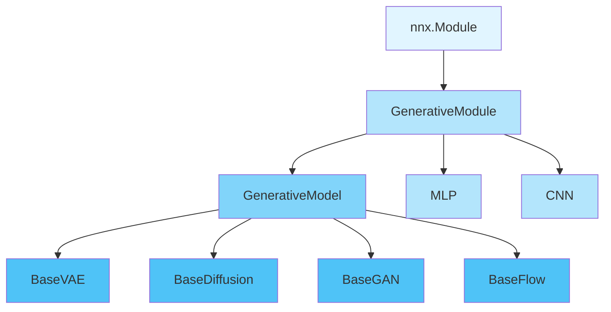
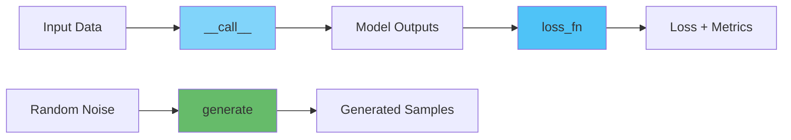

# Core Base Classes

The base module provides the foundational classes and utilities for all generative models in Artifex. These classes define common interfaces, helper utilities, and design patterns that ensure consistency across different model types.

## Overview

<div class="grid cards" markdown>

- :material-layers: **Modular Architecture**

    ---

    Clean separation between base abstractions and concrete implementations

- :material-puzzle: **Type-Safe Interfaces**

    ---

    Protocol-based design with full type checking support

- :material-cog: **Flax NNX Integration**

    ---

    Built on Flax NNX for modern neural network patterns

- :material-chart-tree: **Extensible Design**

    ---

    Easy to extend for custom model types and architectures

</div>

## Class Hierarchy



## Core Classes

### GenerativeModule

`GenerativeModule` is the base class for all generative model components. It extends Flax NNX's `Module` with Artifex-specific functionality.

**Location**: `src/artifex/generative_models/core/base.py:107`

#### Features

- Proper RNG handling through `nnx.Rngs`
- Precision control for numerical computations
- Default activation function management
- State management through NNX's Variable system

#### Basic Usage

```python
from flax import nnx
from artifex.generative_models.core.base import GenerativeModule

class CustomLayer(GenerativeModule):
    def __init__(
        self,
        features: int,
        *,
        rngs: nnx.Rngs,
        precision: jax.lax.Precision | None = None,
    ):
        # ALWAYS call super().__init__()
        super().__init__(rngs=rngs, precision=precision)

        # Initialize your components
        self.dense = nnx.Linear(
            in_features=64,
            out_features=features,
            rngs=rngs
        )

    def __call__(self, x: jax.Array) -> jax.Array:
        return self.dense(x)
```

#### Constructor Parameters

| Parameter | Type | Description |
|-----------|------|-------------|
| `rngs` | `nnx.Rngs` | Random number generators (keyword-only, required) |
| `precision` | `jax.lax.Precision \| None` | Numerical precision for computations (optional) |

---

### GenerativeModel

`GenerativeModel` is the unified base class for all generative models in Artifex. It provides a consistent interface that works across VAEs, GANs, Diffusion Models, Flow Models, and more.

**Location**: `src/artifex/generative_models/core/base.py:142`

#### Core Interface

Every generative model must implement three key methods:

1. **`__call__`**: Forward pass through the model
2. **`generate`**: Sample generation from the model
3. **`loss_fn`**: Loss computation for training



#### Method: `__call__`

The forward pass method processes input data and returns model-specific outputs.

**Signature:**

```python
def __call__(
    self,
    x: PyTree,
    *args,
    rngs: nnx.Rngs | None = None,
    training: bool = False,
    **kwargs
) -> dict[str, Any]:
    ...
```

**Parameters:**

| Parameter | Type | Description |
|-----------|------|-------------|
| `x` | `PyTree` | Input data (arrays, dicts, etc.) |
| `*args` | `Any` | Model-specific positional args (e.g., timesteps for diffusion) |
| `rngs` | `nnx.Rngs \| None` | Random number generators for stochastic operations |
| `training` | `bool` | Whether the model is in training mode |
| `**kwargs` | `Any` | Model-specific keyword arguments |

**Returns:**

A dictionary containing model outputs. Common keys include:

- **Diffusion models**: `{"predicted_noise": ..., "loss": ...}`
- **Flow models**: `{"z": ..., "logdet": ..., "log_prob": ...}`
- **VAEs**: `{"reconstruction": ..., "z": ..., "kl_loss": ...}`
- **GANs**: `{"generated": ..., "discriminator_logits": ...}`

**Example:**

```python
import jax
import jax.numpy as jnp
from flax import nnx

# Create a simple diffusion model
from artifex.generative_models.models.diffusion import DDPM

# Initialize RNGs
rngs = nnx.Rngs(0)

# Create model
model = DDPM(
    input_shape=(28, 28, 1),
    timesteps=1000,
    rngs=rngs
)

# Forward pass
batch = jnp.ones((4, 28, 28, 1))
timesteps = jnp.array([100, 200, 300, 400])

outputs = model(batch, timesteps, training=True, rngs=rngs)
print(f"Predicted noise shape: {outputs['predicted_noise'].shape}")
print(f"Loss: {outputs['loss']}")
```

#### Method: `generate`

Generate samples from the model distribution.

**Signature:**

```python
def generate(
    self,
    n_samples: int = 1,
    *,
    rngs: nnx.Rngs | None = None,
    **kwargs
) -> PyTree:
    ...
```

**Parameters:**

| Parameter | Type | Description |
|-----------|------|-------------|
| `n_samples` | `int` | Number of samples to generate |
| `rngs` | `nnx.Rngs \| None` | Random number generators |
| `**kwargs` | `Any` | Model-specific generation parameters |

**Common kwargs:**

- `condition`: Conditioning information for conditional models
- `shape`: Target shape for generated samples
- `steps`: Number of generation steps (for diffusion models)
- `temperature`: Sampling temperature

**Example:**

```python
# Generate 16 samples
samples = model.generate(n_samples=16, rngs=rngs)
print(f"Generated samples shape: {samples.shape}")  # (16, 28, 28, 1)

# Conditional generation (if model supports it)
conditions = jnp.array([0, 1, 2, 3])  # Class labels
conditional_samples = model.generate(
    n_samples=4,
    condition=conditions,
    rngs=rngs
)
```

#### Method: `loss_fn`

Compute the loss for model training.

**Signature:**

```python
def loss_fn(
    self,
    batch: PyTree,
    model_outputs: dict[str, Any],
    *,
    rngs: nnx.Rngs | None = None,
    **kwargs
) -> dict[str, Any]:
    ...
```

**Parameters:**

| Parameter | Type | Description |
|-----------|------|-------------|
| `batch` | `PyTree` | Batch of training data |
| `model_outputs` | `dict[str, Any]` | Outputs from forward pass |
| `rngs` | `nnx.Rngs \| None` | Random number generators |
| `**kwargs` | `Any` | Additional loss computation parameters |

**Returns:**

A dictionary containing at minimum:

- `"loss"`: Primary loss value for optimization

Additional keys may include component losses and metrics.

**Example:**

```python
# Compute loss for training
outputs = model(batch, timesteps, training=True, rngs=rngs)
loss_dict = model.loss_fn(batch, outputs, rngs=rngs)

print(f"Total loss: {loss_dict['loss']}")
print(f"Component losses: {loss_dict.keys()}")
```

#### Optional Methods

These methods provide additional functionality for specific model types:

**`encode(x)`** - Encode input to latent representation (VAEs, Flow models)

```python
# VAE encoding
latent = model.encode(batch, rngs=rngs)
print(f"Latent shape: {latent.shape}")
```

**`decode(z)`** - Decode latent representation to data space (VAEs, Flow models)

```python
# VAE decoding
reconstruction = model.decode(latent, rngs=rngs)
print(f"Reconstruction shape: {reconstruction.shape}")
```

**`log_prob(x)`** - Compute log probability of data (Flow models, VAEs)

```python
# Compute log probability
log_p = model.log_prob(batch, rngs=rngs)
print(f"Log probability shape: {log_p.shape}")
```

**`reconstruct(x)`** - Reconstruct input through encode-decode cycle (VAEs, Autoencoders)

```python
# Reconstruct data
reconstruction = model.reconstruct(batch, rngs=rngs)
loss = jnp.mean((batch - reconstruction) ** 2)
```

**`interpolate(x1, x2, alpha)`** - Interpolate between two data points

```python
# Linear interpolation in latent space
x1, x2 = batch[0], batch[1]
interpolated = model.interpolate(x1, x2, alpha=0.5, rngs=rngs)
```

---

## Helper Classes

### MLP (Multi-Layer Perceptron)

A memory-efficient, configurable MLP module with advanced features.

**Location**: `src/artifex/generative_models/core/base.py:372`

#### Features

<div class="grid cards" markdown>

- **Flexible Architecture**

    Arbitrary hidden dimensions with customizable activations

- **Memory Efficient**

    Lazy initialization and gradient checkpointing support

- **Batch Normalization**

    Optional batch norm between layers

- **Dropout**

    Configurable dropout with proper NNX integration

</div>

#### Basic Usage

```python
from artifex.generative_models.core.base import MLP
from flax import nnx

# Create RNGs
rngs = nnx.Rngs(0)

# Simple MLP
mlp = MLP(
    hidden_dims=[256, 128, 64],
    in_features=784,
    activation="gelu",
    rngs=rngs
)

# Forward pass
x = jnp.ones((32, 784))
output = mlp(x)
print(f"Output shape: {output.shape}")  # (32, 64)
```

#### Advanced Configuration

```python
# MLP with all features
advanced_mlp = MLP(
    hidden_dims=[512, 256, 128],
    in_features=784,
    activation="gelu",
    dropout_rate=0.1,
    use_bias=True,
    output_activation="tanh",
    use_batch_norm=True,
    use_gradient_checkpointing=False,
    rngs=rngs
)

# Forward with options
output = advanced_mlp(
    x,
    return_intermediates=False,
    use_scan=False,
    use_checkpointing=False
)
```

#### Constructor Parameters

| Parameter | Type | Default | Description |
|-----------|------|---------|-------------|
| `hidden_dims` | `list[int]` | Required | Output dimensions for each layer |
| `in_features` | `int` | Required | Input feature dimension |
| `activation` | `str \| Callable` | `"gelu"` | Activation function |
| `dropout_rate` | `float` | `0.0` | Dropout probability |
| `use_bias` | `bool` | `True` | Whether to use bias in linear layers |
| `output_activation` | `str \| Callable \| None` | `None` | Activation for final layer |
| `use_batch_norm` | `bool` | `False` | Use batch normalization |
| `use_gradient_checkpointing` | `bool` | `False` | Enable gradient checkpointing |
| `rngs` | `nnx.Rngs` | Required | Random number generators |

#### Supported Activations

```python
# Available activation functions
activations = [
    "relu", "gelu", "elu", "leaky_relu",
    "silu", "swish", "tanh", "sigmoid",
    "softmax", "log_softmax"
]

# Using custom activation
from flax import nnx

def custom_activation(x):
    return nnx.gelu(x) * 0.5

mlp = MLP(
    hidden_dims=[128, 64],
    in_features=256,
    activation=custom_activation,
    rngs=rngs
)
```

#### Memory-Efficient Deep Networks

For very deep networks (≥8 layers), MLP automatically uses scan-based computation:

```python
# Deep network (20 layers)
deep_mlp = MLP(
    hidden_dims=[256] * 20,
    in_features=512,
    activation="gelu",
    rngs=rngs
)

# Automatically uses memory-efficient scan
output = deep_mlp(x)  # Memory-efficient computation
```

#### Utility Methods

```python
# Get parameter count
num_params = mlp.get_num_params()
print(f"Total parameters: {num_params:,}")

# Reset dropout RNGs for reproducibility
new_rngs = nnx.Rngs(42)
mlp.reset_dropout(new_rngs)
```

---

### CNN (Convolutional Neural Network)

An enhanced CNN module with support for various convolution types.

**Location**: `src/artifex/generative_models/core/base.py:612`

#### Features

<div class="grid cards" markdown>

- **Multiple Convolution Types**

    Regular, transpose, depthwise separable, grouped convolutions

- **Flexible Configuration**

    Customizable kernel sizes, strides, and padding

- **Batch Normalization**

    Optional batch norm for training stability

- **Encoder/Decoder Support**

    Use transpose convolutions for decoder networks

</div>

#### Basic Usage

```python
from artifex.generative_models.core.base import CNN
from flax import nnx

# Create RNGs
rngs = nnx.Rngs(0)

# Simple CNN encoder
encoder = CNN(
    hidden_dims=[32, 64, 128],
    in_features=3,  # RGB channels
    activation="relu",
    kernel_size=(3, 3),
    strides=(2, 2),
    padding="SAME",
    rngs=rngs
)

# Forward pass
x = jnp.ones((16, 64, 64, 3))
features = encoder(x)
print(f"Features shape: {features.shape}")
```

#### Decoder with Transpose Convolutions

```python
# CNN decoder
decoder = CNN(
    hidden_dims=[64, 32, 3],
    in_features=128,
    activation="relu",
    kernel_size=(3, 3),
    strides=(2, 2),
    padding="SAME",
    use_transpose=True,  # Use transpose convolutions
    rngs=rngs
)

# Decode features
latent = jnp.ones((16, 8, 8, 128))
reconstructed = decoder(latent)
print(f"Reconstructed shape: {reconstructed.shape}")
```

#### Advanced Features

**Depthwise Separable Convolutions:**

```python
# Memory-efficient separable convolutions
efficient_cnn = CNN(
    hidden_dims=[64, 128, 256],
    in_features=3,
    activation="relu",
    use_depthwise_separable=True,  # Depthwise separable
    rngs=rngs
)
```

**Grouped Convolutions:**

```python
# Grouped convolutions (like ResNeXt)
grouped_cnn = CNN(
    hidden_dims=[64, 128, 256],
    in_features=64,
    activation="relu",
    groups=4,  # 4 groups
    rngs=rngs
)
```

**With Batch Normalization and Dropout:**

```python
# Full-featured CNN
full_cnn = CNN(
    hidden_dims=[64, 128, 256],
    in_features=3,
    activation="relu",
    use_batch_norm=True,
    dropout_rate=0.1,
    rngs=rngs
)
```

#### Constructor Parameters

| Parameter | Type | Default | Description |
|-----------|------|---------|-------------|
| `hidden_dims` | `list[int]` | Required | Output channels for each layer |
| `in_features` | `int` | Required | Input channels |
| `activation` | `str \| Callable` | `"relu"` | Activation function |
| `kernel_size` | `int \| tuple[int, int]` | `(3, 3)` | Convolution kernel size |
| `strides` | `int \| tuple[int, int]` | `(2, 2)` | Convolution strides |
| `padding` | `str \| int \| tuple[int, int]` | `"SAME"` | Padding strategy |
| `use_transpose` | `bool` | `False` | Use transpose convolutions |
| `use_batch_norm` | `bool` | `False` | Use batch normalization |
| `dropout_rate` | `float` | `0.0` | Dropout probability |
| `use_depthwise_separable` | `bool` | `False` | Use depthwise separable convolutions |
| `groups` | `int` | `1` | Number of groups for grouped convolutions |
| `rngs` | `nnx.Rngs` | Required | Random number generators |

---

## Utility Functions

### get_activation_function

Retrieve an activation function by name or pass through a callable.

**Location**: `src/artifex/generative_models/core/base.py:18`

```python
from artifex.generative_models.core.base import get_activation_function

# Get activation by name
relu = get_activation_function("relu")
gelu = get_activation_function("gelu")

# Pass through callable
custom = get_activation_function(lambda x: x ** 2)

# Use in model
x = jnp.array([1.0, -1.0, 2.0])
output = relu(x)
```

**Available Activations:**

- `"relu"`, `"gelu"`, `"elu"`, `"leaky_relu"`
- `"silu"`, `"swish"`, `"tanh"`, `"sigmoid"`
- `"softmax"`, `"log_softmax"`

### get_default_backbone

Create a default UNet backbone for diffusion models.

**Location**: `src/artifex/generative_models/core/base.py:56`

```python
from artifex.generative_models.core.base import get_default_backbone
from artifex.generative_models.core.configuration import ModelConfig

# Create configuration
config = ModelConfig(
    name="my_diffusion",
    model_class="artifex.generative_models.models.diffusion.DDPM",
    input_dim=(64, 64, 3),
    hidden_dims=[64, 128, 256],
)

# Get default backbone
backbone = get_default_backbone(config, rngs=rngs)
```

---

## Common Patterns

### Pattern 1: Creating Custom Models

```python
from artifex.generative_models.core.base import GenerativeModel
from flax import nnx
import jax.numpy as jnp

class MyCustomModel(GenerativeModel):
    """A custom generative model."""

    def __init__(
        self,
        latent_dim: int,
        *,
        rngs: nnx.Rngs,
    ):
        super().__init__(rngs=rngs)

        # Store configuration
        self.latent_dim = latent_dim

        # Initialize components
        self.encoder = nnx.Linear(784, latent_dim, rngs=rngs)
        self.decoder = nnx.Linear(latent_dim, 784, rngs=rngs)

    def __call__(
        self,
        x: jax.Array,
        *args,
        rngs: nnx.Rngs | None = None,
        training: bool = False,
        **kwargs
    ) -> dict[str, Any]:
        # Encode
        z = self.encoder(x)

        # Decode
        reconstruction = self.decoder(z)

        return {
            "reconstruction": reconstruction,
            "z": z,
        }

    def generate(
        self,
        n_samples: int = 1,
        *,
        rngs: nnx.Rngs | None = None,
        **kwargs
    ) -> jax.Array:
        # Sample from latent space
        if rngs is not None and "sample" in rngs:
            key = rngs.sample()
        else:
            key = jax.random.key(0)

        z = jax.random.normal(key, (n_samples, self.latent_dim))

        # Decode to data space
        return self.decoder(z)

    def loss_fn(
        self,
        batch: jax.Array,
        model_outputs: dict[str, Any],
        *,
        rngs: nnx.Rngs | None = None,
        **kwargs
    ) -> dict[str, Any]:
        reconstruction = model_outputs["reconstruction"]

        # Compute reconstruction loss
        recon_loss = jnp.mean((batch - reconstruction) ** 2)

        return {
            "loss": recon_loss,
            "reconstruction_loss": recon_loss,
        }
```

### Pattern 2: Using Helper Classes in Models

```python
from artifex.generative_models.core.base import GenerativeModel, MLP, CNN
from flax import nnx

class AdvancedVAE(GenerativeModel):
    """VAE with CNN encoder and MLP decoder."""

    def __init__(
        self,
        latent_dim: int,
        *,
        rngs: nnx.Rngs,
    ):
        super().__init__(rngs=rngs)

        # CNN encoder
        self.encoder_conv = CNN(
            hidden_dims=[32, 64, 128],
            in_features=3,
            activation="relu",
            rngs=rngs
        )

        # MLP encoder head
        self.encoder_head = MLP(
            hidden_dims=[256, latent_dim * 2],
            in_features=128 * 8 * 8,  # Flattened conv output
            activation="gelu",
            rngs=rngs
        )

        # MLP decoder
        self.decoder = MLP(
            hidden_dims=[256, 512, 32 * 32 * 3],
            in_features=latent_dim,
            activation="gelu",
            output_activation="sigmoid",
            rngs=rngs
        )

    def encode(self, x: jax.Array, *, rngs: nnx.Rngs | None = None) -> tuple[jax.Array, jax.Array]:
        # Convolutional features
        features = self.encoder_conv(x)

        # Flatten
        features = features.reshape(features.shape[0], -1)

        # Get mean and logvar
        params = self.encoder_head(features)
        mean, logvar = jnp.split(params, 2, axis=-1)

        return mean, logvar

    def decode(self, z: jax.Array, *, rngs: nnx.Rngs | None = None) -> jax.Array:
        # Decode through MLP
        output = self.decoder(z)

        # Reshape to image
        return output.reshape(-1, 32, 32, 3)
```

### Pattern 3: Proper RNG Handling

```python
from flax import nnx
import jax

class StochasticModel(GenerativeModel):
    """Model with stochastic layers."""

    def __call__(
        self,
        x: jax.Array,
        *args,
        rngs: nnx.Rngs | None = None,
        training: bool = False,
        **kwargs
    ) -> dict[str, Any]:
        # Check if specific RNG key exists
        if rngs is not None and "sample" in rngs:
            sample_key = rngs.sample()
        else:
            # Fallback for deterministic mode
            sample_key = jax.random.key(0)

        # Use the key for stochastic operations
        noise = jax.random.normal(sample_key, x.shape)

        # Process
        output = x + noise * 0.1

        return {"output": output}
```

---

## Best Practices

### DO

- ✅ Always call `super().__init__()` in constructors
- ✅ Use keyword-only arguments for `rngs` parameter
- ✅ Check if RNG keys exist before using them
- ✅ Provide fallback RNG keys for deterministic mode
- ✅ Use Flax NNX activations (`nnx.gelu`, `nnx.relu`)
- ✅ Return dictionaries from `__call__` and `loss_fn`
- ✅ Use type hints for all method signatures

### DON'T

- ❌ Use `rngs.get("key_name")` - check with `"key_name" in rngs`
- ❌ Use functional dropout `nnx.dropout()` - use `nnx.Dropout` class
- ❌ Forget to initialize dropout with `rngs` parameter
- ❌ Use numpy-based packages inside `nnx.Module` classes
- ❌ Use JAX activations (`jax.nn.gelu`) - use NNX versions

---

## Performance Tips

### Memory Efficiency

```python
# For deep MLPs (≥8 layers), enable gradient checkpointing
deep_mlp = MLP(
    hidden_dims=[512] * 20,
    in_features=1024,
    use_gradient_checkpointing=True,
    rngs=rngs
)

# Or use scan for automatic memory efficiency
output = deep_mlp(x, use_scan=True)
```

### Precision Control

```python
# Use mixed precision for faster training
model = GenerativeModel(
    rngs=rngs,
    precision=jax.lax.Precision.HIGH  # or DEFAULT, HIGHEST
)
```

### Depthwise Separable Convolutions

```python
# Reduce parameters and computation
efficient_cnn = CNN(
    hidden_dims=[64, 128, 256],
    in_features=3,
    use_depthwise_separable=True,  # Much more efficient
    rngs=rngs
)
```

---

## Troubleshooting

### Issue: "AttributeError: 'Rngs' object has no attribute 'get'"

**Solution:** Use `"key_name" in rngs` to check for key existence:

```python
# WRONG
if rngs is not None:
    key = rngs.get("sample")  # This will fail

# CORRECT
if rngs is not None and "sample" in rngs:
    key = rngs.sample()
else:
    key = jax.random.key(0)  # Fallback
```

### Issue: "TypeError: Missing required argument 'rngs'"

**Solution:** Always provide `rngs` as a keyword argument:

```python
# WRONG
model = MLP([256, 128], 784, rngs)

# CORRECT
model = MLP([256, 128], in_features=784, rngs=rngs)
```

### Issue: "Forgot to call super().**init**()"

**Solution:** Always call `super().__init__()` in your constructor:

```python
class MyModel(GenerativeModule):
    def __init__(self, *, rngs: nnx.Rngs):
        super().__init__(rngs=rngs)  # ALWAYS include this
        # ... rest of initialization
```

---

## Next Steps

<div class="grid cards" markdown>

- :material-cog-outline: **Configuration**

    ---

    Learn about the unified configuration system

    [:octicons-arrow-right-24: Configuration Guide](configuration.md)

- :material-chart-line: **Losses**

    ---

    Explore the loss function catalog

    [:octicons-arrow-right-24: Loss Functions](losses.md)

- :material-chip: **Device Management**

    ---

    Manage GPU/CPU/TPU devices effectively

    [:octicons-arrow-right-24: Device Manager](device-manager.md)

- :material-book-open: **Model Implementations**

    ---

    See concrete model implementations

    [:octicons-arrow-right-24: Models](../../models/index.md)

</div>

## References

- **Source Code**: `src/artifex/generative_models/core/base.py`
- **Tests**: `tests/artifex/generative_models/core/test_base.py`
- **Flax NNX Documentation**: [https://flax.readthedocs.io/en/latest/](https://flax.readthedocs.io/en/latest/)
