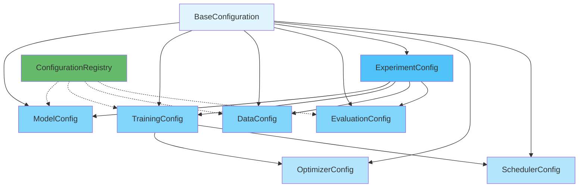

# Configuration System

Artifex provides a unified, type-safe configuration system built on Pydantic. This system replaces fragmented configuration approaches with a centralized, validated, and extensible framework.

## Overview

<div class="grid cards" markdown>

- :material-shield-check: **Type-Safe**

    ---

    Full Pydantic validation with automatic type checking

- :material-file-tree: **Hierarchical**

    ---

    Configuration inheritance and composition support

- :material-registry: **Centralized Registry**

    ---

    Global registry for configuration management

- :material-file-document: **YAML/JSON Support**

    ---

    Easy serialization and deserialization

</div>

## Configuration Architecture



---

## BaseConfiguration

The root class for all configurations, providing common functionality.

**Location**: `src/artifex/generative_models/core/configuration/unified.py:42`

### Core Fields

| Field | Type | Description |
|-------|------|-------------|
| `name` | `str` | Unique configuration name (required) |
| `type` | `ConfigurationType` | Configuration type (required) |
| `description` | `str \| None` | Human-readable description |
| `version` | `str` | Configuration version (default: "1.0.0") |
| `tags` | `list[str]` | Tags for categorization |
| `metadata` | `dict[str, Any]` | Non-functional metadata |

### Basic Usage

```python
from artifex.generative_models.core.configuration import (
    ModelConfig,
    ConfigurationType
)

# Create a basic configuration
config = ModelConfig(
    name="my_vae",
    model_class="artifex.generative_models.models.vae.VAE",
    input_dim=(28, 28, 1),
    description="VAE for MNIST",
    tags=["vae", "mnist", "baseline"]
)
```

### YAML Serialization

```python
from pathlib import Path

# Save to YAML
config.to_yaml("configs/my_vae.yaml")

# Load from YAML
loaded_config = ModelConfig.from_yaml("configs/my_vae.yaml")
```

**Example YAML:**

```yaml
name: my_vae
type: model
description: VAE for MNIST
version: 1.0.0
tags:
  - vae
  - mnist
  - baseline
model_class: artifex.generative_models.models.vae.VAE
input_dim:
  - 28
  - 28
  - 1
hidden_dims:
  - 256
  - 128
output_dim: 32
activation: gelu
dropout_rate: 0.1
parameters:
  beta: 1.0
  kl_weight: 0.5
```

### Configuration Merging

```python
# Base configuration
base_config = ModelConfig(
    name="base_vae",
    model_class="artifex.generative_models.models.vae.VAE",
    input_dim=(28, 28, 1),
    hidden_dims=[256, 128],
)

# Override specific fields
override_dict = {
    "hidden_dims": [512, 256, 128],
    "dropout_rate": 0.2,
}

# Merge configurations
merged_config = base_config.merge(override_dict)
print(merged_config.hidden_dims)  # [512, 256, 128]
print(merged_config.dropout_rate)  # 0.2
```

---

## ModelConfig

The primary configuration class for all generative models.

**Location**: `src/artifex/generative_models.core/configuration/unified.py:126`

### Architecture Fields

| Field | Type | Default | Description |
|-------|------|---------|-------------|
| `model_class` | `str` | Required | Fully qualified model class name |
| `input_dim` | `int \| tuple[int, ...]` | Required | Input dimensions |
| `hidden_dims` | `list[int]` | `[128, 256, 512]` | Hidden layer dimensions |
| `output_dim` | `int \| tuple[int, ...] \| None` | `None` | Output dimensions |
| `activation` | `str` | `"gelu"` | Activation function |
| `dropout_rate` | `float` | `0.1` | Dropout rate |
| `use_batch_norm` | `bool` | `True` | Use batch normalization |

### NNX-Specific Fields

| Field | Type | Default | Description |
|-------|------|---------|-------------|
| `rngs_seeds` | `dict[str, int]` | `{"params": 0, "dropout": 1}` | RNG seeds for NNX |

### Parameter Handling

!!! warning "Important: parameters vs metadata"
    Use `parameters` for **functional** configuration that affects model behavior.
    Use `metadata` for **non-functional** information like experiment tracking.

#### The `parameters` Field

For **functional** model-specific parameters:

```python
config = ModelConfig(
    name="beta_vae",
    model_class="artifex.generative_models.models.vae.BetaVAE",
    input_dim=(64, 64, 3),
    hidden_dims=[256, 512],
    output_dim=128,
    # Functional parameters that affect model behavior
    parameters={
        "beta": 4.0,                    # VAE β-parameter
        "kl_weight": 0.5,               # KL divergence weight
        "reconstruction_loss": "mse",   # Loss function type
        "use_free_bits": True,          # Free bits constraint
        "free_bits_lambda": 2.0,        # Free bits threshold
    }
)
```

#### The `metadata` Field

For **non-functional** tracking and documentation:

```python
config = ModelConfig(
    name="experiment_vae",
    model_class="artifex.generative_models.models.vae.VAE",
    input_dim=(28, 28, 1),
    hidden_dims=[256, 128],
    # Non-functional metadata
    metadata={
        "experiment_id": "exp_2024_001",
        "dataset_version": "v2.1",
        "author": "research_team",
        "notes": "Testing higher beta values",
        "hyperparameter_search_space": {
            "beta": [1.0, 2.0, 4.0, 8.0],
            "kl_weight": [0.1, 0.5, 1.0]
        }
    }
)
```

### Complete Example

```python
from artifex.generative_models.core.configuration import ModelConfig

config = ModelConfig(
    # Basic identification
    name="celeba_vae",
    description="VAE trained on CelebA dataset",
    version="1.0.0",
    tags=["vae", "celeba", "production"],

    # Model architecture
    model_class="artifex.generative_models.models.vae.VAE",
    input_dim=(64, 64, 3),
    hidden_dims=[64, 128, 256, 512],
    output_dim=256,

    # Training configuration
    activation="gelu",
    dropout_rate=0.1,
    use_batch_norm=True,

    # RNG seeds for reproducibility
    rngs_seeds={
        "params": 42,
        "dropout": 43,
        "sample": 44,
    },

    # Functional model parameters
    parameters={
        "beta": 1.0,
        "kl_weight": 0.5,
        "reconstruction_loss": "mse",
        "latent_distribution": "gaussian",
    },

    # Non-functional metadata
    metadata={
        "experiment_id": "celeba_baseline_001",
        "dataset_version": "v3.0",
        "created_at": "2024-01-15",
    }
)

# Validate and use
print(config.model_dump())
```

### Validation

ModelConfig includes automatic validation:

```python
# Valid activation
config = ModelConfig(
    name="valid_model",
    model_class="artifex.generative_models.models.vae.VAE",
    input_dim=(28, 28, 1),
    activation="gelu"  # ✓ Valid
)

# Invalid activation - raises ValidationError
try:
    config = ModelConfig(
        name="invalid_model",
        model_class="artifex.generative_models.models.vae.VAE",
        input_dim=(28, 28, 1),
        activation="invalid_activation"  # ✗ Invalid
    )
except ValidationError as e:
    print(f"Validation error: {e}")
```

**Valid activations:**

- `relu`, `gelu`, `swish`, `silu`
- `tanh`, `sigmoid`, `elu`, `leaky_relu`

---

## TrainingConfig

Configuration for model training.

**Location**: `src/artifex/generative_models/core/configuration/unified.py:323`

### Fields

| Field | Type | Default | Description |
|-------|------|---------|-------------|
| `batch_size` | `int` | `32` | Training batch size |
| `num_epochs` | `int` | `100` | Number of training epochs |
| `gradient_clip_norm` | `float \| None` | `1.0` | Gradient clipping norm |
| `optimizer` | `OptimizerConfig` | Required | Optimizer configuration |
| `scheduler` | `SchedulerConfig \| None` | `None` | LR scheduler configuration |

### Checkpointing

| Field | Type | Default | Description |
|-------|------|---------|-------------|
| `checkpoint_dir` | `Path` | `"./checkpoints"` | Checkpoint directory |
| `save_frequency` | `int` | `1000` | Save every N steps |
| `max_checkpoints` | `int` | `5` | Maximum checkpoints to keep |

### Logging

| Field | Type | Default | Description |
|-------|------|---------|-------------|
| `log_frequency` | `int` | `100` | Log every N steps |
| `use_wandb` | `bool` | `False` | Use Weights & Biases |
| `wandb_project` | `str \| None` | `None` | W&B project name |

### Complete Example

```python
from artifex.generative_models.core.configuration import (
    TrainingConfig,
    OptimizerConfig,
    SchedulerConfig,
)
from pathlib import Path

# Create optimizer configuration
optimizer = OptimizerConfig(
    name="adamw_optimizer",
    optimizer_type="adamw",
    learning_rate=1e-4,
    weight_decay=0.01,
    beta1=0.9,
    beta2=0.999,
    gradient_clip_norm=1.0,
)

# Create scheduler configuration
scheduler = SchedulerConfig(
    name="cosine_scheduler",
    scheduler_type="cosine",
    warmup_steps=1000,
    min_lr_ratio=0.1,
)

# Create training configuration
training_config = TrainingConfig(
    name="vae_training",
    batch_size=64,
    num_epochs=100,
    gradient_clip_norm=1.0,

    # Optimizer and scheduler
    optimizer=optimizer,
    scheduler=scheduler,

    # Checkpointing
    checkpoint_dir=Path("./checkpoints/vae_exp"),
    save_frequency=1000,
    max_checkpoints=5,

    # Logging
    log_frequency=100,
    use_wandb=True,
    wandb_project="vae-experiments",
)
```

---

## OptimizerConfig

Configuration for optimizers.

**Location**: `src/artifex/generative_models/core/configuration/unified.py:224`

### Core Fields

| Field | Type | Description |
|-------|------|-------------|
| `optimizer_type` | `str` | Type of optimizer |
| `learning_rate` | `float` | Learning rate (required, > 0) |
| `weight_decay` | `float` | Weight decay / L2 penalty |

### Adam/AdamW Parameters

| Field | Type | Default | Description |
|-------|------|---------|-------------|
| `beta1` | `float` | `0.9` | First moment decay |
| `beta2` | `float` | `0.999` | Second moment decay |
| `eps` | `float` | `1e-8` | Epsilon for stability |

### Gradient Clipping

| Field | Type | Default | Description |
|-------|------|---------|-------------|
| `gradient_clip_norm` | `float \| None` | `None` | Clip gradients by norm |
| `gradient_clip_value` | `float \| None` | `None` | Clip gradients by value |

### Examples

**AdamW:**

```python
optimizer = OptimizerConfig(
    name="adamw",
    optimizer_type="adamw",
    learning_rate=3e-4,
    weight_decay=0.01,
    beta1=0.9,
    beta2=0.999,
    eps=1e-8,
    gradient_clip_norm=1.0,
)
```

**SGD with Momentum:**

```python
optimizer = OptimizerConfig(
    name="sgd_momentum",
    optimizer_type="sgd",
    learning_rate=0.1,
    momentum=0.9,
    nesterov=True,
    gradient_clip_norm=5.0,
)
```

**Valid optimizer types:**

- `adam`, `adamw`, `sgd`, `rmsprop`
- `adagrad`, `lamb`, `radam`, `nadam`

---

## SchedulerConfig

Configuration for learning rate schedulers.

**Location**: `src/artifex/generative_models/core/configuration/unified.py:270`

### Core Fields

| Field | Type | Default | Description |
|-------|------|---------|-------------|
| `scheduler_type` | `str` | Required | Type of scheduler |
| `warmup_steps` | `int` | `0` | Number of warmup steps |
| `min_lr_ratio` | `float` | `0.0` | Minimum LR as ratio of initial LR |

### Scheduler-Specific Parameters

**Cosine Scheduler:**

```python
scheduler = SchedulerConfig(
    name="cosine",
    scheduler_type="cosine",
    warmup_steps=1000,
    min_lr_ratio=0.1,
    cycle_length=10000,  # Optional: restart cycle length
)
```

**Exponential Decay:**

```python
scheduler = SchedulerConfig(
    name="exponential",
    scheduler_type="exponential",
    decay_rate=0.95,
    decay_steps=1000,
)
```

**Linear Schedule:**

```python
scheduler = SchedulerConfig(
    name="linear",
    scheduler_type="linear",
    warmup_steps=500,
    total_steps=10000,
)
```

**Step Scheduler:**

```python
scheduler = SchedulerConfig(
    name="step",
    scheduler_type="step",
    step_size=1000,
    gamma=0.1,
)
```

**Valid scheduler types:**

- `constant`, `linear`, `cosine`, `exponential`
- `polynomial`, `step`, `multistep`, `cyclic`, `one_cycle`

---

## DataConfig

Configuration for data loading and preprocessing.

**Location**: `src/artifex/generative_models/core/configuration/unified.py:352`

### Dataset Fields

| Field | Type | Default | Description |
|-------|------|---------|-------------|
| `dataset_name` | `str` | Required | Name of the dataset |
| `data_dir` | `Path` | `"./data"` | Data directory |
| `split` | `str` | `"train"` | Data split to use |

### Processing Fields

| Field | Type | Default | Description |
|-------|------|---------|-------------|
| `num_workers` | `int` | `4` | Number of data loading workers |
| `prefetch_factor` | `int` | `2` | Prefetch factor |
| `pin_memory` | `bool` | `True` | Pin memory for GPU transfer |

### Augmentation

| Field | Type | Default | Description |
|-------|------|---------|-------------|
| `augmentation` | `bool` | `False` | Use data augmentation |
| `augmentation_params` | `dict[str, Any]` | `{}` | Augmentation parameters |

### Example

```python
from pathlib import Path
from artifex.generative_models.core.configuration import DataConfig

data_config = DataConfig(
    name="celeba_data",
    dataset_name="celeba",
    data_dir=Path("./data/celeba"),
    split="train",

    # Data loading
    num_workers=8,
    prefetch_factor=2,
    pin_memory=True,

    # Augmentation
    augmentation=True,
    augmentation_params={
        "horizontal_flip": True,
        "random_crop": (64, 64),
        "color_jitter": {
            "brightness": 0.2,
            "contrast": 0.2,
        }
    },

    # Validation split
    validation_split=0.1,
    test_split=0.1,
)
```

---

## EvaluationConfig

Configuration for evaluation and metrics.

**Location**: `src/artifex/generative_models/core/configuration/unified.py:399`

### Metrics

| Field | Type | Description |
|-------|------|-------------|
| `metrics` | `list[str]` | Metrics to compute (required) |
| `metric_params` | `dict[str, dict[str, Any]]` | Per-metric parameters |

### Settings

| Field | Type | Default | Description |
|-------|------|---------|-------------|
| `eval_batch_size` | `int` | `32` | Evaluation batch size |
| `num_eval_samples` | `int \| None` | `None` | Number of samples to evaluate |

### Output

| Field | Type | Default | Description |
|-------|------|---------|-------------|
| `save_predictions` | `bool` | `False` | Save model predictions |
| `save_metrics` | `bool` | `True` | Save computed metrics |
| `output_dir` | `Path` | `"./evaluation"` | Output directory |

### Example

```python
from artifex.generative_models.core.configuration import EvaluationConfig

eval_config = EvaluationConfig(
    name="vae_evaluation",

    # Metrics to compute
    metrics=["fid", "inception_score", "reconstruction_error"],

    # Per-metric parameters
    metric_params={
        "fid": {
            "num_samples": 10000,
            "batch_size": 50,
        },
        "inception_score": {
            "num_samples": 50000,
            "splits": 10,
        }
    },

    # Evaluation settings
    eval_batch_size=64,
    num_eval_samples=10000,

    # Output
    save_predictions=True,
    save_metrics=True,
    output_dir=Path("./results/evaluation"),
)
```

---

## ExperimentConfig

Complete experiment configuration that composes all other configurations.

**Location**: `src/artifex/generative_models/core/configuration/unified.py:420`

### Component Configurations

| Field | Type | Description |
|-------|------|-------------|
| `model_cfg` | `ModelConfig \| str` | Model configuration |
| `training_cfg` | `TrainingConfig \| str` | Training configuration |
| `data_cfg` | `DataConfig \| str` | Data configuration |
| `eval_cfg` | `EvaluationConfig \| str \| None` | Evaluation configuration |

### Experiment Settings

| Field | Type | Default | Description |
|-------|------|---------|-------------|
| `seed` | `int` | `42` | Random seed |
| `deterministic` | `bool` | `True` | Use deterministic algorithms |
| `output_dir` | `Path` | `"./experiments"` | Output directory |

### Tracking

| Field | Type | Default | Description |
|-------|------|---------|-------------|
| `track_carbon` | `bool` | `False` | Track carbon emissions |
| `track_memory` | `bool` | `False` | Track memory usage |

### Complete Example

```python
from artifex.generative_models.core.configuration import (
    ExperimentConfig,
    ModelConfig,
    TrainingConfig,
    OptimizerConfig,
    DataConfig,
)

# Define all component configurations
model_cfg = ModelConfig(
    name="vae_model",
    model_class="artifex.generative_models.models.vae.VAE",
    input_dim=(64, 64, 3),
    hidden_dims=[64, 128, 256],
    output_dim=128,
)

optimizer_cfg = OptimizerConfig(
    name="adamw",
    optimizer_type="adamw",
    learning_rate=1e-4,
    weight_decay=0.01,
)

training_cfg = TrainingConfig(
    name="training",
    batch_size=64,
    num_epochs=100,
    optimizer=optimizer_cfg,
)

data_cfg = DataConfig(
    name="celeba",
    dataset_name="celeba",
    data_dir=Path("./data/celeba"),
)

# Create experiment configuration
experiment = ExperimentConfig(
    name="celeba_vae_experiment",
    description="VAE training on CelebA dataset",

    # Component configurations
    model_cfg=model_cfg,
    training_cfg=training_cfg,
    data_cfg=data_cfg,

    # Experiment settings
    seed=42,
    deterministic=True,
    output_dir=Path("./experiments/celeba_vae"),

    # Tracking
    track_carbon=True,
    track_memory=True,
)

# Save complete experiment configuration
experiment.to_yaml("experiments/celeba_vae/config.yaml")
```

---

## ConfigurationRegistry

Global registry for managing configurations.

**Location**: `src/artifex/generative_models/core/configuration/unified.py:454`

### Basic Usage

```python
from artifex.generative_models.core.configuration import (
    ConfigurationRegistry,
    ModelConfig,
    ConfigurationType,
)

# Create registry
registry = ConfigurationRegistry()

# Register a configuration
config = ModelConfig(
    name="vae_v1",
    model_class="artifex.generative_models.models.vae.VAE",
    input_dim=(28, 28, 1),
)
registry.register(config)

# Retrieve configuration
retrieved = registry.get("vae_v1", ConfigurationType.MODEL)

# List all configurations
all_configs = registry.list_configs()
print(all_configs)  # ['model/vae_v1', ...]
```

### Templates

Create reusable configuration templates:

```python
# Register a template
template = {
    "model_class": "artifex.generative_models.models.vae.VAE",
    "hidden_dims": [256, 128],
    "activation": "gelu",
    "dropout_rate": 0.1,
}
registry.register_template("base_vae", template)

# Create configuration from template
config = registry.create_from_template(
    "base_vae",
    ModelConfig,
    name="my_vae",
    input_dim=(28, 28, 1),
    # Override template values
    hidden_dims=[512, 256, 128],
)
```

### Load from Directory

```python
# Load all configurations from a directory
registry.load_from_directory("./configs")

# Automatically loads:
# - model_*.yaml → ModelConfig
# - training_*.yaml → TrainingConfig
# - data_*.yaml → DataConfig
# - eval_*.yaml → EvaluationConfig
# - experiment_*.yaml → ExperimentConfig
```

### Global Registry Functions

```python
from artifex.generative_models.core.configuration import (
    register_config,
    get_config,
    list_configs,
)

# Register configuration globally
register_config(my_config)

# Get configuration from global registry
config = get_config("vae_v1", ConfigurationType.MODEL)

# List all configs
configs = list_configs(ConfigurationType.MODEL)
```

---

## Common Patterns

### Pattern 1: Configuration from YAML

```python
# Create YAML file: configs/my_model.yaml
```yaml
name: my_vae
type: model
model_class: artifex.generative_models.models.vae.VAE
input_dim: [64, 64, 3]
hidden_dims: [64, 128, 256]
output_dim: 128
parameters:
  beta: 1.0
  kl_weight: 0.5
```

```python
# Load configuration
config = ModelConfig.from_yaml("configs/my_model.yaml")

# Use in code
print(config.parameters["beta"])  # 1.0
```

### Pattern 2: Configuration Inheritance

```python
# Base configuration for all VAE experiments
base_vae = ModelConfig(
    name="base_vae",
    model_class="artifex.generative_models.models.vae.VAE",
    input_dim=(64, 64, 3),
    hidden_dims=[64, 128, 256],
    activation="gelu",
    dropout_rate=0.1,
)

# Experiment 1: Higher capacity
high_capacity = base_vae.merge({
    "name": "high_capacity_vae",
    "hidden_dims": [128, 256, 512, 1024],
    "output_dim": 512,
})

# Experiment 2: Different beta
beta_vae = base_vae.merge({
    "name": "beta_vae_4",
    "parameters": {"beta": 4.0},
})
```

### Pattern 3: Complete Experiment Setup

```python
def create_experiment_config(
    name: str,
    model_params: dict,
    training_params: dict,
) -> ExperimentConfig:
    """Create a complete experiment configuration."""

    # Model configuration
    model_cfg = ModelConfig(
        name=f"{name}_model",
        **model_params
    )

    # Optimizer
    optimizer_cfg = OptimizerConfig(
        name="adamw",
        optimizer_type="adamw",
        **training_params.get("optimizer", {})
    )

    # Training configuration
    training_cfg = TrainingConfig(
        name=f"{name}_training",
        optimizer=optimizer_cfg,
        **{k: v for k, v in training_params.items() if k != "optimizer"}
    )

    # Data configuration
    data_cfg = DataConfig(
        name=f"{name}_data",
        dataset_name=training_params.get("dataset", "mnist"),
    )

    # Experiment
    return ExperimentConfig(
        name=name,
        model_cfg=model_cfg,
        training_cfg=training_cfg,
        data_cfg=data_cfg,
        seed=42,
    )

# Use the factory
experiment = create_experiment_config(
    name="vae_exp_001",
    model_params={
        "model_class": "artifex.generative_models.models.vae.VAE",
        "input_dim": (28, 28, 1),
        "hidden_dims": [256, 128],
    },
    training_params={
        "batch_size": 64,
        "num_epochs": 100,
        "optimizer": {
            "learning_rate": 1e-4,
            "weight_decay": 0.01,
        },
        "dataset": "mnist",
    }
)
```

---

## Best Practices

### DO

- ✅ Use `parameters` for functional model configuration
- ✅ Use `metadata` for non-functional tracking information
- ✅ Validate configurations with Pydantic before training
- ✅ Save configurations with experiments for reproducibility
- ✅ Use YAML files for human-readable configurations
- ✅ Use configuration registry for managing multiple configs
- ✅ Create configuration templates for common patterns

### DON'T

- ❌ Store model parameters in `metadata` field
- ❌ Use nested dictionaries for model parameters (use `parameters` field)
- ❌ Skip validation - let Pydantic catch errors early
- ❌ Hard-code configuration values in training scripts
- ❌ Forget to version your configurations

---

## Troubleshooting

### Issue: "ValidationError: Invalid activation"

**Solution:** Use one of the supported activation functions:

```python
# Valid
config = ModelConfig(
    ...,
    activation="gelu"  # ✓
)

# Invalid
config = ModelConfig(
    ...,
    activation="custom_act"  # ✗ - not in valid list
)
```

### Issue: "Configuration merge not working as expected"

**Solution:** Understand deep merge behavior:

```python
config1 = ModelConfig(
    name="base",
    ...,
    parameters={"beta": 1.0, "kl_weight": 0.5}
)

# This replaces the entire parameters dict
merged = config1.merge({"parameters": {"beta": 2.0}})
print(merged.parameters)  # {"beta": 2.0} - kl_weight is gone!

# To preserve keys, merge at parameter level
merged = config1.merge({
    "parameters": {
        **config1.parameters,
        "beta": 2.0
    }
})
print(merged.parameters)  # {"beta": 2.0, "kl_weight": 0.5} ✓
```

### Issue: "Extra fields not allowed"

**Solution:** Pydantic forbids extra fields by default. Use the correct fields:

```python
# Wrong - unknown_field is not defined
config = ModelConfig(
    name="test",
    ...,
    unknown_field="value"  # ✗ ValidationError
)

# Correct - use metadata for custom fields
config = ModelConfig(
    name="test",
    ...,
    metadata={"unknown_field": "value"}  # ✓
)
```

---

## Next Steps

<div class="grid cards" markdown>

- :material-layers: **Base Classes**

    ---

    Learn about the base model architecture

    [:octicons-arrow-right-24: Base Classes](base.md)

- :material-chart-line: **Losses**

    ---

    Explore the loss function catalog

    [:octicons-arrow-right-24: Loss Functions](losses.md)

- :material-book-open: **Training**

    ---

    See how to use configurations in training

    [:octicons-arrow-right-24: Training Guide](../../training/index.md)

</div>

## References

- **Source Code**: `src/artifex/generative_models/core/configuration/unified.py`
- **Tests**: `tests/artifex/generative_models/core/configuration/test_unified.py`
- **Pydantic Documentation**: [https://docs.pydantic.dev/](https://docs.pydantic.dev/)
