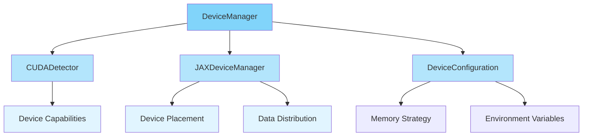

# Device Management

Artifex provides a comprehensive device management system for efficiently utilizing GPUs, TPUs, and CPUs. The system automatically detects hardware capabilities, configures JAX appropriately, and provides utilities for distributed computing.

## Overview

<div class="grid cards" markdown>

- :material-chip: **Auto-Detection**

    ---

    Automatic detection of available compute devices

- :material-memory: **Memory Management**

    ---

    Configurable memory allocation strategies

- :material-speedometer: **Performance Tuning**

    ---

    Optimized configurations for different model sizes

- :material-server-network: **Multi-Device Support**

    ---

    Seamless scaling across multiple devices

</div>

## Architecture



**Location**: `src/artifex/generative_models/core/device_manager.py`

---

## Quick Start

### Basic Usage

```python
from artifex.generative_models.core.device_manager import DeviceManager

# Create device manager with default configuration
device_manager = DeviceManager()

# Check available devices
print(f"Has GPU: {device_manager.has_gpu}")
print(f"Device count: {device_manager.device_count}")
print(f"GPU count: {device_manager.gpu_count}")

# Get device information
info = device_manager.get_device_info()
print(f"Backend: {info['backend']}")
print(f"Default device: {info['default_device']}")
```

### Getting Default Device

```python
from artifex.generative_models.core.device_manager import get_default_device

# Get default compute device
device = get_default_device()
print(f"Using device: {device}")

# Place data on device
import jax
x = jax.device_put(jnp.ones((100, 100)), device)
```

---

## DeviceConfiguration

Configure device behavior with memory strategies and environment variables.

### Memory Strategies

| Strategy | Memory Fraction | Use Case |
|----------|----------------|----------|
| `CONSERVATIVE` | 60% | Small models, shared GPUs |
| `BALANCED` | 75% | Default, most use cases |
| `AGGRESSIVE` | 90% | Large models, dedicated GPUs |
| `CUSTOM` | User-defined | Special requirements |

### Basic Configuration

```python
from artifex.generative_models.core.device_manager import (
    DeviceManager,
    DeviceConfiguration,
    MemoryStrategy
)

# Conservative memory usage (60%)
config = DeviceConfiguration(
    memory_strategy=MemoryStrategy.CONSERVATIVE,
    enable_x64=False,
    enable_jit=True
)

device_manager = DeviceManager(config)
```

### Custom Memory Fraction

```python
# Specify exact memory fraction
config = DeviceConfiguration(
    memory_strategy=MemoryStrategy.CUSTOM,
    memory_fraction=0.8,  # Use 80% of GPU memory
    enable_x64=False
)

device_manager = DeviceManager(config)
```

### Platform Priority

```python
# Specify device priority
config = DeviceConfiguration(
    platform_priority=["cuda", "cpu"],  # Prefer CUDA over CPU
    memory_strategy=MemoryStrategy.BALANCED
)

device_manager = DeviceManager(config)
```

### Environment Variables

```python
# Custom JAX environment configuration
config = DeviceConfiguration(
    environment_variables={
        "XLA_PYTHON_CLIENT_PREALLOCATE": "false",
        "XLA_FLAGS": "--xla_gpu_cuda_data_dir=/usr/local/cuda",
    }
)

device_manager = DeviceManager(config)
```

---

## DeviceCapabilities

Information about detected hardware capabilities.

```python
# Get device capabilities
capabilities = device_manager.capabilities

print(f"Device type: {capabilities.device_type}")
print(f"Device count: {capabilities.device_count}")
print(f"Total memory: {capabilities.total_memory_mb} MB")
print(f"CUDA version: {capabilities.cuda_version}")
print(f"Compute capability: {capabilities.compute_capability}")
print(f"Mixed precision support: {capabilities.supports_mixed_precision}")
print(f"Distributed support: {capabilities.supports_distributed}")
```

### Fields

| Field | Type | Description |
|-------|------|-------------|
| `device_type` | `DeviceType` | CPU, GPU, or TPU |
| `device_count` | `int` | Number of available devices |
| `total_memory_mb` | `int \| None` | Total memory in MB (GPU only) |
| `compute_capability` | `str \| None` | CUDA compute capability |
| `cuda_version` | `str \| None` | CUDA version |
| `driver_version` | `str \| None` | GPU driver version |
| `supports_mixed_precision` | `bool` | Mixed precision support |
| `supports_distributed` | `bool` | Multi-device support |

---

## JAXDeviceManager

Low-level JAX device management and data distribution.

### Getting Devices

```python
# Access JAX device manager
jax_manager = device_manager.jax_manager

# Get all devices
all_devices = jax_manager.devices
print(f"All devices: {all_devices}")

# Get GPU devices only
gpu_devices = jax_manager.gpu_devices
print(f"GPU devices: {gpu_devices}")

# Get CPU devices
cpu_devices = jax_manager.cpu_devices
print(f"CPU devices: {cpu_devices}")

# Get default device
default_device = jax_manager.get_default_device()
print(f"Default: {default_device}")
```

### Data Distribution

Distribute data across multiple devices for parallel processing.

```python
import jax.numpy as jnp

# Create data
data = jnp.ones((128, 224, 224, 3))

# Distribute across all GPU devices
distributed_data = jax_manager.distribute_data(data)

print(f"Original shape: {data.shape}")
print(f"Shards: {len(distributed_data)}")
for i, shard in enumerate(distributed_data):
    print(f"  Shard {i}: {shard.shape} on {shard.device()}")
```

### Custom Device Selection

```python
# Distribute to specific devices
target_devices = jax_manager.gpu_devices[:2]  # First 2 GPUs
distributed = jax_manager.distribute_data(data, target_devices=target_devices)
```

---

## Convenience Functions

### Global Device Manager

Get the global singleton device manager instance.

```python
from artifex.generative_models.core.device_manager import get_device_manager

# Get global instance
dm = get_device_manager()

# Force re-initialization with new config
config = DeviceConfiguration(memory_strategy=MemoryStrategy.AGGRESSIVE)
dm = get_device_manager(config, force_reinit=True)
```

### Check GPU Availability

```python
from artifex.generative_models.core.device_manager import has_gpu

if has_gpu():
    print("GPU is available!")
else:
    print("Running on CPU")
```

### Get Default Device

```python
from artifex.generative_models.core.device_manager import get_default_device
import jax

device = get_default_device()

# Use device for computations
x = jax.device_put(jnp.ones((100, 100)), device)
```

### Print Device Information

```python
from artifex.generative_models.core.device_manager import print_device_info

# Print comprehensive device information
print_device_info()
```

**Example output:**

```
🔍 Artifex Device Manager
========================================
Backend: gpu
Device Type: gpu
Device Count: 2
GPU Count: 2
Memory Strategy: balanced
Memory Fraction: 0.75
Default Device: gpu:0
CUDA Version: 12.1
Compute Capability: 8.6
```

---

## Optimized Configurations

### For Generative Models

Pre-configured settings optimized for generative modeling.

```python
from artifex.generative_models.core.device_manager import configure_for_generative_models

# Optimized for generative models
dm = configure_for_generative_models(
    memory_strategy=MemoryStrategy.BALANCED,
    enable_mixed_precision=True
)
```

### For Model Size

Automatically choose optimal configuration based on parameter count.

```python
# Get optimized config for model size
model_params = 150_000_000  # 150M parameters

optimal_config = device_manager.optimize_for_model_size(model_params)
print(f"Recommended strategy: {optimal_config.memory_strategy}")
```

**Guidelines:**

- < 1M parameters → CONSERVATIVE
- < 100M parameters → BALANCED
- ≥ 100M parameters → AGGRESSIVE

---

## Common Patterns

### Pattern 1: Training Setup

```python
from artifex.generative_models.core.device_manager import (
    DeviceManager,
    DeviceConfiguration,
    MemoryStrategy
)

def setup_training_environment(model_size: int):
    """Setup optimal training environment."""
    # Create device manager
    config = DeviceConfiguration(
        memory_strategy=MemoryStrategy.BALANCED,
        enable_jit=True,
        platform_priority=["cuda", "cpu"]
    )

    dm = DeviceManager(config)

    # Optimize for model size
    optimal_config = dm.optimize_for_model_size(model_size)

    # Reinitialize with optimal config
    dm = DeviceManager(optimal_config)

    print(f"Training on: {dm.jax_manager.get_default_device()}")
    print(f"GPU count: {dm.gpu_count}")
    print(f"Memory strategy: {dm.config.memory_strategy.value}")

    return dm

# Use in training
dm = setup_training_environment(model_size=50_000_000)
```

### Pattern 2: Multi-GPU Data Parallel

```python
import jax
from flax import nnx

def setup_data_parallel(model, batch_size: int):
    """Setup data parallel training."""
    dm = DeviceManager()

    if dm.gpu_count > 1:
        print(f"Using {dm.gpu_count} GPUs for data parallel training")

        # Distribute batch across GPUs
        per_device_batch_size = batch_size // dm.gpu_count

        def replicate_model(model):
            """Replicate model on all devices."""
            replicated = []
            for device in dm.jax_manager.gpu_devices:
                model_copy = jax.device_put(model, device)
                replicated.append(model_copy)
            return replicated

        return replicate_model(model), per_device_batch_size
    else:
        print("Single GPU training")
        return [model], batch_size
```

### Pattern 3: Mixed Precision Training

```python
def setup_mixed_precision():
    """Setup mixed precision training if supported."""
    dm = DeviceManager()

    if dm.capabilities.supports_mixed_precision:
        print("Mixed precision training enabled")

        # Configure for mixed precision
        config = DeviceConfiguration(
            memory_strategy=MemoryStrategy.AGGRESSIVE,
            enable_x64=False,  # Use float32/float16
        )

        return DeviceManager(config)
    else:
        print("Mixed precision not supported")
        return dm
```

### Pattern 4: Graceful CPU Fallback

```python
def create_model_with_fallback(model_cls, *args, **kwargs):
    """Create model with automatic device selection."""
    dm = DeviceManager()

    if dm.has_gpu:
        print("Creating model on GPU")
        device = dm.jax_manager.gpu_devices[0]
    else:
        print("No GPU found, falling back to CPU")
        device = dm.jax_manager.cpu_devices[0]

    # Create model on selected device
    with jax.default_device(device):
        model = model_cls(*args, **kwargs)

    return model, device
```

---

## Performance Tips

### Memory Optimization

```python
# Start with conservative, increase if needed
config = DeviceConfiguration(
    memory_strategy=MemoryStrategy.CONSERVATIVE
)

# Monitor memory usage
dm = DeviceManager(config)

# If successful, try balanced
if training_successful:
    config.memory_strategy = MemoryStrategy.BALANCED
    dm = DeviceManager(config)
```

### JIT Compilation

```python
# Enable JIT for faster computation
config = DeviceConfiguration(
    enable_jit=True,
    memory_strategy=MemoryStrategy.BALANCED
)

dm = DeviceManager(config)

# Disable for debugging
config.enable_jit = False
```

### Environment Tuning

```python
# Fine-tune XLA compilation
config = DeviceConfiguration(
    environment_variables={
        "XLA_FLAGS": " ".join([
            "--xla_gpu_enable_fast_min_max=true",
            "--xla_gpu_enable_triton_softmax_fusion=true",
            "--xla_gpu_triton_gemm_any=True",
        ])
    }
)
```

---

## Troubleshooting

### Issue: "Out of Memory (OOM) Errors"

**Solutions:**

1. **Reduce memory fraction:**

```python
config = DeviceConfiguration(
    memory_strategy=MemoryStrategy.CONSERVATIVE,
    memory_fraction=0.5  # Use only 50% of GPU memory
)
```

2. **Enable gradient checkpointing:**

```python
# In your model
from artifex.generative_models.core.base import MLP

mlp = MLP(
    hidden_dims=[512] * 20,
    in_features=1024,
    use_gradient_checkpointing=True,  # Trade compute for memory
    rngs=rngs
)
```

3. **Reduce batch size:**

```python
# Use smaller batches per device
batch_size = 32 // dm.gpu_count
```

### Issue: "CUDA Out of Memory Despite Low Reported Usage"

**Solution:** JAX preallocates memory. Disable preallocation:

```python
config = DeviceConfiguration(
    environment_variables={
        "XLA_PYTHON_CLIENT_PREALLOCATE": "false",
    }
)
```

### Issue: "No GPU Detected"

**Diagnostic:**

```python
dm = DeviceManager()

if not dm.has_gpu:
    print("GPU not detected. Possible issues:")
    print("1. CUDA not installed")
    print("2. JAX not built with CUDA support")
    print("3. GPU drivers not installed")
    print("4. CUDA version mismatch")

# Check CUDA installation
import subprocess
try:
    result = subprocess.run(["nvidia-smi"], capture_output=True, text=True)
    print(result.stdout)
except FileNotFoundError:
    print("nvidia-smi not found - CUDA may not be installed")
```

### Issue: "Slow First Iteration"

**Explanation:** JAX compiles on first run (JIT compilation).

**Solution:** Warmup with dummy data:

```python
# Warmup model
@nnx.jit
def warmup(model, x):
    return model(x)

# Run once to compile
dummy_input = jnp.ones((1, 28, 28, 1))
_ = warmup(model, dummy_input)

# Now training will be fast
for batch in training_data:
    loss = train_step(model, batch)
```

---

## Best Practices

### DO

- ✅ Use `DeviceManager` for automatic device detection
- ✅ Start with `BALANCED` memory strategy
- ✅ Enable JIT compilation for production
- ✅ Test on CPU first, then move to GPU
- ✅ Use `print_device_info()` to verify setup
- ✅ Monitor memory usage during training
- ✅ Use conservative settings for shared GPUs

### DON'T

- ❌ Hard-code device strings (`"gpu:0"`)
- ❌ Assume GPU is always available
- ❌ Use `AGGRESSIVE` strategy on shared systems
- ❌ Disable JIT compilation in production
- ❌ Forget to handle CPU fallback
- ❌ Preallocate memory unnecessarily

---

## Advanced: Custom Detector

Implement custom device detection logic.

```python
from artifex.generative_models.core.device_manager import (
    DeviceDetector,
    DeviceCapabilities,
    DeviceType
)

class CustomDetector:
    """Custom device detector."""

    def detect_capabilities(self) -> DeviceCapabilities:
        """Detect custom hardware."""
        # Custom detection logic
        return DeviceCapabilities(
            device_type=DeviceType.GPU,
            device_count=4,
            total_memory_mb=80000,
            compute_capability="8.0",
            supports_mixed_precision=True,
            supports_distributed=True
        )

# Use custom detector
detector = CustomDetector()
dm = DeviceManager(detector=detector)
```

---

## Next Steps

<div class="grid cards" markdown>

- :material-layers: **Base Classes**

    ---

    Learn about model architecture

    [:octicons-arrow-right-24: Base Classes](base.md)

- :material-cog-outline: **Configuration**

    ---

    Configure models and training

    [:octicons-arrow-right-24: Configuration](configuration.md)

- :material-book-open: **Training**

    ---

    Use device manager in training

    [:octicons-arrow-right-24: Training Guide](../../training/index.md)

- :material-rocket-launch: **Distributed Training**

    ---

    Scale across multiple devices

    [:octicons-arrow-right-24: Distributed Guide](../../scaling/index.md)

</div>

## References

- **Source Code**: `src/artifex/generative_models/core/device_manager.py`
- **Tests**: `tests/artifex/generative_models/core/test_device_manager.py`
- **JAX Device Documentation**: [https://jax.readthedocs.io/en/latest/](https://jax.readthedocs.io/en/latest/)
- **CUDA Toolkit**: [https://developer.nvidia.com/cuda-toolkit](https://developer.nvidia.com/cuda-toolkit)
