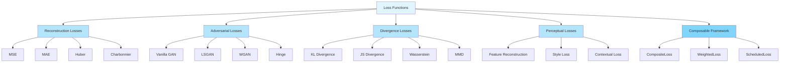

# Loss Functions

Artifex provides a comprehensive catalog of loss functions for training generative models. These losses are organized into categories based on their purpose and mathematical foundation.

## Overview

<div class="grid cards" markdown>

- :material-chart-line: **40+ Loss Functions**

    ---

    Extensive catalog covering all generative model types

- :material-link-variant: **Composable Framework**

    ---

    Easily combine multiple losses with weights and scheduling

- :material-speedometer: **JAX-Optimized**

    ---

    Fully JIT-compatible and vectorized implementations

- :material-math-integral: **Numerically Stable**

    ---

    Careful handling of edge cases and numerical precision

</div>

## Loss Categories



---

## Reconstruction Losses

Reconstruction losses compare predictions directly with targets, typically used in autoencoders and regression tasks.

**Location**: `src/artifex/generative_models/core/losses/reconstruction.py`

### mse_loss (L2 Loss)

Mean Squared Error - penalizes squared differences between predictions and targets.

```python
from artifex.generative_models.core.losses.reconstruction import mse_loss
import jax.numpy as jnp

predictions = jnp.array([1.0, 2.0, 3.0])
targets = jnp.array([1.1, 1.9, 3.2])

loss = mse_loss(predictions, targets, reduction="mean")
print(f"MSE Loss: {loss}")  # 0.0233...
```

**Parameters:**

| Parameter | Type | Default | Description |
|-----------|------|---------|-------------|
| `predictions` | `jax.Array` | Required | Model predictions |
| `targets` | `jax.Array` | Required | Ground truth values |
| `reduction` | `str` | `"mean"` | Reduction: "none", "mean", "sum" |
| `weights` | `jax.Array \| None` | `None` | Optional per-element weights |
| `axis` | `int \| tuple \| None` | `None` | Axis for reduction |

**Use Cases:**

- VAE reconstruction loss
- Image regression
- General reconstruction tasks

---

### mae_loss (L1 Loss)

Mean Absolute Error - more robust to outliers than MSE.

```python
from artifex.generative_models.core.losses.reconstruction import mae_loss

loss = mae_loss(predictions, targets, reduction="mean")
print(f"MAE Loss: {loss}")  # 0.133...
```

**Use Cases:**

- Robust regression
- Outlier-heavy datasets
- Image reconstruction with noise

---

### huber_loss

Smooth combination of L1 and L2 losses - quadratic for small errors, linear for large errors.

```python
from artifex.generative_models.core.losses.reconstruction import huber_loss

# Delta controls the transition point
loss = huber_loss(predictions, targets, delta=1.0, reduction="mean")
```

**Parameters:**

| Parameter | Type | Default | Description |
|-----------|------|---------|-------------|
| `delta` | `float` | `1.0` | Threshold between quadratic and linear regions |

**Use Cases:**

- Robust regression with outliers
- Reinforcement learning (value functions)
- Object detection

---

### charbonnier_loss

Differentiable variant of L1 loss with smoother gradients.

```python
from artifex.generative_models.core.losses.reconstruction import charbonnier_loss

loss = charbonnier_loss(
    predictions,
    targets,
    epsilon=1e-3,  # Smoothing constant
    alpha=1.0,     # Exponent
    reduction="mean"
)
```

**Use Cases:**

- Optical flow estimation
- Image super-resolution
- Smooth optimization landscapes

---

### psnr_loss

Peak Signal-to-Noise Ratio expressed as a loss (negative PSNR).

```python
from artifex.generative_models.core.losses.reconstruction import psnr_loss

# For normalized images (0-1)
loss = psnr_loss(pred_images, target_images, max_value=1.0)

# For images in range [0, 255]
loss = psnr_loss(pred_images, target_images, max_value=255.0)
```

**Use Cases:**

- Image quality assessment
- Super-resolution evaluation
- Compression evaluation

---

## Adversarial Losses

Adversarial losses for training GANs and adversarial networks.

**Location**: `src/artifex/generative_models/core/losses/adversarial.py`

### Vanilla GAN Losses

Original GAN formulation with binary cross-entropy.

```python
from artifex.generative_models.core.losses.adversarial import (
    vanilla_generator_loss,
    vanilla_discriminator_loss
)

# Generator loss: -log(D(G(z)))
g_loss = vanilla_generator_loss(fake_scores)

# Discriminator loss: -log(D(x)) - log(1 - D(G(z)))
d_loss = vanilla_discriminator_loss(real_scores, fake_scores)
```

**Pros:** Simple, well-studied
**Cons:** Vanishing gradients, mode collapse

---

### LSGAN Losses

Least Squares GAN - uses mean squared error instead of cross-entropy.

```python
from artifex.generative_models.core.losses.adversarial import (
    least_squares_generator_loss,
    least_squares_discriminator_loss
)

# Generator: minimize (D(G(z)) - 1)^2
g_loss = least_squares_generator_loss(
    fake_scores,
    target_real=1.0
)

# Discriminator: minimize (D(x) - 1)^2 + (D(G(z)) - 0)^2
d_loss = least_squares_discriminator_loss(
    real_scores,
    fake_scores,
    target_real=1.0,
    target_fake=0.0
)
```

**Pros:** More stable training, better gradients
**Cons:** May require more careful tuning

---

### Wasserstein GAN Losses

Wasserstein distance-based losses with better convergence properties.

```python
from artifex.generative_models.core.losses.adversarial import (
    wasserstein_generator_loss,
    wasserstein_discriminator_loss
)

# Generator: minimize -D(G(z))
g_loss = wasserstein_generator_loss(fake_scores)

# Critic: minimize D(G(z)) - D(x)
d_loss = wasserstein_discriminator_loss(real_scores, fake_scores)

# Note: Requires gradient penalty or weight clipping
```

**Pros:** Stable training, meaningful loss curves
**Cons:** Requires gradient penalty or weight clipping

---

### Hinge Losses

Hinge loss formulation used in spectral normalization GANs.

```python
from artifex.generative_models.core.losses.adversarial import (
    hinge_generator_loss,
    hinge_discriminator_loss
)

# Generator: -D(G(z))
g_loss = hinge_generator_loss(fake_scores)

# Discriminator: max(0, 1 - D(x)) + max(0, 1 + D(G(z)))
d_loss = hinge_discriminator_loss(real_scores, fake_scores)
```

**Pros:** Stable, works well with spectral normalization
**Cons:** May need careful architecture design

---

## Divergence Losses

Statistical divergence measures between probability distributions.

**Location**: `src/artifex/generative_models/core/losses/divergence.py`

### kl_divergence

Kullback-Leibler divergence - measures information loss.

```python
from artifex.generative_models.core.losses.divergence import kl_divergence
import distrax

# With distribution objects
p = distrax.Normal(loc=0.0, scale=1.0)
q = distrax.Normal(loc=0.5, scale=1.5)
kl = kl_divergence(p, q)

# With probability arrays
p_probs = jnp.array([0.2, 0.5, 0.3])
q_probs = jnp.array([0.3, 0.4, 0.3])
kl = kl_divergence(p_probs, q_probs, reduction="sum")
```

**Formula:** KL(P||Q) = Σ P(x) log(P(x) / Q(x))

**Use Cases:**

- VAE latent regularization
- Distribution matching
- Information theory applications

---

### js_divergence

Jensen-Shannon divergence - symmetric variant of KL divergence.

```python
from artifex.generative_models.core.losses.divergence import js_divergence

p = jnp.array([0.2, 0.5, 0.3])
q = jnp.array([0.1, 0.7, 0.2])
js = js_divergence(p, q)
```

**Formula:** JS(P||Q) = 0.5 *(KL(P||M) + KL(Q||M)) where M = 0.5* (P + Q)

**Properties:**

- Symmetric: JS(P||Q) = JS(Q||P)
- Bounded: 0 ≤ JS ≤ log(2)
- Metric (satisfies triangle inequality)

---

### wasserstein_distance

Earth Mover's Distance - optimal transport-based metric.

```python
from artifex.generative_models.core.losses.divergence import wasserstein_distance

# 1D samples
p_samples = jnp.array([[1.0, 2.0, 3.0], [4.0, 5.0, 6.0]])
q_samples = jnp.array([[1.5, 2.5, 3.5], [4.5, 5.5, 6.5]])

# W1 distance
w1 = wasserstein_distance(p_samples, q_samples, p=1, axis=1)

# W2 distance
w2 = wasserstein_distance(p_samples, q_samples, p=2, axis=1)
```

**Use Cases:**

- GAN training (WGAN)
- Distribution comparison
- Robust statistics

---

### maximum_mean_discrepancy

Kernel-based distribution distance measure.

```python
from artifex.generative_models.core.losses.divergence import maximum_mean_discrepancy
import jax

# Generate samples
key = jax.random.key(0)
pred_samples = jax.random.normal(key, (2, 100, 5))
target_samples = jax.random.normal(key, (2, 100, 5))

# Compute MMD with RBF kernel
mmd = maximum_mean_discrepancy(
    pred_samples,
    target_samples,
    kernel_type="rbf",
    kernel_bandwidth=1.0
)
```

**Kernel Types:**

- `"rbf"`: Radial Basis Function (Gaussian)
- `"linear"`: Linear kernel
- `"polynomial"`: Polynomial kernel

**Use Cases:**

- Two-sample testing
- Domain adaptation
- Generative model evaluation

---

### energy_distance

Metric between probability distributions based on Euclidean distance.

```python
from artifex.generative_models.core.losses.divergence import energy_distance

energy = energy_distance(
    pred_samples,
    target_samples,
    beta=1.0  # Power parameter (0 < beta <= 2)
)
```

**Properties:**

- Metric (satisfies triangle inequality)
- Generalizes Euclidean distance
- Computationally efficient

---

## Perceptual Losses

Feature-based losses using pre-trained networks.

**Location**: `src/artifex/generative_models/core/losses/perceptual.py`

### feature_reconstruction_loss

Compares features extracted from intermediate layers.

```python
from artifex.generative_models.core.losses.perceptual import feature_reconstruction_loss

# Dictionary of features (e.g., from VGG)
features_real = {
    "conv1": jnp.ones((2, 64, 64, 64)),
    "conv2": jnp.ones((2, 32, 32, 128)),
    "conv3": jnp.ones((2, 16, 16, 256)),
}

features_fake = {
    "conv1": jnp.zeros((2, 64, 64, 64)),
    "conv2": jnp.zeros((2, 32, 32, 128)),
    "conv3": jnp.zeros((2, 16, 16, 256)),
}

# Weighted feature loss
loss = feature_reconstruction_loss(
    features_real,
    features_fake,
    weights={"conv1": 1.0, "conv2": 0.5, "conv3": 0.25}
)
```

**Use Cases:**

- Image-to-image translation
- Style transfer (content loss)
- Super-resolution

---

### style_loss

Gram matrix-based style matching.

```python
from artifex.generative_models.core.losses.perceptual import style_loss

# Captures texture/style information
loss = style_loss(
    features_real,
    features_fake,
    weights={"conv1": 1.0, "conv2": 1.0, "conv3": 1.0}
)
```

**How it works:**

1. Computes Gram matrices of features
2. Measures distance between Gram matrices
3. Captures correlations between feature channels

**Use Cases:**

- Style transfer
- Texture synthesis
- Artistic image generation

---

### contextual_loss

Robust to spatial misalignments, measures distributional similarity.

```python
from artifex.generative_models.core.losses.perceptual import contextual_loss

# Single-layer features
feat_real = jnp.ones((2, 32, 32, 128))
feat_fake = jnp.zeros((2, 32, 32, 128))

loss = contextual_loss(
    feat_real,
    feat_fake,
    band_width=0.1,
    max_samples=512  # Memory-efficient
)
```

**Use Cases:**

- Non-aligned image matching
- Texture transfer
- Semantic image editing

---

### PerceptualLoss Module

Composable NNX module combining multiple perceptual losses.

```python
from artifex.generative_models.core.losses.perceptual import PerceptualLoss
from flax import nnx

# Create perceptual loss module
perceptual = PerceptualLoss(
    feature_extractor=vgg_model,  # Pre-trained VGG
    layer_weights={
        "conv1_2": 1.0,
        "conv2_2": 1.0,
        "conv3_3": 1.0,
        "conv4_3": 1.0,
    },
    content_weight=1.0,
    style_weight=10.0,
    contextual_weight=0.1,
)

# Compute combined loss
loss = perceptual(pred_images, target_images)
```

---

## Composable Loss Framework

NNX-based framework for combining multiple losses.

**Location**: `src/artifex/generative_models/core/losses/composable.py`

### WeightedLoss

Apply a weight to any loss function.

```python
from artifex.generative_models.core.losses.composable import WeightedLoss
from artifex.generative_models.core.losses.reconstruction import mse_loss

# Wrap loss with weight
weighted_mse = WeightedLoss(
    loss_fn=mse_loss,
    weight=0.5,
    name="weighted_mse"
)

loss = weighted_mse(predictions, targets)  # 0.5 * MSE
```

---

### CompositeLoss

Combine multiple losses into a single module.

```python
from artifex.generative_models.core.losses.composable import CompositeLoss, WeightedLoss
from artifex.generative_models.core.losses.reconstruction import mse_loss, mae_loss

# Create weighted losses
loss1 = WeightedLoss(mse_loss, weight=1.0, name="mse")
loss2 = WeightedLoss(mae_loss, weight=0.5, name="mae")

# Combine losses
composite = CompositeLoss(
    losses=[loss1, loss2],
    return_components=True
)

# Returns total loss and individual components
total_loss, loss_dict = composite(predictions, targets)
print(f"Total: {total_loss}")
print(f"Components: {loss_dict}")  # {"mse": ..., "mae": ...}
```

---

### ScheduledLoss

Dynamic loss weight scheduling for curriculum learning.

```python
from artifex.generative_models.core.losses.composable import ScheduledLoss

def warmup_schedule(step):
    """Linear warmup over 1000 steps."""
    return min(1.0, step / 1000.0)

scheduled_loss = ScheduledLoss(
    loss_fn=mse_loss,
    schedule_fn=warmup_schedule,
    name="scheduled_mse"
)

# Weight increases over time
loss_step_0 = scheduled_loss(pred, target, step=0)     # weight=0.0
loss_step_500 = scheduled_loss(pred, target, step=500) # weight=0.5
loss_step_1000 = scheduled_loss(pred, target, step=1000) # weight=1.0
```

---

## Base Utilities

Helper classes and functions for loss management.

**Location**: `src/artifex/generative_models/core/losses/base.py`

### LossCollection

Functional collection of multiple losses (non-NNX).

```python
from artifex.generative_models.core.losses.base import LossCollection
from artifex.generative_models.core.losses.reconstruction import mse_loss, mae_loss

# Create collection
collection = LossCollection()
collection.add(mse_loss, weight=1.0, name="mse")
collection.add(mae_loss, weight=0.5, name="mae")

# Compute total loss
total_loss, loss_dict = collection(predictions, targets)
```

---

### LossScheduler

Dynamically adjust loss weights during training.

```python
from artifex.generative_models.core.losses.base import LossScheduler

# Initialize with initial weights
scheduler = LossScheduler({
    "reconstruction": 1.0,
    "kl_divergence": 0.1,
    "perceptual": 0.5,
})

# Add linear warmup for KL divergence
scheduler.add_schedule(
    "kl_divergence",
    LossScheduler.linear_warmup(warmup_steps=1000, max_weight=1.0)
)

# Add cosine annealing for perceptual loss
scheduler.add_schedule(
    "perceptual",
    LossScheduler.cosine_annealing(period=5000, min_weight=0.1, max_weight=1.0)
)

# Update weights at each step
weights = scheduler.update(step=500)
print(weights)  # Updated weights based on schedules
```

---

### LossMetrics

Track loss values during training with exponential moving average.

```python
from artifex.generative_models.core.losses.base import LossMetrics

# Create metrics tracker
metrics = LossMetrics(momentum=0.99)

# Update with loss values
for step in range(100):
    loss_dict = {
        "total": jnp.array(1.5),
        "reconstruction": jnp.array(1.0),
        "kl": jnp.array(0.5),
    }
    metrics.update(loss_dict)

# Get smoothed metrics
current_metrics = metrics.get_metrics()
print(current_metrics)  # Smoothed loss values
```

---

## Common Patterns

### Pattern 1: VAE Loss

```python
from artifex.generative_models.core.losses.reconstruction import mse_loss
from artifex.generative_models.core.losses.divergence import kl_divergence
import distrax

def vae_loss(x, reconstruction, mean, logvar):
    """Complete VAE loss."""
    # Reconstruction loss
    recon_loss = mse_loss(reconstruction, x, reduction="mean")

    # KL divergence
    posterior = distrax.MultivariateNormalDiag(mean, jnp.exp(0.5 * logvar))
    prior = distrax.MultivariateNormalDiag(
        jnp.zeros_like(mean),
        jnp.ones_like(logvar)
    )
    kl_loss = kl_divergence(posterior, prior, reduction="mean")

    # Total loss
    total_loss = recon_loss + 0.5 * kl_loss

    return {
        "loss": total_loss,
        "reconstruction_loss": recon_loss,
        "kl_loss": kl_loss,
    }
```

### Pattern 2: GAN with Multiple Losses

```python
from artifex.generative_models.core.losses.adversarial import (
    hinge_generator_loss,
    hinge_discriminator_loss
)
from artifex.generative_models.core.losses.perceptual import PerceptualLoss

# Perceptual loss for generator
perceptual_loss = PerceptualLoss(
    feature_extractor=vgg,
    content_weight=1.0,
    style_weight=10.0,
)

def generator_loss(fake_images, real_images, fake_scores):
    """Complete generator loss."""
    # Adversarial loss
    adv_loss = hinge_generator_loss(fake_scores)

    # Perceptual loss
    perc_loss = perceptual_loss(fake_images, real_images)

    # Total loss
    total = adv_loss + 0.1 * perc_loss

    return {
        "loss": total,
        "adversarial": adv_loss,
        "perceptual": perc_loss,
    }
```

### Pattern 3: Composable Multi-Loss System

```python
from artifex.generative_models.core.losses.composable import (
    CompositeLoss,
    WeightedLoss,
    ScheduledLoss
)

# Create individual weighted losses
recon_loss = WeightedLoss(mse_loss, weight=1.0, name="reconstruction")
perc_loss = WeightedLoss(perceptual_fn, weight=0.1, name="perceptual")

# Scheduled KL loss with warmup
kl_loss = ScheduledLoss(
    loss_fn=kl_divergence_fn,
    schedule_fn=lambda step: min(1.0, step / 5000),
    name="kl"
)

# Combine all losses
composite = CompositeLoss(
    losses=[recon_loss, perc_loss, kl_loss],
    return_components=True
)

# Use in training
total_loss, components = composite(batch, outputs, step=current_step)
```

---

## Best Practices

### DO

- ✅ Use `reduction="mean"` for stable gradients
- ✅ Scale losses to similar magnitudes when combining
- ✅ Use perceptual losses for visual quality
- ✅ Monitor individual loss components during training
- ✅ Use numerically stable variants (safe_log, safe_divide)
- ✅ Normalize inputs when using distance-based losses
- ✅ Use gradient clipping with adversarial losses

### DON'T

- ❌ Mix different reduction types without careful consideration
- ❌ Use very different loss magnitudes without weighting
- ❌ Forget to normalize features for perceptual losses
- ❌ Use high-dimensional MMD without subsampling
- ❌ Apply losses on unnormalized data
- ❌ Ignore numerical stability (use eps parameters)

---

## Performance Tips

### Memory-Efficient Perceptual Loss

```python
# Use lower resolution or fewer samples
perceptual = PerceptualLoss(
    max_contextual_samples=256,  # Reduce memory usage
    ...
)
```

### Vectorized Loss Computation

```python
# Use JAX's vmap for batched loss computation
from flax import nnx

@nnx.jit
def batch_loss(predictions, targets):
    return nnx.vmap(mse_loss)(predictions, targets)
```

### Gradient Accumulation for Large Losses

```python
# For very large composite losses
@nnx.jit
@nnx.grad
def loss_with_accumulation(params, batch):
    # Compute losses in chunks
    ...
```

---

## Troubleshooting

### Issue: "NaN in loss computation"

**Solutions:**

- Use epsilon parameters for numerical stability
- Check input normalization
- Use `safe_log` and `safe_divide` utilities
- Clip gradients

```python
from artifex.generative_models.core.losses.base import safe_log, safe_divide

# Instead of jnp.log(x)
log_x = safe_log(x, eps=1e-8)

# Instead of x / y
ratio = safe_divide(x, y, eps=1e-8)
```

### Issue: "Loss values differ greatly in magnitude"

**Solution:** Scale losses to similar ranges:

```python
# Bad: losses differ by orders of magnitude
total = recon_loss + kl_loss  # e.g., 100.0 + 0.01

# Good: scale to similar magnitudes
total = recon_loss + 10.0 * kl_loss  # e.g., 100.0 + 0.1
```

### Issue: "Perceptual loss uses too much memory"

**Solution:** Reduce sample count and feature resolution:

```python
contextual_loss(
    features_real,
    features_fake,
    max_samples=256,  # Reduce from default 1024
)
```

---

## Next Steps

<div class="grid cards" markdown>

- :material-layers: **Base Classes**

    ---

    Learn about model base classes

    [:octicons-arrow-right-24: Base Classes](base.md)

- :material-chip: **Device Management**

    ---

    Optimize loss computation on GPU/TPU

    [:octicons-arrow-right-24: Device Manager](device-manager.md)

- :material-book-open: **Training**

    ---

    Use losses in training loops

    [:octicons-arrow-right-24: Training Guide](../../training/index.md)

</div>

## References

- **Source Code**: `src/artifex/generative_models/core/losses/`
- **Tests**: `tests/artifex/generative_models/core/losses/`
- **Research Papers**:
  - [GAN Paper](https://arxiv.org/abs/1406.2661)
  - [LSGAN Paper](https://arxiv.org/abs/1611.04076)
  - [WGAN Paper](https://arxiv.org/abs/1701.07875)
  - [Perceptual Losses Paper](https://arxiv.org/abs/1603.08155)
