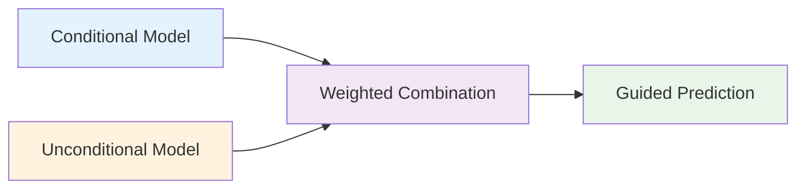
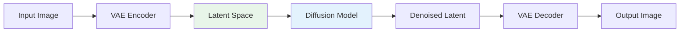

# Advanced Diffusion Examples

This guide demonstrates advanced diffusion model techniques using Artifex and Flax NNX, including classifier-free guidance, conditioning patterns, custom noise schedules, and latent diffusion.

## Overview

<div class="grid cards" markdown>

- :material-gauge:{ .lg .middle } **Classifier-Free Guidance**

    ---

    Improve sample quality without a separate classifier

    [:octicons-arrow-right-24: CFG](#classifier-free-guidance)

- :material-tag:{ .lg .middle } **Conditioning Patterns**

    ---

    Conditional generation with text, class, or image inputs

    [:octicons-arrow-right-24: Conditioning](#conditioning-patterns)

- :material-sine-wave:{ .lg .middle } **Custom Noise Schedules**

    ---

    Design noise schedules for different data types

    [:octicons-arrow-right-24: Noise Schedules](#custom-noise-schedules)

- :material-layers:{ .lg .middle } **Latent Diffusion**

    ---

    Efficient diffusion in compressed latent space

    [:octicons-arrow-right-24: Latent Diffusion](#latent-diffusion)

</div>

## Prerequisites

```bash
# Install Artifex with all dependencies
uv pip install "artifex[cuda]"  # With GPU support
# or
uv pip install artifex  # CPU only
```

```python
import jax
import jax.numpy as jnp
from flax import nnx
import optax
from artifex.generative_models.core import DeviceManager
from artifex.generative_models.models.diffusion import DiffusionModel
```

## Classifier-Free Guidance

Classifier-free guidance (CFG) improves sample quality by jointly training conditional and unconditional models, eliminating the need for a separate classifier.

### Architecture



### CFG Implementation

```python
from flax import nnx
import jax.numpy as jnp

class ClassifierFreeGuidanceUNet(nnx.Module):
    """U-Net with classifier-free guidance support."""

    def __init__(
        self,
        in_channels: int = 3,
        model_channels: int = 128,
        num_classes: int = 10,
        dropout_prob: float = 0.1,  # For unconditional training
        *,
        rngs: nnx.Rngs,
    ):
        super().__init__()

        self.in_channels = in_channels
        self.model_channels = model_channels
        self.num_classes = num_classes
        self.dropout_prob = dropout_prob

        # Time embedding
        self.time_embed = nnx.Sequential(
            nnx.Linear(model_channels, model_channels * 4, rngs=rngs),
            nnx.silu,
            nnx.Linear(model_channels * 4, model_channels * 4, rngs=rngs),
        )

        # Class embedding (with null token for unconditional)
        self.class_embed = nnx.Embed(
            num_embeddings=num_classes + 1,  # +1 for null class
            features=model_channels * 4,
            rngs=rngs,
        )

        # U-Net architecture
        self.input_conv = nnx.Conv(
            in_features=in_channels,
            out_features=model_channels,
            kernel_size=(3, 3),
            padding=1,
            rngs=rngs,
        )

        # Encoder blocks
        encoder_blocks = []
        channels = [model_channels, model_channels * 2, model_channels * 4]

        for i, out_ch in enumerate(channels):
            in_ch = model_channels if i == 0 else channels[i - 1]
            block = self._make_resnet_block(in_ch, out_ch, rngs=rngs)
            encoder_blocks.append(block)
        self.encoder_blocks = nnx.List(encoder_blocks)

        # Middle block
        self.middle_block = self._make_resnet_block(
            channels[-1],
            channels[-1],
            rngs=rngs,
        )

        # Decoder blocks
        decoder_blocks = []
        for i, out_ch in enumerate(reversed(channels[:-1]) + [model_channels]):
            in_ch = channels[-(i + 1)]
            block = self._make_resnet_block(in_ch * 2, out_ch, rngs=rngs)  # *2 for skip connections
            decoder_blocks.append(block)
        self.decoder_blocks = nnx.List(decoder_blocks)

        # Output
        self.output_conv = nnx.Sequential(
            nnx.GroupNorm(num_groups=32, rngs=rngs),
            nnx.silu,
            nnx.Conv(
                in_features=model_channels,
                out_features=in_channels,
                kernel_size=(3, 3),
                padding=1,
                rngs=rngs,
            ),
        )

    def _make_resnet_block(
        self,
        in_channels: int,
        out_channels: int,
        *,
        rngs: nnx.Rngs,
    ) -> nnx.Module:
        """Create a ResNet-style block with time and class conditioning."""

        class ResNetBlock(nnx.Module):
            def __init__(self, in_ch, out_ch, *, rngs):
                super().__init__()

                self.norm1 = nnx.GroupNorm(num_groups=32, rngs=rngs)
                self.conv1 = nnx.Conv(
                    in_features=in_ch,
                    out_features=out_ch,
                    kernel_size=(3, 3),
                    padding=1,
                    rngs=rngs,
                )

                self.norm2 = nnx.GroupNorm(num_groups=32, rngs=rngs)
                self.conv2 = nnx.Conv(
                    in_features=out_ch,
                    out_features=out_ch,
                    kernel_size=(3, 3),
                    padding=1,
                    rngs=rngs,
                )

                # Conditioning projection
                self.cond_proj = nnx.Linear(
                    in_features=self.model_channels * 4,
                    out_features=out_ch,
                    rngs=rngs,
                )

                # Skip connection
                if in_ch != out_ch:
                    self.skip = nnx.Conv(
                        in_features=in_ch,
                        out_features=out_ch,
                        kernel_size=(1, 1),
                        rngs=rngs,
                    )
                else:
                    self.skip = None

            def __call__(self, x, cond_embed):
                h = self.norm1(x)
                h = nnx.silu(h)
                h = self.conv1(h)

                # Add conditioning
                cond_proj = self.cond_proj(cond_embed)[:, None, None, :]
                h = h + cond_proj

                h = self.norm2(h)
                h = nnx.silu(h)
                h = self.conv2(h)

                # Skip connection
                if self.skip is not None:
                    x = self.skip(x)

                return h + x

        return ResNetBlock(in_channels, out_channels, rngs=rngs)

    def __call__(
        self,
        x: jax.Array,
        t: jax.Array,
        class_labels: jax.Array,
        *,
        deterministic: bool = False,
        rngs: nnx.Rngs | None = None,
    ) -> jax.Array:
        """
        Forward pass with classifier-free guidance support.

        Args:
            x: Noisy input [batch, H, W, channels]
            t: Timesteps [batch]
            class_labels: Class labels [batch], use num_classes for unconditional
            deterministic: If True, don't apply dropout
            rngs: Random number generators

        Returns:
            Predicted noise [batch, H, W, channels]
        """
        # Random dropout for classifier-free guidance training
        if not deterministic and rngs is not None and "dropout" in rngs:
            # Randomly replace class labels with null class
            dropout_mask = jax.random.bernoulli(
                rngs.dropout(),
                self.dropout_prob,
                shape=class_labels.shape,
            )
            class_labels = jnp.where(dropout_mask, self.num_classes, class_labels)

        # Time embedding
        t_embed = self.time_embed(self._timestep_embedding(t))

        # Class embedding
        c_embed = self.class_embed(class_labels)

        # Combined conditioning
        cond_embed = t_embed + c_embed

        # U-Net forward pass
        h = self.input_conv(x)

        # Encoder with skip connections
        skip_connections = []
        for block in self.encoder_blocks:
            h = block(h, cond_embed)
            skip_connections.append(h)

            # Downsample
            batch, height, width, channels = h.shape
            h = jax.image.resize(h, (batch, height // 2, width // 2, channels), method="bilinear")

        # Middle
        h = self.middle_block(h, cond_embed)

        # Decoder with skip connections
        for i, block in enumerate(self.decoder_blocks):
            # Upsample
            batch, height, width, channels = h.shape
            h = jax.image.resize(h, (batch, height * 2, width * 2, channels), method="nearest")

            # Concatenate skip connection
            skip = skip_connections[-(i + 1)]
            h = jnp.concatenate([h, skip], axis=-1)

            h = block(h, cond_embed)

        # Output
        return self.output_conv(h)

    def _timestep_embedding(self, timesteps: jax.Array, dim: int = None) -> jax.Array:
        """Create sinusoidal timestep embeddings."""
        if dim is None:
            dim = self.model_channels

        half_dim = dim // 2
        emb = jnp.log(10000) / (half_dim - 1)
        emb = jnp.exp(jnp.arange(half_dim) * -emb)
        emb = timesteps[:, None] * emb[None, :]
        emb = jnp.concatenate([jnp.sin(emb), jnp.cos(emb)], axis=-1)

        return emb


def sample_with_cfg(
    model: ClassifierFreeGuidanceUNet,
    class_labels: jax.Array,
    guidance_scale: float = 7.5,
    num_steps: int = 50,
    *,
    rngs: nnx.Rngs,
) -> jax.Array:
    """
    Sample with classifier-free guidance.

    Args:
        model: Trained U-Net model
        class_labels: Desired class labels [batch]
        guidance_scale: Guidance strength (1.0 = no guidance, >1.0 = stronger guidance)
        num_steps: Number of diffusion steps
        rngs: Random number generators

    Returns:
        Generated samples [batch, H, W, channels]
    """
    batch_size = class_labels.shape[0]
    image_size = 32  # Adjust based on your model

    # Start from random noise
    x = jax.random.normal(rngs.sample(), (batch_size, image_size, image_size, 3))

    # Diffusion timesteps
    timesteps = jnp.linspace(1000, 0, num_steps, dtype=jnp.int32)

    for t in timesteps:
        t_batch = jnp.full((batch_size,), t)

        # Conditional prediction
        noise_pred_cond = model(
            x,
            t_batch,
            class_labels,
            deterministic=True,
        )

        # Unconditional prediction (null class)
        noise_pred_uncond = model(
            x,
            t_batch,
            jnp.full_like(class_labels, model.num_classes),  # null class
            deterministic=True,
        )

        # Classifier-free guidance
        noise_pred = noise_pred_uncond + guidance_scale * (noise_pred_cond - noise_pred_uncond)

        # DDIM update step
        alpha_t = 1.0 - t / 1000.0
        alpha_t_prev = 1.0 - (t - 1000 / num_steps) / 1000.0

        # Predict x0
        x0_pred = (x - jnp.sqrt(1 - alpha_t) * noise_pred) / jnp.sqrt(alpha_t)
        x0_pred = jnp.clip(x0_pred, -1, 1)

        # Update x
        x = jnp.sqrt(alpha_t_prev) * x0_pred + jnp.sqrt(1 - alpha_t_prev) * noise_pred

    return x
```

### Training with CFG

```python
def train_with_cfg(
    model: ClassifierFreeGuidanceUNet,
    train_data: jnp.ndarray,
    train_labels: jnp.ndarray,
    num_epochs: int = 100,
    cfg_dropout: float = 0.1,
):
    """Train model with classifier-free guidance."""

    rngs = nnx.Rngs(42)
    optimizer = nnx.Optimizer(model, optax.adam(1e-4), wrt=nnx.Param)

    for epoch in range(num_epochs):
        for batch_idx in range(0, len(train_data), 32):
            batch_images = train_data[batch_idx:batch_idx + 32]
            batch_labels = train_labels[batch_idx:batch_idx + 32]

            # Random timesteps
            t = jax.random.randint(rngs.params(), (batch_images.shape[0],), 0, 1000)

            # Add noise
            noise = jax.random.normal(rngs.params(), batch_images.shape)
            alpha_t = 1.0 - t[:, None, None, None] / 1000.0
            noisy_images = jnp.sqrt(alpha_t) * batch_images + jnp.sqrt(1 - alpha_t) * noise

            def loss_fn(model):
                # Predict noise with CFG dropout
                noise_pred = model(
                    noisy_images,
                    t,
                    batch_labels,
                    deterministic=False,
                    rngs=rngs,
                )
                # MSE loss
                return jnp.mean((noise_pred - noise) ** 2)

            # Compute loss and gradients, then update
            loss, grads = nnx.value_and_grad(loss_fn)(model)
            optimizer.update(model, grads)

        if epoch % 10 == 0:
            print(f"Epoch {epoch}/{num_epochs}, Loss: {loss:.4f}")

            # Sample with different guidance scales
            for scale in [1.0, 3.0, 7.5]:
                samples = sample_with_cfg(
                    model,
                    jnp.array([0, 1, 2, 3]),  # Sample different classes
                    guidance_scale=scale,
                    rngs=rngs,
                )
                print(f"  Guidance scale {scale}: samples generated")

    return model
```

## Conditioning Patterns

Diffusion models can be conditioned on various inputs including text, class labels, or images.

### Text Conditioning

```python
class TextConditionedDiffusion(nnx.Module):
    """Diffusion model with text conditioning."""

    def __init__(
        self,
        text_encoder_dim: int = 512,
        text_max_length: int = 77,
        cross_attention_dim: int = 768,
        *,
        rngs: nnx.Rngs,
    ):
        super().__init__()

        self.text_encoder_dim = text_encoder_dim
        self.cross_attention_dim = cross_attention_dim

        # Text encoder (simplified - in practice use CLIP or T5)
        self.text_encoder = nnx.Sequential(
            nnx.Embed(
                num_embeddings=50000,  # Vocabulary size
                features=text_encoder_dim,
                rngs=rngs,
            ),
            # Positional encoding would go here
            nnx.Linear(text_encoder_dim, cross_attention_dim, rngs=rngs),
        )

        # U-Net with cross-attention
        self.unet = self._build_unet_with_cross_attention(rngs)

    def _build_unet_with_cross_attention(self, rngs: nnx.Rngs) -> nnx.Module:
        """Build U-Net with cross-attention layers for text conditioning."""

        class CrossAttentionBlock(nnx.Module):
            def __init__(self, dim, context_dim, num_heads=8, *, rngs):
                super().__init__()

                self.norm1 = nnx.GroupNorm(num_groups=32, rngs=rngs)
                self.norm2 = nnx.LayerNorm(dim, rngs=rngs)

                # Self-attention
                self.self_attn = nnx.MultiHeadAttention(
                    num_heads=num_heads,
                    in_features=dim,
                    decode=False,
                    rngs=rngs,
                )

                # Cross-attention
                self.cross_attn = nnx.MultiHeadAttention(
                    num_heads=num_heads,
                    in_features=dim,
                    qkv_features=context_dim,
                    decode=False,
                    rngs=rngs,
                )

                # Feed-forward
                self.ff = nnx.Sequential(
                    nnx.Linear(dim, dim * 4, rngs=rngs),
                    nnx.gelu,
                    nnx.Linear(dim * 4, dim, rngs=rngs),
                )

            def __call__(self, x, context):
                """
                Args:
                    x: Image features [batch, H, W, dim]
                    context: Text features [batch, seq_len, context_dim]
                """
                batch, h, w, c = x.shape

                # Reshape to sequence
                x_seq = x.reshape(batch, h * w, c)

                # Self-attention
                x_norm = self.norm1(x_seq)
                x_seq = x_seq + self.self_attn(x_norm)

                # Cross-attention with text
                x_norm = self.norm2(x_seq)
                x_seq = x_seq + self.cross_attn(x_norm, context)

                # Feed-forward
                x_seq = x_seq + self.ff(self.norm2(x_seq))

                # Reshape back
                return x_seq.reshape(batch, h, w, c)

        # Return U-Net architecture with cross-attention blocks
        # (simplified for example)
        return CrossAttentionBlock(
            dim=512,
            context_dim=self.cross_attention_dim,
            rngs=rngs,
        )

    def __call__(
        self,
        x: jax.Array,
        t: jax.Array,
        text_tokens: jax.Array,
    ) -> jax.Array:
        """
        Forward pass with text conditioning.

        Args:
            x: Noisy images [batch, H, W, channels]
            t: Timesteps [batch]
            text_tokens: Text token indices [batch, seq_len]

        Returns:
            Predicted noise [batch, H, W, channels]
        """
        # Encode text
        text_features = self.text_encoder(text_tokens)

        # Denoise with cross-attention to text
        return self.unet(x, text_features)


def sample_from_text_prompt(
    model: TextConditionedDiffusion,
    text_prompt: str,
    tokenizer,  # Your tokenizer
    num_steps: int = 50,
    *,
    rngs: nnx.Rngs,
) -> jax.Array:
    """Generate image from text prompt."""

    # Tokenize text
    text_tokens = tokenizer(text_prompt)

    # Start from noise
    x = jax.random.normal(rngs.sample(), (1, 64, 64, 3))

    # Diffusion sampling
    for t in jnp.linspace(1000, 0, num_steps):
        t_batch = jnp.array([t])
        noise_pred = model(x, t_batch, text_tokens)

        # Update x (DDIM or DDPM)
        alpha_t = 1.0 - t / 1000.0
        x = (x - jnp.sqrt(1 - alpha_t) * noise_pred) / jnp.sqrt(alpha_t)

    return x
```

### Image Conditioning (ControlNet-style)

```python
class ControlNetConditioner(nnx.Module):
    """ControlNet-style conditioning for spatial control."""

    def __init__(
        self,
        base_channels: int = 128,
        *,
        rngs: nnx.Rngs,
    ):
        super().__init__()

        # Condition encoder (processes control image)
        self.condition_encoder = nnx.Sequential(
            nnx.Conv(3, base_channels, kernel_size=(3, 3), padding=1, rngs=rngs),
            nnx.silu,
            nnx.Conv(base_channels, base_channels * 2, kernel_size=(3, 3), strides=(2, 2), padding=1, rngs=rngs),
            nnx.silu,
            nnx.Conv(base_channels * 2, base_channels * 4, kernel_size=(3, 3), strides=(2, 2), padding=1, rngs=rngs),
        )

        # Zero-initialized projection (ControlNet key insight)
        self.zero_conv = nnx.Conv(
            base_channels * 4,
            base_channels * 4,
            kernel_size=(1, 1),
            kernel_init=nnx.initializers.zeros,
            rngs=rngs,
        )

    def __call__(self, control_image: jax.Array) -> jax.Array:
        """
        Encode control image to conditioning features.

        Args:
            control_image: Control input (edges, depth, pose, etc.) [batch, H, W, 3]

        Returns:
            Conditioning features [batch, H', W', channels]
        """
        features = self.condition_encoder(control_image)
        return self.zero_conv(features)


class ControlledDiffusion(nnx.Module):
    """Diffusion with ControlNet-style spatial conditioning."""

    def __init__(
        self,
        base_channels: int = 128,
        *,
        rngs: nnx.Rngs,
    ):
        super().__init__()

        # Base diffusion model
        self.base_model = ClassifierFreeGuidanceUNet(
            model_channels=base_channels,
            rngs=rngs,
        )

        # Control network
        self.control_net = ControlNetConditioner(
            base_channels=base_channels,
            rngs=rngs,
        )

    def __call__(
        self,
        x: jax.Array,
        t: jax.Array,
        class_labels: jax.Array,
        control_image: jax.Array,
    ) -> jax.Array:
        """
        Forward with spatial control.

        Args:
            x: Noisy images [batch, H, W, 3]
            t: Timesteps [batch]
            class_labels: Class labels [batch]
            control_image: Control image (edges, depth, etc.) [batch, H, W, 3]

        Returns:
            Predicted noise [batch, H, W, 3]
        """
        # Get control features
        control_features = self.control_net(control_image)

        # Base prediction
        base_pred = self.base_model(x, t, class_labels, deterministic=True)

        # Add control (injected at multiple resolutions in practice)
        # This is simplified - real ControlNet injects at multiple layers
        return base_pred + control_features


def sample_with_control(
    model: ControlledDiffusion,
    control_image: jax.Array,
    class_label: int,
    num_steps: int = 50,
    *,
    rngs: nnx.Rngs,
) -> jax.Array:
    """
    Generate image guided by control image.

    Args:
        model: Trained model with ControlNet
        control_image: Control input (canny edges, depth map, etc.)
        class_label: Target class
        num_steps: Diffusion steps
        rngs: RNG state

    Returns:
        Generated image matching control structure
    """
    batch_size = control_image.shape[0]

    # Start from noise
    x = jax.random.normal(rngs.sample(), control_image.shape)

    class_labels = jnp.full((batch_size,), class_label)

    # Denoising loop
    for t in jnp.linspace(1000, 0, num_steps):
        t_batch = jnp.full((batch_size,), t)

        noise_pred = model(x, t_batch, class_labels, control_image)

        # DDIM update
        alpha_t = 1.0 - t / 1000.0
        alpha_t_prev = 1.0 - (t - 1000 / num_steps) / 1000.0

        x0_pred = (x - jnp.sqrt(1 - alpha_t) * noise_pred) / jnp.sqrt(alpha_t)
        x0_pred = jnp.clip(x0_pred, -1, 1)

        x = jnp.sqrt(alpha_t_prev) * x0_pred + jnp.sqrt(1 - alpha_t_prev) * noise_pred

    return x
```

## Custom Noise Schedules

Different noise schedules can improve quality for specific data types.

### Common Schedules

```python
def linear_beta_schedule(num_timesteps: int = 1000) -> jax.Array:
    """Linear noise schedule (original DDPM)."""
    beta_start = 0.0001
    beta_end = 0.02
    return jnp.linspace(beta_start, beta_end, num_timesteps)


def cosine_beta_schedule(num_timesteps: int = 1000, s: float = 0.008) -> jax.Array:
    """
    Cosine noise schedule from "Improved Denoising Diffusion Probabilistic Models".

    Better for high-resolution images.
    """
    steps = num_timesteps + 1
    x = jnp.linspace(0, num_timesteps, steps)

    alphas_cumprod = jnp.cos(((x / num_timesteps) + s) / (1 + s) * jnp.pi * 0.5) ** 2
    alphas_cumprod = alphas_cumprod / alphas_cumprod[0]

    betas = 1 - (alphas_cumprod[1:] / alphas_cumprod[:-1])
    return jnp.clip(betas, 0.0001, 0.9999)


def sigmoid_beta_schedule(num_timesteps: int = 1000, start: float = -3, end: float = 3) -> jax.Array:
    """Sigmoid schedule for smoother transitions."""
    betas = jnp.linspace(start, end, num_timesteps)
    betas = nnx.sigmoid(betas)
    betas = (betas - betas.min()) / (betas.max() - betas.min())
    return betas * 0.02 + 0.0001


def custom_schedule_for_audio(num_timesteps: int = 1000) -> jax.Array:
    """Custom schedule optimized for audio spectrograms."""
    # More noise at higher frequencies
    t = jnp.linspace(0, 1, num_timesteps)
    betas = 0.0001 + 0.02 * (t ** 2)  # Quadratic increase
    return betas


class CustomScheduleDiffusion(nnx.Module):
    """Diffusion model with custom noise schedule."""

    def __init__(
        self,
        schedule_type: str = "cosine",
        num_timesteps: int = 1000,
        *,
        rngs: nnx.Rngs,
    ):
        super().__init__()

        self.num_timesteps = num_timesteps

        # Select schedule
        if schedule_type == "linear":
            betas = linear_beta_schedule(num_timesteps)
        elif schedule_type == "cosine":
            betas = cosine_beta_schedule(num_timesteps)
        elif schedule_type == "sigmoid":
            betas = sigmoid_beta_schedule(num_timesteps)
        elif schedule_type == "audio":
            betas = custom_schedule_for_audio(num_timesteps)
        else:
            raise ValueError(f"Unknown schedule: {schedule_type}")

        # Pre-compute alpha values
        self.betas = betas
        self.alphas = 1.0 - betas
        self.alphas_cumprod = jnp.cumprod(self.alphas)
        self.alphas_cumprod_prev = jnp.concatenate([jnp.array([1.0]), self.alphas_cumprod[:-1]])

        # Coefficients for sampling
        self.sqrt_alphas_cumprod = jnp.sqrt(self.alphas_cumprod)
        self.sqrt_one_minus_alphas_cumprod = jnp.sqrt(1.0 - self.alphas_cumprod)

        # Denoising model
        self.model = ClassifierFreeGuidanceUNet(rngs=rngs)

    def add_noise(self, x0: jax.Array, t: jax.Array, *, rngs: nnx.Rngs) -> tuple[jax.Array, jax.Array]:
        """
        Add noise according to schedule.

        Args:
            x0: Clean images [batch, H, W, C]
            t: Timestep indices [batch]
            rngs: Random generators

        Returns:
            Tuple of (noisy images, noise)
        """
        noise = jax.random.normal(rngs.sample(), x0.shape)

        sqrt_alpha_t = self.sqrt_alphas_cumprod[t][:, None, None, None]
        sqrt_one_minus_alpha_t = self.sqrt_one_minus_alphas_cumprod[t][:, None, None, None]

        noisy = sqrt_alpha_t * x0 + sqrt_one_minus_alpha_t * noise

        return noisy, noise

    def sample(
        self,
        shape: tuple,
        class_labels: jax.Array,
        guidance_scale: float = 1.0,
        *,
        rngs: nnx.Rngs,
    ) -> jax.Array:
        """Sample using the custom schedule."""

        # Start from noise
        x = jax.random.normal(rngs.sample(), shape)

        # Reverse diffusion
        for t in range(self.num_timesteps - 1, -1, -1):
            t_batch = jnp.full((shape[0],), t)

            # Predict noise
            noise_pred_cond = self.model(x, t_batch, class_labels, deterministic=True)
            noise_pred_uncond = self.model(
                x,
                t_batch,
                jnp.full_like(class_labels, self.model.num_classes),
                deterministic=True,
            )

            noise_pred = noise_pred_uncond + guidance_scale * (noise_pred_cond - noise_pred_uncond)

            # Denoise step with custom schedule
            alpha_t = self.alphas_cumprod[t]
            alpha_t_prev = self.alphas_cumprod_prev[t]
            beta_t = self.betas[t]

            # Predict x0
            x0_pred = (x - jnp.sqrt(1 - alpha_t) * noise_pred) / jnp.sqrt(alpha_t)
            x0_pred = jnp.clip(x0_pred, -1, 1)

            # Sample x_{t-1}
            if t > 0:
                noise = jax.random.normal(rngs.sample(), x.shape)
            else:
                noise = jnp.zeros_like(x)

            x = (
                jnp.sqrt(alpha_t_prev) * x0_pred
                + jnp.sqrt(1 - alpha_t_prev - beta_t ** 2) * noise_pred
                + beta_t * noise
            )

        return x
```

### Schedule Comparison

```python
def compare_schedules():
    """Visualize different noise schedules."""
    import matplotlib.pyplot as plt

    num_steps = 1000
    schedules = {
        "Linear": linear_beta_schedule(num_steps),
        "Cosine": cosine_beta_schedule(num_steps),
        "Sigmoid": sigmoid_beta_schedule(num_steps),
        "Audio": custom_schedule_for_audio(num_steps),
    }

    fig, axes = plt.subplots(2, 2, figsize=(12, 10))
    axes = axes.flatten()

    for idx, (name, betas) in enumerate(schedules.items()):
        alphas_cumprod = jnp.cumprod(1 - betas)

        ax = axes[idx]
        ax.plot(betas, label="Beta", alpha=0.7)
        ax.plot(alphas_cumprod, label="Alpha_cumprod", alpha=0.7)
        ax.set_title(f"{name} Schedule")
        ax.set_xlabel("Timestep")
        ax.set_ylabel("Value")
        ax.legend()
        ax.grid(True, alpha=0.3)

    plt.tight_layout()
    plt.savefig("schedule_comparison.png")
    print("Schedule comparison saved to schedule_comparison.png")
```

## Latent Diffusion

Latent diffusion operates in a compressed latent space, significantly reducing computational cost while maintaining quality.

### Architecture Overview



### Latent Diffusion Implementation

```python
class LatentDiffusionModel(nnx.Module):
    """Latent Diffusion Model (LDM) operating in compressed space."""

    def __init__(
        self,
        vae_latent_dim: int = 4,
        latent_size: int = 32,  # Compressed spatial size
        condition_dim: int = 768,  # For text/class conditioning
        *,
        rngs: nnx.Rngs,
    ):
        super().__init__()

        self.vae_latent_dim = vae_latent_dim
        self.latent_size = latent_size

        # VAE for compression (pre-trained and frozen)
        self.vae = self._build_vae(rngs)

        # Diffusion model in latent space
        self.diffusion_model = ClassifierFreeGuidanceUNet(
            in_channels=vae_latent_dim,
            model_channels=256,
            rngs=rngs,
        )

        # Condition encoder (text, class, etc.)
        self.condition_encoder = nnx.Sequential(
            nnx.Embed(num_embeddings=1000, features=condition_dim, rngs=rngs),
            nnx.Linear(condition_dim, condition_dim, rngs=rngs),
        )

    def _build_vae(self, rngs: nnx.Rngs) -> nnx.Module:
        """Build VAE for latent compression."""

        class SimpleVAE(nnx.Module):
            def __init__(self, latent_dim, *, rngs):
                super().__init__()

                # Encoder
                self.encoder = nnx.Sequential(
                    nnx.Conv(3, 128, kernel_size=(4, 4), strides=(2, 2), padding=1, rngs=rngs),
                    nnx.relu,
                    nnx.Conv(128, 256, kernel_size=(4, 4), strides=(2, 2), padding=1, rngs=rngs),
                    nnx.relu,
                    nnx.Conv(256, latent_dim, kernel_size=(4, 4), strides=(2, 2), padding=1, rngs=rngs),
                )

                # Decoder
                self.decoder = nnx.Sequential(
                    nnx.ConvTranspose(latent_dim, 256, kernel_size=(4, 4), strides=(2, 2), padding=1, rngs=rngs),
                    nnx.relu,
                    nnx.ConvTranspose(256, 128, kernel_size=(4, 4), strides=(2, 2), padding=1, rngs=rngs),
                    nnx.relu,
                    nnx.ConvTranspose(128, 3, kernel_size=(4, 4), strides=(2, 2), padding=1, rngs=rngs),
                    nnx.tanh,
                )

            def encode(self, x):
                return self.encoder(x)

            def decode(self, z):
                return self.decoder(z)

        return SimpleVAE(self.vae_latent_dim, rngs=rngs)

    def encode_to_latent(self, images: jax.Array) -> jax.Array:
        """Encode images to latent space."""
        # Apply VAE encoder
        latents = self.vae.encode(images)

        # Scale latents (standard practice in LDM)
        latents = latents * 0.18215

        return latents

    def decode_from_latent(self, latents: jax.Array) -> jax.Array:
        """Decode latents to images."""
        # Unscale
        latents = latents / 0.18215

        # Apply VAE decoder
        return self.vae.decode(latents)

    def __call__(
        self,
        latents: jax.Array,
        t: jax.Array,
        condition: jax.Array,
        *,
        deterministic: bool = False,
        rngs: nnx.Rngs | None = None,
    ) -> jax.Array:
        """
        Predict noise in latent space.

        Args:
            latents: Noisy latents [batch, H, W, vae_latent_dim]
            t: Timesteps [batch]
            condition: Conditioning (class labels, text tokens, etc.) [batch, ...]
            deterministic: Training vs inference mode
            rngs: Random generators

        Returns:
            Predicted noise in latent space
        """
        # Encode condition
        cond_embed = self.condition_encoder(condition)

        # Predict noise in latent space
        return self.diffusion_model(
            latents,
            t,
            cond_embed,
            deterministic=deterministic,
            rngs=rngs,
        )

    def sample(
        self,
        condition: jax.Array,
        num_steps: int = 50,
        guidance_scale: float = 7.5,
        *,
        rngs: nnx.Rngs,
    ) -> jax.Array:
        """
        Generate images in latent space.

        Args:
            condition: Conditioning input [batch, ...]
            num_steps: Number of diffusion steps
            guidance_scale: CFG scale
            rngs: Random generators

        Returns:
            Generated images [batch, H, W, 3]
        """
        batch_size = condition.shape[0]

        # Start from random latent noise
        latents = jax.random.normal(
            rngs.sample(),
            (batch_size, self.latent_size, self.latent_size, self.vae_latent_dim),
        )

        # Diffusion in latent space
        for t in jnp.linspace(1000, 0, num_steps):
            t_batch = jnp.full((batch_size,), t, dtype=jnp.int32)

            # CFG
            noise_pred_cond = self(
                latents,
                t_batch,
                condition,
                deterministic=True,
            )

            noise_pred_uncond = self(
                latents,
                t_batch,
                jnp.zeros_like(condition),  # Null condition
                deterministic=True,
            )

            noise_pred = noise_pred_uncond + guidance_scale * (noise_pred_cond - noise_pred_uncond)

            # DDIM update
            alpha_t = 1.0 - t / 1000.0
            alpha_t_prev = 1.0 - (t - 1000 / num_steps) / 1000.0

            latents = jnp.sqrt(alpha_t_prev) * (
                (latents - jnp.sqrt(1 - alpha_t) * noise_pred) / jnp.sqrt(alpha_t)
            )

        # Decode to images
        images = self.decode_from_latent(latents)

        return images


def train_latent_diffusion(
    model: LatentDiffusionModel,
    train_data: jnp.ndarray,
    train_conditions: jnp.ndarray,
    num_epochs: int = 100,
):
    """Train latent diffusion model."""

    rngs = nnx.Rngs(42)
    diffusion_model = model.diffusion_model
    optimizer = nnx.Optimizer(diffusion_model, optax.adam(1e-4), wrt=nnx.Param)

    # Pre-encode all images to latent space (saves computation)
    print("Encoding dataset to latent space...")
    latent_data = model.encode_to_latent(train_data)

    for epoch in range(num_epochs):
        for batch_idx in range(0, len(latent_data), 32):
            batch_latents = latent_data[batch_idx:batch_idx + 32]
            batch_conditions = train_conditions[batch_idx:batch_idx + 32]

            # Random timesteps
            t = jax.random.randint(rngs.params(), (batch_latents.shape[0],), 0, 1000)

            # Add noise in latent space
            noise = jax.random.normal(rngs.params(), batch_latents.shape)
            alpha_t = 1.0 - t[:, None, None, None] / 1000.0
            noisy_latents = jnp.sqrt(alpha_t) * batch_latents + jnp.sqrt(1 - alpha_t) * noise

            def loss_fn(diffusion_model):
                # Predict noise
                noise_pred = model(
                    noisy_latents,
                    t,
                    batch_conditions,
                    deterministic=False,
                    rngs=rngs,
                )
                # Loss
                return jnp.mean((noise_pred - noise) ** 2)

            # Compute loss and gradients, then update
            loss, grads = nnx.value_and_grad(loss_fn)(diffusion_model)
            optimizer.update(diffusion_model, grads)

        if epoch % 10 == 0:
            print(f"Epoch {epoch}/{num_epochs}, Loss: {loss:.4f}")

    return model
```

## Best Practices

!!! success "DO"
    - Use classifier-free guidance for better sample quality
    - Pre-train VAE separately for latent diffusion
    - Use cosine schedule for high-resolution images
    - Implement zero-initialized convolutions for ControlNet
    - Monitor FID and CLIP scores during training
    - Use mixed precision training for efficiency

!!! danger "DON'T"
    - Don't use guidance scales >10 (causes artifacts)
    - Don't skip warm-up in training
    - Don't forget to normalize conditioning embeddings
    - Don't train latent diffusion and VAE jointly (unstable)
    - Don't use too few sampling steps (<20)

## Troubleshooting

| Issue | Cause | Solution |
|-------|-------|----------|
| Low quality with CFG | Wrong guidance scale | Try scales 3-7.5, visualize different scales |
| Color shift | Incorrect normalization | Check data/latent scaling factors |
| Blurry samples | Too few steps | Increase sampling steps (50-100) |
| Training instability | Schedule mismatch | Use cosine schedule, adjust learning rate |
| Control not working | Zero-conv not used | Initialize control layers to zero |

## Summary

We covered four advanced diffusion techniques:

1. **Classifier-Free Guidance**: Improved quality without separate classifier
2. **Conditioning Patterns**: Text, class, and spatial control
3. **Custom Noise Schedules**: Optimized schedules for different data types
4. **Latent Diffusion**: Efficient generation in compressed space

**Key Takeaways**:

- CFG significantly improves sample quality at minimal cost
- Custom schedules matter for specific domains
- Latent diffusion reduces memory/compute by 4-8x
- ControlNet enables precise spatial control

## Next Steps

<div class="grid cards" markdown>

- :material-book-open-variant:{ .lg .middle } **Diffusion Concepts**

    ---

    Deep dive into diffusion theory

    [:octicons-arrow-right-24: Diffusion Explained](../../user-guide/concepts/diffusion-explained.md)

- :material-laptop:{ .lg .middle } **Training Guide**

    ---

    Scale diffusion training

    [:octicons-arrow-right-24: Training Guide](../../user-guide/training/training-guide.md)

- :material-chart-box:{ .lg .middle } **Inference**

    ---

    Optimize inference speed

    [:octicons-arrow-right-24: Inference Guide](../../user-guide/inference/overview.md)

- :material-code-braces:{ .lg .middle } **API Reference**

    ---

    Complete diffusion API

    [:octicons-arrow-right-24: Diffusion API](../../api/models/diffusion.md)

</div>
