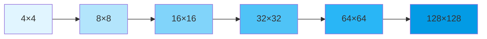

# Advanced GAN Examples

This guide demonstrates advanced GAN architectures and training techniques using Artifex and Flax NNX. We cover progressive training, style-based generation, conditional GANs, and Wasserstein GANs with gradient penalty.

## Overview

<div class="grid cards" markdown>

- :material-chart-line:{ .lg .middle } **Progressive GAN**

    ---

    Grow the network progressively during training for high-resolution image generation

    [:octicons-arrow-right-24: Progressive GAN](#progressive-gan)

- :material-palette:{ .lg .middle } **StyleGAN Patterns**

    ---

    Style-based generator architecture with adaptive instance normalization

    [:octicons-arrow-right-24: StyleGAN](#stylegan-patterns)

- :material-label:{ .lg .middle } **Conditional GAN**

    ---

    Class-conditional generation with label embedding

    [:octicons-arrow-right-24: Conditional GAN](#conditional-gan)

- :material-chart-bell-curve:{ .lg .middle } **Wasserstein GAN**

    ---

    Improved training stability with Wasserstein distance and gradient penalty

    [:octicons-arrow-right-24: WGAN-GP](#wasserstein-gan-with-gradient-penalty)

</div>

## Prerequisites

```bash
# Install Artifex with all dependencies
uv pip install "artifex[cuda]"  # With GPU support
# or
uv pip install artifex  # CPU only
```

```python
import jax
import jax.numpy as jnp
from flax import nnx
import optax
from artifex.generative_models.core import DeviceManager
from artifex.generative_models.models.gan import GAN
```

## Progressive GAN

Progressive GANs gradually increase the resolution of generated images during training, starting from low resolution (e.g., 4×4) and progressively adding layers to reach high resolution (e.g., 1024×1024).

### Architecture



### Progressive Layers

```python
from flax import nnx
import jax.numpy as jnp

class ProgressiveConvBlock(nnx.Module):
    """Convolutional block with progressive growth support."""

    def __init__(
        self,
        in_channels: int,
        out_channels: int,
        *,
        rngs: nnx.Rngs,
        use_pixelnorm: bool = True,
    ):
        super().__init__()

        self.conv1 = nnx.Conv(
            in_features=in_channels,
            out_features=out_channels,
            kernel_size=(3, 3),
            padding=1,
            rngs=rngs,
        )

        self.conv2 = nnx.Conv(
            in_features=out_channels,
            out_features=out_channels,
            kernel_size=(3, 3),
            padding=1,
            rngs=rngs,
        )

        self.use_pixelnorm = use_pixelnorm

    def pixel_norm(self, x: jax.Array, epsilon: float = 1e-8) -> jax.Array:
        """Pixel-wise feature normalization."""
        return x / jnp.sqrt(jnp.mean(x ** 2, axis=-1, keepdims=True) + epsilon)

    def __call__(self, x: jax.Array) -> jax.Array:
        x = self.conv1(x)
        x = nnx.leaky_relu(x, negative_slope=0.2)
        if self.use_pixelnorm:
            x = self.pixel_norm(x)

        x = self.conv2(x)
        x = nnx.leaky_relu(x, negative_slope=0.2)
        if self.use_pixelnorm:
            x = self.pixel_norm(x)

        return x


class ProgressiveGenerator(nnx.Module):
    """Generator with progressive growing."""

    def __init__(
        self,
        latent_dim: int,
        max_channels: int = 512,
        num_stages: int = 6,  # 4x4 to 128x128
        *,
        rngs: nnx.Rngs,
    ):
        super().__init__()

        self.latent_dim = latent_dim
        self.num_stages = num_stages
        self.current_stage = 0  # Start at 4x4

        # Initial 4x4 block
        self.initial = nnx.Sequential(
            nnx.Linear(latent_dim, max_channels * 4 * 4, rngs=rngs),
            # Reshape happens in forward pass
        )

        # Progressive blocks
        blocks = []
        for i in range(num_stages - 1):
            in_ch = max_channels // (2 ** i)
            out_ch = max_channels // (2 ** (i + 1))

            block = ProgressiveConvBlock(
                in_channels=in_ch,
                out_channels=out_ch,
                rngs=rngs,
            )
            blocks.append(block)
        self.blocks = nnx.List(blocks)

        # Output layers (to RGB) for each resolution
        to_rgb_layers = []
        for i in range(num_stages):
            ch = max_channels // (2 ** i)
            to_rgb = nnx.Conv(
                in_features=ch,
                out_features=3,
                kernel_size=(1, 1),
                rngs=rngs,
            )
            to_rgb_layers.append(to_rgb)
        self.to_rgb_layers = nnx.List(to_rgb_layers)

    def set_stage(self, stage: int):
        """Set the current training stage (resolution level)."""
        self.current_stage = min(stage, self.num_stages - 1)

    def __call__(
        self,
        z: jax.Array,
        alpha: float = 1.0,  # Blending factor for smooth transition
    ) -> jax.Array:
        """
        Generate images at the current resolution.

        Args:
            z: Latent vectors [batch, latent_dim]
            alpha: Blending factor (0=previous resolution, 1=current resolution)

        Returns:
            Generated images [batch, H, W, 3]
        """
        batch_size = z.shape[0]

        # Initial 4x4 block
        x = self.initial(z)
        x = x.reshape(batch_size, 4, 4, -1)

        # Progress through stages
        for stage in range(self.current_stage):
            # Upsample
            h, w, c = x.shape[1:]
            x = jax.image.resize(x, (batch_size, h * 2, w * 2, c), method="nearest")

            # Apply block
            x = self.blocks[stage](x)

        # Convert to RGB
        if alpha < 1.0 and self.current_stage > 0:
            # Blend with previous resolution
            prev_rgb = self.to_rgb_layers[self.current_stage - 1](x)
            h, w = prev_rgb.shape[1:3]
            prev_rgb = jax.image.resize(prev_rgb, (batch_size, h * 2, w * 2, 3), method="nearest")

            curr_rgb = self.to_rgb_layers[self.current_stage](x)
            output = alpha * curr_rgb + (1 - alpha) * prev_rgb
        else:
            output = self.to_rgb_layers[self.current_stage](x)

        return nnx.tanh(output)


class ProgressiveDiscriminator(nnx.Module):
    """Discriminator with progressive growing."""

    def __init__(
        self,
        max_channels: int = 512,
        num_stages: int = 6,
        *,
        rngs: nnx.Rngs,
    ):
        super().__init__()

        self.num_stages = num_stages
        self.current_stage = 0

        # From RGB layers for each resolution
        from_rgb_layers = []
        for i in range(num_stages):
            ch = max_channels // (2 ** (num_stages - 1 - i))
            from_rgb = nnx.Conv(
                in_features=3,
                out_features=ch,
                kernel_size=(1, 1),
                rngs=rngs,
            )
            from_rgb_layers.append(from_rgb)
        self.from_rgb_layers = nnx.List(from_rgb_layers)

        # Progressive blocks
        blocks = []
        for i in range(num_stages - 1):
            in_ch = max_channels // (2 ** (num_stages - 1 - i))
            out_ch = max_channels // (2 ** (num_stages - 2 - i))

            block = ProgressiveConvBlock(
                in_channels=in_ch,
                out_channels=out_ch,
                rngs=rngs,
                use_pixelnorm=False,
            )
            blocks.append(block)
        self.blocks = nnx.List(blocks)

        # Final block layers (applied manually to avoid Lambda)
        self.final_conv1 = nnx.Conv(max_channels + 1, max_channels, kernel_size=(3, 3), padding=1, rngs=rngs)
        self.final_conv2 = nnx.Conv(max_channels, max_channels, kernel_size=(4, 4), rngs=rngs)
        self.final_fc = nnx.Linear(max_channels, 1, rngs=rngs)

    def set_stage(self, stage: int):
        """Set the current training stage."""
        self.current_stage = min(stage, self.num_stages - 1)

    def minibatch_std(self, x: jax.Array) -> jax.Array:
        """Add minibatch standard deviation as additional feature."""
        batch_std = jnp.std(x, axis=0, keepdims=True)
        mean_std = jnp.mean(batch_std)

        # Replicate across batch and spatial dimensions
        batch_size, h, w, _ = x.shape
        std_feature = jnp.ones((batch_size, h, w, 1)) * mean_std

        return jnp.concatenate([x, std_feature], axis=-1)

    def __call__(
        self,
        x: jax.Array,
        alpha: float = 1.0,
    ) -> jax.Array:
        """
        Discriminate images at current resolution.

        Args:
            x: Input images [batch, H, W, 3]
            alpha: Blending factor for smooth transition

        Returns:
            Discriminator scores [batch, 1]
        """
        batch_size = x.shape[0]

        # Convert from RGB
        if alpha < 1.0 and self.current_stage > 0:
            # Blend with downsampled previous resolution
            h, w = x.shape[1:3]
            x_down = jax.image.resize(x, (batch_size, h // 2, w // 2, 3), method="bilinear")

            prev_features = self.from_rgb_layers[self.current_stage - 1](x_down)
            prev_features = nnx.leaky_relu(prev_features, negative_slope=0.2)

            curr_features = self.from_rgb_layers[self.current_stage](x)
            curr_features = nnx.leaky_relu(curr_features, negative_slope=0.2)
            curr_features = self.blocks[self.num_stages - 1 - self.current_stage](curr_features)

            # Average pool current features
            h, w, c = curr_features.shape[1:]
            curr_features = jax.image.resize(curr_features, (batch_size, h // 2, w // 2, c), method="bilinear")

            features = alpha * curr_features + (1 - alpha) * prev_features
        else:
            features = self.from_rgb_layers[self.current_stage](x)
            features = nnx.leaky_relu(features, negative_slope=0.2)

        # Progress through blocks
        for stage in range(self.num_stages - 1 - self.current_stage, self.num_stages - 1):
            features = self.blocks[stage](features)

            # Downsample
            batch_size, h, w, c = features.shape
            features = jax.image.resize(features, (batch_size, h // 2, w // 2, c), method="bilinear")

        # Add minibatch std and final layers
        features = self.minibatch_std(features)

        # Apply final layers manually
        h = nnx.leaky_relu(self.final_conv1(features), negative_slope=0.2)
        h = nnx.leaky_relu(self.final_conv2(h), negative_slope=0.2)
        h = h.reshape(h.shape[0], -1)
        output = self.final_fc(h)

        return output
```

### Progressive Training Loop

```python
def train_progressive_gan(
    config: dict,
    train_data: jnp.ndarray,
    num_epochs_per_stage: int = 100,
    transition_epochs: int = 100,
):
    """Train Progressive GAN with gradual resolution increase."""

    # Initialize
    device_manager = DeviceManager()
    rngs = nnx.Rngs(config["seed"])

    # Create models
    generator = ProgressiveGenerator(
        latent_dim=config["latent_dim"],
        max_channels=512,
        num_stages=6,
        rngs=rngs,
    )

    discriminator = ProgressiveDiscriminator(
        max_channels=512,
        num_stages=6,
        rngs=rngs,
    )

    # Optimizers with learning rate decay
    lr_schedule = optax.exponential_decay(
        init_value=0.001,
        transition_steps=1000,
        decay_rate=0.99,
    )

    g_optimizer = nnx.Optimizer(generator, optax.adam(lr_schedule), wrt=nnx.Param)
    d_optimizer = nnx.Optimizer(discriminator, optax.adam(lr_schedule), wrt=nnx.Param)

    # Training loop over stages
    for stage in range(6):
        print(f"\n{'='*50}")
        print(f"Training Stage {stage} (Resolution: {4 * (2**stage)}x{4 * (2**stage)})")
        print(f"{'='*50}\n")

        generator.set_stage(stage)
        discriminator.set_stage(stage)

        # Transition phase (gradually blend in new layers)
        for epoch in range(transition_epochs):
            alpha = epoch / transition_epochs  # 0 -> 1

            for batch in get_batches_for_resolution(train_data, stage):
                # Train discriminator
                z = jax.random.normal(rngs.params(), (batch.shape[0], config["latent_dim"]))
                fake_images = generator(z, alpha=alpha)

                real_scores = discriminator(batch, alpha=alpha)
                fake_scores = discriminator(fake_images, alpha=alpha)

                d_loss = -jnp.mean(real_scores) + jnp.mean(fake_scores)

                # Gradient penalty
                epsilon = jax.random.uniform(rngs.params(), (batch.shape[0], 1, 1, 1))
                interpolated = epsilon * batch + (1 - epsilon) * fake_images

                def d_interpolated(x):
                    return discriminator(x, alpha=alpha)

                gradients = jax.grad(lambda x: jnp.sum(d_interpolated(x)))(interpolated)
                gradient_penalty = jnp.mean((jnp.sqrt(jnp.sum(gradients ** 2, axis=(1, 2, 3))) - 1) ** 2)

                d_loss = d_loss + 10.0 * gradient_penalty

                # Update discriminator
                d_grads = jax.grad(lambda m: d_loss)(discriminator)
                d_optimizer.update(discriminator, d_grads)

                # Train generator
                z = jax.random.normal(rngs.params(), (batch.shape[0], config["latent_dim"]))
                fake_images = generator(z, alpha=alpha)
                fake_scores = discriminator(fake_images, alpha=alpha)

                g_loss = -jnp.mean(fake_scores)

                # Update generator
                g_grads = jax.grad(lambda m: g_loss)(generator)
                g_optimizer.update(generator, g_grads)

            if epoch % 10 == 0:
                print(f"Stage {stage}, Transition Epoch {epoch}/{transition_epochs}, "
                      f"Alpha: {alpha:.2f}, G Loss: {g_loss:.4f}, D Loss: {d_loss:.4f}")

        # Stabilization phase (train at full resolution)
        print(f"\nStabilization phase for stage {stage}")

        for epoch in range(num_epochs_per_stage):
            for batch in get_batches_for_resolution(train_data, stage):
                # Train with alpha=1.0 (full new resolution)
                # ... (similar to transition phase but with alpha=1.0)
                pass

            if epoch % 10 == 0:
                print(f"Stage {stage}, Stabilization Epoch {epoch}/{num_epochs_per_stage}")

    return generator, discriminator


def get_batches_for_resolution(data: jnp.ndarray, stage: int, batch_size: int = 32):
    """Get data batches at the appropriate resolution for the current stage."""
    target_size = 4 * (2 ** stage)

    # Resize data to target resolution
    batch_data = jax.image.resize(
        data,
        (data.shape[0], target_size, target_size, data.shape[-1]),
        method="bilinear"
    )

    # Yield batches
    num_batches = len(batch_data) // batch_size
    for i in range(num_batches):
        yield batch_data[i * batch_size:(i + 1) * batch_size]
```

!!! tip "Progressive Training Tips"
    - Start with a small learning rate (0.001) and decay gradually
    - Use equal number of steps for transition and stabilization
    - Monitor FID score at each resolution
    - Use pixel normalization in generator for stability
    - Add minibatch standard deviation in discriminator

## StyleGAN Patterns

StyleGAN introduces style-based generator architecture with adaptive instance normalization (AdaIN) for better control over generated images.

### Style-Based Generator

```python
class AdaptiveInstanceNorm(nnx.Module):
    """Adaptive Instance Normalization for style injection."""

    def __init__(
        self,
        num_features: int,
        style_dim: int,
        *,
        rngs: nnx.Rngs,
    ):
        super().__init__()

        # Affine transformation from style to scale and bias
        self.style_scale = nnx.Linear(style_dim, num_features, rngs=rngs)
        self.style_bias = nnx.Linear(style_dim, num_features, rngs=rngs)

        self.epsilon = 1e-8

    def __call__(self, x: jax.Array, style: jax.Array) -> jax.Array:
        """
        Apply AdaIN.

        Args:
            x: Feature maps [batch, H, W, channels]
            style: Style vector [batch, style_dim]

        Returns:
            Normalized and styled features
        """
        # Instance normalization
        mean = jnp.mean(x, axis=(1, 2), keepdims=True)
        var = jnp.var(x, axis=(1, 2), keepdims=True)
        normalized = (x - mean) / jnp.sqrt(var + self.epsilon)

        # Style modulation
        scale = self.style_scale(style)[:, None, None, :]  # [batch, 1, 1, channels]
        bias = self.style_bias(style)[:, None, None, :]

        return normalized * (1 + scale) + bias


class StyleConvBlock(nnx.Module):
    """Convolutional block with style modulation."""

    def __init__(
        self,
        in_channels: int,
        out_channels: int,
        style_dim: int,
        *,
        rngs: nnx.Rngs,
        upsample: bool = False,
    ):
        super().__init__()

        self.upsample = upsample

        self.conv = nnx.Conv(
            in_features=in_channels,
            out_features=out_channels,
            kernel_size=(3, 3),
            padding=1,
            rngs=rngs,
        )

        self.adain = AdaptiveInstanceNorm(
            num_features=out_channels,
            style_dim=style_dim,
            rngs=rngs,
        )

        # Noise injection
        self.noise_weight = nnx.Param(jnp.zeros((1, 1, 1, out_channels)))

    def __call__(
        self,
        x: jax.Array,
        style: jax.Array,
        *,
        rngs: nnx.Rngs | None = None,
    ) -> jax.Array:
        if self.upsample:
            batch, h, w, c = x.shape
            x = jax.image.resize(x, (batch, h * 2, w * 2, c), method="nearest")

        x = self.conv(x)

        # Add noise
        if rngs is not None and "noise" in rngs:
            noise = jax.random.normal(rngs.noise(), x.shape)
            x = x + self.noise_weight.value * noise

        # Apply AdaIN
        x = self.adain(x, style)
        x = nnx.leaky_relu(x, negative_slope=0.2)

        return x


class MappingNetwork(nnx.Module):
    """Mapping network to transform latent code to style vector."""

    def __init__(
        self,
        latent_dim: int,
        style_dim: int,
        num_layers: int = 8,
        *,
        rngs: nnx.Rngs,
    ):
        super().__init__()

        layers = []
        for i in range(num_layers):
            in_dim = latent_dim if i == 0 else style_dim
            layers.append(nnx.Linear(in_dim, style_dim, rngs=rngs))

        self.layers = layers

    def __call__(self, z: jax.Array) -> jax.Array:
        """Map latent code to style vector."""
        w = z
        for layer in self.layers:
            w = layer(w)
            w = nnx.leaky_relu(w, negative_slope=0.2)
        return w


class StyleGANGenerator(nnx.Module):
    """StyleGAN-style generator with style modulation."""

    def __init__(
        self,
        latent_dim: int = 512,
        style_dim: int = 512,
        image_size: int = 256,
        *,
        rngs: nnx.Rngs,
    ):
        super().__init__()

        self.latent_dim = latent_dim
        self.style_dim = style_dim

        # Mapping network
        self.mapping = MappingNetwork(
            latent_dim=latent_dim,
            style_dim=style_dim,
            num_layers=8,
            rngs=rngs,
        )

        # Constant input
        self.constant_input = nnx.Param(jnp.ones((1, 4, 4, 512)))

        # Style blocks
        num_blocks = int(jnp.log2(image_size)) - 1  # e.g., 6 for 256x256

        style_blocks = []
        in_channels = 512

        for i in range(num_blocks):
            out_channels = 512 // (2 ** min(i, 3))

            block = StyleConvBlock(
                in_channels=in_channels,
                out_channels=out_channels,
                style_dim=style_dim,
                rngs=rngs,
                upsample=i > 0,
            )
            style_blocks.append(block)
            in_channels = out_channels
        self.style_blocks = nnx.List(style_blocks)

        # To RGB
        self.to_rgb = nnx.Conv(
            in_features=in_channels,
            out_features=3,
            kernel_size=(1, 1),
            rngs=rngs,
        )

    def __call__(
        self,
        z: jax.Array,
        *,
        rngs: nnx.Rngs | None = None,
    ) -> jax.Array:
        """
        Generate images with style modulation.

        Args:
            z: Latent codes [batch, latent_dim]
            rngs: Random number generators for noise injection

        Returns:
            Generated images [batch, H, W, 3]
        """
        batch_size = z.shape[0]

        # Map to style space
        w = self.mapping(z)

        # Start from constant input
        x = jnp.tile(self.constant_input.value, (batch_size, 1, 1, 1))

        # Apply style blocks
        for block in self.style_blocks:
            x = block(x, w, rngs=rngs)

        # Convert to RGB
        rgb = self.to_rgb(x)
        return nnx.tanh(rgb)

    def style_mixing(
        self,
        z1: jax.Array,
        z2: jax.Array,
        mix_layer: int,
        *,
        rngs: nnx.Rngs | None = None,
    ) -> jax.Array:
        """
        Generate images with style mixing.

        Args:
            z1: First latent codes [batch, latent_dim]
            z2: Second latent codes [batch, latent_dim]
            mix_layer: Layer index to switch from z1 to z2
            rngs: Random number generators

        Returns:
            Generated images with mixed styles
        """
        batch_size = z1.shape[0]

        # Map both to style space
        w1 = self.mapping(z1)
        w2 = self.mapping(z2)

        # Start from constant
        x = jnp.tile(self.constant_input.value, (batch_size, 1, 1, 1))

        # Apply blocks with style switching
        for i, block in enumerate(self.style_blocks):
            w = w1 if i < mix_layer else w2
            x = block(x, w, rngs=rngs)

        rgb = self.to_rgb(x)
        return nnx.tanh(rgb)
```

### Style Mixing Example

```python
def demonstrate_style_mixing():
    """Demonstrate style mixing for disentanglement visualization."""

    # Initialize generator
    rngs = nnx.Rngs(42)
    generator = StyleGANGenerator(
        latent_dim=512,
        style_dim=512,
        image_size=256,
        rngs=rngs,
    )

    # Generate latent codes
    z1 = jax.random.normal(rngs.params(), (1, 512))
    z2 = jax.random.normal(rngs.params(), (1, 512))

    # Generate images with style mixing at different layers
    results = []
    for mix_layer in range(len(generator.style_blocks)):
        mixed_image = generator.style_mixing(z1, z2, mix_layer, rngs=rngs)
        results.append(mixed_image)

    # Visualize: early layers affect coarse features, later layers affect fine details
    import matplotlib.pyplot as plt

    fig, axes = plt.subplots(1, len(results), figsize=(20, 3))
    for i, img in enumerate(results):
        axes[i].imshow((img[0] + 1) / 2)  # Denormalize
        axes[i].set_title(f"Mix at layer {i}")
        axes[i].axis("off")

    plt.tight_layout()
    plt.savefig("style_mixing.png")
    print("Style mixing visualization saved to style_mixing.png")
```

## Conditional GAN

Conditional GANs extend standard GANs by conditioning generation on additional information like class labels.

### Conditional Architecture

```python
class ConditionalGenerator(nnx.Module):
    """Generator conditioned on class labels."""

    def __init__(
        self,
        latent_dim: int,
        num_classes: int,
        image_channels: int = 3,
        hidden_dim: int = 256,
        *,
        rngs: nnx.Rngs,
    ):
        super().__init__()

        self.latent_dim = latent_dim
        self.num_classes = num_classes

        # Label embedding
        self.label_embedding = nnx.Embed(
            num_embeddings=num_classes,
            features=latent_dim,
            rngs=rngs,
        )

        # Generator layers
        self.fc = nnx.Linear(latent_dim * 2, hidden_dim * 8 * 7 * 7, rngs=rngs)

        # Upsample blocks
        self.deconv1 = nnx.ConvTranspose(
            in_features=hidden_dim * 8,
            out_features=hidden_dim * 4,
            kernel_size=(4, 4),
            strides=(2, 2),
            padding=1,
            rngs=rngs,
        )
        self.bn1 = nnx.BatchNorm(num_features=hidden_dim * 4, rngs=rngs)

        self.deconv2 = nnx.ConvTranspose(
            in_features=hidden_dim * 4,
            out_features=hidden_dim * 2,
            kernel_size=(4, 4),
            strides=(2, 2),
            padding=1,
            rngs=rngs,
        )
        self.bn2 = nnx.BatchNorm(num_features=hidden_dim * 2, rngs=rngs)

        self.final_conv = nnx.Conv(
            in_features=hidden_dim * 2,
            out_features=image_channels,
            kernel_size=(3, 3),
            padding=1,
            rngs=rngs,
        )

        self.hidden_dim = hidden_dim

    def __call__(
        self,
        z: jax.Array,
        labels: jax.Array,
    ) -> jax.Array:
        """
        Generate images conditioned on labels.

        Args:
            z: Latent vectors [batch, latent_dim]
            labels: Class labels [batch] (integer indices)

        Returns:
            Generated images [batch, H, W, channels]
        """
        # Embed labels
        label_embed = self.label_embedding(labels)

        # Concatenate z and label embedding
        combined = jnp.concatenate([z, label_embed], axis=-1)

        # Forward pass
        x = nnx.relu(self.fc(combined))
        x = x.reshape(x.shape[0], 7, 7, self.hidden_dim * 8)

        x = nnx.relu(self.bn1(self.deconv1(x)))
        x = nnx.relu(self.bn2(self.deconv2(x)))

        return nnx.tanh(self.final_conv(x))


class ConditionalDiscriminator(nnx.Module):
    """Discriminator conditioned on class labels."""

    def __init__(
        self,
        num_classes: int,
        image_channels: int = 3,
        hidden_dim: int = 256,
        *,
        rngs: nnx.Rngs,
    ):
        super().__init__()

        self.num_classes = num_classes

        # Label embedding (project to spatial dimensions)
        self.label_embedding = nnx.Embed(
            num_embeddings=num_classes,
            features=28 * 28,  # Match image spatial size
            rngs=rngs,
        )

        # Discriminator layers
        self.conv1 = nnx.Conv(
            in_features=image_channels + 1,
            out_features=hidden_dim,
            kernel_size=(4, 4),
            strides=(2, 2),
            padding=1,
            rngs=rngs,
        )
        self.conv2 = nnx.Conv(
            in_features=hidden_dim,
            out_features=hidden_dim * 2,
            kernel_size=(4, 4),
            strides=(2, 2),
            padding=1,
            rngs=rngs,
        )
        self.bn = nnx.BatchNorm(num_features=hidden_dim * 2, rngs=rngs)
        self.fc = nnx.Linear(hidden_dim * 2 * 7 * 7, 1, rngs=rngs)

    def __call__(
        self,
        x: jax.Array,
        labels: jax.Array,
    ) -> jax.Array:
        """
        Discriminate images conditioned on labels.

        Args:
            x: Input images [batch, H, W, channels]
            labels: Class labels [batch]

        Returns:
            Discriminator scores [batch, 1]
        """
        batch_size = x.shape[0]

        # Embed labels and reshape to spatial map
        label_embed = self.label_embedding(labels)
        label_map = label_embed.reshape(batch_size, 28, 28, 1)

        # Concatenate image and label map
        combined = jnp.concatenate([x, label_map], axis=-1)

        # Forward pass
        h = nnx.leaky_relu(self.conv1(combined), negative_slope=0.2)
        h = nnx.leaky_relu(self.bn(self.conv2(h)), negative_slope=0.2)
        h = h.reshape(batch_size, -1)
        return self.fc(h)
```

### Training Conditional GAN

```python
def train_conditional_gan(
    train_data: jnp.ndarray,
    train_labels: jnp.ndarray,
    config: dict,
    num_epochs: int = 100,
):
    """Train conditional GAN on labeled data."""

    rngs = nnx.Rngs(config["seed"])

    # Initialize models
    generator = ConditionalGenerator(
        latent_dim=config["latent_dim"],
        num_classes=config["num_classes"],
        image_channels=config.get("image_channels", 3),
        rngs=rngs,
    )

    discriminator = ConditionalDiscriminator(
        num_classes=config["num_classes"],
        image_channels=config.get("image_channels", 3),
        rngs=rngs,
    )

    # Optimizers (wrt=nnx.Param required in NNX 0.11.0+)
    g_optimizer = nnx.Optimizer(generator, optax.adam(config["lr"]), wrt=nnx.Param)
    d_optimizer = nnx.Optimizer(discriminator, optax.adam(config["lr"]), wrt=nnx.Param)

    # Training loop
    for epoch in range(num_epochs):
        for batch_idx in range(0, len(train_data), config["batch_size"]):
            real_images = train_data[batch_idx:batch_idx + config["batch_size"]]
            real_labels = train_labels[batch_idx:batch_idx + config["batch_size"]]
            batch_size = real_images.shape[0]

            # Train discriminator
            z = jax.random.normal(rngs.params(), (batch_size, config["latent_dim"]))
            fake_labels = jax.random.randint(rngs.params(), (batch_size,), 0, config["num_classes"])

            fake_images = generator(z, fake_labels)

            real_scores = discriminator(real_images, real_labels)
            fake_scores = discriminator(fake_images, fake_labels)

            d_loss = -jnp.mean(jnp.log(nnx.sigmoid(real_scores) + 1e-8) +
                              jnp.log(1 - nnx.sigmoid(fake_scores) + 1e-8))

            d_grads = jax.grad(lambda m: d_loss)(discriminator)
            d_optimizer.update(discriminator, d_grads)

            # Train generator
            z = jax.random.normal(rngs.params(), (batch_size, config["latent_dim"]))
            fake_labels = jax.random.randint(rngs.params(), (batch_size,), 0, config["num_classes"])

            fake_images = generator(z, fake_labels)
            fake_scores = discriminator(fake_images, fake_labels)

            g_loss = -jnp.mean(jnp.log(nnx.sigmoid(fake_scores) + 1e-8))

            g_grads = jax.grad(lambda m: g_loss)(generator)
            g_optimizer.update(generator, g_grads)

        if epoch % 10 == 0:
            print(f"Epoch {epoch}/{num_epochs}, G Loss: {g_loss:.4f}, D Loss: {d_loss:.4f}")

    return generator, discriminator


# Generate specific classes
def generate_by_class(generator: ConditionalGenerator, class_id: int, num_samples: int = 16):
    """Generate samples for a specific class."""
    rngs = nnx.Rngs(42)
    z = jax.random.normal(rngs.params(), (num_samples, generator.latent_dim))
    labels = jnp.ones(num_samples, dtype=jnp.int32) * class_id

    return generator(z, labels)
```

## Wasserstein GAN with Gradient Penalty

WGAN-GP improves training stability using Wasserstein distance and gradient penalty instead of standard GAN loss.

### Wasserstein Loss Implementation

```python
def wasserstein_discriminator_loss(
    discriminator: nnx.Module,
    real_images: jax.Array,
    fake_images: jax.Array,
    lambda_gp: float = 10.0,
) -> tuple[jax.Array, dict]:
    """
    Compute Wasserstein discriminator loss with gradient penalty.

    Args:
        discriminator: Discriminator (critic) network
        real_images: Real image batch
        fake_images: Generated image batch
        lambda_gp: Gradient penalty coefficient

    Returns:
        Tuple of (loss, metrics_dict)
    """
    # Wasserstein distance
    real_scores = discriminator(real_images)
    fake_scores = discriminator(fake_images)

    w_distance = jnp.mean(real_scores) - jnp.mean(fake_scores)

    # Gradient penalty
    batch_size = real_images.shape[0]
    alpha = jax.random.uniform(jax.random.PRNGKey(0), (batch_size, 1, 1, 1))

    interpolated = alpha * real_images + (1 - alpha) * fake_images

    def critic_interpolated(x):
        return jnp.sum(discriminator(x))

    gradients = jax.grad(critic_interpolated)(interpolated)

    # Compute gradient norm
    gradient_norms = jnp.sqrt(jnp.sum(gradients ** 2, axis=(1, 2, 3)))
    gradient_penalty = jnp.mean((gradient_norms - 1.0) ** 2)

    # Total loss (minimize negative Wasserstein distance + GP)
    loss = -w_distance + lambda_gp * gradient_penalty

    metrics = {
        "w_distance": w_distance,
        "gradient_penalty": gradient_penalty,
        "real_scores": jnp.mean(real_scores),
        "fake_scores": jnp.mean(fake_scores),
    }

    return loss, metrics


def wasserstein_generator_loss(
    generator: nnx.Module,
    discriminator: nnx.Module,
    z: jax.Array,
    *,
    rngs: nnx.Rngs | None = None,
) -> tuple[jax.Array, dict]:
    """
    Compute Wasserstein generator loss.

    Args:
        generator: Generator network
        discriminator: Discriminator (critic) network
        z: Latent vectors
        rngs: Random number generators

    Returns:
        Tuple of (loss, metrics_dict)
    """
    fake_images = generator(z, rngs=rngs)
    fake_scores = discriminator(fake_images)

    # Generator wants to maximize discriminator score
    # (minimize negative score)
    loss = -jnp.mean(fake_scores)

    metrics = {
        "fake_scores": jnp.mean(fake_scores),
    }

    return loss, metrics
```

### WGAN-GP Training Loop

```python
def train_wgan_gp(
    train_data: jnp.ndarray,
    config: dict,
    num_epochs: int = 100,
    n_critic: int = 5,  # Train critic 5x per generator update
):
    """
    Train WGAN with gradient penalty.

    Args:
        train_data: Training images
        config: Training configuration
        num_epochs: Number of training epochs
        n_critic: Number of critic updates per generator update
    """

    rngs = nnx.Rngs(config["seed"])

    # Initialize models (use any generator/discriminator architecture)
    generator = StyleGANGenerator(
        latent_dim=config["latent_dim"],
        style_dim=config["style_dim"],
        image_size=config["image_size"],
        rngs=rngs,
    )

    # Note: For WGAN, discriminator is called "critic" and has no sigmoid
    discriminator = ProgressiveDiscriminator(
        max_channels=512,
        num_stages=int(jnp.log2(config["image_size"])) - 1,
        rngs=rngs,
    )

    # RMSprop is recommended for WGAN (wrt=nnx.Param required in NNX 0.11.0+)
    g_optimizer = nnx.Optimizer(generator, optax.rmsprop(config["lr"]), wrt=nnx.Param)
    d_optimizer = nnx.Optimizer(discriminator, optax.rmsprop(config["lr"]), wrt=nnx.Param)

    # Training loop
    for epoch in range(num_epochs):
        for batch_idx in range(0, len(train_data), config["batch_size"]):
            real_images = train_data[batch_idx:batch_idx + config["batch_size"]]
            batch_size = real_images.shape[0]

            # Train critic multiple times
            for _ in range(n_critic):
                z = jax.random.normal(rngs.params(), (batch_size, config["latent_dim"]))
                fake_images = generator(z, rngs=rngs)

                d_loss, d_metrics = wasserstein_discriminator_loss(
                    discriminator,
                    real_images,
                    fake_images,
                    lambda_gp=config.get("lambda_gp", 10.0),
                )

                d_grads = jax.grad(lambda m: d_loss)(discriminator)
                d_optimizer.update(discriminator, d_grads)

            # Train generator
            z = jax.random.normal(rngs.params(), (batch_size, config["latent_dim"]))
            g_loss, g_metrics = wasserstein_generator_loss(
                generator,
                discriminator,
                z,
                rngs=rngs,
            )

            g_grads = jax.grad(lambda m: g_loss)(generator)
            g_optimizer.update(generator, g_grads)

        if epoch % 10 == 0:
            print(f"Epoch {epoch}/{num_epochs}")
            print(f"  G Loss: {g_loss:.4f}")
            print(f"  D Loss: {d_loss:.4f}")
            print(f"  W Distance: {d_metrics['w_distance']:.4f}")
            print(f"  GP: {d_metrics['gradient_penalty']:.4f}")

    return generator, discriminator
```

## Common Patterns

### Learning Rate Scheduling

```python
def create_gan_schedule(
    base_lr: float = 0.0002,
    warmup_steps: int = 1000,
    decay_steps: int = 10000,
) -> optax.Schedule:
    """Create learning rate schedule for GAN training."""

    warmup = optax.linear_schedule(
        init_value=0.0,
        end_value=base_lr,
        transition_steps=warmup_steps,
    )

    decay = optax.exponential_decay(
        init_value=base_lr,
        transition_steps=decay_steps,
        decay_rate=0.95,
    )

    return optax.join_schedules(
        schedules=[warmup, decay],
        boundaries=[warmup_steps],
    )
```

### Gradient Accumulation

```python
def train_with_gradient_accumulation(
    generator: nnx.Module,
    discriminator: nnx.Module,
    data_loader,
    accumulation_steps: int = 4,
):
    """Train with gradient accumulation for larger effective batch size."""

    # wrt=nnx.Param required in NNX 0.11.0+
    g_optimizer = nnx.Optimizer(generator, optax.adam(0.0002), wrt=nnx.Param)
    d_optimizer = nnx.Optimizer(discriminator, optax.adam(0.0002), wrt=nnx.Param)

    g_grads_accumulated = None
    d_grads_accumulated = None

    for step, batch in enumerate(data_loader):
        # Compute gradients
        z = jax.random.normal(jax.random.PRNGKey(step), (batch.shape[0], 512))
        fake_images = generator(z)

        d_grads = jax.grad(lambda m: wasserstein_discriminator_loss(m, batch, fake_images)[0])(discriminator)
        g_grads = jax.grad(lambda m: wasserstein_generator_loss(m, discriminator, z)[0])(generator)

        # Accumulate gradients
        if g_grads_accumulated is None:
            g_grads_accumulated = g_grads
            d_grads_accumulated = d_grads
        else:
            g_grads_accumulated = jax.tree_map(lambda x, y: x + y, g_grads_accumulated, g_grads)
            d_grads_accumulated = jax.tree_map(lambda x, y: x + y, d_grads_accumulated, d_grads)

        # Update every N steps
        if (step + 1) % accumulation_steps == 0:
            # Average accumulated gradients
            g_grads_avg = jax.tree_map(lambda x: x / accumulation_steps, g_grads_accumulated)
            d_grads_avg = jax.tree_map(lambda x: x / accumulation_steps, d_grads_accumulated)

            # Apply updates (NNX 0.11.0+ API)
            g_optimizer.update(generator, g_grads_avg)
            d_optimizer.update(discriminator, d_grads_avg)

            # Reset accumulation
            g_grads_accumulated = None
            d_grads_accumulated = None
```

## Best Practices

!!! success "DO"
    - Use Progressive training for high-resolution images (>256px)
    - Implement style mixing for better disentanglement
    - Use WGAN-GP for stable training
    - Monitor Wasserstein distance and gradient penalties
    - Use appropriate learning rate schedules
    - Apply spectral normalization in discriminator
    - Use equalized learning rate in StyleGAN

!!! danger "DON'T"
    - Don't use batch normalization in discriminator with small batches
    - Don't skip gradient penalty in WGAN
    - Don't use too large learning rates (>0.001)
    - Don't train generator more frequently than discriminator
    - Don't forget to normalize pixel values correctly
    - Don't use biases after batch norm layers

## Troubleshooting

| Issue | Cause | Solution |
|-------|-------|----------|
| Mode collapse | Discriminator too strong | Use WGAN-GP, reduce D learning rate |
| Training instability | Loss imbalance | Use spectral normalization, gradient penalty |
| Poor quality at high resolution | Insufficient capacity | Use progressive training, increase model size |
| Style not disentangled | Insufficient mixing | Increase mixing regularization, check AdaIN |
| Vanishing gradients | Saturated discriminator | Use WGAN or non-saturating loss |

## Summary

We covered four advanced GAN architectures:

1. **Progressive GAN**: Gradual resolution increase for stable high-res training
2. **StyleGAN**: Style-based generation with AdaIN for better control
3. **Conditional GAN**: Class-conditional generation
4. **WGAN-GP**: Improved stability with Wasserstein distance

**Key Takeaways**:

- Progressive training enables high-resolution generation
- Style modulation provides better disentanglement
- Gradient penalty stabilizes Wasserstein GAN training
- Proper architecture design is crucial for quality

## Next Steps

<div class="grid cards" markdown>

- :material-book-open-variant:{ .lg .middle } **GAN Concepts**

    ---

    Dive deeper into GAN theory

    [:octicons-arrow-right-24: GAN Explained](../../user-guide/concepts/gan-explained.md)

- :material-laptop:{ .lg .middle } **Training Guide**

    ---

    Learn distributed GAN training

    [:octicons-arrow-right-24: Training Guide](../../user-guide/training/training-guide.md)

- :material-chart-box:{ .lg .middle } **Evaluation**

    ---

    Evaluate GAN quality with FID, IS

    [:octicons-arrow-right-24: Benchmarks](../../user-guide/training/overview.md#evaluation)

- :material-code-braces:{ .lg .middle } **API Reference**

    ---

    Complete GAN API documentation

    [:octicons-arrow-right-24: GAN API](../../api/models/gan.md)

</div>
