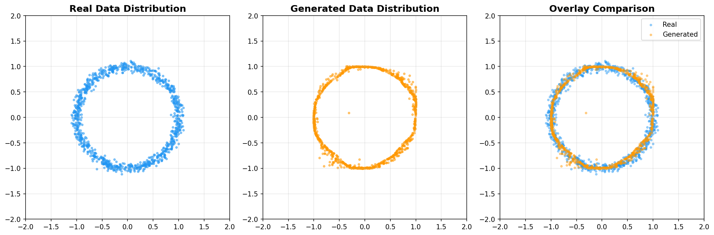

# Training a GAN on 2D Data with GANTrainer

**Level:** Beginner | **Runtime:** ~2-3 minutes (GPU/CPU) | **Format:** Python + Jupyter

This tutorial demonstrates how to train a GAN using Artifex's high-level `GANTrainer` API. Instead of implementing training from scratch, we use Artifex's WGAN-GP (Wasserstein GAN with Gradient Penalty) for stable, mode-collapse-free training on a simple 2D circular distribution.

## Files

- **Python Script**: [`examples/generative_models/image/gan/simple_gan.py`](https://github.com/avitai/artifex/blob/main/examples/generative_models/image/gan/simple_gan.py)
- **Jupyter Notebook**: [`examples/generative_models/image/gan/simple_gan.ipynb`](https://github.com/avitai/artifex/blob/main/examples/generative_models/image/gan/simple_gan.ipynb)

!!! info "Dual-Format Implementation"
    This example is available in two synchronized formats:

    - **Python Script** (.py) - For version control, IDE development, and CI/CD integration
    - **Jupyter Notebook** (.ipynb) - For interactive learning, experimentation, and exploration

    Both formats contain identical content and can be used interchangeably.

## Quick Start

```bash
# Activate Artifex environment
source activate.sh

# Run the Python script
python examples/generative_models/image/gan/simple_gan.py

# Or launch Jupyter notebook for interactive exploration
jupyter lab examples/generative_models/image/gan/simple_gan.ipynb
```

## Overview

**Learning Objectives:**

- [ ] Understand WGAN-GP and why it provides stable training
- [ ] Use Artifex's `Generator` and `Discriminator` classes with configs
- [ ] Configure `GANTrainer` with WGAN-GP loss and gradient penalty
- [ ] Train using JIT-compiled training steps for performance
- [ ] Monitor Wasserstein distance during training
- [ ] Visualize real vs. generated data distributions

**Prerequisites:**

- Basic understanding of neural networks and GANs
- Familiarity with JAX and Flax NNX basics
- Artifex installed

**Estimated Time:** 10-15 minutes

### What's Covered

<div class="grid cards" markdown>

- :material-vector-circle: **2D Data**

    ---

    Simple circular distribution for easy visualization of GAN learning

- :material-cog: **Model Configuration**

    ---

    Generator and Discriminator with `GeneratorConfig`, `DiscriminatorConfig`

- :material-school: **GANTrainer API**

    ---

    WGAN-GP training with gradient penalty for stability

- :material-lightning-bolt: **JIT Compilation**

    ---

    `nnx.jit` for optimized training performance

- :material-chart-line: **Training Monitoring**

    ---

    Wasserstein distance and loss curves visualization

- :material-compare: **Evaluation**

    ---

    Comparing real and generated data distributions

</div>

### Expected Results

After 5,000 training steps:

- **Training time:** ~2-3 minutes on GPU/CPU
- **Final Wasserstein distance:** Near 0 (distributions match)
- **Generated samples:** Points forming a circle matching real data




---

## Why These Techniques Matter

Before diving into the code, let's understand why we use specific techniques:

| Technique | Problem it Solves | Our Solution |
|-----------|-------------------|--------------|
| **WGAN-GP loss** | Vanilla GAN loss causes training instability and mode collapse | Wasserstein loss provides meaningful gradients throughout training |
| **Gradient penalty (λ=0.1)** | Weight clipping in WGAN limits model capacity | GP enforces Lipschitz constraint smoothly without clipping |
| **5 critic iterations** | Generator may overpower discriminator | Train critic more to provide better gradients to generator |
| **Adam β1=0.5, β2=0.9** | Standard Adam β1=0.9 causes GAN instability | Lower β1 reduces momentum, β2=0.9 is WGAN-GP standard |
| **No batch normalization** | Batch norm can cause issues with gradient penalty | WGAN-GP works best without batch norm |
| **Matched latent/output dim** | Complex latent→output mapping | 2D latent for 2D output simplifies learning |

---

## Prerequisites

### Installation

```bash
# Install Artifex
uv sync

# Or with CUDA support
uv sync --extra cuda-dev
```

---

## Step 1: Setup and Imports

```python
import jax
import jax.numpy as jnp
import matplotlib.pyplot as plt
import optax
from flax import nnx
from tqdm import tqdm

# Artifex imports
from artifex.generative_models.core.configuration.network_configs import (
    DiscriminatorConfig,
    GeneratorConfig,
)
from artifex.generative_models.models.gan import Discriminator, Generator
from artifex.generative_models.training.trainers.gan_trainer import (
    GANTrainer,
    GANTrainingConfig,
)

print(f"JAX backend: {jax.default_backend()}")
print(f"Devices: {jax.devices()}")
```

---

## Step 2: Configuration

Training configuration based on the official WGAN-GP implementation:

```python
# Configuration (based on official WGAN-GP toy implementation)
SEED = 42
NUM_STEPS = 5000  # Training iterations
BATCH_SIZE = 256
LATENT_DIM = 2  # Match output dim for simpler mapping
N_CRITIC = 5  # Critic iterations per generator step
LR = 1e-4  # Adam learning rate
GP_WEIGHT = 0.1  # Gradient penalty weight (0.1 for toy data)
HIDDEN_DIM = 128  # Hidden layer dimension
```

**Why these values?**

- **5,000 steps**: Sufficient for 2D toy data to converge
- **Batch size 256**: Standard for WGAN-GP toy experiments
- **Latent dim 2**: Matches output dimension for simpler mapping
- **GP weight 0.1**: Lower than standard 10.0, faster convergence for toy data
- **Hidden dim 128**: Balance between capacity and training speed

---

## Step 3: Data Generation

We use a simple circular distribution for visualization:

```python
def generate_circle_data(key, batch_size):
    """Generate 2D points on a unit circle with noise."""
    theta_key, noise_key = jax.random.split(key)
    theta = jax.random.uniform(theta_key, (batch_size,)) * 2 * jnp.pi
    r = 1.0 + jax.random.normal(noise_key, (batch_size,)) * 0.05
    x = r * jnp.cos(theta)
    y = r * jnp.sin(theta)
    return jnp.stack([x, y], axis=-1)
```

**Why Circular Data?**

- Simple 2D distribution is easy to visualize
- Clear success metric: generated points should form a circle
- Fast training for demonstration purposes

---

## Step 4: Create Models Using Artifex's API

Use Artifex's `Generator` and `Discriminator` classes with configuration objects:

```python
# Generator configuration
gen_config = GeneratorConfig(
    name="circle_generator",
    hidden_dims=(HIDDEN_DIM, HIDDEN_DIM, HIDDEN_DIM),  # 3-layer MLP
    output_shape=(1, 2),  # 2D output
    latent_dim=LATENT_DIM,
    activation="relu",
    batch_norm=False,  # No batch norm for WGAN-GP
    dropout_rate=0.0,
)

# Discriminator (critic) configuration
disc_config = DiscriminatorConfig(
    name="circle_discriminator",
    input_shape=(1, 2),  # 2D input
    hidden_dims=(HIDDEN_DIM, HIDDEN_DIM, HIDDEN_DIM),
    activation="relu",
    batch_norm=False,
    dropout_rate=0.0,
)

# Create models
gen_rngs = nnx.Rngs(params=gen_key)
disc_rngs = nnx.Rngs(params=disc_key)

generator = Generator(config=gen_config, rngs=gen_rngs)
discriminator = Discriminator(config=disc_config, rngs=disc_rngs)
```

**Artifex Model Features:**

- Frozen dataclass configurations for type safety
- Configurable MLP architectures
- Optional batch normalization and dropout
- Automatic initialization with RNGs

---

## Step 5: Create GANTrainer with WGAN-GP

Use Artifex's `GANTrainer` with WGAN-GP configuration:

```python
# Optimizers (Adam with beta1=0.5, beta2=0.9 as per official WGAN-GP)
gen_optimizer = nnx.Optimizer(
    generator,
    optax.adam(LR, b1=0.5, b2=0.9),
    wrt=nnx.Param,
)
disc_optimizer = nnx.Optimizer(
    discriminator,
    optax.adam(LR, b1=0.5, b2=0.9),
    wrt=nnx.Param,
)

# GANTrainer configuration with WGAN-GP
gan_config = GANTrainingConfig(
    loss_type="wasserstein",  # WGAN loss
    n_critic=N_CRITIC,
    gp_weight=GP_WEIGHT,  # Gradient penalty
    gp_target=1.0,
    r1_weight=0.0,
    label_smoothing=0.0,
)

trainer = GANTrainer(config=gan_config)

# JIT-compile training steps for performance
jit_d_step = nnx.jit(trainer.discriminator_step)
jit_g_step = nnx.jit(trainer.generator_step)
```

**GANTrainer Features:**

- WGAN-GP loss with configurable gradient penalty
- JIT-compatible training steps
- Returns metrics for monitoring (d_real, d_fake scores)

---

## Step 6: Training Loop

The training loop uses Artifex's `GANTrainer` methods:

```python
pbar = tqdm(range(NUM_STEPS), desc="Training")
for step in pbar:
    train_key, *step_keys = jax.random.split(train_key, 2 + N_CRITIC * 2)

    # Train Discriminator (N_CRITIC steps)
    for i in range(N_CRITIC):
        d_data_key, d_z_key, d_gp_key = jax.random.split(step_keys[i], 3)
        real_data = generate_circle_data(d_data_key, BATCH_SIZE)
        z = jax.random.normal(d_z_key, (BATCH_SIZE, LATENT_DIM))

        # Use Artifex's JIT-compiled discriminator step
        d_loss, d_metrics = jit_d_step(
            generator, discriminator, disc_optimizer, real_data, z, d_gp_key
        )

    # Train Generator (1 step)
    z = jax.random.normal(step_keys[-1], (BATCH_SIZE, LATENT_DIM))
    g_loss, g_metrics = jit_g_step(generator, discriminator, gen_optimizer, z)

    # Monitor Wasserstein distance
    w_dist = d_metrics.get("d_real", 0.0) - d_metrics.get("d_fake", 0.0)
    pbar.set_postfix({"D": f"{d_loss:.3f}", "G": f"{g_loss:.3f}", "W": f"{w_dist:.3f}"})
```

**Training Procedure per Step:**

1. Train discriminator (critic) for `N_CRITIC` iterations
2. Each critic step: sample real data, sample latent noise, compute loss with gradient penalty
3. Train generator for 1 iteration
4. Monitor Wasserstein distance (D(real) - D(fake))

---

## Step 7: Generate Samples and Visualize

```python
# Generate samples
n_samples = 1000
final_real = generate_circle_data(jax.random.key(5000), n_samples)
z_final = jax.random.normal(jax.random.key(6000), (n_samples, LATENT_DIM))
final_fake = generator(z_final)

# Evaluate radius statistics
real_radius = jnp.sqrt(jnp.sum(final_real**2, axis=1))
fake_radius = jnp.sqrt(jnp.sum(final_fake**2, axis=1))

print(f"Real: mean_radius = {jnp.mean(real_radius):.4f} ± {jnp.std(real_radius):.4f}")
print(f"Fake: mean_radius = {jnp.mean(fake_radius):.4f} ± {jnp.std(fake_radius):.4f}")
```

**Interpretation:**

- Mean radius should be close to 1.0 (the true circle radius)
- Standard deviation should be small (~0.05, matching the noise)
- Generated and real statistics should be similar

---

## Experiments to Try

1. **Increase Training Steps**: Train for 10,000+ steps for even better convergence

   ```python
   NUM_STEPS = 10000
   ```

2. **Adjust Gradient Penalty**: Try different GP weights

   ```python
   GP_WEIGHT = 1.0   # Higher penalty (more regularization)
   GP_WEIGHT = 0.01  # Lower penalty (less regularization)
   ```

3. **Change Architecture**: Add more layers or neurons

   ```python
   HIDDEN_DIM = 256  # Larger network
   ```

4. **Different Data Distribution**: Try other 2D distributions

   ```python
   # Two concentric circles, spiral, etc.
   ```

5. **Adjust Critic Iterations**: Try more or fewer critic steps

   ```python
   N_CRITIC = 10  # More critic training per generator step
   ```

---

## Troubleshooting

### Generator output doesn't match the circle

- **Solution**: Train for more steps (5,000-10,000)
- **Check**: Wasserstein distance should decrease during training
- **Fix**: Increase `HIDDEN_DIM` for more model capacity

### Training is unstable

- **Solution**: Lower learning rate to `5e-5`
- **Check**: Ensure batch normalization is disabled for WGAN-GP
- **Fix**: Increase gradient penalty weight to `1.0`

### Mode collapse (all points in one location)

- **Solution**: This is rare with WGAN-GP, but try increasing `N_CRITIC`
- **Check**: Wasserstein distance should not be near 0 immediately
- **Fix**: Ensure you're using `loss_type="wasserstein"`, not vanilla

---

## Summary

In this tutorial, you learned:

- **Artifex GANTrainer**: Using the high-level training API instead of manual implementation
- **WGAN-GP**: Why Wasserstein loss with gradient penalty provides stable training
- **Configuration**: Setting up Generator and Discriminator with config objects
- **JIT Compilation**: Using `nnx.jit` for optimized training performance
- **Monitoring**: Tracking Wasserstein distance as a training metric

---

## Next Steps

### Related Examples

<div class="grid cards" markdown>

- :material-image: **[VAE on MNIST](./vae-mnist.md)**

    ---

    Compare GAN with VAE generative approach

- :material-blur: **[Diffusion on MNIST](./diffusion-mnist.md)**

    ---

    Learn about diffusion models for image generation

- :material-water: **[Flow on MNIST](./flow-mnist.md)**

    ---

    Explore normalizing flows for exact likelihood

- :material-star-shooting: **[Advanced GAN](../advanced/advanced-gan.md)**

    ---

    DCGAN, conditional GAN, and more advanced techniques

</div>

### Documentation Resources

- **[GAN Concepts](../../user-guide/concepts/gan-explained.md)**: Deep dive into GAN theory
- **[GAN User Guide](../../user-guide/models/gan-guide.md)**: Advanced usage patterns
- **[GAN API Reference](../../api/models/gan.md)**: Complete API documentation

### Papers

1. **Generative Adversarial Networks** (Goodfellow et al., 2014)
   - Original GAN paper: <https://arxiv.org/abs/1406.2661>

2. **Wasserstein GAN** (Arjovsky et al., 2017)
   - WGAN paper: <https://arxiv.org/abs/1701.07875>

3. **Improved Training of Wasserstein GANs** (Gulrajani et al., 2017)
   - WGAN-GP paper: <https://arxiv.org/abs/1704.00028>

**Congratulations! You've successfully trained a GAN using Artifex's GANTrainer API!**
