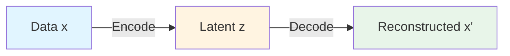
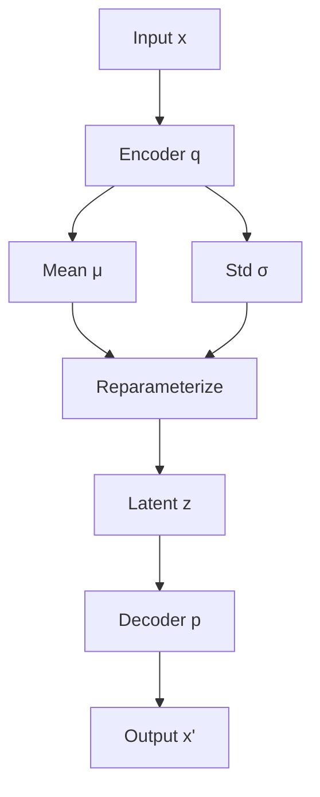
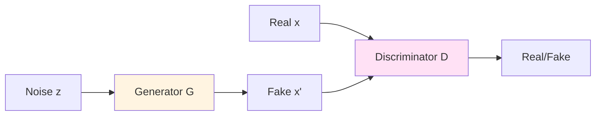
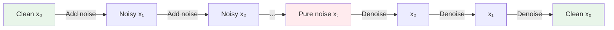
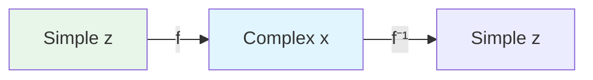
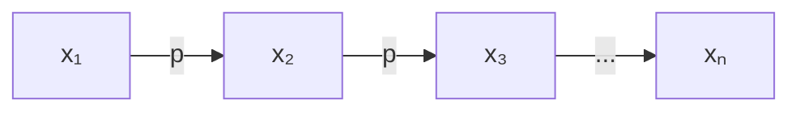
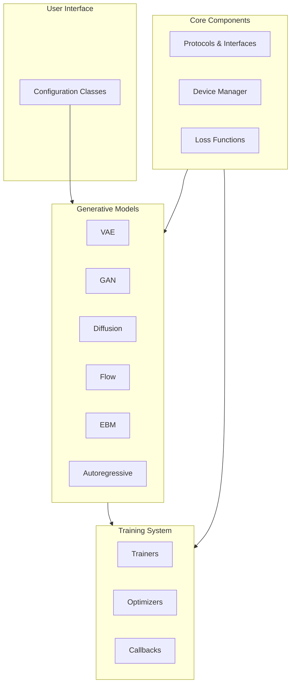

# Core Concepts

This guide introduces the fundamental concepts behind Artifex and generative modeling. Understanding these concepts will help you make the most of the library.

## What is Generative Modeling?

Generative modeling is about learning probability distributions from data and generating new samples from those distributions.

### The Core Problem

Given a dataset $\mathcal{D} = \{x_1, x_2, ..., x_N\}$, we want to:

1. **Learn** the underlying data distribution $p(x)$
2. **Generate** new samples $\tilde{x} \sim p(x)$ that look like the training data
3. **Evaluate** the quality of generated samples

### Why Generative Models?

<div class="grid cards" markdown>

- :material-image-multiple:{ .lg .middle } **Image Generation**

    ---

    Create realistic images, art, faces, or any visual content

- :material-database:{ .lg .middle } **Data Augmentation**

    ---

    Generate synthetic training data to improve discriminative models

- :material-lightbulb:{ .lg .middle } **Representation Learning**

    ---

    Learn meaningful latent representations of data

- :material-magnify:{ .lg .middle } **Anomaly Detection**

    ---

    Identify outliers by measuring likelihood under the learned distribution

- :material-animation:{ .lg .middle } **Content Creation**

    ---

    Generate text, audio, video, 3D shapes, and more

- :material-flask:{ .lg .middle } **Scientific Discovery**

    ---

    Generate molecules, proteins, materials for drug design and research

</div>

## Key Concepts

### 1. Probability Distribution

A probability distribution $p(x)$ assigns probabilities to different outcomes:

- **Discrete**: $p(x) \in [0, 1]$ for each $x$, $\sum_x p(x) = 1$
- **Continuous**: $p(x) \geq 0$, $\int p(x) dx = 1$

**Goal**: Learn $p(x)$ from data so we can sample new $x \sim p(x)$.

### 2. Likelihood

The likelihood $p(x|\theta)$ measures how probable data $x$ is under model parameters $\theta$.

**Maximum Likelihood Estimation (MLE)**:

$$
\theta^* = \arg\max_\theta \sum_{i=1}^N \log p(x_i | \theta)
$$

Models with **tractable likelihoods** (e.g., Flows, Autoregressive) directly optimize this.

### 3. Latent Variables

Latent variables $z$ are unobserved variables that capture underlying structure:

$$
p(x) = \int p(x|z) p(z) dz
$$

- $p(z)$: **Prior** distribution (usually standard normal)
- $p(x|z)$: **Likelihood** (decoder/generator)
- $p(z|x)$: **Posterior** (encoder/inference network)

**Examples**:

- VAE: Continuous latent space
- VQ-VAE: Discrete latent codebook
- Diffusion: Noisy latent trajectory

### 4. Sampling

Generating new data from the learned distribution:

**Ancestral Sampling**: Sample from the prior $z \sim p(z)$, then generate $x \sim p(x|z)$

**MCMC Sampling**: Use Markov chains to sample from complex distributions

**Diffusion Sampling**: Iteratively denoise from pure noise to data

### 5. Encoder-Decoder Architecture



- **Encoder**: Maps data to latent space $q(z|x)$
- **Decoder**: Maps latent to data space $p(x|z)$
- **Latent Space**: Compressed, structured representation

## Generative Model Types

Artifex supports six main types of generative models, each with different trade-offs:

### 1. Variational Autoencoders (VAE)

**Idea**: Learn latent representations with probabilistic encoding/decoding

**Key Equation**: Evidence Lower Bound (ELBO)

$$
\mathcal{L}_{ELBO} = \mathbb{E}_{q(z|x)}[\log p(x|z)] - \text{KL}(q(z|x) || p(z))
$$

**Architecture**:



**Pros**:

- Stable training
- Interpretable latent space
- Fast sampling

**Cons**:

- Lower sample quality compared to GANs/Diffusion
- Posterior approximation may be limited

**Use Cases**: Data compression, latent space exploration, representation learning

**Artifex Example**:

```python
from flax import nnx
from artifex.generative_models.models.vae import VAE
from artifex.generative_models.core.configuration import VAEConfig, EncoderConfig, DecoderConfig

encoder = EncoderConfig(name="encoder", input_shape=(28, 28, 1), latent_dim=128, hidden_dims=(256, 128), activation="relu")
decoder = DecoderConfig(name="decoder", latent_dim=128, output_shape=(28, 28, 1), hidden_dims=(128, 256), activation="relu")
config = VAEConfig(name="beta_vae", encoder=encoder, decoder=decoder, encoder_type="dense", kl_weight=1.0)
rngs = nnx.Rngs(0)
model = VAE(config, rngs=rngs)
```

### 2. Generative Adversarial Networks (GAN)

**Idea**: Train generator and discriminator in adversarial game

**Key Equation**: Minimax objective

$$
\min_G \max_D \mathbb{E}_{x \sim p_{data}}[\log D(x)] + \mathbb{E}_{z \sim p(z)}[\log(1 - D(G(z)))]
$$

**Architecture**:



**Pros**:

- Highest sample quality
- No explicit likelihood needed
- Mode coverage (with proper training)

**Cons**:

- Training instability (mode collapse, vanishing gradients)
- Hyperparameter sensitive
- No direct likelihood evaluation

**Use Cases**: High-quality image generation, style transfer, image-to-image translation

**Artifex Example**:

```python
from flax import nnx
from artifex.generative_models.models.gan import DCGAN
from artifex.generative_models.core.configuration import (
    DCGANConfig, ConvGeneratorConfig, ConvDiscriminatorConfig
)

generator = ConvGeneratorConfig(
    name="generator", latent_dim=100, hidden_dims=(512, 256, 128, 64),
    output_shape=(1, 28, 28), kernel_size=(4, 4), stride=(2, 2), padding="SAME",
    activation="relu"
)
discriminator = ConvDiscriminatorConfig(
    name="discriminator", hidden_dims=(64, 128, 256, 512),
    input_shape=(1, 28, 28), kernel_size=(4, 4), stride=(2, 2), padding="SAME",
    activation="leaky_relu"
)
config = DCGANConfig(name="dcgan", generator=generator, discriminator=discriminator)
rngs = nnx.Rngs(params=0, dropout=1, sample=2)
model = DCGAN(config, rngs=rngs)
```

### 3. Diffusion Models

**Idea**: Learn to denoise data through iterative refinement

**Forward Process**: Add noise gradually

$$
q(x_t | x_{t-1}) = \mathcal{N}(x_t; \sqrt{1-\beta_t} x_{t-1}, \beta_t I)
$$

**Reverse Process**: Learn to denoise

$$
p_\theta(x_{t-1} | x_t) = \mathcal{N}(x_{t-1}; \mu_\theta(x_t, t), \Sigma_\theta(x_t, t))
$$

**Architecture**:



**Pros**:

- State-of-the-art sample quality
- Stable training
- Flexible conditioning and guidance

**Cons**:

- Slow sampling (many steps)
- Memory intensive
- Training time

**Use Cases**: Image/audio generation, inpainting, super-resolution, conditional generation

**Artifex Example**:

```python
from flax import nnx
from artifex.generative_models.models.diffusion import DDPMModel
from artifex.generative_models.core.configuration import DDPMConfig, UNetBackboneConfig, NoiseScheduleConfig

backbone = UNetBackboneConfig(name="backbone", in_channels=1, out_channels=1, hidden_dims=(64, 128), channel_mult=(1, 2), activation="silu")
noise_schedule = NoiseScheduleConfig(name="schedule", schedule_type="cosine", num_timesteps=1000)
config = DDPMConfig(name="ddpm", input_shape=(28, 28, 1), backbone=backbone, noise_schedule=noise_schedule)
rngs = nnx.Rngs(0)
model = DDPMModel(config, rngs=rngs)
```

### 4. Normalizing Flows

**Idea**: Use invertible transformations with tractable Jacobians

**Key Property**: Change of variables

$$
p_X(x) = p_Z(f^{-1}(x)) \left| \det \frac{\partial f^{-1}}{\partial x} \right|
$$

**Architecture**:



**Pros**:

- Exact likelihood computation
- Invertible (can go both ways)
- Stable training

**Cons**:

- Architecture constraints (must be invertible)
- May require many layers for expressiveness

**Use Cases**: Density estimation, exact inference, anomaly detection

**Artifex Example**:

```python
from flax import nnx
from artifex.generative_models.models.flow import RealNVP
from artifex.generative_models.core.configuration import RealNVPConfig, CouplingNetworkConfig

coupling = CouplingNetworkConfig(name="coupling", hidden_dims=(256, 256), activation="relu")
config = RealNVPConfig(name="realnvp", input_dim=784, num_coupling_layers=8, coupling_network=coupling)
rngs = nnx.Rngs(0)
model = RealNVP(config, rngs=rngs)
```

### 5. Energy-Based Models (EBM)

**Idea**: Learn energy function, sample with MCMC

**Key Equation**: Gibbs distribution

$$
p(x) = \frac{1}{Z} \exp(-E(x))
$$

where

$$Z = \int \exp(-E(x)) dx$$

is the partition function.

**Pros**:

- Flexible, can model any distribution
- Composable (combine multiple EBMs)

**Cons**:

- Expensive sampling (MCMC)
- Training complexity (contrastive divergence)

**Use Cases**: Compositional generation, constraint satisfaction, hybrid models

**Artifex Example**:

```python
from flax import nnx
from artifex.generative_models.models.energy import EBM
from artifex.generative_models.core.configuration import EBMConfig, EnergyNetworkConfig, MCMCConfig
from artifex.generative_models.core.configuration.energy_config import SampleBufferConfig

energy_network = EnergyNetworkConfig(name="energy_net", hidden_dims=(256, 256), activation="swish")
mcmc = MCMCConfig(name="mcmc", n_steps=60, step_size=0.01)
sample_buffer = SampleBufferConfig(name="buffer", capacity=10000)
config = EBMConfig(name="ebm", input_dim=784, energy_network=energy_network, mcmc=mcmc, sample_buffer=sample_buffer)
rngs = nnx.Rngs(0)
model = EBM(config, rngs=rngs)
```

### 6. Autoregressive Models

**Idea**: Model distribution as product of conditionals

$$
p(x) = \prod_{i=1}^n p(x_i | x_{<i})
$$

**Architecture**:



**Pros**:

- Explicit likelihood
- Flexible architectures (Transformers, CNNs)
- Strong theoretical foundation

**Cons**:

- Sequential generation (slow)
- Fixed ordering required

**Use Cases**: Text generation, ordered sequences, explicit probability modeling

**Artifex Example**:

```python
from flax import nnx
from artifex.generative_models.models.autoregressive import PixelCNN
from artifex.generative_models.core.configuration import PixelCNNConfig

config = PixelCNNConfig(name="pixelcnn", image_shape=(28, 28, 1), hidden_channels=64, num_layers=8)
rngs = nnx.Rngs(0)
model = PixelCNN(config, rngs=rngs)
```

## Model Comparison Matrix

| Feature | VAE | GAN | Diffusion | Flow | EBM | Autoregressive |
|---------|-----|-----|-----------|------|-----|----------------|
| **Sample Quality** | ⭐⭐⭐ | ⭐⭐⭐⭐⭐ | ⭐⭐⭐⭐⭐ | ⭐⭐⭐⭐ | ⭐⭐⭐⭐ | ⭐⭐⭐⭐ |
| **Training Stability** | ⭐⭐⭐⭐⭐ | ⭐⭐ | ⭐⭐⭐⭐⭐ | ⭐⭐⭐⭐ | ⭐⭐⭐ | ⭐⭐⭐⭐⭐ |
| **Sampling Speed** | ⭐⭐⭐⭐⭐ | ⭐⭐⭐⭐⭐ | ⭐⭐ | ⭐⭐⭐⭐ | ⭐⭐ | ⭐⭐ |
| **Exact Likelihood** | ❌ | ❌ | ❌ | ✅ | ❌* | ✅ |
| **Latent Space** | ✅ | ✅ | ❌ | ✅ | ❌ | ❌ |
| **Mode Coverage** | ⭐⭐⭐⭐ | ⭐⭐⭐ | ⭐⭐⭐⭐⭐ | ⭐⭐⭐⭐ | ⭐⭐⭐⭐ | ⭐⭐⭐⭐⭐ |

*EBM has exact likelihood but intractable partition function

## Artifex Architecture

### High-Level Design

Artifex follows a modular, protocol-based design:



### Key Design Principles

1. **Protocol-Based**: Type-safe interfaces using Python Protocols
2. **Configuration-Driven**: Pydantic-based unified configuration system
3. **Factory Pattern**: Centralized model creation
4. **Hardware-Aware**: Automatic GPU/CPU/TPU detection and optimization
5. **Modular**: Composable components for flexibility

### Configuration System

All models use a unified configuration class:

```python
from artifex.generative_models.core.configuration import ModelConfig

config = ModelConfig(
    # Required fields
    name="vae_experiment",
    model_class="artifex.generative_models.models.vae.VAE",  # Fully qualified class name
    input_dim=(28, 28, 1),         # Input dimensions (int or tuple)

    # Architecture
    hidden_dims=(256, 128, 64),    # Hidden layer sizes
    output_dim=32,                 # Output/latent dimensions
    activation="gelu",             # Activation function

    # Model-specific parameters (functional hyperparameters)
    parameters={
        "beta": 1.0,                # VAE-specific: β-VAE weight
        "kl_weight": 1.0,           # KL divergence weight
        "reconstruction_loss": "mse" # Reconstruction loss type
    },

    # Optional metadata (non-functional tracking info)
    metadata={
        "experiment_id": "vae_001",
        "dataset": "mnist"
    }
)
```

**Benefits**:

- Type-safe with Pydantic validation
- Serializable (save/load configurations)
- Versioned for reproducibility
- Extensible for custom models

### Device Management

Artifex automatically handles GPU/CPU/TPU:

```python
from artifex.generative_models.core.device_manager import get_device_manager
import jax

# Automatic device detection
manager = get_device_manager()
info = manager.get_device_info()
print(f"Using: {info['backend']}")  # gpu, cpu, or tpu
print(f"Device count: {len(jax.devices())}")

# Explicit configuration
from artifex.generative_models.core.device_manager import configure_for_generative_models, MemoryStrategy

manager = configure_for_generative_models(
    memory_strategy=MemoryStrategy.BALANCED,  # 75% GPU memory
    enable_mixed_precision=True                # BF16/FP16
)
```

### Protocol System

Models implement the `GenerativeModelProtocol`:

```python
from typing import Any, Protocol
from flax import nnx
import jax

class GenerativeModelProtocol(Protocol):
    """Base protocol for all generative models."""

    def __call__(self, x: Any, *, rngs: nnx.Rngs | None = None, **kwargs) -> dict[str, Any]:
        """Forward pass."""
        ...

    def generate(self, n_samples: int = 1, *, rngs: nnx.Rngs | None = None, **kwargs) -> jax.Array:
        """Generate samples from the model."""
        ...

    def loss_fn(self, batch: Any, model_outputs: dict[str, Any], *, rngs: nnx.Rngs | None = None, **kwargs) -> dict[str, Any]:
        """Compute loss."""
        ...

    def sample(self, num_samples: int, **kwargs: Any) -> jax.Array:
        """Generate samples (alias for generate)."""
        ...
```

This enables:

- **Type checking** at development time
- **Generic training loops** that work with any model
- **Consistent interfaces** across model types

## JAX and Flax NNX Basics

Artifex is built on JAX and Flax NNX. Here are the key concepts:

### JAX: Functional Programming

JAX provides functional transformations:

```python
import jax
import jax.numpy as jnp

# JIT compilation for speed
@jax.jit
def fast_function(x):
    return jnp.sum(x ** 2)

# Automatic differentiation
def loss_fn(params, x):
    return jnp.sum((params['w'] * x) ** 2)

grad_fn = jax.grad(loss_fn)  # Get gradient function
gradients = grad_fn(params, x)  # Compute gradients

# Vectorization
batch_fn = jax.vmap(fast_function)  # Apply to batches
```

### Flax NNX: Object-Oriented Neural Networks

Flax NNX provides a Pythonic API for neural networks:

```python
from flax import nnx

class MyModel(nnx.Module):
    def __init__(self, features: int, *, rngs: nnx.Rngs):
        super().__init__()
        self.dense1 = nnx.Linear(784, features, rngs=rngs)
        self.dense2 = nnx.Linear(features, 10, rngs=rngs)

    def __call__(self, x: jax.Array) -> jax.Array:
        x = self.dense1(x)
        x = nnx.relu(x)
        x = self.dense2(x)
        return x

# Create model
rngs = nnx.Rngs(0)
model = MyModel(features=128, rngs=rngs)

# Use model
x = jax.random.normal(jax.random.PRNGKey(0), (32, 784))
y = model(x)
```

### Random Number Generation

JAX requires explicit RNG management:

```python
from flax import nnx

# Create RNG
rngs = nnx.Rngs(seed=42)

# Use for model initialization
model = MyModel(rngs=rngs)

# Use for sampling
samples = jax.random.normal(rngs.sample(), (10, 784))
```

## Multi-Modal Support

Artifex supports multiple data modalities. Some datasets are currently implemented while others are planned for future releases:

### Image

!!! note "Coming Soon"
    CIFAR10Dataset is planned but not yet implemented.

```python
# Planned API (not yet available)
from artifex.data.datasets.image import CIFAR10Dataset

dataset = CIFAR10Dataset(root='./data', train=True)
```

### Text

!!! note "Coming Soon"
    WikipediaDataset is planned but not yet implemented.

```python
# Planned API (not yet available)
from artifex.data.datasets.text import WikipediaDataset

dataset = WikipediaDataset(
    tokenizer='bpe',
    max_length=512
)
```

### Audio

!!! note "Coming Soon"
    LibriSpeechDataset is planned but not yet implemented.

```python
# Planned API (not yet available)
from artifex.data.datasets.audio import LibriSpeechDataset

dataset = LibriSpeechDataset(
    root='./data',
    sample_rate=16000
)
```

### Protein

```python
from artifex.data.protein_dataset import ProteinDataset

dataset = ProteinDataset(
    pdb_dir='./data/pdb',
    with_constraints=True
)
```

## Next Steps

Now that you understand the core concepts:

<div class="grid cards" markdown>

- :material-school:{ .lg .middle } **Quickstart Guide**

    ---

    Train your first VAE model with Artifex in minutes

    [:octicons-arrow-right-24: Quickstart](quickstart.md)

- :material-book-open:{ .lg .middle } **Explore Model Guides**

    ---

    Deep dives into each model type with examples

    [:octicons-arrow-right-24: VAE Guide](../user-guide/models/vae-guide.md)
    [:octicons-arrow-right-24: Model Implementations](../models/index.md)

- :material-code-braces:{ .lg .middle } **Check API Reference**

    ---

    Complete API documentation for all components

    [:octicons-arrow-right-24: Core API](../api/core/base.md)

- :material-train:{ .lg .middle } **Learn Training**

    ---

    Training workflows, optimization, and distributed training

    [:octicons-arrow-right-24: Training Guide](../training/index.md)

</div>

## Further Reading

### Generative Models

- **VAE**: Kingma & Welling (2013) - [Auto-Encoding Variational Bayes](https://arxiv.org/abs/1312.6114)
- **GAN**: Goodfellow et al. (2014) - [Generative Adversarial Networks](https://arxiv.org/abs/1406.2661)
- **Diffusion**: Ho et al. (2020) - [Denoising Diffusion Probabilistic Models](https://arxiv.org/abs/2006.11239)
- **Flow**: Dinh et al. (2016) - [Density Estimation using Real NVP](https://arxiv.org/abs/1605.08803)

### JAX and Flax

- [JAX Documentation](https://jax.readthedocs.io/)
- [Flax NNX Documentation](https://flax.readthedocs.io/en/latest/nnx/index.html)
- [JAX 101 Tutorial](https://jax.readthedocs.io/en/latest/jax-101/index.html)

---

**Last Updated**: 2026-02-02
