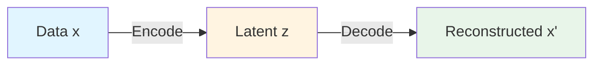
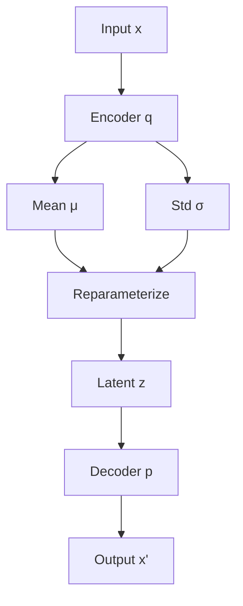
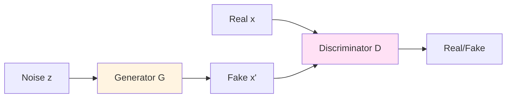
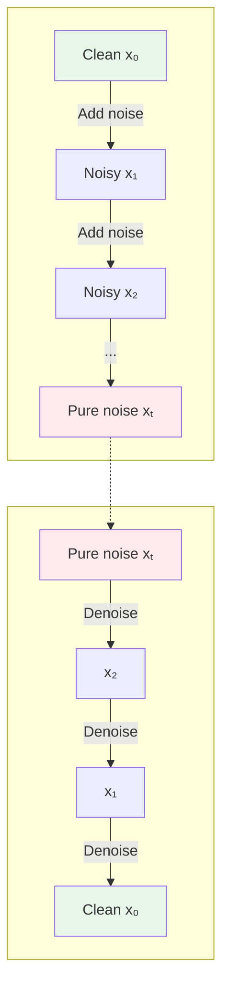
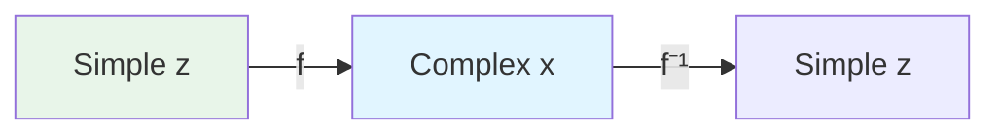
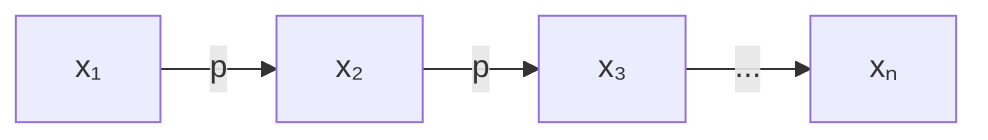
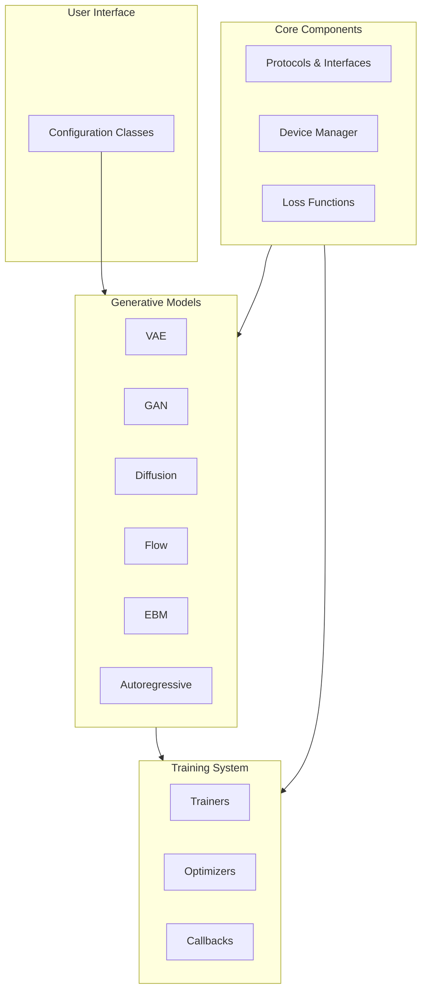

# Core Concepts

This guide introduces the fundamental concepts behind Artifex and modern
generative modeling. It is intended for readers who already know basic
deep learning and want a precise, citation-backed map of the techniques the
library implements and the design decisions behind its public surface.

Each model family below is grounded in the original paper (or the canonical
follow-up), and every example matches the actual configuration classes
exported from `artifex.generative_models.core.configuration`.

Citations follow the academic
*(Author, Year)* convention; each is a clickable link to the
[References](#references) section at the bottom of this page.

## What is Generative Modeling?

Generative modeling is the problem of learning an unknown probability
distribution $p_{\text{data}}(x)$ from a finite dataset
$\mathcal{D} = \{x_i\}_{i=1}^N$ of i.i.d. samples and using the learned
model $p_\theta(x)$ to draw new samples and/or evaluate probabilities. The
standard reference for the modern deep-generative formulation is
[Goodfellow et al., 2016, Ch. 20](#goodfellow-2016), and the cross-family
survey is [Bond-Taylor et al., 2022](#bondtaylor-2022).

### The Core Problem

Given a dataset $\mathcal{D} = \{x_1, x_2, ..., x_N\}$, the goals are to:

1. **Learn** the underlying data distribution $p_{\text{data}}(x)$
2. **Generate** new samples $\tilde{x} \sim p_\theta(x)$ that are
   indistinguishable from the data
3. **Evaluate** sample quality and (when tractable) likelihood

### Why Generative Models?

<div class="grid cards" markdown>

- :material-image-multiple:{ .lg .middle } **Image / Video Synthesis**

    ---

    Photorealistic image, video, and 3D content
    ([Karras et al., 2020](#karras-2020);
    [Ho et al., 2020](#ho-2020);
    [Rombach et al., 2022](#rombach-2022))

- :material-database:{ .lg .middle } **Data Augmentation**

    ---

    Synthetic training data for low-resource discriminative models
    ([Antoniou et al., 2017](#antoniou-2017))

- :material-lightbulb:{ .lg .middle } **Representation Learning**

    ---

    Disentangled and semantically structured latent codes
    ([Higgins et al., 2017](#higgins-2017);
    [van den Oord et al., 2017](#vandenoord-vqvae-2017))

- :material-magnify:{ .lg .middle } **Anomaly / OOD Detection**

    ---

    Likelihood-based outlier detection
    ([Nalisnick et al., 2019](#nalisnick-2019))

- :material-animation:{ .lg .middle } **Sequence and Audio Generation**

    ---

    Text, speech, music, and time-series synthesis
    ([van den Oord et al., 2016b](#vandenoord-wavenet-2016);
    [Vaswani et al., 2017](#vaswani-2017))

- :material-flask:{ .lg .middle } **Scientific Discovery**

    ---

    Molecules, proteins, and materials
    ([Hoogeboom et al., 2022](#hoogeboom-2022);
    [Watson et al., 2023](#watson-2023))

</div>

## Key Concepts

### 1. Probability Distribution

A probability distribution $p(x)$ assigns nonnegative mass / density to
outcomes:

- **Discrete**: $p(x) \in [0, 1]$ for each $x$, $\sum_x p(x) = 1$
- **Continuous**: $p(x) \geq 0$, $\int p(x)\,dx = 1$

The generative-modeling goal is to learn a parametric family $p_\theta(x)$
and a sampling procedure that produces draws from it.

### 2. Likelihood and Maximum Likelihood Estimation

The likelihood $p_\theta(x)$ is the probability assigned by a model with
parameters $\theta$ to a data point $x$. Maximum Likelihood Estimation (MLE)
chooses $\theta$ to minimize the forward (data-to-model) Kullback–Leibler
divergence and is equivalent to:

$$
\theta^* = \arg\max_\theta \sum_{i=1}^N \log p_\theta(x_i)
$$

Models with **tractable exact likelihood** — normalizing flows
([Rezende & Mohamed, 2015](#rezende-2015);
[Dinh et al., 2017](#dinh-2017)) and autoregressive models
([Larochelle & Murray, 2011](#larochelle-2011);
[van den Oord et al., 2016a](#vandenoord-pixelcnn-2016)) — optimize this
directly. VAEs optimize a tractable lower bound
([Kingma & Welling, 2014](#kingma-welling-2014)); GANs optimize an
adversarial surrogate ([Goodfellow et al., 2014](#goodfellow-2014));
diffusion models optimize a denoising score-matching surrogate
([Ho et al., 2020](#ho-2020); [Song et al., 2021b](#song-sde-2021)).

### 3. Latent Variables

Latent variables $z$ are unobserved factors that mediate the generative
process:

$$
p_\theta(x) = \int p_\theta(x \mid z)\, p(z)\, dz
$$

- $p(z)$: **prior** distribution (typically $\mathcal{N}(0, I)$)
- $p_\theta(x \mid z)$: **likelihood** / decoder / generator
- $p_\theta(z \mid x)$: **posterior** — usually intractable, approximated
  by $q_\phi(z \mid x)$ in variational inference
  ([Jordan et al., 1999](#jordan-1999))

**Examples in Artifex**:

- VAE — continuous Gaussian latent
  ([Kingma & Welling, 2014](#kingma-welling-2014))
- VQ-VAE — discrete codebook latent
  ([van den Oord et al., 2017](#vandenoord-vqvae-2017))
- Latent / Stable Diffusion — pretrained autoencoder latent
  ([Rombach et al., 2022](#rombach-2022))
- Diffusion — sequence of progressively noised latents
  ([Sohl-Dickstein et al., 2015](#sohldickstein-2015);
  [Ho et al., 2020](#ho-2020))

### 4. Sampling

Generating a new $\tilde x \sim p_\theta(x)$:

- **Ancestral sampling**: draw $z \sim p(z)$ then
  $\tilde x \sim p_\theta(x \mid z)$ (used in VAEs, GANs, conditional
  autoregressive decoders).
- **MCMC sampling**: simulate a Markov chain whose stationary distribution
  is the target. Langevin dynamics
  ([Welling & Teh, 2011](#welling-teh-2011)) is the standard choice for
  energy-based models.
- **Iterative denoising**: solve a reverse-time SDE / ODE on the data
  manifold, as in DDPM and DDIM ([Ho et al., 2020](#ho-2020);
  [Song et al., 2021a](#song-ddim-2021);
  [Song et al., 2021b](#song-sde-2021)).
- **Probability-flow ODE**: deterministic counterpart to score-based SDE
  sampling ([Song et al., 2021b](#song-sde-2021)).

### 5. Encoder–Decoder Architecture


```mermaid
graph LR
    X[Data x] -->|Encode| Z[Latent z]
    Z -->|Decode| XR[Reconstructed x']

    style X fill:#e1f5ff
    style Z fill:#fff4e1
    style XR fill:#e8f5e9
```

- **Encoder**: $q_\phi(z \mid x)$ — maps data to latent space
- **Decoder**: $p_\theta(x \mid z)$ — maps latent back to data
- **Latent space**: a learned, lower-dimensional, semantically structured
  manifold ([Bengio et al., 2013](#bengio-2013))

## Generative Model Types

Artifex implements six widely-used model families. The trade-off table at
the end of this section summarizes them.

### 1. Variational Autoencoders (VAE)

**Idea**: train a probabilistic encoder–decoder pair by maximizing the
**Evidence Lower Bound (ELBO)** on $\log p_\theta(x)$.

**Reference**: [Kingma & Welling, 2014](#kingma-welling-2014). For the
disentanglement-oriented β-VAE variant see
[Higgins et al., 2017](#higgins-2017); for VQ-VAE see
[van den Oord et al., 2017](#vandenoord-vqvae-2017).

**ELBO**:

$$
\mathcal{L}_{\text{ELBO}}(x) = \mathbb{E}_{q_\phi(z|x)}[\log p_\theta(x \mid z)]
- \mathrm{KL}\!\big(q_\phi(z \mid x)\, \|\, p(z)\big)
$$

The first term is reconstruction; the second is a KL regularizer toward
the prior. The reparameterization trick —
$z = \mu_\phi(x) + \sigma_\phi(x) \odot \varepsilon$ with
$\varepsilon \sim \mathcal{N}(0, I)$ — is what makes the ELBO
differentiable end-to-end ([Kingma & Welling, 2014](#kingma-welling-2014)).

**Architecture**:


```mermaid
graph TD
    X[Input x] --> E[Encoder q]
    E --> M[Mean μ]
    E --> S[Std σ]
    M --> R[Reparameterize]
    S --> R
    R --> Z[Latent z]
    Z --> D[Decoder p]
    D --> XR[Output x']
```

**Pros**: stable training; smooth, navigable latent space; fast ancestral
sampling; principled likelihood lower bound.

**Cons**: blurrier samples than GANs / diffusion; the Gaussian variational
posterior limits expressiveness ([Cremer et al., 2018](#cremer-2018)).

**Use cases**: representation learning, lossy compression, latent-space
interpolation, semi-supervised learning.

**Artifex example**:

```python
from flax import nnx
from artifex.generative_models.core.configuration import (
    DecoderConfig,
    EncoderConfig,
    VAEConfig,
)
from artifex.generative_models.models.vae import VAE

encoder = EncoderConfig(
    name="encoder",
    input_shape=(28, 28, 1),
    latent_dim=128,
    hidden_dims=(256, 128),
    activation="relu",
)
decoder = DecoderConfig(
    name="decoder",
    latent_dim=128,
    output_shape=(28, 28, 1),
    hidden_dims=(128, 256),
    activation="relu",
)
config = VAEConfig(
    name="beta_vae",
    encoder=encoder,
    decoder=decoder,
    encoder_type="dense",
    kl_weight=1.0,
)
model = VAE(config, rngs=nnx.Rngs(0))
```

### 2. Generative Adversarial Networks (GAN)

**Idea**: train a generator $G$ and discriminator $D$ in a two-player
minimax game; at equilibrium $G$ matches the data distribution and $D$ is
chance-level.

**Reference**: [Goodfellow et al., 2014](#goodfellow-2014). The
convolutional architecture used in `DCGAN` follows
[Radford et al., 2016](#radford-2016). For the Wasserstein objective see
[Arjovsky et al., 2017](#arjovsky-2017) and
[Gulrajani et al., 2017](#gulrajani-2017); for least-squares see
[Mao et al., 2017](#mao-2017); for image translation see
[Zhu et al., 2017](#zhu-2017); for high-resolution generation see
StyleGAN3 ([Karras et al., 2021](#karras-2021)).

**Minimax objective**:

$$
\min_G \max_D \mathbb{E}_{x \sim p_{\text{data}}}[\log D(x)]
+ \mathbb{E}_{z \sim p(z)}[\log(1 - D(G(z)))]
$$

**Architecture**:


```mermaid
graph LR
    Z[Noise z] --> G[Generator G]
    G --> XF[Fake x']
    XR[Real x] --> D[Discriminator D]
    XF --> D
    D --> R[Real/Fake]

    style G fill:#fff4e1
    style D fill:#ffe1f5
```

**Pros**: highest perceptual quality on natural images; no explicit
likelihood needed; very fast single-step sampling.

**Cons**: training instability — mode collapse, vanishing gradients,
non-convergence ([Salimans et al., 2016](#salimans-2016)); hyperparameter
sensitivity; no built-in likelihood for evaluation or anomaly detection.

**Use cases**: high-quality image synthesis, image-to-image translation,
super-resolution, style transfer.

**Artifex example** (DCGAN):

```python
from flax import nnx
from artifex.generative_models.core.configuration import (
    ConvDiscriminatorConfig,
    ConvGeneratorConfig,
    DCGANConfig,
)
from artifex.generative_models.models.gan import DCGAN

generator = ConvGeneratorConfig(
    name="generator",
    latent_dim=100,
    hidden_dims=(512, 256, 128, 64),
    output_shape=(1, 28, 28),
    kernel_size=(4, 4),
    stride=(2, 2),
    padding="SAME",
    activation="relu",
)
discriminator = ConvDiscriminatorConfig(
    name="discriminator",
    hidden_dims=(64, 128, 256, 512),
    input_shape=(1, 28, 28),
    kernel_size=(4, 4),
    stride=(2, 2),
    padding="SAME",
    activation="leaky_relu",
)
config = DCGANConfig(name="dcgan", generator=generator, discriminator=discriminator)
# DCGAN requires explicit "sample" stream for inference-time noise
model = DCGAN(config, rngs=nnx.Rngs(params=0, dropout=1, sample=2))
```

GAN families do not expose `loss_fn(...)` directly — they expose
`generator_objective(...)` and `discriminator_objective(...)` and rely on
a trainer that alternates updates. See *Protocol System* below.

### 3. Diffusion Models

**Idea**: define a fixed Markov chain that gradually corrupts data with
Gaussian noise; learn a neural network to invert each step. Sampling runs
the learned reverse chain from pure noise back to data.

**References**:

- Foundational: [Sohl-Dickstein et al., 2015](#sohldickstein-2015)
- DDPM: [Ho et al., 2020](#ho-2020)
- DDIM: [Song et al., 2021a](#song-ddim-2021)
- Score-SDE unification: [Song et al., 2021b](#song-sde-2021)
- Cosine schedule / improved DDPM:
  [Nichol & Dhariwal, 2021](#nichol-dhariwal-2021)
- Latent / Stable Diffusion: [Rombach et al., 2022](#rombach-2022)
- Diffusion Transformer: [Peebles & Xie, 2023](#peebles-xie-2023)

**Forward (noising) process** with variance schedule
$\{\beta_t\}_{t=1}^T$:

$$
q(x_t \mid x_{t-1}) = \mathcal{N}\!\big(x_t;\, \sqrt{1-\beta_t}\, x_{t-1},\, \beta_t I\big)
$$

A closed-form marginal exists at any $t$:
$q(x_t \mid x_0) = \mathcal{N}(x_t;\, \sqrt{\bar\alpha_t}\, x_0,\, (1-\bar\alpha_t) I)$
with $\bar\alpha_t = \prod_{s\le t}(1-\beta_s)$.

**Reverse (denoising) process**, parameterized by a network
$\epsilon_\theta(x_t, t)$:

$$
p_\theta(x_{t-1} \mid x_t) = \mathcal{N}\!\big(x_{t-1};\, \mu_\theta(x_t, t),\, \Sigma_\theta(x_t, t)\big)
$$

Training reduces ([Ho et al., 2020](#ho-2020)) to the simple denoising loss

$$
\mathcal{L}_{\text{simple}}(\theta) = \mathbb{E}_{t,\, x_0,\, \epsilon}
\big[\|\epsilon - \epsilon_\theta(\sqrt{\bar\alpha_t} x_0 + \sqrt{1-\bar\alpha_t}\,\epsilon,\, t)\|_2^2\big].
$$

**Architecture**:


```mermaid
graph TB
    subgraph Forward[" "]
        direction LR
        X0[Clean x₀] -->|Add noise| X1[Noisy x₁]
        X1 -->|Add noise| X2[Noisy x₂]
        X2 -->|...| XT[Pure noise xₜ]
    end

    subgraph Reverse[" "]
        direction LR
        XT2[Pure noise xₜ] -->|Denoise| X2R[x₂]
        X2R -->|Denoise| X1R[x₁]
        X1R -->|Denoise| X0R[Clean x₀]
    end

    XT -.-> XT2

    style X0 fill:#e8f5e9
    style XT fill:#ffebee
    style XT2 fill:#ffebee
    style X0R fill:#e8f5e9
```

**Pros**: state-of-the-art image / audio / video quality; stable training;
strong support for classifier-free guidance
([Ho & Salimans, 2022](#ho-salimans-2022)) and conditional / text-to-image
generation.

**Cons**: many forward passes per sample (typically 25–1000 NFEs); memory
intensive at high resolution; long training. DDIM and probability-flow ODE
solvers ([Song et al., 2021a](#song-ddim-2021);
[Song et al., 2021b](#song-sde-2021);
[Karras et al., 2022](#karras-2022)) reduce the cost.

**Use cases**: photorealistic image / audio synthesis, inpainting,
super-resolution, conditional and text-guided generation, scientific
generative modeling.

**Artifex example**:

```python
from flax import nnx
from artifex.generative_models.core.configuration import (
    DDPMConfig,
    NoiseScheduleConfig,
    UNetBackboneConfig,
)
from artifex.generative_models.models.diffusion import DDPMModel

backbone = UNetBackboneConfig(
    name="backbone",
    in_channels=1,
    out_channels=1,
    hidden_dims=(64, 128),
    channel_mult=(1, 2),
    activation="silu",
)
noise_schedule = NoiseScheduleConfig(
    name="schedule",
    schedule_type="cosine",  # Nichol & Dhariwal, 2021
    num_timesteps=1000,
)
config = DDPMConfig(
    name="ddpm",
    input_shape=(28, 28, 1),  # H, W, C — must match backbone.in_channels
    backbone=backbone,
    noise_schedule=noise_schedule,
)
model = DDPMModel(config, rngs=nnx.Rngs(0))
```

### 4. Normalizing Flows

**Idea**: represent the data distribution as the pushforward of a simple
base distribution through a sequence of invertible, differentiable
transformations with tractable Jacobian determinants.

**References**:

- [Rezende & Mohamed, 2015](#rezende-2015)
- Real NVP: [Dinh et al., 2017](#dinh-2017)
- Glow: [Kingma & Dhariwal, 2018](#kingma-dhariwal-2018)
- MAF: [Papamakarios et al., 2017](#papamakarios-2017)
- IAF: [Kingma et al., 2016](#kingma-iaf-2016)
- Neural Spline Flows: [Durkan et al., 2019](#durkan-2019)
- Survey: [Papamakarios et al., 2021](#papamakarios-2021)

**Change-of-variables**: for $x = f_\theta(z)$ with invertible $f_\theta$,

$$
\log p_X(x) = \log p_Z\!\big(f_\theta^{-1}(x)\big)
+ \log \!\left|\det \frac{\partial f_\theta^{-1}(x)}{\partial x}\right|.
$$


```mermaid
graph LR
    Z[Simple z] -->|f| X[Complex x]
    X -->|f⁻¹| Z2[Simple z]

    style Z fill:#e8f5e9
    style X fill:#e1f5ff
```

**Pros**: exact log-likelihood; exact, deterministic invertibility (good
for encoding and density estimation); stable training.

**Cons**: invertibility constrains architecture; the latent dimension
equals the data dimension; expressivity often requires many layers.

**Use cases**: density estimation, exact-likelihood anomaly detection,
variational posteriors, simulation-based inference.

**Artifex example** (RealNVP):

```python
from flax import nnx
from artifex.generative_models.core.configuration import (
    CouplingNetworkConfig,
    RealNVPConfig,
)
from artifex.generative_models.models.flow import RealNVP

coupling = CouplingNetworkConfig(
    name="coupling", hidden_dims=(256, 256), activation="relu"
)
config = RealNVPConfig(
    name="realnvp",
    input_dim=784,
    num_coupling_layers=8,
    coupling_network=coupling,
)
model = RealNVP(config, rngs=nnx.Rngs(0))
```

### 5. Energy-Based Models (EBM)

**Idea**: parametrize an unnormalized log-density (an *energy* function)
$E_\theta(x)$; the model is the Gibbs / Boltzmann distribution

$$
p_\theta(x) = \frac{1}{Z(\theta)}\exp(-E_\theta(x)),
\qquad Z(\theta) = \int \exp(-E_\theta(x))\, dx.
$$

The intractable $Z(\theta)$ is the source of nearly all EBM difficulty:
neither likelihood nor likelihood gradients are directly available, so
training relies on contrastive divergence
([Hinton, 2002](#hinton-2002)), score matching
([Hyvärinen, 2005](#hyvarinen-2005)), or short-run / persistent MCMC
samplers ([Tieleman, 2008](#tieleman-2008);
[Du & Mordatch, 2019](#du-2019);
[Nijkamp et al., 2019](#nijkamp-2019)).

**Pros**: extremely flexible — any neural net is a valid energy;
composable; naturally support compositional generation and constraint
satisfaction.

**Cons**: expensive sampling (Langevin / HMC chains); training is
delicate; likelihood is unavailable in closed form.

**Use cases**: compositional generation, structured prediction, constraint
satisfaction, hybrid generative–discriminative models
([Grathwohl et al., 2020](#grathwohl-2020)).

**Artifex example**:

```python
from flax import nnx
from artifex.generative_models.core.configuration import (
    EBMConfig,
    EnergyNetworkConfig,
    MCMCConfig,
    SampleBufferConfig,
)
from artifex.generative_models.models.energy import EBM

energy_network = EnergyNetworkConfig(
    name="energy_net", hidden_dims=(256, 256), activation="swish"
)
mcmc = MCMCConfig(name="mcmc", n_steps=60, step_size=0.01)
sample_buffer = SampleBufferConfig(name="buffer", capacity=10000)
config = EBMConfig(
    name="ebm",
    input_dim=784,
    energy_network=energy_network,
    mcmc=mcmc,
    sample_buffer=sample_buffer,
)
model = EBM(config, rngs=nnx.Rngs(0))
```

### 6. Autoregressive Models

**Idea**: factorize the joint distribution by the chain rule and learn the
per-coordinate conditionals.

$$
p_\theta(x) = \prod_{i=1}^n p_\theta(x_i \mid x_{<i})
$$

**References**:

- NADE: [Larochelle & Murray, 2011](#larochelle-2011)
- PixelRNN / PixelCNN:
  [van den Oord et al., 2016a](#vandenoord-pixelcnn-2016)
- WaveNet: [van den Oord et al., 2016b](#vandenoord-wavenet-2016)
- Transformer: [Vaswani et al., 2017](#vaswani-2017)


```mermaid
graph LR
    X1[x₁] -->|p| X2[x₂]
    X2 -->|p| X3[x₃]
    X3 -->|...| XN[xₙ]
```

**Pros**: exact log-likelihood; flexible parameterizations (masked CNNs,
causal Transformers, dilated causal convolutions); strong empirical
performance across modalities.

**Cons**: sampling is sequential and therefore slow; requires fixing an
ordering, which can be unnatural for spatial data.

**Use cases**: language modeling, raw-audio synthesis, lossless image
compression, exact-likelihood density estimation.

**Artifex example** (PixelCNN):

```python
from flax import nnx
from artifex.generative_models.core.configuration import PixelCNNConfig
from artifex.generative_models.models.autoregressive import PixelCNN

config = PixelCNNConfig(
    name="pixelcnn",
    image_shape=(28, 28, 1),
    hidden_channels=64,
    num_layers=8,
)
model = PixelCNN(config, rngs=nnx.Rngs(0))
```

## Model Comparison Matrix

The qualitative ratings below summarize widely-cited empirical findings;
they are not meant to be authoritative on every benchmark. Useful surveys:
[Bond-Taylor et al., 2022](#bondtaylor-2022); [Yang et al., 2023](#yang-2023).

| Feature | VAE | GAN | Diffusion | Flow | EBM | Autoregressive |
| --- | --- | --- | --- | --- | --- | --- |
| **Sample quality** | ⭐⭐⭐ | ⭐⭐⭐⭐⭐ | ⭐⭐⭐⭐⭐ | ⭐⭐⭐⭐ | ⭐⭐⭐⭐ | ⭐⭐⭐⭐ |
| **Training stability** | ⭐⭐⭐⭐⭐ | ⭐⭐ | ⭐⭐⭐⭐⭐ | ⭐⭐⭐⭐ | ⭐⭐⭐ | ⭐⭐⭐⭐⭐ |
| **Sampling speed** | ⭐⭐⭐⭐⭐ | ⭐⭐⭐⭐⭐ | ⭐⭐ | ⭐⭐⭐⭐ | ⭐⭐ | ⭐⭐ |
| **Exact likelihood** | ❌ (ELBO bound) | ❌ | ❌ (variational bound) | ✅ | ❌ * | ✅ |
| **Latent space** | ✅ continuous | ✅ implicit | ✅ noise trajectory | ✅ data-dim | ❌ | ❌ |
| **Mode coverage** | ⭐⭐⭐⭐ | ⭐⭐⭐ | ⭐⭐⭐⭐⭐ | ⭐⭐⭐⭐ | ⭐⭐⭐⭐ | ⭐⭐⭐⭐⭐ |

\* EBMs have a well-defined likelihood, but the partition function
$Z(\theta)$ is intractable, so likelihood values cannot be computed in
closed form.

## Artifex Architecture

### High-Level Design

Artifex follows a modular, protocol-based design.


```mermaid
graph TB
    subgraph User["User Interface"]
        Config[Configuration Classes]
    end

    subgraph Core["Core Components"]
        Protocols[Protocols & Interfaces]
        Device[Device Manager]
        Loss[Loss Functions]
    end

    subgraph Models["Generative Models"]
        VAE[VAE]
        GAN[GAN]
        Diff[Diffusion]
        Flow[Flow]
        EBM[EBM]
        AR[Autoregressive]
    end

    subgraph Training["Training System"]
        Trainer[Trainers]
        Opt[Optimizers]
        Callbacks[Callbacks]
    end

    Config --> Models
    Models --> Training
    Core --> Models
    Core --> Training
```

### Key Design Principles

1. **Protocol-based**: structural typing via `typing.Protocol`
   ([Levkivskyi et al., 2017 — PEP 544](#pep544-2017)) for inference,
   generation, training, and dataset surfaces.
2. **Configuration-driven**: every model takes a single typed, immutable
   `frozen=True, slots=True, kw_only=True` dataclass — no string-based
   `model_class` dispatch on the public surface.
3. **Factory pattern**: centralized model construction via
   `artifex.generative_models.factory.create_model(config, *, rngs=...)`.
4. **Hardware-aware**: a single `DeviceManager` that introspects the
   active JAX backend (CPU / GPU / TPU).
5. **Modular composition**: encoders, decoders, backbones, schedules, and
   samplers are independent config-driven components.

### Configuration System

Artifex configs are family-specific frozen dataclasses defined in
`artifex.generative_models.core.configuration`. There is no supported
catch-all generic model config on the public model-creation path. Each
config:

- enforces type-safe nested validation at construction time
  (raises `ValueError` / `TypeError` from `__post_init__`),
- supports serialization through `from_dict()` / `to_dict()` and
  `from_yaml()` / `to_yaml()` (backed by `dacite` and `pyyaml`),
- carries `name`, `description`, `tags`, and `metadata` fields for
  experiment tracking.

```python
from artifex.generative_models.core.configuration import (
    DecoderConfig,
    EncoderConfig,
    VAEConfig,
)

encoder = EncoderConfig(
    name="vae_encoder",
    input_shape=(28, 28, 1),
    latent_dim=32,
    hidden_dims=(256, 128, 64),
    activation="gelu",
)
decoder = DecoderConfig(
    name="vae_decoder",
    latent_dim=32,
    output_shape=(28, 28, 1),
    hidden_dims=(64, 128, 256),
    activation="gelu",
)
config = VAEConfig(
    name="vae_experiment",
    encoder=encoder,
    decoder=decoder,
    kl_weight=1.0,
    metadata={"experiment_id": "vae_001", "dataset": "mnist"},
)
```

**Benefits**:

- type-safe nested validation at construction time
- serialization through `from_dict()` / `from_yaml()` and matching
  `to_dict()` / `to_yaml()`
- reproducible, family-specific runtime behavior
- no string-based `model_class` dispatch on the public factory surface

### Device Management

Artifex exposes the active JAX runtime through `DeviceManager`. JAX device
semantics are documented in [Bradbury et al., 2018](#bradbury-2018) and
the official [JAX docs](#jax-docs).

```python
import jax
from artifex.generative_models.core import DeviceManager

manager = DeviceManager()
info = manager.get_device_info()
print(f"Backend:   {info['backend']}")        # 'cpu', 'gpu', or 'tpu'
print(f"Devices:   {info['jax_devices']}")
print(f"Default:   {manager.get_default_device()}")
print(f"Has GPU:   {manager.has_gpu}")
print(f"GPU count: {manager.gpu_count}")
```

For explicit backend verification, use:

```bash
source ./activate.sh
uv run python scripts/verify_gpu_setup.py --json
```

### Protocol System

Models share a narrow base protocol centered on inference and generation
(`artifex.generative_models.models.base`):

```python
from typing import Any, Protocol, runtime_checkable
from flax import nnx
import jax

@runtime_checkable
class GenerativeModelProtocol(Protocol):
    """Shared inference / generation surface."""

    def __call__(self, x: Any, *, rngs: nnx.Rngs | None = None, **kwargs) -> dict[str, Any]:
        """Forward pass. Returns a dict of model outputs."""
        ...

    def generate(self, n_samples: int = 1, *, rngs: nnx.Rngs | None = None, **kwargs) -> jax.Array:
        """Generate samples from the model."""
        ...
```

A second protocol, `TrainableGenerativeModelProtocol`, extends the base
with a `loss_fn(...)` method for **single-objective** families (VAE, flow,
EBM, autoregressive, score-based diffusion).

This enables:

- **Type checking** at development time (PEP 544 structural subtyping;
  see [Levkivskyi et al., 2017](#pep544-2017))
- **Runtime checks** via `isinstance(model, GenerativeModelProtocol)`
  (the protocol is `@runtime_checkable`)
- **Consistent inference / generation surfaces** across model families
- **Family-native capabilities** such as `sample(...)`, `log_prob(...)`,
  `encode(...)`, `decode(...)`, or explicit adversarial objectives where
  those methods are semantically real

Multi-objective families such as GANs do **not** expose `loss_fn(...)`;
they expose `generator_objective(...)` and `discriminator_objective(...)`
and rely on a trainer that alternates updates between the two networks.

## JAX and Flax NNX Basics

Artifex is built on JAX and Flax NNX. The minimum prerequisites are:

### JAX: Functional Transformations

JAX provides composable function transformations
([Bradbury et al., 2018](#bradbury-2018)):

```python
import jax
import jax.numpy as jnp

# JIT compilation
@jax.jit
def fast_function(x: jax.Array) -> jax.Array:
    return jnp.sum(x ** 2)

# Reverse-mode autodiff
def loss_fn(params, x):
    return jnp.sum((params["w"] * x) ** 2)

grad_fn = jax.grad(loss_fn)

# Auto-vectorization
batch_fn = jax.vmap(fast_function)
```

JAX requires functional purity: transformed functions must not have
side-effects on Python state, and `jax.Array` values are immutable.

### Flax NNX: Pythonic Stateful Modules

Flax NNX ([Heek et al., 2024](#flax-2024)) is the **mandatory** neural-network
layer for Artifex. Linen and other JAX NN frameworks are not used.

```python
from flax import nnx
import jax

class MyModel(nnx.Module):
    def __init__(self, features: int, *, rngs: nnx.Rngs):
        super().__init__()  # required
        self.dense1 = nnx.Linear(784, features, rngs=rngs)
        self.dense2 = nnx.Linear(features, 10, rngs=rngs)

    def __call__(self, x: jax.Array) -> jax.Array:
        x = self.dense1(x)
        x = nnx.relu(x)
        x = self.dense2(x)
        return x

rngs = nnx.Rngs(0)
model = MyModel(features=128, rngs=rngs)

x = jax.random.normal(jax.random.key(0), (32, 784))
y = model(x)
```

### Random Number Generation

JAX uses **explicit, splittable** PRNG keys
([Bradbury et al., 2018](#bradbury-2018)). `nnx.Rngs` wraps named streams:

```python
from flax import nnx

# A "default" stream — `rngs.sample()` falls back to it
rngs = nnx.Rngs(42)

# Named streams — needed by GANs, diffusion, dropout, etc.
rngs = nnx.Rngs(params=0, dropout=1, sample=2)

# Models that draw stochastic samples must request a known stream
key = rngs.sample()
```

`nnx.Rngs(params=42)` creates **only** a `params` stream and does not
provide a fallback for `rngs.sample()`. When a model documents that it
needs a `sample` stream (e.g., DCGAN), pass it explicitly.

## Multi-Modal Support

Artifex provides modality packages with consistent surfaces for datasets,
evaluation, representations, and a `Modality` adapter.

### Image

Image modality with synthetic and real-dataset loaders, helper metrics
(MSE, PSNR, SSIM — [Wang et al., 2004](#wang-2004)), and an `ImageModality`
adapter. Benchmark-grade metrics — FID
([Heusel et al., 2017](#heusel-2017)), Inception Score
([Salimans et al., 2016](#salimans-2016)), LPIPS
([Zhang et al., 2018](#zhang-2018)) — live in
`artifex.benchmarks.metrics.image`.

```python
from flax import nnx
from artifex.generative_models.modalities.image import (
    ImageModality,
    ImageModalityConfig,
)

modality = ImageModality(
    config=ImageModalityConfig(height=64, width=64),
    rngs=nnx.Rngs(0),
)
```

### Text

Tokenization, sequence handling, evaluation helpers, and processor
utilities. The text modality supports a default config or an explicit
`ModalityConfig`; direct keyword shortcuts like `vocab_size=` are not
part of the supported surface.

```python
from flax import nnx
from artifex.generative_models.modalities.text import TextModality

modality = TextModality(rngs=nnx.Rngs(0))
tokens = modality.preprocess_text(["hello world"])
```

### Audio

Waveform and spectrogram representations, synthetic-audio generators, an
`AudioEvaluationSuite`, and processor utilities.

```python
from artifex.generative_models.modalities.audio import (
    AudioModality,
    AudioRepresentation,
)

modality = AudioModality(representation=AudioRepresentation.RAW_WAVEFORM)
```

### Protein

Structural-data dataset (backed by `datarax.DataSourceModule`) and a
`ProteinModality` for backbone-atom processing, centering, and
normalization (suitable for RFdiffusion-style structural generation
pipelines — [Watson et al., 2023](#watson-2023)).

```python
from artifex.data.protein import ProteinDataset, ProteinDatasetConfig

dataset_config = ProteinDatasetConfig(max_seq_length=128)
dataset = ProteinDataset(
    dataset_config,
    data_dir="./data/pdb",
)
```

Additional modalities exposed under
`artifex.generative_models.modalities` include `MolecularModality`,
`TabularModality`, and `TimeseriesModality`.

## Next Steps

Now that you understand the core concepts:

<div class="grid cards" markdown>

- :material-school:{ .lg .middle } **Quickstart Guide**

    ---

    Train your first VAE model with Artifex in minutes

    [:octicons-arrow-right-24: Quickstart](quickstart.md)

- :material-book-open:{ .lg .middle } **Explore Model Guides**

    ---

    Deep dives into each model type with examples

    [:octicons-arrow-right-24: VAE Guide](../user-guide/models/vae-guide.md)
    [:octicons-arrow-right-24: Model Implementations](../models/index.md)

- :material-code-braces:{ .lg .middle } **Check API Reference**

    ---

    Complete API documentation for all components

    [:octicons-arrow-right-24: Core API](../api/core/base.md)

- :material-train:{ .lg .middle } **Learn Training**

    ---

    Training workflows, optimization, and distributed training

    [:octicons-arrow-right-24: Training Guide](../training/index.md)

</div>

## References

References are listed alphabetically by first author. Each entry is the
target of a clickable in-text citation above.

<a id="antoniou-2017"></a>
**Antoniou, A., Storkey, A., & Edwards, H. (2017).**
*Data Augmentation Generative Adversarial Networks.* arXiv preprint.
<https://arxiv.org/abs/1711.04340>

<a id="arjovsky-2017"></a>
**Arjovsky, M., Chintala, S., & Bottou, L. (2017).**
*Wasserstein GAN.* In *Proc. ICML*.
<https://arxiv.org/abs/1701.07875>

<a id="bengio-2013"></a>
**Bengio, Y., Courville, A., & Vincent, P. (2013).**
*Representation Learning: A Review and New Perspectives.*
*IEEE Transactions on Pattern Analysis and Machine Intelligence*, 35(8).
<https://arxiv.org/abs/1206.5538>

<a id="bondtaylor-2022"></a>
**Bond-Taylor, S., Leach, A., Long, Y., & Willcocks, C. G. (2022).**
*Deep Generative Modelling: A Comparative Review of VAEs, GANs,
Normalizing Flows, Energy-Based and Autoregressive Models.*
*IEEE Transactions on Pattern Analysis and Machine Intelligence*.
<https://arxiv.org/abs/2103.04922>

<a id="bradbury-2018"></a>
**Bradbury, J., Frostig, R., Hawkins, P., Johnson, M. J., Leary, C.,
Maclaurin, D., Necula, G., Paszke, A., VanderPlas, J., Wanderman-Milne, S.,
& Zhang, Q. (2018).**
*JAX: composable transformations of Python+NumPy programs.*
<https://github.com/google/jax>

<a id="cremer-2018"></a>
**Cremer, C., Li, X., & Duvenaud, D. (2018).**
*Inference Suboptimality in Variational Autoencoders.* In *Proc. ICML*.
<https://arxiv.org/abs/1801.03558>

<a id="dinh-2017"></a>
**Dinh, L., Sohl-Dickstein, J., & Bengio, S. (2017).**
*Density Estimation using Real NVP.* In *Proc. ICLR*.
<https://arxiv.org/abs/1605.08803>

<a id="du-2019"></a>
**Du, Y., & Mordatch, I. (2019).**
*Implicit Generation and Modeling with Energy Based Models.*
In *Advances in Neural Information Processing Systems (NeurIPS)*.
<https://arxiv.org/abs/1903.08689>

<a id="durkan-2019"></a>
**Durkan, C., Bekasov, A., Murray, I., & Papamakarios, G. (2019).**
*Neural Spline Flows.* In *Advances in Neural Information Processing
Systems (NeurIPS)*.
<https://arxiv.org/abs/1906.04032>

<a id="flax-2024"></a>
**Heek, J., Levskaya, A., Oliver, A., Ritter, M., Rondepierre, B.,
Steiner, A., & van Zee, M. (2024).**
*Flax: A neural network library and ecosystem for JAX (NNX API).*
<https://flax.readthedocs.io/en/latest/nnx_basics.html>

<a id="goodfellow-2014"></a>
**Goodfellow, I., Pouget-Abadie, J., Mirza, M., Xu, B., Warde-Farley, D.,
Ozair, S., Courville, A., & Bengio, Y. (2014).**
*Generative Adversarial Nets.* In *Advances in Neural Information
Processing Systems (NeurIPS)*.
<https://arxiv.org/abs/1406.2661>

<a id="goodfellow-2016"></a>
**Goodfellow, I., Bengio, Y., & Courville, A. (2016).**
*Deep Learning.* MIT Press.
<https://www.deeplearningbook.org/>

<a id="grathwohl-2020"></a>
**Grathwohl, W., Wang, K.-C., Jacobsen, J.-H., Duvenaud, D., Norouzi, M.,
& Swersky, K. (2020).**
*Your Classifier is Secretly an Energy Based Model and You Should Treat
It Like One.* In *Proc. ICLR*.
<https://arxiv.org/abs/1912.03263>

<a id="gulrajani-2017"></a>
**Gulrajani, I., Ahmed, F., Arjovsky, M., Dumoulin, V., & Courville, A.
(2017).**
*Improved Training of Wasserstein GANs.* In *Advances in Neural
Information Processing Systems (NeurIPS)*.
<https://arxiv.org/abs/1704.00028>

<a id="heusel-2017"></a>
**Heusel, M., Ramsauer, H., Unterthiner, T., Nessler, B., & Hochreiter, S.
(2017).**
*GANs Trained by a Two Time-Scale Update Rule Converge to a Local Nash
Equilibrium.* In *Advances in Neural Information Processing Systems
(NeurIPS)*.
<https://arxiv.org/abs/1706.08500>

<a id="higgins-2017"></a>
**Higgins, I., Matthey, L., Pal, A., Burgess, C., Glorot, X., Botvinick,
M., Mohamed, S., & Lerchner, A. (2017).**
*β-VAE: Learning Basic Visual Concepts with a Constrained Variational
Framework.* In *Proc. ICLR*.

<a id="hinton-2002"></a>
**Hinton, G. E. (2002).**
*Training Products of Experts by Minimizing Contrastive Divergence.*
*Neural Computation*, 14(8), 1771–1800.

<a id="ho-2020"></a>
**Ho, J., Jain, A., & Abbeel, P. (2020).**
*Denoising Diffusion Probabilistic Models.* In *Advances in Neural
Information Processing Systems (NeurIPS)*.
<https://arxiv.org/abs/2006.11239>

<a id="ho-salimans-2022"></a>
**Ho, J., & Salimans, T. (2022).**
*Classifier-Free Diffusion Guidance.* arXiv preprint.
<https://arxiv.org/abs/2207.12598>

<a id="hoogeboom-2022"></a>
**Hoogeboom, E., Satorras, V. G., Vignac, C., & Welling, M. (2022).**
*Equivariant Diffusion for Molecule Generation in 3D.* In *Proc. ICML*.
<https://arxiv.org/abs/2203.17003>

<a id="hyvarinen-2005"></a>
**Hyvärinen, A. (2005).**
*Estimation of Non-Normalized Statistical Models by Score Matching.*
*Journal of Machine Learning Research*, 6, 695–709.

<a id="jax-docs"></a>
**JAX Authors. (2018–present).**
*JAX Documentation.*
<https://jax.readthedocs.io/>

<a id="jordan-1999"></a>
**Jordan, M. I., Ghahramani, Z., Jaakkola, T. S., & Saul, L. K. (1999).**
*An Introduction to Variational Methods for Graphical Models.*
*Machine Learning*, 37(2), 183–233.

<a id="karras-2020"></a>
**Karras, T., Laine, S., Aittala, M., Hellsten, J., Lehtinen, J., & Aila,
T. (2020).**
*Analyzing and Improving the Image Quality of StyleGAN.* In *Proc. CVPR*.
<https://arxiv.org/abs/1912.04958>

<a id="karras-2021"></a>
**Karras, T., Aittala, M., Laine, S., Härkönen, E., Hellsten, J.,
Lehtinen, J., & Aila, T. (2021).**
*Alias-Free Generative Adversarial Networks (StyleGAN3).* In *Advances in
Neural Information Processing Systems (NeurIPS)*.
<https://arxiv.org/abs/2106.12423>

<a id="karras-2022"></a>
**Karras, T., Aittala, M., Aila, T., & Laine, S. (2022).**
*Elucidating the Design Space of Diffusion-Based Generative Models.* In
*Advances in Neural Information Processing Systems (NeurIPS)*.
<https://arxiv.org/abs/2206.00364>

<a id="kingma-dhariwal-2018"></a>
**Kingma, D. P., & Dhariwal, P. (2018).**
*Glow: Generative Flow with Invertible 1×1 Convolutions.* In *Advances in
Neural Information Processing Systems (NeurIPS)*.
<https://arxiv.org/abs/1807.03039>

<a id="kingma-iaf-2016"></a>
**Kingma, D. P., Salimans, T., Jozefowicz, R., Chen, X., Sutskever, I., &
Welling, M. (2016).**
*Improved Variational Inference with Inverse Autoregressive Flow.* In
*Advances in Neural Information Processing Systems (NeurIPS)*.
<https://arxiv.org/abs/1606.04934>

<a id="kingma-welling-2014"></a>
**Kingma, D. P., & Welling, M. (2014).**
*Auto-Encoding Variational Bayes.* In *Proc. ICLR*.
<https://arxiv.org/abs/1312.6114>

<a id="larochelle-2011"></a>
**Larochelle, H., & Murray, I. (2011).**
*The Neural Autoregressive Distribution Estimator.* In *Proc. AISTATS*.
<https://arxiv.org/abs/1101.0631>

<a id="pep544-2017"></a>
**Levkivskyi, I., VanderPlas, J., & Langa, Ł. (2017).**
*PEP 544 — Protocols: Structural Subtyping (Static Duck Typing).*
Python.org.
<https://peps.python.org/pep-0544/>

<a id="mao-2017"></a>
**Mao, X., Li, Q., Xie, H., Lau, R. Y. K., Wang, Z., & Smolley, S. P.
(2017).**
*Least Squares Generative Adversarial Networks.* In *Proc. ICCV*.
<https://arxiv.org/abs/1611.04076>

<a id="nalisnick-2019"></a>
**Nalisnick, E., Matsukawa, A., Teh, Y. W., Gorur, D., & Lakshminarayanan,
B. (2019).**
*Do Deep Generative Models Know What They Don't Know?* In *Proc. ICLR*.
<https://arxiv.org/abs/1810.09136>

<a id="nichol-dhariwal-2021"></a>
**Nichol, A., & Dhariwal, P. (2021).**
*Improved Denoising Diffusion Probabilistic Models.* In *Proc. ICML*.
<https://arxiv.org/abs/2102.09672>

<a id="nijkamp-2019"></a>
**Nijkamp, E., Hill, M., Zhu, S.-C., & Wu, Y. N. (2019).**
*On the Anatomy of MCMC-based Maximum Likelihood Learning of Energy-Based
Models.* In *Proc. AAAI 2020*.
<https://arxiv.org/abs/1903.12370>

<a id="papamakarios-2017"></a>
**Papamakarios, G., Pavlakou, T., & Murray, I. (2017).**
*Masked Autoregressive Flow for Density Estimation.* In *Advances in
Neural Information Processing Systems (NeurIPS)*.
<https://arxiv.org/abs/1705.07057>

<a id="papamakarios-2021"></a>
**Papamakarios, G., Nalisnick, E., Rezende, D. J., Mohamed, S., &
Lakshminarayanan, B. (2021).**
*Normalizing Flows for Probabilistic Modeling and Inference.*
*Journal of Machine Learning Research*, 22(57), 1–64.
<https://arxiv.org/abs/1912.02762>

<a id="peebles-xie-2023"></a>
**Peebles, W., & Xie, S. (2023).**
*Scalable Diffusion Models with Transformers (DiT).* In *Proc. ICCV*.
<https://arxiv.org/abs/2212.09748>

<a id="radford-2016"></a>
**Radford, A., Metz, L., & Chintala, S. (2016).**
*Unsupervised Representation Learning with Deep Convolutional Generative
Adversarial Networks (DCGAN).* In *Proc. ICLR*.
<https://arxiv.org/abs/1511.06434>

<a id="rezende-2015"></a>
**Rezende, D. J., & Mohamed, S. (2015).**
*Variational Inference with Normalizing Flows.* In *Proc. ICML*.
<https://arxiv.org/abs/1505.05770>

<a id="rombach-2022"></a>
**Rombach, R., Blattmann, A., Lorenz, D., Esser, P., & Ommer, B. (2022).**
*High-Resolution Image Synthesis with Latent Diffusion Models.* In
*Proc. CVPR*.
<https://arxiv.org/abs/2112.10752>

<a id="salimans-2016"></a>
**Salimans, T., Goodfellow, I., Zaremba, W., Cheung, V., Radford, A., &
Chen, X. (2016).**
*Improved Techniques for Training GANs.* In *Advances in Neural
Information Processing Systems (NeurIPS)*.
<https://arxiv.org/abs/1606.03498>

<a id="sohldickstein-2015"></a>
**Sohl-Dickstein, J., Weiss, E. A., Maheswaranathan, N., & Ganguli, S.
(2015).**
*Deep Unsupervised Learning using Nonequilibrium Thermodynamics.* In
*Proc. ICML*.
<https://arxiv.org/abs/1503.03585>

<a id="song-ddim-2021"></a>
**Song, J., Meng, C., & Ermon, S. (2021a).**
*Denoising Diffusion Implicit Models (DDIM).* In *Proc. ICLR*.
<https://arxiv.org/abs/2010.02502>

<a id="song-sde-2021"></a>
**Song, Y., Sohl-Dickstein, J., Kingma, D. P., Kumar, A., Ermon, S., &
Poole, B. (2021b).**
*Score-Based Generative Modeling through Stochastic Differential
Equations.* In *Proc. ICLR*.
<https://arxiv.org/abs/2011.13456>

<a id="tieleman-2008"></a>
**Tieleman, T. (2008).**
*Training Restricted Boltzmann Machines using Approximations to the
Likelihood Gradient.* In *Proc. ICML*.

<a id="vandenoord-pixelcnn-2016"></a>
**van den Oord, A., Kalchbrenner, N., & Kavukcuoglu, K. (2016a).**
*Pixel Recurrent Neural Networks.* In *Proc. ICML*.
<https://arxiv.org/abs/1601.06759>

<a id="vandenoord-wavenet-2016"></a>
**van den Oord, A., Dieleman, S., Zen, H., Simonyan, K., Vinyals, O.,
Graves, A., Kalchbrenner, N., Senior, A., & Kavukcuoglu, K. (2016b).**
*WaveNet: A Generative Model for Raw Audio.* arXiv preprint.
<https://arxiv.org/abs/1609.03499>

<a id="vandenoord-vqvae-2017"></a>
**van den Oord, A., Vinyals, O., & Kavukcuoglu, K. (2017).**
*Neural Discrete Representation Learning (VQ-VAE).* In *Advances in
Neural Information Processing Systems (NeurIPS)*.
<https://arxiv.org/abs/1711.00937>

<a id="vaswani-2017"></a>
**Vaswani, A., Shazeer, N., Parmar, N., Uszkoreit, J., Jones, L., Gomez,
A. N., Kaiser, Ł., & Polosukhin, I. (2017).**
*Attention is All You Need.* In *Advances in Neural Information
Processing Systems (NeurIPS)*.
<https://arxiv.org/abs/1706.03762>

<a id="wang-2004"></a>
**Wang, Z., Bovik, A. C., Sheikh, H. R., & Simoncelli, E. P. (2004).**
*Image Quality Assessment: From Error Visibility to Structural
Similarity.* *IEEE Transactions on Image Processing*, 13(4), 600–612.

<a id="watson-2023"></a>
**Watson, J. L., Juergens, D., Bennett, N. R., Trippe, B. L.,
Yim, J., Eisenach, H. E., Ahern, W., Borst, A. J., Ragotte, R. J.,
Milles, L. F., Wicky, B. I. M., Hanikel, N., Pellock, S. J.,
Courbet, A., Sheffler, W., Wang, J., Venkatesh, P., Sappington, I.,
Torres, S. V., … Baker, D. (2023).**
*De novo design of protein structure and function with RFdiffusion.*
*Nature*, 620, 1089–1100.

<a id="welling-teh-2011"></a>
**Welling, M., & Teh, Y. W. (2011).**
*Bayesian Learning via Stochastic Gradient Langevin Dynamics.* In
*Proc. ICML*.

<a id="yang-2023"></a>
**Yang, L., Zhang, Z., Song, Y., Hong, S., Xu, R., Zhao, Y., Zhang, W.,
Cui, B., & Yang, M.-H. (2023).**
*Diffusion Models: A Comprehensive Survey of Methods and Applications.*
*ACM Computing Surveys*.
<https://arxiv.org/abs/2209.00796>

<a id="zhang-2018"></a>
**Zhang, R., Isola, P., Efros, A. A., Shechtman, E., & Wang, O. (2018).**
*The Unreasonable Effectiveness of Deep Features as a Perceptual Metric
(LPIPS).* In *Proc. CVPR*.
<https://arxiv.org/abs/1801.03924>

<a id="zhu-2017"></a>
**Zhu, J.-Y., Park, T., Isola, P., & Efros, A. A. (2017).**
*Unpaired Image-to-Image Translation using Cycle-Consistent Adversarial
Networks (CycleGAN).* In *Proc. ICCV*.
<https://arxiv.org/abs/1703.10593>

---

**Last Updated**: 2026-05-03
