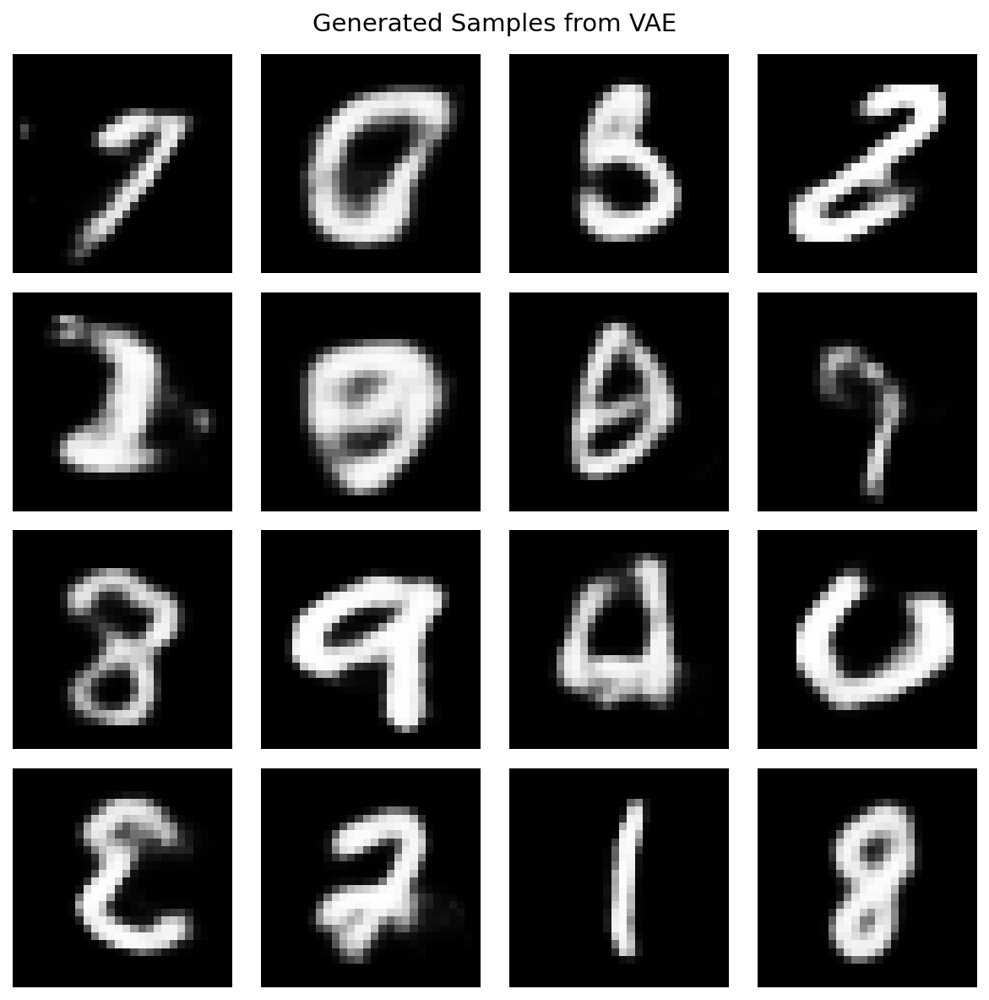
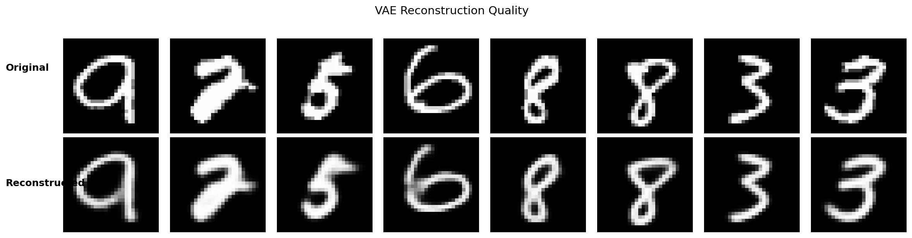

# Quickstart Guide

Get started with Artifex in 5 minutes! This guide walks you through installing Artifex and training your first generative model.

## Prerequisites

- Python 3.10 or higher
- 8GB RAM (16GB recommended)
- Optional: NVIDIA GPU with CUDA 12.0+ for faster training

## Step 1: Install Artifex

Choose your preferred installation method:

=== "From Source (Recommended)"

    ```bash
    # Clone repository
    git clone https://github.com/avitai/artifex.git
    cd artifex

    # Install with uv (fastest)
    uv venv && source .venv/bin/activate
    uv sync --all-extras

    # Or with pip
    python -m venv .venv && source .venv/bin/activate
    pip install -e '.[dev]'
    ```

=== "PyPI (Coming Soon)"

    ```bash
    pip install artifex
    ```

Verify installation:

```bash
python -c "import jax; print(f'JAX backend: {jax.default_backend()}')"
# Should print: JAX backend: gpu (or cpu)
```

## Step 2: Train Your First VAE

Create a new Python file `train_vae.py`:

```python
import jax
import jax.numpy as jnp
import matplotlib.pyplot as plt
import optax
from datarax.sources import TFDSEagerSource
from datarax.sources.tfds_source import TFDSEagerConfig
from flax import nnx

from artifex.generative_models.core.configuration import (
    DecoderConfig,
    EncoderConfig,
    VAEConfig,
)
from artifex.generative_models.models.vae import VAE
from artifex.generative_models.training import train_epoch_staged
from artifex.generative_models.training.trainers import VAETrainer, VAETrainingConfig

# 1. Load MNIST with TFDSEagerSource (pure JAX, no TF during training)
print("Loading MNIST...")
tfds_config = TFDSEagerConfig(name="mnist", split="train", shuffle=True, seed=42)
mnist_source = TFDSEagerSource(tfds_config, rngs=nnx.Rngs(0))

# Get images as JAX array and normalize to [0, 1]
images = mnist_source.data["image"].astype(jnp.float32) / 255.0
num_samples = len(mnist_source)
print(f"Loaded {num_samples} images, shape: {images.shape}")

# 2. Configure the model - CNN architecture for better image quality
encoder = EncoderConfig(
    name="mnist_cnn_encoder",
    input_shape=(28, 28, 1),
    latent_dim=20,
    hidden_dims=(32, 64, 128),
    activation="relu",
    use_batch_norm=False,
)

decoder = DecoderConfig(
    name="mnist_cnn_decoder",
    latent_dim=20,
    output_shape=(28, 28, 1),
    hidden_dims=(32, 64, 128),
    activation="relu",
    batch_norm=False,
)

model_config = VAEConfig(
    name="mnist_cnn_vae",
    encoder=encoder,
    decoder=decoder,
    encoder_type="cnn",
    kl_weight=1.0,
)

# 3. Create model, optimizer, and trainer
model = VAE(model_config, rngs=nnx.Rngs(0))
optimizer = nnx.Optimizer(model, optax.adam(2e-3), wrt=nnx.Param)

# VAETrainer with KL annealing for stable training
trainer = VAETrainer(
    VAETrainingConfig(
        kl_annealing="linear",
        kl_warmup_steps=2000,
        beta=1.0,
    )
)

state_leaves = jax.tree.leaves(nnx.state(model))
param_count = sum(p.size for p in state_leaves if hasattr(p, "size"))
print(f"Model created with ~{param_count/1e3:.1f}K parameters")

# 4. Stage data on GPU and train with JIT-compiled loop
print("Staging data on GPU...")
staged_data = jax.device_put(images)

NUM_EPOCHS = 20
BATCH_SIZE = 128

# Warmup JIT compilation
warmup_rng = jax.random.key(999)
loss_fn = trainer.create_loss_fn(step=0, loss_type="bce")
_ = train_epoch_staged(
    model, optimizer, staged_data[:256],
    batch_size=128, rng=warmup_rng, loss_fn=loss_fn,
)
print("JIT warmup complete.")

# Training loop
print(f"Training for {NUM_EPOCHS} epochs...")
step = 0
for epoch in range(NUM_EPOCHS):
    rng = jax.random.key(epoch)
    loss_fn = trainer.create_loss_fn(step=step, loss_type="bce")

    step, metrics = train_epoch_staged(
        model, optimizer, staged_data,
        batch_size=BATCH_SIZE, rng=rng, loss_fn=loss_fn, base_step=step,
    )
    print(f"Epoch {epoch + 1:2d}/{NUM_EPOCHS} | Loss: {metrics['loss']:7.2f}")

print("Training complete!")

# 5. Generate samples and reconstruct
samples = model.sample(n_samples=16)
print(f"Generated {samples.shape[0]} samples")

test_images = jnp.array(images[:8])
reconstructed = model.reconstruct(test_images, deterministic=True)
print(f"Reconstructed {reconstructed.shape[0]} images")

print("Success! You've trained your first VAE with Artifex!")
```

Run the script:

```bash
python train_vae.py
```

Expected output:

```console
Loading MNIST...
Loaded 60000 images, shape: (60000, 28, 28, 1)
Model created with ~314.9K parameters
Staging data on GPU...
JIT warmup complete.
Training for 20 epochs...
Epoch  1/20 | Loss:  111.04
Epoch  2/20 | Loss:   86.44
Epoch  3/20 | Loss:   89.81
...
Epoch 20/20 | Loss:   95.31
Training complete!
Generated 16 samples
Reconstructed 8 images
Success! You've trained your first VAE with Artifex!
```

## Step 3: Visualize Results (Optional)

Add visualization to your script:

```python
import matplotlib.pyplot as plt

# Visualize generated samples (4x4 grid)
fig, axes = plt.subplots(4, 4, figsize=(8, 8))
for i, ax in enumerate(axes.flat):
    ax.imshow(samples[i].squeeze(), cmap='gray', vmin=0, vmax=1)
    ax.axis('off')
plt.suptitle('Generated Samples from VAE')
plt.tight_layout()
plt.savefig('vae_samples.png', dpi=150)
print("Saved samples to vae_samples.png")

# Visualize reconstructions (original vs reconstructed)
fig, axes = plt.subplots(2, 8, figsize=(16, 4))
for i in range(8):
    axes[0, i].imshow(test_images[i].squeeze(), cmap='gray', vmin=0, vmax=1)
    axes[0, i].axis('off')
    axes[1, i].imshow(reconstructed[i].squeeze(), cmap='gray', vmin=0, vmax=1)
    axes[1, i].axis('off')
axes[0, 0].set_title('Original')
axes[1, 0].set_title('Reconstructed')
plt.tight_layout()
plt.savefig('vae_reconstruction.png', dpi=150)
print("Saved reconstruction to vae_reconstruction.png")
```

**Generated VAE Samples:**

{ width="50%" }

**Original vs Reconstructed:**



## What You Just Did

In just a few minutes, you:

1. **Installed Artifex** - Set up the complete environment
2. **Loaded data with TFDSEagerSource** - Pure JAX data loading, no TensorFlow overhead during training
3. **Created a CNN-based VAE** - Built a 3-layer convolutional variational autoencoder
4. **Used high-performance training** - JIT-compiled training loops with GPU-staged data
5. **Trained for 20 epochs** - Achieved fast training with the staged training loop
6. **Generated samples** - Created new digit images from the learned distribution
7. **Reconstructed images** - Verified high-quality encoder-decoder reconstruction

## Key Concepts

### High-Performance Data Loading

```python
from datarax.sources import TFDSEagerSource
from datarax.sources.tfds_source import TFDSEagerConfig

# TFDSEagerSource loads ALL data to JAX arrays at initialization
tfds_config = TFDSEagerConfig(name="mnist", split="train", shuffle=True, seed=42)
mnist_source = TFDSEagerSource(tfds_config, rngs=nnx.Rngs(0))

# Pure JAX from here - no TensorFlow during training
images = mnist_source.data["image"].astype(jnp.float32) / 255.0
```

This approach eliminates TensorFlow's data loading overhead during training, resulting in much faster iteration.

### Configuration System

```python
# Nested configuration for encoder and decoder
encoder = EncoderConfig(
    input_shape=(28, 28, 1),
    latent_dim=20,
    hidden_dims=(32, 64, 128),  # CNN layer channels
    activation="relu",
)
decoder = DecoderConfig(
    latent_dim=20,
    output_shape=(28, 28, 1),
    hidden_dims=(32, 64, 128),  # Symmetric to encoder
)
config = VAEConfig(
    encoder=encoder,
    decoder=decoder,
    encoder_type="cnn",  # "dense", "cnn", or "resnet"
    kl_weight=1.0,
)
```

Artifex uses a **unified configuration system** based on frozen dataclasses for type-safe, validated configurations.

### JIT-Compiled Training Loops

```python
from artifex.generative_models.training import train_epoch_staged

# Stage data on GPU for maximum performance
staged_data = jax.device_put(images)

# JIT-compiled training loop - 100-500x faster than Python loops
step, metrics = train_epoch_staged(
    model, optimizer, staged_data,
    batch_size=128, rng=rng, loss_fn=loss_fn,
)
```

The `train_epoch_staged` function:

- Pre-stages data on GPU with `jax.device_put()`
- Uses JIT-compiled training steps
- Achieves 100-500x speedup over naive Python loops

### VAETrainer with KL Annealing

```python
from artifex.generative_models.training.trainers import VAETrainer, VAETrainingConfig

# Configure trainer with KL annealing for stable training
trainer = VAETrainer(
    VAETrainingConfig(
        kl_annealing="linear",  # "none", "linear", "sigmoid", "cyclical"
        kl_warmup_steps=2000,   # Steps to reach full KL weight
        beta=1.0,               # Beta-VAE weight (>1 for disentanglement)
    )
)

# Create loss function with current step for annealing
loss_fn = trainer.create_loss_fn(step=step, loss_type="bce")
```

**KL Annealing**: Gradually increases the KL term weight during training, allowing the model to learn good reconstructions first before regularization kicks in.

**Supported Loss Types**:

- `"bce"`: Binary cross-entropy (for normalized [0,1] images)
- `"mse"`: Mean squared error (for continuous data)

## Try Different Models

### Train a Diffusion Model

```python
import jax
import jax.numpy as jnp
import optax
from datarax import from_source
from datarax.core.config import ElementOperatorConfig
from datarax.dag.nodes import OperatorNode
from datarax.operators import ElementOperator
from datarax.sources import TfdsDataSourceConfig, TFDSSource
from flax import nnx

from artifex.generative_models.models.diffusion import DDPMModel
from artifex.generative_models.core.configuration import (
    DDPMConfig,
    UNetBackboneConfig,
    NoiseScheduleConfig,
)
from artifex.generative_models.training.trainers import (
    DiffusionTrainer,
    DiffusionTrainingConfig,
)

# 1. Load Fashion-MNIST with datarax
def normalize(element, _key):
    """Normalize images to [-1, 1] for diffusion models."""
    image = element.data["image"].astype(jnp.float32) / 127.5 - 1.0
    return element.replace(data={**element.data, "image": image})

source = TFDSSource(
    TfdsDataSourceConfig(name="fashion_mnist", split="train", shuffle=True),
    rngs=nnx.Rngs(0),
)
normalize_op = ElementOperator(
    ElementOperatorConfig(stochastic=False), fn=normalize, rngs=nnx.Rngs(1)
)
pipeline = from_source(source, batch_size=64) >> OperatorNode(normalize_op)

# 2. Create DDPM configuration
backbone = UNetBackboneConfig(
    name="unet_backbone",
    in_channels=1,
    out_channels=1,
    hidden_dims=(32, 64, 128),
    channel_mult=(1, 2, 4),
    activation="silu",
)

noise_schedule = NoiseScheduleConfig(
    name="cosine_schedule",
    schedule_type="cosine",
    num_timesteps=1000,
    beta_start=1e-4,
    beta_end=2e-2,
)

config = DDPMConfig(
    name="fashion_ddpm",
    input_shape=(28, 28, 1),  # HWC format
    backbone=backbone,
    noise_schedule=noise_schedule,
)

# 3. Create model and optimizer
rngs = nnx.Rngs(42)
model = DDPMModel(config, rngs=rngs)
optimizer = nnx.Optimizer(model, optax.adamw(1e-4), wrt=nnx.Param)

# 4. Configure trainer with SOTA techniques (min-SNR weighting, EMA)
trainer = DiffusionTrainer(
    noise_schedule=model.noise_schedule,
    config=DiffusionTrainingConfig(
        loss_weighting="min_snr",  # Min-SNR weighting for faster convergence
        snr_gamma=5.0,
        ema_decay=0.9999,
    ),
)

# JIT-compile the train_step for performance
jit_train_step = nnx.jit(trainer.train_step)

# 5. Training loop
rng = jax.random.PRNGKey(0)
step = 0

for batch in pipeline:
    rng, step_rng = jax.random.split(rng)
    _, metrics = jit_train_step(model, optimizer, {"image": batch["image"]}, step_rng)
    trainer.update_ema(model)  # EMA updates outside JIT

    if step % 100 == 0:
        print(f"Step {step}: loss={metrics['loss']:.4f}")
    step += 1

# 6. Generate samples
samples = model.sample(n_samples_or_shape=8, steps=100)
print(f"Generated samples shape: {samples.shape}")
```

### Train a GAN

```python
from flax import nnx
from artifex.generative_models.models.gan import DCGAN
from artifex.generative_models.core.configuration import (
    DCGANConfig,
    ConvGeneratorConfig,
    ConvDiscriminatorConfig,
)

# Create DCGAN configuration with convolutional networks
generator = ConvGeneratorConfig(
    name="dcgan_generator",
    latent_dim=100,
    hidden_dims=(512, 256, 128, 64),
    output_shape=(1, 28, 28),  # CHW format
    activation="relu",
    batch_norm=True,
    kernel_size=(4, 4),
    stride=(2, 2),
    padding="SAME",
)

discriminator = ConvDiscriminatorConfig(
    name="dcgan_discriminator",
    hidden_dims=(64, 128, 256, 512),
    input_shape=(1, 28, 28),  # CHW format
    activation="leaky_relu",
    leaky_relu_slope=0.2,
    batch_norm=True,
    kernel_size=(4, 4),
    stride=(2, 2),
    padding="SAME",
)

config = DCGANConfig(
    name="mnist_dcgan",
    generator=generator,
    discriminator=discriminator,
)

rngs = nnx.Rngs(params=0, dropout=1, sample=2)
model = DCGAN(config, rngs=rngs)
print(f"DCGAN created with latent_dim={config.generator.latent_dim}")
```

## Next Steps

Now that you have a working setup, explore more:

<div class="grid cards" markdown>

- :material-school:{ .lg .middle } **Learn Core Concepts**

    ---

    Understand generative modeling fundamentals and Artifex architecture

    [:octicons-arrow-right-24: Core Concepts](core-concepts.md)

- :material-book-open:{ .lg .middle } **Build Your First Model**

- :material-layers:{ .lg .middle } **Explore Model Guides**

    ---

    Deep dive into VAEs, GANs, Diffusion, Flows, and more

    [:octicons-arrow-right-24: VAE Guide](../user-guide/models/vae-guide.md)
    [:octicons-arrow-right-24: Model Implementations](../models/index.md)

- :material-code-braces:{ .lg .middle } **Check Examples**

    ---

    Ready-to-run examples for various models and use cases

    [:octicons-arrow-right-24: Examples](../examples/index.md)

</div>

## Common Next Questions

### How do I use real data?

See the [Data Pipeline Guide](../data/index.md) for loading CIFAR-10, ImageNet, and custom datasets.

### How do I save and load models?

```python
# Save
from flax.training import checkpoints
checkpoints.save_checkpoint('checkpoints/', model, step=100)

# Load
model = checkpoints.restore_checkpoint('checkpoints/', model)
```

See [Training Guide](../training/index.md) for details on checkpointing.

### How do I train on multiple GPUs?

Artifex supports distributed training out of the box. See [Distributed Training Guide](../scaling/index.md).

### What if I get errors?

If you encounter issues, [open an issue](https://github.com/avitai/artifex/issues) on GitHub.

## Quick Reference

### Model Types

| Type | Model Class | Config Class | Use Case |
|------|-------------|--------------|----------|
| VAE | `VAE` | `VAEConfig` | Latent representations, data compression |
| GAN | `DCGAN`, `GAN` | `DCGANConfig`, `GANConfig` | High-quality image generation |
| Diffusion | `DDPMModel` | `DDPMConfig` | State-of-the-art generation, controllable |
| Flow | `FlowModel` | `FlowConfig` | Exact likelihood, invertible transformations |
| EBM | `EnergyBasedModel` | `EBMConfig` | Energy-based modeling, composable |

### Key Commands

```bash
# Install
uv sync --all-extras

# Run tests
pytest tests/ -v

# Format code
ruff format src/

# Type check
pyright src/

# Build docs
mkdocs serve
```

## Getting Help

- **Documentation**: Comprehensive guides and API reference
- **Examples**: Ready-to-run code in `examples/`
- **Issues**: [GitHub Issues](https://github.com/avitai/artifex/issues)
- **Discussions**: [GitHub Discussions](https://github.com/avitai/artifex/discussions)

---

**Congratulations!** You've completed the quickstart guide. You're now ready to build more sophisticated generative models with Artifex!

**Next recommended step**: [Core Concepts](core-concepts.md) to understand the architecture better, or explore the [VAE Guide](../user-guide/models/vae-guide.md) for advanced VAE techniques.
