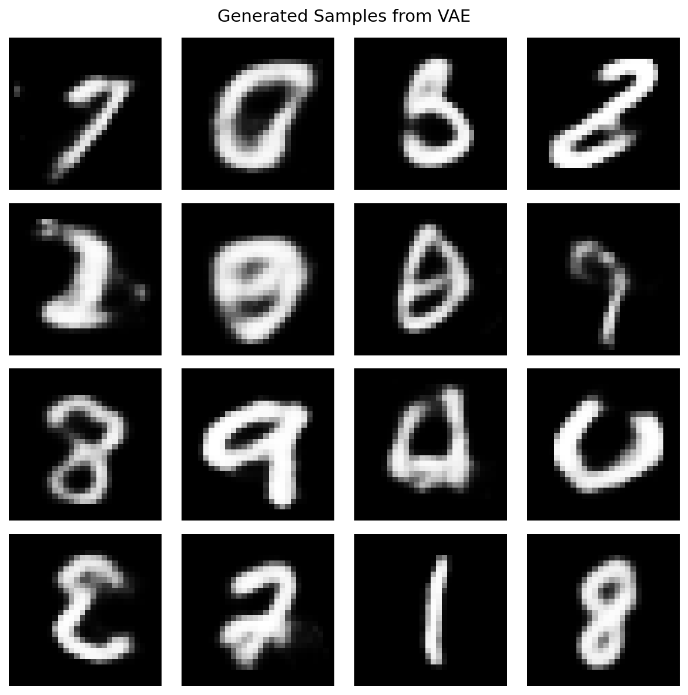
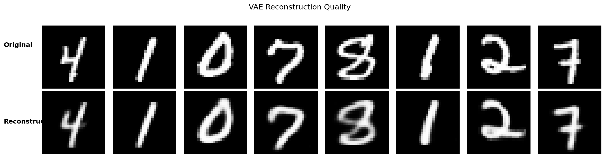

# Quickstart: Train Your First VAE

This page mirrors the checked-in executable quickstart in `docs/getting-started/quickstart.py`
and the paired notebook `docs/getting-started/quickstart.ipynb`. It keeps the public
onboarding path limited to the live VAE-first workflow that is already exercised in the
repository.

## Prerequisites

- Python 3.10 or higher
- 8GB RAM (16GB recommended)
- Optional: NVIDIA GPU with CUDA 12.0+ for faster training

## Step 1: Install Artifex

Choose your preferred installation method:

=== "Package Install (Recommended)"

    ```bash
    # CPU-friendly install
    pip install avitai-artifex

    # Optional Linux NVIDIA GPU support
    pip install "avitai-artifex[cuda12]"
    ```

    The PyPI distribution is named `avitai-artifex`; installed code is still imported
    as `artifex`.

=== "From Source (Contributors)"

    ```bash
    # Clone repository
    git clone https://github.com/avitai/artifex.git
    cd artifex

    # Recommended repository setup
    ./setup.sh
    source ./activate.sh
    ```

=== "Direct uv Sync (Advanced Contributors)"

    ```bash
    git clone https://github.com/avitai/artifex.git
    cd artifex

    # CPU development
    uv sync --extra dev --extra test

    # Or Linux CUDA development
    uv sync --extra cuda-dev

    source ./activate.sh
    ```

Verify installation:

```bash
python -c "import jax; print(f'JAX backend: {jax.default_backend()}')"
# Should print: JAX backend: gpu (or cpu)
```

Contributors can validate the checkout after setup with:

```bash
uv run pytest
```

## Step 2: Train Your First VAE

Create a new Python file `train_vae.py` using the same supported workflow as the executable
quickstart pair:

```python
import jax
import jax.numpy as jnp
import matplotlib.pyplot as plt
import optax
from datarax.sources import TFDSEagerSource
from datarax.sources.tfds_source import TFDSEagerConfig
from flax import nnx

from artifex.generative_models.core.configuration import (
    DecoderConfig,
    EncoderConfig,
    VAEConfig,
)
from artifex.generative_models.models.vae import VAE
from artifex.generative_models.training import train_epoch_staged
from artifex.generative_models.training.trainers import VAETrainer, VAETrainingConfig

# 1. Load MNIST with TFDSEagerSource (pure JAX, no TF during training)
print("Loading MNIST...")
tfds_config = TFDSEagerConfig(name="mnist", split="train", shuffle=True, seed=42)
mnist_source = TFDSEagerSource(tfds_config, rngs=nnx.Rngs(0))

# Get images as JAX array and normalize to [0, 1]
images = mnist_source.data["image"].astype(jnp.float32) / 255.0
num_samples = len(mnist_source)
print(f"Loaded {num_samples} images, shape: {images.shape}")

# 2. Configure the model - CNN architecture for better image quality
encoder = EncoderConfig(
    name="mnist_cnn_encoder",
    input_shape=(28, 28, 1),
    latent_dim=20,
    hidden_dims=(32, 64, 128),
    activation="relu",
    use_batch_norm=False,
)

decoder = DecoderConfig(
    name="mnist_cnn_decoder",
    latent_dim=20,
    output_shape=(28, 28, 1),
    hidden_dims=(32, 64, 128),
    activation="relu",
    batch_norm=False,
)

model_config = VAEConfig(
    name="mnist_cnn_vae",
    encoder=encoder,
    decoder=decoder,
    encoder_type="cnn",
    kl_weight=1.0,
)

# 3. Create model, optimizer, and trainer
model = VAE(model_config, rngs=nnx.Rngs(0))
optimizer = nnx.Optimizer(model, optax.adam(2e-3), wrt=nnx.Param)

trainer = VAETrainer(
    VAETrainingConfig(
        kl_annealing="linear",
        kl_warmup_steps=2000,
        beta=1.0,
    )
)

state_leaves = jax.tree.leaves(nnx.state(model))
param_count = sum(p.size for p in state_leaves if hasattr(p, "size"))
print(f"Model created with ~{param_count / 1e3:.1f}K parameters")

# 4. Stage data on device and train with a JIT-compiled loop
print("Staging data on GPU...")
staged_data = jax.device_put(images)

NUM_EPOCHS = 20
BATCH_SIZE = 128

# Warm up JIT compilation and reuse one cached loss_fn across epochs
# `train_epoch_staged` consumes a step-aware objective with signature
# (model, batch, rng, step); `trainer.create_loss_fn(...)` supplies that contract.
warmup_rng = jax.random.key(999)
loss_fn = trainer.create_loss_fn(loss_type="bce")
_ = train_epoch_staged(
    model,
    optimizer,
    staged_data[:256],
    batch_size=128,
    rng=warmup_rng,
    loss_fn=loss_fn,
)
print("JIT warmup complete.")

# Training loop
print(f"Training for {NUM_EPOCHS} epochs...")
step = 0
for epoch in range(NUM_EPOCHS):
    rng = jax.random.key(epoch)
    step, metrics = train_epoch_staged(
        model,
        optimizer,
        staged_data,
        batch_size=BATCH_SIZE,
        rng=rng,
        loss_fn=loss_fn,
        base_step=step,
    )
    print(f"Epoch {epoch + 1:2d}/{NUM_EPOCHS} | Loss: {metrics['loss']:7.2f}")

print("Training complete!")

# 5. Generate samples and reconstruct
samples = model.sample(n_samples=16)
print(f"Generated {samples.shape[0]} samples")

test_images = jnp.array(images[:8])
reconstructed = model.reconstruct(test_images, deterministic=True)
print(f"Reconstructed {reconstructed.shape[0]} images")

print("Success! You've trained your first VAE with Artifex!")
```

Run the script:

```bash
python train_vae.py
```

Expected output:

```console
Loading MNIST...
Loaded 60000 images, shape: (60000, 28, 28, 1)
Model created with ~314.9K parameters
Staging data on GPU...
JIT warmup complete.
Training for 20 epochs...
Epoch  1/20 | Loss:  111.04
Epoch  2/20 | Loss:   86.44
Epoch  3/20 | Loss:   89.81
...
Epoch 20/20 | Loss:   95.31
Training complete!
Generated 16 samples
Reconstructed 8 images
Success! You've trained your first VAE with Artifex!
```

## Step 3: Visualize Results (Optional)

Add visualization to your script:

```python
import matplotlib.pyplot as plt

fig, axes = plt.subplots(4, 4, figsize=(8, 8))
for i, ax in enumerate(axes.flat):
    ax.imshow(samples[i].squeeze(), cmap="gray", vmin=0, vmax=1)
    ax.axis("off")
fig.suptitle("Generated Samples from VAE", fontsize=14, y=0.98)
plt.tight_layout()
plt.savefig("vae_samples.png", dpi=150, bbox_inches="tight", facecolor="white")
print("Saved samples to vae_samples.png")

fig, axes = plt.subplots(2, 8, figsize=(16, 4))
fig.text(0.02, 0.75, "Original", fontsize=12, fontweight="bold", va="center")
fig.text(0.02, 0.25, "Reconstructed", fontsize=12, fontweight="bold", va="center")

for i in range(8):
    axes[0, i].imshow(test_images[i].squeeze(), cmap="gray", vmin=0, vmax=1)
    axes[0, i].axis("off")
    axes[1, i].imshow(reconstructed[i].squeeze(), cmap="gray", vmin=0, vmax=1)
    axes[1, i].axis("off")

fig.suptitle("VAE Reconstruction Quality", fontsize=14, y=1.02)
plt.tight_layout()
plt.subplots_adjust(left=0.08)
plt.savefig("vae_reconstruction.png", dpi=150, bbox_inches="tight", facecolor="white")
print("Saved reconstruction to vae_reconstruction.png")
```

**Generated VAE Samples:**

{ width="50%" }

**Original vs Reconstructed:**



## What You Just Did

1. Loaded data efficiently with `TFDSEagerSource`
2. Configured a CNN VAE with `VAEConfig`
3. Used `VAETrainer` with KL annealing
4. Trained with `train_epoch_staged` and one cached `loss_fn`
5. Generated new samples and reconstructions

## Next Steps

- Learn the architecture in [Core Concepts](core-concepts.md)
- Deep dive into latent models in the [VAE Guide](../user-guide/models/vae-guide.md)
- Explore additional public model families in [Model Implementations](../models/index.md)
- Browse runnable examples in [Examples](../examples/index.md)
