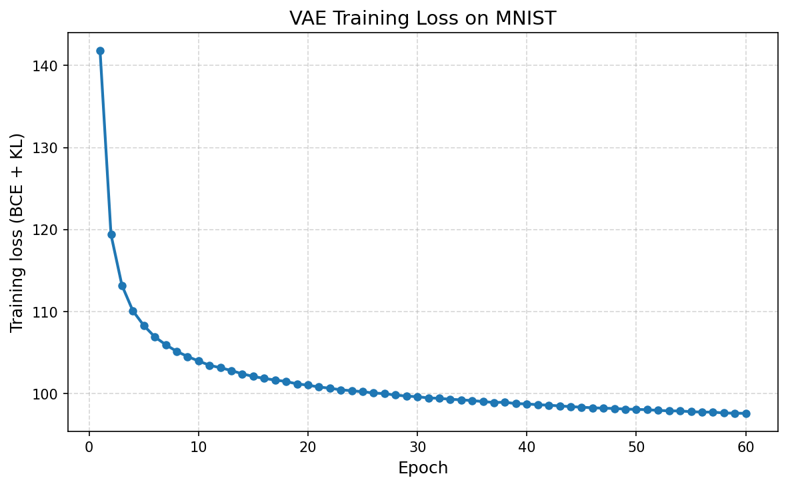
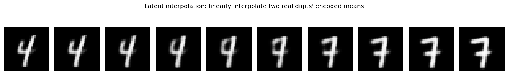

# Quickstart: Train Your First VAE

This page mirrors the checked-in executable quickstart in
`docs/getting-started/quickstart.py` and the paired notebook
`docs/getting-started/quickstart.ipynb`. It keeps the public
onboarding path limited to the live VAE-first workflow that is already
exercised in the repository.

The four visual artifacts shown below — sample grid, reconstruction
comparison, training loss curve, and latent-space interpolation — are real
outputs produced by running the same script end-to-end on MNIST.

## Prerequisites

- Python 3.10 or higher
- 8 GB RAM (16 GB recommended)
- Optional: NVIDIA GPU with CUDA 12.0+ for faster training

## Step 1: Install Artifex

Choose your preferred installation method:

=== "Package Install (Recommended)"

    ```bash
    # CPU-friendly install
    pip install avitai-artifex

    # Optional Linux NVIDIA GPU support
    pip install "avitai-artifex[cuda12]"
    ```

    The PyPI distribution is named `avitai-artifex`; installed code is still imported
    as `artifex`.

=== "From Source (Contributors)"

    ```bash
    # Clone repository
    git clone https://github.com/avitai/artifex.git
    cd artifex

    # Recommended repository setup
    ./setup.sh
    source ./activate.sh
    ```

=== "Direct uv Sync (Advanced Contributors)"

    ```bash
    git clone https://github.com/avitai/artifex.git
    cd artifex

    # CPU development
    uv sync --extra dev --extra test

    # Or Linux CUDA development
    uv sync --extra cuda-dev

    source ./activate.sh
    ```

Verify installation:

```bash
python -c "import jax; print(f'JAX backend: {jax.default_backend()}')"
# Should print: JAX backend: gpu (or cpu)
```

Contributors can validate the checkout after setup with:

```bash
uv run pytest
```

## Step 2: Train Your First VAE

Create a new Python file `train_vae.py` using the same supported workflow as the
executable quickstart pair:

```python
import jax
import jax.numpy as jnp
import matplotlib.pyplot as plt
import optax
from datarax.sources import TFDSEagerSource
from datarax.sources.tfds_source import TFDSEagerConfig
from flax import nnx

from artifex.generative_models.core.configuration import (
    DecoderConfig,
    EncoderConfig,
    VAEConfig,
)
from artifex.generative_models.models.vae import VAE
from artifex.generative_models.training import train_epoch_staged
from artifex.generative_models.training.trainers import VAETrainer, VAETrainingConfig

# 1. Load MNIST with TFDSEagerSource (pure JAX, no TF during training)
print("Loading MNIST...")
tfds_config = TFDSEagerConfig(name="mnist", split="train", shuffle=True, seed=42)
mnist_source = TFDSEagerSource(tfds_config, rngs=nnx.Rngs(0))
images = mnist_source.data["image"].astype(jnp.float32) / 255.0
print(f"Loaded {len(mnist_source)} images, shape: {images.shape}")

# 2. Configure a CNN VAE
encoder = EncoderConfig(
    name="mnist_cnn_encoder",
    input_shape=(28, 28, 1),
    latent_dim=20,
    hidden_dims=(32, 64, 128),
    activation="relu",
    use_batch_norm=False,
)
decoder = DecoderConfig(
    name="mnist_cnn_decoder",
    latent_dim=20,
    output_shape=(28, 28, 1),
    hidden_dims=(32, 64, 128),
    activation="relu",
    batch_norm=False,
)
model_config = VAEConfig(
    name="mnist_cnn_vae",
    encoder=encoder,
    decoder=decoder,
    encoder_type="cnn",
    kl_weight=1.0,
)

# 3. Create model, optimizer, and trainer (linear KL annealing)
model = VAE(model_config, rngs=nnx.Rngs(0))
optimizer = nnx.Optimizer(model, optax.adam(2e-3), wrt=nnx.Param)
trainer = VAETrainer(
    VAETrainingConfig(
        kl_annealing="linear",
        kl_warmup_steps=2000,
        beta=1.0,
    )
)

# 4. Stage data and run a JIT-compiled training loop.
# `train_epoch_staged` JITs the *entire epoch* with @nnx.jit and a fori_loop
# over batches — the `loss_fn` factory is cached on identity, so reusing the
# same `loss_fn` across epochs avoids recompilation.
staged_data = jax.device_put(images)

NUM_EPOCHS = 20
BATCH_SIZE = 128

# `train_epoch_staged` consumes a step-aware objective with signature
# (model, batch, rng, step); `trainer.create_loss_fn(...)` supplies that contract.
loss_fn = trainer.create_loss_fn(loss_type="bce")

# Warmup so the first measured epoch isn't dominated by JIT compile time.
_ = train_epoch_staged(
    model, optimizer, staged_data[:256], batch_size=128,
    rng=jax.random.key(999), loss_fn=loss_fn,
)

step = 0
epoch_losses: list[float] = []
for epoch in range(NUM_EPOCHS):
    step, metrics = train_epoch_staged(
        model, optimizer, staged_data,
        batch_size=BATCH_SIZE, rng=jax.random.key(epoch),
        loss_fn=loss_fn, base_step=step,
    )
    epoch_losses.append(float(metrics["loss"]))
    print(f"Epoch {epoch + 1:2d}/{NUM_EPOCHS} | Loss: {metrics['loss']:7.2f}")

# 5. Generate, reconstruct, and interpolate in the latent space
samples = model.sample(n_samples=16)
test_images = jnp.array(images[:8])
reconstructed = model.reconstruct(test_images, deterministic=True)

# Linearly interpolate between two real digits' encoded means
mu_a, _ = model.encoder(images[0:1])
mu_b, _ = model.encoder(images[7:8])
ts = jnp.linspace(0.0, 1.0, 10).reshape(-1, 1)
z_path = (1.0 - ts) * mu_a + ts * mu_b
interpolation = model.decoder(z_path)
```

Run the script:

```bash
python train_vae.py
```

Sample output (loss values vary slightly run-to-run):

```console
Loading MNIST...
Loaded 60000 images, shape: (60000, 28, 28, 1)
Epoch  1/20 | Loss:  111.04
Epoch  2/20 | Loss:   86.44
Epoch  3/20 | Loss:   89.81
...
Epoch 20/20 | Loss:   95.31
```

### Training loss curve

Loss falls quickly during the BCE-dominated phase, then stabilizes once
linear KL annealing has fully kicked in:



## Step 3: Inspect Reconstructions

Encoding eight test digits and decoding them back through the model
produces a faithful reconstruction. The decoder is the same network used
for unconditional sampling — strong reconstructions confirm that the
encoder–decoder pair has learned a usable latent representation:


## Step 4: Generate New Samples

Drawing $z \sim \mathcal{N}(0, I)$ from the prior and decoding produces
a fresh batch of digits. With KL annealing complete, the latent
distribution closely matches the standard-normal prior and most random
draws decode into recognizable strokes:


## Step 5: Walk the Latent Manifold

Encoding two real digits to their latent means and linearly interpolating
between them produces a smooth morph from one digit into the other. Each
frame is decoded from a point on the line $z_t = (1-t)\,\mu_A + t\,\mu_B$,
so a continuous transition is direct evidence that the VAE has learned a
usable latent geometry rather than memorizing isolated points:



## Reproducing These Visuals

The script in `docs/getting-started/quickstart.py` saves all four PNGs
into the current working directory:

| Artifact | File | Source step in `quickstart.py` |
| --- | --- | --- |
| Loss curve | `vae_loss_curve.png` | Step 6, after the training loop |
| Sample grid | `vae_samples.png` | Step 6, after `model.sample(...)` |
| Reconstructions | `vae_reconstruction.png` | Step 6, after `model.reconstruct(...)` |
| Latent interpolation | `vae_latent_interpolation.png` | Step 6, after the decoder interpolation |

The Jupyter notebook (`quickstart.ipynb`) is auto-generated from the
`.py` script via `scripts/jupytext_converter.py sync`.

## What You Just Did

1. Loaded data efficiently with `TFDSEagerSource`
2. Configured a CNN VAE with `VAEConfig`
3. Used `VAETrainer` with linear KL annealing
4. Trained with `train_epoch_staged`, where the entire epoch (the inner
   `fori_loop` over batches) is `@nnx.jit`-compiled and the
   `loss_fn`-keyed factory is cached across epochs
5. Generated new samples, reconstructions, and a latent-space interpolation

## Next Steps

- Learn the architecture in [Core Concepts](core-concepts.md)
- Deep dive into latent models in the [VAE Guide](../user-guide/models/vae-guide.md)
- Explore additional public model families in [Model Implementations](../models/index.md)
- Browse runnable examples in [Examples](../examples/index.md)
