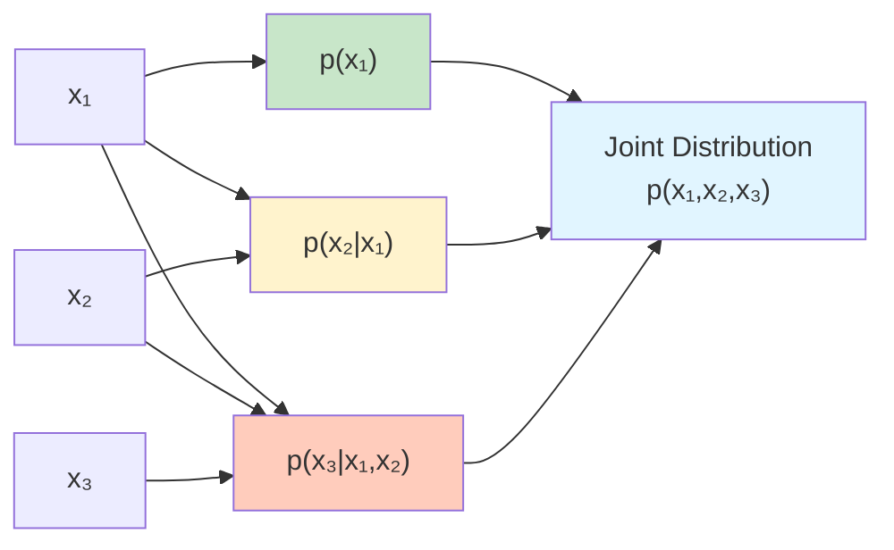
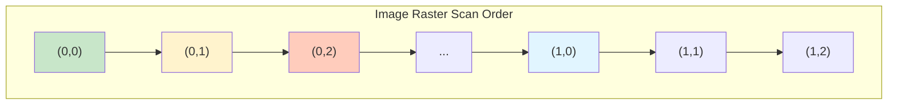
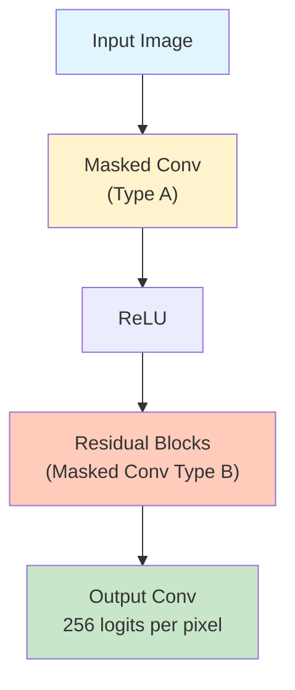
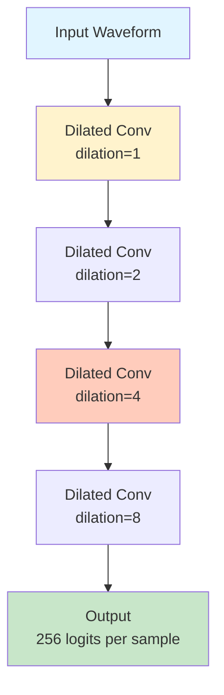

# Autoregressive Models Explained

<div class="grid cards" markdown>

- :material-format-list-numbered:{ .lg .middle } **Sequential Generation**

    ---

    Generate data one element at a time, predicting each based on all previous elements

- :material-function-variant:{ .lg .middle } **Tractable Likelihood**

    ---

    Compute exact probability through chain rule factorization with no approximations

- :material-lightning-bolt:{ .lg .middle } **Flexible Architectures**

    ---

    Use any architecture (RNNs, CNNs, Transformers) that respects the autoregressive property

- :material-star-shooting:{ .lg .middle } **State-of-the-Art Performance**

    ---

    Power modern language models (GPT) and achieve competitive results in image and audio generation

</div>

---

## Overview

Autoregressive models are a fundamental class of **generative models** that decompose the joint probability distribution into a product of conditional distributions using the **chain rule of probability**. They generate data **sequentially**, predicting each element conditioned on all previously generated elements.

**What makes autoregressive models special?**

Unlike other generative models that learn data distributions through latent variables (VAEs), adversarial training (GANs), or energy functions (EBMs), autoregressive models directly model the **conditional probability of each element** given its predecessors. This approach offers:

- **Exact likelihood computation** - no variational bounds or approximations
- **Simple training** - standard maximum likelihood with cross-entropy loss
- **Universal applicability** - works for any ordered sequential data
- **Flexible expressiveness** - from simple next-token prediction to complex long-range dependencies
- **Proven scalability** - powers billion-parameter language models like GPT-4

The core principle: **order matters**. By imposing a specific ordering on data dimensions and modeling each element conditionally, autoregressive models achieve tractable training and exact inference while maintaining high expressiveness.

### The Intuition: Building Sequences Step-by-Step

Think of autoregressive models like an artist creating a painting:

1. **Start with a Blank Canvas** - The first element is predicted from a simple prior (often uniform or learned).

2. **Add One Brush Stroke at a Time** - Each new element is predicted based on what's already been created. The model asks: "Given what I've painted so far, what comes next?"

3. **Build Complex Patterns Gradually** - Simple local dependencies (adjacent pixels, consecutive words) compose into global structure (coherent images, meaningful sentences).

4. **No Going Back** - The autoregressive property enforces a strict ordering: element $i$ cannot depend on future elements $i+1, i+2, \ldots$. This constraint makes training tractable.

The critical insight: by breaking down a high-dimensional joint distribution into a sequence of simpler conditional distributions, autoregressive models make both **training (likelihood computation) and generation (sequential sampling) tractable**.

---

## Mathematical Foundation

### The Chain Rule Factorization

The **chain rule of probability** is the cornerstone of all autoregressive models. Any joint distribution can be factored as:

$$
p(x_1, x_2, \ldots, x_n) = p(x_1) \prod_{i=2}^{n} p(x_i \mid x_1, \ldots, x_{i-1})
$$

Autoregressive models parameterize each conditional $p(x_i \mid x_{<i})$ with a neural network:

$$
p_\theta(x_i \mid x_{<i}) = f_\theta(x_i; x_1, \ldots, x_{i-1})
$$

where $\theta$ are learnable parameters and $x_{<i} = (x_1, \ldots, x_{i-1})$ denotes all previous elements.



**Example** - Image with 3 pixels:

$$
p(x_1, x_2, x_3) = p(x_1) \cdot p(x_2 \mid x_1) \cdot p(x_3 \mid x_1, x_2)
$$

For a 256×256 RGB image with discrete pixel values $\{0, 1, \ldots, 255\}$:

$$
p(\text{image}) = \prod_{i=1}^{256 \times 256 \times 3} p(x_i \mid x_{<i})
$$

This factorization reduces modeling $(256)^{196608}$ joint probabilities to modeling 196,608 conditional distributions—a massive simplification.

### Log-Likelihood and Training

The **log-likelihood** decomposes additively:

$$
\log p_\theta(x_1, \ldots, x_n) = \sum_{i=1}^{n} \log p_\theta(x_i \mid x_{<i})
$$

This makes **maximum likelihood training** straightforward:

$$
\max_\theta \mathbb{E}_{x \sim p_{\text{data}}}\left[\sum_{i=1}^{n} \log p_\theta(x_i \mid x_{<i})\right]
$$

Equivalently, minimize the **negative log-likelihood (cross-entropy)**:

$$
\mathcal{L}(\theta) = -\frac{1}{N} \sum_{j=1}^{N} \sum_{i=1}^{n} \log p_\theta(x_i^{(j)} \mid x_{<i}^{(j)})
$$

where $N$ is the dataset size.

!!!tip "Why This is Beautiful"
    Unlike VAEs (ELBO bound), GANs (minimax), or EBMs (intractable partition function), autoregressive models optimize the **exact likelihood** using **standard supervised learning**. Each conditional $p(x_i \mid x_{<i})$ is a classification problem over the vocabulary.

### Ordering and Masking

**Choosing an ordering** is crucial. Different orderings lead to different models:

**Text (Natural Sequential Order)**:

$$
p(\text{"hello"}) = p(\text{h}) \cdot p(\text{e}|\text{h}) \cdot p(\text{l}|\text{he}) \cdot p(\text{l}|\text{hel}) \cdot p(\text{o}|\text{hell})
$$

**Images (Raster Scan)**:

Pixels generated left-to-right, top-to-bottom:

$$
p(\text{image}) = \prod_{h=1}^{H} \prod_{w=1}^{W} \prod_{c=1}^{C} p(x_{h,w,c} \mid x_{<h}, x_{h,<w}, x_{h,w,<c})
$$

where $x_{<h}$ denotes all rows above, $x_{h,<w}$ denotes pixels to the left in current row, and $x_{h,w,<c}$ denotes previous channels.



**Masking** ensures the autoregressive property. When computing $p(x_i \mid x_{<i})$, the neural network must **not access** future elements $x_{\geq i}$.

**Causal Masking** (for sequences):

```python
# Attention mask preventing position i from attending to positions > i
mask = jnp.tril(jnp.ones((seq_len, seq_len)))  # Lower triangular
```

**Spatial Masking** (for images):

```python
# PixelCNN mask: pixel (h,w) cannot see (h',w') where h' > h or (h'=h and w' > w)
# Implemented via masked convolutions
```

---

## Autoregressive Architectures

Autoregressive models can use various neural network architectures, each with different trade-offs between expressiveness, computational efficiency, and applicability.

### 1. Recurrent Neural Networks (RNNs)

**RNNs** were the original architecture for autoregressive modeling, maintaining hidden state $h_t$ across time steps:

$$
h_t = f(h_{t-1}, x_{t-1}; \theta)
$$

$$
p(x_t \mid x_{<t}) = g(h_t; \theta)
$$

**Variants**:

- **Vanilla RNN**: Simple recurrence, suffers from vanishing gradients
- **LSTM** (Long Short-Term Memory): Gating mechanisms for long-range dependencies
- **GRU** (Gated Recurrent Unit): Simplified gating, fewer parameters

```python
class AutoregressiveRNN(nnx.Module):
    def __init__(self, vocab_size, hidden_dim, *, rngs):
        super().__init__()
        self.embedding = nnx.Embed(vocab_size, hidden_dim, rngs=rngs)
        self.rnn = nnx.RNN(hidden_dim, hidden_dim, rngs=rngs)
        self.output = nnx.Linear(hidden_dim, vocab_size, rngs=rngs)

    def __call__(self, x, *, rngs=None):
        # x: [batch, seq_len]
        embeddings = self.embedding(x)  # [batch, seq_len, hidden_dim]
        hidden_states = self.rnn(embeddings)  # [batch, seq_len, hidden_dim]
        logits = self.output(hidden_states)  # [batch, seq_len, vocab_size]
        return {"logits": logits}
```

**Advantages**:

- **Variable-length sequences** handled naturally
- **Memory-efficient** inference (constant memory)
- **Well-understood** theory and practice

**Disadvantages**:

- **Sequential computation** (no parallelization during training)
- **Limited context** (gradients vanish for long sequences)
- **Slow training** compared to Transformers

**When to use**: Text generation with moderate sequence lengths, real-time applications requiring low latency.

### 2. Masked Convolutional Networks (PixelCNN)

**PixelCNN** (van den Oord et al., 2016) uses **masked convolutions** for autoregressive image generation:

**Key idea**: Apply convolution with a **spatial mask** ensuring pixel $(i,j)$ only depends on pixels above and to the left.

**Masked Convolution**:

```python
class MaskedConv2D(nnx.Module):
    def __init__(self, in_channels, out_channels, kernel_size, mask_type, *, rngs):
        super().__init__()
        self.conv = nnx.Conv(in_channels, out_channels,
                            kernel_size=kernel_size, padding="SAME", rngs=rngs)
        self.mask = self._create_mask(kernel_size, mask_type)

    def _create_mask(self, kernel_size, mask_type):
        """Create autoregressive mask for convolution."""
        kh, kw = kernel_size
        mask = jnp.ones((kh, kw, self.in_channels, self.out_channels))

        center_h, center_w = kh // 2, kw // 2

        # Mask future pixels (below and to the right)
        mask = mask.at[center_h + 1:, :, :, :].set(0)
        mask = mask.at[center_h, center_w + 1:, :, :].set(0)

        # For mask type A (first layer), also mask center
        if mask_type == "A":
            mask = mask.at[center_h, center_w, :, :].set(0)

        return mask

    def __call__(self, x):
        masked_kernel = self.conv.kernel * self.mask
        # Apply masked convolution
        ...
```

**Architecture**:

1. **First layer**: Masked Conv with type A (masks center pixel)
2. **Hidden layers**: Masked Conv with type B (includes center pixel)
3. **Residual blocks**: Stack masked convolutions with skip connections
4. **Output**: Per-pixel categorical distribution over pixel values



**Advantages**:

- **Parallel training**: All pixels computed simultaneously
- **Spatial inductive bias**: Local patterns learned efficiently
- **Exact likelihood**: No approximations

**Disadvantages**:

- **Slow generation**: Sequential pixel-by-pixel (196,608 steps for 256×256×3 image)
- **Blind spot**: Standard PixelCNN misses dependencies due to receptive field limitations (fixed in Gated PixelCNN)
- **Limited long-range dependencies**: Receptive field grows linearly with depth

**When to use**: Image generation when exact likelihood matters, density estimation on images, image inpainting.

### 3. Transformer-Based Autoregressive Models

**Transformers** (Vaswani et al., 2017) use **self-attention with causal masking** for autoregressive modeling:

**Self-Attention**:

$$
\text{Attention}(Q, K, V) = \text{softmax}\left(\frac{QK^T}{\sqrt{d_k}} + M\right) V
$$

where $M$ is a **causal mask**:

$$
M_{ij} = \begin{cases}
0 & \text{if } j \leq i \\
-\infty & \text{if } j > i
\end{cases}
$$

This ensures position $i$ only attends to positions $\leq i$.

```python
class CausalSelfAttention(nnx.Module):
    def __init__(self, hidden_dim, num_heads, *, rngs):
        super().__init__()
        self.num_heads = num_heads
        self.head_dim = hidden_dim // num_heads

        self.qkv = nnx.Linear(hidden_dim, 3 * hidden_dim, rngs=rngs)
        self.output = nnx.Linear(hidden_dim, hidden_dim, rngs=rngs)

    def __call__(self, x):
        # x: [batch, seq_len, hidden_dim]
        batch_size, seq_len, _ = x.shape

        # Compute Q, K, V
        qkv = self.qkv(x)  # [batch, seq_len, 3 * hidden_dim]
        q, k, v = jnp.split(qkv, 3, axis=-1)

        # Reshape for multi-head attention
        q = q.reshape(batch_size, seq_len, self.num_heads, self.head_dim)
        k = k.reshape(batch_size, seq_len, self.num_heads, self.head_dim)
        v = v.reshape(batch_size, seq_len, self.num_heads, self.head_dim)

        # Compute attention scores
        scores = jnp.einsum('bqhd,bkhd->bhqk', q, k) / jnp.sqrt(self.head_dim)

        # Apply causal mask
        mask = jnp.tril(jnp.ones((seq_len, seq_len)))
        scores = jnp.where(mask, scores, -1e9)

        # Attention weights and output
        attn_weights = nnx.softmax(scores, axis=-1)
        attn_output = jnp.einsum('bhqk,bkhd->bqhd', attn_weights, v)

        # Concatenate heads and project
        attn_output = attn_output.reshape(batch_size, seq_len, -1)
        output = self.output(attn_output)

        return output
```

**GPT Architecture** (Generative Pre-trained Transformer):

1. **Token Embedding** + **Positional Embedding**
2. **Stack of Transformer Blocks**:
   - Causal Self-Attention
   - Layer Normalization
   - Feed-Forward Network (2-layer MLP)
   - Residual connections
3. **Output projection** to vocabulary

**Advantages**:

- **Parallel training**: All positions computed simultaneously
- **Long-range dependencies**: Direct connections via attention
- **Scalability**: Powers models with billions of parameters (GPT-3: 175B, GPT-4: ~1.7T)
- **State-of-the-art**: Best performance on text, competitive on images (GPT-style AR models)

**Disadvantages**:

- **Quadratic complexity**: $O(n^2)$ in sequence length for self-attention
- **Memory intensive**: Storing attention matrices
- **Sequential generation**: Still generate one token at a time

**When to use**: Text generation (GPT, LLaMA), code generation, any task requiring long-range dependencies.

### 4. WaveNet: Autoregressive Audio Generation

**WaveNet** (van den Oord et al., 2016) is a deep autoregressive model for **raw audio waveforms**:

**Key innovation**: **Dilated causal convolutions** for exponentially large receptive fields.

**Dilated Convolution**:

$$
y_t = \sum_{k=0}^{K-1} w_k \cdot x_{t - d \cdot k}
$$

where $d$ is the dilation factor. Stacking layers with dilations $1, 2, 4, 8, \ldots, 512$ achieves receptive field of 1024 time steps with only $\log_2(1024) = 10$ layers.



**Gated activation units**:

$$
z = \tanh(W_{f} * x) \odot \sigma(W_g * x)
$$

where $*$ denotes convolution, $\odot$ is element-wise product, and $W_f$, $W_g$ are filter and gate weights.

**Residual and skip connections**: Connect all layers to output for deep architectures (30-40 layers).

**Advantages**:

- **Raw waveform modeling**: No hand-crafted features
- **High-quality audio**: State-of-the-art speech synthesis
- **Large receptive field**: Captures long-term dependencies efficiently

**Disadvantages**:

- **Extremely slow generation**: 16kHz audio requires 16,000 sequential steps per second
- **Specialized for audio**: Architecture designed for 1D temporal data

**When to use**: Text-to-speech, audio generation, music synthesis.

### 5. Modern Vision Transformers: Visual Autoregressive Modeling (VAR)

**VAR** (Visual Autoregressive Modeling, NeurIPS 2024 Best Paper) applies GPT-style autoregressive modeling to **images via next-scale prediction**:

**Key innovation**: Instead of predicting pixels in raster scan order, predict **image tokens at progressively finer scales**.

**Multi-scale tokenization**:

1. Encode image into tokens at multiple resolutions: $16 \times 16$, $32 \times 32$, $64 \times 64$, etc.
2. Autoregressively predict tokens at scale $s+1$ conditioned on all tokens at scales $\leq s$
3. Use Transformer to model $p(\text{tokens}_{s+1} \mid \text{tokens}_{\leq s})$

**Advantages over pixel-level AR**:

- **Faster generation**: Fewer sequential steps (sum of tokens across scales vs. total pixels)
- **Better quality**: Multi-scale structure matches image hierarchies
- **Scalable**: Exhibits power-law scaling like LLMs ($R^2 \approx -0.998$)

**Results**: First GPT-style AR model to surpass diffusion transformers on ImageNet generation.

**When to use**: High-quality image generation, scaling autoregressive models to large datasets.

---

## Training Autoregressive Models

### Maximum Likelihood Training

Autoregressive models are trained via **maximum likelihood estimation** using **teacher forcing**:

**Teacher Forcing**: During training, use **ground truth** previous tokens as input (not model's own predictions).

**Training loop**:

```python
def train_step(model, batch, optimizer):
    # batch['sequences']: [batch_size, seq_len] ground truth sequences

    def loss_fn(model):
        # Forward pass with ground truth input
        outputs = model(batch['sequences'])
        logits = outputs['logits']  # [batch_size, seq_len, vocab_size]

        # Shift targets: predict x_i given x_<i
        shifted_logits = logits[:, :-1, :]  # Remove last position
        shifted_targets = batch['sequences'][:, 1:]  # Remove first position

        # Cross-entropy loss
        log_probs = nnx.log_softmax(shifted_logits, axis=-1)
        one_hot_targets = nnx.one_hot(shifted_targets, vocab_size)
        loss = -jnp.mean(jnp.sum(log_probs * one_hot_targets, axis=-1))

        return loss

    loss, grads = nnx.value_and_grad(loss_fn)(model)
    optimizer.update(model, grads)  # NNX 0.11.0+ API

    return loss
```

**Why teacher forcing?**

- **Stable training**: Prevents error accumulation from model's mistakes
- **Faster convergence**: Model sees correct context
- **Exact gradients**: No need for reinforcement learning

**Exposure bias**: At test time, model generates from its own predictions (different from training). Addressed by:

- **Scheduled sampling**: Gradually mix model predictions during training
- **Curriculum learning**: Start with teacher forcing, transition to self-generated
- **Large-scale training**: With enough data and capacity, models generalize well despite bias

### Loss Functions and Metrics

**Primary loss**: **Negative log-likelihood (NLL)** / **Cross-entropy**:

$$
\mathcal{L}_{\text{NLL}} = -\frac{1}{N \cdot T} \sum_{n=1}^{N} \sum_{t=1}^{T} \log p_\theta(x_t^{(n)} \mid x_{<t}^{(n)})
$$

**Perplexity**: Exponentiated cross-entropy (lower is better):

$$
\text{PPL} = \exp(\mathcal{L}_{\text{NLL}})
$$

**Bits per dimension (BPD)**: For images, normalized negative log-likelihood:

$$
\text{BPD} = \frac{\mathcal{L}_{\text{NLL}}}{D \cdot \log 2}
$$

where $D$ is the data dimensionality.

**Accuracy**: Token-level prediction accuracy (for discrete data):

$$
\text{Acc} = \frac{1}{N \cdot T} \sum_{n=1}^{N} \sum_{t=1}^{T} \mathbb{1}[\arg\max p_\theta(x_t \mid x_{<t}) = x_t]
$$

### Numerical Stability and Best Practices

**Log-space computation**: Always work in log-space to prevent underflow:

```python
# WRONG: Can underflow
probs = softmax(logits)
loss = -jnp.mean(jnp.log(probs[targets]))

# CORRECT: Numerically stable
log_probs = nnx.log_softmax(logits)
loss = -jnp.mean(log_probs[targets])
```

**Gradient clipping**: Prevent exploding gradients in deep models:

```python
# Clip gradient norm to max value
grads = jax.tree_map(lambda g: jnp.clip(g, -clip_value, clip_value), grads)
```

**Learning rate schedules**: Use warmup + decay for Transformers:

```python
def lr_schedule(step, warmup_steps=4000, d_model=512):
    step = jnp.maximum(step, 1)  # Avoid division by zero
    arg1 = step ** -0.5
    arg2 = step * (warmup_steps ** -1.5)
    return (d_model ** -0.5) * jnp.minimum(arg1, arg2)
```

**Label smoothing**: Reduce overconfidence:

```python
def label_smoothing(one_hot_labels, smoothing=0.1):
    num_classes = one_hot_labels.shape[-1]
    smooth_labels = one_hot_labels * (1 - smoothing)
    smooth_labels += smoothing / num_classes
    return smooth_labels
```

---

## Generation and Sampling Strategies

### Greedy Decoding

**Select the most likely token** at each step:

$$
x_t = \arg\max_{x} p_\theta(x \mid x_{<t})
$$

```python
def greedy_generation(model, max_length, *, rngs):
    sequence = jnp.zeros((1, max_length), dtype=jnp.int32)

    for t in range(max_length):
        outputs = model(sequence, rngs=rngs)
        logits = outputs['logits'][:, t, :]  # [1, vocab_size]

        next_token = jnp.argmax(logits, axis=-1)
        sequence = sequence.at[:, t].set(next_token)

    return sequence
```

**Pros**: Deterministic, fast

**Cons**: Repetitive, lacks diversity, not true sampling from $p_\theta$

### Sampling with Temperature

**Temperature** $\tau$ controls randomness:

$$
p_\tau(x_t \mid x_{<t}) = \frac{\exp(f_\theta(x_t \mid x_{<t}) / \tau)}{\sum_{x'} \exp(f_\theta(x' \mid x_{<t}) / \tau)}
$$

- $\tau \to 0$: Greedy (deterministic)
- $\tau = 1$: Sample from model distribution
- $\tau > 1$: More uniform (random)

```python
def temperature_sampling(model, max_length, temperature=1.0, *, rngs):
    sequence = jnp.zeros((1, max_length), dtype=jnp.int32)
    sample_key = rngs.sample()

    for t in range(max_length):
        outputs = model(sequence, rngs=rngs)
        logits = outputs['logits'][:, t, :] / temperature

        sample_key, subkey = jax.random.split(sample_key)
        next_token = jax.random.categorical(subkey, logits, axis=-1)
        sequence = sequence.at[:, t].set(next_token)

    return sequence
```

### Top-k Sampling

**Restrict sampling** to the $k$ most likely tokens:

1. Find top-k logits: $\text{top}_k(f_\theta(x \mid x_{<t}))$
2. Set all other logits to $-\infty$
3. Sample from renormalized distribution

```python
def top_k_sampling(model, max_length, k=40, temperature=1.0, *, rngs):
    sequence = jnp.zeros((1, max_length), dtype=jnp.int32)
    sample_key = rngs.sample()

    for t in range(max_length):
        outputs = model(sequence, rngs=rngs)
        logits = outputs['logits'][:, t, :] / temperature

        # Get top-k
        top_k_logits, top_k_indices = jax.lax.top_k(logits, k)

        # Mask non-top-k
        masked_logits = jnp.full_like(logits, -1e9)
        masked_logits = masked_logits.at[0, top_k_indices[0]].set(top_k_logits[0])

        # Sample
        sample_key, subkey = jax.random.split(sample_key)
        next_token = jax.random.categorical(subkey, masked_logits, axis=-1)
        sequence = sequence.at[:, t].set(next_token)

    return sequence
```

**Typical $k$ values**: 10-50 for text, 40 is common.

### Top-p (Nucleus) Sampling

**Sample from the smallest set** of tokens whose cumulative probability exceeds $p$:

1. Sort tokens by probability in descending order
2. Find cutoff where cumulative probability $\geq p$
3. Sample from this subset

```python
def top_p_sampling(model, max_length, p=0.9, temperature=1.0, *, rngs):
    sequence = jnp.zeros((1, max_length), dtype=jnp.int32)
    sample_key = rngs.sample()

    for t in range(max_length):
        outputs = model(sequence, rngs=rngs)
        logits = outputs['logits'][:, t, :] / temperature

        # Sort by probability
        probs = nnx.softmax(logits, axis=-1)
        sorted_indices = jnp.argsort(-probs, axis=-1)
        sorted_probs = jnp.take_along_axis(probs, sorted_indices, axis=-1)

        # Cumulative probabilities
        cumulative_probs = jnp.cumsum(sorted_probs, axis=-1)

        # Find nucleus (keep at least one token)
        cutoff_mask = cumulative_probs <= p
        cutoff_mask = cutoff_mask.at[:, 0].set(True)

        # Mask and renormalize
        masked_probs = jnp.where(cutoff_mask, sorted_probs, 0.0)
        masked_probs /= jnp.sum(masked_probs, axis=-1, keepdims=True)

        # Sample
        sample_key, subkey = jax.random.split(sample_key)
        sampled_idx = jax.random.categorical(subkey, jnp.log(masked_probs), axis=-1)
        next_token = sorted_indices[0, sampled_idx[0]]
        sequence = sequence.at[:, t].set(next_token)

    return sequence
```

**Typical $p$ values**: 0.9-0.95.

**Advantages**: Adapts to probability distribution shape (varies nucleus size).

### Beam Search

**Maintain top-$B$ most likely sequences**:

1. At each step, expand each of the $B$ sequences with all possible next tokens
2. Score all $B \times V$ candidates (where $V$ is vocab size)
3. Keep top-$B$ by cumulative log-probability
4. Return highest-scoring sequence at the end

```python
def beam_search(model, max_length, beam_size=5, *, rngs):
    # Initialize with start token
    sequences = jnp.zeros((beam_size, max_length), dtype=jnp.int32)
    scores = jnp.zeros(beam_size)
    scores = scores.at[1:].set(-1e9)  # Only first beam is active initially

    for t in range(max_length):
        outputs = model(sequences, rngs=rngs)
        logits = outputs['logits'][:, t, :]  # [beam_size, vocab_size]
        log_probs = nnx.log_softmax(logits, axis=-1)

        # Expand: [beam_size, vocab_size]
        candidate_scores = scores[:, None] + log_probs

        # Flatten and get top beam_size
        flat_scores = candidate_scores.reshape(-1)
        top_indices = jnp.argsort(-flat_scores)[:beam_size]

        # Decode indices to (beam_idx, token_idx)
        beam_indices = top_indices // vocab_size
        token_indices = top_indices % vocab_size

        # Update sequences and scores
        sequences = sequences[beam_indices]
        sequences = sequences.at[:, t].set(token_indices)
        scores = flat_scores[top_indices]

    # Return best sequence
    best_idx = jnp.argmax(scores)
    return sequences[best_idx:best_idx+1]
```

**Beam size** $B$: Typical values 3-10. Larger = better likelihood, more computation.

**Use cases**: Machine translation, caption generation (prefer high likelihood over diversity).

---

## Comparing Autoregressive Models with Other Approaches

### Autoregressive vs VAEs: Exact Likelihood vs Latent Compression

| Aspect | Autoregressive Models | VAEs |
|--------|----------------------|------|
| **Likelihood** | Exact | Lower bound (ELBO) |
| **Training** | Cross-entropy (simple) | ELBO (reconstruction + KL) |
| **Generation Speed** | Slow (sequential) | Fast (single decoder pass) |
| **Sample Quality** | Sharp, high-fidelity | Often blurry |
| **Latent Space** | No explicit latent | Structured latent |
| **Interpolation** | Difficult | Natural in latent space |
| **Use Cases** | Text, exact likelihood tasks | Representation learning |

**When to use AR over VAE**:

- Exact likelihood essential (density estimation, compression)
- Generation quality priority
- Sequential data (text, code)
- Willing to accept slower generation

### Autoregressive vs GANs: Training Stability vs Generation Speed

| Aspect | Autoregressive Models | GANs |
|--------|----------------------|------|
| **Training Stability** | Stable (supervised learning) | Unstable (minimax) |
| **Likelihood** | Exact | None |
| **Generation Speed** | Slow (sequential) | Fast (single pass) |
| **Sample Quality** | High (competitive with modern AR) | High (sharp images) |
| **Mode Coverage** | Excellent | Mode collapse common |
| **Diversity** | Controlled via sampling | Variable |

**When to use AR over GAN**:

- Training stability critical
- Exact likelihood needed
- Mode coverage essential
- Avoid adversarial training

### Autoregressive vs Diffusion: Likelihood vs Iterative Refinement

| Aspect | Autoregressive Models | Diffusion Models |
|--------|----------------------|------------------|
| **Generation Process** | Sequential (one token/pixel) | Iterative denoising |
| **Training** | Cross-entropy | Denoising score matching |
| **Likelihood** | Exact | Tractable via ODE |
| **Generation Speed** | Slow (sequential) | Slow (50-1000 steps) |
| **Sample Quality** | Competitive (VAR 2024) | State-of-the-art |
| **Architecture** | Ordered dependencies | Flexible U-Net |
| **Parallelization** | Training: yes, Generation: no | Training and generation: limited |

**Recent convergence**: VAR (2024) shows AR models can match diffusion quality while maintaining exact likelihood.

**When to use AR over Diffusion**:

- Exact likelihood computation required
- Natural sequential structure (text, code, music)
- Want to leverage Transformer scaling laws

### Autoregressive vs Flows: Sequential vs Invertible

| Aspect | Autoregressive Models | Normalizing Flows |
|--------|----------------------|-------------------|
| **Likelihood** | Exact | Exact |
| **Generation Speed** | Slow (sequential) | Fast (single pass) |
| **Architecture** | Flexible (any network respecting order) | Constrained (invertible) |
| **Training** | Cross-entropy | Maximum likelihood via Jacobians |
| **Dimensionality** | No restrictions | Input = output dimensionality |

**MAF/IAF**: Masked Autoregressive Flow combines both—autoregressive structure as normalizing flow.

---

## Advanced Topics and Recent Advances

### Masked Autoregressive Flows (MAF)

**MAF** uses autoregressive transformations as **invertible flow layers**:

$$
z_i = (x_i - \mu_i(x_{<i})) \cdot \exp(-\alpha_i(x_{<i}))
$$

where $\mu_i$ and $\alpha_i$ are outputs of a MADE (Masked Autoencoder) network.

**Jacobian** is triangular:

$$
\frac{\partial z}{\partial x} = \text{diag}(\exp(-\alpha_1(x_{<1})), \exp(-\alpha_2(x_{<2})), \ldots)
$$

**Log-determinant**:

$$
\log \left| \det \frac{\partial z}{\partial x} \right| = -\sum_i \alpha_i(x_{<i})
$$

**Trade-offs**:

- **Density estimation**: $O(1)$ forward pass (parallel)
- **Sampling**: $O(D)$ sequential inverse

**IAF** (Inverse Autoregressive Flow) reverses the trade-off: fast sampling, slow density.

### Autoregressive Energy-Based Models

Combine autoregressive and energy-based modeling:

$$
p(x_1, \ldots, x_n) = \frac{1}{Z} \prod_{i=1}^{n} \exp(-E_i(x_i \mid x_{<i}))
$$

Train with contrastive divergence using autoregressive structure.

### Sparse Transformers and Efficient Attention

**Problem**: Standard self-attention is $O(n^2)$ in sequence length.

**Sparse Transformers** (Child et al., 2019) use **sparse attention patterns**:

- **Strided attention**: Attend to every $k$-th position
- **Fixed attention**: Attend to fixed positions (e.g., beginning of sequence)
- **Local + global**: Combine local windows with global tokens

**Complexity**: $O(n \sqrt{n})$ or $O(n \log n)$ depending on pattern.

**Linear Transformers** approximate attention with kernels:

$$
\text{Attention}(Q, K, V) \approx \phi(Q) (\phi(K)^T V)
$$

achieving $O(n)$ complexity.

### Visual Autoregressive Modeling (VAR)

**VAR** (2024, NeurIPS Best Paper) revolutionizes image generation:

**Multi-scale tokenization**:

1. Use VQ-VAE to tokenize images at scales $1, 2, 4, \ldots, k$
2. Flatten tokens across scales into a sequence
3. Apply GPT-style Transformer to model $p(\text{tokens}_{s+1} \mid \text{tokens}_{\leq s})$

**Training**: Standard next-token prediction

**Generation**: Autoregressively predict scales

**Results**:

- **ImageNet 256×256**: FID 1.92, surpassing diffusion transformers
- **Scaling laws**: Power-law relationship between loss and compute ($R^2 \approx -0.998$)
- **Speed**: Faster than pixel-level autoregressive, competitive with diffusion

**Significance**: First GPT-style AR model to beat diffusion on image generation.

### Autoregressive for Protein and Scientific Data

**ProtGPT2** (Ferruz et al., 2022): Autoregressive Transformer for protein sequences

- Generates novel, functional proteins
- 50M parameters, trained on UniRef50

**AlphaFold 2** uses autoregressive structure prediction:

- Predicts protein structure token by token
- Iterative refinement via recycling

**Applications**: Drug design, enzyme engineering, materials discovery.

---

## Practical Implementation in Artifex

### Basic Autoregressive Model

```python
from artifex.generative_models.models.autoregressive import TransformerAR

# Create Transformer autoregressive model
model = TransformerAR(
    vocab_size=10000,
    sequence_length=512,
    hidden_dim=512,
    num_layers=6,
    num_heads=8,
    rngs=rngs
)

# Training
batch = {"sequences": sequences}  # [batch_size, seq_len]
outputs = model(batch["sequences"], rngs=rngs)
loss_dict = model.loss_fn(batch, outputs, rngs=rngs)

# Generation
samples = model.generate(
    n_samples=10,
    max_length=256,
    temperature=0.8,
    top_p=0.9,
    rngs=rngs
)
```

### PixelCNN for Images

```python
from artifex.generative_models.models.autoregressive import PixelCNN

# Create PixelCNN for MNIST (28×28 grayscale)
model = PixelCNN(
    image_shape=(28, 28, 1),
    num_layers=7,
    hidden_channels=128,
    num_residual_blocks=5,
    rngs=rngs
)

# Training
batch = {"images": images}  # [batch_size, 28, 28, 1], values in [0, 255]
outputs = model(batch["images"], rngs=rngs, training=True)
loss_dict = model.loss_fn(batch, outputs, rngs=rngs)

# Generation
generated_images = model.generate(
    n_samples=16,
    temperature=1.0,
    rngs=rngs
)
```

### WaveNet for Audio

```python
from artifex.generative_models.models.autoregressive import WaveNet

# Create WaveNet for audio
model = WaveNet(
    num_layers=30,
    num_stacks=3,
    residual_channels=128,
    dilation_channels=256,
    skip_channels=512,
    rngs=rngs
)

# Training
batch = {"waveform": waveform}  # [batch_size, time_steps]
outputs = model(batch["waveform"], rngs=rngs)
loss_dict = model.loss_fn(batch, outputs, rngs=rngs)

# Generation
generated_audio = model.generate(
    n_samples=1,
    max_length=16000,  # 1 second at 16kHz
    temperature=0.9,
    rngs=rngs
)
```

---

## Summary and Key Takeaways

Autoregressive models decompose joint distributions via the chain rule, enabling exact likelihood computation and straightforward maximum likelihood training. Their sequential generation, while slower than one-shot methods, achieves state-of-the-art results across modalities.

### Core Principles

<div class="grid cards" markdown>

- :material-function-variant: **Chain Rule Factorization**

    ---

    Decompose $p(x_1, \ldots, x_n) = \prod_i p(x_i \mid x_{<i})$ for tractable training

- :material-lock: **Autoregressive Property**

    ---

    Element $i$ depends only on elements $< i$, enforced by masking

- :material-chart-line: **Exact Likelihood**

    ---

    No approximations—log-likelihood decomposes additively over sequence

- :material-book-open: **Simple Training**

    ---

    Standard supervised learning with cross-entropy loss

</div>

### Architecture Selection

| Architecture | Best For | Generation Speed | Likelihood | Parallelization |
|--------------|----------|------------------|------------|-----------------|
| **RNN/LSTM** | Text (legacy), real-time | Moderate | Exact | Training: no, Generation: no |
| **PixelCNN** | Images (density estimation) | Very slow | Exact | Training: yes, Generation: no |
| **Transformer** | Text, code, long-range | Slow | Exact | Training: yes, Generation: no |
| **WaveNet** | Audio | Very slow | Exact | Training: yes, Generation: no |
| **VAR** | Images (high-quality) | Moderate | Exact | Training: yes, Generation: no |

### Sampling Strategies

| Strategy | Use Case | Diversity | Quality |
|----------|----------|-----------|---------|
| **Greedy** | Deterministic tasks | Low | High likelihood |
| **Temperature** | Controlled randomness | Adjustable | Variable |
| **Top-k** | Balanced diversity | Medium | Good |
| **Top-p (nucleus)** | Adaptive | High | Best overall |
| **Beam search** | Translation, captioning | Low | Highest likelihood |

### When to Use Autoregressive Models

**Best suited for**:

- **Text generation** (GPT, LLaMA, code models)
- **Exact likelihood** tasks (compression, density estimation)
- **Sequential data** with natural ordering (time series, audio)
- **Long-range dependencies** (via Transformers)
- **Stable training** (no adversarial dynamics)

**Avoid when**:

- Real-time generation required (use GANs or fast flows)
- Latent representations needed (use VAEs)
- Order doesn't exist naturally (graph generation)

### Future Directions

- **Faster generation**: Parallel decoding, non-autoregressive variants
- **Hybrid models**: Combining AR with diffusion or flows
- **Efficiency**: Sparse attention, linear transformers
- **Scaling**: Billion-parameter models across all modalities
- **Multi-modal**: Vision-language models (GPT-4V, Gemini)

---

## Next Steps

<div class="grid cards" markdown>

- :material-book-open-variant:{ .lg .middle } **[AR User Guide](../models/autoregressive-guide.md)**

    ---

    Practical usage guide with implementation examples and training workflows

- :material-code-braces:{ .lg .middle } **[AR API Reference](../../api/models/autoregressive.md)**

    ---

    Complete API documentation for Transformers, PixelCNN, and WaveNet

- :material-school:{ .lg .middle } **[Text Tutorial](../../examples/basic/ar-text.md)**

    ---

    Step-by-step tutorial: train a Transformer language model

- :material-flask:{ .lg .middle } **[Advanced Examples](../../examples/advanced/advanced-ar.md)**

    ---

    Explore PixelCNN, WaveNet, and state-of-the-art techniques

</div>

---

## Further Reading

### Seminal Papers (Must Read)

:material-file-document: **Hochreiter, S., & Schmidhuber, J. (1997).** "Long Short-Term Memory"<br>
&nbsp;&nbsp;&nbsp;&nbsp;:material-link: [Neural Computation 9(8)](https://www.bioinf.jku.at/publications/older/2604.pdf)<br>
&nbsp;&nbsp;&nbsp;&nbsp;:material-lightbulb-outline: LSTM architecture enabling long-range dependencies in RNNs

:material-file-document: **van den Oord, A., Kalchbrenner, N., & Kavukcuoglu, K. (2016).** "Pixel Recurrent Neural Networks"<br>
&nbsp;&nbsp;&nbsp;&nbsp;:material-link: [arXiv:1601.06759](https://arxiv.org/abs/1601.06759) | [ICML 2016](http://proceedings.mlr.press/v48/oord16.html)<br>
&nbsp;&nbsp;&nbsp;&nbsp;:material-lightbulb-outline: PixelRNN and PixelCNN for autoregressive image generation

:material-file-document: **van den Oord, A., et al. (2016).** "WaveNet: A Generative Model for Raw Audio"<br>
&nbsp;&nbsp;&nbsp;&nbsp;:material-link: [arXiv:1609.03499](https://arxiv.org/abs/1609.03499)<br>
&nbsp;&nbsp;&nbsp;&nbsp;:material-lightbulb-outline: Dilated causal convolutions for high-quality audio synthesis

:material-file-document: **Vaswani, A., et al. (2017).** "Attention Is All You Need"<br>
&nbsp;&nbsp;&nbsp;&nbsp;:material-link: [arXiv:1706.03762](https://arxiv.org/abs/1706.03762) | [NeurIPS 2017](https://proceedings.neurips.cc/paper/2017/hash/3f5ee243547dee91fbd053c1c4a845aa-Abstract.html)<br>
&nbsp;&nbsp;&nbsp;&nbsp;:material-lightbulb-outline: Transformer architecture revolutionizing sequence modeling

:material-file-document: **Radford, A., et al. (2018).** "Improving Language Understanding by Generative Pre-Training (GPT)"<br>
&nbsp;&nbsp;&nbsp;&nbsp;:material-link: [OpenAI Technical Report](https://cdn.openai.com/research-covers/language-unsupervised/language_understanding_paper.pdf)<br>
&nbsp;&nbsp;&nbsp;&nbsp;:material-lightbulb-outline: GPT demonstrating Transformer scaling for language

:material-file-document: **Radford, A., et al. (2019).** "Language Models are Unsupervised Multitask Learners (GPT-2)"<br>
&nbsp;&nbsp;&nbsp;&nbsp;:material-link: [OpenAI Technical Report](https://cdn.openai.com/better-language-models/language_models_are_unsupervised_multitask_learners.pdf)<br>
&nbsp;&nbsp;&nbsp;&nbsp;:material-lightbulb-outline: 1.5B parameter model showing emergent capabilities

### Autoregressive Flows

:material-file-document: **Papamakarios, G., Pavlakou, T., & Murray, I. (2017).** "Masked Autoregressive Flow for Density Estimation"<br>
&nbsp;&nbsp;&nbsp;&nbsp;:material-link: [arXiv:1705.07057](https://arxiv.org/abs/1705.07057) | [NeurIPS 2017](https://proceedings.neurips.cc/paper/2017/hash/6c1da886822c67822bcf3679d04369fa-Abstract.html)<br>
&nbsp;&nbsp;&nbsp;&nbsp;:material-lightbulb-outline: Autoregressive transformations as normalizing flows

:material-file-document: **Kingma, D. P., et al. (2016).** "Improved Variational Inference with Inverse Autoregressive Flow"<br>
&nbsp;&nbsp;&nbsp;&nbsp;:material-link: [arXiv:1606.04934](https://arxiv.org/abs/1606.04934) | [NeurIPS 2016](https://proceedings.neurips.cc/paper/2016/hash/ddeebdeefdb7e7e7a697e1c3e3d8ef54-Abstract.html)<br>
&nbsp;&nbsp;&nbsp;&nbsp;:material-lightbulb-outline: IAF for flexible variational posteriors

### Efficient Transformers

:material-file-document: **Child, R., et al. (2019).** "Generating Long Sequences with Sparse Transformers"<br>
&nbsp;&nbsp;&nbsp;&nbsp;:material-link: [arXiv:1904.10509](https://arxiv.org/abs/1904.10509)<br>
&nbsp;&nbsp;&nbsp;&nbsp;:material-lightbulb-outline: Sparse attention patterns for $O(n \sqrt{n})$ complexity

:material-file-document: **Katharopoulos, A., et al. (2020).** "Transformers are RNNs: Fast Autoregressive Transformers with Linear Attention"<br>
&nbsp;&nbsp;&nbsp;&nbsp;:material-link: [arXiv:2006.16236](https://arxiv.org/abs/2006.16236) | [ICML 2020](http://proceedings.mlr.press/v119/katharopoulos20a.html)<br>
&nbsp;&nbsp;&nbsp;&nbsp;:material-lightbulb-outline: Linear attention achieving $O(n)$ complexity

### Recent Advances (2023-2025)

:material-file-document: **Tian, K., et al. (2024).** "Visual Autoregressive Modeling: Scalable Image Generation via Next-Scale Prediction"<br>
&nbsp;&nbsp;&nbsp;&nbsp;:material-link: [arXiv:2404.02905](https://arxiv.org/abs/2404.02905) | [NeurIPS 2024 Best Paper](https://openreview.net/forum?id=gojL67CfS8)<br>
&nbsp;&nbsp;&nbsp;&nbsp;:material-lightbulb-outline: GPT-style AR surpassing diffusion on ImageNet

:material-file-document: **Touvron, H., et al. (2023).** "LLaMA: Open and Efficient Foundation Language Models"<br>
&nbsp;&nbsp;&nbsp;&nbsp;:material-link: [arXiv:2302.13971](https://arxiv.org/abs/2302.13971)<br>
&nbsp;&nbsp;&nbsp;&nbsp;:material-lightbulb-outline: 7B-65B parameter open models competitive with GPT-3

:material-file-document: **Brown, T., et al. (2020).** "Language Models are Few-Shot Learners (GPT-3)"<br>
&nbsp;&nbsp;&nbsp;&nbsp;:material-link: [arXiv:2005.14165](https://arxiv.org/abs/2005.14165) | [NeurIPS 2020](https://proceedings.neurips.cc/paper/2020/hash/1457c0d6bfcb4967418bfb8ac142f64a-Abstract.html)<br>
&nbsp;&nbsp;&nbsp;&nbsp;:material-lightbulb-outline: 175B parameter model demonstrating in-context learning

### Tutorial Resources

:material-web: **UvA Deep Learning Tutorial 12: Autoregressive Image Modeling**<br>
&nbsp;&nbsp;&nbsp;&nbsp;:material-link: [uvadlc-notebooks.readthedocs.io](https://uvadlc-notebooks.readthedocs.io/en/latest/tutorial_notebooks/tutorial12/Autoregressive_Image_Modeling.html)<br>
&nbsp;&nbsp;&nbsp;&nbsp;:material-lightbulb-outline: Hands-on PixelCNN implementation with Colab notebooks

:material-web: **Stanford CS236: Deep Generative Models (AR Lecture)**<br>
&nbsp;&nbsp;&nbsp;&nbsp;:material-link: [deepgenerativemodels.github.io](https://deepgenerativemodels.github.io/notes/autoregressive/)<br>
&nbsp;&nbsp;&nbsp;&nbsp;:material-lightbulb-outline: Comprehensive course notes on autoregressive models

:material-web: **The Illustrated Transformer**<br>
&nbsp;&nbsp;&nbsp;&nbsp;:material-link: [jalammar.github.io/illustrated-transformer](http://jalammar.github.io/illustrated-transformer/)<br>
&nbsp;&nbsp;&nbsp;&nbsp;:material-lightbulb-outline: Visual guide to understanding Transformers

:material-github: **Hugging Face Transformers Library**<br>
&nbsp;&nbsp;&nbsp;&nbsp;:material-link: [github.com/huggingface/transformers](https://github.com/huggingface/transformers)<br>
&nbsp;&nbsp;&nbsp;&nbsp;:material-lightbulb-outline: State-of-the-art autoregressive models (GPT, LLaMA, etc.)

---

**Ready to build autoregressive models?** Start with the [AR User Guide](../models/autoregressive-guide.md) for practical implementations, check the [API Reference](../../api/models/autoregressive.md) for complete documentation, or dive into tutorials to train your first language model or PixelCNN!
