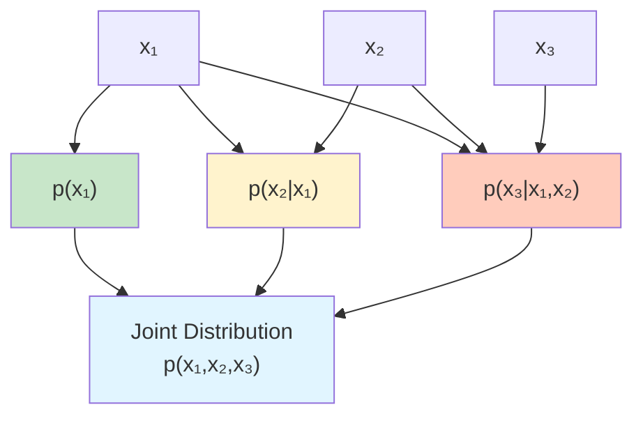
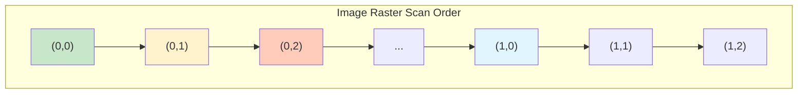
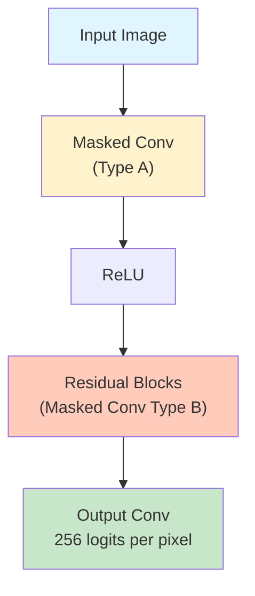
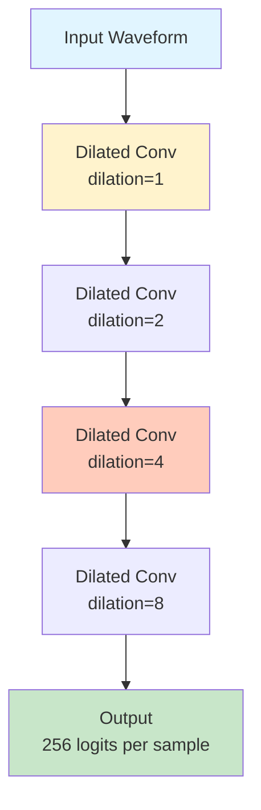
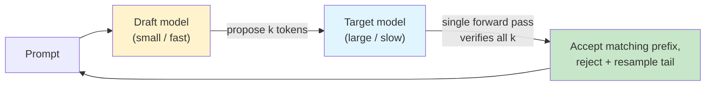

# Autoregressive Models Explained

<div class="grid cards" markdown>

- :material-format-list-numbered:{ .lg .middle } **Sequential Generation**

    ---

    Generate data one element at a time, predicting each based on all previous elements

- :material-function-variant:{ .lg .middle } **Tractable Likelihood**

    ---

    Compute exact probability through chain rule factorization with no approximations

- :material-lightning-bolt:{ .lg .middle } **Flexible Architectures**

    ---

    Use any architecture (RNNs, CNNs, Transformers) that respects the autoregressive property

- :material-star-shooting:{ .lg .middle } **State-of-the-Art Performance**

    ---

    Power modern language models (GPT) and achieve competitive results in image and audio generation

</div>

---

!!! tip "New here?"
    For a one-page map of how autoregressive models fit next to VAEs, GANs, Diffusion, Flows, and EBMs, start with [**Generative Models — A Unified View**](generative-models-unified.md). This page is the deep-dive on autoregressive models specifically.

## Overview

Autoregressive models, formalised in the early neural-language-model literature ([Bengio et al., 2003 — JMLR](https://www.jmlr.org/papers/v3/bengio03a.html)), are a fundamental class of **generative models** that decompose the joint probability distribution into a product of conditional distributions using the **chain rule of probability**. They generate data **sequentially**, predicting each element conditioned on all previously generated elements. The 2017 Transformer ([Vaswani et al., 2017](https://arxiv.org/abs/1706.03762)) and the GPT family ([Radford et al., 2018](https://cdn.openai.com/research-covers/language-unsupervised/language_understanding_paper.pdf); [Brown et al., 2020 — GPT-3](https://arxiv.org/abs/2005.14165)) made autoregressive Transformers the dominant generative-model paradigm of the 2020s, and the 2024–2026 wave (DeepSeek-V3, o1/R1 reasoning, Mamba-2, multi-token prediction, VAR / MAR for images) has fundamentally reshaped what an "autoregressive model" looks like — see [Recent Advances (2024–2026)](#recent-advances-20242026-mixture-of-experts-state-space-and-test-time-reasoning) below.

**What makes autoregressive models special?**

Unlike other generative models that learn data distributions through latent variables (VAEs), adversarial training (GANs), or energy functions (EBMs), autoregressive models directly model the **conditional probability of each element** given its predecessors. This approach offers:

- **Exact likelihood computation** - no variational bounds or approximations
- **Simple training** - standard maximum likelihood with cross-entropy loss
- **Universal applicability** - works for any ordered sequential data
- **Flexible expressiveness** - from simple next-token prediction to complex long-range dependencies
- **Proven scalability** - powers billion-parameter language models like GPT-4

The core principle: **order matters**. By imposing a specific ordering on data dimensions and modeling each element conditionally, autoregressive models achieve tractable training and exact inference while maintaining high expressiveness.

### The Intuition: Building Sequences Step-by-Step

Think of autoregressive models like an artist creating a painting:

1. **Start with a Blank Canvas** - The first element is predicted from a simple prior (often uniform or learned).

2. **Add One Brush Stroke at a Time** - Each new element is predicted based on what's already been created. The model asks: "Given what has been painted so far, what comes next?"

3. **Build Complex Patterns Gradually** - Simple local dependencies (adjacent pixels, consecutive words) compose into global structure (coherent images, meaningful sentences).

4. **No Going Back** - The autoregressive property enforces a strict ordering: element $i$ cannot depend on future elements $i+1, i+2, \ldots$. This constraint makes training tractable.

The critical insight: by breaking down a high-dimensional joint distribution into a sequence of simpler conditional distributions, autoregressive models make both **training (likelihood computation) and generation (sequential sampling) tractable**.

---

## Mathematical Foundation

### The Chain Rule Factorization

The **chain rule of probability** is the cornerstone of all autoregressive models. Any joint distribution can be factored as:

$$
p(x_1, x_2, \ldots, x_n) = p(x_1) \prod_{i=2}^{n} p(x_i \mid x_1, \ldots, x_{i-1})
$$

Autoregressive models parameterize each conditional $p(x_i \mid x_{<i})$ with a neural network:

$$
p_\theta(x_i \mid x_{<i}) = f_\theta(x_i; x_1, \ldots, x_{i-1})
$$

where $\theta$ are learnable parameters and $x_{<i} = (x_1, \ldots, x_{i-1})$ denotes all previous elements.


```mermaid
graph TD
    X1["x₁"] --> P1["p(x₁)"]
    X1 --> P2["p(x₂|x₁)"]
    X2["x₂"] --> P2
    X1 --> P3["p(x₃|x₁,x₂)"]
    X2 --> P3
    X3["x₃"] --> P3
    P1 --> Joint["Joint Distribution<br/>p(x₁,x₂,x₃)"]
    P2 --> Joint
    P3 --> Joint

    style P1 fill:#c8e6c9
    style P2 fill:#fff3cd
    style P3 fill:#ffccbc
    style Joint fill:#e1f5ff
```

**Example** - Image with 3 pixels:

$$
p(x_1, x_2, x_3) = p(x_1) \cdot p(x_2 \mid x_1) \cdot p(x_3 \mid x_1, x_2)
$$

For a 256×256 RGB image with discrete pixel values $\{0, 1, \ldots, 255\}$:

$$
p(\text{image}) = \prod_{i=1}^{256 \times 256 \times 3} p(x_i \mid x_{<i})
$$

This factorization reduces modeling $(256)^{196608}$ joint probabilities to modeling 196,608 conditional distributions—a massive simplification.

### Log-Likelihood and Training

The **log-likelihood** decomposes additively:

$$
\log p_\theta(x_1, \ldots, x_n) = \sum_{i=1}^{n} \log p_\theta(x_i \mid x_{<i})
$$

This makes **maximum likelihood training** straightforward:

$$
\max_\theta \mathbb{E}_{x \sim p_{\text{data}}}\left[\sum_{i=1}^{n} \log p_\theta(x_i \mid x_{<i})\right]
$$

Equivalently, minimize the **negative log-likelihood (cross-entropy)**:

$$
\mathcal{L}(\theta) = -\frac{1}{N} \sum_{j=1}^{N} \sum_{i=1}^{n} \log p_\theta(x_i^{(j)} \mid x_{<i}^{(j)})
$$

where $N$ is the dataset size.

!!!tip "Why This is Beautiful"
    Unlike VAEs (ELBO bound), GANs (minimax), or EBMs (intractable partition function), autoregressive models optimize the **exact likelihood** using **standard supervised learning**. Each conditional $p(x_i \mid x_{<i})$ is a classification problem over the vocabulary.

### Ordering and Masking

**Choosing an ordering** is crucial. Different orderings lead to different models:

**Text (Natural Sequential Order)**:

$$
p(\text{"hello"}) = p(\text{h}) \cdot p(\text{e}|\text{h}) \cdot p(\text{l}|\text{he}) \cdot p(\text{l}|\text{hel}) \cdot p(\text{o}|\text{hell})
$$

**Images (Raster Scan)**:

Pixels generated left-to-right, top-to-bottom:

$$
p(\text{image}) = \prod_{h=1}^{H} \prod_{w=1}^{W} \prod_{c=1}^{C} p(x_{h,w,c} \mid x_{<h}, x_{h,<w}, x_{h,w,<c})
$$

where $x_{<h}$ denotes all rows above, $x_{h,<w}$ denotes pixels to the left in current row, and $x_{h,w,<c}$ denotes previous channels.


```mermaid
graph TD
    subgraph "Image Raster Scan Order"
    P00["(0,0)"] --> P01["(0,1)"]
    P01 --> P02["(0,2)"]
    P02 --> P03["..."]
    P03 --> P10["(1,0)"]
    P10 --> P11["(1,1)"]
    P11 --> P12["(1,2)"]
    end

    style P00 fill:#c8e6c9
    style P01 fill:#fff3cd
    style P02 fill:#ffccbc
    style P10 fill:#e1f5ff
```

**Masking** ensures the autoregressive property. When computing $p(x_i \mid x_{<i})$, the neural network must **not access** future elements $x_{\geq i}$.

**Causal Masking** (for sequences):

```python
# Attention mask preventing position i from attending to positions > i
mask = jnp.tril(jnp.ones((seq_len, seq_len)))  # Lower triangular
```

**Spatial Masking** (for images):

```python
# PixelCNN mask: pixel (h,w) cannot see (h',w') where h' > h or (h'=h and w' > w)
# Implemented via masked convolutions
```

---

## Autoregressive Architectures

Autoregressive models can use various neural network architectures, each with different trade-offs between expressiveness, computational efficiency, and applicability.

### 1. Recurrent Neural Networks (RNNs)

**RNNs** were the original architecture for autoregressive modeling, maintaining hidden state $h_t$ across time steps:

$$
h_t = f(h_{t-1}, x_{t-1}; \theta)
$$

$$
p(x_t \mid x_{<t}) = g(h_t; \theta)
$$

**Variants**:

- **Vanilla RNN**: Simple recurrence, suffers from vanishing gradients
- **LSTM** (Long Short-Term Memory): Gating mechanisms for long-range dependencies
- **GRU** (Gated Recurrent Unit): Simplified gating, fewer parameters

```python
class AutoregressiveRNN(nnx.Module):
    def __init__(self, vocab_size, hidden_dim, *, rngs):
        super().__init__()
        self.embedding = nnx.Embed(vocab_size, hidden_dim, rngs=rngs)
        self.rnn = nnx.RNN(hidden_dim, hidden_dim, rngs=rngs)
        self.output = nnx.Linear(hidden_dim, vocab_size, rngs=rngs)

    def __call__(self, x, *, rngs=None):
        # x: [batch, seq_len]
        embeddings = self.embedding(x)  # [batch, seq_len, hidden_dim]
        hidden_states = self.rnn(embeddings)  # [batch, seq_len, hidden_dim]
        logits = self.output(hidden_states)  # [batch, seq_len, vocab_size]
        return {"logits": logits}
```

**Advantages**:

- **Variable-length sequences** handled naturally
- **Memory-efficient** inference (constant memory)
- **Well-understood** theory and practice

**Disadvantages**:

- **Sequential computation** (no parallelization during training)
- **Limited context** (gradients vanish for long sequences)
- **Slow training** compared to Transformers

**When to use**: Text generation with moderate sequence lengths, real-time applications requiring low latency.

### 2. Masked Convolutional Networks (PixelCNN)

**PixelCNN** ([van den Oord, Kalchbrenner & Kavukcuoglu, 2016 — ICML](https://arxiv.org/abs/1601.06759); [Gated PixelCNN — van den Oord et al., 2016](https://arxiv.org/abs/1606.05328)) uses **masked convolutions** for autoregressive image generation:

**Key idea**: Apply convolution with a **spatial mask** ensuring pixel $(i,j)$ only depends on pixels above and to the left.

**Masked Convolution**:

```python
class MaskedConv2D(nnx.Module):
    def __init__(self, in_channels, out_channels, kernel_size, mask_type, *, rngs):
        super().__init__()
        self.conv = nnx.Conv(in_channels, out_channels,
                            kernel_size=kernel_size, padding="SAME", rngs=rngs)
        self.mask = self._create_mask(kernel_size, mask_type)

    def _create_mask(self, kernel_size, mask_type):
        """Create autoregressive mask for convolution."""
        kh, kw = kernel_size
        mask = jnp.ones((kh, kw, self.in_channels, self.out_channels))

        center_h, center_w = kh // 2, kw // 2

        # Mask future pixels (below and to the right)
        mask = mask.at[center_h + 1:, :, :, :].set(0)
        mask = mask.at[center_h, center_w + 1:, :, :].set(0)

        # For mask type A (first layer), also mask center
        if mask_type == "A":
            mask = mask.at[center_h, center_w, :, :].set(0)

        return mask

    def __call__(self, x):
        masked_kernel = self.conv.kernel * self.mask
        # Apply masked convolution
        ...
```

**Architecture**:

1. **First layer**: Masked Conv with type A (masks center pixel)
2. **Hidden layers**: Masked Conv with type B (includes center pixel)
3. **Residual blocks**: Stack masked convolutions with skip connections
4. **Output**: Per-pixel categorical distribution over pixel values


```mermaid
graph TB
    Input["Input Image"] --> MaskA["Masked Conv<br/>(Type A)"]
    MaskA --> ReLU1["ReLU"]
    ReLU1 --> ResBlock["Residual Blocks<br/>(Masked Conv Type B)"]
    ResBlock --> Out["Output Conv<br/>256 logits per pixel"]

    style Input fill:#e1f5ff
    style MaskA fill:#fff3cd
    style ResBlock fill:#ffccbc
    style Out fill:#c8e6c9
```

**Advantages**:

- **Parallel training**: All pixels computed simultaneously
- **Spatial inductive bias**: Local patterns learned efficiently
- **Exact likelihood**: No approximations

**Disadvantages**:

- **Slow generation**: Sequential pixel-by-pixel (196,608 steps for 256×256×3 image)
- **Blind spot**: Standard PixelCNN misses dependencies due to receptive field limitations (fixed in Gated PixelCNN)
- **Limited long-range dependencies**: Receptive field grows linearly with depth

**When to use**: Image generation when exact likelihood matters, density estimation on images, image inpainting.

### 3. Transformer-Based Autoregressive Models

**Transformers** ([Vaswani et al., 2017 — NeurIPS](https://arxiv.org/abs/1706.03762)) use **self-attention with causal masking** for autoregressive modeling:

**Self-Attention**:

$$
\text{Attention}(Q, K, V) = \text{softmax}\left(\frac{QK^T}{\sqrt{d_k}} + M\right) V
$$

where $M$ is a **causal mask**:

$$
M_{ij} = \begin{cases}
0 & \text{if } j \leq i \\
-\infty & \text{if } j > i
\end{cases}
$$

This ensures position $i$ only attends to positions $\leq i$.

```python
class CausalSelfAttention(nnx.Module):
    def __init__(self, hidden_dim, num_heads, *, rngs):
        super().__init__()
        self.num_heads = num_heads
        self.head_dim = hidden_dim // num_heads

        self.qkv = nnx.Linear(hidden_dim, 3 * hidden_dim, rngs=rngs)
        self.output = nnx.Linear(hidden_dim, hidden_dim, rngs=rngs)

    def __call__(self, x):
        # x: [batch, seq_len, hidden_dim]
        batch_size, seq_len, _ = x.shape

        # Compute Q, K, V
        qkv = self.qkv(x)  # [batch, seq_len, 3 * hidden_dim]
        q, k, v = jnp.split(qkv, 3, axis=-1)

        # Reshape for multi-head attention
        q = q.reshape(batch_size, seq_len, self.num_heads, self.head_dim)
        k = k.reshape(batch_size, seq_len, self.num_heads, self.head_dim)
        v = v.reshape(batch_size, seq_len, self.num_heads, self.head_dim)

        # Compute attention scores
        scores = jnp.einsum('bqhd,bkhd->bhqk', q, k) / jnp.sqrt(self.head_dim)

        # Apply causal mask
        mask = jnp.tril(jnp.ones((seq_len, seq_len)))
        scores = jnp.where(mask, scores, -1e9)

        # Attention weights and output
        attn_weights = nnx.softmax(scores, axis=-1)
        attn_output = jnp.einsum('bhqk,bkhd->bqhd', attn_weights, v)

        # Concatenate heads and project
        attn_output = attn_output.reshape(batch_size, seq_len, -1)
        output = self.output(attn_output)

        return output
```

**GPT Architecture** (Generative Pre-trained Transformer):

1. **Token Embedding** + **Positional Embedding**
2. **Stack of Transformer Blocks**:
   - Causal Self-Attention
   - Layer Normalization
   - Feed-Forward Network (2-layer MLP)
   - Residual connections
3. **Output projection** to vocabulary

**Advantages**:

- **Parallel training**: All positions computed simultaneously
- **Long-range dependencies**: Direct connections via attention
- **Scalability**: Powers models with billions of parameters — GPT-3 (175B, [Brown et al., 2020](https://arxiv.org/abs/2005.14165)), DeepSeek-V3 (671B sparse / 37B active, [DeepSeek-AI, 2024](https://arxiv.org/abs/2412.19437)), Llama-3 (405B, [Meta, 2024](https://arxiv.org/abs/2407.21783)). GPT-4-class models are reportedly ~1.7T-parameter MoE but are closed-weights.
- **State-of-the-art**: Best performance on text, competitive on images (GPT-style AR models)

**Disadvantages**:

- **Quadratic complexity**: $O(n^2)$ in sequence length for self-attention
- **Memory intensive**: Storing attention matrices
- **Sequential generation**: Still generate one token at a time

**When to use**: Text generation (GPT, LLaMA), code generation, any task requiring long-range dependencies.

### 4. WaveNet: Autoregressive Audio Generation

**WaveNet** ([van den Oord et al., 2016 — DeepMind](https://arxiv.org/abs/1609.03499)) is a deep autoregressive model for **raw audio waveforms**:

**Key innovation**: **Dilated causal convolutions** for exponentially large receptive fields.

**Dilated Convolution**:

$$
y_t = \sum_{k=0}^{K-1} w_k \cdot x_{t - d \cdot k}
$$

where $d$ is the dilation factor. Stacking layers with dilations $1, 2, 4, 8, \ldots, 512$ achieves receptive field of 1024 time steps with only $\log_2(1024) = 10$ layers.


```mermaid
graph TB
    Input["Input Waveform"] --> D1["Dilated Conv<br/>dilation=1"]
    D1 --> D2["Dilated Conv<br/>dilation=2"]
    D2 --> D4["Dilated Conv<br/>dilation=4"]
    D4 --> D8["Dilated Conv<br/>dilation=8"]
    D8 --> Out["Output<br/>256 logits per sample"]

    style Input fill:#e1f5ff
    style D1 fill:#fff3cd
    style D4 fill:#ffccbc
    style Out fill:#c8e6c9
```

**Gated activation units**:

$$
z = \tanh(W_{f} * x) \odot \sigma(W_g * x)
$$

where $*$ denotes convolution, $\odot$ is element-wise product, and $W_f$, $W_g$ are filter and gate weights.

**Residual and skip connections**: Connect all layers to output for deep architectures (30-40 layers).

**Advantages**:

- **Raw waveform modeling**: No hand-crafted features
- **High-quality audio**: State-of-the-art speech synthesis
- **Large receptive field**: Captures long-term dependencies efficiently

**Disadvantages**:

- **Extremely slow generation**: 16kHz audio requires 16,000 sequential steps per second
- **Specialized for audio**: Architecture designed for 1D temporal data

**When to use**: Text-to-speech, audio generation, music synthesis.

### 5. Modern Vision Transformers: Visual Autoregressive Modeling (VAR)

**VAR** ([Tian et al., 2024 — NeurIPS Best Paper](https://arxiv.org/abs/2404.02905)) applies GPT-style autoregressive modeling to **images via next-scale prediction**:

**Key innovation**: Instead of predicting pixels in raster scan order, predict **image tokens at progressively finer scales**.

**Multi-scale tokenization**:

1. Encode image into tokens at multiple resolutions: $16 \times 16$, $32 \times 32$, $64 \times 64$, etc.
2. Autoregressively predict tokens at scale $s+1$ conditioned on all tokens at scales $\leq s$
3. Use Transformer to model $p(\text{tokens}_{s+1} \mid \text{tokens}_{\leq s})$

**Advantages over pixel-level AR**:

- **Faster generation**: Fewer sequential steps (sum of tokens across scales vs. total pixels)
- **Better quality**: Multi-scale structure matches image hierarchies
- **Scalable**: Exhibits power-law scaling like LLMs ($R^2 \approx -0.998$)

**Results**: First GPT-style AR model to surpass diffusion transformers on ImageNet generation.

**When to use**: High-quality image generation, scaling autoregressive models to large datasets.

---

## Training Autoregressive Models

### Maximum Likelihood Training

Autoregressive models are trained via **maximum likelihood estimation** using **teacher forcing**:

**Teacher Forcing**: During training, use **ground truth** previous tokens as input (not model's own predictions).

**Training loop**:

```python
def train_step(model, batch, optimizer):
    # batch['sequences']: [batch_size, seq_len] ground truth sequences

    def loss_fn(model):
        # Forward pass with ground truth input
        outputs = model(batch['sequences'])
        logits = outputs['logits']  # [batch_size, seq_len, vocab_size]

        # Shift targets: predict x_i given x_<i
        shifted_logits = logits[:, :-1, :]  # Remove last position
        shifted_targets = batch['sequences'][:, 1:]  # Remove first position

        # Cross-entropy loss
        log_probs = nnx.log_softmax(shifted_logits, axis=-1)
        one_hot_targets = nnx.one_hot(shifted_targets, vocab_size)
        loss = -jnp.mean(jnp.sum(log_probs * one_hot_targets, axis=-1))

        return loss

    loss, grads = nnx.value_and_grad(loss_fn)(model)
    optimizer.update(model, grads)  # NNX 0.11.0+ API

    return loss
```

**Why teacher forcing?**

- **Stable training**: Prevents error accumulation from model's mistakes
- **Faster convergence**: Model sees correct context
- **Exact gradients**: No need for reinforcement learning

**Exposure bias**: At test time, model generates from its own predictions (different from training). Addressed by:

- **Scheduled sampling**: Gradually mix model predictions during training
- **Curriculum learning**: Start with teacher forcing, transition to self-generated
- **Large-scale training**: With enough data and capacity, models generalize well despite bias

### Loss Functions and Metrics

**Primary loss**: **Negative log-likelihood (NLL)** / **Cross-entropy**:

$$
\mathcal{L}_{\text{NLL}} = -\frac{1}{N \cdot T} \sum_{n=1}^{N} \sum_{t=1}^{T} \log p_\theta(x_t^{(n)} \mid x_{<t}^{(n)})
$$

**Perplexity**: Exponentiated cross-entropy (lower is better):

$$
\text{PPL} = \exp(\mathcal{L}_{\text{NLL}})
$$

**Bits per dimension (BPD)**: For images, normalized negative log-likelihood:

$$
\text{BPD} = \frac{\mathcal{L}_{\text{NLL}}}{D \cdot \log 2}
$$

where $D$ is the data dimensionality.

**Accuracy**: Token-level prediction accuracy (for discrete data):

$$
\text{Acc} = \frac{1}{N \cdot T} \sum_{n=1}^{N} \sum_{t=1}^{T} \mathbb{1}[\arg\max p_\theta(x_t \mid x_{<t}) = x_t]
$$

### Numerical Stability and Best Practices

**Log-space computation**: Always work in log-space to prevent underflow:

```python
# WRONG: Can underflow
probs = softmax(logits)
loss = -jnp.mean(jnp.log(probs[targets]))

# CORRECT: Numerically stable
log_probs = nnx.log_softmax(logits)
loss = -jnp.mean(log_probs[targets])
```

**Gradient clipping**: Prevent exploding gradients in deep models:

```python
# Clip gradient norm to max value
grads = jax.tree_map(lambda g: jnp.clip(g, -clip_value, clip_value), grads)
```

**Learning rate schedules**: Use warmup + decay for Transformers:

```python
def lr_schedule(step, warmup_steps=4000, d_model=512):
    step = jnp.maximum(step, 1)  # Avoid division by zero
    arg1 = step ** -0.5
    arg2 = step * (warmup_steps ** -1.5)
    return (d_model ** -0.5) * jnp.minimum(arg1, arg2)
```

**Label smoothing**: Reduce overconfidence:

```python
def label_smoothing(one_hot_labels, smoothing=0.1):
    num_classes = one_hot_labels.shape[-1]
    smooth_labels = one_hot_labels * (1 - smoothing)
    smooth_labels += smoothing / num_classes
    return smooth_labels
```

---

## Generation and Sampling Strategies

### Greedy Decoding

**Select the most likely token** at each step:

$$
x_t = \arg\max_{x} p_\theta(x \mid x_{<t})
$$

```python
def greedy_generation(model, max_length, *, rngs):
    sequence = jnp.zeros((1, max_length), dtype=jnp.int32)

    for t in range(max_length):
        outputs = model(sequence, rngs=rngs)
        logits = outputs['logits'][:, t, :]  # [1, vocab_size]

        next_token = jnp.argmax(logits, axis=-1)
        sequence = sequence.at[:, t].set(next_token)

    return sequence
```

**Pros**: Deterministic, fast

**Cons**: Repetitive, lacks diversity, not true sampling from $p_\theta$

### Sampling with Temperature

**Temperature** $\tau$ controls randomness:

$$
p_\tau(x_t \mid x_{<t}) = \frac{\exp(f_\theta(x_t \mid x_{<t}) / \tau)}{\sum_{x'} \exp(f_\theta(x' \mid x_{<t}) / \tau)}
$$

- $\tau \to 0$: Greedy (deterministic)
- $\tau = 1$: Sample from model distribution
- $\tau > 1$: More uniform (random)

```python
def temperature_sampling(model, max_length, temperature=1.0, *, rngs):
    sequence = jnp.zeros((1, max_length), dtype=jnp.int32)
    sample_key = rngs.sample()

    for t in range(max_length):
        outputs = model(sequence, rngs=rngs)
        logits = outputs['logits'][:, t, :] / temperature

        sample_key, subkey = jax.random.split(sample_key)
        next_token = jax.random.categorical(subkey, logits, axis=-1)
        sequence = sequence.at[:, t].set(next_token)

    return sequence
```

### Top-k Sampling

**Restrict sampling** to the $k$ most likely tokens:

1. Find top-k logits: $\text{top}_k(f_\theta(x \mid x_{<t}))$
2. Set all other logits to $-\infty$
3. Sample from renormalized distribution

```python
def top_k_sampling(model, max_length, k=40, temperature=1.0, *, rngs):
    sequence = jnp.zeros((1, max_length), dtype=jnp.int32)
    sample_key = rngs.sample()

    for t in range(max_length):
        outputs = model(sequence, rngs=rngs)
        logits = outputs['logits'][:, t, :] / temperature

        # Get top-k
        top_k_logits, top_k_indices = jax.lax.top_k(logits, k)

        # Mask non-top-k
        masked_logits = jnp.full_like(logits, -1e9)
        masked_logits = masked_logits.at[0, top_k_indices[0]].set(top_k_logits[0])

        # Sample
        sample_key, subkey = jax.random.split(sample_key)
        next_token = jax.random.categorical(subkey, masked_logits, axis=-1)
        sequence = sequence.at[:, t].set(next_token)

    return sequence
```

**Typical $k$ values**: 10-50 for text, 40 is common.

### Top-p (Nucleus) Sampling

**Sample from the smallest set** of tokens whose cumulative probability exceeds $p$:

1. Sort tokens by probability in descending order
2. Find cutoff where cumulative probability $\geq p$
3. Sample from this subset

```python
def top_p_sampling(model, max_length, p=0.9, temperature=1.0, *, rngs):
    sequence = jnp.zeros((1, max_length), dtype=jnp.int32)
    sample_key = rngs.sample()

    for t in range(max_length):
        outputs = model(sequence, rngs=rngs)
        logits = outputs['logits'][:, t, :] / temperature

        # Sort by probability
        probs = nnx.softmax(logits, axis=-1)
        sorted_indices = jnp.argsort(-probs, axis=-1)
        sorted_probs = jnp.take_along_axis(probs, sorted_indices, axis=-1)

        # Cumulative probabilities
        cumulative_probs = jnp.cumsum(sorted_probs, axis=-1)

        # Find nucleus (keep at least one token)
        cutoff_mask = cumulative_probs <= p
        cutoff_mask = cutoff_mask.at[:, 0].set(True)

        # Mask and renormalize
        masked_probs = jnp.where(cutoff_mask, sorted_probs, 0.0)
        masked_probs /= jnp.sum(masked_probs, axis=-1, keepdims=True)

        # Sample
        sample_key, subkey = jax.random.split(sample_key)
        sampled_idx = jax.random.categorical(subkey, jnp.log(masked_probs), axis=-1)
        next_token = sorted_indices[0, sampled_idx[0]]
        sequence = sequence.at[:, t].set(next_token)

    return sequence
```

**Typical $p$ values**: 0.9-0.95.

**Advantages**: Adapts to probability distribution shape (varies nucleus size).

### Beam Search

**Maintain top-$B$ most likely sequences**:

1. At each step, expand each of the $B$ sequences with all possible next tokens
2. Score all $B \times V$ candidates (where $V$ is vocab size)
3. Keep top-$B$ by cumulative log-probability
4. Return highest-scoring sequence at the end

```python
def beam_search(model, max_length, beam_size=5, *, rngs):
    # Initialize with start token
    sequences = jnp.zeros((beam_size, max_length), dtype=jnp.int32)
    scores = jnp.zeros(beam_size)
    scores = scores.at[1:].set(-1e9)  # Only first beam is active initially

    for t in range(max_length):
        outputs = model(sequences, rngs=rngs)
        logits = outputs['logits'][:, t, :]  # [beam_size, vocab_size]
        log_probs = nnx.log_softmax(logits, axis=-1)

        # Expand: [beam_size, vocab_size]
        candidate_scores = scores[:, None] + log_probs

        # Flatten and get top beam_size
        flat_scores = candidate_scores.reshape(-1)
        top_indices = jnp.argsort(-flat_scores)[:beam_size]

        # Decode indices to (beam_idx, token_idx)
        beam_indices = top_indices // vocab_size
        token_indices = top_indices % vocab_size

        # Update sequences and scores
        sequences = sequences[beam_indices]
        sequences = sequences.at[:, t].set(token_indices)
        scores = flat_scores[top_indices]

    # Return best sequence
    best_idx = jnp.argmax(scores)
    return sequences[best_idx:best_idx+1]
```

**Beam size** $B$: Typical values 3-10. Larger = better likelihood, more computation.

**Use cases**: Machine translation, caption generation (prefer high likelihood over diversity).

---

## Comparing Autoregressive Models with Other Approaches

### Autoregressive vs VAEs: Exact Likelihood vs Latent Compression

| Aspect | Autoregressive Models | VAEs |
|--------|----------------------|------|
| **Likelihood** | Exact | Lower bound (ELBO) |
| **Training** | Cross-entropy (simple) | ELBO (reconstruction + KL) |
| **Generation Speed** | Slow (sequential) | Fast (single decoder pass) |
| **Sample Quality** | Sharp, high-fidelity | Often blurry |
| **Latent Space** | No explicit latent | Structured latent |
| **Interpolation** | Difficult | Natural in latent space |
| **Use Cases** | Text, exact likelihood tasks | Representation learning |

**When to use AR over VAE**:

- Exact likelihood essential (density estimation, compression)
- Generation quality priority
- Sequential data (text, code)
- Willing to accept slower generation

### Autoregressive vs GANs: Training Stability vs Generation Speed

| Aspect | Autoregressive Models | GANs |
|--------|----------------------|------|
| **Training Stability** | Stable (supervised learning) | Unstable (minimax) |
| **Likelihood** | Exact | None |
| **Generation Speed** | Slow (sequential) | Fast (single pass) |
| **Sample Quality** | High (competitive with modern AR) | High (sharp images) |
| **Mode Coverage** | Excellent | Mode collapse common |
| **Diversity** | Controlled via sampling | Variable |

**When to use AR over GAN**:

- Training stability critical
- Exact likelihood needed
- Mode coverage essential
- Avoid adversarial training

### Autoregressive vs Diffusion: Likelihood vs Iterative Refinement

| Aspect | Autoregressive Models | Diffusion Models |
|--------|----------------------|------------------|
| **Generation process** | Sequential (one token / pixel) — accelerated by MTP + speculative decoding (≈3–6×) | Iterative denoising — accelerated by distillation to 1–4 NFEs |
| **Training** | Cross-entropy on next-token prediction | Denoising / vector-field regression |
| **Likelihood** | Exact via the chain rule | Tractable lower bound (ELBO) or via the probability-flow ODE |
| **Generation speed** | Slow sequential (text); VAR / MAR ~20× faster than pixel-AR for images | 20–1000 steps un-distilled; 1–4 distilled |
| **Sample quality (images)** | VAR (NeurIPS 2024 Best) FID 1.73 on ImageNet 256² **beats diffusion baselines** | Modern flow-matching DiTs (SD3, FLUX.1) remain SOTA on text-conditional generation |
| **Sample quality (text)** | The dominant paradigm; Llama-3, GPT-4, DeepSeek-V3 | **Diffusion language models** (LLaDA, Mercury) report competitive 8B-scale results in selected settings (see [Diffusion explainer](diffusion-explained.md#diffusion-language-models-20242026)) |
| **Architecture** | Causal-masked Transformer / Mamba / hybrid | DiT, MMDiT, U-Net |
| **Parallelisation** | Training: full parallel (teacher forcing). Generation: partial (MTP, speculative) | Training: full parallel. Generation: partial (caching, distillation) |

**Recent convergence (2024–2026)**: AR has invaded image generation (VAR), and diffusion has invaded language (LLaDA, Mercury). The unified picture in 2026 is that "AR vs diffusion" is a *spectrum of factorisation strategies* rather than a binary choice — see [ARMs are Secretly EBMs](#autoregressive-energy-based-models) and the [Diffusion Language Models](#diffusion-language-models-an-ar-alternative) subsection in Recent Advances.

**When to use AR over Diffusion**:

- Exact likelihood computation required
- Natural sequential structure (text, code, music)
- Long-range coherence on text-heavy outputs
- Want to leverage Transformer scaling laws + RLHF / RLVR post-training tooling

### Autoregressive vs Flows: Sequential vs Invertible

| Aspect | Autoregressive Models | Classical Normalizing Flows | Modern Flow Matching |
|--------|----------------------|-------------------------------|------------------------|
| **Likelihood** | Exact | Exact | Tractable via probability-flow ODE |
| **Generation Speed** | Sequential (slow) | Single pass | 1–10 ODE steps |
| **Architecture** | Any network respecting causal order | Constrained (invertible, equal dims) | Any DiT / U-Net |
| **Training** | Cross-entropy | MLE via Jacobians | L2 regression on a vector field |
| **Dimensionality** | No restrictions | Input = output | No restrictions |

**MAF/IAF**: Masked Autoregressive Flow combines AR with classical flows — autoregressive structure providing a triangular Jacobian (see [MAF subsection](#masked-autoregressive-flows-maf)).

---

## Advanced Topics

The variants in this section are foundational extensions of the autoregressive framework — flow-based, energy-based, sparse-attention, and scientific applications. The 2024–2026 wave (MoE, state-space, multi-token prediction, test-time compute, etc.) is in its own [Recent Advances section](#recent-advances-20242026-mixture-of-experts-state-space-and-test-time-reasoning) below.

### Masked Autoregressive Flows (MAF)

**MAF** uses autoregressive transformations as **invertible flow layers**:

$$
z_i = (x_i - \mu_i(x_{<i})) \cdot \exp(-\alpha_i(x_{<i}))
$$

where $\mu_i$ and $\alpha_i$ are outputs of a MADE (Masked Autoencoder) network.

**Jacobian** is triangular:

$$
\frac{\partial z}{\partial x} = \text{diag}(\exp(-\alpha_1(x_{<1})), \exp(-\alpha_2(x_{<2})), \ldots)
$$

**Log-determinant**:

$$
\log \left| \det \frac{\partial z}{\partial x} \right| = -\sum_i \alpha_i(x_{<i})
$$

**Trade-offs**:

- **Density estimation**: $O(1)$ forward pass (parallel)
- **Sampling**: $O(D)$ sequential inverse

**IAF** (Inverse Autoregressive Flow) reverses the trade-off: fast sampling, slow density.

### Autoregressive Energy-Based Models

Autoregressive and energy-based modelling can be combined by parameterising each conditional with an energy function:

$$
p(x_1, \ldots, x_n) = \prod_{i=1}^{n} \frac{\exp(-E_i(x_i \mid x_{<i}))}{Z_i(x_{<i})}
$$

trained with per-step contrastive divergence. A 2026 result ([Wang et al., 2026 — *ARMs are Secretly EBMs*](https://arxiv.org/abs/2512.15605)) goes further and establishes a *formal bijection* between autoregressive language models and energy-based models in function space; this corresponds to a special case of the soft Bellman equation in maximum-entropy reinforcement learning, and reframes RLHF / DPO as energy shaping. See the [EBM explainer](ebm-explained.md#recent-advances-20242026-energy-flow-methods-and-implicit-ebms) for the full picture.

### Sparse Transformers and Efficient Attention

**Problem**: Standard self-attention is $O(n^2)$ in sequence length.

**Sparse Transformers** ([Child et al., 2019](https://arxiv.org/abs/1904.10509)) use **sparse attention patterns**:

- **Strided attention**: Attend to every $k$-th position
- **Fixed attention**: Attend to fixed positions (e.g., beginning of sequence)
- **Local + global**: Combine local windows with global tokens

**Complexity**: $O(n \sqrt{n})$ or $O(n \log n)$ depending on pattern.

**Linear Transformers** ([Katharopoulos et al., 2020 — ICML](https://arxiv.org/abs/2006.16236); [Performer — Choromanski et al., 2021](https://arxiv.org/abs/2009.14794)) approximate attention with kernels:

$$
\text{Attention}(Q, K, V) \approx \phi(Q) (\phi(K)^T V)
$$

achieving $O(n)$ complexity.

### Autoregressive for Protein and Scientific Data

**ProtGPT2** (Ferruz et al., 2022): Autoregressive Transformer for protein sequences

- Generates novel, functional proteins
- 50M parameters, trained on UniRef50

**AlphaFold 2** uses autoregressive structure prediction:

- Predicts protein structure token by token
- Iterative refinement via recycling

**Applications**: Drug design, enzyme engineering, materials discovery.

---

## Recent Advances (2024–2026): Mixture-of-Experts, State-Space, and Test-Time Reasoning

The 2017 Transformer + 2020 GPT-3 recipe defined autoregressive modelling for half a decade. Between 2024 and 2026 the field has fragmented along five new axes — **architecture** (MoE, state-space, hybrids), **objective** (multi-token prediction, RLHF / RLVR), **inference** (test-time compute, speculative decoding), **modality** (visual AR, audio AR, multimodal AR), and **alternatives** (continuous-token AR, diffusion LMs). This section organises the headline contributions, grounded in [Raschka's *State of LLMs 2025*](https://magazine.sebastianraschka.com/p/state-of-llms-2025), the [*Beyond Next-Token Prediction* survey (2025)](https://www.mdpi.com/2079-9292/15/5/966), and the [*Architectures, Training Paradigms, and Alignment* LLM survey (2025)](https://www.mdpi.com/2079-9292/14/18/3580).

### Mixture-of-Experts at Production Scale

**Mixture-of-Experts (MoE)** ([Shazeer et al., 2017 — Outrageously Large MoE](https://arxiv.org/abs/1701.06538); [Switch Transformer — Fedus et al., 2022](https://arxiv.org/abs/2101.03961)) routes each token through only a small subset of "expert" feed-forward networks, decoupling parameter count from per-token compute. It went from research curiosity to production default between 2023 and 2026:

- **Mixtral 8×7B** ([Jiang et al., 2024](https://arxiv.org/abs/2401.04088)) — 47B total, 13B active per token; first open-weights MoE to match dense-Llama-2-70B quality.
- **DeepSeek-V3** ([DeepSeek-AI, 2024](https://arxiv.org/abs/2412.19437)) — 671B total / 37B active per token, trained for ~$6M (2.788M H800 GPU-hours). Introduces **auxiliary-loss-free load balancing** (a learned bias on routing scores instead of an auxiliary loss) and **Multi-head Latent Attention (MLA)**, which compresses K/V into a low-rank latent for ~7× smaller KV-cache.
- **Qwen3, GPT-OSS, Granite-4** (2025) — sparse-MoE backbones are now the default for new flagship models.

The 2026 default architectural diagram is "**transformer + MoE feed-forward + GQA / MLA attention + RoPE positions + RMSNorm + SwiGLU**" — see [Llama 3 technical report (Meta, 2024)](https://arxiv.org/abs/2407.21783) for a clean reference.

### State-Space Models and Hybrid Backbones

For very long contexts, quadratic self-attention becomes the dominant cost. The 2024 wave of **selective state-space models (SSMs)** offers $O(N)$ alternatives:

- **Mamba** ([Gu & Dao, 2024 — COLM](https://arxiv.org/abs/2312.00752)) — selective SSM where step size and B/C matrices are *input-dependent*; 5× higher inference throughput than Transformers, linear scaling to million-length sequences.
- **Mamba-2** ([Dao & Gu, 2024 — ICML](https://arxiv.org/abs/2405.21060)) — *State-Space Duality* connects SSMs and attention; significantly faster than Mamba while matching quality.
- **Hybrid backbones** — pure Mamba models (Codestral Mamba) coexist with hybrid stacks like **Jamba** ([Lieber et al., 2024](https://arxiv.org/abs/2403.19887)), **IBM Granite-4**, and **Samba** ([Microsoft, 2024](https://arxiv.org/abs/2406.07522)) that interleave Mamba blocks with sparse softmax-attention layers (typically 3:1 SSM:attention).
- **Trillion-scale hybrid attention** ([Ant Group ICLR 2026 Expo](https://iclr.cc/virtual/2026/expo-talk-panel/10020572)) — production-grade systems mixing linear attention with periodic full-attention layers.

The 2025–2026 consensus: **pure Mamba** wins at long-context retrieval and audio; **hybrids** dominate language modelling; **pure Transformer** still leads on benchmark-heavy short-context tasks.

### Multi-Token Prediction (MTP)

Instead of predicting only the next token, **MTP** trains the model to predict the next $k$ tokens at each position:

- **Better Faster Large Language Models via Multi-Token Prediction** ([Gloeckle et al., 2024 — Meta](https://arxiv.org/abs/2404.19737)) — predicting the next 4 tokens during training markedly improves sample quality and *triples* inference throughput via speculative decoding.
- **DeepSeek-V3 MTP** ([DeepSeek-AI, 2024](https://arxiv.org/abs/2412.19437)) — sequential MTP that maintains the causal chain (rather than parallel as in Gloeckle); used for both training-time benefit and **60% faster inference via self-speculative decoding**.
- **FastMTP** ([2025](https://arxiv.org/abs/2509.18362)) — aligns multi-step draft quality with inference patterns.

### Speculative Decoding

Speculative decoding ([Leviathan et al., 2023 — ICML](https://arxiv.org/abs/2211.17192); [Chen et al., 2023 — DeepMind](https://arxiv.org/abs/2302.01318)) decouples *proposing* tokens (cheap draft model) from *verifying* them (expensive target model), restoring batch parallelism to autoregressive inference:


```mermaid
graph LR
    P["Prompt"] --> D["Draft model<br/>(small / fast)"]
    D -->|"propose k tokens"| V["Target model<br/>(large / slow)"]
    V -->|"single forward pass<br/>verifies all k"| A["Accept matching prefix,<br/>reject + resample tail"]
    A --> P

    style D fill:#fff3cd
    style V fill:#e1f5ff
    style A fill:#c8e6c9
```

Modern variants — **EAGLE-3** ([Li et al., 2025](https://arxiv.org/abs/2503.01840)), **Medusa** ([Cai et al., 2024](https://arxiv.org/abs/2401.10774)), **draft-token sharing** in vLLM / SGLang — deliver **2–6× speedups** with bit-identical outputs (the draft is *verified*, not approximated).

### Test-Time Compute and Reasoning Models

The most important paradigm shift of 2024 is **scaling inference compute** rather than (only) parameters:

- **OpenAI o1** ([2024 — *Learning to Reason with LLMs*](https://openai.com/index/learning-to-reason-with-llms/)) — RL-trained chain-of-thought "reasoning tokens"; AIME 2024 accuracy went from GPT-4o's 12% to 74% at 1 sample, 93% at 1000-sample re-ranking.
- **DeepSeek-R1** ([DeepSeek-AI, 2025](https://arxiv.org/abs/2501.12948)) — open-weights replication; **RL with Verifiable Rewards (RLVR)** on math and code. R1-Zero shows that pure RL (no SFT) suffices to elicit long chain-of-thought.
- **o3 / GPT-5** (2025–2026, closed) — successive scaling of test-time compute on competition math (FrontierMath), competitive programming, and ARC-AGI.

There are now *two* scaling axes: **train-time compute** (parameters × tokens × steps) and **test-time compute** (CoT length × parallel samples × verifier passes). The latter is the dominant trend of 2025–2026.

### Continuous-Token Autoregression (CALM, MAR)

A small but important 2025 thread *decouples* autoregression from discrete tokens:

- **CALM — Continuous Autoregressive Language Models** ([2025](https://arxiv.org/abs/2510.27688)) — uses an autoencoder to compress $k$ discrete tokens into a *single continuous vector* and autoregresses on those. Increases the "semantic bandwidth" of each generative step — potentially the right way past the per-token cost wall.
- **MAR — Masked Autoregressive Modeling** ([Li et al., 2024](https://arxiv.org/abs/2406.11838)) — autoregression on *continuous* tokens with a per-token diffusion head (no VQ); matches diffusion image quality.

### Visual and Multimodal Autoregression

**VAR** (covered above) is the 2024 visual milestone. The 2025–2026 follow-ups extend it:

- **MAR / VAR-Image / VAR-Video** — extensions to higher resolution and video.
- **MAGVIT-v2** ([Yu et al., 2024](https://arxiv.org/abs/2310.05737)) — discrete-token AR over video VQ codes; competitive with diffusion on short-clip generation.
- **Multimodal AR** — GPT-4o, Gemini 2.x, Llama 4 — interleave text and image / audio tokens in a *single* autoregressive stream rather than treating modalities as separate towers.

### Diffusion Language Models: an AR Alternative

A serious 2025 challenger to autoregression is **discrete diffusion language modelling**:

- **LLaDA** ([Nie et al., 2025](https://arxiv.org/abs/2502.09992)) — 8B-parameter masked-diffusion LLM trained from scratch; competitive with LLaMA3-8B on instruction following and in-context learning.
- **Mercury** ([Inception Labs, 2025](https://arxiv.org/abs/2506.17298)) — commercial-scale diffusion LLM with parallel multi-token decoding; 92ms latency vs ~450ms for AR baselines at matched quality.

[ARMs are Secretly EBMs (Wang et al., 2026)](https://arxiv.org/abs/2512.15605) establishes a formal bijection between autoregressive models and energy-based models, reframing post-training (RLHF, DPO) as energy shaping. See the [EBM explainer](ebm-explained.md#recent-advances-20242026-energy-flow-methods-and-implicit-ebms) for the full picture.

### Modern Building Blocks: RoPE, GQA, MLA, RMSNorm, SwiGLU

The 2024–2026 LLM block looks substantially different from Vaswani's 2017 design:

| Component | Old (Transformer 2017) | Modern (Llama-3 / DeepSeek-V3 / Qwen3) |
| --- | --- | --- |
| **Position encoding** | Absolute sinusoidal | **RoPE** ([Su et al., 2024](https://arxiv.org/abs/2104.09864)) — relative rotary; sometimes ALiBi |
| **Attention** | Multi-Head | **Grouped-Query Attention (GQA)** ([Ainslie et al., 2023](https://arxiv.org/abs/2305.13245)) or **Multi-Head Latent Attention (MLA)** (DeepSeek-V2/V3) for KV-cache compression |
| **Normalisation** | LayerNorm | **RMSNorm** ([Zhang & Sennrich, 2019](https://arxiv.org/abs/1910.07467)) — same effect, ~10% cheaper |
| **MLP activation** | ReLU / GELU | **SwiGLU** ([Shazeer, 2020](https://arxiv.org/abs/2002.05202)) — gated linear unit with Swish |
| **Feed-forward** | Dense MLP | **Sparse MoE** with auxiliary-loss-free routing (DeepSeek-V3) |
| **Attention kernel** | naive softmax | **FlashAttention-2/3** ([Dao 2023](https://arxiv.org/abs/2307.08691); [Shah et al., 2024](https://arxiv.org/abs/2407.08608)) |
| **Long-context** | Truncate to ~2k | RoPE + YARN / NTK-aware scaling for **1M+ tokens** |

### Post-Training: RLHF → DPO → RLVR

- **RLHF** ([Ouyang et al., 2022 — InstructGPT](https://arxiv.org/abs/2203.02155)) — supervised fine-tuning + reward model + PPO; the recipe behind ChatGPT.
- **DPO** ([Rafailov et al., 2023 — NeurIPS](https://arxiv.org/abs/2305.18290)) — derives a closed-form reward from preferences; sidesteps the explicit reward model.
- **RLVR** (Reinforcement Learning with Verifiable Rewards, 2024–2025) — used in o1 / R1; reward is a *verifier* (unit tests for code, ground-truth for math), not a learned model. The dominant 2025–2026 post-training paradigm for reasoning models.

### Long-Context: From 2k to 10M Tokens

Modern AR LLMs routinely handle 128k–1M token contexts:

- **YARN, NTK-aware RoPE** — scale RoPE frequencies for context-length extrapolation.
- **Ring Attention** ([Liu et al., 2024](https://arxiv.org/abs/2310.01889)) — distribute attention across devices for arbitrarily long sequences.
- **InfiniAttention, Compressive Memory** — bounded-memory long-context attention.
- **Native long-context** — Gemini 1.5 / 2.x and Llama 4 train with 1M+ context windows from scratch.
- **Needle-in-a-haystack and RULER** ([Hsieh et al., 2024](https://arxiv.org/abs/2404.06654)) — dominant long-context evaluation benchmarks.

### Recent Surveys

| Resource | Year | Scope |
| --- | --- | --- |
| [*Large Language Models: A Survey*](https://arxiv.org/abs/2402.06196) (Minaee et al.) | 2024 | Comprehensive LLM survey |
| [*A Survey of Large Language Models*](https://arxiv.org/abs/2303.18223) (Zhao et al., updated 2024) | 2024 | Continuously-updated review |
| [*State of LLMs 2025*](https://magazine.sebastianraschka.com/p/state-of-llms-2025) (Raschka) | 2025 | Year-end retrospective + 2026 predictions |
| [*Beyond Next-Token Prediction*](https://www.mdpi.com/2079-9292/15/5/966) | 2025 | Failure modes, deployment, world models |
| [*LLM Architectures, Training Paradigms, Alignment*](https://www.mdpi.com/2079-9292/14/18/3580) | 2025 | Architecture + post-training survey |
| [*Datasets for LLMs: A Comprehensive Survey*](https://link.springer.com/article/10.1007/s10462-025-11403-7) | 2025 | 303 datasets, 32 domains, 774.5 TB pre-training corpora |

The throughline: **autoregression is no longer just "next-token prediction"**. In 2026 the term covers MoE-Transformers, hybrid SSM-attention stacks, multi-token-prediction objectives, test-time-compute reasoning, continuous-token AR, and visual / multimodal AR — all unified by the chain-rule factorisation discussed at the top of this page.

---

## Practical Implementation in Artifex

### Basic Autoregressive Model

```python
from flax import nnx

from artifex.generative_models.core.configuration import (
    TransformerConfig,
    TransformerNetworkConfig,
)
from artifex.generative_models.models.autoregressive import (
    TransformerAutoregressiveModel,
)

rngs = nnx.Rngs(0)

config = TransformerConfig(
    name="text-transformer-ar",
    vocab_size=10000,
    sequence_length=512,
    num_layers=6,
    dropout_rate=0.1,
    network=TransformerNetworkConfig(
        name="text-transformer-network",
        hidden_dims=(512,),
        activation="gelu",
        embed_dim=512,
        num_heads=8,
        mlp_ratio=4.0,
    ),
)

# Create Transformer autoregressive model
model = TransformerAutoregressiveModel(config, rngs=rngs)

# Training
batch = {"sequences": sequences}  # [batch_size, seq_len]
outputs = model(batch["sequences"], rngs=rngs, training=True)
loss_dict = model.loss_fn(batch, outputs, rngs=rngs)

# Generation
samples = model.generate(
    n_samples=10,
    max_length=256,
    temperature=0.8,
    top_p=0.9,
    rngs=rngs
)
```

### PixelCNN for Images

```python
from flax import nnx

from artifex.generative_models.core.configuration import PixelCNNConfig
from artifex.generative_models.models.autoregressive import PixelCNN

rngs = nnx.Rngs(0)

config = PixelCNNConfig(
    name="mnist-pixelcnn",
    image_shape=(28, 28, 1),
    num_layers=7,
    hidden_channels=128,
    num_residual_blocks=5,
)

# Create PixelCNN for MNIST (28×28 grayscale)
model = PixelCNN(config, rngs=rngs)

# Training
batch = {"images": images}  # [batch_size, 28, 28, 1], values in [0, 255]
outputs = model(batch["images"], rngs=rngs, training=True)
loss_dict = model.loss_fn(batch, outputs, rngs=rngs)

# Generation
generated_images = model.generate(
    n_samples=16,
    temperature=1.0,
    rngs=rngs
)
```

### WaveNet for Audio

```python
from flax import nnx

from artifex.generative_models.core.configuration import WaveNetConfig
from artifex.generative_models.models.autoregressive import WaveNet

rngs = nnx.Rngs(0)

config = WaveNetConfig(
    name="audio-wavenet",
    vocab_size=256,
    sequence_length=16000,
    residual_channels=128,
    skip_channels=512,
    num_blocks=3,
    layers_per_block=10,
)

# Create WaveNet for audio
model = WaveNet(config, rngs=rngs)

# Training
batch = {"waveform": waveform}  # [batch_size, time_steps]
outputs = model(batch["waveform"], rngs=rngs)
loss_dict = model.loss_fn(batch, outputs, rngs=rngs)

# Generation
generated_audio = model.generate(
    n_samples=1,
    max_length=16000,  # 1 second at 16kHz
    temperature=0.9,
    rngs=rngs
)
```

---

## Evaluation Metrics

### Density-Estimation Metrics

- **Cross-entropy loss / NLL** — the training objective. Reported per-token for text, per-pixel for images.
- **Perplexity** $\mathrm{PPL} = \exp(\mathrm{NLL})$ — the standard text metric.
- **Bits per dimension (BPD)** $= \mathrm{NLL} / (D \log 2)$ — for images, audio, byte-level text.
- **Compression bound** — for any $p_\theta$ admitting tractable likelihood, the [arithmetic-coding](https://en.wikipedia.org/wiki/Arithmetic_coding) bound is $-\log_2 p_\theta$ bits per symbol; AR models routinely reach within 1 % of this in practice.

### Language-Model Benchmarks

The 2024–2026 LLM evaluation landscape has fragmented into specialised benchmarks:

| Benchmark | Tests | Reference |
| --- | --- | --- |
| **MMLU / MMLU-Pro** | Multi-task knowledge | [Hendrycks et al., 2021](https://arxiv.org/abs/2009.03300) |
| **GSM8K, MATH** | Math reasoning | [Cobbe et al., 2021](https://arxiv.org/abs/2110.14168) |
| **HumanEval, MBPP, LiveCodeBench** | Code generation | [Chen et al., 2021](https://arxiv.org/abs/2107.03374) |
| **GPQA Diamond** | Graduate-level science | [Rein et al., 2024](https://arxiv.org/abs/2311.12022) |
| **AIME 2024 / 2025** | Olympiad math (used heavily by reasoning models) | — |
| **FrontierMath** | Research-level math | [Glazer et al., 2024](https://arxiv.org/abs/2411.04872) |
| **ARC-AGI** | Abstraction / reasoning corpus | [Chollet, 2019](https://arxiv.org/abs/1911.01547) |
| **RULER** | Long-context (1M+ tokens) | [Hsieh et al., 2024](https://arxiv.org/abs/2404.06654) |
| **LMSYS Chatbot Arena** | Pairwise human preference | [LMSYS](https://chat.lmsys.org/) |

### Image / Video / Audio AR Metrics

For VAR, MAGVIT-v2, and audio AR (WaveNet, Mamba audio):

- **FID** ([Heusel et al., 2017](https://arxiv.org/abs/1706.08500)) — primary metric for VAR's ImageNet 256² FID 1.73.
- **CMMD** for modern T2I AR.
- **FAD** (Fréchet Audio Distance) — VGGish-feature distance for audio.

### Inference / Throughput Metrics

- **Tokens / second** — the dominant production metric; LMSYS Arena posts this for every served model.
- **Time-to-first-token (TTFT)** vs **time-per-output-token (TPOT)** — separates prefill from decode.
- **Acceptance rate** for speculative decoding — fraction of draft tokens accepted by the verifier.

---

## Production Considerations

### Inference Cost

| Decoding strategy | NFEs / token | Tokens / s on H100 (Llama-3-70B equivalent) |
| --- | --- | --- |
| Vanilla autoregressive (KV cache) | 1 model forward / token | ~30–60 |
| Multi-token prediction ([Gloeckle et al., 2024](https://arxiv.org/abs/2404.19737)) | 1 / *k* tokens | ~90–180 (k=4) |
| Speculative decoding ([Leviathan et al., 2023](https://arxiv.org/abs/2211.17192); [EAGLE-3, 2025](https://arxiv.org/abs/2503.01840)) | varies (acceptance-rate dependent) | ~60–200 |
| DeepSeek-V3 self-speculative MTP ([2024](https://arxiv.org/abs/2412.19437)) | varies | up to 60 % faster than vanilla |

### Quantisation

- **BF16 / FP16** universally safe; standard for new model releases.
- **INT8 / FP8 PTQ** widely adopted in production (TensorRT-LLM, vLLM, SGLang) — typically <1 % MMLU drop.
- **GPTQ / AWQ** — 4-bit weight quantisation for consumer-GPU deployment; <2 % MMLU drop on 70B-class models.
- **MoE quantisation** — DeepSeek-V3-style MoEs need *per-expert* calibration to preserve quality at 4-bit.

### Inference Stacks

The 2024–2026 production AR-inference stack is dominated by:

- **vLLM** ([Kwon et al., 2023](https://arxiv.org/abs/2309.06180)) — PagedAttention; the default open-source server.
- **SGLang** ([Zheng et al., 2024](https://arxiv.org/abs/2312.07104)) — aggressive radix-tree KV-cache reuse; best for chained / structured prompts.
- **TensorRT-LLM** — NVIDIA's closed-stack solution; FP8 + tensor-parallel.
- **llama.cpp / MLX / Apple Foundation Models** — on-device inference for 8B-class models.

### Common Production Pitfalls

- **KV-cache memory blowup** at long contexts — MLA ([DeepSeek-V2/V3](https://arxiv.org/abs/2412.19437)) and GQA ([Ainslie et al., 2023](https://arxiv.org/abs/2305.13245)) are the two standard mitigations.
- **Hallucination** under low-temperature decoding — typically a sign of insufficient post-training; address with verifier-based RLHF / RLVR rather than aggressive sampling adjustments.
- **Repetition loops** — top-p / top-k + repetition penalty + min-p are the standard mitigations.
- **Speculative-decoding mis-acceptance** — always verify the draft against the same target distribution; never approximate.

### Ethical / Safety Considerations

- Autoregressive LLMs are the dominant *deployable* generative-AI surface; treat them with the same content-moderation rigour as social-media platforms.
- **Watermarking** ([Kirchenbauer et al., 2023 — Maryland watermark](https://arxiv.org/abs/2301.10226)) — a small probabilistic bias in token sampling that can be statistically detected; deployable on any AR LLM without retraining.
- **Provenance / C2PA metadata** for AR-image generators (VAR, MAR successors).

For the broader unified picture and how AR fits alongside diffusion / VAE / GAN / EBM / Flow systems in 2026, see [Generative Models — A Unified View](generative-models-unified.md).

---

## Summary and Key Takeaways

Autoregressive models decompose joint distributions via the chain rule, enabling exact likelihood computation and straightforward maximum likelihood training. Their sequential generation, while slower than one-shot methods, achieves state-of-the-art results across modalities.

### Core Principles

<div class="grid cards" markdown>

- :material-function-variant: **Chain Rule Factorization**

    ---

    Decompose $p(x_1, \ldots, x_n) = \prod_i p(x_i \mid x_{<i})$ for tractable training

- :material-lock: **Autoregressive Property**

    ---

    Element $i$ depends only on elements $< i$, enforced by masking

- :material-chart-line: **Exact Likelihood**

    ---

    No approximations—log-likelihood decomposes additively over sequence

- :material-book-open: **Simple Training**

    ---

    Standard supervised learning with cross-entropy loss

</div>

### Architecture Selection

| Architecture | Best For | Generation Speed | Likelihood | Parallelization |
|--------------|----------|------------------|------------|-----------------|
| **RNN/LSTM** | Text (legacy), real-time | Moderate | Exact | Training: no, Generation: no |
| **PixelCNN** | Images (density estimation) | Very slow | Exact | Training: yes, Generation: no |
| **Transformer** | Text, code, long-range | Slow | Exact | Training: yes, Generation: no |
| **WaveNet** | Audio | Very slow | Exact | Training: yes, Generation: no |
| **VAR** | Images (high-quality) | Moderate | Exact | Training: yes, Generation: no |

### Sampling Strategies

| Strategy | Use Case | Diversity | Quality |
|----------|----------|-----------|---------|
| **Greedy** | Deterministic tasks | Low | High likelihood |
| **Temperature** | Controlled randomness | Adjustable | Variable |
| **Top-k** | Balanced diversity | Medium | Good |
| **Top-p (nucleus)** | Adaptive | High | Best overall |
| **Beam search** | Translation, captioning | Low | Highest likelihood |

### When to Use Autoregressive Models

**Best suited for**:

- **Text generation** (GPT, LLaMA, code models)
- **Exact likelihood** tasks (compression, density estimation)
- **Sequential data** with natural ordering (time series, audio)
- **Long-range dependencies** (via Transformers)
- **Stable training** (no adversarial dynamics)

**Avoid when**:

- Real-time generation required (use GANs or fast flows)
- Latent representations needed (use VAEs)
- Order doesn't exist naturally (graph generation)

### Future Directions (2026 and Beyond)

- **Test-time compute as a first-class scaling axis** — o1 / R1 / o3-style reasoning models are the dominant 2025–2026 frontier; expect deeper integration of search and verifier-based RL.
- **MoE everywhere** — sparse-MoE backbones (DeepSeek-V3, Qwen3, GPT-OSS) are now the default for new flagship models; expect continued scaling to multi-trillion total parameters with single-digit-billion active.
- **Hybrid SSM-attention backbones** — Jamba / Granite-4 / Samba-style mixes of Mamba and softmax attention for 1M+ context.
- **Multi-token prediction + speculative decoding everywhere** — DeepSeek-V3 has made MTP the production default; FastMTP and EAGLE-3 are commodity inference acceleration.
- **Diffusion language models as a serious alternative** — LLaDA, Mercury, ReFusion challenge AR for parallel decoding (see [Diffusion Language Models](diffusion-explained.md#diffusion-language-models-20242026)).
- **Continuous-token AR** — CALM / MAR show that "tokens" need not be discrete; expect this to extend the throughput frontier.
- **Multimodal native** — GPT-4o / Gemini 2.x / Llama 4 unify text, vision, and audio in a single AR stream.

---

## Next Steps

<div class="grid cards" markdown>

- :material-book-open-variant:{ .lg .middle } **[AR User Guide](../models/autoregressive-guide.md)**

    ---

    Practical usage guide with implementation examples and training workflows

- :material-code-braces:{ .lg .middle } **[AR API Reference](../../api/models/autoregressive.md)**

    ---

    Complete API documentation for Transformers, PixelCNN, and WaveNet

- :material-school:{ .lg .middle } **[Text Tutorial](../../examples/text/simple-text-generation.md)**

    ---

    Hands-on walkthrough for the retained text generation example

- :material-map-outline:{ .lg .middle } **[Planned Example Topics](../../roadmap/planned-examples.md#text-and-multimodal)**

    ---

    Track still-unshipped autoregressive, transformer, and seq2seq examples

</div>

---

## Further Reading

### Seminal Papers (Must Read)

:material-file-document: **Hochreiter, S., & Schmidhuber, J. (1997).** "Long Short-Term Memory"<br>
&nbsp;&nbsp;&nbsp;&nbsp;:material-link: [Neural Computation 9(8)](https://www.bioinf.jku.at/publications/older/2604.pdf)<br>
&nbsp;&nbsp;&nbsp;&nbsp;:material-lightbulb-outline: LSTM architecture enabling long-range dependencies in RNNs

:material-file-document: **van den Oord, A., Kalchbrenner, N., & Kavukcuoglu, K. (2016).** "Pixel Recurrent Neural Networks"<br>
&nbsp;&nbsp;&nbsp;&nbsp;:material-link: [arXiv:1601.06759](https://arxiv.org/abs/1601.06759) | [ICML 2016](http://proceedings.mlr.press/v48/oord16.html)<br>
&nbsp;&nbsp;&nbsp;&nbsp;:material-lightbulb-outline: PixelRNN and PixelCNN for autoregressive image generation

:material-file-document: **van den Oord, A., et al. (2016).** "WaveNet: A Generative Model for Raw Audio"<br>
&nbsp;&nbsp;&nbsp;&nbsp;:material-link: [arXiv:1609.03499](https://arxiv.org/abs/1609.03499)<br>
&nbsp;&nbsp;&nbsp;&nbsp;:material-lightbulb-outline: Dilated causal convolutions for high-quality audio synthesis

:material-file-document: **Vaswani, A., et al. (2017).** "Attention Is All You Need"<br>
&nbsp;&nbsp;&nbsp;&nbsp;:material-link: [arXiv:1706.03762](https://arxiv.org/abs/1706.03762) | [NeurIPS 2017](https://proceedings.neurips.cc/paper/2017/hash/3f5ee243547dee91fbd053c1c4a845aa-Abstract.html)<br>
&nbsp;&nbsp;&nbsp;&nbsp;:material-lightbulb-outline: Transformer architecture revolutionizing sequence modeling

:material-file-document: **Radford, A., et al. (2018).** "Improving Language Understanding by Generative Pre-Training (GPT)"<br>
&nbsp;&nbsp;&nbsp;&nbsp;:material-link: [OpenAI Technical Report](https://cdn.openai.com/research-covers/language-unsupervised/language_understanding_paper.pdf)<br>
&nbsp;&nbsp;&nbsp;&nbsp;:material-lightbulb-outline: GPT demonstrating Transformer scaling for language

:material-file-document: **Radford, A., et al. (2019).** "Language Models are Unsupervised Multitask Learners (GPT-2)"<br>
&nbsp;&nbsp;&nbsp;&nbsp;:material-link: [OpenAI Technical Report](https://cdn.openai.com/better-language-models/language_models_are_unsupervised_multitask_learners.pdf)<br>
&nbsp;&nbsp;&nbsp;&nbsp;:material-lightbulb-outline: 1.5B parameter model showing emergent capabilities

### Autoregressive Flows

:material-file-document: **Papamakarios, G., Pavlakou, T., & Murray, I. (2017).** "Masked Autoregressive Flow for Density Estimation"<br>
&nbsp;&nbsp;&nbsp;&nbsp;:material-link: [arXiv:1705.07057](https://arxiv.org/abs/1705.07057) | [NeurIPS 2017](https://proceedings.neurips.cc/paper/2017/hash/6c1da886822c67822bcf3679d04369fa-Abstract.html)<br>
&nbsp;&nbsp;&nbsp;&nbsp;:material-lightbulb-outline: Autoregressive transformations as normalizing flows

:material-file-document: **Kingma, D. P., et al. (2016).** "Improved Variational Inference with Inverse Autoregressive Flow"<br>
&nbsp;&nbsp;&nbsp;&nbsp;:material-link: [arXiv:1606.04934](https://arxiv.org/abs/1606.04934) | [NeurIPS 2016](https://proceedings.neurips.cc/paper/2016/hash/ddeebdeefdb7e7e7a697e1c3e3d8ef54-Abstract.html)<br>
&nbsp;&nbsp;&nbsp;&nbsp;:material-lightbulb-outline: IAF for flexible variational posteriors

### Efficient Transformers

:material-file-document: **Child, R., et al. (2019).** "Generating Long Sequences with Sparse Transformers"<br>
&nbsp;&nbsp;&nbsp;&nbsp;:material-link: [arXiv:1904.10509](https://arxiv.org/abs/1904.10509)<br>
&nbsp;&nbsp;&nbsp;&nbsp;:material-lightbulb-outline: Sparse attention patterns for $O(n \sqrt{n})$ complexity

:material-file-document: **Katharopoulos, A., et al. (2020).** "Transformers are RNNs: Fast Autoregressive Transformers with Linear Attention"<br>
&nbsp;&nbsp;&nbsp;&nbsp;:material-link: [arXiv:2006.16236](https://arxiv.org/abs/2006.16236) | [ICML 2020](http://proceedings.mlr.press/v119/katharopoulos20a.html)<br>
&nbsp;&nbsp;&nbsp;&nbsp;:material-lightbulb-outline: Linear attention achieving $O(n)$ complexity

### Recent Advances (2023–2026)

#### Visual Autoregression

:material-file-document: **Tian, K., et al. (2024).** "Visual Autoregressive Modeling: Scalable Image Generation via Next-Scale Prediction" (NeurIPS Best Paper)<br>
&nbsp;&nbsp;&nbsp;&nbsp;:material-link: [arXiv:2404.02905](https://arxiv.org/abs/2404.02905)<br>
&nbsp;&nbsp;&nbsp;&nbsp;:material-lightbulb-outline: GPT-style AR surpassing diffusion on ImageNet (FID 1.73, 20× faster).

:material-file-document: **Li, T., et al. (2024).** "Autoregressive Image Generation without Vector Quantization" (MAR)<br>
&nbsp;&nbsp;&nbsp;&nbsp;:material-link: [arXiv:2406.11838](https://arxiv.org/abs/2406.11838)<br>
&nbsp;&nbsp;&nbsp;&nbsp;:material-lightbulb-outline: Continuous-token AR with per-token diffusion head; matches diffusion quality.

:material-file-document: **Yu, L., et al. (2024).** "MAGVIT-v2: Language Model Beats Diffusion — Tokenizer is Key to Visual Generation"<br>
&nbsp;&nbsp;&nbsp;&nbsp;:material-link: [arXiv:2310.05737](https://arxiv.org/abs/2310.05737)<br>
&nbsp;&nbsp;&nbsp;&nbsp;:material-lightbulb-outline: AR over video VQ codes competitive with diffusion.

#### Open-Weights Foundation Models

:material-file-document: **Touvron, H., et al. (2023).** "LLaMA: Open and Efficient Foundation Language Models"<br>
&nbsp;&nbsp;&nbsp;&nbsp;:material-link: [arXiv:2302.13971](https://arxiv.org/abs/2302.13971)<br>
&nbsp;&nbsp;&nbsp;&nbsp;:material-lightbulb-outline: 7B–65B open models competitive with GPT-3.

:material-file-document: **Meta (2024).** "The Llama 3 Herd of Models"<br>
&nbsp;&nbsp;&nbsp;&nbsp;:material-link: [arXiv:2407.21783](https://arxiv.org/abs/2407.21783)<br>
&nbsp;&nbsp;&nbsp;&nbsp;:material-lightbulb-outline: 405B dense Llama-3; reference modern Transformer recipe (RoPE, GQA, RMSNorm, SwiGLU).

:material-file-document: **Jiang, A. Q., et al. (2024).** "Mixtral of Experts" (Mistral AI)<br>
&nbsp;&nbsp;&nbsp;&nbsp;:material-link: [arXiv:2401.04088](https://arxiv.org/abs/2401.04088)<br>
&nbsp;&nbsp;&nbsp;&nbsp;:material-lightbulb-outline: 8×7B sparse MoE matching dense Llama-2-70B at much lower inference cost.

:material-file-document: **DeepSeek-AI (2024).** "DeepSeek-V3 Technical Report"<br>
&nbsp;&nbsp;&nbsp;&nbsp;:material-link: [arXiv:2412.19437](https://arxiv.org/abs/2412.19437)<br>
&nbsp;&nbsp;&nbsp;&nbsp;:material-lightbulb-outline: 671B/37B-active MoE with MLA, MTP, and auxiliary-loss-free balancing; ~$6M training cost.

:material-file-document: **DeepSeek-AI (2025).** "DeepSeek-R1: Incentivizing Reasoning Capability in LLMs via Reinforcement Learning"<br>
&nbsp;&nbsp;&nbsp;&nbsp;:material-link: [arXiv:2501.12948](https://arxiv.org/abs/2501.12948)<br>
&nbsp;&nbsp;&nbsp;&nbsp;:material-lightbulb-outline: Open-weights replication of o1-style reasoning via Reinforcement Learning with Verifiable Rewards.

#### State-Space and Hybrid Backbones

:material-file-document: **Gu, A., & Dao, T. (2024).** "Mamba: Linear-Time Sequence Modeling with Selective State Spaces" (COLM)<br>
&nbsp;&nbsp;&nbsp;&nbsp;:material-link: [arXiv:2312.00752](https://arxiv.org/abs/2312.00752)<br>
&nbsp;&nbsp;&nbsp;&nbsp;:material-lightbulb-outline: Selective SSMs; linear-time, 5× higher inference throughput than Transformers.

:material-file-document: **Dao, T., & Gu, A. (2024).** "Transformers are SSMs: Generalized Models and Efficient Algorithms through Structured State Space Duality" (Mamba-2, ICML)<br>
&nbsp;&nbsp;&nbsp;&nbsp;:material-link: [arXiv:2405.21060](https://arxiv.org/abs/2405.21060)<br>
&nbsp;&nbsp;&nbsp;&nbsp;:material-lightbulb-outline: SSD framework unifying Mamba and attention; faster than Mamba.

:material-file-document: **Lieber, O., et al. (2024).** "Jamba: A Hybrid Transformer-Mamba Language Model" (AI21 Labs)<br>
&nbsp;&nbsp;&nbsp;&nbsp;:material-link: [arXiv:2403.19887](https://arxiv.org/abs/2403.19887)<br>
&nbsp;&nbsp;&nbsp;&nbsp;:material-lightbulb-outline: First production-scale Mamba/attention hybrid.

:material-file-document: **Microsoft (2024).** "Samba: Simple Hybrid State Space Models for Efficient Unlimited Context Language Modeling"<br>
&nbsp;&nbsp;&nbsp;&nbsp;:material-link: [arXiv:2406.07522](https://arxiv.org/abs/2406.07522)<br>
&nbsp;&nbsp;&nbsp;&nbsp;:material-lightbulb-outline: Mamba + sliding-window attention; unlimited context.

#### Multi-Token Prediction and Speculative Decoding

:material-file-document: **Gloeckle, F., et al. (2024).** "Better & Faster Large Language Models via Multi-Token Prediction" (Meta)<br>
&nbsp;&nbsp;&nbsp;&nbsp;:material-link: [arXiv:2404.19737](https://arxiv.org/abs/2404.19737)<br>
&nbsp;&nbsp;&nbsp;&nbsp;:material-lightbulb-outline: Predicting next 4 tokens improves quality and gives 3× inference speedup via self-speculative decoding.

:material-file-document: **Leviathan, Y., Kalman, M., & Matias, Y. (2023).** "Fast Inference from Transformers via Speculative Decoding" (ICML)<br>
&nbsp;&nbsp;&nbsp;&nbsp;:material-link: [arXiv:2211.17192](https://arxiv.org/abs/2211.17192)<br>
&nbsp;&nbsp;&nbsp;&nbsp;:material-lightbulb-outline: Foundational speculative decoding; bit-identical outputs at 2–3× speedup.

:material-file-document: **Cai, T., et al. (2024).** "Medusa: Simple LLM Inference Acceleration Framework with Multiple Decoding Heads"<br>
&nbsp;&nbsp;&nbsp;&nbsp;:material-link: [arXiv:2401.10774](https://arxiv.org/abs/2401.10774)<br>
&nbsp;&nbsp;&nbsp;&nbsp;:material-lightbulb-outline: Auxiliary decoding heads on the target model — no separate draft model.

:material-file-document: **Li, Y., et al. (2025).** "EAGLE-3: Scaling Speculative Decoding"<br>
&nbsp;&nbsp;&nbsp;&nbsp;:material-link: [arXiv:2503.01840](https://arxiv.org/abs/2503.01840)<br>
&nbsp;&nbsp;&nbsp;&nbsp;:material-lightbulb-outline: Tree-attention speculative decoding; production default in vLLM / SGLang.

:material-file-document: **(2025).** "FastMTP: Accelerating LLM Inference with Enhanced Multi-Token Prediction"<br>
&nbsp;&nbsp;&nbsp;&nbsp;:material-link: [arXiv:2509.18362](https://arxiv.org/abs/2509.18362)<br>
&nbsp;&nbsp;&nbsp;&nbsp;:material-lightbulb-outline: Aligns MTP draft quality with inference patterns.

#### Test-Time Compute and Reasoning

:material-file-document: **OpenAI (2024).** "Learning to Reason with LLMs" (o1)<br>
&nbsp;&nbsp;&nbsp;&nbsp;:material-link: [openai.com](https://openai.com/index/learning-to-reason-with-llms/)<br>
&nbsp;&nbsp;&nbsp;&nbsp;:material-lightbulb-outline: First production reasoning model; AIME 2024 went from 12% (GPT-4o) to 74% (o1).

:material-file-document: **Snell, C., et al. (2024).** "Scaling LLM Test-Time Compute Optimally Can Be More Effective than Scaling Model Parameters"<br>
&nbsp;&nbsp;&nbsp;&nbsp;:material-link: [arXiv:2408.03314](https://arxiv.org/abs/2408.03314)<br>
&nbsp;&nbsp;&nbsp;&nbsp;:material-lightbulb-outline: Theoretical and empirical foundations of test-time compute scaling.

#### Modern Building Blocks

:material-file-document: **Su, J., et al. (2024).** "RoFormer: Enhanced Transformer with Rotary Position Embedding" (RoPE)<br>
&nbsp;&nbsp;&nbsp;&nbsp;:material-link: [arXiv:2104.09864](https://arxiv.org/abs/2104.09864)<br>
&nbsp;&nbsp;&nbsp;&nbsp;:material-lightbulb-outline: Relative rotary position embeddings; the dominant 2024+ choice.

:material-file-document: **Ainslie, J., et al. (2023).** "GQA: Training Generalized Multi-Query Transformer Models from Multi-Head Checkpoints"<br>
&nbsp;&nbsp;&nbsp;&nbsp;:material-link: [arXiv:2305.13245](https://arxiv.org/abs/2305.13245)<br>
&nbsp;&nbsp;&nbsp;&nbsp;:material-lightbulb-outline: GQA — KV-cache reduction without quality loss.

:material-file-document: **Shazeer, N. (2020).** "GLU Variants Improve Transformer" (SwiGLU)<br>
&nbsp;&nbsp;&nbsp;&nbsp;:material-link: [arXiv:2002.05202](https://arxiv.org/abs/2002.05202)<br>
&nbsp;&nbsp;&nbsp;&nbsp;:material-lightbulb-outline: Gated activation; standard MLP nonlinearity in 2024+ Transformers.

:material-file-document: **Zhang, B., & Sennrich, R. (2019).** "Root Mean Square Layer Normalization" (RMSNorm)<br>
&nbsp;&nbsp;&nbsp;&nbsp;:material-link: [arXiv:1910.07467](https://arxiv.org/abs/1910.07467)<br>
&nbsp;&nbsp;&nbsp;&nbsp;:material-lightbulb-outline: ~10% cheaper than LayerNorm; the modern default.

#### Post-Training (RLHF / DPO / RLVR)

:material-file-document: **Ouyang, L., et al. (2022).** "Training Language Models to Follow Instructions with Human Feedback" (InstructGPT)<br>
&nbsp;&nbsp;&nbsp;&nbsp;:material-link: [arXiv:2203.02155](https://arxiv.org/abs/2203.02155)<br>
&nbsp;&nbsp;&nbsp;&nbsp;:material-lightbulb-outline: RLHF — the recipe behind ChatGPT.

:material-file-document: **Rafailov, R., et al. (2023).** "Direct Preference Optimization" (DPO, NeurIPS)<br>
&nbsp;&nbsp;&nbsp;&nbsp;:material-link: [arXiv:2305.18290](https://arxiv.org/abs/2305.18290)<br>
&nbsp;&nbsp;&nbsp;&nbsp;:material-lightbulb-outline: Closed-form preference optimisation; sidesteps the explicit reward model.

#### Long-Context

:material-file-document: **Liu, H., et al. (2024).** "Ring Attention with Blockwise Transformers for Near-Infinite Context"<br>
&nbsp;&nbsp;&nbsp;&nbsp;:material-link: [arXiv:2310.01889](https://arxiv.org/abs/2310.01889)<br>
&nbsp;&nbsp;&nbsp;&nbsp;:material-lightbulb-outline: Distributed attention enabling arbitrary-length sequences.

:material-file-document: **Hsieh, C.-P., et al. (2024).** "RULER: What's the Real Context Size of Your Long-Context Language Models?"<br>
&nbsp;&nbsp;&nbsp;&nbsp;:material-link: [arXiv:2404.06654](https://arxiv.org/abs/2404.06654)<br>
&nbsp;&nbsp;&nbsp;&nbsp;:material-lightbulb-outline: The current standard long-context evaluation benchmark.

#### Continuous-Token AR

:material-file-document: **(2025).** "Continuous Autoregressive Language Models" (CALM)<br>
&nbsp;&nbsp;&nbsp;&nbsp;:material-link: [arXiv:2510.27688](https://arxiv.org/abs/2510.27688)<br>
&nbsp;&nbsp;&nbsp;&nbsp;:material-lightbulb-outline: Compress $k$ discrete tokens into one continuous vector; trades discreteness for semantic bandwidth per step.

:material-file-document: **(2026).** "Autoregressive Language Models are Secretly Energy-Based Models"<br>
&nbsp;&nbsp;&nbsp;&nbsp;:material-link: [arXiv:2512.15605](https://arxiv.org/abs/2512.15605)<br>
&nbsp;&nbsp;&nbsp;&nbsp;:material-lightbulb-outline: Formal ARM↔EBM bijection corresponding to soft Bellman equation in MaxEnt RL.

### Surveys

:material-file-document: **Brown, T., et al. (2020).** "Language Models are Few-Shot Learners" (GPT-3, NeurIPS)<br>
&nbsp;&nbsp;&nbsp;&nbsp;:material-link: [arXiv:2005.14165](https://arxiv.org/abs/2005.14165)<br>
&nbsp;&nbsp;&nbsp;&nbsp;:material-lightbulb-outline: 175B AR model demonstrating in-context learning; the foundational scaling study.

:material-file-document: **Minaee, S., et al. (2024).** "Large Language Models: A Survey"<br>
&nbsp;&nbsp;&nbsp;&nbsp;:material-link: [arXiv:2402.06196](https://arxiv.org/abs/2402.06196)<br>
&nbsp;&nbsp;&nbsp;&nbsp;:material-lightbulb-outline: Comprehensive LLM survey covering architectures, training, and applications.

:material-file-document: **Zhao, W. X., et al. (2024).** "A Survey of Large Language Models" (continuously updated)<br>
&nbsp;&nbsp;&nbsp;&nbsp;:material-link: [arXiv:2303.18223](https://arxiv.org/abs/2303.18223)<br>
&nbsp;&nbsp;&nbsp;&nbsp;:material-lightbulb-outline: Continuously-updated review; the field-tracking reference.

:material-file-document: **(2025).** "LLM Architectures, Training Paradigms, and Alignment Methods"<br>
&nbsp;&nbsp;&nbsp;&nbsp;:material-link: [MDPI Electronics](https://www.mdpi.com/2079-9292/14/18/3580)<br>
&nbsp;&nbsp;&nbsp;&nbsp;:material-lightbulb-outline: 2025 architecture and post-training survey.

:material-file-document: **(2025).** "Beyond Next-Token Prediction: A Standards-Aligned Survey of Autoregressive LLM Failure Modes, Deployment Patterns, and World Models"<br>
&nbsp;&nbsp;&nbsp;&nbsp;:material-link: [MDPI Electronics](https://www.mdpi.com/2079-9292/15/5/966)<br>
&nbsp;&nbsp;&nbsp;&nbsp;:material-lightbulb-outline: Failure modes of next-token prediction; the case for world-model alternatives.

:material-web: **Raschka, S. (2025).** "The State of LLMs 2025"<br>
&nbsp;&nbsp;&nbsp;&nbsp;:material-link: [magazine.sebastianraschka.com](https://magazine.sebastianraschka.com/p/state-of-llms-2025)<br>
&nbsp;&nbsp;&nbsp;&nbsp;:material-lightbulb-outline: Year-end retrospective with 2026 predictions.

### Tutorial Resources

:material-web: **UvA Deep Learning Tutorial 12: Autoregressive Image Modeling**<br>
&nbsp;&nbsp;&nbsp;&nbsp;:material-link: [uvadlc-notebooks.readthedocs.io](https://uvadlc-notebooks.readthedocs.io/en/latest/tutorial_notebooks/tutorial12/Autoregressive_Image_Modeling.html)<br>
&nbsp;&nbsp;&nbsp;&nbsp;:material-lightbulb-outline: Hands-on PixelCNN implementation with Colab notebooks

:material-web: **Stanford CS236: Deep Generative Models (AR Lecture)**<br>
&nbsp;&nbsp;&nbsp;&nbsp;:material-link: [deepgenerativemodels.github.io](https://deepgenerativemodels.github.io/notes/autoregressive/)<br>
&nbsp;&nbsp;&nbsp;&nbsp;:material-lightbulb-outline: Complete course notes on autoregressive models

:material-web: **The Illustrated Transformer**<br>
&nbsp;&nbsp;&nbsp;&nbsp;:material-link: [jalammar.github.io/illustrated-transformer](http://jalammar.github.io/illustrated-transformer/)<br>
&nbsp;&nbsp;&nbsp;&nbsp;:material-lightbulb-outline: Visual guide to understanding Transformers

:material-github: **Hugging Face Transformers Library**<br>
&nbsp;&nbsp;&nbsp;&nbsp;:material-link: [github.com/huggingface/transformers](https://github.com/huggingface/transformers)<br>
&nbsp;&nbsp;&nbsp;&nbsp;:material-lightbulb-outline: State-of-the-art autoregressive models (GPT, LLaMA, etc.)

---

**Ready to build autoregressive models?** Start with the [AR User Guide](../models/autoregressive-guide.md) for practical implementations, check the [API Reference](../../api/models/autoregressive.md) for complete documentation, or dive into tutorials to train your first language model or PixelCNN!
