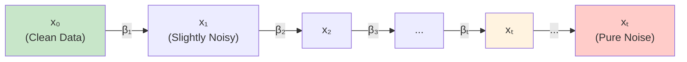
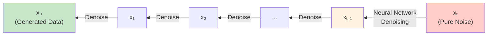
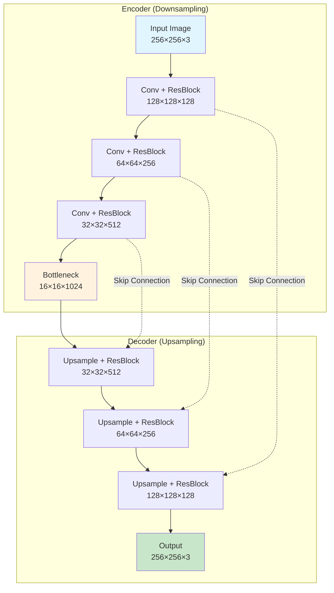
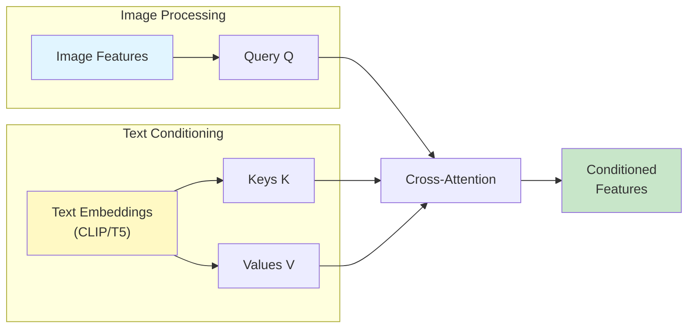
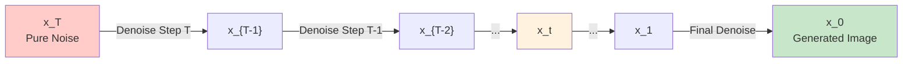
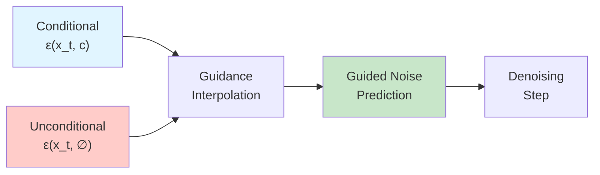
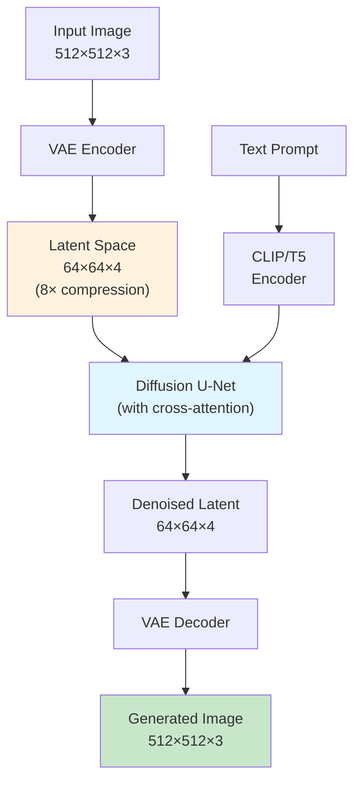

# Diffusion Models Explained

<div class="grid cards" markdown>

- :material-gradient-vertical:{ .lg .middle } **Progressive Denoising**

    ---

    Learn to reverse a gradual noising process, iteratively refining random noise into coherent data

- :material-chart-timeline-variant:{ .lg .middle } **Stable Training**

    ---

    Straightforward MSE objective with no adversarial dynamics—far more stable than GANs

- :material-image-multiple:{ .lg .middle } **State-of-the-Art Quality**

    ---

    Achieves the highest quality generative results, powering DALL-E 2, Stable Diffusion, and Sora

- :material-tune-vertical:{ .lg .middle } **Exceptional Controllability**

    ---

    Natural framework for conditional generation, inpainting, editing, and guidance techniques

</div>

---

## Overview

Diffusion models are a class of **deep generative models** that learn to generate data by reversing a gradual noising process. Unlike GANs which learn through adversarial training or VAEs which compress to latent codes, diffusion models systematically destroy data structure through noise addition, then learn to reverse this process for generation.

**What makes diffusion models special?** They solve the generative modeling challenge through an elegant two-stage process: a fixed **forward diffusion** that gradually corrupts data into pure noise over many timesteps, and a learned **reverse diffusion** that progressively denoises random samples into realistic data. This approach offers unprecedented training stability, superior mode coverage, and exceptional sample quality.

### The Intuition: From Ink to Water and Back

Think of diffusion like watching a drop of ink dissolve in water:

1. **The Forward Process** is like dropping ink into a glass of water and watching it gradually diffuse. At first, you clearly see the ink drop. Over time, it spreads and mixes until the water appears uniformly tinted—all structure is lost.

2. **The Reverse Process** is like learning to run this process backwards: starting from uniformly tinted water and gradually reconstructing the original ink drop. This seems impossible by hand, but a neural network can learn the "reverse physics."

3. **The Training** teaches the network to predict: "Given tinted water at some mixing stage, what did it look like one step earlier?" Repeat this prediction many times, and you recover the original ink drop from fully mixed water.

The critical insight: while the forward diffusion is **fixed and simple** (just add noise), the reverse process is **learned and powerful**. The model learns to undo corruption at every noise level, enabling generation from pure random noise.

---

## Mathematical Foundation

### The Forward Diffusion Process

The forward process defines a fixed Markov chain that gradually corrupts data $x_0$ by adding Gaussian noise over $T$ timesteps (typically $T=1000$):

$$
q(x_t | x_{t-1}) = \mathcal{N}(x_t; \sqrt{1-\beta_t} \, x_{t-1}, \beta_t \mathbf{I})
$$

where $\beta_t \in (0,1)$ controls the variance of noise added at timestep $t$. The complete forward chain factors as:

$$
q(x_{1:T} | x_0) = \prod_{t=1}^T q(x_t | x_{t-1})
$$

**Key property**: We can sample $x_t$ at any arbitrary timestep directly without simulating the full chain. Defining $\alpha_t = 1 - \beta_t$ and $\bar{\alpha}_t = \prod_{i=1}^t \alpha_i$:

$$
q(x_t | x_0) = \mathcal{N}(x_t; \sqrt{\bar{\alpha}_t} \, x_0, (1 - \bar{\alpha}_t) \mathbf{I})
$$

This can be reparameterized as:

$$
x_t = \sqrt{\bar{\alpha}_t} \, x_0 + \sqrt{1 - \bar{\alpha}_t} \, \epsilon \quad \text{where } \epsilon \sim \mathcal{N}(0, \mathbf{I})
$$



**Intuition**: As $t \to T$, the distribution $q(x_T | x_0)$ approaches an isotropic Gaussian $\mathcal{N}(0, \mathbf{I})$, ensuring the endpoint is tractable pure noise. The forward process is designed so that $\bar{\alpha}_T \approx 0$.

The **posterior** conditioned on the original data is also Gaussian with tractable parameters:

$$
q(x_{t-1} | x_t, x_0) = \mathcal{N}(x_{t-1}; \tilde{\mu}_t(x_t, x_0), \tilde{\beta}_t \mathbf{I})
$$

where:

$$
\tilde{\mu}_t(x_t, x_0) = \frac{\sqrt{\bar{\alpha}_{t-1}} \beta_t}{1 - \bar{\alpha}_t} x_0 + \frac{\sqrt{\alpha_t} (1 - \bar{\alpha}_{t-1})}{1 - \bar{\alpha}_t} x_t
$$

$$
\tilde{\beta}_t = \frac{1 - \bar{\alpha}_{t-1}}{1 - \bar{\alpha}_t} \cdot \beta_t
$$

### The Reverse Diffusion Process

The reverse process learns to invert the forward diffusion, starting from noise $x_T \sim \mathcal{N}(0, \mathbf{I})$ and progressively denoising to data $x_0$:

$$
p_\theta(x_{t-1} | x_t) = \mathcal{N}(x_{t-1}; \mu_\theta(x_t, t), \Sigma_\theta(x_t, t))
$$

The complete generative process:

$$
p_\theta(x_{0:T}) = p(x_T) \prod_{t=1}^T p_\theta(x_{t-1} | x_t)
$$



**Three Equivalent Parameterizations**:

**Noise Prediction** (most common): The network predicts the noise $\epsilon$ that was added:

$$
\hat{\epsilon} = \epsilon_\theta(x_t, t)
$$

$$
\mu_\theta(x_t, t) = \frac{1}{\sqrt{\alpha_t}} \left( x_t - \frac{\beta_t}{\sqrt{1-\bar{\alpha}_t}} \epsilon_\theta(x_t, t) \right)
$$

**Data Prediction**: The network directly predicts the clean image:

$$
\hat{x}_0 = f_\theta(x_t, t)
$$

**Score Prediction**: The network predicts the gradient of the log probability:

$$
s_\theta(x_t, t) \approx \nabla_{x_t} \log q(x_t)
$$

These are mathematically equivalent through **Tweedie's formula**:

$$
\nabla_{x_t} \log q(x_t) = -\frac{\epsilon}{\sqrt{1-\bar{\alpha}_t}} = \frac{\sqrt{\bar{\alpha}_t}\, x_0 - x_t}{1-\bar{\alpha}_t}
$$

!!! note "Mathematical Equivalence"
    Predicting noise is equivalent to predicting the score function, unifying diffusion models with score-based generative modeling. This connection reveals deep theoretical relationships between different approaches.

### The ELBO Derivation

Diffusion models are **Markovian hierarchical VAEs**. The evidence lower bound decomposes as:

$$
\log p(x_0) \geq \mathbb{E}_q[\log p_\theta(x_0|x_1)] - D_{KL}(q(x_T|x_0) \| p(x_T)) - \sum_{t=2}^T \mathbb{E}_{q(x_0)} D_{KL}(q(x_{t-1}|x_t,x_0) \| p_\theta(x_{t-1}|x_t))
$$

For Gaussian posteriors, the KL divergence terms simplify. The key loss term becomes:

$$
L_t = \mathbb{E}_{q(x_0,x_t)}\left[\frac{1}{2\sigma_t^2} \|\tilde{\mu}_t(x_t,x_0) - \mu_\theta(x_t,t)\|^2\right]
$$

Substituting the reparameterization yields:

$$
L_t \propto \mathbb{E}_{x_0,\epsilon}\left[\|\epsilon - \epsilon_\theta(\sqrt{\bar{\alpha}_t} \, x_0 + \sqrt{1-\bar{\alpha}_t} \, \epsilon, t)\|^2\right]
$$

**Ho et al.'s key empirical finding**: The **simplified objective** works better:

$$
L_{\text{simple}} = \mathbb{E}_{t \sim U[1,T], \, x_0, \, \epsilon \sim \mathcal{N}(0,\mathbf{I})}\left[\|\epsilon - \epsilon_\theta(x_t, t)\|^2\right]
$$

This reduces training to simple **mean-squared error** between predicted and actual noise!

### Variance Schedules

The noise schedule $\{\beta_1, \ldots, \beta_T\}$ fundamentally affects training and sampling quality:

**Linear Schedule** (Ho et al. 2020):

$$
\beta_t = \beta_1 + (\beta_T - \beta_1) \cdot \frac{t-1}{T-1}
$$

Typically $\beta_1 = 0.0001$, $\beta_T = 0.02$. Simple but can add too much noise early.

**Cosine Schedule** (Nichol & Dhariwal 2021):

$$
\bar{\alpha}_t = \frac{f(t)}{f(0)} \quad \text{where} \quad f(t) = \cos^2\left(\frac{t/T + s}{1+s} \cdot \frac{\pi}{2}\right)
$$

$$
\beta_t = 1 - \frac{\bar{\alpha}_t}{\bar{\alpha}_{t-1}}
$$

with $s = 0.008$. Provides **smoother transitions** and empirically superior performance.

!!! tip "Schedule Selection"
    The cosine schedule has become the de facto standard due to its superior empirical performance. It provides more balanced denoising across timesteps and avoids adding excessive noise in early steps.

### Score-Based Perspective

The **score function** $\nabla_x \log p(x)$ points toward regions of higher probability density. Score-based models train a network $s_\theta(x, t)$ to approximate this gradient field through **denoising score matching**:

$$
\mathcal{L}_{\text{DSM}} = \mathbb{E}_{p(x)}\mathbb{E}_{p(\tilde{x}|x)}\left[\|s_\theta(\tilde{x}, t) - \nabla_{\tilde{x}} \log p(\tilde{x}|x)\|^2\right]
$$

Given the learned score, generation proceeds via **Langevin dynamics**:

$$
x_{i+1} = x_i + \delta \nabla_x \log p(x) + \sqrt{2\delta} \, z_i \quad \text{where } z_i \sim \mathcal{N}(0, \mathbf{I})
$$

The connection to diffusion: **the score equals the negative scaled noise**.

### Stochastic Differential Equations

The continuous-time formulation generalizes discrete diffusion as an SDE:

$$
dx = f(x,t)dt + g(t)dw
$$

**Variance Preserving (VP) SDE** corresponds to DDPM:

$$
dx = -\frac{1}{2}\beta(t)x \, dt + \sqrt{\beta(t)} \, dw
$$

The **reverse-time SDE** enables generation:

$$
dx = \left[f(x,t) - g(t)^2\nabla_x \log p_t(x)\right] dt + g(t) d\bar{w}
$$

There exists an equivalent **probability flow ODE**:

$$
dx = \left[f(x,t) - \frac{1}{2}g(t)^2\nabla_x \log p_t(x)\right] dt
$$

This ODE formulation enables exact likelihood computation and deterministic sampling.

---

## Architecture Design

### U-Net Backbone with Skip Connections

The **U-Net architecture** dominates diffusion models through its encoder-decoder structure with skip connections:



**Key Components**:

- **Contracting path**: Progressive downsampling (256→128→64→32→16→8) while increasing channels
- **Expanding path**: Upsampling reconstructs output at original resolution
- **Skip connections**: Critical for propagating spatial details lost in bottleneck
- **ResNet blocks**: $\text{output} = \text{input} + F(\text{input}, \text{time\_emb})$
- **Group normalization**: Dividing channels into groups (~32) for stability

**Why U-Net for Diffusion?**

1. Input and output have identical dimensions (essential for iterative refinement)
2. Skip connections preserve fine details through bottleneck
3. Multi-scale processing captures both coarse structure and fine texture
4. No information bottleneck—maintains full spatial information

### Time Embedding Through Sinusoidal Encoding

Timestep information must flow through the network since denoising behavior depends critically on noise level. **Sinusoidal position embeddings** provide the standard approach:

$$
PE(t, 2i) = \sin\left(\frac{t}{10000^{2i/d}}\right)
$$

$$
PE(t, 2i+1) = \cos\left(\frac{t}{10000^{2i/d}}\right)
$$

where $t$ is timestep, $i$ is dimension index, and $d$ is embedding dimension (typically 128-256).

**Implementation**:

1. Embed timestep $t$ into 128-256 dimensions via sinusoidal encoding
2. Pass through 2-layer MLP projecting to model dimension
3. Inject via **FiLM (Feature-wise Linear Modulation)**:

$$
\text{output} = \gamma(t) \odot \text{features} + \beta(t)
$$

where $\gamma$ and $\beta$ are learned functions of time embedding.

!!! tip "Time Conditioning"
    FiLM is the most effective injection method, allowing the network to adaptively modulate its processing for each noise level through learned affine transformations.

### Attention Mechanisms

**Self-Attention** captures long-range spatial dependencies:

$$
\text{Attention}(Q, K, V) = \text{softmax}\left(\frac{QK^T}{\sqrt{d_k}}\right)V
$$

Applied selectively due to $O(N^2)$ complexity where $N = H \times W$:

- **Lower resolutions** (16×16, 8×8): Apply multi-head self-attention
- **Higher resolutions** (32×32, 64×64): Skip attention (too expensive)

**Cross-Attention** enables conditioning on external information (e.g., text):

- **Queries** $Q$: From image features
- **Keys** $K$ and **Values** $V$: From conditioning signal (CLIP/T5 text embeddings)

Different image regions attend to relevant text parts, enabling fine-grained control. Used extensively in Stable Diffusion.



### Model Parameterization Choices

**ε-Prediction (Noise Prediction)** — Most Common:

Network predicts $\epsilon_\theta(x_t, t) = \epsilon$ where $x_t = \sqrt{\bar{\alpha}_t} \, x_0 + \sqrt{1-\bar{\alpha}_t} \, \epsilon$

- **Loss**: $L_{\text{simple}} = \mathbb{E}[\|\epsilon - \epsilon_\theta(x_t, t)\|^2]$
- **Advantages**: Most stable, used by DDPM, Stable Diffusion, most implementations

**x₀-Prediction (Data Prediction)**:

Network directly predicts clean image $\hat{x}_\theta(x_t, t) = x_0$

- **Advantages**: Better quality in some cases
- **Disadvantages**: More prone to out-of-distribution predictions requiring clipping

**v-Prediction (Velocity Prediction)**:

Predicts velocity $v_t = \sqrt{\bar{\alpha}_t}\, \epsilon - \sqrt{1 - \bar{\alpha}_t}\, x_0$

- **Loss**: $L = \mathbb{E}[\|v_t - v_\theta(x_t, t)\|^2]$
- **Advantages**: More balanced learning across noise levels, better numerical stability
- **Usage**: Imagen, Google models

!!! note "Equivalence"
    All three parameterizations are mathematically equivalent and can be converted between each other. Most implementations default to ε-prediction, though v-prediction is gaining popularity.

---

## Training Process

### The Simplified Training Objective

The **simplified loss** ignores theoretical weightings from ELBO:

$$
L_{\text{simple}} = \mathbb{E}_{t \sim U[1,T], \, x_0 \sim q(x_0), \, \epsilon \sim \mathcal{N}(0,\mathbf{I})}\left[\|\epsilon - \epsilon_\theta(x_t, t)\|^2\right]
$$

**Training Algorithm**:

1. Sample training image $x_0 \sim q(x_0)$
2. Sample timestep $t \sim \text{Uniform}(1, T)$
3. Sample noise $\epsilon \sim \mathcal{N}(0, \mathbf{I})$
4. Compute noisy image $x_t = \sqrt{\bar{\alpha}_t} \, x_0 + \sqrt{1-\bar{\alpha}_t} \, \epsilon$
5. Predict noise $\hat{\epsilon} = \epsilon_\theta(x_t, t)$
6. Compute loss $L = \|\epsilon - \hat{\epsilon}\|^2$
7. Update $\theta$ via gradient descent

**Remarkably simple**: Just MSE between predicted and actual noise!

### Loss Function Variants

**Variational Lower Bound (VLB)**:

The full ELBO includes weighted terms for each timestep. While theoretically principled, optimizing full VLB is harder in practice.

**Hybrid Objective** (Nichol & Dhariwal 2021):

Combines $L_{\text{simple}}$ for mean prediction with VLB terms for variance learning:

$$
L_{\text{hybrid}} = L_{\text{simple}} + \lambda L_{\text{vlb}}
$$

**Min-SNR-γ Weighting**:

Clips weights at $w_t = \min(\text{SNR}(t), \gamma)$ where $\text{SNR}(t) = \bar{\alpha}_t / (1-\bar{\alpha}_t)$:

$$
L_{\text{min-SNR}} = \mathbb{E}\left[\min(\text{SNR}(t), \gamma) \cdot \|\epsilon - \epsilon_\theta(x_t, t)\|^2\right]
$$

Typical $\gamma = 5$. Achieves **3.4× faster convergence** by preventing over-weighting easy steps.

### Training Stability and Best Practices

!!! tip "Essential Training Practices"
    **Exponential Moving Average (EMA)**: Critical for quality. Maintain running average:

    $$
    \theta_{\text{ema}} = \beta \, \theta_{\text{ema}} + (1-\beta) \, \theta
    $$

    with $\beta = 0.9999$. **Always use EMA weights for inference**, not raw training weights.

    **Gradient Clipping**: Prevents exploding gradients. Clip gradient norms to 1.0.

    **Mixed Precision Training**: FP16/BF16 provides 2-3× speedup, 40-50% memory reduction.

**Normalization**:

- **Group Normalization**: Divide channels into groups (~32) for stability
- **Layer Normalization**: Alternative for transformer-based models
- **No Batch Normalization**: Batch statistics interfere with noise conditioning

**Regularization**:

- **Weight Decay**: $10^{-4}$ to $10^{-6}$ with AdamW optimizer
- **Dropout**: Sometimes used (rate 0.1-0.3) but less common than in other architectures

### Hyperparameter Selection

**Timesteps**: $T = 1000$ is standard for training. More steps provide finer granularity but slower sampling.

**Noise Schedules**:

- **Cosine schedule** outperforms linear empirically
- Critical: Ensure $\bar{\alpha}_T \approx 0$ for pure noise at final step

**Learning Rates**:

- Standard: $1 \times 10^{-4}$ to $2 \times 10^{-4}$ with AdamW
- Sensitive domains (faces): $1 \times 10^{-6}$ to $2 \times 10^{-6}$
- Use linear warmup over 500-1000 steps

**Batch Sizes**:

- Small images (32×32): 128-512
- Medium (256×256): 32-128
- Large (512×512): 8-32
- Use gradient accumulation to simulate larger batches

**Optimizer Configuration**:

```python
optimizer = torch.optim.AdamW(
    model.parameters(),
    lr=1e-4,
    betas=(0.9, 0.999),
    weight_decay=1e-4
)
```

### Training Dynamics and Monitoring

!!! warning "Common Training Issues"
    **Loss Plateaus**: Normal behavior—loss doesn't directly correlate with quality. Monitor visual samples!

    **NaN Losses**: Usually from exploding gradients. Enable gradient clipping and mixed precision loss scaling.

    **Poor Sample Quality**: Check EMA is enabled, noise schedule is correct, sufficient training steps completed.

**What to Monitor**:

1. **Training Loss**: Should decrease initially, then plateau
2. **Visual Samples**: Generate every 5k-10k steps at fixed noise seeds
3. **FID Score**: Compute on validation set every 25k-50k steps
4. **Gradient Norms**: Should be stable, not exploding
5. **Learning Rate**: Track warmup and decay schedules

**Checkpoint Management**:

- Save both regular and EMA weights
- Keep checkpoints every 50k-100k steps
- Save best checkpoint based on FID score
- Include optimizer state for resuming training

### Computational Requirements

**GPU Requirements**:

- Minimum: 10GB VRAM (RTX 3080)
- Recommended: 24GB VRAM (RTX 3090/4090)
- Large-scale: 40-80GB (A100/H100)

**Training Times**:

- Small datasets (10k images): Days on single GPU
- Medium (100k images): Weeks on multiple GPUs
- Large-scale (millions): Months on hundreds of GPUs
- ImageNet 256×256 on 8× A100: 7-14 days

**Memory Optimizations**:

- **Gradient Checkpointing**: 30-50% memory reduction, 20% slowdown
- **Mixed Precision**: 40-50% memory reduction, 2-3× speedup
- **Smaller Batch Sizes**: Use gradient accumulation to maintain effective batch size

---

## Sampling Methods

### DDPM Sampling: The Iterative Reverse Process

The foundational DDPM sampling starts from pure noise $x_T \sim \mathcal{N}(0, \mathbf{I})$ and iteratively denoises:

$$
x_{t-1} = \frac{1}{\sqrt{\alpha_t}} \left( x_t - \frac{\beta_t}{\sqrt{1-\bar{\alpha}_t}} \epsilon_\theta(x_t, t) \right) + \sigma_t z
$$

where $z \sim \mathcal{N}(0, \mathbf{I})$ and $\sigma_t$ controls stochasticity.

**Algorithm**:

1. Sample $x_T \sim \mathcal{N}(0, \mathbf{I})$
2. For $t = T, T-1, \ldots, 1$:
   - Predict noise: $\hat{\epsilon} = \epsilon_\theta(x_t, t)$
   - Compute mean: $\mu_t = \frac{1}{\sqrt{\alpha_t}} \left( x_t - \frac{\beta_t}{\sqrt{1-\bar{\alpha}_t}} \hat{\epsilon} \right)$
   - Sample: $x_{t-1} = \mu_t + \sigma_t z$
3. Return $x_0$

**Characteristics**:

- **Stochastic**: Introduces randomness at each step
- **Slow**: Requires $T=1000$ neural network evaluations (seconds to minutes)
- **High Quality**: Excellent sample quality with sufficient steps
- **1000-2000× slower** than single-pass generators like GANs



### DDIM: Fast Deterministic Sampling

**Paper**: "Denoising Diffusion Implicit Models" (Song et al., 2021)

DDIM constructs **non-Markovian forward processes** sharing DDPM's marginals but enabling much larger reverse steps:

$$
x_{t-1} = \sqrt{\bar{\alpha}_{t-1}} \underbrace{\left(\frac{x_t - \sqrt{1-\bar{\alpha}_t} \epsilon_\theta(x_t, t)}{\sqrt{\bar{\alpha}_t}}\right)}_{\text{"predicted } x_0\text{"}} + \underbrace{\sqrt{1-\bar{\alpha}_{t-1} - \sigma_t^2} \cdot \epsilon_\theta(x_t, t)}_{\text{"direction pointing to } x_t\text{"}} + \underbrace{\sigma_t \epsilon}_{\text{random noise}}
$$

When $\sigma_t = 0$, sampling becomes **fully deterministic**.

**Key Advantages**:

- **10-50× speedup**: Reduces from 1000 steps to 50-100 steps
- **No retraining**: Works with any pre-trained DDPM checkpoint
- **Deterministic**: When $\eta = 0$, enables consistent reconstructions
- **Interpolation**: Meaningful latent space interpolation

**Algorithm** (Deterministic $\sigma_t = 0$):

1. Sample $x_T \sim \mathcal{N}(0, \mathbf{I})$
2. Choose subset of timesteps $\{\tau_1, \tau_2, \ldots, \tau_S\}$ where $S \ll T$
3. For $i = S, S-1, \ldots, 1$:
   - Predict $x_0$: $\hat{x}_0 = \frac{x_{\tau_i} - \sqrt{1-\bar{\alpha}_{\tau_i}} \epsilon_\theta(x_{\tau_i}, \tau_i)}{\sqrt{\bar{\alpha}_{\tau_i}}}$
   - Compute $x_{\tau_{i-1}} = \sqrt{\bar{\alpha}_{\tau_{i-1}}} \hat{x}_0 + \sqrt{1-\bar{\alpha}_{\tau_{i-1}}} \epsilon_\theta(x_{\tau_i}, \tau_i)$
4. Return $x_0$

!!! tip "DDIM in Practice"
    DDIM became the standard inference method for production systems. Stable Diffusion defaults to 50 DDIM steps for a good quality/speed trade-off. Fewer steps (20-25) work for quick previews.

### Advanced ODE Solvers

**DPM-Solver** (2022):

Treats diffusion sampling as solving ODEs with specialized numerical methods:

- **Higher-order solver** (order 2-3) with convergence guarantees
- Achieves FID 4.70 in **10 steps**, 2.87 in **20 steps** on CIFAR-10
- **4-16× speedup** over previous samplers

**DPM-Solver++** (2023):

Addresses instability with large classifier-free guidance scales:

- Uses data prediction with dynamic thresholding
- Performs well with 15-20 steps for guided sampling
- Better numerical stability than DPM-Solver

**PNDM** (Pseudo Numerical Methods):

Treats DDPMs as solving differential equations on manifolds:

- Generates higher quality with 50 steps than 1000-step DDIM
- **20× speedup** with quality improvement

### Consistency Models: One-Step Generation

**Papers**:

- "Consistency Models" (Song et al., 2023)
- "Improved Techniques for Training Consistency Models" (Song et al., 2023)

**Paradigm shift**: Learn a **consistency function** $f$ that directly maps any point on a trajectory to its endpoint:

$$
f(x_t, t) = x_0 \quad \text{for all } t
$$

The self-consistency property:

$$
f(x_t, t) = f(x_s, s) \quad \text{for all } s, t
$$

**Consistency Distillation**:

Train by distilling from pre-trained diffusion model:

$$
\mathcal{L}_{\text{CD}} = \mathbb{E}\left[d(f_\theta(x_{t_{n+1}}, t_{n+1}), f_{\theta^-}(\hat{x}_{t_n}^\phi, t_n))\right]
$$

where $\hat{x}_{t_n}^\phi$ is one step of ODE solver from $x_{t_{n+1}}$ using teacher model.

**Results**:

- FID 3.55 on CIFAR-10 in **one step**
- Improved techniques: FID 2.51 in one step, 2.24 in two steps
- Consistency Trajectory Models (CTM): FID 1.73 in **one step**
- Zero-shot editing without task-specific training

!!! note "Revolutionary Speed"
    Consistency models achieve 1000× speedup over DDPM while maintaining competitive quality. This makes diffusion viable for real-time applications.

### Guidance Techniques

**Classifier Guidance**:

Modifies the score using gradients from a separately trained classifier:

$$
\tilde{\epsilon}_\theta(x_t, c) = \epsilon_\theta(x_t, c) - w \cdot \sigma_t \cdot \nabla_{x_t} \log p_\phi(c|x_t)
$$

where $w$ is guidance scale, $c$ is class label.

**Advantages**: State-of-the-art results when well-tuned
**Disadvantages**: Requires training noise-aware classifiers at all noise levels

**Classifier-Free Guidance** (Ho & Salimans, 2022):

Eliminates the classifier by jointly training conditional and unconditional models:

$$
\tilde{\epsilon}_\theta(x_t, c) = (1 + w) \cdot \epsilon_\theta(x_t, c) - w \cdot \epsilon_\theta(x_t, \emptyset)
$$

During training, randomly drop condition $c$ with probability ~10%.

**Advantages**:

- No auxiliary classifier needed
- Often better quality than classifier guidance
- Single guidance scale $w$ controls trade-off
- **Industry standard**: Used by DALL-E 2, Stable Diffusion, Midjourney, Imagen

**Common Guidance Scales**:

- $w = 1.0$: No guidance (unconditional)
- $w = 3-5$: Moderate guidance, balanced quality/diversity
- $w = 7-8$: Standard guidance (Stable Diffusion default: 7.5)
- $w = 10-15$: Strong guidance, high fidelity but lower diversity
- $w > 20$: Over-guided, saturated colors, artifacts



---

## Diffusion Model Variants

### Latent Diffusion Models (LDM / Stable Diffusion)

**Paper**: "High-Resolution Image Synthesis with Latent Diffusion Models" (Rombach et al., 2022)

**Revolutionary insight**: Run diffusion in VAE latent space instead of pixel space.

**Two-Stage Approach**:

1. **Train autoencoder** compressing images 8× (512×512×3 → 64×64×4)
2. **Run diffusion** in compressed latent space

**Architecture**:



**Key Benefits**:

- **2.7× training/inference speedup**
- **1.6× FID improvement**
- **Massively reduced memory**: ~10GB VRAM for 512×512 generation
- **Cross-attention conditioning**: Text embeddings guide generation

**Stable Diffusion Implementation**:

- 860M-parameter U-Net in latent space
- Trained on LAION-5B (5 billion text-image pairs)
- Open-source release democratized text-to-image generation
- Versions: 1.4, 1.5, 2.0, 2.1, SDXL (2.3B), SD3 (8B)

**SDXL** (2023):

- 2.3B parameters
- Dual text encoders (OpenCLIP + CLIP)
- Native 1024×1024 resolution
- Two-stage: base model + refiner

**Stable Diffusion 3** (2024):

- **Rectified Flow Transformer** replacing U-Net
- Multimodal Diffusion Transformer
- Sizes: 800M, 2B, 8B parameters
- State-of-the-art text rendering in images

!!! note "Impact"
    Latent diffusion made high-quality generation accessible. Stable Diffusion has 100M+ users and massive ecosystem of fine-tunes, LoRAs, and community tools.

### Conditional Diffusion Models

**Class-Conditional Generation**:

Add class label $y$ as conditioning:

$$
p_\theta(x_{t-1} | x_t, y) = \mathcal{N}(x_{t-1}; \mu_\theta(x_t, t, y), \Sigma_\theta(x_t, t, y))
$$

Typically implemented via:

- **Class embeddings** concatenated with time embeddings
- **Conditional batch normalization**: Modulate batch norm with class info
- **Cross-attention**: Attend to class token

**Text-to-Image Models**:

**DALL-E 2** (OpenAI, 2022):

- Two-stage: CLIP prior diffusion + decoder
- CLIP prior maps text embeddings to image embeddings
- Decoder generates images from CLIP embeddings
- Up to 1024×1024 resolution

**Imagen** (Google, 2022):

- Frozen T5-XXL (4.6B parameters) as text encoder
- Cascaded diffusion: 64×64 → 256×256 → 1024×1024
- Key finding: **Scaling text encoder improves quality more than scaling U-Net**
- FID 7.27 on COCO (state-of-the-art at time)
- Not publicly released

**Midjourney** (2022-2024):

- Proprietary diffusion model
- Exceptional aesthetic quality
- Versions V1 → V6 (2024)
- ~15M users, multi-million dollar revenue

### Cascade Diffusion Models

Generate through multiple resolution stages, each a separate diffusion model:

1. **Base model**: Generate at 64×64
2. **Super-resolution 1**: Upscale to 256×256
3. **Super-resolution 2**: Upscale to 1024×1024

**Advantages**:

- Each stage focuses on different detail scales
- More efficient than single high-resolution model
- Better quality through specialized models

**Disadvantages**:

- Complexity of training multiple models
- Error accumulation across stages

Used in **DALL-E 2** and **Imagen**.

### Video Diffusion Models

Extend spatial generation to temporal dimension:

**3D U-Net Architecture**:

- Spatial convolutions → Spatio-temporal convolutions
- Process video as Time × Height × Width tensor
- Temporal attention captures motion

**Sora** (OpenAI, 2024):

- **Diffusion Transformer** on spacetime patches
- Videos as sequences of patches (like LLM tokens)
- Compressed into latent space via video VAE
- Up to 1 minute of 1080p video
- Variable aspect ratios
- Emergent physics understanding, object permanence

**Sora 2** (2025):

- Synchronized audio generation
- Improved physics simulation
- Multi-shot video with persistent world state
- Instruction-following for complex scenes

**Open-Source Video Models**:

- **CogVideoX**: 2B and 5B parameter models
- **HunyuanVideo**: 7B and 14B parameters with scaling studies
- **Stable Video Diffusion**: Extension of Stable Diffusion

### 3D Diffusion Models

**DreamFusion** (Google, 2022):

Uses 2D text-to-image models as priors for 3D generation via **Score Distillation Sampling (SDS)**:

1. Initialize random 3D NeRF
2. Render 2D views from random camera angles
3. Apply noise and use Imagen to denoise
4. Backpropagate through rendering to update NeRF
5. Repeat

**Key Innovation**: **No 3D training data required**—leverages 2D diffusion models.

**Capabilities**:

- Text-to-3D generation
- Viewable from any angle
- Relightable
- Exportable as meshes

**Stable-DreamFusion**:

- Uses Stable Diffusion instead of Imagen
- Open-source implementation
- Enables text-to-3D and image-to-3D

**Applications**: Game assets, VR/AR content, product design, 3D scene reconstruction

---

## Comparison with Other Generative Models

### Diffusion vs. GANs

| Aspect | Diffusion Models | GANs |
|--------|------------------|------|
| **Sample Quality** | State-of-the-art (FID 1.81-7.72) | High quality (FID ~2.97) |
| **Training Stability** | Very stable, straightforward MSE | Unstable, adversarial balancing |
| **Mode Coverage** | Excellent, likelihood-based | Prone to mode collapse |
| **Inference Speed** | Slow (25-1000 steps) | Fast (1 forward pass) |
| **Training Ease** | Forgiving hyperparameters | Requires careful tuning |
| **Controllability** | Excellent (guidance, editing) | Limited, no natural framework |
| **Latent Space** | No explicit latent | No encoder, implicit latent |

**Speed Comparison**:

- **GANs**: ~0.01 seconds per image (single pass)
- **DDPM**: 10-60 seconds per image (1000 steps)
- **DDIM**: 1-5 seconds per image (50 steps)
- **Consistency Models**: 0.1-0.5 seconds per image (1-4 steps)

!!! tip "When to Use Each"
    **Choose Diffusion**:
    - Quality/diversity paramount
    - Training stability important
    - Denoising, super-resolution, inpainting tasks
    - Computational resources available

    **Choose GANs**:
    - Real-time generation required
    - Single-pass critical (e.g., video style transfer)
    - Limited inference compute
    - Interactive applications

### Diffusion vs. VAEs

| Aspect | Diffusion Models | VAEs |
|--------|------------------|------|
| **Sample Quality** | Sharp, high-fidelity | Often blurry from MSE loss |
| **Latent Space** | No explicit low-dim latent | Explicit interpretable latent |
| **Likelihood** | Tractable via ODE | Explicit ELBO lower bound |
| **Training** | Straightforward, stable | Straightforward, very stable |
| **Speed** | Slow (multi-step) | Fast (single pass) |
| **Representation** | Implicit in noise trajectory | Explicit learned encoding |

#### Hybrid Approach: Latent Diffusion

Combines strengths of both:

1. **VAE**: Compresses images to latent space (8× reduction)
2. **Diffusion**: Operates in compressed latent space

Results: **2.7× speedup, better quality, significantly reduced memory**.

### Diffusion vs. Autoregressive Models

| Aspect | Diffusion | Autoregressive |
|--------|-----------|----------------|
| **Speed** | Faster for long sequences (>256 tokens) | Faster for short (<100 tokens) |
| **Quality** | Best for images/audio/video | Best for text/language |
| **Parallelization** | Fully parallel generation | Sequential (can't parallelize) |
| **Controllability** | Excellent (edit any step) | Limited (left-to-right) |
| **Variable Length** | Fixed-length outputs | Natural variable-length |

**Complementary Strengths**:

- **Diffusion**: Images, audio, video, fixed-length sequences
- **Autoregressive**: Text, language, variable-length, sequential coherence

**Hybrid Models**:

**HART** (Hybrid Autoregressive Transformer):

- Autoregressive for coarse structure
- Diffusion for fine details
- 9× faster than pure diffusion
- 31% less compute

---

## Advanced Topics

### Flow Matching and Rectified Flow

**Flow Matching** (2022):

Trains Continuous Normalizing Flows by regressing vector fields:

- **Simulation-free training**—no ODE solving during training
- More stable dynamics than traditional diffusion
- Compatible with general Gaussian probability paths
- State-of-the-art ImageNet results

**Rectified Flow** (2023):

Learns ODEs following **straight paths** between noise and data:

$$
\frac{dx}{dt} = v_\theta(x, t)
$$

where trajectories are straight lines from $x_0$ to $x_1$.

**Reflow Operation**: Iteratively straightens trajectories:

1. Sample pairs $(x_0, x_1)$ from data and noise
2. Train model on straight paths
3. Use trained model to generate new paired data
4. Retrain on straightened paths
5. Repeat

**Results**:

- Can achieve high quality in 1-2 steps after reflow
- **InstaFlow**: Generates images in 0.12 seconds
- **Used in Stable Diffusion 3** as core architecture

### EDM: Elucidating Design Spaces

**Papers**:

- "Elucidating the Design Space" (Karras et al., 2022)
- "Analyzing and Improving Training Dynamics" (Karras et al., 2024)

**EDM** provides unified framework separating design choices:

**Optimal Preconditioning**:

Normalizing inputs/outputs of network for better training:

$$
D_\theta(x, \sigma) = c_{\text{skip}}(\sigma) x + c_{\text{out}}(\sigma) F_\theta(c_{\text{in}}(\sigma) x; c_{\text{noise}}(\sigma))
$$

**Karras Noise Schedule**:

$$
\sigma(t) = \sigma_{\text{min}}^{1-t} \cdot \sigma_{\text{max}}^t
$$

Widely adopted in practice, superior to linear/cosine.

**Results**: FID 1.79 on CIFAR-10 (state-of-the-art)

**EDM2** (2024):

- Analyzed training dynamics at scale
- Redesigned architecture with magnitude preservation
- **Post-hoc EMA**: Set parameters after training without retraining
- FID 1.81 on ImageNet-512 (previous record: 2.41)

### Distillation for Fast Sampling

**Progressive Distillation** (Salimans & Ho, 2022):

Iteratively halves the number of steps:

1. Start with 8192-step teacher
2. Train 4096-step student to match
3. Train 2048-step student from previous student
4. Continue halving to 4 steps

Results: FID 3.0 on CIFAR-10 in 4 steps

**Distribution Matching Distillation**:

- One-step FID 2.62 on ImageNet
- FID 11.49 on MS-COCO
- 20 FPS generation

**Simple and Fast Distillation** (NeurIPS 2024):

- **1000× faster fine-tuning**
- FID 4.53 in 2 steps with only 0.64 hours on A100

### Diffusion Transformers (DiT)

**Paper**: "Scalable Diffusion Models with Transformers" (Peebles & Xie, 2023)

Replaces U-Net with transformer architecture:

**Architecture**:

- Images as patch sequences (like ViT)
- Standard transformer blocks instead of U-Net
- **Adaptive Layer Norm (adaLN-Zero)** for conditioning:

$$
\text{LayerNorm}(x) \cdot (1 + \gamma(t)) + \beta(t)
$$

**Key Finding**: **Compute (Gflops) drives performance**, not specific architecture.

**Results**:

- DiT-XL/2: FID 2.27 on ImageNet 256×256
- Scales better than U-Nets to billions of parameters
- Influenced **Sora** and **Stable Diffusion 3**

**U-ViT** (Bao et al., 2023):

Combines ViT with U-Net principles:

- Token-based processing
- **Long skip connections** between encoder-decoder (crucial!)
- FID 2.29 on ImageNet 256×256

---

## Production Considerations

### Deployment Challenges

**Model Size**:

- DDPM (256×256): ~200-500MB
- Stable Diffusion 1.5: 860M parameters (~3.5GB)
- SDXL: 2.3B parameters (~6.9GB)
- SD3: 800M to 8B parameters

**Optimization Strategies**:

- **Model Pruning**: Remove 30-50% weights with <5% quality loss
- **Quantization**: INT8/FP16 reduces size 2-4× with minimal quality loss
- **Knowledge Distillation**: Train smaller student model

**Inference Optimization**:

- **ONNX Runtime**: 10-30% speedup
- **TensorRT**: 2-5× speedup on NVIDIA GPUs
- **torch.compile()**: 10-30% speedup with PyTorch 2.0+
- **Flash Attention**: 2-3× speedup for attention layers

**Hardware Requirements**:

- **Inference**: Minimum RTX 3060 (12GB) for 512×512
- **Recommended**: RTX 4090 (24GB) or professional GPUs
- **Edge Deployment**: Optimized models run on mobile (SD Turbo, LCM)

### Monitoring and Quality Control

**Quality Drift**:

Monitor generated samples over time for:

- Artifacts or distortions
- Color shifts
- Mode collapse
- Prompt adherence degradation

**Metrics**:

- **FID**: Track on validation set every N samples
- **CLIP Score**: For text-to-image, measure alignment
- **Human Evaluation**: A/B tests for subjective quality
- **Diversity Metrics**: Ensure mode coverage

**A/B Testing**:

Compare model versions using:

- FID/IS on held-out data
- Human preference studies (typically 1000+ comparisons)
- Production metrics (engagement, retention, quality reports)

### Ethical Considerations

!!! warning "Responsible Deployment"
    **Deepfakes and Misinformation**:

    Diffusion models enable photorealistic fake images/videos. Mitigation strategies:

    - Watermarking generated content
    - Provenance tracking (C2PA metadata)
    - Detection models for synthetic content
    - Usage policies and terms of service

    **Bias and Fairness**:

    Models inherit biases from training data (LAION-5B, etc.):

    - Underrepresentation of minorities
    - Stereotypical associations
    - Geographic/cultural biases

    Mitigation:

    - Balanced training data curation
    - Bias evaluation across demographics
    - Red-teaming for harmful generations

    **Copyright and Attribution**:

    Training on copyrighted images raises questions:

    - Fair use vs. infringement debates ongoing
    - Artist consent and compensation
    - Attribution for training data

    Best practices:

    - Respect opt-out requests (Have I Been Trained)
    - Consider ethical training data sources
    - Transparent documentation of training data

    **Environmental Impact**:

    Large-scale training requires massive compute:

    - ImageNet training: 1000s of GPU-hours
    - Stable Diffusion: ~150,000 A100-hours
    - SDXL: ~500,000 A100-hours

    Mitigation:

    - Efficient architectures (Latent Diffusion)
    - Distillation for deployment
    - Carbon-aware training scheduling
    - Renewable energy for data centers

### Safety Filters and Content Moderation

**Safety Classifiers**:

Pre-deployment filters to prevent harmful content:

- **NSFW Detection**: Classify unsafe content
- **Violence Detection**: Flag graphic violence
- **Hate Symbol Detection**: Block extremist imagery

**Prompt Filtering**:

- Block harmful prompt patterns
- Detect adversarial prompts
- Rate limiting for abuse prevention

**Post-Generation Filtering**:

- Run safety classifier on outputs
- Block unsafe images before showing user
- Log violations for monitoring

---

## Summary and Key Takeaways

Diffusion models have revolutionized generative AI through an elegant approach: learning to reverse a gradual noising process. By systematically destroying data structure through fixed forward diffusion and learning the reverse process through neural networks, these models achieve state-of-the-art quality with remarkable training stability.

**Core Principles**:

- **Forward diffusion** gradually corrupts data into pure noise over $T$ timesteps
- **Reverse diffusion** learns to progressively denoise, reconstructing data from noise
- **Training objective** reduces to simple MSE between predicted and actual noise
- **Sampling** iteratively applies learned denoising, refining noise into data

**Key Variants**:

- **DDPM**: Foundational stochastic sampling with 1000 steps
- **DDIM**: Deterministic fast sampling reducing to 50-100 steps
- **Latent Diffusion**: Operates in VAE latent space for 2.7× speedup (Stable Diffusion)
- **Consistency Models**: One-step generation achieving 1000× speedup
- **Rectified Flow**: Straight-line trajectories for efficient sampling (SD3)

**Architecture Innovations**:

- **U-Net backbone** with skip connections preserving spatial details
- **Sinusoidal time embeddings** with FiLM conditioning
- **Cross-attention** enabling text-to-image and conditional generation
- **Diffusion Transformers (DiT)** scaling to billions of parameters

**Training Best Practices**:

- Use **cosine noise schedule** for better dynamics
- Apply **EMA** with decay 0.9999—critical for quality
- **Gradient clipping** and **mixed precision** for stability
- Monitor **visual samples** not just loss curves
- **Min-SNR weighting** for 3.4× faster convergence

**Sampling Methods**:

- **DDPM**: 1000 steps, highest quality, slowest
- **DDIM**: 50-100 steps, 10-20× speedup, deterministic
- **DPM-Solver**: 10-20 steps with ODE solvers
- **Consistency Models**: 1-4 steps, near real-time

**Guidance Techniques**:

- **Classifier-free guidance** as industry standard
- Guidance scale $w=7-8$ balances quality and diversity
- Higher $w$ increases fidelity, reduces diversity

**When to Use Diffusion Models**:

- Quality and diversity are paramount
- Denoising, super-resolution, inpainting, editing tasks
- Text-to-image, text-to-video generation
- Scientific applications (protein design, drug discovery)
- Training stability more important than inference speed

**Current Landscape (2025)**:

- **Diffusion dominates** high-quality image generation
- **Speed improvements** enable near real-time generation
- **Multimodal models** handle text, image, video, 3D, audio
- **Open-source ecosystem** (Stable Diffusion) democratizes access
- **Proprietary leaders** (Midjourney, DALL-E) push quality boundaries

**Future Directions**:

- Further sampling efficiency improvements
- Unified architectures for multiple modalities
- Better theoretical understanding of training dynamics
- Edge deployment and mobile generation
- Scientific applications in biology, chemistry, materials science

Diffusion models represent a paradigm shift in generative modeling, offering unmatched quality, stability, and controllability. As architectures scale and sampling becomes more efficient, they will likely remain dominant for visual generation while expanding into new modalities and applications.

---

## Next Steps

<div class="grid cards" markdown>

- :material-book-open-variant:{ .lg .middle } **[Diffusion User Guide](../models/diffusion-guide.md)**

    ---

    Practical usage guide with implementation examples and training workflows

- :material-code-braces:{ .lg .middle } **[Diffusion API Reference](../../api/models/diffusion.md)**

    ---

    Complete API documentation for DDPM, DDIM, Latent Diffusion, and variants

- :material-school:{ .lg .middle } **[MNIST Tutorial](../../examples/basic/diffusion-mnist.md)**

    ---

    Step-by-step hands-on tutorial: train a diffusion model on MNIST from scratch

- :material-flask:{ .lg .middle } **[Advanced Examples](../../examples/index.md)**

    ---

    Explore Stable Diffusion, video diffusion, and state-of-the-art architectures

</div>

---

## Further Reading

### Seminal Papers (Must Read)

:material-file-document: **Sohl-Dickstein, J., Weiss, E., Maheswaranathan, N., & Ganguli, S. (2015).** "Deep Unsupervised Learning using Nonequilibrium Thermodynamics"<br>
&nbsp;&nbsp;&nbsp;&nbsp;:material-link: [arXiv:1503.03585](https://arxiv.org/abs/1503.03585) | [ICML 2015](https://proceedings.mlr.press/v37/sohl-dickstein15.html)<br>
&nbsp;&nbsp;&nbsp;&nbsp;:material-lightbulb-outline: The foundational paper introducing diffusion probabilistic models

:material-file-document: **Ho, J., Jain, A., & Abbeel, P. (2020).** "Denoising Diffusion Probabilistic Models"<br>
&nbsp;&nbsp;&nbsp;&nbsp;:material-link: [arXiv:2006.11239](https://arxiv.org/abs/2006.11239) | [NeurIPS 2020](https://proceedings.neurips.cc/paper/2020/hash/4c5bcfec8584af0d967f1ab10179ca4b-Abstract.html)<br>
&nbsp;&nbsp;&nbsp;&nbsp;:material-lightbulb-outline: DDPM: Made diffusion models practical with simplified training objective

:material-file-document: **Song, Y., Sohl-Dickstein, J., Kingma, D. P., Kumar, A., Ermon, S., & Poole, B. (2021).** "Score-Based Generative Modeling through Stochastic Differential Equations"<br>
&nbsp;&nbsp;&nbsp;&nbsp;:material-link: [arXiv:2011.13456](https://arxiv.org/abs/2011.13456) | [ICLR 2021 Outstanding Paper](https://openreview.net/forum?id=PxTIG12RRHS)<br>
&nbsp;&nbsp;&nbsp;&nbsp;:material-lightbulb-outline: Unified framework via SDEs, probability flow ODEs

:material-file-document: **Song, J., Meng, C., & Ermon, S. (2021).** "Denoising Diffusion Implicit Models"<br>
&nbsp;&nbsp;&nbsp;&nbsp;:material-link: [arXiv:2010.02502](https://arxiv.org/abs/2010.02502) | [ICLR 2021](https://openreview.net/forum?id=St1giarCHLP)<br>
&nbsp;&nbsp;&nbsp;&nbsp;:material-lightbulb-outline: DDIM: Fast deterministic sampling without retraining

:material-file-document: **Nichol, A., & Dhariwal, P. (2021).** "Improved Denoising Diffusion Probabilistic Models"<br>
&nbsp;&nbsp;&nbsp;&nbsp;:material-link: [arXiv:2102.09672](https://arxiv.org/abs/2102.09672) | [ICML 2021](https://proceedings.mlr.press/v139/nichol21a.html)<br>
&nbsp;&nbsp;&nbsp;&nbsp;:material-lightbulb-outline: Learned variances, cosine schedule, hybrid objective

:material-file-document: **Dhariwal, P., & Nichol, A. (2021).** "Diffusion Models Beat GANs on Image Synthesis"<br>
&nbsp;&nbsp;&nbsp;&nbsp;:material-link: [arXiv:2105.05233](https://arxiv.org/abs/2105.05233) | [NeurIPS 2021](https://proceedings.neurips.cc/paper/2021/hash/49ad23d1ec9fa4bd8d77d02681df5cfa-Abstract.html)<br>
&nbsp;&nbsp;&nbsp;&nbsp;:material-lightbulb-outline: Showed diffusion superiority, introduced classifier guidance

:material-file-document: **Rombach, R., Blattmann, A., Lorenz, D., Esser, P., & Ommer, B. (2022).** "High-Resolution Image Synthesis with Latent Diffusion Models"<br>
&nbsp;&nbsp;&nbsp;&nbsp;:material-link: [arXiv:2112.10752](https://arxiv.org/abs/2112.10752) | [CVPR 2022](https://openaccess.thecvf.com/content/CVPR2022/html/Rombach_High-Resolution_Image_Synthesis_With_Latent_Diffusion_Models_CVPR_2022_paper.html)<br>
&nbsp;&nbsp;&nbsp;&nbsp;:material-lightbulb-outline: Latent diffusion / Stable Diffusion: 2.7× speedup in VAE latent space

### Tutorial Papers and Surveys

:material-file-document: **Yang, L., Zhang, Z., Song, Y., Hong, S., Xu, R., Zhao, Y., ... & Cui, B. (2023).** "Diffusion Models: A Comprehensive Survey of Methods and Applications"<br>
&nbsp;&nbsp;&nbsp;&nbsp;:material-link: [arXiv:2209.00796](https://arxiv.org/abs/2209.00796)<br>
&nbsp;&nbsp;&nbsp;&nbsp;:material-lightbulb-outline: Comprehensive 150+ page survey covering theory and applications

:material-file-document: **Cao, H., Tan, C., Gao, Z., Chen, G., Heng, P. A., & Li, S. Z. (2023).** "A Survey on Generative Diffusion Models"<br>
&nbsp;&nbsp;&nbsp;&nbsp;:material-link: [arXiv:2209.02646](https://arxiv.org/abs/2209.02646)<br>
&nbsp;&nbsp;&nbsp;&nbsp;:material-lightbulb-outline: Covers mathematical foundations, applications, and future directions

:material-file-document: **Luo, C. (2022).** "Understanding Diffusion Models: A Unified Perspective"<br>
&nbsp;&nbsp;&nbsp;&nbsp;:material-link: [arXiv:2208.11970](https://arxiv.org/abs/2208.11970)<br>
&nbsp;&nbsp;&nbsp;&nbsp;:material-lightbulb-outline: Excellent tutorial connecting ELBO, score matching, and SDEs

### Important Variants and Extensions

:material-file-document: **Ramesh, A., Dhariwal, P., Nichol, A., Chu, C., & Chen, M. (2022).** "Hierarchical Text-Conditional Image Generation with CLIP Latents"<br>
&nbsp;&nbsp;&nbsp;&nbsp;:material-link: [arXiv:2204.06125](https://arxiv.org/abs/2204.06125)<br>
&nbsp;&nbsp;&nbsp;&nbsp;:material-lightbulb-outline: DALL-E 2: CLIP prior diffusion for text-to-image

:material-file-document: **Saharia, C., Chan, W., Saxena, S., Li, L., Whang, J., Denton, E., ... & Norouzi, M. (2022).** "Photorealistic Text-to-Image Diffusion Models with Deep Language Understanding"<br>
&nbsp;&nbsp;&nbsp;&nbsp;:material-link: [arXiv:2205.11487](https://arxiv.org/abs/2205.11487) | [NeurIPS 2022](https://proceedings.neurips.cc/paper_files/paper/2022/hash/ec795aeadae0b7d230fa35cbaf04c041-Abstract-Conference.html)<br>
&nbsp;&nbsp;&nbsp;&nbsp;:material-lightbulb-outline: Imagen: T5 text encoder with cascaded diffusion

:material-file-document: **Ho, J., & Salimans, T. (2022).** "Classifier-Free Diffusion Guidance"<br>
&nbsp;&nbsp;&nbsp;&nbsp;:material-link: [arXiv:2207.12598](https://arxiv.org/abs/2207.12598)<br>
&nbsp;&nbsp;&nbsp;&nbsp;:material-lightbulb-outline: Industry-standard guidance without auxiliary classifiers

:material-file-document: **Podell, D., English, Z., Lacey, K., Blattmann, A., Dockhorn, T., Müller, J., ... & Rombach, R. (2023).** "SDXL: Improving Latent Diffusion Models for High-Resolution Image Synthesis"<br>
&nbsp;&nbsp;&nbsp;&nbsp;:material-link: [arXiv:2307.01952](https://arxiv.org/abs/2307.01952)<br>
&nbsp;&nbsp;&nbsp;&nbsp;:material-lightbulb-outline: SDXL: 2.3B parameter upgrade to Stable Diffusion

:material-file-document: **Esser, P., Kulal, S., Blattmann, A., Entezari, R., Müller, J., Saini, H., ... & Rombach, R. (2024).** "Scaling Rectified Flow Transformers for High-Resolution Image Synthesis"<br>
&nbsp;&nbsp;&nbsp;&nbsp;:material-link: [arXiv:2403.03206](https://arxiv.org/abs/2403.03206)<br>
&nbsp;&nbsp;&nbsp;&nbsp;:material-lightbulb-outline: Stable Diffusion 3: Multimodal diffusion transformer

### Sampling and Acceleration

:material-file-document: **Lu, C., Zhou, Y., Bao, F., Chen, J., Li, C., & Zhu, J. (2022).** "DPM-Solver: A Fast ODE Solver for Diffusion Probabilistic Model Sampling in Around 10 Steps"<br>
&nbsp;&nbsp;&nbsp;&nbsp;:material-link: [arXiv:2206.00927](https://arxiv.org/abs/2206.00927) | [NeurIPS 2022](https://proceedings.neurips.cc/paper_files/paper/2022/hash/77dbd393ec3d0a6d9e94c1a5f2f8c33b-Abstract-Conference.html)<br>
&nbsp;&nbsp;&nbsp;&nbsp;:material-lightbulb-outline: 10-20 step high-quality sampling via ODE solvers

:material-file-document: **Lu, C., Zhou, Y., Bao, F., Chen, J., Li, C., & Zhu, J. (2023).** "DPM-Solver++: Fast Solver for Guided Sampling of Diffusion Probabilistic Models"<br>
&nbsp;&nbsp;&nbsp;&nbsp;:material-link: [arXiv:2211.01095](https://arxiv.org/abs/2211.01095)<br>
&nbsp;&nbsp;&nbsp;&nbsp;:material-lightbulb-outline: Improved stability for classifier-free guidance

:material-file-document: **Liu, L., Ren, Y., Lin, Z., & Zhao, Z. (2022).** "Pseudo Numerical Methods for Diffusion Models on Manifolds"<br>
&nbsp;&nbsp;&nbsp;&nbsp;:material-link: [arXiv:2202.09778](https://arxiv.org/abs/2202.09778) | [ICLR 2022](https://openreview.net/forum?id=PlKWVd2yBkY)<br>
&nbsp;&nbsp;&nbsp;&nbsp;:material-lightbulb-outline: PNDM: 20× speedup with quality improvement

:material-file-document: **Song, Y., Dhariwal, P., Chen, M., & Sutskever, I. (2023).** "Consistency Models"<br>
&nbsp;&nbsp;&nbsp;&nbsp;:material-link: [arXiv:2303.01469](https://arxiv.org/abs/2303.01469) | [ICML 2023](https://proceedings.mlr.press/v202/song23a.html)<br>
&nbsp;&nbsp;&nbsp;&nbsp;:material-lightbulb-outline: One-step generation via consistency distillation

:material-file-document: **Song, Y., Dhariwal, P., Chen, M., & Sutskever, I. (2023).** "Improved Techniques for Training Consistency Models"<br>
&nbsp;&nbsp;&nbsp;&nbsp;:material-link: [arXiv:2310.14189](https://arxiv.org/abs/2310.14189) | [ICLR 2024 Oral](https://openreview.net/forum?id=EjSlL2TbJ7)<br>
&nbsp;&nbsp;&nbsp;&nbsp;:material-lightbulb-outline: FID 2.51 in one step, 2.24 in two steps

:material-file-document: **Salimans, T., & Ho, J. (2022).** "Progressive Distillation for Fast Sampling of Diffusion Models"<br>
&nbsp;&nbsp;&nbsp;&nbsp;:material-link: [arXiv:2202.00512](https://arxiv.org/abs/2202.00512) | [ICLR 2022](https://openreview.net/forum?id=TIdIXIpzhoI)<br>
&nbsp;&nbsp;&nbsp;&nbsp;:material-lightbulb-outline: Iteratively halve sampling steps through distillation

### Architecture Innovations

:material-file-document: **Peebles, W., & Xie, S. (2023).** "Scalable Diffusion Models with Transformers"<br>
&nbsp;&nbsp;&nbsp;&nbsp;:material-link: [arXiv:2212.09748](https://arxiv.org/abs/2212.09748) | [ICCV 2023](https://openaccess.thecvf.com/content/ICCV2023/html/Peebles_Scalable_Diffusion_Models_with_Transformers_ICCV_2023_paper.html)<br>
&nbsp;&nbsp;&nbsp;&nbsp;:material-lightbulb-outline: DiT: Replaces U-Net with transformer, scales to billions of parameters

:material-file-document: **Bao, F., Nie, S., Xue, K., Cao, Y., Li, C., Su, H., & Zhu, J. (2023).** "All are Worth Words: A ViT Backbone for Diffusion Models"<br>
&nbsp;&nbsp;&nbsp;&nbsp;:material-link: [arXiv:2209.12152](https://arxiv.org/abs/2209.12152) | [CVPR 2023](https://openaccess.thecvf.com/content/CVPR2023/html/Bao_All_Are_Worth_Words_A_ViT_Backbone_for_Diffusion_Models_CVPR_2023_paper.html)<br>
&nbsp;&nbsp;&nbsp;&nbsp;:material-lightbulb-outline: U-ViT: Combines ViT with U-Net skip connections

:material-file-document: **Karras, T., Aittala, M., Aila, T., & Laine, S. (2022).** "Elucidating the Design Space of Diffusion-Based Generative Models"<br>
&nbsp;&nbsp;&nbsp;&nbsp;:material-link: [arXiv:2206.00364](https://arxiv.org/abs/2206.00364) | [NeurIPS 2022](https://proceedings.neurips.cc/paper_files/paper/2022/hash/a98846e9d9cc01cfb87eb694d946ce6b-Abstract-Conference.html)<br>
&nbsp;&nbsp;&nbsp;&nbsp;:material-lightbulb-outline: EDM: Unified framework, optimal preconditioning, FID 1.79

:material-file-document: **Karras, T., Aittala, M., Lehtinen, J., Hellsten, J., Aila, T., & Laine, S. (2024).** "Analyzing and Improving the Training Dynamics of Diffusion Models"<br>
&nbsp;&nbsp;&nbsp;&nbsp;:material-link: [arXiv:2312.02696](https://arxiv.org/abs/2312.02696) | [CVPR 2024 Oral](https://openaccess.thecvf.com/content/CVPR2024/html/Karras_Analyzing_and_Improving_the_Training_Dynamics_of_Diffusion_Models_CVPR_2024_paper.html)<br>
&nbsp;&nbsp;&nbsp;&nbsp;:material-lightbulb-outline: EDM2: FID 1.81 on ImageNet-512, post-hoc EMA

### Flow Matching and Optimal Transport

:material-file-document: **Lipman, Y., Chen, R. T. Q., Ben-Hamu, H., Nickel, M., & Le, M. (2023).** "Flow Matching for Generative Modeling"<br>
&nbsp;&nbsp;&nbsp;&nbsp;:material-link: [arXiv:2210.02747](https://arxiv.org/abs/2210.02747) | [ICLR 2023](https://openreview.net/forum?id=PqvMRDCJT9t)<br>
&nbsp;&nbsp;&nbsp;&nbsp;:material-lightbulb-outline: Simulation-free training of continuous normalizing flows

:material-file-document: **Liu, X., Gong, C., & Liu, Q. (2023).** "Flow Straight and Fast: Learning to Generate and Transfer Data with Rectified Flow"<br>
&nbsp;&nbsp;&nbsp;&nbsp;:material-link: [arXiv:2209.03003](https://arxiv.org/abs/2209.03003) | [ICLR 2023](https://openreview.net/forum?id=XVjTT1nw5z)<br>
&nbsp;&nbsp;&nbsp;&nbsp;:material-lightbulb-outline: Straight-line ODE paths, reflow operation

:material-file-document: **Esser, P., Kulal, S., Blattmann, A., Entezari, R., Müller, J., Saini, H., ... & Rombach, R. (2024).** "Scaling Rectified Flow Transformers for High-Resolution Image Synthesis"<br>
&nbsp;&nbsp;&nbsp;&nbsp;:material-link: [arXiv:2403.03206](https://arxiv.org/abs/2403.03206)<br>
&nbsp;&nbsp;&nbsp;&nbsp;:material-lightbulb-outline: Stable Diffusion 3 technical report

### Video and 3D Generation

:material-file-document: **Ho, J., Chan, W., Saharia, C., Whang, J., Gao, R., Gritsenko, A., ... & Salimans, T. (2022).** "Imagen Video: High Definition Video Generation with Diffusion Models"<br>
&nbsp;&nbsp;&nbsp;&nbsp;:material-link: [arXiv:2210.02303](https://arxiv.org/abs/2210.02303)<br>
&nbsp;&nbsp;&nbsp;&nbsp;:material-lightbulb-outline: Cascaded video diffusion with temporal attention

:material-file-document: **Brooks, T., Peebles, B., Holmes, C., DePue, W., Guo, Y., Jing, L., ... & Ramesh, A. (2024).** "Video Generation Models as World Simulators"<br>
&nbsp;&nbsp;&nbsp;&nbsp;:material-link: [OpenAI Technical Report](https://openai.com/research/video-generation-models-as-world-simulators)<br>
&nbsp;&nbsp;&nbsp;&nbsp;:material-lightbulb-outline: Sora: Diffusion transformer on spacetime patches

:material-file-document: **Poole, B., Jain, A., Barron, J. T., & Mildenhall, B. (2022).** "DreamFusion: Text-to-3D using 2D Diffusion"<br>
&nbsp;&nbsp;&nbsp;&nbsp;:material-link: [arXiv:2209.14988](https://arxiv.org/abs/2209.14988)<br>
&nbsp;&nbsp;&nbsp;&nbsp;:material-lightbulb-outline: Score Distillation Sampling for 3D generation

:material-file-document: **Lin, C.-H., Gao, J., Tang, L., Takikawa, T., Zeng, X., Huang, X., ... & Fidler, S. (2023).** "Magic3D: High-Resolution Text-to-3D Content Creation"<br>
&nbsp;&nbsp;&nbsp;&nbsp;:material-link: [arXiv:2211.10440](https://arxiv.org/abs/2211.10440) | [CVPR 2023](https://openaccess.thecvf.com/content/CVPR2023/html/Lin_Magic3D_High-Resolution_Text-to-3D_Content_Creation_CVPR_2023_paper.html)<br>
&nbsp;&nbsp;&nbsp;&nbsp;:material-lightbulb-outline: Two-stage coarse-to-fine 3D generation

### Scientific Applications

:material-file-document: **Watson, J. L., Juergens, D., Bennett, N. R., Trippe, B. L., Yim, J., Eisenach, H. E., ... & Baker, D. (2023).** "De novo design of protein structure and function with RFdiffusion"<br>
&nbsp;&nbsp;&nbsp;&nbsp;:material-link: [Nature 620, 1089–1100](https://www.nature.com/articles/s41586-023-06415-8)<br>
&nbsp;&nbsp;&nbsp;&nbsp;:material-lightbulb-outline: Protein design via diffusion achieving experimental validation

:material-file-document: **Corso, G., Stärk, H., Jing, B., Barzilay, R., & Jaakkola, T. (2022).** "DiffDock: Diffusion Steps, Twists, and Turns for Molecular Docking"<br>
&nbsp;&nbsp;&nbsp;&nbsp;:material-link: [arXiv:2210.01776](https://arxiv.org/abs/2210.01776) | [ICLR 2023](https://openreview.net/forum?id=kKF8_K-mBbS)<br>
&nbsp;&nbsp;&nbsp;&nbsp;:material-lightbulb-outline: Molecular docking as generative modeling

:material-file-document: **Hoogeboom, E., Satorras, V. G., Vignac, C., & Welling, M. (2022).** "Equivariant Diffusion for Molecule Generation in 3D"<br>
&nbsp;&nbsp;&nbsp;&nbsp;:material-link: [arXiv:2203.17003](https://arxiv.org/abs/2203.17003) | [ICML 2022](https://proceedings.mlr.press/v162/hoogeboom22a.html)<br>
&nbsp;&nbsp;&nbsp;&nbsp;:material-lightbulb-outline: E(3)-equivariant diffusion for drug molecule design

### Image Editing and Control

:material-file-document: **Lugmayr, A., Danelljan, M., Romero, A., Yu, F., Timofte, R., & Van Gool, L. (2022).** "RePaint: Inpainting using Denoising Diffusion Probabilistic Models"<br>
&nbsp;&nbsp;&nbsp;&nbsp;:material-link: [arXiv:2201.09865](https://arxiv.org/abs/2201.09865) | [CVPR 2022](https://openaccess.thecvf.com/content/CVPR2022/html/Lugmayr_RePaint_Inpainting_Using_Denoising_Diffusion_Probabilistic_Models_CVPR_2022_paper.html)<br>
&nbsp;&nbsp;&nbsp;&nbsp;:material-lightbulb-outline: Mask-agnostic inpainting with pretrained models

:material-file-document: **Meng, C., He, Y., Song, Y., Song, J., Wu, J., Zhu, J. Y., & Ermon, S. (2022).** "SDEdit: Guided Image Synthesis and Editing with Stochastic Differential Equations"<br>
&nbsp;&nbsp;&nbsp;&nbsp;:material-link: [arXiv:2108.01073](https://arxiv.org/abs/2108.01073) | [ICLR 2022](https://openreview.net/forum?id=aBsCjcPu_tE)<br>
&nbsp;&nbsp;&nbsp;&nbsp;:material-lightbulb-outline: Edit images via noise addition and denoising

:material-file-document: **Brooks, T., Holynski, A., & Efros, A. A. (2023).** "InstructPix2Pix: Learning to Follow Image Editing Instructions"<br>
&nbsp;&nbsp;&nbsp;&nbsp;:material-link: [arXiv:2211.09800](https://arxiv.org/abs/2211.09800) | [CVPR 2023](https://openaccess.thecvf.com/content/CVPR2023/html/Brooks_InstructPix2Pix_Learning_To_Follow_Image_Editing_Instructions_CVPR_2023_paper.html)<br>
&nbsp;&nbsp;&nbsp;&nbsp;:material-lightbulb-outline: Edit images from natural language instructions

:material-file-document: **Zhang, L., Rao, A., & Agrawala, M. (2023).** "Adding Conditional Control to Text-to-Image Diffusion Models"<br>
&nbsp;&nbsp;&nbsp;&nbsp;:material-link: [arXiv:2302.05543](https://arxiv.org/abs/2302.05543) | [ICCV 2023](https://openaccess.thecvf.com/content/ICCV2023/html/Zhang_Adding_Conditional_Control_to_Text-to-Image_Diffusion_Models_ICCV_2023_paper.html)<br>
&nbsp;&nbsp;&nbsp;&nbsp;:material-lightbulb-outline: ControlNet: Spatial conditioning with edges, depth, pose

### Online Resources and Code

:material-web: **Lilian Weng's Blog: "What are Diffusion Models?"**<br>
&nbsp;&nbsp;&nbsp;&nbsp;:material-link: [lilianweng.github.io/posts/2021-07-11-diffusion-models](https://lilianweng.github.io/posts/2021-07-11-diffusion-models/)<br>
&nbsp;&nbsp;&nbsp;&nbsp;:material-lightbulb-outline: Comprehensive blog post with excellent visualizations and intuitions

:material-web: **Yang Song's Blog: "Generative Modeling by Estimating Gradients of the Data Distribution"**<br>
&nbsp;&nbsp;&nbsp;&nbsp;:material-link: [yang-song.net/blog/2021/score](https://yang-song.net/blog/2021/score/)<br>
&nbsp;&nbsp;&nbsp;&nbsp;:material-lightbulb-outline: Deep dive into score-based models and SDEs

:material-github: **Hugging Face Diffusers Library**<br>
&nbsp;&nbsp;&nbsp;&nbsp;:material-link: [github.com/huggingface/diffusers](https://github.com/huggingface/diffusers)<br>
&nbsp;&nbsp;&nbsp;&nbsp;:material-lightbulb-outline: Production-ready implementations: DDPM, DDIM, Stable Diffusion, ControlNet

:material-github: **Stability AI: Stable Diffusion Official Repository**<br>
&nbsp;&nbsp;&nbsp;&nbsp;:material-link: [github.com/Stability-AI/stablediffusion](https://github.com/Stability-AI/stablediffusion)<br>
&nbsp;&nbsp;&nbsp;&nbsp;:material-lightbulb-outline: Official implementation of Stable Diffusion models

:material-github: **CompVis: Latent Diffusion Models**<br>
&nbsp;&nbsp;&nbsp;&nbsp;:material-link: [github.com/CompVis/latent-diffusion](https://github.com/CompVis/latent-diffusion)<br>
&nbsp;&nbsp;&nbsp;&nbsp;:material-lightbulb-outline: Original latent diffusion implementation

:material-github: **Denoising Diffusion PyTorch**<br>
&nbsp;&nbsp;&nbsp;&nbsp;:material-link: [github.com/lucidrains/denoising-diffusion-pytorch](https://github.com/lucidrains/denoising-diffusion-pytorch)<br>
&nbsp;&nbsp;&nbsp;&nbsp;:material-lightbulb-outline: Clean, well-documented PyTorch implementations

### Books and Comprehensive Tutorials

:material-book: **Prince, S. J. D. (2023).** "Understanding Deep Learning"<br>
&nbsp;&nbsp;&nbsp;&nbsp;:material-link: Chapter on Diffusion Models | [udlbook.github.io/udlbook](https://udlbook.github.io/udlbook/)<br>
&nbsp;&nbsp;&nbsp;&nbsp;:material-lightbulb-outline: Excellent pedagogical treatment with visualizations

:material-book: **Murphy, K. P. (2023).** "Probabilistic Machine Learning: Advanced Topics"<br>
&nbsp;&nbsp;&nbsp;&nbsp;:material-link: Chapter on Score-Based and Diffusion Models | MIT Press<br>
&nbsp;&nbsp;&nbsp;&nbsp;:material-lightbulb-outline: Rigorous mathematical treatment

:material-web: **Hugging Face Diffusion Models Course**<br>
&nbsp;&nbsp;&nbsp;&nbsp;:material-link: [huggingface.co/learn/diffusion-course](https://huggingface.co/learn/diffusion-course)<br>
&nbsp;&nbsp;&nbsp;&nbsp;:material-lightbulb-outline: Hands-on tutorials from basics to advanced topics

---

**Ready to build with diffusion models?** Start with the [Diffusion User Guide](../models/diffusion-guide.md) for practical implementations, check the [API Reference](../../api/models/diffusion.md) for complete documentation, or dive into the [MNIST Tutorial](../../examples/basic/diffusion-mnist.md) to train your first diffusion model from scratch!
