# Diffusion Models Explained

<div class="grid cards" markdown>

- :material-gradient-vertical:{ .lg .middle } **Progressive Denoising**

    ---

    Learn to reverse a gradual noising process, iteratively refining random noise into coherent data

- :material-chart-timeline-variant:{ .lg .middle } **Stable Training**

    ---

    Straightforward MSE objective with no adversarial dynamics—far more stable than GANs

- :material-image-multiple:{ .lg .middle } **State-of-the-Art Quality**

    ---

    Achieves the highest quality generative results, powering DALL·E 2, Stable Diffusion, and Sora

- :material-tune-vertical:{ .lg .middle } **Exceptional Controllability**

    ---

    Natural framework for conditional generation, inpainting, editing, and guidance techniques

</div>

---

!!! tip "New here?"
    For a one-page map of how diffusion fits next to VAEs, GANs, Flows, EBMs, and Autoregressive models, start with [**Generative Models — A Unified View**](generative-models-unified.md). This page is the deep-dive on diffusion specifically.

## Overview

Diffusion models, introduced by [Sohl-Dickstein et al. (2015)](https://arxiv.org/abs/1503.03585) and made practical by [Ho, Jain & Abbeel (2020) — DDPM](https://arxiv.org/abs/2006.11239), are a class of **deep generative models** that learn to generate data by reversing a gradual noising process. Unlike GANs which learn through adversarial training or VAEs which compress to latent codes, diffusion models systematically destroy data structure through noise addition, then learn to reverse this process for generation.

**What makes diffusion models special?** They solve the generative modeling challenge through an elegant two-stage process: a fixed **forward diffusion** that gradually corrupts data into pure noise over many timesteps, and a learned **reverse diffusion** that progressively denoises random samples into realistic data. This approach offers unprecedented training stability, superior mode coverage, and exceptional sample quality.

### The Intuition: From Ink to Water and Back

Think of diffusion like watching a drop of ink dissolve in water:

1. **The Forward Process** is like dropping ink into a glass of water and watching it gradually diffuse. At first, you clearly see the ink drop. Over time, it spreads and mixes until the water appears uniformly tinted—all structure is lost.

2. **The Reverse Process** is like learning to run this process backwards: starting from uniformly tinted water and gradually reconstructing the original ink drop. This seems impossible by hand, but a neural network can learn the "reverse physics."

3. **The Training** teaches the network to predict: "Given tinted water at some mixing stage, what did it look like one step earlier?" Repeat this prediction many times, and you recover the original ink drop from fully mixed water.

The critical insight: while the forward diffusion is **fixed and simple** (just add noise), the reverse process is **learned and powerful**. The model learns to undo corruption at every noise level, enabling generation from pure random noise.

---

## Mathematical Foundation

### The Forward Diffusion Process

The forward process defines a fixed Markov chain that gradually corrupts data $x_0$ by adding Gaussian noise over $T$ timesteps (typically $T=1000$):

$$
q(x_t | x_{t-1}) = \mathcal{N}(x_t; \sqrt{1-\beta_t} \, x_{t-1}, \beta_t \mathbf{I})
$$

where $\beta_t \in (0,1)$ controls the variance of noise added at timestep $t$. The complete forward chain factors as:

$$
q(x_{1:T} | x_0) = \prod_{t=1}^T q(x_t | x_{t-1})
$$

**Key property**: We can sample $x_t$ at any arbitrary timestep directly without simulating the full chain. Defining $\alpha_t = 1 - \beta_t$ and $\bar{\alpha}_t = \prod_{i=1}^t \alpha_i$:

$$
q(x_t | x_0) = \mathcal{N}(x_t; \sqrt{\bar{\alpha}_t} \, x_0, (1 - \bar{\alpha}_t) \mathbf{I})
$$

This can be reparameterized as:

$$
x_t = \sqrt{\bar{\alpha}_t} \, x_0 + \sqrt{1 - \bar{\alpha}_t} \, \epsilon \quad \text{where } \epsilon \sim \mathcal{N}(0, \mathbf{I})
$$

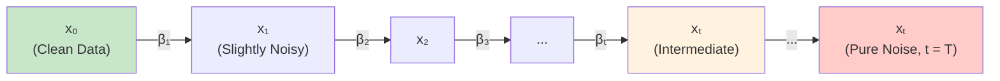
```mermaid
graph LR
    A["x₀<br/>(Clean Data)"] -->|"β₁"| B["x₁<br/>(Slightly Noisy)"]
    B -->|"β₂"| C["x₂"]
    C -->|"β₃"| D["..."]
    D -->|"βₜ"| E["xₜ<br/>(Intermediate)"]
    E -->|"..."| F["xₜ<br/>(Pure Noise, t = T)"]

    style A fill:#c8e6c9
    style F fill:#ffccc9
    style E fill:#fff3e0
```

**Intuition**: As $t \to T$, the distribution $q(x_T | x_0)$ approaches an isotropic Gaussian $\mathcal{N}(0, \mathbf{I})$, ensuring the endpoint is tractable pure noise. The forward process is designed so that $\bar{\alpha}_T \approx 0$.

The **posterior** conditioned on the original data is also Gaussian with tractable parameters:

$$
q(x_{t-1} | x_t, x_0) = \mathcal{N}(x_{t-1}; \tilde{\mu}_t(x_t, x_0), \tilde{\beta}_t \mathbf{I})
$$

where:

$$
\tilde{\mu}_t(x_t, x_0) = \frac{\sqrt{\bar{\alpha}_{t-1}} \beta_t}{1 - \bar{\alpha}_t} x_0 + \frac{\sqrt{\alpha_t} (1 - \bar{\alpha}_{t-1})}{1 - \bar{\alpha}_t} x_t
$$

$$
\tilde{\beta}_t = \frac{1 - \bar{\alpha}_{t-1}}{1 - \bar{\alpha}_t} \cdot \beta_t
$$

### The Reverse Diffusion Process

The reverse process learns to invert the forward diffusion, starting from noise $x_T \sim \mathcal{N}(0, \mathbf{I})$ and progressively denoising to data $x_0$:

$$
p_\theta(x_{t-1} | x_t) = \mathcal{N}(x_{t-1}; \mu_\theta(x_t, t), \Sigma_\theta(x_t, t))
$$

The complete generative process:

$$
p_\theta(x_{0:T}) = p(x_T) \prod_{t=1}^T p_\theta(x_{t-1} | x_t)
$$

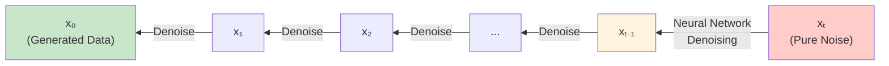
```mermaid
graph RL
    F["xₜ<br/>(Pure Noise)"] -->|"Neural Network<br/>Denoising"| E["xₜ₋₁"]
    E -->|"Denoise"| D["..."]
    D -->|"Denoise"| C["x₂"]
    C -->|"Denoise"| B["x₁"]
    B -->|"Denoise"| A["x₀<br/>(Generated Data)"]

    style F fill:#ffccc9
    style A fill:#c8e6c9
    style E fill:#fff3e0
```

**Three Equivalent Parameterizations**:

**Noise Prediction** (most common): The network predicts the noise $\epsilon$ that was added:

$$
\hat{\epsilon} = \epsilon_\theta(x_t, t)
$$

$$
\mu_\theta(x_t, t) = \frac{1}{\sqrt{\alpha_t}} \left( x_t - \frac{\beta_t}{\sqrt{1-\bar{\alpha}_t}} \epsilon_\theta(x_t, t) \right)
$$

**Data Prediction**: The network directly predicts the clean image:

$$
\hat{x}_0 = f_\theta(x_t, t)
$$

**Score Prediction**: The network predicts the gradient of the log probability:

$$
s_\theta(x_t, t) \approx \nabla_{x_t} \log q(x_t)
$$

These three quantities are *deterministic* affine functions of each other given $x_t$, $\bar{\alpha}_t$. From the forward reparameterisation $x_t = \sqrt{\bar{\alpha}_t}\, x_0 + \sqrt{1-\bar{\alpha}_t}\,\epsilon$ and the **score–noise identity**

$$
\nabla_{x_t} \log q(x_t) \;=\; -\,\frac{\epsilon}{\sqrt{1-\bar{\alpha}_t}} \;=\; \frac{\sqrt{\bar{\alpha}_t}\, x_0 - x_t}{1-\bar{\alpha}_t}.
$$

**Tweedie's formula** ([Efron, 2011](https://www.jstor.org/stable/41416450)) further connects the score to the *posterior mean*:

$$
\mathbb{E}[x_0 \mid x_t] \;=\; \frac{1}{\sqrt{\bar{\alpha}_t}}\bigl(x_t + (1-\bar{\alpha}_t)\,\nabla_{x_t}\log q(x_t)\bigr),
$$

so a network trained to predict any one of $\{\epsilon, x_0, \text{score}\}$ implicitly produces the other two.

!!! note "Mathematical Equivalence"
    Predicting noise is equivalent to predicting the score function (and to predicting the clean image), unifying DDPM-style diffusion models with score-based generative modeling. This is also what makes parameterisation choice (ε / x₀ / v) primarily a *numerical-conditioning* decision, not a modelling one.

### The ELBO Derivation

Diffusion models are **Markovian hierarchical VAEs**. The evidence lower bound decomposes as:

$$
\log p(x_0) \geq \mathbb{E}_q[\log p_\theta(x_0|x_1)] - D_{KL}(q(x_T|x_0) \| p(x_T)) - \sum_{t=2}^T \mathbb{E}_{q(x_0)} D_{KL}(q(x_{t-1}|x_t,x_0) \| p_\theta(x_{t-1}|x_t))
$$

For Gaussian posteriors, the KL divergence terms simplify. The key loss term becomes:

$$
L_t = \mathbb{E}_{q(x_0,x_t)}\left[\frac{1}{2\sigma_t^2} \|\tilde{\mu}_t(x_t,x_0) - \mu_\theta(x_t,t)\|^2\right]
$$

Substituting the reparameterization yields:

$$
L_t \propto \mathbb{E}_{x_0,\epsilon}\left[\|\epsilon - \epsilon_\theta(\sqrt{\bar{\alpha}_t} \, x_0 + \sqrt{1-\bar{\alpha}_t} \, \epsilon, t)\|^2\right]
$$

**Ho et al.'s key empirical finding**: The **simplified objective** works better:

$$
L_{\text{simple}} = \mathbb{E}_{t \sim U[1,T], \, x_0, \, \epsilon \sim \mathcal{N}(0,\mathbf{I})}\left[\|\epsilon - \epsilon_\theta(x_t, t)\|^2\right]
$$

This reduces training to simple **mean-squared error** between predicted and actual noise!

### Variance Schedules

The noise schedule $\{\beta_1, \ldots, \beta_T\}$ fundamentally affects training and sampling quality:

**Linear Schedule** ([Ho et al., 2020](https://arxiv.org/abs/2006.11239)):

$$
\beta_t = \beta_1 + (\beta_T - \beta_1) \cdot \frac{t-1}{T-1}
$$

Typically $\beta_1 = 0.0001$, $\beta_T = 0.02$. Simple but can add too much noise early.

**Cosine Schedule** ([Nichol & Dhariwal, 2021 — IDDPM](https://arxiv.org/abs/2102.09672)):

$$
\bar{\alpha}_t = \frac{f(t)}{f(0)} \quad \text{where} \quad f(t) = \cos^2\left(\frac{t/T + s}{1+s} \cdot \frac{\pi}{2}\right)
$$

$$
\beta_t = 1 - \frac{\bar{\alpha}_t}{\bar{\alpha}_{t-1}}
$$

with $s = 0.008$. Provides **smoother transitions** and empirically superior performance.

!!! tip "Schedule Selection"
    The cosine schedule has become the de facto standard due to its superior empirical performance. It provides more balanced denoising across timesteps and avoids adding excessive noise in early steps.

### Score-Based Perspective

The **score function** $\nabla_x \log p(x)$ points toward regions of higher probability density. Score-based models ([Song & Ermon, 2019 — NCSN](https://arxiv.org/abs/1907.05600)) train a network $s_\theta(x, t)$ to approximate this gradient field through **denoising score matching** ([Vincent, 2011](https://www.iro.umontreal.ca/~vincentp/Publications/smdae_techreport.pdf)):

$$
\mathcal{L}_{\text{DSM}} = \mathbb{E}_{p(x)}\mathbb{E}_{p(\tilde{x}|x)}\left[\|s_\theta(\tilde{x}, t) - \nabla_{\tilde{x}} \log p(\tilde{x}|x)\|^2\right]
$$

Given the learned score, generation proceeds via **Langevin dynamics**:

$$
x_{i+1} = x_i + \delta \nabla_x \log p(x) + \sqrt{2\delta} \, z_i \quad \text{where } z_i \sim \mathcal{N}(0, \mathbf{I})
$$

The connection to diffusion: **the score equals the negative scaled noise**.

### Stochastic Differential Equations

The continuous-time formulation ([Song et al., 2021](https://arxiv.org/abs/2011.13456) — ICLR Outstanding Paper) generalizes discrete diffusion as an SDE:

$$
dx = f(x,t)dt + g(t)dw
$$

**Variance Preserving (VP) SDE** corresponds to DDPM:

$$
dx = -\frac{1}{2}\beta(t)x \, dt + \sqrt{\beta(t)} \, dw
$$

The **reverse-time SDE** enables generation:

$$
dx = \left[f(x,t) - g(t)^2\nabla_x \log p_t(x)\right] dt + g(t) d\bar{w}
$$

There exists an equivalent **probability flow ODE**:

$$
dx = \left[f(x,t) - \frac{1}{2}g(t)^2\nabla_x \log p_t(x)\right] dt
$$

This ODE formulation enables exact likelihood computation and deterministic sampling.

---

## Architecture Design

The diffusion *backbone* is the network $\epsilon_\theta(x_t, t, c)$ that predicts noise / score / data given a noisy input, a timestep, and (optionally) a conditioning signal. The 2020–2022 generation of diffusion models was dominated by **U-Nets**; from 2023 onward, **transformer backbones** (DiT, MMDiT, and their many descendants) have largely taken over for new large-scale models, with state-space and linear-attention alternatives now in active competition. This section walks through both, in roughly chronological order.

### U-Net Backbone with Skip Connections

The **U-Net architecture** ([Ronneberger et al., 2015](https://arxiv.org/abs/1505.04597)) dominates *classical* diffusion models through its encoder-decoder structure with skip connections; the diffusion-specific adaptation is due to [Ho et al. (2020)](https://arxiv.org/abs/2006.11239) (DDPM) and refined in [Nichol & Dhariwal (2021)](https://arxiv.org/abs/2102.09672) (IDDPM) and [Dhariwal & Nichol (2021) — ADM](https://arxiv.org/abs/2105.05233):

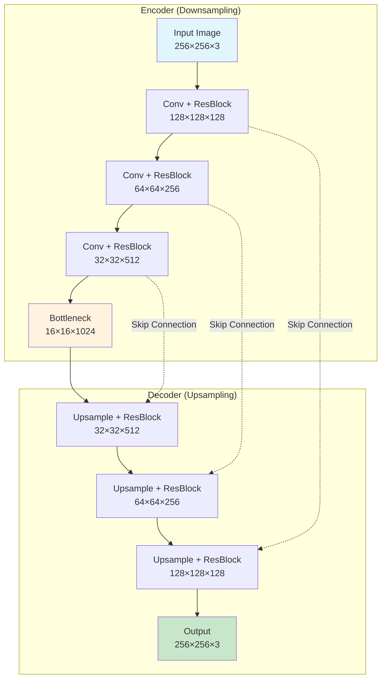
```mermaid
graph TB
    subgraph "Encoder (Downsampling)"
        A["Input Image<br/>256×256×3"] --> B["Conv + ResBlock<br/>128×128×128"]
        B --> C["Conv + ResBlock<br/>64×64×256"]
        C --> D["Conv + ResBlock<br/>32×32×512"]
        D --> E["Bottleneck<br/>16×16×1024"]
    end

    subgraph "Decoder (Upsampling)"
        E --> F["Upsample + ResBlock<br/>32×32×512"]
        F --> G["Upsample + ResBlock<br/>64×64×256"]
        G --> H["Upsample + ResBlock<br/>128×128×128"]
        H --> I["Output<br/>256×256×3"]
    end

    D -.->|"Skip Connection"| F
    C -.->|"Skip Connection"| G
    B -.->|"Skip Connection"| H

    style E fill:#fff3e0
    style A fill:#e1f5ff
    style I fill:#c8e6c9
```

**Key Components**:

- **Contracting path**: Progressive downsampling (256→128→64→32→16) while increasing channels (the diagram above; production U-Nets often go one or two levels deeper).
- **Expanding path**: Upsampling reconstructs output at original resolution
- **Skip connections**: Critical for propagating spatial details lost in bottleneck
- **ResNet blocks**: $\text{output} = \text{input} + F(\text{input}, \text{time\_emb})$
- **Group normalization**: Dividing channels into groups (~32) for stability

**Why U-Net for Diffusion?**

1. Input and output have identical dimensions (essential for iterative refinement)
2. Skip connections preserve fine details through bottleneck
3. Multi-scale processing captures both coarse structure and fine texture
4. No information bottleneck—maintains full spatial information

**Production users:** SD 1.x, SD 2.x, Imagen, DALL·E 2's decoder, ControlNet, and most pre-2023 open checkpoints. As of 2024, the SDXL U-Net (2.6 B params) is roughly the upper end of practical U-Net scaling; new large-scale models have moved to transformer backbones.

### Beyond U-Net: Modern Architecture Alternatives (2023–2026)

By 2023, three pressures pushed the field beyond pure U-Nets: **scaling** (U-Nets plateau past a few billion parameters), **multimodality** (text + image streams want first-class joint attention), and **efficiency at high resolution** (quadratic self-attention dominates the budget at 1024² and above). The result is a small zoo of transformer-, state-space-, and hybrid-attention backbones. Three influential surveys / blogposts collect the lineage: [*From U-Nets to DiTs* (ICLR Blogposts 2026)](https://iclr-blogposts.github.io/2026/blog/2026/diffusion-architecture-evolution/), [*Efficient Diffusion Models: A Comprehensive Survey* (2024)](https://arxiv.org/abs/2410.11795) and [*Efficient Diffusion Models: A Survey* (2025)](https://arxiv.org/abs/2502.06805).

#### Diffusion Transformer (DiT)

**DiT** ([Peebles & Xie, 2023 — ICCV](https://arxiv.org/abs/2212.09748)) replaces the U-Net entirely with a Vision-Transformer-style stack:

- **Patchification**: the noisy latent $x_t$ is cut into patches (typically 2×2) and linearly projected to tokens.
- **Standard transformer blocks** (LayerNorm → MHSA → MLP) operate on the token sequence.
- **adaLN-Zero conditioning** (see below) injects the timestep + class-label embedding.
- **Final unpatchify** projects the token sequence back to the latent grid.

Headline finding: **scaling DiT compute (Gflops) reliably reduces FID**, with no sign of a saturation point through DiT-XL/2 (675 M params). DiT-XL/2 reaches **FID 2.27 on ImageNet 256²** without classifier-free guidance, the first transformer to clearly beat its U-Net contemporaries on this benchmark.

**Influence**: DiT is the architectural ancestor of Sora, Stable Diffusion 3, and FLUX.1.

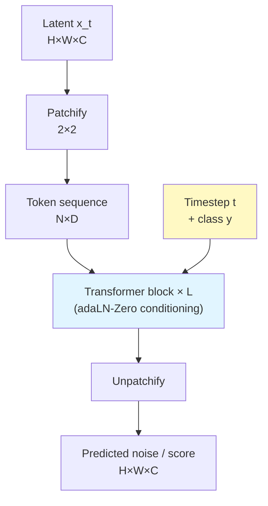
```mermaid
graph TD
    A["Latent x_t<br/>H×W×C"] --> B["Patchify<br/>2×2"]
    B --> C["Token sequence<br/>N×D"]
    C --> D["Transformer block × L<br/>(adaLN-Zero conditioning)"]
    T["Timestep t<br/>+ class y"] --> D
    D --> E["Unpatchify"]
    E --> F["Predicted noise / score<br/>H×W×C"]

    style D fill:#e1f5ff
    style T fill:#fff9c4
```

#### adaLN, adaLN-Zero, adaLN-single, adaLN-LoRA — Conditioning Variants

How a transformer-style diffusion backbone is *conditioned* on the timestep (and optionally class label / text vector / pooled prompt) is itself a design axis with surprising consequences:

- **adaLN** ([Perez et al., 2018](https://arxiv.org/abs/1709.07871) → DiT): replace LayerNorm's affine parameters with $(\gamma, \beta)$ that are *learned linear functions of the conditioning embedding*. Each transformer block has its own $(\gamma, \beta)$ — much more expressive than feeding the timestep as an extra token.
- **adaLN-Zero** ([Peebles & Xie, 2023](https://arxiv.org/abs/2212.09748)): zero-initialise the affine projection so that each DiT block starts as the *identity function*; the network gradually learns the modulation. Empirically halves FID at matched compute versus vanilla adaLN, and is now the default for class-conditional DiTs.
- **adaLN-single** ([Chen et al., 2023 — PixArt-α](https://arxiv.org/abs/2310.00426)): share one set of adaLN parameters across all blocks instead of per-block, with a small per-block residual. Cuts ~20 % of parameters and still trains stably.
- **adaLN-LoRA** ([Lu et al., 2024 — FiTv2](https://arxiv.org/abs/2410.13925)): factorise the per-block adaLN projection through a low-rank decomposition. Lighter than adaLN, more expressive than adaLN-single.

[*Unveiling the Secret of AdaLN-Zero* (Wei et al., 2024)](https://openreview.net/forum?id=E4roJSM9RM) gives a careful theoretical analysis of why the zero-init form converges so much faster.

#### U-ViT — Long Skip Connections in a Transformer

**U-ViT** ([Bao et al., 2023 — CVPR](https://arxiv.org/abs/2209.12152)) is the bridge between U-Nets and DiTs: it processes patch tokens with a standard transformer, but adds **long skip connections** from early to late blocks (the transformer analogue of U-Net's symmetric encoder–decoder skips). The paper shows the long skips are *essential* — without them quality collapses — clarifying that what U-Nets bring to diffusion is not the convolution but the *symmetric multi-scale skip structure*. FID 2.29 on ImageNet 256², competitive with DiT.

#### PixArt-α, PixArt-Σ — Efficient Text-Conditional DiTs

**PixArt-α** ([Chen et al., 2023](https://arxiv.org/abs/2310.00426)) is the first DiT to demonstrate that a *small, training-efficient* DiT can match Stable Diffusion at text-to-image:

- **Cross-attention** to T5 text features after each self-attention block.
- **adaLN-single** for cheap timestep conditioning.
- Three-stage training curriculum (pixel dependency → text alignment → high resolution).
- Trained for ~675 A100-days — about 12 % of SD 1.5's compute budget — and matches SDXL on aesthetic FID.

**PixArt-Σ** ([Chen et al., 2024](https://arxiv.org/abs/2403.04692)) scales to **direct 4K-resolution generation** via a *weak-to-strong* training schedule and a token-compression block that linearises attention over high-resolution patches.

#### MMDiT (SD3) — Multimodal Dual-Stream Transformer

**MMDiT** ([Esser et al., 2024 — Stable Diffusion 3](https://arxiv.org/abs/2403.03206)) is the architectural innovation behind SD3 / SD3.5 and the closest cousin of FLUX.1:

- **Two parallel token streams** — one for text, one for image — each with its own QKV/MLP weights.
- **Joint self-attention** across the concatenated streams: every text token can attend to every image token and vice versa, in *both* directions.
- **adaLN-Zero** conditioning on a pooled text/timestep vector.

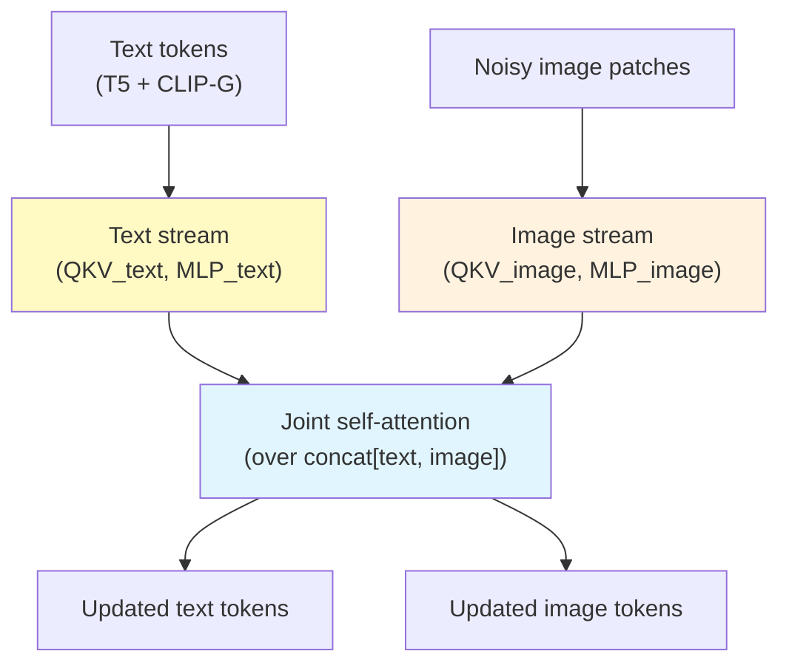
```mermaid
graph TB
    T["Text tokens<br/>(T5 + CLIP-G)"] --> TS["Text stream<br/>(QKV_text, MLP_text)"]
    I["Noisy image patches"] --> IS["Image stream<br/>(QKV_image, MLP_image)"]
    TS --> J["Joint self-attention<br/>(over concat[text, image])"]
    IS --> J
    J --> TS2["Updated text tokens"]
    J --> IS2["Updated image tokens"]

    style J fill:#e1f5ff
    style TS fill:#fff9c4
    style IS fill:#fff3e0
```

The dual-stream design dramatically outperforms cross-attention on prompt following and text rendering (the classic "spell-the-word-correctly" test). **FLUX.1** ([Black Forest Labs, 2024](https://github.com/black-forest-labs/flux)) extends this with a hybrid of "double-stream" MMDiT blocks early and cheaper "single-stream" parallel-attention blocks late, plus rotary positional embeddings throughout.

#### Hourglass Diffusion Transformer (HDiT)

**HDiT** ([Crowson et al., 2024 — ICML](https://arxiv.org/abs/2401.11605)) reintroduces the U-Net's **multi-level hierarchy** inside a pure-transformer architecture:

- Hierarchical encoder–decoder with *symmetric* token-resolution stages (2× downsample / upsample between stages, like U-Net).
- **Neighborhood Attention** at high resolutions (linear in pixel count) and standard global self-attention at the bottleneck.
- Scales **linearly** with pixel count rather than quadratically.

This makes HDiT one of the few transformer backbones that trains efficiently in **pixel space at 1024²** — without a VAE codec, multiscale loss, or self-conditioning. Sets a new SOTA for diffusion on **FFHQ-1024²** while remaining competitive on ImageNet-256².

#### SiT — Scalable Interpolant Transformers

**SiT** ([Ma et al., 2024 — ECCV](https://arxiv.org/abs/2401.08740)) keeps DiT's exact architecture but replaces the discrete-time DDPM training objective with the continuous **stochastic-interpolants** framework — a generalisation of flow matching that decouples interpolant choice, prediction target, and sampler. The paper systematically ablates each axis and shows SiT-XL/2 reaches **FID 2.06** on ImageNet 256² and **2.62** on 512², both improvements over DiT-XL/2 at the same parameter count and FLOPs. SiT is the backbone REPA (see below) is built on top of.

#### FiT / FiTv2 — Flexible-Resolution DiTs

**FiT** ([Lu et al., 2024 — ICML Spotlight](https://arxiv.org/abs/2402.12376)) and **FiTv2** ([Lu et al., 2024](https://arxiv.org/abs/2410.13925)) treat images as *variable-length token sequences*, not static-resolution grids:

- **2-D RoPE** ([Su et al., 2024](https://arxiv.org/abs/2104.09864)) instead of learned position embeddings → genuine generalisation to unseen resolutions.
- **SwiGLU** MLPs and **Q-K vector normalisation** for training stability at scale.
- **Masked MHSA** to handle variable-length padding cleanly.
- FiTv2 adds adaLN-LoRA, a rectified-flow scheduler, and a Logit-Normal sampler, doubling FiT's convergence speed.

The practical payoff is that one FiT checkpoint can generate at arbitrary aspect ratios (portrait, landscape, square) without the cropping artefacts of fixed-grid DiTs.

#### Hunyuan-DiT — Multi-Resolution Bilingual Text-to-Image

**Hunyuan-DiT** ([Tencent, 2024](https://arxiv.org/abs/2405.08748)) is a 1.5 B-parameter DiT that interleaves PixArt-α-style **single-stream** blocks (cross-attention to text) with SD3-style **double-stream** blocks (joint attention). It is engineered for *bilingual* (English + Chinese) prompts, with a custom text encoder pipeline and rotary positional encoding. A blueprint that several closed Chinese labs have since extended.

#### Lumina-Next, DiT-Air — Parameter-Efficient Multi-Modal DiTs

- **Lumina-Next** ([Alpha-VLLM, 2024](https://arxiv.org/abs/2406.18583)) — a "Next-DiT" backbone that unifies image, video, audio, and 3D generation behind a single MMDiT-style transformer with rectified-flow training; deployed in [Lumina-Image 2.0](https://arxiv.org/abs/2503.21758) (March 2025).
- **DiT-Air** ([Chen et al., 2025](https://arxiv.org/abs/2503.10618)) — applies layer-wise parameter sharing to MMDiT, achieving a **66 % size reduction** at near-equal quality. Currently the most parameter-efficient member of the MMDiT family.
- **E-MMDiT** ([2025](https://arxiv.org/abs/2510.27135)) — pushes MMDiT to a 304 M-parameter lightweight variant via a highly compressive tokenizer plus *Alternating Subregion Attention*.

#### Mixture-of-Experts Diffusion: DiT-MoE, EC-DiT, Switch-DiT

Sparse Mixture-of-Experts has finally crossed over from LLMs into diffusion:

- **DiT-MoE** ([Fei et al., 2024](https://arxiv.org/abs/2407.11633)) — scales to **16.5 B parameters** with shared-expert routing and an expert-balance loss; **FID 1.80 on ImageNet 512²** while activating only 3.1 B parameters per token. The first sparse-diffusion model to break under FID 2 at this scale.
- **Switch-DiT** ([Park et al., 2024 — ECCV](https://byeongjun-park.github.io/Switch-DiT/)) — synergises *denoising-task experts* with a sparse routing layer; different timesteps select different experts.
- **EC-DiT** ([Apple, 2024](https://machinelearning.apple.com/research/ec-dit)) — adaptive *expert-choice* routing where experts pick which tokens to process, balancing expert load implicitly.

A 2025 study ([*Expert Specialization Analysis*, 2024](https://arxiv.org/abs/2407.11633)) finds that diffusion experts naturally specialise by **spatial position and timestep** — not by class label — providing a clean argument for why MoE is a particularly good fit for the iterative-denoising structure of diffusion.

#### State-Space and Linear-Attention Backbones (2024–2026)

Quadratic self-attention is the bottleneck at high resolution. Three lines of work replace it:

- **Diffusion Mamba (DiM)** ([Teng et al., 2024](https://arxiv.org/abs/2405.14224)) — Mamba selective state-space layers in place of attention, $O(N)$ in token count; competitive at 1024² with far less compute than DiT.
- **DiMSUM** ([Phung et al., 2024 — NeurIPS](https://openreview.net/forum?id=KqbLzSIXkm)) — adds wavelet-domain processing to Diffusion Mamba, capturing local structure and long-range frequency relations that pure SSMs miss.
- **U-Shape Mamba (USM)** ([Ergasti et al., 2025 — CVPRW](https://arxiv.org/html/2504.13499v2)) — wraps Mamba blocks in a U-shaped hierarchy, halving sequence length per encoder stage.
- **DiG** ([Zhu et al., 2025 — CVPR](https://arxiv.org/abs/2405.18428)) — Diffusion Gated Linear Attention; **1.8× faster than Flash-DiT-XL/2 at 2048²** while matching ImageNet-512² FID.
- **EDiT / MM-EDiT** ([Suresh et al., 2025](https://arxiv.org/abs/2503.16726)) — *linear compressed attention* for image-to-image dependencies, plus standard softmax attention only for image-text interactions; linear in resolution at production quality.

Hybrid backbones (linear + softmax attention mixed in fixed ratios, e.g. 3:1) have been the dominant 2026 LLM trend and are now appearing in diffusion as well — see [Ant Group's ICLR 2026 expo talk](https://iclr.cc/virtual/2026/expo-talk-panel/10020572) on trillion-scale hybrid attention.

#### Dynamic / Sparse / Cached DiTs

A complementary 2024–2026 thread leaves the architecture roughly fixed but skips computation adaptively:

- **DyDiT / DyDiT++** ([Zhao et al., 2024–2025](https://arxiv.org/abs/2504.06803)) — adjusts compute along *both* timestep and spatial dimensions; cuts DiT-XL FLOPs by **51 %** at competitive FID.
- **Learning-to-Cache** ([Ma et al., 2024 — NeurIPS](https://proceedings.neurips.cc/paper_files/paper/2024/file/f0b1515be276f6ba82b4f2b25e50bef0-Paper-Conference.pdf)) — caches static layer activations across denoising steps; ~40 % faster inference for free.
- **DiffSparse** ([ICLR 2026](https://arxiv.org/abs/2604.03674)) — differentiable layer-wise token sparsity with a learnable router and DP solver; further accelerates DiTs without retraining the base model.
- **TeaCache** — feature caching baked into multiple production stacks (Lumina-Image 2.0, FLUX) for ~2× inference speedup.

#### Autoregressive Challengers (2024) — VAR and MAR

A small-but-significant 2024 thread uses *autoregression* over discrete or continuous visual tokens to challenge diffusion on its own benchmarks:

- **VAR — Visual Autoregressive Modeling** ([Tian et al., 2024 — NeurIPS Best Paper](https://arxiv.org/abs/2404.02905)) — *next-scale prediction* over multi-resolution VQ codes. Beats DiT on ImageNet-256² (FID 1.73 vs DiT-XL/2's 2.27) while being ~20× faster at inference.
- **MAR — Masked Autoregressive Modeling** ([Li et al., 2024](https://arxiv.org/abs/2406.11838)) — autoregression *without vector quantisation*; uses a small per-token diffusion head over continuous values. Matches diffusion quality with autoregressive sampling.
- **VAR-Image / VAR-Video** follow-ups extend next-scale prediction to higher resolutions and video.

These are *not* diffusion models, but they pressure-test the assumption that multi-step denoising is the only path to high-quality image generation; the unified picture in 2026 is that DiT, MAR, and VAR are *closer to each other* than to U-Net DDPM.

#### Choosing a Backbone: a 2026 Cheat-Sheet

| Goal | Recommended backbone | Notes |
| --- | --- | --- |
| Small-scale class-conditional ImageNet | **DiT / SiT** + adaLN-Zero | Cleanest scaling laws; adopt SiT objective for an easy quality bump. |
| Large-scale text-to-image, prompt-following critical | **MMDiT** (SD3-style) or **FLUX.1**-style hybrid | Dual-stream attention is decisive for text rendering. |
| Pixel-space, 1024²+ | **HDiT** | Linear scaling; no VAE needed. |
| Variable aspect ratios | **FiT / FiTv2** | 2-D RoPE generalises cleanly; no cropping. |
| Maximum scale (10B+) | **DiT-MoE** / **EC-DiT** | Sparsity is the only way past the dense 8B wall in 2026. |
| Long-sequence / high-res efficiency | **DiG**, **DiM / DiMSUM**, **EDiT** | Linear-attention or SSM backbones beat softmax above ~2048 tokens. |
| Production fast inference | DiT/MMDiT + **Learning-to-Cache** + **DyDiT** + distillation | Architecture is half the story; the other half is in [Recent Advances → Few-Step Distillation](#few-step-distillation-from-50-steps-to-1). |
| Bilingual (zh/en) text-to-image | **Hunyuan-DiT** | Battle-tested for Chinese text rendering. |
| Unified multimodal (image + video + audio) | **Lumina-Next / Lumina-Image 2.0** | Single backbone across modalities; rectified-flow training. |

The unifying thread: the *transformer block* (with adaLN-Zero conditioning, RoPE positions, and sometimes long skip connections) has replaced the *convolutional U-Net* as the default unit of computation, while orthogonal axes — sparsity, linear attention, multi-resolution hierarchy, dual-stream multimodal — combine freely on top.

### Time / Noise-Level Conditioning

Denoising behaviour is **strongly noise-level dependent**: at high noise the network's job is to recover global structure, at low noise it sharpens fine texture. The same set of weights has to switch between these regimes smoothly, so the timestep $t$ (or equivalently the noise scale $\sigma$ or log-SNR $\lambda = \log(\bar\alpha_t / (1-\bar\alpha_t))$) must be fed to *every* denoising block, not just the input.

There are **two distinct sub-problems** here, often conflated in implementations:

1. **Encoding** — turn the scalar $t$ (or $\sigma$, $\lambda$) into a vector $\tau \in \mathbb{R}^{d_\tau}$ that the network can consume.
2. **Injection** — make $\tau$ influence every layer's computation.

This subsection walks through both.

#### 1. Encoding the Scalar

##### Sinusoidal Positional Embedding (DDPM Default)

The classical choice, inherited from Transformer position encodings ([Vaswani et al., 2017](https://arxiv.org/abs/1706.03762)):

$$
\tau_{2i}(t) = \sin\!\left(\frac{t}{10000^{2i/d}}\right), \qquad
\tau_{2i+1}(t) = \cos\!\left(\frac{t}{10000^{2i/d}}\right),
$$

for $i = 0, \ldots, d/2 - 1$ and embedding dimension $d$ (typically 128–256). The fixed log-spaced frequencies make $\tau(t)$ uniquely identify $t$ over a long range and provide multi-scale information. Used by DDPM, IDDPM, ADM, all SD 1.x / 2.x checkpoints, and most U-Net diffusion code in the wild.

##### Random Fourier Features

[Tancik et al. (2020 — NeurIPS)](https://arxiv.org/abs/2006.10739) showed that passing scalar inputs through a *random* Fourier feature map dramatically improves a network's ability to fit high-frequency functions:

$$
\tau(t) = \big[\sin(2\pi B t),\ \cos(2\pi B t)\big], \qquad B \sim \mathcal{N}\!\left(0,\, \sigma_B^2\, I_{d/2}\right) \;\text{(fixed at init).}
$$

The bandwidth $\sigma_B$ controls the spectrum of frequencies the network sees — higher $\sigma_B$ exposes higher-frequency variation in $t$. **NCSN++** ([Song et al., 2021](https://arxiv.org/abs/2011.13456)), the **EDM** family ([Karras et al., 2022](https://arxiv.org/abs/2206.00364)), and most score-based-SDE codebases use random Fourier features in place of fixed sinusoids; the empirical gain is most visible in continuous-time models with very wide $\sigma$ ranges where the fixed-base sinusoidal frequencies under-resolve the low-noise tail.

##### Log-SNR / Log-σ Encoding

A second axis is *what* scalar to encode. Three common choices:

- **Discrete index $t \in \{1, \ldots, T\}$** — DDPM's default; simple but tied to a specific schedule.
- **Continuous time $t \in [0, 1]$** — used by score-based SDEs and rectified flow; portable across schedules.
- **Log-SNR $\lambda = \log(\bar\alpha_t / (1-\bar\alpha_t))$** ([Kingma et al., 2021 — VDM](https://arxiv.org/abs/2107.00630); [Salimans & Ho, 2022](https://arxiv.org/abs/2202.00512)) — the "natural coordinate" of diffusion. Log-SNR varies linearly with the network's effective task difficulty, so feeding it directly (rather than $t$) is **schedule-invariant** and numerically stable across very wide noise ranges.
- **EDM σ-conditioning** ([Karras et al., 2022](https://arxiv.org/abs/2206.00364)) — feed $c_{\text{noise}}(\sigma) = \tfrac{1}{4}\log \sigma$ through random Fourier features. The $\tfrac14 \log$ rescaling keeps the embedding's dynamic range stable across the EDM sampler's geometric $\sigma$ schedule.

In practice, **rectified-flow / flow-matching** models (SD3, FLUX.1, modern video DiTs) feed the continuous time $t \in [0, 1]$ through standard sinusoidal encoding; **EDM-line** Karras models feed $\log\sigma$ through random Fourier features; **U-Net DDPM** models feed the discrete step $t$ through standard sinusoidal encoding. All three work — what matters is that the chosen scalar varies smoothly with the *task difficulty* the network actually faces.

##### Learned-Table (Embedding-Lookup) Encoding

If you commit to a fixed discrete schedule of $T$ timesteps, you can simply learn a $T \times d$ embedding table:

$$
\tau(t) = \mathbf{E}[t, :], \qquad \mathbf{E} \in \mathbb{R}^{T \times d}.
$$

Used in some early DDPM variants and conditional models. Cheap and expressive, but **cannot generalise to unseen timesteps** (e.g. you cannot DDIM-skip-sample with a learned-table model trained at $T=1000$ unless the chosen sub-schedule was seen during training). Mostly displaced by sinusoidal / Fourier encodings, which interpolate naturally.

##### Other Encodings (Briefly)

- **Multi-resolution hash encodings** ([Müller et al., 2022 — Instant-NGP](https://arxiv.org/abs/2201.05989)) are popular in NeRFs but have not been broadly adopted for time conditioning in diffusion (the scalar input is too low-dimensional to benefit).
- **Hybrid sinusoidal + learned-bias** — sinusoidal frequencies plus a small learned offset table per timestep; sometimes seen in distilled / few-step student models.

#### 2. Injecting the Embedding

The encoded vector $\tau(t)$ is typically fed through a 2-layer MLP and then *injected* into every transformer / U-Net block. The five common patterns:

##### FiLM (Feature-wise Linear Modulation) — U-Net Default

[Perez et al. (2018)](https://arxiv.org/abs/1709.07871):

$$
\text{output}(x, \tau) = \gamma(\tau) \odot x + \beta(\tau),
$$

with per-channel scale $\gamma$ and shift $\beta$ produced from $\tau$ via a small MLP. Applied immediately after the GroupNorm in each ResBlock. The dominant choice in U-Net diffusion (DDPM, ADM, SD 1.x / 2.x, Imagen). Compute-cheap and very effective.

##### adaLN-Zero — Transformer Default

For DiT-style backbones, the equivalent is **Adaptive Layer Normalisation**, which replaces every LayerNorm's affine parameters with a $\tau$-dependent $(\gamma, \beta)$ produced by a per-block MLP. **adaLN-Zero** ([Peebles & Xie, 2023](https://arxiv.org/abs/2212.09748)) zero-initialises the MLP so each block starts as the identity function and gradually learns its modulation — empirically halves FID at matched compute versus naive LayerNorm. Variants:

- **adaLN-single** ([Chen et al., 2023 — PixArt-α](https://arxiv.org/abs/2310.00426)) — share one $(\gamma, \beta)$ projection across all blocks; ~20 % parameter savings.
- **adaLN-LoRA** ([Lu et al., 2024 — FiTv2](https://arxiv.org/abs/2410.13925)) — factorise the per-block projection through a low-rank decomposition.

See [Beyond U-Net → adaLN, adaLN-Zero, adaLN-single, adaLN-LoRA](#adaln-adaln-zero-adaln-single-adaln-lora-conditioning-variants) for the full discussion.

##### Concatenation as Extra Channels

The simplest scheme: tile $\tau$ spatially and concatenate it to the input image as extra channels. Used by the *original* DDPM paper and a few early variants. Cheap, but only conditions the *first* layer, leaving deeper layers to propagate timestep information through learned features — empirically much weaker than FiLM / adaLN.

##### Time Token Prepending (DiT Variants)

Some early DiT variants tokenise $\tau$ as an extra "[time]" sequence element and let standard self-attention spread the conditioning across all image tokens. Less popular today than adaLN-Zero, which conditions *every* layer with no extra tokens.

##### Cross-Attention to a Conditioning Sequence

For models where time and other conditions (text, class, pooled CLIP) are tightly coupled, the entire conditioning vector — including $\tau$ — is fed as the key/value sequence in a cross-attention layer. The MMDiT recipe in SD3 and FLUX.1 *adds* the timestep embedding to the pooled-text embedding before adaLN, then uses joint self-attention across image and text tokens; this combines the strengths of FiLM-style modulation and full attention-based text-conditioning.

#### 3. Practical Considerations

**Joint timestep + class / text conditioning.** When training a class-conditional or text-conditional diffusion model, the conditioning vector is typically built as $c = \tau(t) + \text{embed}(y)$ (for class labels) or $c = \tau(t) + \text{pool}(\text{CLIP}(y))$ (for text). The same FiLM / adaLN injection then carries both signals.

**Null embedding for classifier-free guidance.** [CFG](#guidance-techniques) requires the network to also handle the unconditional case during training. The standard implementation reserves a learned **null embedding** $\emptyset$ that replaces the class / text conditioning with probability ~10 %, while the timestep embedding is still passed through normally.

**EMA of the embedding MLP.** The MLP that produces $\tau$ is small (a few thousand parameters) and is typically EMA-averaged along with the rest of the network — no special handling needed.

#### 4. A Recent Surprise: Is Noise Conditioning Even Necessary?

A 2025 line of work pushes back on the orthodoxy that timestep conditioning is essential:

- [Sun et al. (2025 — ICML)](https://arxiv.org/abs/2502.13129) — *Is Noise Conditioning Necessary for Denoising Generative Models?* — empirically demonstrates that across a wide range of diffusion-style models, removing time conditioning entirely produces only a small quality gap; the *noisy input itself* implicitly encodes the noise level for the network to read off.
- Follow-ups show similar results for graph diffusion ([NeurIPS 2025](https://arxiv.org/abs/2505.22935)) and disjoint-manifold diffusion ([2026](https://arxiv.org/abs/2604.25289)).

The takeaway is *not* that timestep conditioning is useless — adding it still wins in most settings — but that the gap is much smaller than one might assume, and the *exact* encoding (sinusoidal vs Fourier vs log-σ) usually matters less than the *injection* (FiLM / adaLN-Zero) and the *what-scalar* (t vs σ vs log-SNR) decisions above.

#### 5. A 2026 Practical Cheat-Sheet

| Setting | Scalar | Encoding | Injection |
| --- | --- | --- | --- |
| U-Net DDPM (SD 1.x style) | discrete $t$ | sinusoidal | **FiLM** in ResBlocks |
| Continuous-time score-based SDE / NCSN++ | $t \in [0,1]$ or $\sigma$ | **random Fourier features** | FiLM |
| EDM-line Karras models | $\sigma$ via $c_{\text{noise}}(\sigma) = \tfrac14 \log\sigma$ | random Fourier | FiLM with EDM preconditioning |
| Variational Diffusion Models | **log-SNR** $\lambda$ | sinusoidal of $\lambda$ | FiLM |
| DiT class-conditional | discrete $t$ | sinusoidal + 2-layer MLP | **adaLN-Zero** |
| PixArt-α / -Σ | discrete $t$ | sinusoidal | **adaLN-single** |
| MMDiT (SD3 / FLUX.1) | continuous $t$ | sinusoidal added to pooled text | **adaLN-Zero** + joint attention |
| FiTv2 | continuous $t$ | sinusoidal | **adaLN-LoRA** |
| Distilled few-step student | inherited from teacher | inherited | inherited; sometimes one fixed timestep + null embedding |

The unifying picture: pick a scalar that varies smoothly with task difficulty (log-SNR or σ if your range is wide, $t$ otherwise), encode it with sinusoidal or random-Fourier features into ~256 dimensions, and inject through **FiLM** for U-Nets / **adaLN-Zero** for transformers. That recipe accounts for ≥ 95 % of production diffusion models in 2026.

### Attention Mechanisms

In a modern DiT, attention is the *dominant* compute cost — typically 60–80 % of the FLOPs, and a much larger fraction of the wall-clock time at high resolution. The attention design space has therefore exploded: there are now ten or so distinct attention *patterns* coexisting in production diffusion stacks, each making a different trade-off between expressivity, complexity, and hardware fit.

#### Self-Attention

Every spatial token attends to every other spatial token via standard scaled-dot-product attention ([Vaswani et al., 2017](https://arxiv.org/abs/1706.03762)):

$$
\text{Attention}(Q, K, V) \;=\; \text{softmax}\!\left(\frac{QK^\top}{\sqrt{d_k}}\right)V.
$$

In **multi-head** form, the projection is split into $h$ heads of dimension $d_k / h$, attended in parallel, then concatenated and re-projected. Different heads learn to focus on different spatial relationships (long-range structure, local texture, object boundaries).

Complexity is $O(N^2 d)$ in the number of tokens $N$. For a 256² latent at f8 patch-2 (i.e. 32² latent → 16² patches), $N = 256$ and self-attention is cheap; for a 1024² pixel-space input, $N \sim 65{,}536$ and full self-attention is intractable. The classical U-Net heuristic: only apply self-attention at the **bottleneck and lower-resolution stages** (typically 32², 16², 8²), rely on convolutions at higher resolutions. Modern DiTs apply self-attention at *every* layer — patchification keeps $N$ small enough — but this then makes attention's $O(N^2)$ cost the binding constraint at high resolution, motivating most of the variants below.

#### Cross-Attention (for Text Conditioning)

Cross-attention is the standard mechanism for **text-to-image** conditioning in U-Net-era diffusion (Stable Diffusion 1.x / 2.x, ControlNet, IP-Adapter, etc.):

- **Queries** $Q$ come from image / patch features.
- **Keys** $K$ and **Values** $V$ come from a text encoder's output (CLIP, T5, OpenCLIP-G, T5-XXL).

Different image regions thereby attend to different text tokens, giving spatially-localised text control.

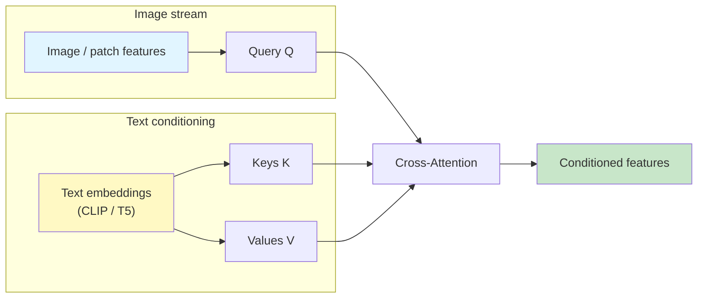
```mermaid
graph LR
    subgraph "Image stream"
        A["Image / patch features"] --> B["Query Q"]
    end

    subgraph "Text conditioning"
        C["Text embeddings<br/>(CLIP / T5)"] --> D["Keys K"]
        C --> E["Values V"]
    end

    B --> F["Cross-Attention"]
    D --> F
    E --> F
    F --> G["Conditioned features"]

    style A fill:#e1f5ff
    style C fill:#fff9c4
    style G fill:#c8e6c9
```

The text-side $K, V$ are **shared across denoising steps and across image positions**, so cross-attention adds only $O(N \cdot M \cdot d)$ extra cost where $M$ is the (typically short, ≤ 77 or ≤ 256) text-token count.

Cross-attention is *also* how PixArt-α / -Σ inject text into a DiT, where it sits *next to* every self-attention block and is conditioned on a frozen T5-XXL ([Chen et al., 2023](https://arxiv.org/abs/2310.00426)).

#### Joint Attention — MMDiT-Style Multimodal

Stable Diffusion 3, FLUX.1, Hunyuan-DiT, Lumina-Next, and most other 2024–2026 large-scale text-to-image models use **joint attention** instead of cross-attention: text and image tokens are *concatenated into a single sequence* and run through a single self-attention block, with each modality having its own QKV/MLP weights but a shared attention computation.

This lets every text token attend to every image token *and* vice versa, in a single bidirectional operation. See the [MMDiT](#mmdit-sd3-multimodal-dual-stream-transformer) subsection above for the architecture diagram. Empirically, joint attention is the single biggest reason MMDiT-style models render text inside images so much better than cross-attention U-Nets.

#### Position Encodings: Sinusoidal → Learned → RoPE → 2-D RoPE

Self-attention is *position-agnostic* on its own — Q-K dot products are invariant to token reordering. The positional information that distinguishes "top-left patch" from "bottom-right patch" comes from the position encoding. Modern diffusion has converged on two choices:

- **Learned absolute** position embeddings (one vector per token slot) — simple but tied to a fixed grid; doesn't generalise to other resolutions.
- **Rotary Position Embeddings (RoPE)** ([Su et al., 2024](https://arxiv.org/abs/2104.09864)) — multiply $Q$ and $K$ by a complex-rotation matrix that depends on token position; the dot product $\langle Q_i, K_j \rangle$ then encodes the *relative* position $i - j$. The dominant choice in 2026 diffusion DiTs.
- **2-D RoPE** factorises the rotation across $(H, W)$ axes; **NaViT-style** variable-resolution RoPE ([Dehghani et al., 2023](https://arxiv.org/abs/2307.06304)) supports arbitrary aspect ratios. **FiT / FiTv2** ([Lu et al., 2024](https://arxiv.org/abs/2402.12376)) and **FLUX.1** are built on this.

#### Spatial, Temporal, and 3-D Attention in Video Diffusion

Naive 3-D attention over a video latent is prohibitively expensive — for $T \times H \times W$ tokens, complexity is $O((THW)^2)$. Three strategies dominate:

1. **Factorised space-time attention** — interleave 2-D *spatial* attention blocks (treating $T$ as a batch dimension) with 1-D *temporal* attention blocks (treating $HW$ as a batch dimension). Used in Imagen Video, AnimateDiff, Stable Video Diffusion, and most early video-DiT recipes. $O(THW \cdot (HW + T))$.
2. **Full 3-D attention with spatio-temporal patchification** — Sora-style. Patch the video at $(t, h, w)$ resolution to keep $N$ tractable, then run unified self-attention across all spatio-temporal tokens. Used by Sora, Wan 2.x, HunyuanVideo, Mochi-1.
3. **Sparse / structured 3-D attention** — neighbourhood attention in $(t, h, w)$, axial attention, or learned sparse patterns — driving efficient long-context video generation in 2025–2026 (e.g. **LiteAttention** for video DiTs, [arXiv:2511.11062](https://arxiv.org/abs/2511.11062); **FrameDiT** matrix attention, [arXiv:2603.09721](https://arxiv.org/abs/2603.09721)).

#### Windowed and Neighborhood Attention (Sub-Quadratic, Sparse)

For pixel-space and very high-resolution latents, full self-attention is replaced by **local attention windows**:

- **Window Self-Attention** ([Liu et al., 2021 — Swin](https://arxiv.org/abs/2103.14030)) — partition tokens into non-overlapping windows; attend within each window, then *shift* the windows between layers to mix information.
- **Neighborhood Attention (NA / NAT)** ([Hassani et al., 2023 — CVPR](https://arxiv.org/abs/2204.07143)) — every token attends to its $k$ nearest neighbours in a sliding window. Linear in $N$, translation-equivariant (unlike Swin's shifted windows), and the attention pattern of choice for **Hourglass DiT** at high resolution. The [NATTEN](https://natten.org/) extension provides hand-tuned CUDA kernels.
- **Dilated / mixed windows** combine multiple receptive-field sizes per layer.

#### Linear-Attention Variants (Beyond Softmax)

A small zoo of $O(N)$ attention alternatives has crossed over from LLMs into diffusion (covered in detail in [Beyond U-Net → State-Space and Linear-Attention Backbones](#state-space-and-linear-attention-backbones-20242026)):

- **Linear / kernelised attention** ([Katharopoulos et al., 2020](https://arxiv.org/abs/2006.16236); [Performer, Choromanski et al., 2021](https://arxiv.org/abs/2009.14794)) — replace softmax with a feature map $\phi$, yielding $\text{Att} = \phi(Q)(\phi(K)^\top V)$ in $O(N d^2)$.
- **Gated Linear Attention** — used in **DiG** ([Zhu et al., 2025 — CVPR](https://arxiv.org/abs/2405.18428)).
- **Selective state-space (Mamba) layers** — used in **DiM**, **DiMSUM**, **U-Shape Mamba**.
- **Linear compressed attention** for image-to-image, paired with softmax for image-text — used in **EDiT / MM-EDiT** ([Suresh et al., 2025](https://arxiv.org/abs/2503.16726)).
- **Hybrid blocks** with a fixed mix of linear and softmax attention layers — the dominant 2026 LLM trend, increasingly appearing in diffusion.

#### Token Merging, Pruning, and Sparse Attention

Rather than redesign the attention mechanism, several methods *reduce the token count*:

- **ToMeSD** ([Bolya & Hoffman, 2023 — CVPRW](https://arxiv.org/abs/2303.17604)) — merge similar tokens before each attention block in Stable Diffusion. Up to 60 % token reduction → 2× speedup, 5.6× memory reduction, no retraining, minimal quality loss.
- **ToMA — Token Merge with Attention** ([2025](https://arxiv.org/abs/2509.10918)) — adapts token merging specifically for diffusion *transformers*.
- **DiffSparse** ([ICLR 2026](https://arxiv.org/abs/2604.03674)) — differentiable layer-wise token sparsity with a learnable router; further accelerates DiTs without retraining.
- **DyDiT / DyDiT++** ([Zhao et al., 2024–25](https://arxiv.org/abs/2504.06803)) — adaptive computation along *both* timestep and spatial dimensions; 51 % FLOPs reduction on DiT-XL.

#### Implementation: FlashAttention and Friends

Most production diffusion stacks compile attention through one of three backends, all of which are **drop-in numerically-exact** replacements for naive PyTorch / JAX softmax-attention:

- **FlashAttention** ([Dao et al., 2022 — NeurIPS](https://arxiv.org/abs/2205.14135); [FlashAttention-2, Dao 2023](https://arxiv.org/abs/2307.08691); [FlashAttention-3, Shah et al., 2024](https://arxiv.org/abs/2407.08608)) — IO-aware tiled attention that never materialises the $N \times N$ score matrix in HBM. FA-2 hits ~70 % of an A100's theoretical FLOPS; FA-3 is tuned for Hopper's asynchronous Tensor Cores and TMA. Most modern DiTs would not be trainable at scale without it.
- **xFormers memory-efficient attention** (Meta) — earlier and still widely used in Stable Diffusion deployments.
- **PyTorch SDPA / FlexAttention** — vendor-blessed kernels with automatic dispatch to FA-3 / Triton on supported hardware.

#### Feature and KV Caching at Inference

Diffusion is iterative, so consecutive denoising steps usually have *highly correlated* attention activations. Modern fast-inference stacks cache them:

- **DeepCache** ([Ma et al., 2024 — CVPR](https://arxiv.org/abs/2312.00858)) — caches U-Net deep-feature activations across steps; ~2× speedup.
- **Learning-to-Cache (L2C)** ([Ma et al., 2024 — NeurIPS](https://proceedings.neurips.cc/paper_files/paper/2024/file/f0b1515be276f6ba82b4f2b25e50bef0-Paper-Conference.pdf)) — *learns* which DiT layers are safe to cache between steps.
- **TeaCache** — feature caching baked into Lumina-Image 2.0, FLUX, and several open video stacks for ~2× inference speedup.
- **ToCa, FORA, Δ-Cache** — newer 2024–2025 methods that cache token-level attention output rather than whole layers.

These caching techniques compose with Flash Attention and with distillation, so a fully-optimised 2026 inference stack typically combines: distillation (1–4 NFEs) + flash-attention kernels + KV / feature caching + (optional) token merging + (optional) quantisation. The aggregate is the ~50–500× inference-time speedup over a 2022 raw-DDPM baseline that makes near-real-time T2I production viable today.

#### Choosing an Attention Pattern: a 2026 Cheat-Sheet

| Setting | Recommended attention pattern |
| --- | --- |
| Small-to-mid latent DiT (≤ 64²) | Full self-attention with FlashAttention-3, RoPE positions. |
| Large-resolution pixel-space (1024²+) | Neighborhood Attention (HDiT) or windowed attention. |
| Large-resolution latent (≥ 128²), efficiency-critical | Linear / SSM attention (DiG, DiM) or token-merging on top of full attention. |
| Multimodal text-to-image | **Joint attention** (MMDiT) on concatenated text+image tokens. |
| Video diffusion, short clips | Factorised space-time attention. |
| Video diffusion, long / high-res | Full 3-D attention with patchification + sparse / neighbourhood patterns. |
| Variable aspect ratios | **2-D RoPE** + masked MHSA (FiT / FiTv2). |
| Production T2I inference | FA-3 + L2C / TeaCache + (optional) ToMeSD on top of a distilled student. |

The unifying picture: **softmax self-attention plus RoPE positions** has become the default inner loop of the modern diffusion backbone, while *every other axis* (windowing, factorisation, linearisation, token merging, caching) is a tool for managing its quadratic cost.

### Model Parameterization Choices

The same denoising network can be trained to predict different *targets* derived from $x_t$. Given the standard VP-SDE forward $x_t = \sqrt{\bar\alpha_t}\, x_0 + \sqrt{1 - \bar\alpha_t}\, \epsilon$ (write $a_t = \sqrt{\bar\alpha_t}$, $b_t = \sqrt{1-\bar\alpha_t}$, so $a_t^2 + b_t^2 = 1$), the *common* prediction targets are:

- **ε** — the additive Gaussian noise (DDPM)
- **x₀** — the clean image (data prediction)
- **v** — Salimans & Ho's "velocity" (a rotation of (ε, x₀))
- **score** — $\nabla_{x_t} \log q(x_t)$ (score matching)
- **F** — the EDM "preconditioned" target (Karras et al. 2022)
- **flow-matching velocity** — $u_t(x) = \mathbb{E}[x_1 - x_0 \mid x_t]$ (a *different* "velocity" from Salimans & Ho's v)

Crucially, given $x_t$ and the schedule $(a_t, b_t)$ all of these are *deterministic affine functions of each other* — a network that learns one of them implicitly defines the others. So why do we ever care which target we regress against? Because the **loss landscape, gradient scale, numerical conditioning, and effective per-timestep loss weighting** all depend on the choice.

#### The Unifying Picture: A Linear Algebra of Targets

Pick any two of $(x_t, x_0, \epsilon)$ and the third is determined:

$$
x_0 = \frac{x_t - b_t\, \epsilon}{a_t}, \qquad
\epsilon = \frac{x_t - a_t\, x_0}{b_t}, \qquad
v_t \;\equiv\; a_t\, \epsilon - b_t\, x_0.
$$

The score (in the VP-SDE) is just a rescaled negative noise:

$$
\nabla_{x_t} \log q(x_t) \;=\; -\,\frac{\epsilon}{b_t}.
$$

A diagonal sanity check on $v_t$:

| Target | Limit at high noise ($a_t \to 0$, $b_t \to 1$) | Limit at low noise ($a_t \to 1$, $b_t \to 0$) |
| --- | --- | --- |
| $\epsilon$ | $\epsilon$ — unit Gaussian, well-scaled | small — *signal-starved* |
| $x_0$ | $x_0$ — data-scale (large), *signal-starved* | $x_0$ — data-scale, well-scaled |
| $v_t$ | $\epsilon$ (since $b_t \to 1$) | $-x_0$ (since $a_t \to 1$) |
| $\nabla \log q$ | $-\epsilon$ — finite | $-\epsilon / 0$ — *diverges* |

The **practical asymmetry** is here: ε-prediction is well-scaled at *high* noise but provides almost no learning signal at *low* noise (because $\epsilon \approx (x_t - x_0)/0$ there); $x_0$-prediction is well-scaled at *low* noise but supervisory at *high* noise becomes "guess the data from pure noise". $v$-prediction smoothly *interpolates* between the two as $t$ varies, and the EDM $F$-target normalises the network output to unit variance at *every* $t$.

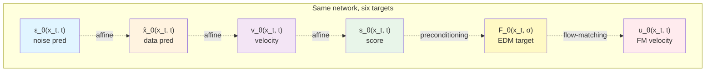
```mermaid
graph TD
    subgraph "Same network, six targets"
        N["ε_θ(x_t, t)<br/>noise pred"] -.->|"affine"| X["x̂_0(x_t, t)<br/>data pred"]
        X -.->|"affine"| V["v_θ(x_t, t)<br/>velocity"]
        V -.->|"affine"| S["s_θ(x_t, t)<br/>score"]
        S -.->|"preconditioning"| F["F_θ(x_t, σ)<br/>EDM target"]
        F -.->|"flow-matching"| U["u_θ(x_t, t)<br/>FM velocity"]
    end

    style N fill:#e1f5ff
    style X fill:#fff3e0
    style V fill:#f3e5f5
    style S fill:#e8f5e9
    style F fill:#fff9c4
    style U fill:#ffebee
```

#### ε-Prediction (Noise Prediction) — DDPM Default

Network predicts $\epsilon_\theta(x_t, t) \approx \epsilon$:

$$
L_\epsilon \;=\; \mathbb{E}_{t,\,x_0,\,\epsilon}\!\left[\|\epsilon - \epsilon_\theta(x_t, t)\|^2\right].
$$

- **Pros**: Numerically stable; the regression target is a *unit-variance Gaussian* across all timesteps, which conditions the optimisation well at moderate-to-high noise. Default for DDPM, Stable Diffusion 1.x, classifier guidance, and *most* open implementations.
- **Cons**: Vanishingly small training signal as $b_t \to 0$ (the target becomes essentially random rounding noise). When converted back to $x_0$ via $\hat x_0 = (x_t - b_t\,\hat\epsilon)/a_t$, even a tiny error in $\hat\epsilon$ at low noise blows up by $1/a_t$ → blurry samples in the *last* denoising steps unless variance is learned ([Nichol & Dhariwal, 2021](https://arxiv.org/abs/2102.09672)).

#### x₀-Prediction (Data Prediction)

Network predicts $\hat x_\theta(x_t, t) \approx x_0$:

$$
L_{x_0} \;=\; \mathbb{E}_{t,\,x_0,\,\epsilon}\!\left[\|x_0 - \hat x_\theta(x_t, t)\|^2\right].
$$

- **Pros**: Cleanest target at *low* noise; the prediction is in the same space as the data, so dynamic-thresholding tricks ([Saharia et al., 2022 — Imagen](https://arxiv.org/abs/2205.11487)) and clipping to $[-1,1]$ are natural. The basis of consistency models, score-distillation sampling, and most distillation methods.
- **Cons**: At *high* noise the target is almost independent of $x_t$, so the loss saturates and the network learns the *data prior* rather than how to denoise. Also produces out-of-range predictions before clipping.

#### v-Prediction (Velocity)

[Salimans & Ho (2022)](https://arxiv.org/abs/2202.00512) note that ε-pred and $x_0$-pred fail at *opposite* SNR extremes, and define the velocity target

$$
v_t \;\equiv\; a_t\, \epsilon - b_t\, x_0
\;=\; \frac{\partial x_t}{\partial t}\bigg|_{\text{angle on the circle } (\sqrt{\bar\alpha},\sqrt{1-\bar\alpha})}.
$$

So $v_t$ is the tangent vector along the noise/data unit-circle. As $t \to 0$, $v_t \to -x_0$; as $t \to T$, $v_t \to \epsilon$. The L2 loss $\|v - v_\theta\|^2$ therefore stays *well-conditioned at every timestep*, and gradient SNR varies much less across $t$ than for ε or $x_0$ alone.

- **Pros**: Best-in-class numerical stability, especially under cosine schedules where the SNR range is wide and asymmetric. Particularly important for *progressive distillation* (where teacher and student see very different noise levels) and *video* (where temporal extents push the schedule toward higher SNRs).
- **Cons**: Conceptually less transparent than ε / $x_0$; requires care converting back for sampling.
- **Production users**: Imagen, Stable Diffusion 2.x at 768², SD3's rectified-flow target reduces to v-pred in a special case, progressive-distillation papers, and most modern video models (Sora-class).

The conversion back to ε / $x_0$ from a v-prediction is just inverting the rotation:

$$
\hat\epsilon = a_t\, v_\theta + b_t\, x_t,\qquad
\hat x_0 = a_t\, x_t - b_t\, v_\theta.
$$

#### Score Prediction (Score Matching)

The score is $-\epsilon/b_t$ in the VP-SDE, so score-prediction is equivalent to ε-prediction up to a known scaling. Score-based models ([Song & Ermon, 2019](https://arxiv.org/abs/1907.05600); [Song et al., 2021](https://arxiv.org/abs/2011.13456)) usually train *directly* in the score parameterisation because it ports cleanly to *continuous-time* SDE / probability-flow-ODE samplers. The price paid: the target diverges as $b_t \to 0$, which forces noise-conditioning on the network and a careful sampler near $t = 0$.

#### EDM "F-Prediction" with Preconditioning

[Karras et al., 2022 — EDM](https://arxiv.org/abs/2206.00364) reframe parameterisation choice as a **preconditioning** problem. In the variance-exploding (VE) parameterisation $x_t = x_0 + \sigma \epsilon$, they wrap the network $F_\theta$ with input/output rescalings:

$$
D_\theta(x, \sigma) \;=\; c_{\mathrm{skip}}(\sigma)\, x \;+\; c_{\mathrm{out}}(\sigma)\, F_\theta\!\big(c_{\mathrm{in}}(\sigma)\, x;\; c_{\mathrm{noise}}(\sigma)\big),
$$

with closed-form $c_{\mathrm{skip}}, c_{\mathrm{out}}, c_{\mathrm{in}}, c_{\mathrm{noise}}$ chosen so that $F_\theta$'s **input, target, and effective loss** all have unit variance for every $\sigma$. This is the most principled answer to "how should I parameterise?": ε, $x_0$, and $v$ are all *special cases* of EDM preconditioning at different $\sigma$ regimes, and EDM smoothly interpolates them. Adopted (in spirit) by Stable Cascade, large-scale Karras-line models, and the EDM2 / ImageNet-512 SOTA pipelines.

#### Flow-Matching Velocity (a different "v")

To avoid notation collision: **flow-matching velocity** ([Lipman et al., 2023](https://arxiv.org/abs/2210.02747)) is a *different object* from Salimans & Ho's v-prediction. Flow matching defines a probability path $p_t$ between data ($p_0$) and noise ($p_1$) via a *conditional* trajectory $\psi_t(x_0, x_1)$, and trains a vector field

$$
u_\theta(x_t, t) \;\approx\; \mathbb{E}\!\left[\frac{\partial \psi_t}{\partial t} \;\middle|\; x_t\right].
$$

For the *linear interpolant* $\psi_t = (1-t)x_0 + t\, x_1$ (rectified flow, [Liu et al., 2023](https://arxiv.org/abs/2209.03003)), the target is simply $u_t = x_1 - x_0$. For the *VP-Gaussian* interpolant, the flow-matching velocity coincides with Salimans & Ho's v up to schedule-dependent rescaling. **MMDiT (SD3)** and **FLUX.1** train the flow-matching velocity directly with a Logit-Normal timestep prior ([Esser et al., 2024](https://arxiv.org/abs/2403.03206)), which empirically beats v-prediction with a uniform prior on identical architectures.

#### How the Choice Interacts with Loss Weighting

The three classical losses are *not the same loss with a relabelled target*: they correspond to identical math only after the **right per-timestep weighting**. [Hang et al. (2023) — Min-SNR](https://arxiv.org/abs/2303.09556) make this explicit: for a unified Min-SNR-γ schedule, the loss weight depends on the parameterisation:

$$
w(t) \;=\;
\begin{cases}
\min\!\big(\mathrm{SNR}(t),\, \gamma\big) & \text{(}x_0\text{-prediction)} \\[2pt]
\min\!\big(\mathrm{SNR}(t),\, \gamma\big) \,/\, \mathrm{SNR}(t) & \text{(}\epsilon\text{-prediction)} \\[2pt]
\min\!\big(\mathrm{SNR}(t),\, \gamma\big) \,/\, \big(\mathrm{SNR}(t) + 1\big) & \text{(v-prediction)}
\end{cases}
$$

where $\mathrm{SNR}(t) = a_t^2 / b_t^2$. With these weights the three are *equivalent in expectation*; with the naive *unweighted* MSE used in the simplified DDPM objective, ε-prediction implicitly upweights low-noise steps and $x_0$-prediction implicitly upweights high-noise steps.

#### Loss Re-weighting in 2024–2026: Logit-Normal, EDM2, and P2-Weighting

The *implicit* per-step weighting introduced by the parameterisation choice is now actively *designed* rather than accidental:

- **EDM** ([Karras et al., 2022](https://arxiv.org/abs/2206.00364)) samples $\sigma$ from a log-normal distribution at training time, focusing capacity on the perceptually-relevant SNR band.
- **EDM2** ([Karras et al., 2024](https://arxiv.org/abs/2312.02696)) makes this prior learnable and decouples loss weighting from the noise-sampling distribution.
- **Logit-Normal sampling** ([Esser et al., 2024 — SD3](https://arxiv.org/abs/2403.03206)) is the rectified-flow analogue: $t \sim \mathrm{LogitNormal}(\mu, s^2)$ keeps mid-range timesteps oversampled.
- **P2 weighting** ([Choi et al., 2022](https://arxiv.org/abs/2204.00227)) prioritises the perceptually-rich phase of training and is widely used in 256² class-conditional ImageNet pipelines.

#### Practical Guidance: a 2026 Cheat-Sheet

| Setting | Recommended target | Why |
| --- | --- | --- |
| Vanilla pixel-space DDPM, classical schedules | **ε-prediction** | Stable, simple; matches the Ho 2020 recipe and most pretrained checkpoints. |
| Latent diffusion at 512² (SD 1.x style) | **ε-prediction** + learned variance | The Nichol-Dhariwal hybrid objective; what SD-1.x ships. |
| Cosine / wide-SNR schedules, high-resolution, video | **v-prediction** | Numerically stable across the full SNR range; what SD 2.x@768, Imagen and most video models use. |
| Distillation (any direction → 1–4 steps) | **v-prediction** *or* **x₀-prediction** | v for progressive distillation; $x_0$ for SDS / consistency / DMD-style methods. |
| Continuous-time SDE / score-based sampler | **score** | Cleanest plug-in to probability-flow ODEs and predictor-corrector samplers. |
| Karras-line ImageNet / FFHQ SOTA | **EDM F-prediction with preconditioning** | Unit-variance training target across all $\sigma$; SOTA on every Karras paper since 2022. |
| Modern T2I / text-to-video at scale | **flow-matching / rectified-flow velocity** + Logit-Normal sampling | What SD3, FLUX.1, HunyuanVideo, Wan 2.x all use; superior prompt-following and text rendering empirically. |

!!! note "Equivalence vs. preference"
    All six targets are mathematically equivalent through linear changes of variable. The *empirical* preference between them comes down to (a) which target is well-scaled in your training distribution's busiest SNR band, (b) how robust the sampler is to small errors in the chosen target near the SNR endpoints, and (c) which one composes most cleanly with your downstream task (distillation, guidance, ODE solving). Most production 2024–2026 models have moved to **flow-matching velocity with Logit-Normal sampling**; v-prediction remains the right default for U-Net-style models trained with cosine schedules.

---

## Training Process

### The Simplified Training Objective

The **simplified loss** ignores theoretical weightings from ELBO:

$$
L_{\text{simple}} = \mathbb{E}_{t \sim U[1,T], \, x_0 \sim q(x_0), \, \epsilon \sim \mathcal{N}(0,\mathbf{I})}\left[\|\epsilon - \epsilon_\theta(x_t, t)\|^2\right]
$$

**Training Algorithm**:

1. Sample training image $x_0 \sim q(x_0)$
2. Sample timestep $t \sim \text{Uniform}(1, T)$
3. Sample noise $\epsilon \sim \mathcal{N}(0, \mathbf{I})$
4. Compute noisy image $x_t = \sqrt{\bar{\alpha}_t} \, x_0 + \sqrt{1-\bar{\alpha}_t} \, \epsilon$
5. Predict noise $\hat{\epsilon} = \epsilon_\theta(x_t, t)$
6. Compute loss $L = \|\epsilon - \hat{\epsilon}\|^2$
7. Update $\theta$ via gradient descent

**Remarkably simple**: Just MSE between predicted and actual noise!

### Loss Function Variants

**Variational Lower Bound (VLB)**:

The full ELBO includes weighted terms for each timestep. While theoretically principled, optimizing full VLB is harder in practice.

**Hybrid Objective** ([Nichol & Dhariwal, 2021](https://arxiv.org/abs/2102.09672)):

Combines $L_{\text{simple}}$ for mean prediction with VLB terms for variance learning:

$$
L_{\text{hybrid}} = L_{\text{simple}} + \lambda L_{\text{vlb}}
$$

**Min-SNR-γ Weighting** ([Hang et al., 2023](https://arxiv.org/abs/2303.09556)):

Clips weights at $w_t = \min(\text{SNR}(t), \gamma)$ where $\text{SNR}(t) = \bar{\alpha}_t / (1-\bar{\alpha}_t)$:

$$
L_{\text{min-SNR}} = \mathbb{E}\left[\min(\text{SNR}(t), \gamma) \cdot \|\epsilon - \epsilon_\theta(x_t, t)\|^2\right]
$$

Typical $\gamma = 5$. Achieves **3.4× faster convergence** by preventing over-weighting easy steps.

### Training Stability and Best Practices

!!! tip "Essential Training Practices"
    **Exponential Moving Average (EMA)**: Critical for quality. Maintain running average:

    $$
    \theta_{\text{ema}} = \beta \, \theta_{\text{ema}} + (1-\beta) \, \theta
    $$

    with $\beta = 0.9999$. **Always use EMA weights for inference**, not raw training weights.

    **Gradient Clipping**: Prevents exploding gradients. Clip gradient norms to 1.0.

    **Mixed Precision Training**: FP16/BF16 provides 2-3× speedup, 40-50% memory reduction.

**Normalization**:

- **Group Normalization**: Divide channels into groups (~32) for stability
- **Layer Normalization**: Alternative for transformer-based models
- **No Batch Normalization**: Batch statistics interfere with noise conditioning

**Regularization**:

- **Weight Decay**: $10^{-4}$ to $10^{-6}$ with AdamW optimizer
- **Dropout**: Sometimes used (rate 0.1-0.3) but less common than in other architectures

### Hyperparameter Selection

**Timesteps**: $T = 1000$ is standard for training. More steps provide finer granularity but slower sampling.

**Noise Schedules**:

- **Cosine schedule** outperforms linear empirically
- Critical: Ensure $\bar{\alpha}_T \approx 0$ for pure noise at final step

**Learning Rates**:

- Standard: $1 \times 10^{-4}$ to $2 \times 10^{-4}$ with AdamW
- Sensitive domains (faces): $1 \times 10^{-6}$ to $2 \times 10^{-6}$
- Use linear warmup over 500-1000 steps

**Batch Sizes**:

- Small images (32×32): 128-512
- Medium (256×256): 32-128
- Large (512×512): 8-32
- Use gradient accumulation to simulate larger batches

**Optimizer Configuration**:

```python
tx = optax.adamw(
    learning_rate=1e-4,
    b1=0.9,
    b2=0.999,
    weight_decay=1e-4,
)
```

### Training Dynamics and Monitoring

!!! warning "Common Training Issues"
    **Loss Plateaus**: Normal behavior—loss doesn't directly correlate with quality. Monitor visual samples!

    **NaN Losses**: Usually from exploding gradients. Enable gradient clipping and mixed precision loss scaling.

    **Poor Sample Quality**: Check EMA is enabled, noise schedule is correct, sufficient training steps completed.

**What to Monitor**:

1. **Training Loss**: Should decrease initially, then plateau
2. **Visual Samples**: Generate every 5k-10k steps at fixed noise seeds
3. **FID Score**: Compute on validation set every 25k-50k steps
4. **Gradient Norms**: Should be stable, not exploding
5. **Learning Rate**: Track warmup and decay schedules

**Checkpoint Management**:

- Save both regular and EMA weights
- Keep checkpoints every 50k-100k steps
- Save best checkpoint based on FID score
- Include optimizer state for resuming training

### Computational Requirements

**GPU Requirements** (rough guidance for training a 256² latent-diffusion model from scratch):

- Minimum (small models, gradient accumulation, mixed precision): 16 GB VRAM (RTX 4060 Ti 16 GB / RTX 3090 / A4000).
- Recommended: 24 GB VRAM (RTX 3090, 4090, 5090, A5000).
- Large-scale: 40–80 GB per GPU (A100, H100, H200) across multi-node clusters.
- Inference-only of a published SD 1.5 / SDXL checkpoint runs comfortably on 8–12 GB consumer GPUs.

**Training Times**:

- Small datasets (10k images): Days on single GPU
- Medium (100k images): Weeks on multiple GPUs
- Large-scale (millions): Months on hundreds of GPUs
- ImageNet 256×256 on 8× A100: 7-14 days

**Memory Optimizations**:

- **Gradient Checkpointing**: 30-50% memory reduction, 20% slowdown
- **Mixed Precision**: 40-50% memory reduction, 2-3× speedup
- **Smaller Batch Sizes**: Use gradient accumulation to maintain effective batch size

---

## Sampling Methods

### DDPM Sampling: The Iterative Reverse Process

The foundational DDPM sampling starts from pure noise $x_T \sim \mathcal{N}(0, \mathbf{I})$ and iteratively denoises:

$$
x_{t-1} = \frac{1}{\sqrt{\alpha_t}} \left( x_t - \frac{\beta_t}{\sqrt{1-\bar{\alpha}_t}} \epsilon_\theta(x_t, t) \right) + \sigma_t z
$$

where $z \sim \mathcal{N}(0, \mathbf{I})$ and $\sigma_t$ controls stochasticity.

**Algorithm**:

1. Sample $x_T \sim \mathcal{N}(0, \mathbf{I})$
2. For $t = T, T-1, \ldots, 1$:
   - Predict noise: $\hat{\epsilon} = \epsilon_\theta(x_t, t)$
   - Compute mean: $\mu_t = \frac{1}{\sqrt{\alpha_t}} \left( x_t - \frac{\beta_t}{\sqrt{1-\bar{\alpha}_t}} \hat{\epsilon} \right)$
   - Sample: $x_{t-1} = \mu_t + \sigma_t z$
3. Return $x_0$

**Characteristics**:

- **Stochastic**: Introduces randomness at each step.
- **Slow**: Requires $T=1000$ neural network evaluations (seconds to minutes for a 256² image on a single GPU).
- **High Quality**: Excellent sample quality with sufficient steps.
- **~1000× slower** than single-pass generators like GANs *before* applying any acceleration. Modern distilled samplers (DDIM-50 → 50× faster, DPM-Solver → 50–100×, LCM/SiD/DMD2 → 250–1000×) close most of this gap; see [Recent Advances](#recent-advances-20242026-distillation-flow-matching-and-diffusion-language-models).

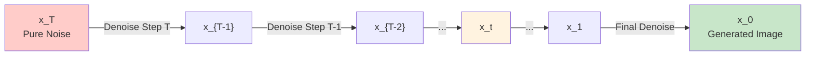
```mermaid
graph LR
    A["x_T<br/>Pure Noise"] -->|"Denoise Step T"| B["x_{T-1}"]
    B -->|"Denoise Step T-1"| C["x_{T-2}"]
    C -->|"..."| D["x_t"]
    D -->|"..."| E["x_1"]
    E -->|"Final Denoise"| F["x_0<br/>Generated Image"]

    style A fill:#ffccc9
    style F fill:#c8e6c9
    style D fill:#fff3e0
```

### DDIM: Fast Deterministic Sampling

DDIM ([Song, Meng & Ermon, 2021 — ICLR](https://arxiv.org/abs/2010.02502)) constructs **non-Markovian forward processes** sharing DDPM's marginals but enabling much larger reverse steps:

$$
x_{t-1} = \sqrt{\bar{\alpha}_{t-1}} \underbrace{\left(\frac{x_t - \sqrt{1-\bar{\alpha}_t} \epsilon_\theta(x_t, t)}{\sqrt{\bar{\alpha}_t}}\right)}_{\text{"predicted } x_0\text{"}} + \underbrace{\sqrt{1-\bar{\alpha}_{t-1} - \sigma_t^2} \cdot \epsilon_\theta(x_t, t)}_{\text{"direction pointing to } x_t\text{"}} + \underbrace{\sigma_t \epsilon}_{\text{random noise}}
$$

When $\sigma_t = 0$, sampling becomes **fully deterministic**.

**Key Advantages**:

- **10-50× speedup**: Reduces from 1000 steps to 50-100 steps
- **No retraining**: Works with any pre-trained DDPM checkpoint
- **Deterministic**: When $\eta = 0$, enables consistent reconstructions
- **Interpolation**: Meaningful latent space interpolation

**Algorithm** (Deterministic $\sigma_t = 0$):

1. Sample $x_T \sim \mathcal{N}(0, \mathbf{I})$
2. Choose subset of timesteps $\{\tau_1, \tau_2, \ldots, \tau_S\}$ where $S \ll T$
3. For $i = S, S-1, \ldots, 1$:
   - Predict $x_0$: $\hat{x}_0 = \frac{x_{\tau_i} - \sqrt{1-\bar{\alpha}_{\tau_i}} \epsilon_\theta(x_{\tau_i}, \tau_i)}{\sqrt{\bar{\alpha}_{\tau_i}}}$
   - Compute $x_{\tau_{i-1}} = \sqrt{\bar{\alpha}_{\tau_{i-1}}} \hat{x}_0 + \sqrt{1-\bar{\alpha}_{\tau_{i-1}}} \epsilon_\theta(x_{\tau_i}, \tau_i)$
4. Return $x_0$

!!! tip "DDIM in Practice"
    DDIM became the standard inference method for production systems. Stable Diffusion defaults to 50 DDIM steps for a good quality/speed trade-off. Fewer steps (20-25) work for quick previews.

### Advanced ODE Solvers

**DPM-Solver** ([Lu et al., 2022 — NeurIPS](https://arxiv.org/abs/2206.00927)):

Treats diffusion sampling as solving ODEs with specialised numerical methods:

- **Higher-order solver** (order 2–3) with convergence guarantees.
- FID 4.70 in **10 steps**, 2.87 in **20 steps** on CIFAR-10.
- **4–16× speedup** over previous samplers.

**DPM-Solver++** ([Lu et al., 2023](https://arxiv.org/abs/2211.01095)):

Addresses instability with large classifier-free-guidance scales:

- Uses data prediction with dynamic thresholding.
- Performs well with 15–20 steps for guided sampling.
- Better numerical stability than DPM-Solver under large CFG scales.

**PNDM — Pseudo Numerical Methods** ([Liu et al., 2022 — ICLR](https://arxiv.org/abs/2202.09778)):

Treats DDPMs as solving differential equations on manifolds:

- Higher quality at 50 steps than 1000-step DDIM.
- **20× speedup** with quality improvement.

**UniPC** ([Zhao et al., 2023](https://arxiv.org/abs/2302.04867)) and **DEIS** ([Zhang & Chen, 2022](https://arxiv.org/abs/2204.13902)) are common modern alternatives in production samplers.

### Consistency Models: One-Step Generation

**Consistency Models** ([Song et al., 2023 — ICML](https://arxiv.org/abs/2303.01469)) and the follow-up [Improved Techniques for Training Consistency Models](https://arxiv.org/abs/2310.14189) (ICLR'24 Oral) propose a **paradigm shift**: learn a **consistency function** $f$ that directly maps any point on a trajectory to its endpoint:

$$
f(x_t, t) = x_0 \quad \text{for all } t
$$

The self-consistency property:

$$
f(x_t, t) = f(x_s, s) \quad \text{for all } s, t
$$

**Consistency Distillation**:

Train by distilling from pre-trained diffusion model:

$$
\mathcal{L}_{\text{CD}} = \mathbb{E}\left[d(f_\theta(x_{t_{n+1}}, t_{n+1}), f_{\theta^-}(\hat{x}_{t_n}^\phi, t_n))\right]
$$

where $\hat{x}_{t_n}^\phi$ is one step of ODE solver from $x_{t_{n+1}}$ using teacher model.

**Results**:

- FID 3.55 on CIFAR-10 in **one step**
- Improved techniques: FID 2.51 in one step, 2.24 in two steps
- Consistency Trajectory Models (CTM): FID 1.73 in **one step**
- Zero-shot editing without task-specific training

!!! note "Revolutionary Speed"
    Consistency models achieve 1000× speedup over DDPM while maintaining competitive quality. This makes diffusion viable for real-time applications.

### Guidance Techniques

**Classifier Guidance** ([Dhariwal & Nichol, 2021](https://arxiv.org/abs/2105.05233)):

Modifies the score using gradients from a separately trained noise-aware classifier:

$$
\tilde{\epsilon}_\theta(x_t, c) = \epsilon_\theta(x_t, c) - w \cdot \sigma_t \cdot \nabla_{x_t} \log p_\phi(c|x_t)
$$

where $w$ is guidance scale, $c$ is class label.

**Advantages**: First method to push diffusion past GANs on ImageNet (FID 4.59 vs BigGAN-deep's 6.95).
**Disadvantages**: Requires training noise-aware classifiers at all noise levels.

**Classifier-Free Guidance** ([Ho & Salimans, 2022](https://arxiv.org/abs/2207.12598)):

Eliminates the classifier by jointly training conditional and unconditional models:

$$
\tilde{\epsilon}_\theta(x_t, c) = (1 + w) \cdot \epsilon_\theta(x_t, c) - w \cdot \epsilon_\theta(x_t, \emptyset)
$$

During training, randomly drop condition $c$ with probability ~10%.

**Advantages**:

- No auxiliary classifier needed
- Often better quality than classifier guidance
- Single guidance scale $w$ controls trade-off
- **Industry standard**: Used by DALL·E 2, Stable Diffusion, Midjourney, Imagen

**Common Guidance Scales**:

- $w = 1.0$: No guidance (unconditional)
- $w = 3-5$: Moderate guidance, balanced quality/diversity
- $w = 7-8$: Standard guidance (Stable Diffusion default: 7.5)
- $w = 10-15$: Strong guidance, high fidelity but lower diversity
- $w > 20$: Over-guided, saturated colors, artifacts

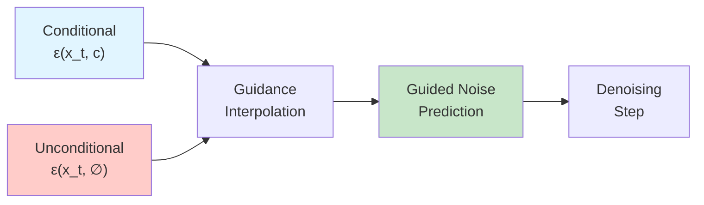
```mermaid
graph LR
    A["Conditional<br/>ε(x_t, c)"] --> C["Guidance<br/>Interpolation"]
    B["Unconditional<br/>ε(x_t, ∅)"] --> C
    C --> D["Guided Noise<br/>Prediction"]
    D --> E["Denoising<br/>Step"]

    style A fill:#e1f5ff
    style B fill:#ffccc9
    style D fill:#c8e6c9
```

---

## Diffusion Model Variants

### Latent Diffusion Models (LDM / Stable Diffusion)

**Latent Diffusion** ([Rombach et al., 2022 — CVPR](https://arxiv.org/abs/2112.10752)) introduced the most important architectural pattern in modern diffusion: **run diffusion in a VAE latent space, not in pixel space**.

**Two-Stage Approach**:

1. **Train autoencoder** compressing images 8× (512×512×3 → 64×64×4)
2. **Run diffusion** in compressed latent space

**Architecture**:

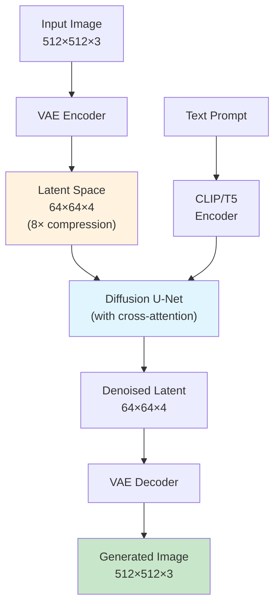
```mermaid
graph TB
    A["Input Image<br/>512×512×3"] --> B["VAE Encoder"]
    B --> C["Latent Space<br/>64×64×4<br/>(8× compression)"]
    C --> D["Diffusion U-Net<br/>(with cross-attention)"]
    E["Text Prompt"] --> F["CLIP/T5<br/>Encoder"]
    F --> D
    D --> G["Denoised Latent<br/>64×64×4"]
    G --> H["VAE Decoder"]
    H --> I["Generated Image<br/>512×512×3"]

    style C fill:#fff3e0
    style D fill:#e1f5ff
    style I fill:#c8e6c9
```

**Key Benefits**:

- **2.7× training/inference speedup**
- **1.6× FID improvement**
- **Massively reduced memory**: ~10GB VRAM for 512×512 generation
- **Cross-attention conditioning**: Text embeddings guide generation

**Stable Diffusion Implementation**:

- 860M-parameter U-Net in latent space
- Trained on LAION-5B (5 billion text-image pairs)
- Open-source release democratized text-to-image generation
- Versions: SD 1.4, 1.5, 2.0, 2.1 (U-Net latents), SDXL (2.6B U-Net), SD3 / SD3.5 (MMDiT, up to 8B), with SD-Turbo and FLUX.1 [schnell] adding 1–4-step distilled variants.

**SDXL** ([Podell et al., 2023](https://arxiv.org/abs/2307.01952)):

- 2.6B-parameter UNet (≈ 3× SD 1.5)
- Dual text encoders (OpenCLIP-G + CLIP-L) concatenated
- Native 1024×1024 training and generation
- Two-stage: base model + refiner

**Stable Diffusion 3 / SD3.5** ([Esser et al., 2024 — MMDiT](https://arxiv.org/abs/2403.03206)):

- **Rectified-flow Transformer** (MMDiT) replacing U-Net
- Multimodal Diffusion Transformer with separate streams for text and image tokens
- Sizes: 800M, 2B, 8B parameters
- Substantially better text rendering and prompt following

**FLUX.1** ([Black Forest Labs, 2024](https://github.com/black-forest-labs/flux)):

- 12B-parameter rectified-flow transformer (the largest open-weights image model at release).
- Hybrid multimodal + parallel-DiT blocks with rotary positional embeddings.
- Three variants: **FLUX.1 [pro]** (closed, top quality), **FLUX.1 [dev]** (open, non-commercial), **FLUX.1 [schnell]** (Apache-2.0, distilled to 1–4 steps via *latent adversarial diffusion distillation* — see the [Recent Advances](#recent-advances-20242026-distillation-flow-matching-and-diffusion-language-models) section).
- Routinely ranks #1 / #2 on community prompt-following and visual-quality leaderboards in 2024–2025.

!!! note "Impact"
    Latent diffusion made high-quality generation accessible. Stable Diffusion has 100M+ users and massive ecosystem of fine-tunes, LoRAs, and community tools.

### Conditional Diffusion Models

**Class-Conditional Generation**:

Add class label $y$ as conditioning:

$$
p_\theta(x_{t-1} | x_t, y) = \mathcal{N}(x_{t-1}; \mu_\theta(x_t, t, y), \Sigma_\theta(x_t, t, y))
$$

Typically implemented via:

- **Class embeddings** concatenated with time embeddings
- **Conditional batch normalization**: Modulate batch norm with class info
- **Cross-attention**: Attend to class token

**Text-to-Image Models**:

**DALL·E 2** ([Ramesh et al., 2022 — unCLIP](https://arxiv.org/abs/2204.06125)):

- Two-stage: CLIP prior diffusion + decoder.
- CLIP prior maps text embeddings to image embeddings.
- Decoder is a 64×64 diffusion model + two cascaded super-resolution diffusion models (→ 256² → 1024²).
- Successors: **DALL·E 3** ([Betker et al., 2023](https://cdn.openai.com/papers/dall-e-3.pdf)) — improves prompt following via better caption supervision.

**Imagen** ([Saharia et al., 2022](https://arxiv.org/abs/2205.11487)):

- Frozen T5-XXL (4.6B parameters) as text encoder.
- Cascaded diffusion: 64×64 → 256×256 → 1024×1024.
- Key finding: **scaling the text encoder improves quality more than scaling the U-Net**.
- FID 7.27 on COCO (state-of-the-art at time).
- **Imagen 3** ([Google, 2024](https://arxiv.org/abs/2408.07009)) is the latest iteration, with improved photorealism and text-rendering.

**Midjourney** (2022–2025):

- Proprietary diffusion / DiT-style model.
- Versions V1 → V7 by mid-2025.
- ~20 M users; one of the largest revenue-generating generative-AI services.

### Cascade Diffusion Models

Generate through multiple resolution stages, each a separate diffusion model:

1. **Base model**: Generate at 64×64
2. **Super-resolution 1**: Upscale to 256×256
3. **Super-resolution 2**: Upscale to 1024×1024

**Advantages**:

- Each stage focuses on different detail scales
- More efficient than single high-resolution model
- Better quality through specialized models

**Disadvantages**:

- Complexity of training multiple models
- Error accumulation across stages

Used in **DALL·E 2** and **Imagen**.

### Video Diffusion Models

Video diffusion extends spatial generation to the temporal dimension. Two architectural lineages dominate:

- **3-D U-Net** (Imagen Video, AnimateDiff, Stable Video Diffusion): inflate a 2-D U-Net's spatial convolutions to spatio-temporal, with **factorised space-time attention** — see [Spatial, Temporal, and 3-D Attention](#spatial-temporal-and-3-d-attention-in-video-diffusion).
- **Spacetime DiT** (Sora, HunyuanVideo, Wan, Mochi-1, CogVideoX, LTX-Video): patchify the video at $(t, h, w)$ resolution and run a transformer over the unified spatio-temporal token sequence.

The transformer-based stack has become the preferred direction for many new large-scale video models since Sora (2024), while U-Net-style systems remain important in earlier and lighter deployments.

**Sora** ([Brooks et al., OpenAI, 2024](https://openai.com/research/video-generation-models-as-world-simulators)):

- **Diffusion Transformer** on spacetime patches — videos compressed into a lower-dimensional latent, then patchified like a ViT.
- Up to 1 minute of 1080p video, variable aspect ratios.
- Qualitative evidence of physical consistency and object permanence at scale, alongside documented limitations.

**Sora 2** (OpenAI, 2025):

- Synchronized audio generation.
- Improved physics simulation, multi-shot continuity.
- Instruction-following for long, complex scenes.

**Veo 3** (Google DeepMind, 2025) and **Movie Gen** ([Polyak et al., Meta, 2024](https://ai.meta.com/research/movie-gen/)) are the leading closed-weights competitors.

**Open-source video models (2024–2025)**:

- **HunyuanVideo** ([Tencent, 2024](https://arxiv.org/abs/2412.03603)) — 13B-parameter open foundation video model; outperformed Luma 1.6 and several closed Chinese models on human-eval text alignment, motion quality, and visual quality.
- **CogVideoX** ([Yang et al., 2024](https://arxiv.org/abs/2408.06072)) — 2B and 5B parameter expert-MoE diffusion models with 3-D causal-conv VAE.
- **Mochi-1** ([Genmo, 2024](https://github.com/genmoai/models)) — 10B asymmetric DiT (AsymmDiT) with an 8×8 spatial / 6× temporal VAE; 480p, 5.4 s, Apache-2.0.
- **Wan 2.1 / 2.2** ([Alibaba, 2025](https://github.com/Wan-Video/Wan2.1)) — 2.2 introduces a Mixture-of-Experts diffusion backbone that splits denoising across timesteps into specialised experts; current open-weights SOTA on motion quality.
- **LTX-Video** ([Lightricks, 2025](https://github.com/Lightricks/LTX-Video)) — real-time video generation distilled to few steps.
- **Stable Video Diffusion** ([Blattmann et al., 2023](https://arxiv.org/abs/2311.15127)) — image-to-video extension of SD.

### 3D Diffusion Models

**DreamFusion** ([Poole et al., 2022](https://arxiv.org/abs/2209.14988)):

Uses 2D text-to-image models as priors for 3D generation via **Score Distillation Sampling (SDS)**:

1. Initialize random 3D NeRF
2. Render 2D views from random camera angles
3. Apply noise and use Imagen to denoise
4. Backpropagate through rendering to update NeRF
5. Repeat

**Key Innovation**: **No 3D training data required**—leverages 2D diffusion models.

**Capabilities**:

- Text-to-3D generation
- Viewable from any angle
- Relightable
- Exportable as meshes

**Stable-DreamFusion**:

- Uses Stable Diffusion instead of Imagen
- Open-source implementation
- Enables text-to-3D and image-to-3D

**Applications**: Game assets, VR/AR content, product design, 3D scene reconstruction

---

## Comparison with Other Generative Models

### Diffusion vs. GANs

| Aspect | Diffusion Models | GANs |
|--------|------------------|------|
| **Sample Quality** | SOTA (FID 1.2–2.5 on standard benchmarks) | Competitive after R3GAN / GigaGAN; classical GANs trail by ~1–2 FID points |
| **Training Stability** | Very stable, MSE-style objectives | Notoriously unstable; needs spectral norm + R1 + careful tuning |
| **Mode Coverage** | Excellent, likelihood-based | Prone to mode collapse |
| **Inference Speed** | 20–1000 steps un-distilled; **1–4 steps distilled** | 1 forward pass |
| **Training Ease** | Forgiving hyperparameters | Requires careful balancing |
| **Controllability** | Excellent (CFG, guidance, editing, ControlNet) | Strong via latent editing; weaker for complex prompts |
| **Latent Space** | Implicit in the noise trajectory; no encoder | Implicit; trained encoder optional (ALI, BiGAN) |

**Speed Comparison** (rough orders-of-magnitude on a single consumer GPU at 256–512² resolution):

- **GANs**: ~0.01–0.05 s per image (single pass).
- **DDPM**: 10–60 s per image (1000 steps).
- **DDIM** (50 steps): 1–5 s per image.
- **DPM-Solver / UniPC** (10–20 steps): 0.3–1 s per image.
- **LCM / SDXL Turbo / DMD2 / FLUX.1 [schnell]** (1–4 steps): 0.05–0.3 s per image — competitive with raw GAN inference in practice.

!!! tip "When to Use Each"
    **Choose Diffusion**:
    - Quality/diversity paramount
    - Training stability important
    - Denoising, super-resolution, inpainting tasks
    - Computational resources available

    **Choose GANs**:
    - Real-time generation required
    - Single-pass critical (e.g., video style transfer)
    - Limited inference compute
    - Interactive applications

### Diffusion vs. VAEs

| Aspect | Diffusion Models | VAEs |
|--------|------------------|------|
| **Sample Quality** | Sharp, high-fidelity | Blurrier under L2 / Gaussian-decoder; sharp once paired with adversarial / VQ losses |
| **Latent Space** | No explicit low-dim latent | Explicit, interpretable, supports interpolation and arithmetic |
| **Likelihood** | Tractable via the probability-flow ODE | Tractable lower bound (ELBO) |
| **Training** | Stable | Very stable |
| **Inference Speed** | Multi-step (1–1000 NFEs) | Single forward pass |
| **Role in modern stacks** | The *generator* in latent-space pipelines | The *codec* feeding diffusion (SD-VAE, video VAEs) |

#### Hybrid Approach: Latent Diffusion

These two models are not competitors in 2026 — they are *complementary stages*. Stable Diffusion, SDXL, SD3, FLUX.1, and many leading open video models use an **autoencoder / VAE-like codec** to compress pixels before running diffusion or flow matching on the compressed latent. Sora's public technical report likewise describes a compressed latent representation decomposed into spacetime patches, but it does not expose enough implementation detail to call the codec a specific VAE variant. The full pattern is described in [Latent Diffusion Models](#latent-diffusion-models-ldm-stable-diffusion). The VAE gives a 2.7× speedup over pixel-space diffusion at matching quality and shrinks memory by an order of magnitude — see also the [VAE explainer's tokenizer-VAE section](vae-explained.md#vaes-inside-modern-generative-pipelines).

### Diffusion vs. Autoregressive Models

| Aspect | Diffusion | Autoregressive |
|--------|-----------|----------------|
| **Generation order** | Many tokens in parallel per step; arbitrary positions revisited | Strictly left-to-right (or fixed scan order) |
| **Per-image / per-sequence cost** | $K$ NFEs × full forward pass (parallel over tokens) | $N$ tokens × full forward pass (sequential) |
| **Quality (images / video / audio)** | Often strongest for high-fidelity visual / audio synthesis | Strong (VAR, MAR); previously trailed diffusion |
| **Quality (text)** | Catching up in selected settings — LLaDA, Mercury, Dream, and ReFusion show competitive 8B-scale results | Still the dominant production choice |
| **Controllability** | Excellent — edit / inpaint at any position, classifier-free guidance | Limited — conditioning must precede generated tokens |
| **Variable length** | Fixed-length outputs (or padded) | Natural variable-length |

**Complementary strengths.** Diffusion remains the default for images, audio, and video; autoregression remains the default for text but **diffusion language models** (covered in [Recent Advances → Diffusion Language Models](#diffusion-language-models-20242026)) are emerging as a serious alternative — *and* the **VAR / MAR** family ([Tian et al., 2024](https://arxiv.org/abs/2404.02905); [Li et al., 2024](https://arxiv.org/abs/2406.11838)) shows AR can be competitive for images too. The clean dichotomy of the early 2020s has dissolved in both directions.

**Hybrid Models**:

**HART — Hybrid Autoregressive Transformer** ([Tang et al., 2024](https://arxiv.org/abs/2410.10812)):

- Autoregressive for coarse structure
- Diffusion for fine details
- 9× faster than pure diffusion at matching quality
- 31% less training compute

---

## Theoretical Frameworks

Beyond the basic DDPM / score-based / flow-matching formulations, two design-space frameworks have shaped modern training recipes. Flow matching and rectified flow are covered in [Recent Advances → Flow Matching at Scale](#flow-matching-and-rectified-flow-at-scale); EDM, the unifying parameterisation framework for continuous-time diffusion, is covered next.

### EDM: Elucidating the Design Space

The EDM line of work — [Karras et al., 2022 (NeurIPS) — *Elucidating the Design Space*](https://arxiv.org/abs/2206.00364) and [Karras et al., 2024 (CVPR Oral) — *Analyzing and Improving Training Dynamics*](https://arxiv.org/abs/2312.02696) — provides a unified framework separating the otherwise-tangled design choices (preconditioning, schedule, sampler, EMA):

**Optimal Preconditioning**:

Normalizing inputs/outputs of network for better training:

$$
D_\theta(x, \sigma) = c_{\text{skip}}(\sigma) x + c_{\text{out}}(\sigma) F_\theta(c_{\text{in}}(\sigma) x; c_{\text{noise}}(\sigma))
$$

**Karras Noise Schedule**:

$$
\sigma(t) = \sigma_{\text{min}}^{1-t} \cdot \sigma_{\text{max}}^t
$$

Widely adopted in practice, superior to linear/cosine.

**Results**: FID 1.79 on CIFAR-10 (state-of-the-art)

**EDM2** (2024):

- Analyzed training dynamics at scale
- Redesigned architecture with magnitude preservation
- **Post-hoc EMA**: Set parameters after training without retraining
- FID 1.81 on ImageNet-512 (previous record: 2.41)

For the broader 2024–2026 picture — distillation, diffusion language models, post-training, and open-source video — see the dedicated [Recent Advances](#recent-advances-20242026-distillation-flow-matching-and-diffusion-language-models) section that follows. For backbone architectures see [Beyond U-Net](#beyond-u-net-modern-architecture-alternatives-20232026) above.

---

## Recent Advances (2024–2026): Distillation, Flow Matching, and Diffusion Language Models

If 2020–2023 was about *establishing* diffusion as the dominant generative-model class, 2024–2026 is about **closing the inference-cost gap, scaling DiTs, expanding into language and video, and post-training for human preferences**. This section surveys the key threads, grounded in recent (last-six-months) surveys: [Yang et al. — *Diffusion Models: A Comprehensive Survey of Methods and Applications*](https://arxiv.org/abs/2209.00796) (continuously updated, ACM CSUR 2024), [*Efficient Diffusion Models* (2024)](https://arxiv.org/abs/2410.11795), [*Efficient Diffusion Models: A Survey* (2025)](https://arxiv.org/abs/2502.06805), and the [*Survey of Video Diffusion Models* (April 2025)](https://arxiv.org/abs/2504.16081).

### Few-Step Distillation: From 50 Steps to 1

Producing a high-quality image with a stock diffusion model still required 20–50 NFEs in 2023. The 2023–2025 wave of distillation methods has cut this to **1–4 NFEs** at near-teacher quality:

| Method | Year | Idea | Steps | Notable result |
| --- | --- | --- | --- | --- |
| **Progressive Distillation** ([Salimans & Ho, 2022](https://arxiv.org/abs/2202.00512)) | 2022 | Iteratively halve the teacher's step count. | 4 | FID 3.0 on CIFAR-10. |
| **Consistency Models** ([Song et al., 2023](https://arxiv.org/abs/2303.01469)) | 2023 | Self-consistency map: every point on a trajectory decodes to the endpoint. | 1–2 | FID 3.55 → 2.51 → 1.73 (CTM, [Kim et al., 2024](https://arxiv.org/abs/2310.02279)). |
| **Latent Consistency Models / LCM-LoRA** ([Luo et al., 2023](https://arxiv.org/abs/2310.04378); [Luo et al., 2023](https://arxiv.org/abs/2311.05556)) | 2023 | Distill any latent-diffusion model in ~32 A100-hours; LCM-LoRA is a *plug-in* LoRA accelerator that drops into any SD fine-tune. | 2–4 | 768² in 2–4 steps. |
| **Adversarial Diffusion Distillation (ADD) / SDXL Turbo** ([Sauer et al., 2023](https://arxiv.org/abs/2311.17042)) | 2023 | Add a **GAN-style discriminator** (frozen DINOv2 backbone) on top of score-distillation. | 1–4 | Single-step SDXL Turbo at SDXL-class quality. |
| **Score Identity Distillation (SiD / SiDA)** ([Zhou et al., ICML 2024](https://arxiv.org/abs/2404.04057)) | 2024 | Three score-related identities yield *exponentially* fast FID decay; SiDA adds adversarial real-data signal. | 1 | FID 1.499 (CIFAR-10), 1.110 (ImageNet 64²). |
| **DMD / DMD2** ([Yin et al., 2024 — NeurIPS Oral](https://arxiv.org/abs/2405.14867)) | 2024 | *Distribution-Matching Distillation*: KL between student and teacher's noise-conditional distributions, plus a GAN loss against real data (DMD2). | 1 | FID 1.28 (ImageNet 64²), 8.35 (zero-shot COCO 2014); SOTA one-step. |
| **Diffusion2GAN** ([Kang et al., 2024](https://arxiv.org/abs/2405.05967)) | 2024 | Distil into a *conditional GAN* with E-LatentLPIPS. | 1 | Megapixel one-step. |
| **APT — Adversarial Post-Training** ([Lin et al., 2025](https://arxiv.org/abs/2501.08316)) | 2025 | Single-step distillation extended to **video**, with an approximated R1. | 1 | First Sora-class 1-step video. |
| **Few-step SiD** ([Zhou et al., 2025](https://arxiv.org/abs/2505.12674)) | 2025 | Multi-step generalisation of SiD. | 2–4 | Tighter FID at higher step count. |

The throughline: **adversarial losses are now a major branch of diffusion distillation**, blurring the GAN-vs-diffusion distinction while coexisting with non-adversarial consistency / LCM-style methods (see also [GANs Explained — Adversarial Distillation](gan-explained.md#adversarial-training-in-20232026-modern-gans-and-diffusion-distillation)).

### Flow Matching and Rectified Flow at Scale

Continuous-time flow models have become common for new large-scale visual generators, especially when paired with transformer backbones.

**Flow Matching** ([Lipman et al., 2023 — ICLR](https://arxiv.org/abs/2210.02747)) trains a vector field $v_\theta(x, t)$ to regress against a target conditional probability path (Gaussian, optimal-transport, etc.):

- **Simulation-free training** — no ODE solving during training.
- More stable dynamics than discrete-time DDPM.
- Compatible with **arbitrary noise–data couplings**, generalised by **Stochastic Interpolants** ([Albergo & Vanden-Eijnden, 2023](https://arxiv.org/abs/2303.08797); [Albergo et al., 2024](https://arxiv.org/abs/2310.03725)) which bridge ODEs and SDEs in a single framework.

**Rectified Flow** ([Liu, Gong & Liu, 2023 — ICLR](https://arxiv.org/abs/2209.03003)) is a special case that learns ODEs following **straight paths** between noise and data:

$$
\frac{dx}{dt} = v_\theta(x, t),
$$

where the conditional trajectories are straight lines $\psi_t = (1-t)x_0 + t\, x_1$. The **reflow operation** iteratively straightens trajectories:

1. Sample pairs $(x_0, x_1)$ from data and noise.
2. Train $v_\theta$ on the (curved) interpolant.
3. Use $v_\theta$ to generate new *deterministic* pairs.
4. Retrain on these straightened pairs.
5. Repeat.

After one or two reflow rounds, **InstaFlow** ([Liu et al., 2023](https://arxiv.org/abs/2309.06380)) achieves high quality in 1–2 steps (~0.12 s/image).

**Production scale**: rectified-flow + Logit-Normal sampling powers MMDiT in **Stable Diffusion 3 / 3.5** ([Esser et al., 2024](https://arxiv.org/abs/2403.03206)), **FLUX.1** ([Black Forest Labs, 2024](https://github.com/black-forest-labs/flux)), and many modern open video DiTs (HunyuanVideo, Wan 2.2, Mochi-1). It is a common training objective for new large-scale image and video generators in 2025–2026.

### Representation Alignment: Faster DiT Training (2024)

**REPA** ([Yu et al., 2024 — ICLR'25 Oral](https://arxiv.org/abs/2410.06940)) regularises a small number of intermediate DiT activations to match the features of a frozen self-supervised encoder (DINOv2). One simple feature-alignment loss → **17.5× faster SiT-XL training**, and FID 1.42 with classifier-free guidance — the best-in-class for ImageNet 256² class-conditional. Follow-ups include **U-REPA** for U-Net architectures and the [REPA-stop study (2025)](https://arxiv.org/abs/2505.16792) showing the alignment is most useful early in training.

### Diffusion Language Models (2024–2026)

The biggest *new modality* for diffusion is **discrete text**. Discrete diffusion ([Austin et al., 2021 — D3PM](https://arxiv.org/abs/2107.03006)) was a niche idea until 2024; in 2025 it became a serious competitor to autoregressive LLMs:

- **LLaDA** ([Nie et al., 2025](https://arxiv.org/abs/2502.09992)) — a masked-diffusion LLM trained from scratch at **8B parameters**, competitive with LLaMA3-8B on in-context learning and instruction following after SFT.
- **Mercury** ([Inception Labs, 2025](https://arxiv.org/abs/2506.17298)) — a commercial-scale diffusion LLM with **multi-token parallel decoding**, reporting substantially lower latency than autoregressive baselines in selected settings.
- **ReFusion** ([2025](https://arxiv.org/abs/2512.13586)) — interleaves diffusion-based selection with autoregressive infilling, enabling KV-cache reuse; 18× speedup on average.
- **Dream / SEDD** and the broader masked-diffusion-LM family report competitive scaling on reasoning and language benchmarks at similar parameter counts, but the broad production comparison with AR LLMs is still early.

The structural advantage: **diffusion LLMs predict many tokens in parallel**, so they decouple sequence length from latency — the dominant 2024–2026 motivation for moving past autoregression. See [VILA-Lab's Awesome-DLMs](https://github.com/VILA-Lab/Awesome-DLMs) for a continuously-updated survey.

### Open-Source Video Diffusion (2024–2025)

The video-generation landscape went from "Sora is unique" to a thriving open-source ecosystem in 18 months. Leading open models such as HunyuanVideo, Wan 2.2, Mochi-1, CogVideoX, and LTX-Video follow a related recipe: a 3-D video autoencoder / VAE-like codec compresses the video, then a rectified-flow / flow-matching DiT (or MMDiT) is trained on the latents with cross-attention or joint attention to a text encoder.

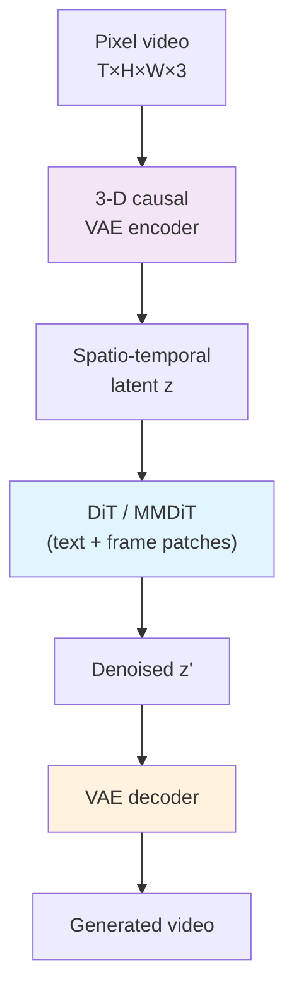
```mermaid
graph TD
    A["Pixel video<br/>T×H×W×3"] --> B["3-D causal<br/>VAE encoder"]
    B --> C["Spatio-temporal<br/>latent z"]
    C --> D["DiT / MMDiT<br/>(text + frame patches)"]
    D --> E["Denoised z'"]
    E --> F["VAE decoder"]
    F --> G["Generated video"]

    style B fill:#f3e5f5
    style D fill:#e1f5ff
    style F fill:#fff3e0
```

The full per-model list with citations and benchmark numbers is in [Diffusion Model Variants → Video Diffusion Models](#video-diffusion-models). The *VAE* side of this stack (CV-VAE, WF-VAE, IV-VAE, OD-VAE) is covered in the [VAE explainer's tokenizer section](vae-explained.md#recent-tokenizer-vae-advances-20242026).

### Post-Training: RLHF, DPO, Reward Models for Diffusion

As with LLMs, the 2024–2026 frontier is **post-training**, not pre-training:

- **DPO for diffusion** ([Wallace et al., 2024 — Diffusion-DPO](https://arxiv.org/abs/2311.12908)) — direct preference optimisation in $x_0$-space, no separate reward model needed.
- **DDPO** ([Black et al., 2024](https://arxiv.org/abs/2305.13301)) — REINFORCE-style RL with reward models (CLIP, aesthetic, OCR).
- **Reward-guided distillation** ([Kim et al., 2024](https://arxiv.org/abs/2403.11027)) — fine-tune the *distilled* student against a reward model.
- **RAFT, Aligning text-to-image, Reward-Imagenet** — a thread of large-scale reward-model-based fine-tunes that drove most of the 2024 SD/SDXL/Flux quality jump.

### A Brief Note on Anti-Diffusion: 2026 Critiques

A small but growing 2025–2026 thread questions the centrality of diffusion:

- **MAR** ([Li et al., 2024](https://arxiv.org/abs/2406.11838)) shows masked-AR generation can match diffusion quality.
- **VAR** ([Tian et al., 2024](https://arxiv.org/abs/2404.02905)) — visual autoregression with next-scale prediction; first AR model to beat DiT on ImageNet.
- **LDM-without-VAE** ([2025–2026](https://arxiv.org/abs/2510.15301)) — argues the VAE bottleneck hurts diffusion training; explores VAE-free LDMs.

These are *not* replacements for diffusion in the broad sense, but they suggest the algorithmic frontier is *unifying* (DiT, masked AR, flow matching, consistency, adversarial) rather than picking a single winner.

---

## Production Considerations

### Deployment Challenges

**Model Size** (full-precision FP32; FP16/BF16 halves these numbers):

- DDPM (256×256): ~200–500 MB.
- Stable Diffusion 1.5: 860 M-param U-Net + ~85 M-param VAE ≈ 4 GB total.
- SDXL: 2.6 B-param U-Net (≈ 10 GB).
- SD3 / SD3.5: 800 M to 8 B parameters (MMDiT).
- FLUX.1: 12 B parameters (~24 GB), distilled [schnell] variant runs much lighter at inference.

**Optimization Strategies**:

- **Model Pruning**: Remove 30-50% weights with <5% quality loss
- **Quantization**: INT8/FP16 reduces size 2-4× with minimal quality loss
- **Knowledge Distillation**: Train smaller student model

**Inference Optimization**:

- **ONNX Runtime**: 10-30% speedup
- **TensorRT**: 2-5× speedup on NVIDIA GPUs
- **JAX compilation**: Use `jax.jit` and `jax.lax.scan` to compile repeated denoising loops
- **Flash Attention**: 2-3× speedup for attention layers

**Hardware Requirements**:

- **Inference**: Minimum RTX 3060 (12GB) for 512×512
- **Recommended**: RTX 4090 (24GB) or professional GPUs
- **Edge Deployment**: Optimized models run on mobile (SD Turbo, LCM)

### Monitoring and Quality Control

**Quality Drift**:

Monitor generated samples over time for:

- Artifacts or distortions
- Color shifts
- Mode collapse
- Prompt adherence degradation

**Metrics**:

- **FID**: Track on validation set every N samples
- **CLIP Score**: For text-to-image, measure alignment
- **Human Evaluation**: A/B tests for subjective quality
- **Diversity Metrics**: Ensure mode coverage

**A/B Testing**:

Compare model versions using:

- FID/IS on held-out data
- Human preference studies (typically 1000+ comparisons)
- Production metrics (engagement, retention, quality reports)

### Ethical Considerations

!!! warning "Responsible Deployment"
    **Deepfakes and Misinformation**:

    Diffusion models enable photorealistic fake images/videos. Mitigation strategies:

    - Watermarking generated content
    - Provenance tracking (C2PA metadata)
    - Detection models for synthetic content
    - Usage policies and terms of service

    **Bias and Fairness**:

    Models inherit biases from training data (LAION-5B, etc.):

    - Underrepresentation of minorities
    - Stereotypical associations
    - Geographic/cultural biases

    Mitigation:

    - Balanced training data curation
    - Bias evaluation across demographics
    - Red-teaming for harmful generations

    **Copyright and Attribution**:

    Training on copyrighted images raises questions:

    - Fair use vs. infringement debates ongoing
    - Artist consent and compensation
    - Attribution for training data

    Best practices:

    - Respect opt-out requests (Have I Been Trained)
    - Consider ethical training data sources
    - Transparent documentation of training data

    **Environmental Impact**:

    Large-scale training requires massive compute:

    - ImageNet training: 1000s of GPU-hours
    - Stable Diffusion: ~150,000 A100-hours
    - SDXL: ~500,000 A100-hours

    Mitigation:

    - Efficient architectures (Latent Diffusion)
    - Distillation for deployment
    - Carbon-aware training scheduling
    - Renewable energy for data centers

### Safety Filters and Content Moderation

**Safety Classifiers**:

Pre-deployment filters to prevent harmful content:

- **NSFW Detection**: Classify unsafe content
- **Violence Detection**: Flag graphic violence
- **Hate Symbol Detection**: Block extremist imagery

**Prompt Filtering**:

- Block harmful prompt patterns
- Detect adversarial prompts
- Rate limiting for abuse prevention

**Post-Generation Filtering**:

- Run safety classifier on outputs
- Block unsafe images before showing user
- Log violations for monitoring

---

## Summary and Key Takeaways

Diffusion models have revolutionized generative AI through an elegant approach: learning to reverse a gradual noising process. By systematically destroying data structure through fixed forward diffusion and learning the reverse process through neural networks, these models achieve state-of-the-art quality with remarkable training stability.

**Core Principles**:

- **Forward diffusion** gradually corrupts data into pure noise over $T$ timesteps
- **Reverse diffusion** learns to progressively denoise, reconstructing data from noise
- **Training objective** reduces to simple MSE between predicted and actual noise
- **Sampling** iteratively applies learned denoising, refining noise into data

**Key Variants**:

- **DDPM**: Foundational stochastic sampling with 1000 steps.
- **DDIM**: Deterministic fast sampling reducing to 50–100 steps.
- **Latent Diffusion** (Stable Diffusion family): operates in a VAE latent space — the dominant production recipe.
- **Consistency Models / LCM / SiD / DMD2**: one-step or 1–4-step generation achieving 100–1000× speedups via distillation.
- **Rectified Flow / Flow-Matching DiTs**: straight-path ODEs powering SD3, FLUX.1, HunyuanVideo, Wan 2.2.
- **Diffusion Transformers (DiT, U-ViT, MMDiT, SiT)**: transformer backbones that scale better than U-Nets.
- **Autoregressive visual challengers (MAR, VAR)**: transformer image generators that borrow GPT-style scaling ideas rather than diffusion denoising.
- **Diffusion Language Models** (LLaDA, Mercury, Dream, ReFusion): masked discrete diffusion competitive with autoregressive baselines in selected 8B-scale settings.

**Architecture Innovations**:

- **U-Net** with skip connections — the classical backbone (DDPM, SD 1.x / 2.x, Imagen, ControlNet).
- **Diffusion Transformers (DiT, U-ViT, MMDiT, PixArt, HDiT, SiT, FiT)** — the dominant 2024–2026 backbone for new large-scale models; covered in [Beyond U-Net](#beyond-u-net-modern-architecture-alternatives-20232026).
- **adaLN / adaLN-Zero / adaLN-single** conditioning — the standard timestep-injection mechanism for transformer backbones.
- **Joint attention (MMDiT)** — concatenated text+image streams; the key innovation behind SD3 and FLUX.1's text rendering.
- **Sparse / linear-attention backbones** — DiT-MoE (16B sparse), DiM, DiG, EDiT, HDiT-style neighbourhood attention for high-resolution efficiency.
- **2-D RoPE positions** — variable-resolution / variable-aspect-ratio support (FiT, FLUX.1).
- **FlashAttention-2/3** + **feature caching** (DeepCache, L2C, TeaCache) — the implementation foundation that makes everything above trainable and deployable.

**Training Best Practices**:

- Use **cosine noise schedule** for better dynamics
- Apply **EMA** with decay 0.9999—critical for quality
- **Gradient clipping** and **mixed precision** for stability
- Monitor **visual samples** not just loss curves
- **Min-SNR weighting** for 3.4× faster convergence

**Sampling Methods**:

- **DDPM**: 1000 steps, highest quality at the slowest speed.
- **DDIM**: 50–100 steps, deterministic, 10–20× faster.
- **DPM-Solver / DPM-Solver++ / UniPC / DEIS**: 10–20 steps with high-order ODE solvers.
- **Consistency Models / LCM / SiD / DMD2 / ADD**: 1–4 distilled steps, near real-time at near-teacher quality.

**Guidance Techniques**:

- **Classifier-free guidance** as industry standard
- Guidance scale $w=7-8$ balances quality and diversity
- Higher $w$ increases fidelity, reduces diversity

**When to Use Diffusion Models**:

- Quality and diversity are paramount
- Denoising, super-resolution, inpainting, editing tasks
- Text-to-image, text-to-video generation
- Scientific applications (protein design, drug discovery)
- Training stability more important than inference speed

**Current Landscape (2025–2026)**:

- **Diffusion dominates** high-quality image, video, and 3D generation.
- **Distillation has closed the speed gap** — 1–4-step samplers (LCM, SDXL Turbo, DMD2, FLUX.1 [schnell]) approach teacher quality at near-GAN inference cost.
- **Rectified-flow DiTs** (SD3, FLUX.1, HunyuanVideo, Wan 2.2) are increasingly preferred over U-Net/DDPM recipes for new large-scale visual models.
- **Diffusion language models** (LLaDA, Mercury) are emerging as a serious AR-LLM alternative, with substantially lower decoding latency reported in selected settings.
- **Open-source video** (HunyuanVideo, Wan, Mochi-1, CogVideoX, LTX-Video) is rapidly closing the gap with Sora / Veo / Movie Gen.
- **Post-training** (DPO for diffusion, RLHF, reward models) drives most quality improvements at the application layer.

**Future Directions**:

- One-step **video** distillation at production scale ([APT, 2025](https://arxiv.org/abs/2501.08316)).
- **Diffusion LLMs** scaling past 70B parameters with multi-token-per-step decoding.
- Unified **multimodal foundation models** that share a single denoising backbone across image, video, audio, and text.
- **Edge / mobile** deployment via aggressive distillation + quantisation (SD Turbo, LCM-LoRA, Mercury).
- Scientific applications: protein design (RFdiffusion), molecular docking (DiffDock), materials science, medical imaging.
- Better theoretical understanding of *why* DiTs scale, *why* REPA accelerates training, and *why* adversarial distillation works so well.

Diffusion models in 2026 are no longer a single algorithmic family — they are a **shared mathematical substrate** (forward corruption + learned reverse) that absorbs ideas from GANs (adversarial post-training), VAEs (latent codec front-ends), autoregressive models (masked discrete diffusion), and normalising flows (rectified flow, flow matching). As architectures scale and sampling becomes more efficient, they will likely remain dominant for visual and multimodal generation while expanding into new modalities and scientific applications.

---

## Next Steps

<div class="grid cards" markdown>

- :material-book-open-variant:{ .lg .middle } **[Diffusion User Guide](../models/diffusion-guide.md)**

    ---

    Practical usage guide with implementation examples and training workflows

- :material-code-braces:{ .lg .middle } **[Diffusion API Reference](../../api/models/diffusion.md)**

    ---

    Complete API documentation for DDPM, DDIM, Latent Diffusion, and variants

- :material-school:{ .lg .middle } **[MNIST Tutorial](../../examples/basic/diffusion-mnist.md)**

    ---

    Step-by-step hands-on tutorial: train a diffusion model on MNIST from scratch

- :material-flask:{ .lg .middle } **[Advanced Examples](../../examples/index.md)**

    ---

    Explore Stable Diffusion, video diffusion, and state-of-the-art architectures

</div>

---

## Further Reading

### Seminal Papers (Must Read)

:material-file-document: **Sohl-Dickstein, J., Weiss, E., Maheswaranathan, N., & Ganguli, S. (2015).** "Deep Unsupervised Learning using Nonequilibrium Thermodynamics"<br>
&nbsp;&nbsp;&nbsp;&nbsp;:material-link: [arXiv:1503.03585](https://arxiv.org/abs/1503.03585) | [ICML 2015](https://proceedings.mlr.press/v37/sohl-dickstein15.html)<br>
&nbsp;&nbsp;&nbsp;&nbsp;:material-lightbulb-outline: The foundational paper introducing diffusion probabilistic models

:material-file-document: **Ho, J., Jain, A., & Abbeel, P. (2020).** "Denoising Diffusion Probabilistic Models"<br>
&nbsp;&nbsp;&nbsp;&nbsp;:material-link: [arXiv:2006.11239](https://arxiv.org/abs/2006.11239) | [NeurIPS 2020](https://proceedings.neurips.cc/paper/2020/hash/4c5bcfec8584af0d967f1ab10179ca4b-Abstract.html)<br>
&nbsp;&nbsp;&nbsp;&nbsp;:material-lightbulb-outline: DDPM: Made diffusion models practical with simplified training objective

:material-file-document: **Song, Y., Sohl-Dickstein, J., Kingma, D. P., Kumar, A., Ermon, S., & Poole, B. (2021).** "Score-Based Generative Modeling through Stochastic Differential Equations"<br>
&nbsp;&nbsp;&nbsp;&nbsp;:material-link: [arXiv:2011.13456](https://arxiv.org/abs/2011.13456) | [ICLR 2021 Outstanding Paper](https://openreview.net/forum?id=PxTIG12RRHS)<br>
&nbsp;&nbsp;&nbsp;&nbsp;:material-lightbulb-outline: Unified framework via SDEs, probability flow ODEs

:material-file-document: **Song, J., Meng, C., & Ermon, S. (2021).** "Denoising Diffusion Implicit Models"<br>
&nbsp;&nbsp;&nbsp;&nbsp;:material-link: [arXiv:2010.02502](https://arxiv.org/abs/2010.02502) | [ICLR 2021](https://openreview.net/forum?id=St1giarCHLP)<br>
&nbsp;&nbsp;&nbsp;&nbsp;:material-lightbulb-outline: DDIM: Fast deterministic sampling without retraining

:material-file-document: **Nichol, A., & Dhariwal, P. (2021).** "Improved Denoising Diffusion Probabilistic Models"<br>
&nbsp;&nbsp;&nbsp;&nbsp;:material-link: [arXiv:2102.09672](https://arxiv.org/abs/2102.09672) | [ICML 2021](https://proceedings.mlr.press/v139/nichol21a.html)<br>
&nbsp;&nbsp;&nbsp;&nbsp;:material-lightbulb-outline: Learned variances, cosine schedule, hybrid objective

:material-file-document: **Dhariwal, P., & Nichol, A. (2021).** "Diffusion Models Beat GANs on Image Synthesis"<br>
&nbsp;&nbsp;&nbsp;&nbsp;:material-link: [arXiv:2105.05233](https://arxiv.org/abs/2105.05233) | [NeurIPS 2021](https://proceedings.neurips.cc/paper/2021/hash/49ad23d1ec9fa4bd8d77d02681df5cfa-Abstract.html)<br>
&nbsp;&nbsp;&nbsp;&nbsp;:material-lightbulb-outline: Showed diffusion superiority, introduced classifier guidance

:material-file-document: **Rombach, R., Blattmann, A., Lorenz, D., Esser, P., & Ommer, B. (2022).** "High-Resolution Image Synthesis with Latent Diffusion Models"<br>
&nbsp;&nbsp;&nbsp;&nbsp;:material-link: [arXiv:2112.10752](https://arxiv.org/abs/2112.10752) | [CVPR 2022](https://openaccess.thecvf.com/content/CVPR2022/html/Rombach_High-Resolution_Image_Synthesis_With_Latent_Diffusion_Models_CVPR_2022_paper.html)<br>
&nbsp;&nbsp;&nbsp;&nbsp;:material-lightbulb-outline: Latent diffusion / Stable Diffusion: 2.7× speedup in VAE latent space

### Tutorial Papers and Surveys

:material-file-document: **Yang, L., Zhang, Z., Song, Y., Hong, S., Xu, R., Zhao, Y., ... & Cui, B. (2023).** Survey paper on diffusion methods and applications<br>
&nbsp;&nbsp;&nbsp;&nbsp;:material-link: [arXiv:2209.00796](https://arxiv.org/abs/2209.00796)<br>
&nbsp;&nbsp;&nbsp;&nbsp;:material-lightbulb-outline: Complete 150+ page survey covering theory and applications

:material-file-document: **Cao, H., Tan, C., Gao, Z., Chen, G., Heng, P. A., & Li, S. Z. (2023).** "A Survey on Generative Diffusion Models"<br>
&nbsp;&nbsp;&nbsp;&nbsp;:material-link: [arXiv:2209.02646](https://arxiv.org/abs/2209.02646)<br>
&nbsp;&nbsp;&nbsp;&nbsp;:material-lightbulb-outline: Covers mathematical foundations, applications, and future directions

:material-file-document: **Luo, C. (2022).** "Understanding Diffusion Models: A Unified Perspective"<br>
&nbsp;&nbsp;&nbsp;&nbsp;:material-link: [arXiv:2208.11970](https://arxiv.org/abs/2208.11970)<br>
&nbsp;&nbsp;&nbsp;&nbsp;:material-lightbulb-outline: Excellent tutorial connecting ELBO, score matching, and SDEs

### Important Variants and Extensions

:material-file-document: **Ramesh, A., Dhariwal, P., Nichol, A., Chu, C., & Chen, M. (2022).** "Hierarchical Text-Conditional Image Generation with CLIP Latents"<br>
&nbsp;&nbsp;&nbsp;&nbsp;:material-link: [arXiv:2204.06125](https://arxiv.org/abs/2204.06125)<br>
&nbsp;&nbsp;&nbsp;&nbsp;:material-lightbulb-outline: DALL·E 2: CLIP prior diffusion for text-to-image

:material-file-document: **Saharia, C., Chan, W., Saxena, S., Li, L., Whang, J., Denton, E., ... & Norouzi, M. (2022).** "Photorealistic Text-to-Image Diffusion Models with Deep Language Understanding"<br>
&nbsp;&nbsp;&nbsp;&nbsp;:material-link: [arXiv:2205.11487](https://arxiv.org/abs/2205.11487) | [NeurIPS 2022](https://proceedings.neurips.cc/paper_files/paper/2022/hash/ec795aeadae0b7d230fa35cbaf04c041-Abstract-Conference.html)<br>
&nbsp;&nbsp;&nbsp;&nbsp;:material-lightbulb-outline: Imagen: T5 text encoder with cascaded diffusion

:material-file-document: **Ho, J., & Salimans, T. (2022).** "Classifier-Free Diffusion Guidance"<br>
&nbsp;&nbsp;&nbsp;&nbsp;:material-link: [arXiv:2207.12598](https://arxiv.org/abs/2207.12598)<br>
&nbsp;&nbsp;&nbsp;&nbsp;:material-lightbulb-outline: Industry-standard guidance without auxiliary classifiers

:material-file-document: **Podell, D., English, Z., Lacey, K., Blattmann, A., Dockhorn, T., Müller, J., ... & Rombach, R. (2023).** "SDXL: Improving Latent Diffusion Models for High-Resolution Image Synthesis"<br>
&nbsp;&nbsp;&nbsp;&nbsp;:material-link: [arXiv:2307.01952](https://arxiv.org/abs/2307.01952)<br>
&nbsp;&nbsp;&nbsp;&nbsp;:material-lightbulb-outline: SDXL: 2.3B parameter upgrade to Stable Diffusion

:material-file-document: **Esser, P., Kulal, S., Blattmann, A., Entezari, R., Müller, J., Saini, H., ... & Rombach, R. (2024).** "Scaling Rectified Flow Transformers for High-Resolution Image Synthesis"<br>
&nbsp;&nbsp;&nbsp;&nbsp;:material-link: [arXiv:2403.03206](https://arxiv.org/abs/2403.03206)<br>
&nbsp;&nbsp;&nbsp;&nbsp;:material-lightbulb-outline: Stable Diffusion 3: Multimodal diffusion transformer

### Sampling and Acceleration

:material-file-document: **Lu, C., Zhou, Y., Bao, F., Chen, J., Li, C., & Zhu, J. (2022).** "DPM-Solver: A Fast ODE Solver for Diffusion Probabilistic Model Sampling in Around 10 Steps"<br>
&nbsp;&nbsp;&nbsp;&nbsp;:material-link: [arXiv:2206.00927](https://arxiv.org/abs/2206.00927) | [NeurIPS 2022](https://proceedings.neurips.cc/paper_files/paper/2022/hash/260a14acce2a89dad36adc8eefe7c59e-Abstract-Conference.html)<br>
&nbsp;&nbsp;&nbsp;&nbsp;:material-lightbulb-outline: 10-20 step high-quality sampling via ODE solvers

:material-file-document: **Lu, C., Zhou, Y., Bao, F., Chen, J., Li, C., & Zhu, J. (2023).** "DPM-Solver++: Fast Solver for Guided Sampling of Diffusion Probabilistic Models"<br>
&nbsp;&nbsp;&nbsp;&nbsp;:material-link: [arXiv:2211.01095](https://arxiv.org/abs/2211.01095)<br>
&nbsp;&nbsp;&nbsp;&nbsp;:material-lightbulb-outline: Improved stability for classifier-free guidance

:material-file-document: **Liu, L., Ren, Y., Lin, Z., & Zhao, Z. (2022).** "Pseudo Numerical Methods for Diffusion Models on Manifolds"<br>
&nbsp;&nbsp;&nbsp;&nbsp;:material-link: [arXiv:2202.09778](https://arxiv.org/abs/2202.09778) | [ICLR 2022](https://openreview.net/forum?id=PlKWVd2yBkY)<br>
&nbsp;&nbsp;&nbsp;&nbsp;:material-lightbulb-outline: PNDM: 20× speedup with quality improvement

:material-file-document: **Song, Y., Dhariwal, P., Chen, M., & Sutskever, I. (2023).** "Consistency Models"<br>
&nbsp;&nbsp;&nbsp;&nbsp;:material-link: [arXiv:2303.01469](https://arxiv.org/abs/2303.01469) | [ICML 2023](https://proceedings.mlr.press/v202/song23a.html)<br>
&nbsp;&nbsp;&nbsp;&nbsp;:material-lightbulb-outline: One-step generation via consistency distillation

:material-file-document: **Song, Y., Dhariwal, P., Chen, M., & Sutskever, I. (2023).** "Improved Techniques for Training Consistency Models"<br>
&nbsp;&nbsp;&nbsp;&nbsp;:material-link: [arXiv:2310.14189](https://arxiv.org/abs/2310.14189) | [ICLR 2024 Oral](https://openreview.net/forum?id=EjSlL2TbJ7)<br>
&nbsp;&nbsp;&nbsp;&nbsp;:material-lightbulb-outline: FID 2.51 in one step, 2.24 in two steps

:material-file-document: **Salimans, T., & Ho, J. (2022).** "Progressive Distillation for Fast Sampling of Diffusion Models"<br>
&nbsp;&nbsp;&nbsp;&nbsp;:material-link: [arXiv:2202.00512](https://arxiv.org/abs/2202.00512) | [ICLR 2022](https://openreview.net/forum?id=TIdIXIpzhoI)<br>
&nbsp;&nbsp;&nbsp;&nbsp;:material-lightbulb-outline: Iteratively halve sampling steps through distillation

### Architecture Innovations

:material-file-document: **Peebles, W., & Xie, S. (2023).** "Scalable Diffusion Models with Transformers"<br>
&nbsp;&nbsp;&nbsp;&nbsp;:material-link: [arXiv:2212.09748](https://arxiv.org/abs/2212.09748) | [ICCV 2023](https://openaccess.thecvf.com/content/ICCV2023/html/Peebles_Scalable_Diffusion_Models_with_Transformers_ICCV_2023_paper.html)<br>
&nbsp;&nbsp;&nbsp;&nbsp;:material-lightbulb-outline: DiT: Replaces U-Net with transformer, scales to billions of parameters

:material-file-document: **Bao, F., Nie, S., Xue, K., Cao, Y., Li, C., Su, H., & Zhu, J. (2023).** "All are Worth Words: A ViT Backbone for Diffusion Models"<br>
&nbsp;&nbsp;&nbsp;&nbsp;:material-link: [arXiv:2209.12152](https://arxiv.org/abs/2209.12152) | [CVPR 2023](https://openaccess.thecvf.com/content/CVPR2023/html/Bao_All_Are_Worth_Words_A_ViT_Backbone_for_Diffusion_Models_CVPR_2023_paper.html)<br>
&nbsp;&nbsp;&nbsp;&nbsp;:material-lightbulb-outline: U-ViT: Combines ViT with U-Net skip connections

:material-file-document: **Karras, T., Aittala, M., Aila, T., & Laine, S. (2022).** "Elucidating the Design Space of Diffusion-Based Generative Models"<br>
&nbsp;&nbsp;&nbsp;&nbsp;:material-link: [arXiv:2206.00364](https://arxiv.org/abs/2206.00364) | [NeurIPS 2022](https://proceedings.neurips.cc/paper_files/paper/2022/hash/a98846e9d9cc01cfb87eb694d946ce6b-Abstract-Conference.html)<br>
&nbsp;&nbsp;&nbsp;&nbsp;:material-lightbulb-outline: EDM: Unified framework, optimal preconditioning, FID 1.79

:material-file-document: **Karras, T., Aittala, M., Lehtinen, J., Hellsten, J., Aila, T., & Laine, S. (2024).** "Analyzing and Improving the Training Dynamics of Diffusion Models"<br>
&nbsp;&nbsp;&nbsp;&nbsp;:material-link: [arXiv:2312.02696](https://arxiv.org/abs/2312.02696) | [CVPR 2024 Oral](https://openaccess.thecvf.com/content/CVPR2024/html/Karras_Analyzing_and_Improving_the_Training_Dynamics_of_Diffusion_Models_CVPR_2024_paper.html)<br>
&nbsp;&nbsp;&nbsp;&nbsp;:material-lightbulb-outline: EDM2: FID 1.81 on ImageNet-512, post-hoc EMA

:material-file-document: **Crowson, K., et al. (2024).** "Scalable High-Resolution Pixel-Space Image Synthesis with Hourglass Diffusion Transformers" (HDiT, ICML)<br>
&nbsp;&nbsp;&nbsp;&nbsp;:material-link: [arXiv:2401.11605](https://arxiv.org/abs/2401.11605)<br>
&nbsp;&nbsp;&nbsp;&nbsp;:material-lightbulb-outline: Hierarchical pixel-space DiT with neighborhood attention; linear in pixel count, SOTA on FFHQ-1024².

:material-file-document: **Ma, N., Goldstein, M., Albergo, M. S., Boffi, N. M., Vanden-Eijnden, E., & Xie, S. (2024).** "SiT: Exploring Flow and Diffusion-based Generative Models with Scalable Interpolant Transformers" (ECCV)<br>
&nbsp;&nbsp;&nbsp;&nbsp;:material-link: [arXiv:2401.08740](https://arxiv.org/abs/2401.08740)<br>
&nbsp;&nbsp;&nbsp;&nbsp;:material-lightbulb-outline: DiT backbone trained with stochastic interpolants; FID 2.06 / 2.62 on ImageNet 256² / 512².

:material-file-document: **Chen, J., Yu, J., Ge, C., Yao, L., Xie, E., Wu, Y., ... & Li, Z. (2023).** "PixArt-α: Fast Training of Diffusion Transformer for Photorealistic Text-to-Image Synthesis"<br>
&nbsp;&nbsp;&nbsp;&nbsp;:material-link: [arXiv:2310.00426](https://arxiv.org/abs/2310.00426)<br>
&nbsp;&nbsp;&nbsp;&nbsp;:material-lightbulb-outline: 0.6B-parameter DiT with cross-attention + adaLN-single; matches SD 2.0 quality at ~12% of the compute.

:material-file-document: **Chen, J., et al. (2024).** "PixArt-Σ: Weak-to-Strong Training of Diffusion Transformer for 4K Text-to-Image Generation"<br>
&nbsp;&nbsp;&nbsp;&nbsp;:material-link: [arXiv:2403.04692](https://arxiv.org/abs/2403.04692)<br>
&nbsp;&nbsp;&nbsp;&nbsp;:material-lightbulb-outline: Direct 4K generation via weak-to-strong curriculum and KV-compression attention.

:material-file-document: **Tencent (2024).** "Hunyuan-DiT: A Powerful Multi-Resolution Diffusion Transformer with Fine-Grained Chinese Understanding"<br>
&nbsp;&nbsp;&nbsp;&nbsp;:material-link: [arXiv:2405.08748](https://arxiv.org/abs/2405.08748)<br>
&nbsp;&nbsp;&nbsp;&nbsp;:material-lightbulb-outline: 1.5B-parameter MMDiT-style backbone for English/Chinese T2I.

:material-file-document: **Lu, Z., et al. (2024).** "FiT: Flexible Vision Transformer for Diffusion Model" (ICML Spotlight)<br>
&nbsp;&nbsp;&nbsp;&nbsp;:material-link: [arXiv:2402.12376](https://arxiv.org/abs/2402.12376)<br>
&nbsp;&nbsp;&nbsp;&nbsp;:material-lightbulb-outline: Variable-resolution / arbitrary-aspect-ratio DiT via 2-D RoPE + masked MHSA.

:material-file-document: **Lu, Z., et al. (2024).** "FiTv2: Scalable and Improved Flexible Vision Transformer for Diffusion Model"<br>
&nbsp;&nbsp;&nbsp;&nbsp;:material-link: [arXiv:2410.13925](https://arxiv.org/abs/2410.13925)<br>
&nbsp;&nbsp;&nbsp;&nbsp;:material-lightbulb-outline: 2× faster convergence; introduces adaLN-LoRA, Q-K norm, rectified-flow schedule.

:material-file-document: **Fei, Z., et al. (2024).** "Scaling Diffusion Transformers to 16 Billion Parameters" (DiT-MoE)<br>
&nbsp;&nbsp;&nbsp;&nbsp;:material-link: [arXiv:2407.11633](https://arxiv.org/abs/2407.11633)<br>
&nbsp;&nbsp;&nbsp;&nbsp;:material-lightbulb-outline: Sparse Mixture-of-Experts DiT; 16.5B params, 3.1B active, FID 1.80 on ImageNet 512².

:material-file-document: **Park, B., et al. (2024).** "Switch Diffusion Transformer: Synergizing Denoising Tasks with Sparse Mixture-of-Experts" (ECCV)<br>
&nbsp;&nbsp;&nbsp;&nbsp;:material-link: [openreview Switch-DiT](https://byeongjun-park.github.io/Switch-DiT/)<br>
&nbsp;&nbsp;&nbsp;&nbsp;:material-lightbulb-outline: Per-timestep expert routing for DiT.

:material-file-document: **Apple (2024).** "EC-DiT: Scaling Diffusion Transformers with Adaptive Expert-Choice Routing"<br>
&nbsp;&nbsp;&nbsp;&nbsp;:material-link: [machinelearning.apple.com/research/ec-dit](https://machinelearning.apple.com/research/ec-dit)<br>
&nbsp;&nbsp;&nbsp;&nbsp;:material-lightbulb-outline: Expert-choice routing for diffusion MoE.

:material-file-document: **Teng, Y., et al. (2024).** "DiM: Diffusion Mamba for Efficient High-Resolution Image Synthesis"<br>
&nbsp;&nbsp;&nbsp;&nbsp;:material-link: [arXiv:2405.14224](https://arxiv.org/abs/2405.14224)<br>
&nbsp;&nbsp;&nbsp;&nbsp;:material-lightbulb-outline: Mamba SSM blocks replace attention; linear scaling at high resolution.

:material-file-document: **Phung, H., et al. (2024).** "DiMSUM: Diffusion Mamba — A Scalable and Unified Spatial-Frequency Method for Image Generation" (NeurIPS)<br>
&nbsp;&nbsp;&nbsp;&nbsp;:material-link: [openreview DiMSUM](https://openreview.net/forum?id=KqbLzSIXkm)<br>
&nbsp;&nbsp;&nbsp;&nbsp;:material-lightbulb-outline: Wavelet + Mamba diffusion backbone.

:material-file-document: **Zhu, L., et al. (2025).** "DiG: Scalable and Efficient Diffusion Models with Gated Linear Attention" (CVPR)<br>
&nbsp;&nbsp;&nbsp;&nbsp;:material-link: [arXiv:2405.18428](https://arxiv.org/abs/2405.18428)<br>
&nbsp;&nbsp;&nbsp;&nbsp;:material-lightbulb-outline: Gated linear attention for diffusion; 1.8× faster than Flash-DiT at 2048².

:material-file-document: **Suresh, S., et al. (2025).** "EDiT: Efficient Diffusion Transformers with Linear Compressed Attention"<br>
&nbsp;&nbsp;&nbsp;&nbsp;:material-link: [arXiv:2503.16726](https://arxiv.org/abs/2503.16726)<br>
&nbsp;&nbsp;&nbsp;&nbsp;:material-lightbulb-outline: MM-EDiT: linear-time image-to-image attention paired with softmax text-image attention.

:material-file-document: **Zhao, Y., et al. (2024–2025).** "DyDiT / DyDiT++: Diffusion Transformers with Timestep and Spatial Dynamics"<br>
&nbsp;&nbsp;&nbsp;&nbsp;:material-link: [arXiv:2504.06803](https://arxiv.org/abs/2504.06803)<br>
&nbsp;&nbsp;&nbsp;&nbsp;:material-lightbulb-outline: Adaptive computation along timestep + spatial axes; 51% FLOPs reduction on DiT-XL.

:material-file-document: **Ma, X., et al. (2024).** "Learning-to-Cache: Accelerating Diffusion Transformer via Layer Caching" (NeurIPS)<br>
&nbsp;&nbsp;&nbsp;&nbsp;:material-link: [proceedings/Paper-Conference.pdf](https://proceedings.neurips.cc/paper_files/paper/2024/file/f0b1515be276f6ba82b4f2b25e50bef0-Paper-Conference.pdf)<br>
&nbsp;&nbsp;&nbsp;&nbsp;:material-lightbulb-outline: Static layer caching across denoising steps.

:material-file-document: **(2026).** "DiffSparse: Accelerating Diffusion Transformers with Learned Token Sparsity" (ICLR 2026)<br>
&nbsp;&nbsp;&nbsp;&nbsp;:material-link: [arXiv:2604.03674](https://arxiv.org/abs/2604.03674)<br>
&nbsp;&nbsp;&nbsp;&nbsp;:material-lightbulb-outline: Differentiable layer-wise token sparsity for DiT acceleration.

:material-file-document: **Chen, C., et al. (2025).** "DiT-Air: Revisiting the Efficiency of Diffusion Model Architecture Design in Text-to-Image Generation"<br>
&nbsp;&nbsp;&nbsp;&nbsp;:material-link: [arXiv:2503.10618](https://arxiv.org/abs/2503.10618)<br>
&nbsp;&nbsp;&nbsp;&nbsp;:material-lightbulb-outline: 66% size reduction on MMDiT via layer-wise parameter sharing.

:material-file-document: **Alpha-VLLM (2024).** "Lumina-Next: Making Lumina-T2X Stronger and Faster with Next-DiT"<br>
&nbsp;&nbsp;&nbsp;&nbsp;:material-link: [arXiv:2406.18583](https://arxiv.org/abs/2406.18583)<br>
&nbsp;&nbsp;&nbsp;&nbsp;:material-lightbulb-outline: Unified multimodal MMDiT-style backbone (image, video, audio, 3D).

:material-file-document: **(2025).** "Lumina-Image 2.0: A Unified and Efficient Image Generative Framework"<br>
&nbsp;&nbsp;&nbsp;&nbsp;:material-link: [arXiv:2503.21758](https://arxiv.org/abs/2503.21758)<br>
&nbsp;&nbsp;&nbsp;&nbsp;:material-lightbulb-outline: Production iteration of Lumina-Next with TeaCache acceleration.

:material-file-document: **(ICLR Blogposts 2026).** "From U-Nets to DiTs: The Architectural Evolution of Text-to-Image Diffusion Models (2021–2025)"<br>
&nbsp;&nbsp;&nbsp;&nbsp;:material-link: [iclr-blogposts.github.io](https://iclr-blogposts.github.io/2026/blog/2026/diffusion-architecture-evolution/)<br>
&nbsp;&nbsp;&nbsp;&nbsp;:material-lightbulb-outline: Comprehensive timeline of the U-Net → DiT → MMDiT progression.

:material-file-document: **Wei, Y., et al. (2024).** "Unveiling the Secret of AdaLN-Zero in Diffusion Transformer"<br>
&nbsp;&nbsp;&nbsp;&nbsp;:material-link: [openreview AdaLN-Zero](https://openreview.net/forum?id=E4roJSM9RM)<br>
&nbsp;&nbsp;&nbsp;&nbsp;:material-lightbulb-outline: Theoretical analysis of why zero-init adaLN converges so much faster.

:material-file-document: **Tian, K., et al. (2024).** "Visual Autoregressive Modeling: Scalable Image Generation via Next-Scale Prediction" (VAR, NeurIPS Best Paper)<br>
&nbsp;&nbsp;&nbsp;&nbsp;:material-link: [arXiv:2404.02905](https://arxiv.org/abs/2404.02905)<br>
&nbsp;&nbsp;&nbsp;&nbsp;:material-lightbulb-outline: Next-scale autoregression beats DiT on ImageNet 256² (FID 1.73 vs 2.27); 20× faster inference.

:material-file-document: **Li, T., et al. (2024).** "Autoregressive Image Generation without Vector Quantization" (MAR)<br>
&nbsp;&nbsp;&nbsp;&nbsp;:material-link: [arXiv:2406.11838](https://arxiv.org/abs/2406.11838)<br>
&nbsp;&nbsp;&nbsp;&nbsp;:material-lightbulb-outline: Continuous-token AR with a per-token diffusion head; matches diffusion quality.

### Attention Patterns and Position Encodings

:material-file-document: **Vaswani, A., et al. (2017).** "Attention Is All You Need" (NeurIPS)<br>
&nbsp;&nbsp;&nbsp;&nbsp;:material-link: [arXiv:1706.03762](https://arxiv.org/abs/1706.03762)<br>
&nbsp;&nbsp;&nbsp;&nbsp;:material-lightbulb-outline: The original transformer / multi-head self-attention; foundational for every diffusion DiT.

:material-file-document: **Su, J., et al. (2024).** "RoFormer: Enhanced Transformer with Rotary Position Embedding" (RoPE)<br>
&nbsp;&nbsp;&nbsp;&nbsp;:material-link: [arXiv:2104.09864](https://arxiv.org/abs/2104.09864)<br>
&nbsp;&nbsp;&nbsp;&nbsp;:material-lightbulb-outline: Rotary position embeddings — the dominant choice in 2026 DiTs; 2-D variants underpin FiT and FLUX.

:material-file-document: **Dehghani, M., et al. (2023).** "Patch n' Pack: NaViT, a Vision Transformer for any Aspect Ratio and Resolution" (NeurIPS)<br>
&nbsp;&nbsp;&nbsp;&nbsp;:material-link: [arXiv:2307.06304](https://arxiv.org/abs/2307.06304)<br>
&nbsp;&nbsp;&nbsp;&nbsp;:material-lightbulb-outline: Variable-resolution / variable-aspect-ratio ViT; the basis of multi-aspect-ratio diffusion DiTs.

:material-file-document: **Liu, Z., et al. (2021).** "Swin Transformer: Hierarchical Vision Transformer using Shifted Windows" (ICCV Best Paper)<br>
&nbsp;&nbsp;&nbsp;&nbsp;:material-link: [arXiv:2103.14030](https://arxiv.org/abs/2103.14030)<br>
&nbsp;&nbsp;&nbsp;&nbsp;:material-lightbulb-outline: Shifted-window self-attention for vision; the conceptual predecessor of NA / HDiT's local attention.

:material-file-document: **Hassani, A., et al. (2023).** "Neighborhood Attention Transformer" (NAT, CVPR)<br>
&nbsp;&nbsp;&nbsp;&nbsp;:material-link: [arXiv:2204.07143](https://arxiv.org/abs/2204.07143)<br>
&nbsp;&nbsp;&nbsp;&nbsp;:material-lightbulb-outline: Linear-complexity sliding-window attention; the attention pattern HDiT uses at high resolution.

:material-file-document: **Katharopoulos, A., et al. (2020).** "Transformers are RNNs: Fast Autoregressive Transformers with Linear Attention" (ICML)<br>
&nbsp;&nbsp;&nbsp;&nbsp;:material-link: [arXiv:2006.16236](https://arxiv.org/abs/2006.16236)<br>
&nbsp;&nbsp;&nbsp;&nbsp;:material-lightbulb-outline: Foundational $O(N)$ kernelised attention.

:material-file-document: **Choromanski, K., et al. (2021).** "Rethinking Attention with Performers" (ICLR)<br>
&nbsp;&nbsp;&nbsp;&nbsp;:material-link: [arXiv:2009.14794](https://arxiv.org/abs/2009.14794)<br>
&nbsp;&nbsp;&nbsp;&nbsp;:material-lightbulb-outline: Random-feature linear attention with FAVOR+; broad ancestor of modern linear-attention diffusion backbones.

### Attention Implementation and Inference Acceleration

:material-file-document: **Dao, T., Fu, D. Y., Ermon, S., Rudra, A., & Ré, C. (2022).** "FlashAttention: Fast and Memory-Efficient Exact Attention with IO-Awareness" (NeurIPS)<br>
&nbsp;&nbsp;&nbsp;&nbsp;:material-link: [arXiv:2205.14135](https://arxiv.org/abs/2205.14135)<br>
&nbsp;&nbsp;&nbsp;&nbsp;:material-lightbulb-outline: IO-aware tiled exact attention; the basis of essentially every modern DiT training stack.

:material-file-document: **Dao, T. (2023).** "FlashAttention-2: Faster Attention with Better Parallelism and Work Partitioning"<br>
&nbsp;&nbsp;&nbsp;&nbsp;:material-link: [arXiv:2307.08691](https://arxiv.org/abs/2307.08691)<br>
&nbsp;&nbsp;&nbsp;&nbsp;:material-lightbulb-outline: 2× faster than FA-1; ~70 % of A100 theoretical FLOPS.

:material-file-document: **Shah, J., et al. (2024).** "FlashAttention-3: Fast and Accurate Attention with Asynchrony and Low-precision"<br>
&nbsp;&nbsp;&nbsp;&nbsp;:material-link: [arXiv:2407.08608](https://arxiv.org/abs/2407.08608)<br>
&nbsp;&nbsp;&nbsp;&nbsp;:material-lightbulb-outline: Hopper-optimised; uses async Tensor Cores and TMA for FP8 / BF16 long-context attention.

:material-file-document: **Bolya, D., & Hoffman, J. (2023).** "Token Merging for Fast Stable Diffusion" (CVPRW)<br>
&nbsp;&nbsp;&nbsp;&nbsp;:material-link: [arXiv:2303.17604](https://arxiv.org/abs/2303.17604)<br>
&nbsp;&nbsp;&nbsp;&nbsp;:material-lightbulb-outline: ToMeSD — 2× speedup, 5.6× memory reduction on Stable Diffusion via training-free token merging.

:material-file-document: **(2025).** "ToMA: Token Merge with Attention for Diffusion Models"<br>
&nbsp;&nbsp;&nbsp;&nbsp;:material-link: [arXiv:2509.10918](https://arxiv.org/abs/2509.10918)<br>
&nbsp;&nbsp;&nbsp;&nbsp;:material-lightbulb-outline: Token merging adapted specifically for diffusion *transformers*.

:material-file-document: **Ma, X., Fang, G., & Wang, X. (2024).** "DeepCache: Accelerating Diffusion Models for Free" (CVPR)<br>
&nbsp;&nbsp;&nbsp;&nbsp;:material-link: [arXiv:2312.00858](https://arxiv.org/abs/2312.00858)<br>
&nbsp;&nbsp;&nbsp;&nbsp;:material-lightbulb-outline: Training-free U-Net feature caching across denoising steps; ~2× speedup.

:material-file-document: **(2025).** "LiteAttention: A Temporal Sparse Attention for Diffusion Transformers"<br>
&nbsp;&nbsp;&nbsp;&nbsp;:material-link: [arXiv:2511.11062](https://arxiv.org/abs/2511.11062)<br>
&nbsp;&nbsp;&nbsp;&nbsp;:material-lightbulb-outline: Sparse temporal attention for video DiTs.

:material-file-document: **(2026).** "FrameDiT: Diffusion Transformer with Frame-Level Matrix Attention for Efficient Video Generation"<br>
&nbsp;&nbsp;&nbsp;&nbsp;:material-link: [arXiv:2603.09721](https://arxiv.org/abs/2603.09721)<br>
&nbsp;&nbsp;&nbsp;&nbsp;:material-lightbulb-outline: Frame-level matrix attention for high-quality, efficient video diffusion.

### Flow Matching and Optimal Transport

:material-file-document: **Lipman, Y., Chen, R. T. Q., Ben-Hamu, H., Nickel, M., & Le, M. (2023).** "Flow Matching for Generative Modeling"<br>
&nbsp;&nbsp;&nbsp;&nbsp;:material-link: [arXiv:2210.02747](https://arxiv.org/abs/2210.02747) | [ICLR 2023](https://openreview.net/forum?id=PqvMRDCJT9t)<br>
&nbsp;&nbsp;&nbsp;&nbsp;:material-lightbulb-outline: Simulation-free training of continuous normalizing flows

:material-file-document: **Liu, X., Gong, C., & Liu, Q. (2023).** "Flow Straight and Fast: Learning to Generate and Transfer Data with Rectified Flow"<br>
&nbsp;&nbsp;&nbsp;&nbsp;:material-link: [arXiv:2209.03003](https://arxiv.org/abs/2209.03003) | [ICLR 2023](https://openreview.net/forum?id=XVjTT1nw5z)<br>
&nbsp;&nbsp;&nbsp;&nbsp;:material-lightbulb-outline: Straight-line ODE paths, reflow operation

:material-file-document: **Esser, P., Kulal, S., Blattmann, A., Entezari, R., Müller, J., Saini, H., ... & Rombach, R. (2024).** "Scaling Rectified Flow Transformers for High-Resolution Image Synthesis"<br>
&nbsp;&nbsp;&nbsp;&nbsp;:material-link: [arXiv:2403.03206](https://arxiv.org/abs/2403.03206)<br>
&nbsp;&nbsp;&nbsp;&nbsp;:material-lightbulb-outline: Stable Diffusion 3 technical report

:material-file-document: **Albergo, M. S., & Vanden-Eijnden, E. (2023).** "Building Normalizing Flows with Stochastic Interpolants"<br>
&nbsp;&nbsp;&nbsp;&nbsp;:material-link: [arXiv:2303.08797](https://arxiv.org/abs/2303.08797)<br>
&nbsp;&nbsp;&nbsp;&nbsp;:material-lightbulb-outline: Stochastic interpolants framework — generalises flow matching with stochastic couplings.

:material-file-document: **Black Forest Labs (2024).** "FLUX.1: Open-weights Rectified-flow Transformer for Text-to-Image"<br>
&nbsp;&nbsp;&nbsp;&nbsp;:material-link: [github.com/black-forest-labs/flux](https://github.com/black-forest-labs/flux)<br>
&nbsp;&nbsp;&nbsp;&nbsp;:material-lightbulb-outline: 12 B-parameter rectified-flow transformer; FLUX.1 [schnell] is a 1–4-step open-weights model.

### Distillation and Few-Step Generation (2023–2026)

:material-file-document: **Luo, S., Tan, Y., Huang, L., Li, J., & Zhao, H. (2023).** "Latent Consistency Models: Synthesizing High-Resolution Images with Few-step Inference"<br>
&nbsp;&nbsp;&nbsp;&nbsp;:material-link: [arXiv:2310.04378](https://arxiv.org/abs/2310.04378)<br>
&nbsp;&nbsp;&nbsp;&nbsp;:material-lightbulb-outline: 2–4-step distillation of any latent diffusion model; ~32 A100-hours.

:material-file-document: **Luo, S., et al. (2023).** "LCM-LoRA: A Universal Stable-Diffusion Acceleration Module"<br>
&nbsp;&nbsp;&nbsp;&nbsp;:material-link: [arXiv:2311.05556](https://arxiv.org/abs/2311.05556)<br>
&nbsp;&nbsp;&nbsp;&nbsp;:material-lightbulb-outline: LoRA-based plug-in accelerator that drops into any SD fine-tune without retraining.

:material-file-document: **Sauer, A., Lorenz, D., Blattmann, A., & Rombach, R. (2023).** "Adversarial Diffusion Distillation" (ADD / SDXL Turbo)<br>
&nbsp;&nbsp;&nbsp;&nbsp;:material-link: [arXiv:2311.17042](https://arxiv.org/abs/2311.17042)<br>
&nbsp;&nbsp;&nbsp;&nbsp;:material-lightbulb-outline: 1–4-step distillation of SDXL with a frozen DINOv2 discriminator; the recipe behind SDXL Turbo.

:material-file-document: **Zhou, M., Zheng, H., Wang, Z., Yin, M., & Huang, H. (2024).** "Score Identity Distillation: Exponentially Fast Distillation of Pretrained Diffusion Models for One-Step Generation" (ICML)<br>
&nbsp;&nbsp;&nbsp;&nbsp;:material-link: [arXiv:2404.04057](https://arxiv.org/abs/2404.04057)<br>
&nbsp;&nbsp;&nbsp;&nbsp;:material-lightbulb-outline: SiD/SiDA — three score identities yield exponential FID decay.

:material-file-document: **Yin, T., et al. (2024).** "Improved Distribution Matching Distillation for Fast Image Synthesis" (DMD2, NeurIPS Oral)<br>
&nbsp;&nbsp;&nbsp;&nbsp;:material-link: [arXiv:2405.14867](https://arxiv.org/abs/2405.14867)<br>
&nbsp;&nbsp;&nbsp;&nbsp;:material-lightbulb-outline: Current SOTA one-step image generation: FID 1.28 (ImageNet 64²).

:material-file-document: **Kim, D., et al. (2024).** "Consistency Trajectory Models" (CTM)<br>
&nbsp;&nbsp;&nbsp;&nbsp;:material-link: [arXiv:2310.02279](https://arxiv.org/abs/2310.02279)<br>
&nbsp;&nbsp;&nbsp;&nbsp;:material-lightbulb-outline: FID 1.73 in one step on CIFAR-10.

:material-file-document: **Kang, M., et al. (2024).** "Distilling Diffusion Models into Conditional GANs" (Diffusion2GAN)<br>
&nbsp;&nbsp;&nbsp;&nbsp;:material-link: [arXiv:2405.05967](https://arxiv.org/abs/2405.05967)<br>
&nbsp;&nbsp;&nbsp;&nbsp;:material-lightbulb-outline: 1-step megapixel synthesis via E-LatentLPIPS + GAN distillation.

:material-file-document: **Lin, S., et al. (2025).** "Diffusion Adversarial Post-Training for One-Step Video Generation" (APT)<br>
&nbsp;&nbsp;&nbsp;&nbsp;:material-link: [arXiv:2501.08316](https://arxiv.org/abs/2501.08316)<br>
&nbsp;&nbsp;&nbsp;&nbsp;:material-lightbulb-outline: Single-step adversarial distillation for video diffusion.

### Training Acceleration and Representation Learning

:material-file-document: **Hang, T., et al. (2023).** "Efficient Diffusion Training via Min-SNR Weighting Strategy"<br>
&nbsp;&nbsp;&nbsp;&nbsp;:material-link: [arXiv:2303.09556](https://arxiv.org/abs/2303.09556)<br>
&nbsp;&nbsp;&nbsp;&nbsp;:material-lightbulb-outline: 3.4× training speedup via SNR-clipped loss weighting; per-parameterisation weight formulae.

:material-file-document: **Choi, J., et al. (2022).** "Perception Prioritized Training of Diffusion Models" (P2-weighting, CVPR)<br>
&nbsp;&nbsp;&nbsp;&nbsp;:material-link: [arXiv:2204.00227](https://arxiv.org/abs/2204.00227)<br>
&nbsp;&nbsp;&nbsp;&nbsp;:material-lightbulb-outline: SNR-based loss weighting that prioritises perceptually-rich timesteps; widely used on ImageNet 256².

:material-file-document: **Yu, S., et al. (2024).** "Representation Alignment for Generation: Training Diffusion Transformers Is Easier Than You Think" (REPA, ICLR'25 Oral)<br>
&nbsp;&nbsp;&nbsp;&nbsp;:material-link: [arXiv:2410.06940](https://arxiv.org/abs/2410.06940)<br>
&nbsp;&nbsp;&nbsp;&nbsp;:material-lightbulb-outline: 17.5× faster SiT-XL training via DINOv2 feature alignment; FID 1.42 on ImageNet 256².

### Time / Noise-Level Conditioning

:material-file-document: **Tancik, M., et al. (2020).** "Fourier Features Let Networks Learn High Frequency Functions in Low Dimensional Domains" (NeurIPS)<br>
&nbsp;&nbsp;&nbsp;&nbsp;:material-link: [arXiv:2006.10739](https://arxiv.org/abs/2006.10739)<br>
&nbsp;&nbsp;&nbsp;&nbsp;:material-lightbulb-outline: Random Fourier features for low-dim scalar inputs; the basis of NCSN++ / EDM time embeddings.

:material-file-document: **Kingma, D. P., et al. (2021).** "Variational Diffusion Models" (VDM, NeurIPS)<br>
&nbsp;&nbsp;&nbsp;&nbsp;:material-link: [arXiv:2107.00630](https://arxiv.org/abs/2107.00630)<br>
&nbsp;&nbsp;&nbsp;&nbsp;:material-lightbulb-outline: Argues for **log-SNR** as the natural time coordinate; learnable noise schedule.

:material-file-document: **Sun, Q., et al. (2025).** "Is Noise Conditioning Necessary for Denoising Generative Models?" (ICML)<br>
&nbsp;&nbsp;&nbsp;&nbsp;:material-link: [arXiv:2502.13129](https://arxiv.org/abs/2502.13129)<br>
&nbsp;&nbsp;&nbsp;&nbsp;:material-lightbulb-outline: Surprising empirical result: removing time conditioning altogether produces only a small quality gap.

:material-file-document: **(NeurIPS 2025).** "Is Noise Conditioning Necessary? A Unified Theory of Unconditional Graph Diffusion Models"<br>
&nbsp;&nbsp;&nbsp;&nbsp;:material-link: [arXiv:2505.22935](https://arxiv.org/abs/2505.22935)<br>
&nbsp;&nbsp;&nbsp;&nbsp;:material-lightbulb-outline: Same finding holds in graph diffusion, with 4–6 % parameter and 8–10 % compute savings.

### Diffusion Language Models (2024–2026)

:material-file-document: **Austin, J., et al. (2021).** "Structured Denoising Diffusion Models in Discrete State-Spaces" (D3PM)<br>
&nbsp;&nbsp;&nbsp;&nbsp;:material-link: [arXiv:2107.03006](https://arxiv.org/abs/2107.03006)<br>
&nbsp;&nbsp;&nbsp;&nbsp;:material-lightbulb-outline: Foundational discrete diffusion framework that LLaDA / Mercury build on.

:material-file-document: **Nie, S., et al. (2025).** "Large Language Diffusion Models" (LLaDA)<br>
&nbsp;&nbsp;&nbsp;&nbsp;:material-link: [arXiv:2502.09992](https://arxiv.org/abs/2502.09992)<br>
&nbsp;&nbsp;&nbsp;&nbsp;:material-lightbulb-outline: 8B-parameter masked-diffusion LLM; competitive with LLaMA3-8B on instruction following.

:material-file-document: **Inception Labs (2025).** "Mercury: Ultra-Fast Language Models Based on Diffusion"<br>
&nbsp;&nbsp;&nbsp;&nbsp;:material-link: [arXiv:2506.17298](https://arxiv.org/abs/2506.17298)<br>
&nbsp;&nbsp;&nbsp;&nbsp;:material-lightbulb-outline: First commercial-scale diffusion LLM; 92 ms latency vs ~450 ms for AR baselines.

:material-file-document: **(2025–26).** "ReFusion: A Diffusion Large Language Model with Parallel Autoregressive Decoding"<br>
&nbsp;&nbsp;&nbsp;&nbsp;:material-link: [arXiv:2512.13586](https://arxiv.org/abs/2512.13586)<br>
&nbsp;&nbsp;&nbsp;&nbsp;:material-lightbulb-outline: Interleaves diffusion-based selection with AR infilling; 18× speedup with KV-cache reuse.

:material-file-document: **VILA-Lab (2025).** "Awesome-DLMs: A Survey on Diffusion Language Models" (continuously updated)<br>
&nbsp;&nbsp;&nbsp;&nbsp;:material-link: [github.com/VILA-Lab/Awesome-DLMs](https://github.com/VILA-Lab/Awesome-DLMs)<br>
&nbsp;&nbsp;&nbsp;&nbsp;:material-lightbulb-outline: Tracking the diffusion-LLM literature.

### Post-Training and Alignment

:material-file-document: **Wallace, B., et al. (2024).** "Diffusion Model Alignment Using Direct Preference Optimization" (Diffusion-DPO, CVPR 2024)<br>
&nbsp;&nbsp;&nbsp;&nbsp;:material-link: [arXiv:2311.12908](https://arxiv.org/abs/2311.12908)<br>
&nbsp;&nbsp;&nbsp;&nbsp;:material-lightbulb-outline: DPO for diffusion — no separate reward model needed.

:material-file-document: **Black, K., et al. (2024).** "Training Diffusion Models with Reinforcement Learning" (DDPO)<br>
&nbsp;&nbsp;&nbsp;&nbsp;:material-link: [arXiv:2305.13301](https://arxiv.org/abs/2305.13301)<br>
&nbsp;&nbsp;&nbsp;&nbsp;:material-lightbulb-outline: REINFORCE-style RL for diffusion against CLIP / aesthetic / OCR rewards.

### Recent Surveys (last 6 months)

:material-file-document: **(2024–2025).** "Efficient Diffusion Models: A Comprehensive Survey from Principles to Practices"<br>
&nbsp;&nbsp;&nbsp;&nbsp;:material-link: [arXiv:2410.11795](https://arxiv.org/abs/2410.11795)<br>
&nbsp;&nbsp;&nbsp;&nbsp;:material-lightbulb-outline: Algorithm-, system-, and framework-level taxonomy of efficiency techniques.

:material-file-document: **(2025).** "Efficient Diffusion Models: A Survey"<br>
&nbsp;&nbsp;&nbsp;&nbsp;:material-link: [arXiv:2502.06805](https://arxiv.org/abs/2502.06805)<br>
&nbsp;&nbsp;&nbsp;&nbsp;:material-lightbulb-outline: Sampling acceleration, model compression, distillation.

:material-file-document: **(2025).** "Survey of Video Diffusion Models: Foundations, Implementations, and Applications"<br>
&nbsp;&nbsp;&nbsp;&nbsp;:material-link: [arXiv:2504.16081](https://arxiv.org/abs/2504.16081)<br>
&nbsp;&nbsp;&nbsp;&nbsp;:material-lightbulb-outline: Comprehensive review of diffusion-based video generation.

### Video and 3D Generation

:material-file-document: **Ho, J., Chan, W., Saharia, C., Whang, J., Gao, R., Gritsenko, A., ... & Salimans, T. (2022).** "Imagen Video: High Definition Video Generation with Diffusion Models"<br>
&nbsp;&nbsp;&nbsp;&nbsp;:material-link: [arXiv:2210.02303](https://arxiv.org/abs/2210.02303)<br>
&nbsp;&nbsp;&nbsp;&nbsp;:material-lightbulb-outline: Cascaded video diffusion with temporal attention

:material-file-document: **Brooks, T., Peebles, B., Holmes, C., DePue, W., Guo, Y., Jing, L., ... & Ramesh, A. (2024).** "Video Generation Models as World Simulators"<br>
&nbsp;&nbsp;&nbsp;&nbsp;:material-link: [OpenAI Technical Report](https://openai.com/research/video-generation-models-as-world-simulators)<br>
&nbsp;&nbsp;&nbsp;&nbsp;:material-lightbulb-outline: Sora: Diffusion transformer on spacetime patches

:material-file-document: **Poole, B., Jain, A., Barron, J. T., & Mildenhall, B. (2022).** "DreamFusion: Text-to-3D using 2D Diffusion"<br>
&nbsp;&nbsp;&nbsp;&nbsp;:material-link: [arXiv:2209.14988](https://arxiv.org/abs/2209.14988)<br>
&nbsp;&nbsp;&nbsp;&nbsp;:material-lightbulb-outline: Score Distillation Sampling for 3D generation

:material-file-document: **Lin, C.-H., Gao, J., Tang, L., Takikawa, T., Zeng, X., Huang, X., ... & Fidler, S. (2023).** "Magic3D: High-Resolution Text-to-3D Content Creation"<br>
&nbsp;&nbsp;&nbsp;&nbsp;:material-link: [arXiv:2211.10440](https://arxiv.org/abs/2211.10440) | [CVPR 2023](https://openaccess.thecvf.com/content/CVPR2023/html/Lin_Magic3D_High-Resolution_Text-to-3D_Content_Creation_CVPR_2023_paper.html)<br>
&nbsp;&nbsp;&nbsp;&nbsp;:material-lightbulb-outline: Two-stage coarse-to-fine 3D generation

### Scientific Applications

:material-file-document: **Watson, J. L., Juergens, D., Bennett, N. R., Trippe, B. L., Yim, J., Eisenach, H. E., ... & Baker, D. (2023).** "De novo design of protein structure and function with RFdiffusion"<br>
&nbsp;&nbsp;&nbsp;&nbsp;:material-link: [Nature 620, 1089–1100](https://www.nature.com/articles/s41586-023-06415-8)<br>
&nbsp;&nbsp;&nbsp;&nbsp;:material-lightbulb-outline: Protein design via diffusion achieving experimental validation

:material-file-document: **Corso, G., Stärk, H., Jing, B., Barzilay, R., & Jaakkola, T. (2022).** "DiffDock: Diffusion Steps, Twists, and Turns for Molecular Docking"<br>
&nbsp;&nbsp;&nbsp;&nbsp;:material-link: [arXiv:2210.01776](https://arxiv.org/abs/2210.01776) | [ICLR 2023](https://openreview.net/forum?id=kKF8_K-mBbS)<br>
&nbsp;&nbsp;&nbsp;&nbsp;:material-lightbulb-outline: Molecular docking as generative modeling

:material-file-document: **Hoogeboom, E., Satorras, V. G., Vignac, C., & Welling, M. (2022).** "Equivariant Diffusion for Molecule Generation in 3D"<br>
&nbsp;&nbsp;&nbsp;&nbsp;:material-link: [arXiv:2203.17003](https://arxiv.org/abs/2203.17003) | [ICML 2022](https://proceedings.mlr.press/v162/hoogeboom22a.html)<br>
&nbsp;&nbsp;&nbsp;&nbsp;:material-lightbulb-outline: E(3)-equivariant diffusion for drug molecule design

### Image Editing and Control

:material-file-document: **Lugmayr, A., Danelljan, M., Romero, A., Yu, F., Timofte, R., & Van Gool, L. (2022).** "RePaint: Inpainting using Denoising Diffusion Probabilistic Models"<br>
&nbsp;&nbsp;&nbsp;&nbsp;:material-link: [arXiv:2201.09865](https://arxiv.org/abs/2201.09865) | [CVPR 2022](https://openaccess.thecvf.com/content/CVPR2022/html/Lugmayr_RePaint_Inpainting_Using_Denoising_Diffusion_Probabilistic_Models_CVPR_2022_paper.html)<br>
&nbsp;&nbsp;&nbsp;&nbsp;:material-lightbulb-outline: Mask-agnostic inpainting with pretrained models

:material-file-document: **Meng, C., He, Y., Song, Y., Song, J., Wu, J., Zhu, J. Y., & Ermon, S. (2022).** "SDEdit: Guided Image Synthesis and Editing with Stochastic Differential Equations"<br>
&nbsp;&nbsp;&nbsp;&nbsp;:material-link: [arXiv:2108.01073](https://arxiv.org/abs/2108.01073) | [ICLR 2022](https://openreview.net/forum?id=aBsCjcPu_tE)<br>
&nbsp;&nbsp;&nbsp;&nbsp;:material-lightbulb-outline: Edit images via noise addition and denoising

:material-file-document: **Brooks, T., Holynski, A., & Efros, A. A. (2023).** "InstructPix2Pix: Learning to Follow Image Editing Instructions"<br>
&nbsp;&nbsp;&nbsp;&nbsp;:material-link: [arXiv:2211.09800](https://arxiv.org/abs/2211.09800) | [CVPR 2023](https://openaccess.thecvf.com/content/CVPR2023/html/Brooks_InstructPix2Pix_Learning_To_Follow_Image_Editing_Instructions_CVPR_2023_paper.html)<br>
&nbsp;&nbsp;&nbsp;&nbsp;:material-lightbulb-outline: Edit images from natural language instructions

:material-file-document: **Zhang, L., Rao, A., & Agrawala, M. (2023).** "Adding Conditional Control to Text-to-Image Diffusion Models"<br>
&nbsp;&nbsp;&nbsp;&nbsp;:material-link: [arXiv:2302.05543](https://arxiv.org/abs/2302.05543) | [ICCV 2023](https://openaccess.thecvf.com/content/ICCV2023/html/Zhang_Adding_Conditional_Control_to_Text-to-Image_Diffusion_Models_ICCV_2023_paper.html)<br>
&nbsp;&nbsp;&nbsp;&nbsp;:material-lightbulb-outline: ControlNet: Spatial conditioning with edges, depth, pose

### Online Resources and Code

:material-web: **Lilian Weng's Blog: "What are Diffusion Models?"**<br>
&nbsp;&nbsp;&nbsp;&nbsp;:material-link: [lilianweng.github.io/posts/2021-07-11-diffusion-models](https://lilianweng.github.io/posts/2021-07-11-diffusion-models/)<br>
&nbsp;&nbsp;&nbsp;&nbsp;:material-lightbulb-outline: Complete blog post with excellent visualizations and intuitions

:material-web: **Yang Song's Blog: "Generative Modeling by Estimating Gradients of the Data Distribution"**<br>
&nbsp;&nbsp;&nbsp;&nbsp;:material-link: [yang-song.net/blog/2021/score](https://yang-song.net/blog/2021/score/)<br>
&nbsp;&nbsp;&nbsp;&nbsp;:material-lightbulb-outline: Deep dive into score-based models and SDEs

:material-github: **Hugging Face Diffusers Library**<br>
&nbsp;&nbsp;&nbsp;&nbsp;:material-link: [github.com/huggingface/diffusers](https://github.com/huggingface/diffusers)<br>
&nbsp;&nbsp;&nbsp;&nbsp;:material-lightbulb-outline: Production-ready implementations: DDPM, DDIM, Stable Diffusion, ControlNet

:material-github: **Stability AI: Stable Diffusion Official Repository**<br>
&nbsp;&nbsp;&nbsp;&nbsp;:material-link: [github.com/Stability-AI/generative-models](https://github.com/Stability-AI/generative-models)<br>
&nbsp;&nbsp;&nbsp;&nbsp;:material-lightbulb-outline: Official implementation of Stable Diffusion models

:material-github: **CompVis: Latent Diffusion Models**<br>
&nbsp;&nbsp;&nbsp;&nbsp;:material-link: [github.com/CompVis/latent-diffusion](https://github.com/CompVis/latent-diffusion)<br>
&nbsp;&nbsp;&nbsp;&nbsp;:material-lightbulb-outline: Original latent diffusion implementation

:material-github: **Denoising Diffusion PyTorch**<br>
&nbsp;&nbsp;&nbsp;&nbsp;:material-link: [github.com/lucidrains/denoising-diffusion-pytorch](https://github.com/lucidrains/denoising-diffusion-pytorch)<br>
&nbsp;&nbsp;&nbsp;&nbsp;:material-lightbulb-outline: Clean, well-documented PyTorch implementations

### Books and Complete Tutorials

:material-book: **Prince, S. J. D. (2023).** "Understanding Deep Learning"<br>
&nbsp;&nbsp;&nbsp;&nbsp;:material-link: Chapter on Diffusion Models | [udlbook.github.io/udlbook](https://udlbook.github.io/udlbook/)<br>
&nbsp;&nbsp;&nbsp;&nbsp;:material-lightbulb-outline: Excellent pedagogical treatment with visualizations

:material-book: **Murphy, K. P. (2023).** "Probabilistic Machine Learning: Advanced Topics"<br>
&nbsp;&nbsp;&nbsp;&nbsp;:material-link: Chapter on Score-Based and Diffusion Models | MIT Press<br>
&nbsp;&nbsp;&nbsp;&nbsp;:material-lightbulb-outline: Rigorous mathematical treatment

:material-web: **Hugging Face Diffusion Models Course**<br>
&nbsp;&nbsp;&nbsp;&nbsp;:material-link: [huggingface.co/learn/diffusion-course](https://huggingface.co/learn/diffusion-course)<br>
&nbsp;&nbsp;&nbsp;&nbsp;:material-lightbulb-outline: Hands-on tutorials from basics to advanced topics

---

**Ready to build with diffusion models?** Start with the [Diffusion User Guide](../models/diffusion-guide.md) for practical implementations, check the [API Reference](../../api/models/diffusion.md) for complete documentation, or dive into the [MNIST Tutorial](../../examples/basic/diffusion-mnist.md) to train your first diffusion model from scratch!
