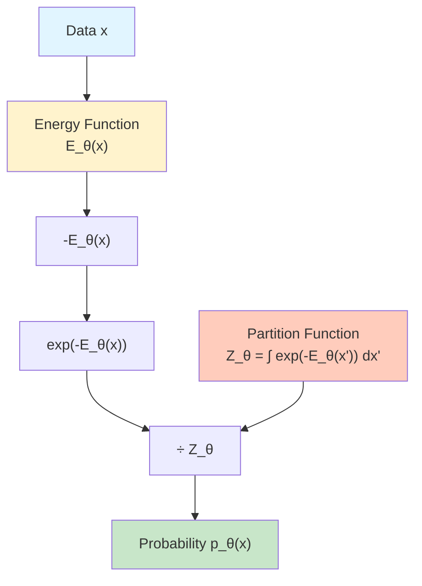
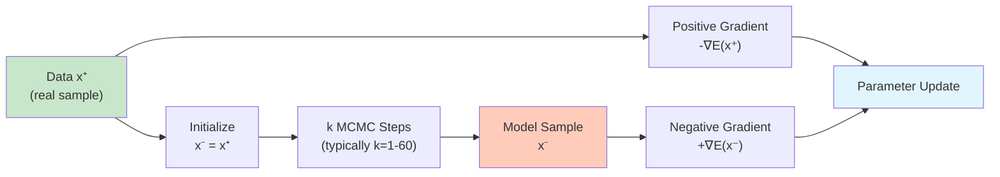
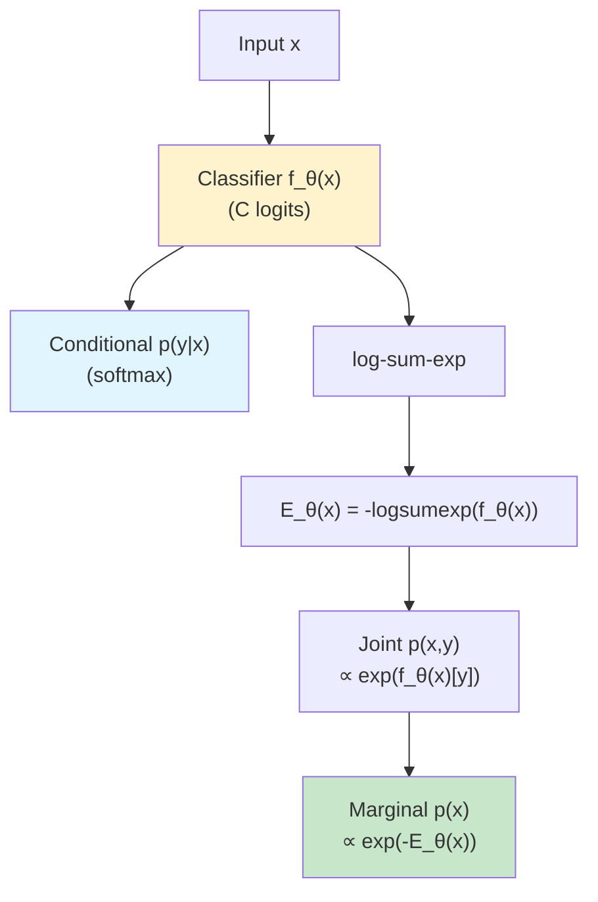

# Energy-Based Models (EBMs) Explained

<div class="grid cards" markdown>

- :material-lightning-bolt:{ .lg .middle } **Energy Functions**

    ---

    Learn distributions by assigning low energy to data and high energy to non-data, capturing complex dependencies

- :material-chart-scatter-plot:{ .lg .middle } **Flexible Modeling**

    ---

    No architectural constraints—any neural network can define the energy landscape

- :material-check-decagram:{ .lg .middle } **Unified Framework**

    ---

    Simultaneously perform classification, generation, and out-of-distribution detection

- :material-sync:{ .lg .middle } **MCMC Sampling**

    ---

    Generate samples by traversing the energy landscape using Markov Chain Monte Carlo methods

</div>

---

## Overview

Energy-Based Models (EBMs) are a class of **deep generative models** that learn data distributions by assigning scalar energy values to every possible configuration. Unlike models that explicitly parameterize probability distributions, EBMs define probabilities implicitly through an energy function: **lower energy corresponds to higher probability**.

**What makes EBMs special?**

EBMs solve generative modeling from a fundamentally different perspective. Rather than learning to directly generate samples (GANs) or compress data through bottlenecks (VAEs), EBMs learn an **energy landscape** where:

- **Data regions have low energy** - the model assigns favorable (low) energy to realistic configurations
- **Non-data regions have high energy** - implausible configurations receive unfavorable (high) energy
- **Sampling traverses the landscape** - MCMC methods move from high to low energy regions
- **No architectural constraints** - any neural network architecture can define the energy function

### The Intuition: Probability Through Energy

Think of EBMs like a physical landscape with hills and valleys:

1. **The Energy Function** defines the terrain—each point (data configuration) has an elevation (energy value). Data points sit in deep valleys (low energy), while meaningless noise occupies high peaks (high energy).

2. **Training Shapes the Landscape** - The model learns to carve valleys where training data exists and raise peaks everywhere else, creating a terrain that naturally guides samples toward realistic outputs.

3. **Sampling Rolls Downhill** - Like a ball released on a hillside, MCMC sampling iteratively moves toward lower energy, eventually settling in valleys that correspond to realistic data.

4. **Probability is Energy-Based** - The probability of any configuration depends on its energy through the Boltzmann distribution: $p(x) \propto e^{-E(x)}$. Lower energy means exponentially higher probability.

The critical insight: by learning to distinguish data from non-data through energy assignment, EBMs capture complex distributions without explicit density modeling or generation mechanisms.

---

## Mathematical Foundation

### The Boltzmann Distribution

EBMs define probability distributions through the **Boltzmann distribution**:

$$
p_\theta(x) = \frac{e^{-E_\theta(x)}}{Z_\theta}
$$

where:

- $E_\theta(x)$ is the **energy function** parameterized by neural network with weights $\theta$
- $Z_\theta = \int e^{-E_\theta(x')} dx'$ is the **partition function** (normalizing constant)
- Lower energy $E_\theta(x)$ corresponds to higher probability $p_\theta(x)$



**Why the exponential?** The exponential function ensures probabilities are positive and creates sharp distinctions between energy levels—a small energy difference produces a large probability ratio.

### The Intractable Partition Function

The partition function $Z_\theta$ poses the **fundamental challenge** in EBM training:

$$
Z_\theta = \int e^{-E_\theta(x)} dx
$$

This integral sums over **all possible configurations** of $x$, which becomes intractable for high-dimensional data:

- **Images (256×256×3)**: $Z_\theta$ requires integration over $196{,}608$-dimensional space
- **Text (512 tokens, vocab 50k)**: $Z_\theta$ requires summing over $(50{,}000)^{512} \approx 10^{2414}$ configurations

The intractability of $Z_\theta$ makes **maximum likelihood training** directly infeasible and necessitates alternative training methods.

### Energy Functions and Neural Networks

The energy function $E_\theta(x)$ can be implemented using **any neural network architecture**:

**Multi-Layer Perceptron (MLP) Energy:**

$$
E_\theta(x) = \text{MLP}_\theta(x) \in \mathbb{R}
$$

```python
class MLPEnergyFunction(nnx.Module):
    def __init__(self, hidden_dims, input_dim, *, rngs):
        self.layers = []
        for dim in hidden_dims:
            self.layers.append(nnx.Linear(input_dim, dim, rngs=rngs))
            input_dim = dim
        self.output = nnx.Linear(input_dim, 1, rngs=rngs)

    def __call__(self, x):
        for layer in self.layers:
            x = nnx.relu(layer(x))
        return self.output(x).squeeze(-1)  # Scalar energy
```

**Convolutional Energy (for images):**

$$
E_\theta(x) = \text{CNN}_\theta(x) \in \mathbb{R}
$$

```python
class CNNEnergyFunction(nnx.Module):
    def __init__(self, hidden_dims, input_channels, *, rngs):
        self.conv_layers = []
        for out_channels in hidden_dims:
            self.conv_layers.append(
                nnx.Conv(input_channels, out_channels,
                        kernel_size=(3, 3), rngs=rngs)
            )
            input_channels = out_channels
        self.global_pool = lambda x: jnp.mean(x, axis=(1, 2))
        self.output = nnx.Linear(hidden_dims[-1], 1, rngs=rngs)

    def __call__(self, x):
        for conv in self.conv_layers:
            x = nnx.relu(conv(x))
        x = self.global_pool(x)
        return self.output(x).squeeze(-1)
```

**Key properties:**

- **Scalar output** - energy function outputs single real number per input
- **Unrestricted architecture** - no invertibility, dimension matching, or structural requirements
- **Learned landscape** - network parameters define the energy surface topology

---

## Training Energy-Based Models

### Maximum Likelihood: The Ideal but Intractable Approach

The maximum likelihood objective seeks to maximize the log-probability of observed data:

$$
\max_\theta \mathbb{E}_{x \sim p_{\text{data}}}[\log p_\theta(x)]
$$

Substituting the Boltzmann distribution:

$$
\log p_\theta(x) = -E_\theta(x) - \log Z_\theta
$$

Taking gradients with respect to $\theta$:

$$
\nabla_\theta \log p_\theta(x) = -\nabla_\theta E_\theta(x) + \nabla_\theta \log Z_\theta
$$

The first term $-\nabla_\theta E_\theta(x)$ is tractable—just backpropagation through the energy function evaluated at data $x$.

The second term is problematic:

$$
\nabla_\theta \log Z_\theta = \frac{1}{Z_\theta} \nabla_\theta Z_\theta = \frac{1}{Z_\theta} \int \nabla_\theta e^{-E_\theta(x')} dx'
$$

$$
= -\int \frac{e^{-E_\theta(x')}}{Z_\theta} \nabla_\theta E_\theta(x') dx' = -\mathbb{E}_{x' \sim p_\theta}[\nabla_\theta E_\theta(x')]
$$

This requires **sampling from the model distribution** $p_\theta(x)$, which is exactly what we're trying to learn! This chicken-and-egg problem necessitates approximate training methods.

### Contrastive Divergence: Practical Approximation

**Contrastive Divergence (CD)** (Hinton, 2002) approximates the intractable expectation using short MCMC chains:

**Algorithm**:

1. **Positive phase**: Sample data $x^+ \sim p_{\text{data}}$, compute $\nabla_\theta E_\theta(x^+)$
2. **Negative phase**: Initialize $x^- = x^+$, run $k$ steps of MCMC to get $x^-$, compute $\nabla_\theta E_\theta(x^-)$
3. **Gradient step**:

    $$
    \nabla_\theta \mathcal{L}_{\text{CD}} \approx -\nabla_\theta E_\theta(x^+) + \nabla_\theta E_\theta(x^-)
    $$



**Why it works:**

- **Positive gradient** pushes down energy at data points
- **Negative gradient** pushes up energy at model samples
- **Short chains** approximate the full expectation with $k \ll \infty$ steps
- **Persistent chains** (PCD) reuse samples across iterations for better mixing

!!!warning "CD-k Limitations"
    CD with very short chains ($k=1$) can be unstable. Persistent Contrastive Divergence (PCD) maintains a persistent pool of samples across training iterations, providing better gradient estimates.

### Persistent Contrastive Divergence (PCD)

**PCD** (Tieleman, 2008) maintains a persistent sample buffer across training iterations:

**Algorithm**:

1. **Initialize buffer**: $\mathcal{B} = \{x_1, x_2, \ldots, x_M\}$ with random samples
2. **Each training iteration**:
    - Sample data batch $\{x^+_i\}$
    - Sample buffer batch $\{x^-_j\} \sim \mathcal{B}$
    - Run $k$ MCMC steps from each $x^-_j$ to get updated $\tilde{x}^-_j$
    - Update buffer: $\mathcal{B} \leftarrow \mathcal{B} \cup \{\tilde{x}^-_j\}$
    - Compute gradient: $\nabla_\theta \mathcal{L} \approx -\frac{1}{N}\sum_i \nabla E(x^+_i) + \frac{1}{N}\sum_j \nabla E(\tilde{x}^-_j)$
    - Update parameters

```python
def persistent_contrastive_divergence(
    energy_fn, real_samples, sample_buffer, rng_key,
    n_mcmc_steps=60, step_size=0.01, noise_scale=0.005
):
    """Persistent Contrastive Divergence training step."""
    batch_size = real_samples.shape[0]
    sample_shape = real_samples.shape[1:]

    # Sample initial points from buffer
    init_samples = sample_buffer.sample_initial(batch_size, rng_key, sample_shape)

    # Run MCMC chain
    final_samples = langevin_dynamics(
        energy_fn, init_samples, n_mcmc_steps, step_size, noise_scale, rng_key
    )

    # Update buffer with new samples
    sample_buffer.push(final_samples)

    return init_samples, final_samples
```

**Advantages over CD**:

- **Better mixing**: Chains continue across iterations
- **More accurate gradients**: Samples closer to true model distribution
- **Stable training**: Reduces oscillations and mode collapse

### Langevin Dynamics: MCMC Sampling

**Langevin dynamics** provides the MCMC sampler for EBMs:

$$
x_{t+1} = x_t - \frac{\epsilon}{2} \nabla_x E_\theta(x_t) + \sqrt{\epsilon} \, \xi_t
$$

where $\xi_t \sim \mathcal{N}(0, I)$ and $\epsilon$ is the step size.

**Two components:**

1. **Gradient descent** $-\frac{\epsilon}{2} \nabla_x E_\theta(x_t)$ moves toward lower energy
2. **Brownian motion** $\sqrt{\epsilon} \, \xi_t$ adds noise to explore the space

```python
def langevin_dynamics(
    energy_fn, init_samples, n_steps, step_size, noise_scale, rng_key
):
    """Sample from EBM using Langevin dynamics."""
    x = init_samples

    for step in range(n_steps):
        # Compute energy gradient
        energy_grad = jax.grad(lambda x: jnp.sum(energy_fn(x)))(x)

        # Gradient descent step
        x = x - (step_size / 2) * energy_grad

        # Add noise
        rng_key, noise_key = jax.random.split(rng_key)
        noise = jax.random.normal(noise_key, x.shape) * noise_scale
        x = x + noise

        # Clip to valid range
        x = jnp.clip(x, -1.0, 1.0)

    return x
```

**Convergence**: As $n_{\text{steps}} \to \infty$ and $\epsilon \to 0$, Langevin dynamics samples from $p_\theta(x)$ exactly. In practice, finite steps and step sizes introduce bias.

### Score Matching: Avoiding Sampling

**Score Matching** (Hyvärinen, 2005) bypasses MCMC sampling by matching the **score function** (gradient of log-density):

$$
\psi_\theta(x) = \nabla_x \log p_\theta(x) = -\nabla_x E_\theta(x)
$$

**Objective** - Minimize the Fisher divergence:

$$
\mathcal{L}_{\text{SM}} = \mathbb{E}_{p_{\text{data}}}[\|\nabla_x E_\theta(x) + \nabla_x \log p_{\text{data}}(x)\|^2]
$$

Since $\nabla_x \log p_{\text{data}}(x)$ is unknown, Hyvärinen showed this is equivalent to:

$$
\mathcal{L}_{\text{SM}} = \mathbb{E}_{p_{\text{data}}}[-\text{tr}(\nabla_x^2 E_\theta(x)) + \frac{1}{2}\|\nabla_x E_\theta(x)\|^2]
$$

**Advantages**:

- **No sampling required** during training
- **No partition function** computation needed
- **Fast training** compared to CD/PCD

**Disadvantages**:

- **Second derivatives** $\nabla_x^2 E_\theta(x)$ expensive to compute
- **Generation still requires MCMC** at test time
- **Less effective** for high-dimensional data

**Denoising Score Matching**: A practical variant adds noise to data:

$$
\mathcal{L}_{\text{DSM}} = \mathbb{E}_{p_{\text{data}}(x)} \mathbb{E}_{p(\tilde{x}|x)}[\|\nabla_{\tilde{x}} E_\theta(\tilde{x}) + \frac{x - \tilde{x}}{\sigma^2}\|^2]
$$

where $\tilde{x} = x + \sigma \epsilon$ with $\epsilon \sim \mathcal{N}(0, I)$.

### Noise Contrastive Estimation (NCE)

**NCE** (Gutmann & Hyvärinen, 2010) frames training as **binary classification**:

**Setup**: Given data samples $\{x_i\}$ and noise samples $\{\tilde{x}_j\}$ from distribution $p_n$, train a classifier to distinguish them.

**Decision rule**: Sample $x$ comes from data if $\frac{p_\theta(x)}{p_n(x)} > 1$, equivalently:

$$
h_\theta(x) = \sigma(-E_\theta(x) - \log p_n(x))
$$

**NCE objective**:

$$
\mathcal{L}_{\text{NCE}} = -\mathbb{E}_{x \sim p_{\text{data}}}[\log h_\theta(x)] - \mathbb{E}_{\tilde{x} \sim p_n}[\log(1 - h_\theta(\tilde{x}))]
$$

**Advantages**:

- **No partition function** in gradient
- **Simple implementation** like standard classification
- **Flexible noise distribution** $p_n$ (typically Gaussian)

**When to use**:

- High-dimensional problems where MCMC is slow
- When generation quality is secondary to density estimation
- Contrastive learning scenarios

---

## Joint Energy-Based Models (JEM)

**Joint Energy-Based Models** (Grathwohl et al., 2020) unify generative and discriminative modeling in a single framework.

### The Key Insight

A standard classifier $p(y|x)$ can be reinterpreted as an energy model:

$$
p_\theta(y|x) = \frac{e^{f_\theta[x](y)}}{\sum_{y'} e^{f_\theta[x](y')}}
$$

where $f_\theta(x) \in \mathbb{R}^C$ are logits.

**Define energy as**:

$$
E_\theta(x, y) = -f_\theta[x](y)
$$

Then the **joint distribution** becomes:

$$
p_\theta(x, y) = \frac{e^{f_\theta[x](y)}}{Z_\theta}, \quad Z_\theta = \sum_{y'} \int e^{f_\theta[x'](y')} dx'
$$

And the **marginal** data distribution:

$$
p_\theta(x) = \frac{\sum_y e^{f_\theta[x](y)}}{Z_\theta}
$$



### Training JEM

**Hybrid objective** combining classification and generation:

$$
\mathcal{L}_{\text{JEM}} = \underbrace{\mathcal{L}_{\text{class}}(f_\theta)}_{\text{discriminative}} + \lambda \underbrace{\mathcal{L}_{\text{gen}}(p_\theta)}_{\text{generative}}
$$

where:

- $\mathcal{L}_{\text{class}} = -\mathbb{E}_{(x, y) \sim p_{\text{data}}}[\log p_\theta(y|x)]$ (cross-entropy)
- $\mathcal{L}_{\text{gen}} = -\mathbb{E}_{x \sim p_{\text{data}}}[\log p_\theta(x)]$ (MLE via SGLD)

**Training algorithm**:

1. Sample batch $\{(x_i, y_i)\}$ from labeled data
2. **Classification update**: Compute cross-entropy loss, backprop
3. **Generative update**:
   - Generate samples via SGLD
   - Compute CD gradient
   - Update parameters
4. Alternate or combine both losses

**Capabilities of JEM**:

<div class="grid cards" markdown>

- :material-brain:{ .lg .middle } **Classification**

    ---

    Achieves competitive accuracy on CIFAR-10, SVHN, ImageNet

- :material-image-multiple:{ .lg .middle } **Generation**

    ---

    Generates realistic samples comparable to GANs

- :material-shield-alert:{ .lg .middle } **Out-of-Distribution Detection**

    ---

    Uses $p(x)$ to detect anomalies with AUROC > 95%

- :material-shield-check:{ .lg .middle } **Adversarial Robustness**

    ---

    More robust to adversarial examples than standard classifiers

- :material-label-variant:{ .lg .middle } **Calibration**

    ---

    Better uncertainty estimates than standard softmax

- :material-chart-scatter-plot:{ .lg .middle } **Hybrid Discriminative-Generative**

    ---

    Leverages both labeled and unlabeled data

</div>

**Challenges**:

- **Training instability**: SGLD can fail to produce quality samples
- **Computational cost**: Requires MCMC sampling during training
- **Hyperparameter sensitivity**: Step size, noise scale, buffer size critical

Recent work (2023-2024) has proposed improvements including better initialization, curriculum learning, and stabilized SGLD variants.

---

## Architecture Design

### Energy Function Design Principles

**Key considerations** when designing energy functions:

1. **Scalar output**: $E_\theta: \mathcal{X} \to \mathbb{R}$ must map inputs to single energy value
2. **Sufficient capacity**: Deep networks capture complex dependencies
3. **Spectral normalization**: Stabilizes training by constraining Lipschitz constant
4. **Residual connections**: Enable deep architectures (10+ layers)
5. **Normalization layers**: GroupNorm or LayerNorm (BatchNorm can interfere with MCMC)

### MLP Energy Function (Tabular Data)

```python
class MLPEnergyFunction(nnx.Module):
    def __init__(
        self, hidden_dims, input_dim, activation=nnx.gelu,
        dropout_rate=0.0, *, rngs
    ):
        super().__init__(rngs=rngs)
        self.layers = []

        for dim in hidden_dims:
            self.layers.append(nnx.Linear(input_dim, dim, rngs=rngs))
            if dropout_rate > 0:
                self.layers.append(nnx.Dropout(dropout_rate, rngs=rngs))
            input_dim = dim

        self.output_layer = nnx.Linear(input_dim, 1, rngs=rngs)
        self.activation = activation

    def __call__(self, x, *, deterministic=True):
        for layer in self.layers:
            if isinstance(layer, nnx.Linear):
                x = self.activation(layer(x))
            elif isinstance(layer, nnx.Dropout):
                x = layer(x, deterministic=deterministic)
        return self.output_layer(x).squeeze(-1)
```

**Use cases**: Tabular data, low-to-moderate dimensional problems (< 1000 dimensions)

### CNN Energy Function (Images)

```python
class CNNEnergyFunction(nnx.Module):
    def __init__(
        self, hidden_dims, input_channels=3,
        activation=nnx.silu, *, rngs
    ):
        super().__init__(rngs=rngs)
        self.conv_blocks = []

        in_channels = input_channels
        for out_channels in hidden_dims:
            self.conv_blocks.append(EnergyBlock(
                in_channels, out_channels, activation=activation, rngs=rngs
            ))
            in_channels = out_channels

        self.global_pool = lambda x: jnp.mean(x, axis=(1, 2))
        self.fc_layers = [
            nnx.Linear(hidden_dims[-1], hidden_dims[-1]//2, rngs=rngs),
            nnx.Linear(hidden_dims[-1]//2, 1, rngs=rngs),
        ]
        self.activation = activation

    def __call__(self, x, *, deterministic=True):
        for block in self.conv_blocks:
            x = block(x)
        x = self.global_pool(x)
        for i, fc in enumerate(self.fc_layers):
            x = fc(x)
            if i < len(self.fc_layers) - 1:
                x = self.activation(x)
        return x.squeeze(-1)

class EnergyBlock(nnx.Module):
    """Residual block with GroupNorm for energy function."""
    def __init__(
        self, in_channels, out_channels,
        kernel_size=3, stride=2,
        use_residual=False, activation=nnx.silu, *, rngs
    ):
        super().__init__()
        self.conv = nnx.Conv(
            in_channels, out_channels,
            kernel_size=(kernel_size, kernel_size),
            strides=(stride, stride), padding="SAME", rngs=rngs
        )
        self.norm = nnx.GroupNorm(
            min(32, out_channels), out_channels, rngs=rngs
        )
        self.activation = activation
        self.use_residual = use_residual and (in_channels == out_channels) and (stride == 1)

    def __call__(self, x):
        residual = x
        x = self.conv(x)
        x = self.norm(x)
        x = self.activation(x)
        if self.use_residual:
            x = x + residual
        return x
```

**Use cases**: Image data (MNIST, CIFAR-10, CelebA), spatial data

### Deep Energy Functions with Spectral Normalization

For complex distributions, deeper architectures with **spectral normalization** improve stability:

```python
class DeepCNNEnergyFunction(nnx.Module):
    def __init__(
        self, hidden_dims, input_channels=3,
        use_spectral_norm=True, use_residual=True, *, rngs
    ):
        super().__init__(rngs=rngs)
        # Build deeper architecture (8-12 layers)
        # Apply spectral normalization to conv layers
        # Use residual connections where dimensions match
        ...
```

**Benefits**:

- **Spectral norm**: Constrains Lipschitz constant, prevents gradient explosion
- **Residual connections**: Enable training of 10+ layer networks
- **Better sample quality**: Captures finer details in distribution

---

## Training Dynamics and Best Practices

### Sample Buffer Management

**Persistent sample buffers** are critical for stable EBM training:

**Buffer initialization**:

- Random noise (Gaussian or uniform)
- Real data with added noise
- Pre-trained model samples

**Buffer operations**:

```python
class SampleBuffer:
    def __init__(self, capacity=8192, reinit_prob=0.05):
        self.capacity = capacity
        self.reinit_prob = reinit_prob
        self.buffer = []

    def sample_initial(self, batch_size, rng_key, sample_shape):
        """Sample starting points for MCMC."""
        if len(self.buffer) < batch_size:
            # Not enough samples - return random noise
            return jax.random.normal(rng_key, (batch_size, *sample_shape))

        # Sample from buffer
        indices = jax.random.choice(rng_key, len(self.buffer), (batch_size,))
        samples = jnp.array([self.buffer[i] for i in indices])

        # Reinitialize some samples with noise
        reinit_mask = jax.random.uniform(rng_key, (batch_size,)) < self.reinit_prob
        noise = jax.random.normal(rng_key, samples.shape)
        samples = jnp.where(reinit_mask[:, None, None, None], noise, samples)

        return samples

    def push(self, samples):
        """Add new samples to buffer."""
        for sample in samples:
            if len(self.buffer) >= self.capacity:
                self.buffer.pop(0)  # Remove oldest
            self.buffer.append(sample)
```

**Reinitialiation probability**: Setting $p_{\text{reinit}} = 0.05$ helps escape local minima.

### Hyperparameter Guidelines

**MCMC sampling**:

| Parameter | Value Range | Typical | Notes |
|-----------|-------------|---------|-------|
| **MCMC steps** | 20-200 | 60 | More steps = better samples, slower |
| **Step size** | 0.001-0.05 | 0.01 | Too large: instability, too small: slow |
| **Noise scale** | 0.001-0.01 | 0.005 | Exploration vs exploitation |

**Training**:

| Parameter | Value Range | Typical | Notes |
|-----------|-------------|---------|-------|
| **Learning rate** | 1e-5 to 1e-3 | 1e-4 | Lower than standard supervised |
| **Batch size** | 32-256 | 128 | Larger batches stabilize |
| **Buffer capacity** | 2048-16384 | 8192 | More = better mixing |
| **Alpha (regularization)** | 0.001-0.1 | 0.01 | Prevents energy collapse |

**Data preprocessing**:

- **Normalize** images to $[-1, 1]$ or $[0, 1]$
- **Add noise** to real data during training (noise scale ~0.005)
- **Clip samples** after MCMC to valid range

### Common Training Issues

<div class="grid cards" markdown>

- :material-alert-circle: **Mode Collapse**

    ---

    **Symptom**: Generated samples lack diversity, all similar

    **Solutions**: Increase buffer size, use reinitialize probability, longer MCMC chains, reduce learning rate

- :material-alert-circle: **Energy Explosion**

    ---

    **Symptom**: Energy values grow unbounded, NaN losses

    **Solutions**: Add regularization term $\alpha \mathbb{E}[E(x)^2]$, spectral normalization, gradient clipping, smaller learning rate

- :material-alert-circle: **Poor Sample Quality**

    ---

    **Symptom**: Samples look like noise or blurry averages

    **Solutions**: More MCMC steps (100+), better step size tuning, deeper energy function, larger model capacity

- :material-alert-circle: **Training Instability**

    ---

    **Symptom**: Oscillating losses, sudden divergence

    **Solutions**: Persistent buffer, KL annealing on regularization, spectral norm, lower learning rate, gradient clipping

</div>

### Monitoring and Diagnostics

**Essential metrics**:

1. **Energy values**: Monitor $\mathbb{E}[E(x_{\text{data}})]$ and $\mathbb{E}[E(x_{\text{gen}})]$
   - Should satisfy $E(x_{\text{data}}) < E(x_{\text{gen}})$
   - Gap should be positive and stable

2. **MCMC diagnostics**:
   - **Acceptance rate**: Track how many proposed moves are accepted
   - **Energy trajectory**: Plot energy over MCMC steps (should decrease)

3. **Sample quality**: Visual inspection, FID/IS scores

4. **Gradient norms**: Should be stable, not exploding

```python
def training_step_with_diagnostics(model, batch, rngs):
    # Forward pass
    real_data = batch['x']
    real_energy = model.energy(real_data).mean()

    # Generate samples
    fake_data = generate_samples_via_mcmc(model, batch_size, rngs)
    fake_energy = model.energy(fake_data).mean()

    # Compute loss
    loss = real_energy - fake_energy + alpha * (real_energy**2).mean()

    # Diagnostics
    energy_gap = fake_energy - real_energy

    print(f"Real Energy: {real_energy:.3f}, "
          f"Fake Energy: {fake_energy:.3f}, "
          f"Gap: {energy_gap:.3f}, "
          f"Loss: {loss:.3f}")

    return loss
```

---

## Comparing EBMs with Other Generative Models

### EBMs vs GANs: Stable Training vs Sharp Samples

| Aspect | Energy-Based Models | GANs |
|--------|---------------------|------|
| **Training Stability** | Stable with PCD/CD | Notorious instability, mode collapse |
| **Sample Quality** | Good (improving with recent methods) | Excellent (sharp, realistic) |
| **Sampling Speed** | Slow (50-200 MCMC steps) | Fast (1 forward pass) |
| **Mode Coverage** | Excellent (explicit density) | Poor (mode collapse common) |
| **Likelihood** | Exact (modulo partition function) | None (no explicit density) |
| **Architecture** | Any neural network | Generator-discriminator pair |
| **Use Cases** | Density estimation, OOD detection | High-quality image synthesis |

**When to use EBMs over GANs**:

- Exact likelihood computation needed
- Out-of-distribution detection
- Training stability priority
- Avoiding mode collapse essential

### EBMs vs VAEs: Flexibility vs Efficiency

| Aspect | Energy-Based Models | VAEs |
|--------|---------------------|------|
| **Architecture** | Unrestricted | Encoder-decoder with bottleneck |
| **Likelihood** | Exact density | Lower bound (ELBO) |
| **Sample Quality** | Good | Often blurry (reconstruction bias) |
| **Sampling Speed** | Slow (MCMC) | Fast (single pass) |
| **Training** | CD/PCD (requires MCMC) | Stable (reparameterization trick) |
| **Latent Space** | No explicit latent | Structured latent representations |
| **Use Cases** | Density estimation | Representation learning, compression |

**When to use EBMs over VAEs**:

- No need for learned latent representations
- Exact density more important than speed
- Want architectural flexibility
- Avoid reconstruction-based blur

### EBMs vs Diffusion Models: Principled Energy vs Iterative Denoising

| Aspect | Energy-Based Models | Diffusion Models |
|--------|---------------------|------------------|
| **Conceptual Framework** | Energy landscape | Iterative denoising |
| **Training** | CD/PCD (challenging) | Stable (MSE denoising) |
| **Sampling** | MCMC (50-200 steps) | Denoising (50-1000 steps) |
| **Sample Quality** | Good | State-of-the-art |
| **Likelihood** | Exact | Tractable via ODE |
| **Flexibility** | Any architecture | Flexible but typically U-Net |
| **Maturity** | Older field, renewed interest | Rapidly advancing (2020-2025) |

**Relationship**: Diffusion models can be viewed as energy-based models with **time-dependent energy functions** and specific noise schedules. Score-based models unify the two perspectives.

---

## Recent Advances (2023-2025)

### Improved Contrastive Divergence

**Improved CD** (Du et al., ICML 2021) addresses gradient bias in standard CD:

**Key innovations**:

1. **KL divergence term**: Add $\mathbb{E}_{x \sim p_{\text{data}}}[D_{\text{KL}}(q(x') | p_\theta(x'))]$ to loss
2. **Data augmentation**: Augment both positive and negative samples
3. **Multi-scale processing**: Process images at multiple resolutions
4. **Reservoir sampling**: Maintain diverse buffer through stratified sampling

**Results**: CIFAR-10 Inception Score of 8.30, substantial improvement over baseline CD.

### Diffusion Contrastive Divergence (DCD)

**DCD** (2023) replaces Langevin dynamics with **diffusion processes**:

Instead of Langevin MCMC:
$$
x_{t+1} = x_t - \epsilon \nabla E(x_t) + \sqrt{2\epsilon} \xi_t
$$

Use general diffusion:
$$
dx_t = f(x_t, t)dt + g(t)dw_t
$$

**Benefits**:

- **More flexible**: Not limited to Langevin
- **More efficient**: Better exploration of space
- **Simulation-free**: Train without explicit integration

**Applications**: Higher quality image generation, faster convergence.

### Energy Matching: Unifying Flows and EBMs

**Energy Matching** (2024) connects flow matching and energy-based modeling:

**Framework**: Learn energy functions via flow matching objectives, avoiding MCMC during training entirely.

**Training**: Match energy gradients to optimal transport flows between data and noise.

**Results**: State-of-the-art likelihood on tabular datasets, competitive image generation.

### Stable JEM Training

Recent work addresses JEM training instability:

1. **Better initialization**: Initialize from pre-trained classifier
2. **Curriculum learning**: Gradually increase MCMC steps during training
3. **Improved SGLD**: Adaptive step sizes, better noise schedules
4. **Separate buffer per class**: Class-conditional buffers improve mixing

**Stabilized JEM** (2023): Achieves stable training on ImageNet-scale datasets with competitive classification and generation.

---

## Summary and Key Takeaways

Energy-Based Models provide a principled framework for learning probability distributions through energy functions. While training challenges have historically limited their adoption, recent advances in contrastive divergence and hybrid methods are revitalizing the field.

### Core Principles

<div class="grid cards" markdown>

- :material-lightning-bolt: **Energy Landscape**

    ---

    Model assigns scalar energy to configurations—low energy = high probability

- :material-chart-bell-curve: **Boltzmann Distribution**

    ---

    $p(x) \propto e^{-E(x)}$ connects energy to probability via exponential

- :material-sync: **MCMC Sampling**

    ---

    Generate samples by traversing energy landscape with Langevin dynamics

- :material-brain: **Flexible Architecture**

    ---

    Any neural network can define energy function—no structural constraints

</div>

### Training Methods

| Method | Sampling During Training | Pros | Cons |
|--------|-------------------------|------|------|
| **Contrastive Divergence** | Short MCMC chains (k=1-60) | Practical, widely used | Biased gradient estimates |
| **Persistent CD** | Persistent buffer + MCMC | Better gradients, stable | Requires careful buffer management |
| **Score Matching** | None | No sampling needed | Expensive second derivatives |
| **NCE** | Noise samples only | Simple, no MCMC | Requires good noise distribution |

### When to Use EBMs

**Best suited for**:

- **Density estimation** where exact likelihood matters
- **Out-of-distribution detection** leveraging $p(x)$
- **Anomaly detection** in high-stakes applications
- **Hybrid tasks** combining generation and classification (JEM)
- **Structured prediction** with complex dependencies

**Avoid when**:

- Real-time generation required (use GANs or fast flows)
- Training data limited (VAEs/diffusion more sample-efficient)
- Computational resources constrained at training time

### Future Directions

- **Faster sampling**: Learned samplers, amortized MCMC
- **Better training**: Improved CD variants, score matching hybrids
- **Scalability**: Efficient large-scale training, distributed MCMC
- **Applications**: Scientific computing, protein design, molecular generation
- **Unification**: Bridging EBMs, diffusion, and score-based models

---

## Next Steps

<div class="grid cards" markdown>

- :material-book-open-variant:{ .lg .middle } **[EBM User Guide](../models/ebm-guide.md)**

    ---

    Practical usage guide with implementation examples and training workflows

- :material-code-braces:{ .lg .middle } **[EBM API Reference](../../models/ebm.md)**

    ---

    Complete API documentation for EBM, DeepEBM, and JEM classes

- :material-school:{ .lg .middle } **[EBM Tutorial](../../examples/energy/simple-ebm.md)**

    ---

    Step-by-step hands-on tutorial: train an EBM on MNIST from scratch

- :material-flask:{ .lg .middle } **[Advanced Examples](../../examples/index.md)**

    ---

    Explore Joint Energy-Based Models, hybrid training, and applications

</div>

---

## Further Reading

### Seminal Papers (Must Read)

:material-file-document: **LeCun, Y., Chopra, S., Hadsell, R., Ranzato, M., & Huang, F. (2006).** "A Tutorial on Energy-Based Learning"<br>
&nbsp;&nbsp;&nbsp;&nbsp;:material-link: [Technical Report](http://yann.lecun.com/exdb/publis/pdf/lecun-06.pdf)<br>
&nbsp;&nbsp;&nbsp;&nbsp;:material-lightbulb-outline: Foundational tutorial establishing the energy-based learning framework

:material-file-document: **Hinton, G. E. (2002).** "Training Products of Experts by Minimizing Contrastive Divergence"<br>
&nbsp;&nbsp;&nbsp;&nbsp;:material-link: [Neural Computation 14(8)](https://www.cs.toronto.edu/~hinton/absps/tr00-004.pdf)<br>
&nbsp;&nbsp;&nbsp;&nbsp;:material-lightbulb-outline: Introduced Contrastive Divergence, making EBM training practical

:material-file-document: **Tieleman, T. (2008).** "Training Restricted Boltzmann Machines using Approximations to the Likelihood Gradient"<br>
&nbsp;&nbsp;&nbsp;&nbsp;:material-link: [ICML 2008](https://www.cs.toronto.edu/~tijmen/pcd/pcd.pdf)<br>
&nbsp;&nbsp;&nbsp;&nbsp;:material-lightbulb-outline: Persistent Contrastive Divergence for improved training

:material-file-document: **Hyvärinen, A. (2005).** "Estimation of Non-Normalized Statistical Models by Score Matching"<br>
&nbsp;&nbsp;&nbsp;&nbsp;:material-link: [JMLR 6](https://jmlr.org/papers/v6/hyvarinen05a.html)<br>
&nbsp;&nbsp;&nbsp;&nbsp;:material-lightbulb-outline: Score matching method avoiding partition function

:material-file-document: **Gutmann, M., & Hyvärinen, A. (2010).** "Noise-contrastive estimation: A new estimation principle for unnormalized statistical models"<br>
&nbsp;&nbsp;&nbsp;&nbsp;:material-link: [AISTATS 2010](http://proceedings.mlr.press/v9/gutmann10a.html)<br>
&nbsp;&nbsp;&nbsp;&nbsp;:material-lightbulb-outline: NCE training via binary classification

### Modern EBMs and Applications

:material-file-document: **Du, Y., & Mordatch, I. (2019).** "Implicit Generation and Modeling with Energy Based Models"<br>
&nbsp;&nbsp;&nbsp;&nbsp;:material-link: [arXiv:1903.08689](https://arxiv.org/abs/1903.08689) | [NeurIPS 2019](https://proceedings.neurips.cc/paper/2019/hash/378a063b8fdb1db941e34f4bde584c7d-Abstract.html)<br>
&nbsp;&nbsp;&nbsp;&nbsp;:material-lightbulb-outline: Modern EBMs for image generation with improved training

:material-file-document: **Grathwohl, W., Wang, K.-C., Jacobsen, J.-H., Duvenaud, D., Norouzi, M., & Swersky, K. (2020).** "Your Classifier is Secretly an Energy Based Model and You Should Treat it Like One"<br>
&nbsp;&nbsp;&nbsp;&nbsp;:material-link: [arXiv:1912.03263](https://arxiv.org/abs/1912.03263) | [ICLR 2020](https://openreview.net/forum?id=HpI7BkCuHr)<br>
&nbsp;&nbsp;&nbsp;&nbsp;:material-lightbulb-outline: Joint Energy-Based Models unifying classification and generation

:material-file-document: **Du, Y., Li, S., Tenenbaum, J., & Mordatch, I. (2020).** "Improved Contrastive Divergence Training of Energy Based Models"<br>
&nbsp;&nbsp;&nbsp;&nbsp;:material-link: [arXiv:2012.01316](https://arxiv.org/abs/2012.01316) | [ICML 2021](http://proceedings.mlr.press/v139/du21b.html)<br>
&nbsp;&nbsp;&nbsp;&nbsp;:material-lightbulb-outline: Addresses gradient bias in CD with KL regularization

:material-file-document: **Gao, R., Song, Y., Poole, B., Wu, Y. N., & Kingma, D. P. (2021).** "Learning Energy-Based Models by Diffusion Recovery Likelihood"<br>
&nbsp;&nbsp;&nbsp;&nbsp;:material-link: [arXiv:2012.08125](https://arxiv.org/abs/2012.08125) | [ICLR 2021](https://openreview.net/forum?id=v_1Soh8QUNc)<br>
&nbsp;&nbsp;&nbsp;&nbsp;:material-lightbulb-outline: Connects EBMs with diffusion models via recovery likelihood

### Recent Advances (2023-2025)

:material-file-document: **Wu, D., Wang, L., & Hong, P. (2023).** "Training Energy-Based Models with Diffusion Contrastive Divergences"<br>
&nbsp;&nbsp;&nbsp;&nbsp;:material-link: [arXiv:2307.01668](https://arxiv.org/abs/2307.01668)<br>
&nbsp;&nbsp;&nbsp;&nbsp;:material-lightbulb-outline: Replaces Langevin with general diffusion processes

:material-file-document: **Gao, Y., Liu, X., & Zha, H. (2024).** "Energy Matching: Unifying Flow Matching and Energy-Based Models for Generative Modeling"<br>
&nbsp;&nbsp;&nbsp;&nbsp;:material-link: [arXiv:2504.10612](https://arxiv.org/abs/2504.10612)<br>
&nbsp;&nbsp;&nbsp;&nbsp;:material-lightbulb-outline: Unifies flow matching and EBMs (2024 cutting-edge)

:material-file-document: **Zhang, Y., et al. (2023).** "Stabilized Training of Joint Energy-based Models and their Practical Applications"<br>
&nbsp;&nbsp;&nbsp;&nbsp;:material-link: [arXiv:2303.04187](https://arxiv.org/abs/2303.04187)<br>
&nbsp;&nbsp;&nbsp;&nbsp;:material-lightbulb-outline: Addresses JEM training instability

### Tutorial Resources

:material-web: **NYU Deep Learning Course: Energy-Based Models**<br>
&nbsp;&nbsp;&nbsp;&nbsp;:material-link: [atcold.github.io/NYU-DLSP20/en/week07/07-1](https://atcold.github.io/NYU-DLSP20/en/week07/07-1/)<br>
&nbsp;&nbsp;&nbsp;&nbsp;:material-lightbulb-outline: Comprehensive lectures by Yann LeCun and Alfredo Canziani

:material-web: **UvA Deep Learning Tutorial 8: Deep Energy-Based Generative Models**<br>
&nbsp;&nbsp;&nbsp;&nbsp;:material-link: [uvadlc-notebooks.readthedocs.io](https://uvadlc-notebooks.readthedocs.io/en/latest/tutorial_notebooks/tutorial8/Deep_Energy_Models.html)<br>
&nbsp;&nbsp;&nbsp;&nbsp;:material-lightbulb-outline: Hands-on Colab notebooks with implementations

:material-web: **Stanford CS236: Deep Generative Models (EBM Lecture)**<br>
&nbsp;&nbsp;&nbsp;&nbsp;:material-link: [Lecture Slides](https://deepgenerativemodels.github.io/assets/slides/cs236_lecture11.pdf)<br>
&nbsp;&nbsp;&nbsp;&nbsp;:material-lightbulb-outline: Academic course materials covering EBM theory

:material-github: **Energy-Based Models GitHub Repositories**<br>
&nbsp;&nbsp;&nbsp;&nbsp;:material-link: [github.com/yilundu/improved_contrastive_divergence](https://github.com/yilundu/improved_contrastive_divergence)<br>
&nbsp;&nbsp;&nbsp;&nbsp;:material-lightbulb-outline: Official implementation of Improved CD

---

**Ready to explore Energy-Based Models?** Start with the [EBM User Guide](../models/ebm-guide.md) for practical implementations, check the [API Reference](../../api/models/ebm.md) for complete documentation, or dive into the [MNIST Tutorial](../../examples/basic/ebm-mnist.md) to train your first EBM!
