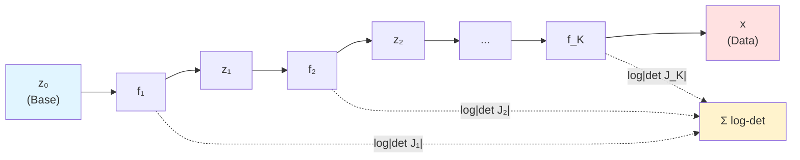
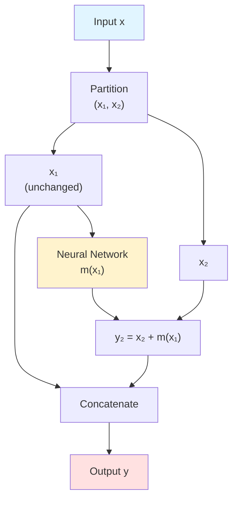
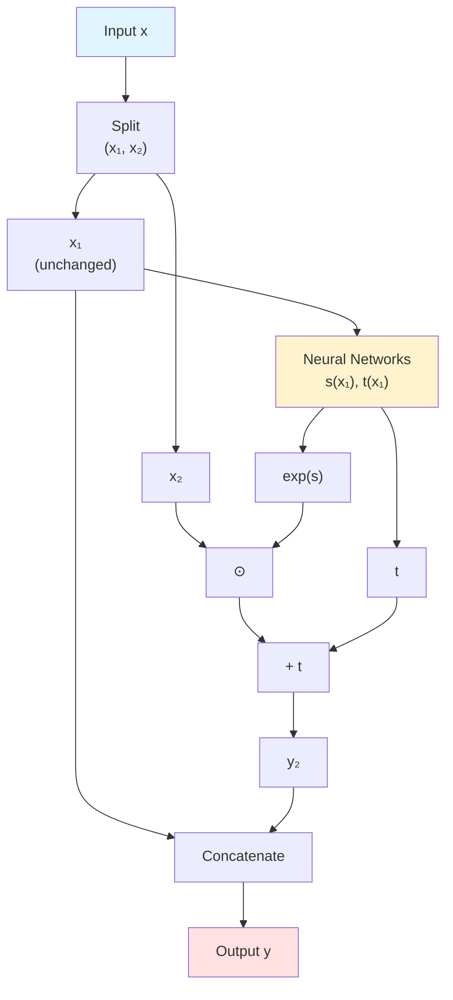
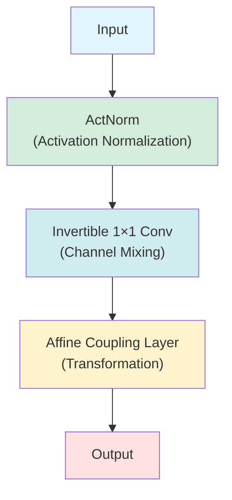
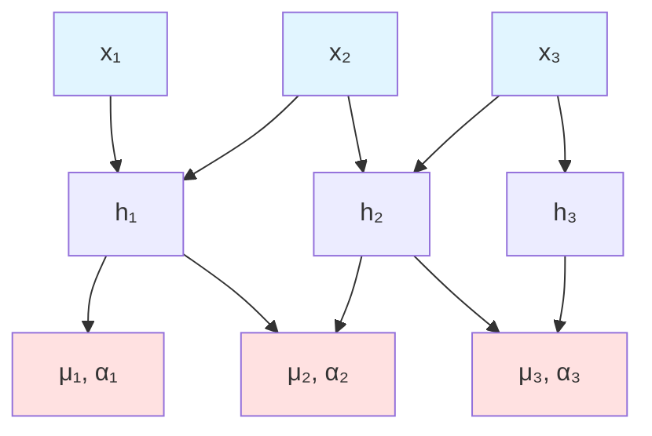
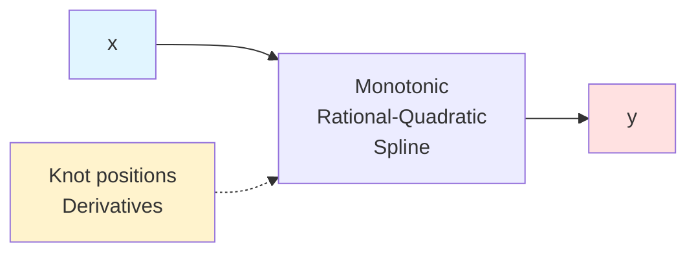
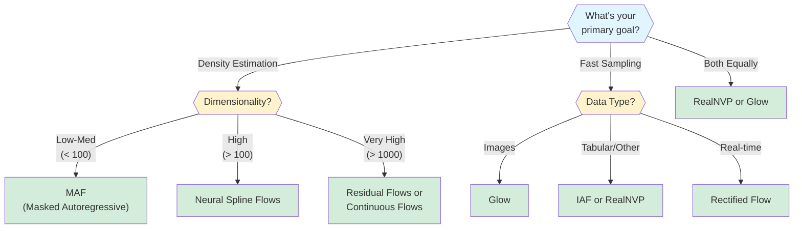

# Normalizing Flows Explained

<div class="grid cards" markdown>

- :material-arrow-decision:{ .lg .middle } **Exact Likelihood**

    ---

    Compute exact log-likelihood through tractable Jacobian determinants, enabling precise density estimation

- :material-sync:{ .lg .middle } **Bijective Transformations**

    ---

    Invertible mappings allow both efficient sampling and exact inference through forward and inverse passes

- :material-chart-bell-curve:{ .lg .middle } **Flexible Distributions**

    ---

    Transform simple base distributions into complex target distributions through learned compositions

- :material-speedometer:{ .lg .middle } **Fast Generation**

    ---

    Single-pass or few-step sampling with modern architectures achieving real-time performance

</div>

---

## Overview

Normalizing flows have emerged as a uniquely powerful class of generative models that provide **exact likelihood computation** and **efficient sampling** through invertible transformations. Unlike VAEs that optimize approximate lower bounds or GANs that learn implicit distributions, flows transform simple base distributions into complex data distributions via learned bijective mappings with tractable Jacobian determinants.

**What makes normalizing flows special?** Flows solve a fundamental challenge in generative modeling: simultaneously enabling precise density estimation and efficient sampling. By learning invertible transformations with structured Jacobians, flows:

- **Compute exact likelihood** for any data point without approximation
- **Generate samples** through fast inverse transformations
- **Perform exact inference** without variational bounds or adversarial training
- **Train stably** using straightforward maximum likelihood objectives

Recent breakthroughs in 2023-2025—including flow matching, rectified flows, and discrete flow variants—have dramatically closed the performance gap with diffusion models while maintaining the core advantages of one-step generation and stable training.

### The Intuition: Probability Transformations

Think of normalizing flows like a sequence of coordinate transformations on a map:

1. **Start with simple terrain** (base distribution) - a flat, uniform grid easy to sample from

2. **Apply transformations** - each step warps, stretches, and reshapes the terrain while maintaining a perfect one-to-one correspondence between original and transformed coordinates

3. **Track volume changes** - the Jacobian determinant measures how much each region expands or contracts, ensuring probability mass is conserved

4. **Compose transformations** - stack multiple simple warps to create arbitrarily complex landscapes (data distributions)

The critical insight: by carefully designing transformations where we can efficiently compute both the forward mapping and the volume change, we get a model that can both generate samples (apply the transformation) and evaluate probabilities (apply the inverse and account for volume changes).

---

## Mathematical Foundation

### The Change of Variables Formula

The change of variables formula serves as the **cornerstone of all normalizing flow architectures**. Given a random variable $\mathbf{z}$ with known density $p_\mathcal{Z}(\mathbf{z})$ and an invertible transformation $\mathbf{x} = f(\mathbf{z})$, the density of $\mathbf{x}$ becomes:

$$
p_\mathcal{X}(\mathbf{x}) = p_\mathcal{Z}(f^{-1}(\mathbf{x})) \left| \det \frac{\partial f^{-1}}{\partial \mathbf{x}} \right|
$$

Or equivalently in log space:

$$
\log p_\mathcal{X}(\mathbf{x}) = \log p_\mathcal{Z}(\mathbf{z}) + \log \left| \det \frac{\partial f^{-1}}{\partial \mathbf{x}} \right|
$$

where $\mathbf{z} = f^{-1}(\mathbf{x})$.

!!!note "Geometric Intuition"
    The Jacobian determinant $\left| \det \frac{\partial f}{\partial \mathbf{z}} \right|$ quantifies the **relative change in volume** of an infinitesimal neighborhood under transformation $f$. When the transformation expands a region ($|\det J| > 1$), the probability density must decrease proportionally to conserve total probability mass. Conversely, contraction ($|\det J| < 1$) concentrates probability, increasing density.

For $D$-dimensional vectors, the Jacobian matrix $J_f(\mathbf{z})$ is the $D \times D$ matrix of partial derivatives $[\frac{\partial f_i}{\partial z_j}]$. Computing a general determinant requires $O(D^3)$ operations, which becomes **intractable for high-dimensional data** like 256×256 RGB images with $D = 196{,}608$ dimensions.

The entire field of normalizing flows revolves around designing transformations with **structured Jacobians**—triangular, diagonal, or block-structured matrices where determinants reduce to $O(D)$ computations.

### Composing Multiple Transformations

A single invertible transformation typically provides limited modeling capacity. The power of flows emerges through **composition**: stacking $K$ transformations:

$$
\mathbf{x} = f_K \circ f_{K-1} \circ \cdots \circ f_1(\mathbf{z})
$$

The log-likelihood decomposes additively:

$$
\log p_\mathcal{X}(\mathbf{x}) = \log p_\mathcal{Z}(\mathbf{z}_0) + \sum_{k=1}^{K} \log \left| \det \frac{\partial f_k}{\partial \mathbf{z}_{k-1}} \right|
$$

where $\mathbf{z}_0 = \mathbf{z}$ and $\mathbf{z}_k = f_k(\mathbf{z}_{k-1})$ for $k=1,\ldots,K$.



!!!tip "Additive Structure in Log-Space"
    The chain rule for Jacobians states $\det J_{f_2 \circ f_1}(\mathbf{u}) = \det J_{f_2}(f_1(\mathbf{u})) \cdot \det J_{f_1}(\mathbf{u})$, so log-determinants simply add: $\log|\det J_\text{total}| = \sum_k \log|\det J_k|$. This ensures numerical stability and makes total computational cost $O(KD)$ when each layer has $O(D)$ Jacobian computation.

### Three Requirements for Flow Layers

For a transformation $f$ to be a valid flow layer, it must satisfy:

1. **Invertibility**: $f$ must be bijective (one-to-one and onto)
2. **Efficient Jacobian**: $\log \left| \det \frac{\partial f}{\partial \mathbf{z}} \right|$ must be tractable to compute
3. **Efficient Inverse**: $f^{-1}$ must be computable efficiently (for sampling)

Different flow architectures make different trade-offs among these requirements.

### Base Distribution

The base distribution $p_\mathcal{Z}(\mathbf{z})$ is typically chosen to be simple for efficient sampling:

**Standard Gaussian** (most common):

$$
p_\mathcal{Z}(\mathbf{z}) = \mathcal{N}(\mathbf{z}; \mathbf{0}, \mathbf{I}) = \frac{1}{(2\pi)^{D/2}} \exp\left(-\frac{1}{2}\|\mathbf{z}\|^2\right)
$$

**Uniform** (less common):

$$
p_\mathcal{Z}(\mathbf{z}) = \mathcal{U}(\mathbf{z}; -a, a) = \frac{1}{(2a)^D} \mathbb{1}_{[-a,a]^D}(\mathbf{z})
$$

---

## Flow Model Architectures

Artifex provides implementations of several state-of-the-art flow architectures, each with different trade-offs between expressiveness, computational efficiency, and ease of use.

### 1. NICE: Pioneering Coupling Layers

**NICE** (Non-linear Independent Components Estimation) introduced **additive coupling layers** that made normalizing flows practical for high-dimensional data.

**Coupling Layer Mechanism:**

Given input $\mathbf{x} \in \mathbb{R}^D$, partition into $(\mathbf{x}_1, \mathbf{x}_2)$:

$$
\begin{align}
\mathbf{y}_1 &= \mathbf{x}_1 \\
\mathbf{y}_2 &= \mathbf{x}_2 + m(\mathbf{x}_1)
\end{align}
$$

where $m$ can be **any arbitrary function** (typically a neural network).

**Key Properties:**

- **Volume-preserving**: $\log|\det(\mathbf{J})| = 0$ (determinant is exactly 1)
- **Efficient inverse**: $\mathbf{x}_1 = \mathbf{y}_1$, $\mathbf{x}_2 = \mathbf{y}_2 - m(\mathbf{y}_1)$
- **No Jacobian computation**: The triangular structure makes the determinant trivial
- **Arbitrary coupling function**: $m$ can be arbitrarily complex without affecting computational cost



**When to Use NICE:**

- Fast forward and inverse computations required
- Volume-preserving transformations are acceptable
- Starting point for understanding coupling layers
- Lower-dimensional problems (hundreds of dimensions)

### 2. RealNVP: Adding Scale for Expressiveness

**RealNVP** (Real-valued Non-Volume Preserving) extends NICE with **affine coupling layers**:

$$
\begin{align}
\mathbf{y}_1 &= \mathbf{x}_1 \\
\mathbf{y}_2 &= \mathbf{x}_2 \odot \exp(s(\mathbf{x}_1)) + t(\mathbf{x}_1)
\end{align}
$$

where $s(\cdot)$ and $t(\cdot)$ are neural networks outputting scale and translation, and $\odot$ denotes element-wise multiplication.

**Key Properties:**

- **Tractable Jacobian**: $\log|\det(\mathbf{J})| = \sum_i s_i(\mathbf{x}_1)$
- **Efficient inverse**:
  $$
  \begin{align}
  \mathbf{x}_1 &= \mathbf{y}_1 \\
  \mathbf{x}_2 &= (\mathbf{y}_2 - t(\mathbf{y}_1)) \odot \exp(-s(\mathbf{y}_1))
  \end{align}
  $$
- **Alternating masks**: Alternate which dimensions are transformed across layers
- **No gradient through scale/translation**: $s$ and $t$ can be arbitrarily complex ResNets



**Multi-Scale Architecture:**

RealNVP introduced hierarchical structure that revolutionized flow-based modeling:

1. **Squeeze operation**: Reshape $s \times s \times c$ tensors into $\frac{s}{2} \times \frac{s}{2} \times 4c$
2. **Factor out**: After several coupling layers, factor out half the channels to the prior
3. **Continue processing**: Transform remaining channels at higher resolution

This enables modeling 256×256 images by avoiding the prohibitive cost of applying dozens of layers to all 196,608 dimensions simultaneously.

**When to Use RealNVP:**

- Need both fast sampling and density estimation
- Working with continuous data, especially images
- Image generation tasks at moderate to high resolution
- Moderate-dimensional data (hundreds to thousands of dimensions)

### 3. Glow: Learnable Permutations

**Glow** extends RealNVP with three key innovations that pushed flows to state-of-the-art density estimation:

**Glow Block Architecture:**

Each flow step combines three layers:



**1. ActNorm (Activation Normalization):**

Per-channel affine transformation with trainable parameters:

$$
y_{i,j,c} = s_c \cdot x_{i,j,c} + b_c
$$

- Data-dependent initialization: normalize first minibatch to zero mean, unit variance
- Enables training with **batch size 1** (critical for high-resolution images)
- $\log|\det J| = H \cdot W \cdot \sum_c \log|s_c|$ for $H \times W$ spatial dimensions

**2. Invertible 1×1 Convolution:**

Learned linear mixing of channels using invertible matrix $\mathbf{W}$:

$$
\mathbf{y} = \mathbf{W} \mathbf{x}
$$

- Replaces fixed permutations with learned channel mixing
- LU decomposition: $\mathbf{W} = \mathbf{P} \cdot \mathbf{L} \cdot (\mathbf{U} + \text{diag}(\mathbf{s}))$
- Determinant: $\log|\det \mathbf{W}| = \sum_i \log|s_i|$ (reduced to $O(c)$)
- Improved log-likelihood by ~0.5 bits/dimension over fixed permutations

**3. Affine Coupling Layer:**

Similar to RealNVP but with the above improvements.

**When to Use Glow:**

- High-resolution image generation (256×256 and above)
- Need state-of-the-art sample quality
- Have sufficient computational resources
- Want to leverage multi-scale processing

!!!tip "Implementation Detail"
    Glow achieves 3.35 bits/dimension on CIFAR-10 with 3 scales of 32 steps each (96 total transformations) and coupling networks using 512-channel 3-layer ResNets.

### 4. MAF: Masked Autoregressive Flow

**MAF** uses **autoregressive** transformations where each dimension depends on all previous dimensions, providing maximum expressiveness at the cost of sequential sampling.

**Autoregressive Transformation:**

$$
z_i = (x_i - \mu_i(x_{<i})) \cdot \exp(-\alpha_i(x_{<i}))
$$

where $\mu_i$ and $\alpha_i$ are computed by a **MADE** (Masked Autoencoder for Distribution Estimation) network.

**MADE Architecture:**

Uses masked connections to ensure autoregressive property—each output depends only on previous inputs:



**Trade-offs:**

| Direction | Complexity | Use Case |
|-----------|------------|----------|
| **Forward (density)** | $O(1)$ passes | All dimensions computed in parallel |
| **Inverse (sampling)** | $O(D)$ passes | Sequential computation required |

**When to Use MAF:**

- **Density estimation is the primary goal**
- Sampling speed is less critical
- Tabular or low-to-moderate dimensional data
- Need highly expressive transformations
- All dimensions should interact

### 5. IAF: Inverse Autoregressive Flow

**IAF** is the "inverse" of MAF with **opposite computational trade-offs**:

$$
y_i = x_i \cdot \exp(\alpha_i(y_{<i})) + \mu_i(y_{<i})
$$

**Trade-offs:**

| Direction | Complexity | Use Case |
|-----------|------------|----------|
| **Forward (density)** | $O(D)$ passes | Sequential computation |
| **Inverse (sampling)** | $O(1)$ passes | All dimensions computed in parallel |

**When to Use IAF:**

- **Fast sampling is the primary goal**
- Density estimation is secondary or not needed
- Variational inference (amortized inference in VAEs)
- Real-time generation applications

### 6. Neural Spline Flows

**Neural Spline Flows** use **monotonic rational-quadratic splines** to create highly expressive yet tractable transformations.

**Rational-Quadratic Spline Transform:**

Each spline maps interval $[-B, B]$ to itself using $K$ rational-quadratic segments, parameterized by:

- $K+1$ knot positions $\{(x^{(k)}, y^{(k)})\}$
- $K+1$ derivative values $\{\delta^{(k)}\}$

Within segment $k$, the transformation applies a ratio of quadratic polynomials.

**Key Properties:**

- **Strict monotonicity**: Ensures invertibility
- **Smooth derivatives**: No discontinuities (unlike piecewise-linear)
- **Closed-form operations**: Forward evaluation, analytic inverse (quadratic equation), closed-form derivative
- **Universal approximation**: With sufficient bins (8-16 typically suffice)



**Compared to alternatives:**

- **vs Affine**: ~23 parameters per dimension vs 2, much more expressive
- **vs Neural Autoregressive Flows**: No iterative root-finding needed
- **vs Flow++**: No bisection algorithms required
- **vs Piecewise-linear**: Smooth derivatives improve optimization

**Results:**

- **CIFAR-10**: 3.38 bits/dimension using 10× fewer parameters than Glow
- **Best-in-class** likelihood on multiple density estimation benchmarks

**When to Use Neural Spline Flows:**

- **Maximum expressiveness** with tractability
- Density estimation on complex distributions
- Want fewer parameters than Glow
- Need smooth, differentiable transformations

---

## Training Normalizing Flows

### Maximum Likelihood Objective

Flow training optimizes the straightforward objective of **maximum likelihood**:

$$
\max_\theta \mathbb{E}_{x \sim p_\text{data}}[\log p_\theta(x)]
$$

Equivalently, minimize negative log-likelihood:

$$
\mathcal{L}(\theta) = -\mathbb{E}_{x \sim p_\text{data}}\left[\log p_u(f^{-1}_\theta(x)) + \log \left| \det \frac{\partial f^{-1}_\theta}{\partial x} \right|\right]
$$

This simplicity contrasts sharply with:

- **GANs**: Adversarial minimax optimization with mode collapse risks
- **VAEs**: ELBO with reconstruction-regularization trade-off
- **Diffusion**: Multi-step denoising with noise schedule design

!!!tip "Training Stability"
    Gradients flow through the entire composition automatically via backpropagation. Standard optimizers like Adam with learning rates around $10^{-3}$ work reliably. The monotonic improvement of likelihood makes training highly stable.

### Critical Preprocessing Steps

Proper preprocessing proves **essential for successful training**:

**1. Dequantization:**

Discrete data (e.g., uint8 images) create delta peaks in continuous space, allowing flows to assign arbitrarily high likelihood to exact discrete values while ignoring intermediate regions.

```python
# Uniform dequantization
x_dequantized = x + torch.rand_like(x) / 256.0

# Variational dequantization (more sophisticated)
noise = flow_model_for_noise(x)
x_dequantized = x + noise / 256.0
```

**2. Logit Transform:**

Maps bounded $[0,1]$ data to unbounded $(-\infty, +\infty)$ space matching Gaussian priors:

```python
# Add small constant for numerical stability
alpha = 0.05
x = alpha + (1 - 2*alpha) * x

# Apply logit transform
x_logit = torch.logit(x)  # log(x / (1-x))
```

!!!warning "Critical Importance"
    Without these preprocessing steps, training diverges immediately as the model tries to match bounded data to Gaussian base distributions.

### Numerical Stability Techniques

**1. Log-Space Computation:**

Never compute $\det(J)$ directly—immediate overflow/underflow:

```python
# WRONG
det_J = torch.det(jacobian)
log_det = torch.log(det_J)  # Overflow!

# CORRECT
log_det = torch.logdet(jacobian)
# Or for triangular Jacobians:
log_det = torch.sum(torch.log(torch.abs(torch.diagonal(jacobian))))
```

**2. Gradient Clipping:**

Prevents exploding gradients in deep architectures (10-15+ layers):

```python
torch.nn.utils.clip_grad_norm_(model.parameters(), max_norm=1.0)
```

**3. Normalization Layers:**

Batch normalization or ActNorm stabilizes intermediate representations:

```python
# ActNorm: data-dependent initialization
scale, bias = compute_initial_stats(first_batch)
# Then treat as learnable parameters
```

**4. Learning Rate Schedules:**

Polynomial decay with warmup improves convergence:

```python
# Warmup: 2-10 epochs linear increase
# Main training: polynomial decay from 1e-3 to 1e-4
scheduler = PolynomialDecay(optimizer, warmup_steps=1000,
                           total_steps=100000)
```

### Monitoring Training

Watch these metrics:

1. **Negative log-likelihood**: Should decrease steadily
2. **Per-layer log-determinants**: Monitor for sudden spikes (numerical issues)
3. **Reconstruction error**: $\|x - f(f^{-1}(x))\| < 10^{-5}$ for numerical stability
4. **Bits per dimension**: For images, $\text{bpd} = \frac{\text{NLL}}{D \cdot \log 2}$

```python
# Invertibility check
x_reconstructed = flow.inverse(flow.forward(x))
recon_error = torch.mean(torch.abs(x - x_reconstructed))
assert recon_error < 1e-5, f"Poor invertibility: {recon_error}"
```

### Common Pitfalls and Solutions

<div class="grid cards" markdown>

- :material-alert-circle: **Missing Preprocessing**

    ---

    **Symptom**: Immediate divergence or NaN losses

    **Solution**: Always dequantize discrete data and apply logit transform

- :material-alert-circle: **Numerical Instability**

    ---

    **Symptom**: Sudden spikes in log-determinants or NaN gradients

    **Solution**: Use log-space computation, gradient clipping, monitor per-layer statistics

- :material-alert-circle: **Poor Invertibility**

    ---

    **Symptom**: $\|x - f^{-1}(f(x))\| > 10^{-3}$

    **Solution**: Use residual flows with soft-thresholding, reduce depth, check numerical precision

- :material-alert-circle: **Slow Convergence**

    ---

    **Symptom**: Likelihood plateaus early

    **Solution**: Increase model capacity, add more layers, use spline flows, check preprocessing

</div>

---

## Advanced Architectures and Recent Advances

### Continuous Normalizing Flows (Neural ODEs)

**Continuous flows** parameterize the derivative of the hidden state:

$$
\frac{d\mathbf{z}_t}{dt} = f(\mathbf{z}_t, t, \theta)
$$

The output $\mathbf{z}_1$ at time $t=1$ given initial condition $\mathbf{z}_0$ at $t=0$ is computed using ODE solvers.

**Key Innovation (FFJORD):**

The change in log-density follows:

$$
\frac{d \log p(\mathbf{z}_t)}{dt} = -\text{Tr}\left(\frac{\partial f}{\partial \mathbf{z}_t}\right)
$$

**Hutchinson's trace estimator** makes this tractable:

$$
\text{Tr}(A) \approx \mathbf{v}^T A \mathbf{v} \quad \text{where } \mathbf{v} \sim \mathcal{N}(0, I)
$$

This unbiased stochastic estimate requires only one Jacobian-vector product per sample, reducing complexity from $O(D^2)$ to $O(D)$.

**Advantages:**

- **No architectural constraints**: Any neural network architecture works
- **Flexible expressiveness**: Can model disconnected regions and sharp boundaries
- **Adjoint method**: Memory-efficient training ($O(1)$ memory vs $O(\text{depth})$)

**Challenges:**

- **Unpredictable cost**: Number of function evaluations adapts to complexity
- **Stiff dynamics**: Can struggle with certain distributions
- **Slower than discrete flows**: Requires ODE integration

**When to Use:**

- Modeling distributions with disconnected regions
- Physics simulation, molecular dynamics
- Scientific domains requiring flexible unrestricted networks

### Residual Flows: Invertible ResNets

**Residual flows** make standard ResNet architectures $F(\mathbf{x}) = \mathbf{x} + g(\mathbf{x})$ invertible by constraining $g$ to be **contractive** with Lipschitz constant $L < 1$.

**Invertibility via Fixed-Point Iteration:**

The Banach fixed-point theorem guarantees bijection with inverse computable via:

$$
\mathbf{x}_{k+1} = \mathbf{y} - g(\mathbf{x}_k)
$$

which converges exponentially to the true inverse.

**Spectral Normalization:**

Enforces the constraint by normalizing weight matrices:

$$
\mathbf{W} \leftarrow \frac{\mathbf{W}}{\|\mathbf{W}\|_2 / c} \quad \text{where } c < 1
$$

The spectral norm $\|\mathbf{W}\|_2$ is estimated via power iteration.

**Russian Roulette Estimator:**

For $F(\mathbf{x}) = \mathbf{x} + g(\mathbf{x})$, the log-determinant has power series:

$$
\log|\det(I + J_g)| = \sum_{k=1}^{\infty} \frac{(-1)^{k+1}}{k} \text{Tr}(J_g^k)
$$

Rather than truncating (introducing bias), Russian roulette randomly terminates the series with probability ensuring unbiasedness while maintaining finite computation.

**When to Use:**

- High-dimensional problems (>1000 dimensions)
- Want free-form Jacobians (all dimensions interact)
- Need competitive density estimation with flexibility
- Extensions like Invertible DenseNets for parameter efficiency

### Flow Matching: Simulation-Free Training

**Flow Matching** (2022) introduced a paradigm shift for training continuous normalizing flows **without ODE simulation**.

**Key Idea:**

Rather than integrating forward dynamics during training (as in Neural ODEs), perform regression on the vector field of fixed conditional probability paths.

**Training Procedure:**

1. Given samples $\mathbf{x}_0 \sim p_0$ and $\mathbf{x}_1 \sim p_1$
2. Define interpolant: $\mathbf{x}_t = (1-t)\mathbf{x}_0 + t\mathbf{x}_1$
3. Train neural network $\mathbf{v}_\theta(\mathbf{x}_t, t)$ to match conditional vector field:

$$
\min_\theta \mathbb{E}_{t, \mathbf{x}_0, \mathbf{x}_1}\left[\|\mathbf{v}_\theta(\mathbf{x}_t, t) - (\mathbf{x}_1 - \mathbf{x}_0)\|^2\right]
$$

This is simple L2 regression requiring **no simulation**.

**Inference:**

Integrate the learned field using standard ODE solvers:

$$
\frac{d\mathbf{x}}{dt} = \mathbf{v}_\theta(\mathbf{x}, t), \quad t \in [0, 1]
$$

**Optimal Transport Flow Matching:**

Uses **minibatch optimal transport** to couple noise and data samples before interpolation, creating straighter paths that require fewer integration steps.

**Results:**

- State-of-the-art on ImageNet
- Better likelihood and sample quality than simulation-based methods
- Extensions to Riemannian manifolds, discrete data, video generation

**When to Use:**

- Training continuous flows efficiently
- Want simulation-free gradients
- Need state-of-the-art likelihood
- 2023-2024 cutting-edge research

### Rectified Flows: Learning Straight Trajectories

**Rectified Flow** (2022) learns ODEs following **straight-line paths** connecting source and target distributions.

**Training:**

Given coupling between noise samples $\mathbf{u} \sim p_0$ and data samples $\mathbf{x} \sim p_1$:

1. Linearly interpolate: $\mathbf{x}_t = (1-t)\mathbf{u} + t\mathbf{x}$
2. Learn velocity field: $\frac{d\mathbf{x}_t}{dt} = \mathbf{v}_\theta(\mathbf{x}_t, t)$

**Reflow Process (Key Innovation):**

1. Train initial model
2. Generate paired samples: $(\mathbf{u}, \mathbf{x}_{\text{gen}})$ where $\mathbf{x}_{\text{gen}} = \text{model}(\mathbf{u})$
3. Retrain on these pairs

This iterative rectification progressively straightens trajectories.

**Benefits:**

- **Provably non-increasing convex transport costs**
- **One-step or few-step generation**: Straight paths require minimal integration
- **One reflow iteration typically suffices** under realistic settings

**Applications:**

- **Stable Diffusion 3**: Uses rectified flow formulation, outperforms pure diffusion
- **InstaFlow**: Achieves 0.1-second generation demonstrating practical viability
- One-step generation for real-time applications

**When to Use:**

- Need few-step or one-step generation
- Real-time applications requiring fast inference
- Want to distill models for deployment
- State-of-the-art 2023-2024 research

### Discrete Flow Matching

**Discrete Flow Matching** (2024) extends flows to discrete data (text, molecules, code) using **Continuous-Time Markov Chains (CTMC)**.

**Problem:**

Traditional flows designed for continuous data. Dequantization workarounds prove inadequate for inherently discrete data like language.

**Solution:**

CTMC process with learnable time-dependent transition rates:

$$
\frac{dp_t(x)}{dt} = \sum_{x'} p_t(x') R_t(x' \to x) - p_t(x) \sum_{x'} R_t(x \to x')
$$

**Training:**

Regress on conditional flow:

$$
\min_\theta \mathbb{E}_{t, x_0, x_1}\left[\|R_\theta(x_t, t) - R_{\text{true}}(x_t, t | x_0, x_1)\|^2\right]
$$

**Results:**

- **FlowMol-CTMC**: State-of-the-art molecular validity
- **Code generation**: 1.7B parameter model achieves 13.4% Pass@10 on HumanEval
- **DNA sequence design**: Dirichlet Flow Matching

**When to Use:**

- Text generation (alternative to autoregressive)
- Molecular generation with discrete atom types
- Code generation
- Any discrete structured data

### Geometric Flows: Riemannian Manifolds

**Riemannian Flow Matching** extends flows to **non-Euclidean geometries**, critical for data on manifolds.

**Applications:**

- **Molecular conformations**: SE(3) equivariant flows
- **Protein structures**: SO(3) rotations and translations
- **Robotic configurations**: Configuration space manifolds
- **Materials**: FlowMM for crystal structure generation (3× efficiency improvement)

**Key Idea:**

Replace Euclidean straight-line interpolants with **geodesics** on the manifold:

$$
\frac{d\mathbf{x}_t}{dt} = \mathbf{v}_\theta(\mathbf{x}_t, t) \quad \text{on manifold } \mathcal{M}
$$

**When to Use:**

- Data naturally lives on manifolds
- Symmetries and geometric constraints are important
- Protein design, molecular generation, materials discovery
- 3D geometry and robotics applications

---

## Comparing Flows with Other Generative Models

### Flows vs VAEs: Exact Likelihood vs Learned Compression

| Aspect | Normalizing Flows | VAEs |
|--------|-------------------|------|
| **Likelihood** | Exact | Approximate (ELBO lower bound) |
| **Dimensionality** | Input = Output | Compressed latent ($\dim(z) \ll \dim(x)$) |
| **Sample Quality** | Sharp (historically) | Blurry (reconstruction loss) |
| **Training** | Maximum likelihood | ELBO (reconstruction + KL) |
| **Mode Coverage** | Excellent (exact distribution) | Can suffer posterior collapse |
| **Generation Speed** | Fast (single pass) | Fast (single pass) |
| **Interpretability** | Limited | Compressed representations |

**When to Choose:**

- **Use Flows** when exact likelihood is essential (anomaly detection, density estimation, model comparison) or lossless reconstruction matters
- **Use VAEs** when compressed latent representations provide value for downstream tasks, interpretability matters, or computational constraints favor smaller latent spaces
- **Hybrid f-VAEs**: Combine both—VAEs with flow-based posteriors or decoders

### Flows vs GANs: Mode Coverage vs Sample Quality

| Aspect | Normalizing Flows | GANs |
|--------|-------------------|------|
| **Sample Quality** | Sharp, competitive with TarFlow (2024) | Superior perceptual quality (historically) |
| **Training Stability** | Guaranteed convergence | Notorious instability, mode collapse |
| **Likelihood** | Exact computation | No likelihood evaluation |
| **Mode Coverage** | Complete | Suffers from mode collapse |
| **Evaluation** | Negative log-likelihood | FID, Inception Score |
| **Consistency** | Input-output consistency | May hallucinate details |

!!!note "2020 Liu & Gretton Study"
    Empirical comparison on synthetic data showed several normalizing flows **substantially outperformed WGAN** in Wasserstein distance—the very metric WGAN targets. No GAN tested could model simple distributions well.

**When to Choose:**

- **Use Flows** for stable reliable training, guaranteed mode coverage, likelihood evaluation, consistent generation
- **Use GANs** when perceptual quality dominates all other concerns and substantial tuning expertise is available
- **Modern landscape**: TarFlow (2024) shows flows can match GAN quality with proper architecture

### Flows vs Diffusion: Speed vs Quality with Converging Trajectories

**Historical Trade-off:**

- **Diffusion**: Superior sample quality, but 50-1000 iterative denoising steps
- **Flows**: Fast single-step sampling, but lower perceptual quality

**2023-2024 Developments Disrupted This:**

1. **Rectified flows**: Straight paths enabling few-step generation
2. **Flow matching**: Simulation-free training matching diffusion quality
3. **TarFlow (2024)**: Transformer-based flows **matching diffusion quality** while maintaining one-step generation

| Aspect | Normalizing Flows (Modern) | Diffusion Models |
|--------|---------------------------|------------------|
| **Sampling Speed** | 1-10 steps (TarFlow, Rectified) | 50-1000 steps (DDPM) or 10-50 (DDIM) |
| **Sample Quality** | Matching diffusion (TarFlow 2024) | Excellent |
| **Likelihood** | Exact | Tractable (learned) |
| **Training Stability** | Stable (NLL) | Stable (denoising) |
| **Jacobian Computation** | Required ($O(D^3)$ → structured) | Not required |
| **Architectural Constraints** | Invertibility, equal dimensions | Flexible, no constraints |

!!!tip "Diffusion Normalizing Flow (2021)"
    Demonstrated **20× speedup** over standard diffusion with comparable quality by combining learnable flow-based forward processes with stochastic elements.

**When to Choose:**

- **Use Flows** for real-time applications (audio synthesis, interactive systems), exact likelihood scoring (anomaly detection), computational constraints at inference
- **Use Diffusion** when sample quality is paramount and computational resources permit slower generation
- **Hybrid Approaches**: Flow matching unifies continuous flows and diffusion under common framework

---

## Practical Implementation Guidance

### Framework and Package Selection

**Modern Flow Implementations:**

<div class="grid cards" markdown>

- :simple-pytorch:{ .lg .middle } **PyTorch Ecosystem**

    ---

  - **normflows** (1000+ stars): Comprehensive architectures (RealNVP, Glow, NSF, MAF)
  - **nflows**: State-of-the-art methods from Edinburgh group (creators of spline flows)
  - **Zuko**: Modern PyTorch implementation with clean API

- :simple-tensorflow:{ .lg .middle } **TensorFlow Probability**

    ---

  - First-party flow support via composable **bijectors**
  - Production-stable with extensive testing
  - Integrates with TensorFlow ecosystem

- :simple-jax:{ .lg .middle } **JAX Implementations**

    ---

  - **Distrax**: High-performance flows with JAX transformations
  - **Artifex**: This repository—comprehensive flows with Flax/NNX
  - Optimal for scientific computing and research

</div>

**Framework Choice:**

- **PyTorch**: Dominates academic research, excellent debugging
- **TensorFlow**: Production stability, enterprise deployment
- **JAX**: High-performance scientific computing, automatic differentiation

### Architecture Selection Guide



### Recommended Hyperparameters by Task

**Image Generation (Glow/RealNVP):**

```python
config = {
    "num_scales": 3,
    "num_steps_per_scale": 8-12,
    "hidden_channels": 512,
    "num_layers_per_block": 3,
    "batch_size": 64-128,
    "learning_rate": 1e-3,
    "lr_decay": "polynomial",  # decay to 1e-4
    "preprocessing": ["dequantize", "logit_transform"],
}
```

**Density Estimation on Tabular Data (MAF/Neural Spline Flows):**

```python
config = {
    "num_transforms": 5-10,
    "hidden_dims": [512, 512],  # Match or exceed data dimensionality
    "num_bins": 8-16,  # For spline flows
    "batch_size": 256,
    "learning_rate": 5e-4,
    "preprocessing": ["standardization"],
}
```

**Variational Inference (IAF/RealNVP):**

```python
config = {
    "num_steps": 4-8,
    "hidden_dims": [256, 256],
    "base_distribution": "gaussian",  # Learned mean/std
    "learning_rate": 1e-3,
    "annealing_schedule": "linear",  # For KL term
}
```

### Common Implementation Pitfalls

<div class="grid cards" markdown>

- :material-bug: **Forgetting Preprocessing**

    ---

    ```python
    # WRONG: Direct training on uint8 images
    flow.train(images_uint8)

    # CORRECT: Dequantize + logit transform
    images = dequantize(images_uint8)
    images = logit_transform(images, alpha=0.05)
    flow.train(images)
    ```

- :material-bug: **Computing Determinants Directly**

    ---

    ```python
    # WRONG: Direct determinant (overflow!)
    det = torch.det(jacobian)
    log_det = torch.log(det)

    # CORRECT: Log-space computation
    log_det = torch.logdet(jacobian)
    # Or for triangular matrices:
    log_det = torch.sum(torch.log(torch.abs(
        torch.diagonal(jacobian)
    )))
    ```

- :material-bug: **Ignoring Invertibility Checks**

    ---

    ```python
    # Monitor reconstruction error
    x_reconstructed = flow.inverse(flow.forward(x))
    error = torch.mean(torch.abs(x - x_reconstructed))

    # Should be < 1e-5 for numerical stability
    if error > 1e-3:
        warnings.warn(f"Poor invertibility: {error}")
    ```

- :material-bug: **Wrong Coupling Architecture**

    ---

    ```python
    # WRONG: Too deep coupling networks
    coupling = MLP([512, 512, 512, 512, 512])  # Overkill!

    # CORRECT: 2-3 layers sufficient
    coupling = MLP([512, 512, output_dim])
    ```

</div>

---

## Summary and Key Takeaways

Normalizing flows provide a unique combination of exact likelihood computation, fast sampling, and stable training through invertible transformations with tractable Jacobians.

### Core Principles

<div class="grid cards" markdown>

- :material-check-circle: **Exact Likelihood**

    ---

    Flows compute exact probability through change of variables formula, enabling precise density estimation

- :material-check-circle: **Invertible Architecture**

    ---

    Bijective transformations allow both efficient sampling and exact inference

- :material-check-circle: **Tractable Jacobians**

    ---

    Structured Jacobians (triangular, diagonal) reduce complexity from $O(D^3)$ to $O(D)$

- :material-check-circle: **Stable Training**

    ---

    Maximum likelihood provides clear, monotonic objective without adversarial dynamics

- :material-check-circle: **Composable Design**

    ---

    Stack simple transformations to build arbitrarily complex distributions

</div>

### Architecture Selection Matrix

| Architecture | Density Estimation | Fast Sampling | Best For |
|--------------|-------------------|---------------|----------|
| **RealNVP** | ⭐⭐⭐⭐ | ⭐⭐⭐⭐⭐ | Balanced use, images |
| **Glow** | ⭐⭐⭐⭐⭐ | ⭐⭐⭐⭐ | High-res images, quality |
| **MAF** | ⭐⭐⭐⭐⭐ | ⭐⭐ | Density on tabular data |
| **IAF** | ⭐⭐ | ⭐⭐⭐⭐⭐ | Fast sampling, VI |
| **Neural Spline** | ⭐⭐⭐⭐⭐ | ⭐⭐⭐⭐ | Maximum expressiveness |
| **Continuous** | ⭐⭐⭐⭐ | ⭐⭐⭐ | No constraints, flexibility |
| **Rectified** | ⭐⭐⭐⭐ | ⭐⭐⭐⭐⭐ | One-step generation |

### Recent Advances (2023-2025)

1. **Flow Matching**: Simulation-free training achieving state-of-the-art likelihood
2. **Rectified Flows**: Straight paths enabling few-step generation (Stable Diffusion 3)
3. **TarFlow**: First flow matching diffusion quality while maintaining one-step sampling
4. **Discrete Flows**: CTMC-based flows for text, molecules, code
5. **Geometric Flows**: Riemannian flow matching for manifold data (proteins, materials)

### When to Use Normalizing Flows

**Best Use Cases:**

- **Exact likelihood** is essential (anomaly detection, model comparison)
- **Fast generation** required (real-time audio, interactive systems)
- **Stable training** preferred over adversarial methods
- **Lossless reconstruction** needed
- **Mode coverage** guarantees important

**Avoid When:**

- Maximum perceptual quality is sole objective (use GANs/diffusion)
- Compressed representations needed (use VAEs)
- Architectural flexibility critical (diffusion has fewer constraints)
- Very high dimensions with limited resources (consider latent diffusion)

### Future Directions

- **One-step generation** via rectified flows and distillation
- **Pyramidal structures** for video and high-resolution media
- **Hybrid models** combining flows with diffusion, transformers
- **Scientific applications** in materials, proteins, molecular generation
- **Geometric awareness** for data on manifolds

---

## Next Steps

<div class="grid cards" markdown>

- :material-book-open-variant:{ .lg .middle } **[Flow User Guide](../models/flow-guide.md)**

    ---

    Practical usage guide with implementation examples and training workflows

- :material-code-braces:{ .lg .middle } **[Flow API Reference](../../api/models/flow.md)**

    ---

    Complete API documentation for RealNVP, Glow, MAF, IAF, and Neural Spline Flows

- :material-school:{ .lg .middle } **[MNIST Tutorial](../../examples/basic/flow-mnist.md)**

    ---

    Step-by-step hands-on tutorial: train a flow model on MNIST from scratch

- :material-flask:{ .lg .middle } **[Advanced Examples](../../examples/advanced/advanced-flow.md)**

    ---

    Explore continuous flows, flow matching, and state-of-the-art architectures

</div>

---

## References and Further Reading

### Seminal Papers (Must Read)

:material-file-document: **Dinh, L., Krueger, D., & Bengio, Y. (2014).** "NICE: Non-linear Independent Components Estimation"<br>
&nbsp;&nbsp;&nbsp;&nbsp;:material-link: [arXiv:1410.8516](https://arxiv.org/abs/1410.8516)<br>
&nbsp;&nbsp;&nbsp;&nbsp;:material-lightbulb-outline: First practical coupling layer architecture

:material-file-document: **Dinh, L., Sohl-Dickstein, J., & Bengio, S. (2016).** "Density estimation using Real NVP"<br>
&nbsp;&nbsp;&nbsp;&nbsp;:material-link: [arXiv:1605.08803](https://arxiv.org/abs/1605.08803)<br>
&nbsp;&nbsp;&nbsp;&nbsp;:material-lightbulb-outline: Affine coupling layers and multi-scale architecture

:material-file-document: **Kingma, D. P., & Dhariwal, P. (2018).** "Glow: Generative Flow with Invertible 1×1 Convolutions"<br>
&nbsp;&nbsp;&nbsp;&nbsp;:material-link: [arXiv:1807.03039](https://arxiv.org/abs/1807.03039)<br>
&nbsp;&nbsp;&nbsp;&nbsp;:material-lightbulb-outline: State-of-the-art image generation with learnable permutations

:material-file-document: **Papamakarios, G., Pavlakou, T., & Murray, I. (2017).** "Masked Autoregressive Flow for Density Estimation"<br>
&nbsp;&nbsp;&nbsp;&nbsp;:material-link: [arXiv:1705.07057](https://arxiv.org/abs/1705.07057)<br>
&nbsp;&nbsp;&nbsp;&nbsp;:material-lightbulb-outline: Autoregressive flows for maximum expressiveness

:material-file-document: **Durkan, C., Bekasov, A., Murray, I., & Papamakarios, G. (2019).** "Neural Spline Flows"<br>
&nbsp;&nbsp;&nbsp;&nbsp;:material-link: [arXiv:1906.04032](https://arxiv.org/abs/1906.04032)<br>
&nbsp;&nbsp;&nbsp;&nbsp;:material-lightbulb-outline: Monotonic rational-quadratic splines for flexible transformations

### Continuous and Modern Flows

:material-file-document: **Chen, R. T. Q., Rubanova, Y., Bettencourt, J., & Duvenaud, D. (2018).** "Neural Ordinary Differential Equations"<br>
&nbsp;&nbsp;&nbsp;&nbsp;:material-link: [arXiv:1806.07366](https://arxiv.org/abs/1806.07366)<br>
&nbsp;&nbsp;&nbsp;&nbsp;:material-lightbulb-outline: Continuous-time flows using ODE solvers

:material-file-document: **Grathwohl, W., Chen, R. T. Q., Bettencourt, J., Sutskever, I., & Duvenaud, D. (2019).** "FFJORD: Free-form Continuous Dynamics for Scalable Reversible Generative Models"<br>
&nbsp;&nbsp;&nbsp;&nbsp;:material-link: [arXiv:1810.01367](https://arxiv.org/abs/1810.01367)<br>
&nbsp;&nbsp;&nbsp;&nbsp;:material-lightbulb-outline: Tractable continuous flows with Hutchinson's estimator

:material-file-document: **Lipman, Y., Chen, R. T. Q., Ben-Hamu, H., Nickel, M., & Le, M. (2022).** "Flow Matching for Generative Modeling"<br>
&nbsp;&nbsp;&nbsp;&nbsp;:material-link: [arXiv:2210.02747](https://arxiv.org/abs/2210.02747)<br>
&nbsp;&nbsp;&nbsp;&nbsp;:material-lightbulb-outline: Simulation-free training paradigm

:material-file-document: **Liu, X., Gong, C., & Liu, Q. (2022).** "Flow Straight and Fast: Learning to Generate and Transfer Data with Rectified Flow"<br>
&nbsp;&nbsp;&nbsp;&nbsp;:material-link: [arXiv:2209.03003](https://arxiv.org/abs/2209.03003)<br>
&nbsp;&nbsp;&nbsp;&nbsp;:material-lightbulb-outline: Straight paths for one-step generation

### Recent Advances (2023-2025)

:material-file-document: **Gat, I., et al. (2024).** "Discrete Flow Matching"<br>
&nbsp;&nbsp;&nbsp;&nbsp;:material-link: [arXiv:2407.15595](https://arxiv.org/abs/2407.15595)<br>
&nbsp;&nbsp;&nbsp;&nbsp;:material-lightbulb-outline: CTMC-based flows for discrete data (NeurIPS 2024 Spotlight)

:material-file-document: **Zhai, S., et al. (2024).** "Normalizing Flows are Capable Generative Models (TarFlow)"<br>
&nbsp;&nbsp;&nbsp;&nbsp;:material-link: [arXiv:2412.06329](https://arxiv.org/abs/2412.06329)<br>
&nbsp;&nbsp;&nbsp;&nbsp;:material-lightbulb-outline: First flow matching diffusion quality

:material-file-document: **Esser, P., et al. (2024).** "Scaling Rectified Flow Transformers for High-Resolution Image Synthesis (Stable Diffusion 3)"<br>
&nbsp;&nbsp;&nbsp;&nbsp;:material-link: [arXiv:2403.03206](https://arxiv.org/abs/2403.03206)<br>
&nbsp;&nbsp;&nbsp;&nbsp;:material-lightbulb-outline: Rectified flows in production systems

:material-file-document: **Chen, R. T. Q., & Lipman, Y. (2024).** "Riemannian Flow Matching on General Geometries"<br>
&nbsp;&nbsp;&nbsp;&nbsp;:material-link: [arXiv:2302.03660](https://arxiv.org/abs/2302.03660)<br>
&nbsp;&nbsp;&nbsp;&nbsp;:material-lightbulb-outline: Flows on manifolds for geometric data

### Comprehensive Surveys

:material-file-document: **Papamakarios, G., Nalisnick, E., Rezende, D. J., Mohamed, S., & Lakshminarayanan, B. (2021).** "Normalizing Flows for Probabilistic Modeling and Inference"<br>
&nbsp;&nbsp;&nbsp;&nbsp;:material-link: [arXiv:1912.02762](https://arxiv.org/abs/1912.02762) | JMLR 22(57):1-64, 2021<br>
&nbsp;&nbsp;&nbsp;&nbsp;:material-lightbulb-outline: Comprehensive tutorial covering theory and methods

:material-file-document: **Kobyzev, I., Prince, S. J., & Brubaker, M. A. (2020).** "Normalizing Flows: An Introduction and Review of Current Methods"<br>
&nbsp;&nbsp;&nbsp;&nbsp;:material-link: [arXiv:1908.09257](https://arxiv.org/abs/1908.09257) | IEEE TPAMI 2020<br>
&nbsp;&nbsp;&nbsp;&nbsp;:material-lightbulb-outline: Excellent introduction with taxonomy

### Online Resources

:material-web: **Lilian Weng's Blog: "Flow-based Deep Generative Models"**<br>
&nbsp;&nbsp;&nbsp;&nbsp;:material-link: [lilianweng.github.io/posts/2018-10-13-flow-models](https://lilianweng.github.io/posts/2018-10-13-flow-models/)<br>
&nbsp;&nbsp;&nbsp;&nbsp;:material-lightbulb-outline: Comprehensive blog post with clear explanations and visualizations

:material-web: **Eric Jang's Tutorial**<br>
&nbsp;&nbsp;&nbsp;&nbsp;:material-link: [blog.evjang.com/2018/01/nf1.html](https://blog.evjang.com/2018/01/nf1.html)<br>
&nbsp;&nbsp;&nbsp;&nbsp;:material-lightbulb-outline: Two-part tutorial with code

:material-web: **UvA Deep Learning Tutorial 11**<br>
&nbsp;&nbsp;&nbsp;&nbsp;:material-link: [uvadlc-notebooks.readthedocs.io](https://uvadlc-notebooks.readthedocs.io/)<br>
&nbsp;&nbsp;&nbsp;&nbsp;:material-lightbulb-outline: Complete Colab notebooks

:material-github: **awesome-normalizing-flows**<br>
&nbsp;&nbsp;&nbsp;&nbsp;:material-link: [github.com/janosh/awesome-normalizing-flows](https://github.com/janosh/awesome-normalizing-flows)<br>
&nbsp;&nbsp;&nbsp;&nbsp;:material-lightbulb-outline: Curated list with 700+ papers
