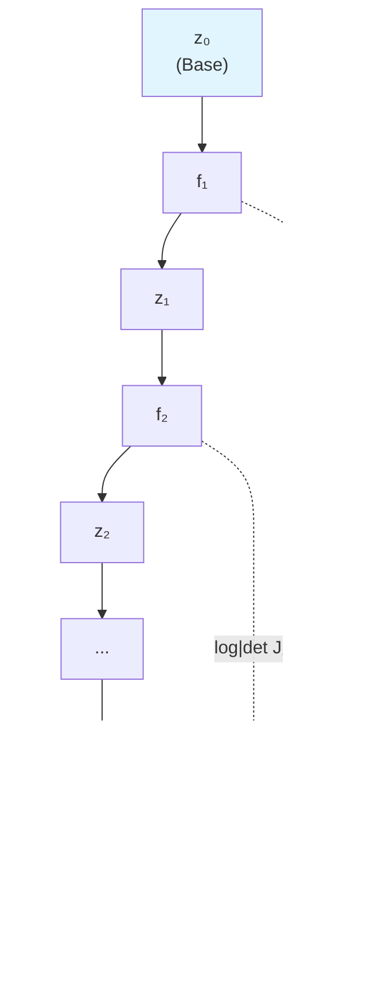
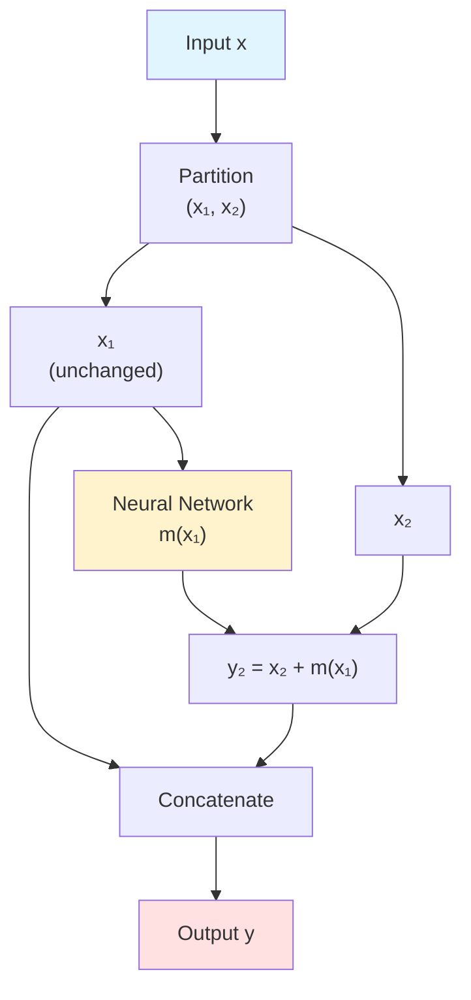
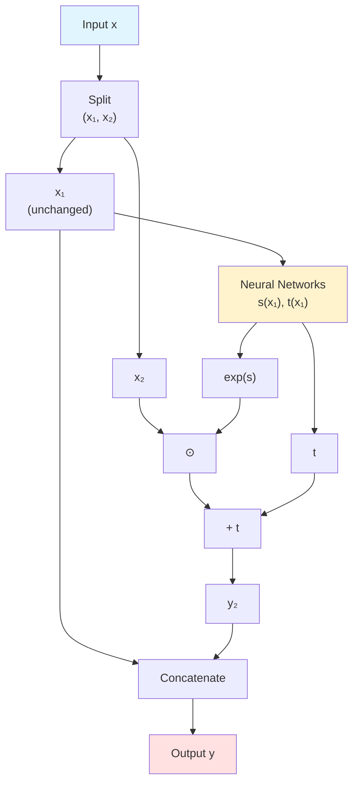
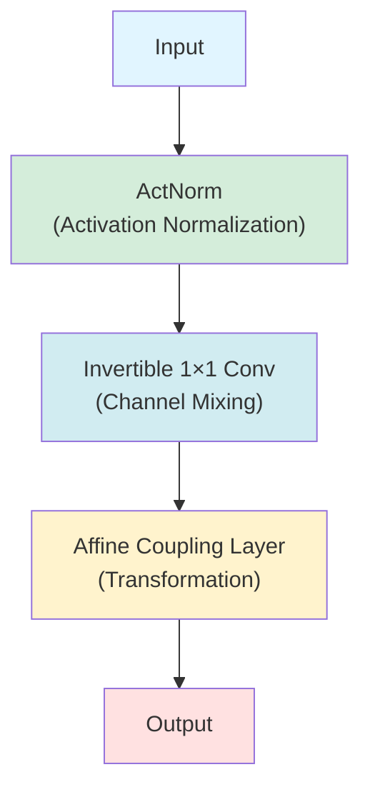
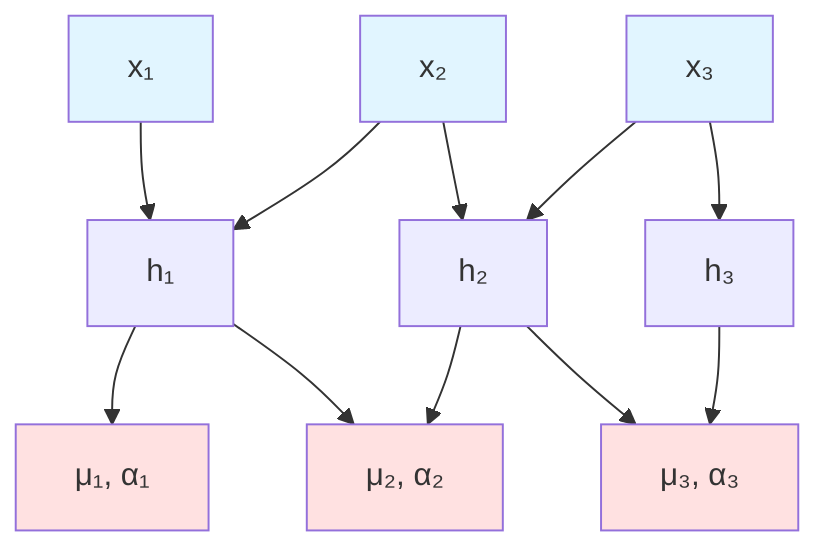
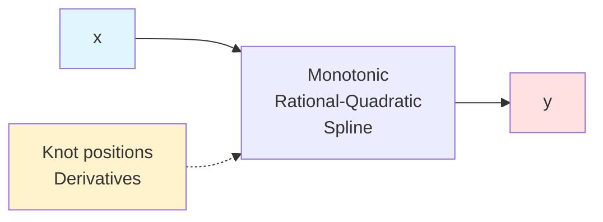
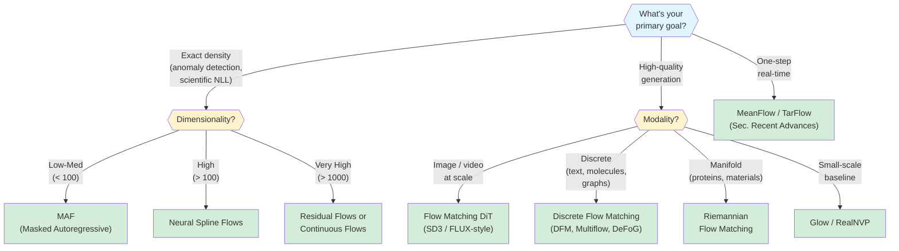

# Normalizing Flows Explained

<div class="grid cards" markdown>

- :material-arrow-decision:{ .lg .middle } **Exact Likelihood**

    ---

    Compute exact log-likelihood through tractable Jacobian determinants, enabling precise density estimation

- :material-sync:{ .lg .middle } **Bijective Transformations**

    ---

    Invertible mappings allow both efficient sampling and exact inference through forward and inverse passes

- :material-chart-bell-curve:{ .lg .middle } **Flexible Distributions**

    ---

    Transform simple base distributions into complex target distributions through learned compositions

- :material-speedometer:{ .lg .middle } **Fast Generation**

    ---

    Single-pass or few-step sampling with modern architectures achieving real-time performance

</div>

---

!!! tip "New here?"
    For a one-page map of how flows fit next to VAEs, GANs, Diffusion, EBMs, and Autoregressive models, start with [**Generative Models — A Unified View**](generative-models-unified.md). This page is the deep-dive on normalizing flows and flow matching specifically.

## Overview

Normalizing flows, introduced by [Rezende & Mohamed (2015)](https://arxiv.org/abs/1505.05770) and [Dinh et al. (2014 — NICE)](https://arxiv.org/abs/1410.8516), are a class of generative models that provide **exact likelihood computation** and **efficient sampling** through invertible transformations. Unlike VAEs that optimize approximate lower bounds or GANs that learn implicit distributions, flows transform simple base distributions into complex data distributions via learned bijective mappings with tractable Jacobian determinants. The 2022–2026 wave of *flow matching* ([Lipman et al., 2023](https://arxiv.org/abs/2210.02747); [Liu et al., 2023](https://arxiv.org/abs/2209.03003); [Albergo & Vanden-Eijnden, 2023](https://arxiv.org/abs/2303.08797)) has unified flows with diffusion models and put them at the core of every modern large-scale image and video generator (Stable Diffusion 3, FLUX.1, HunyuanVideo, Wan 2.x).

**What makes normalizing flows special?** Flows solve a fundamental challenge in generative modeling: simultaneously enabling precise density estimation and efficient sampling. By learning invertible transformations with structured Jacobians, classical flows (NICE, RealNVP, Glow, NSF):

- **Compute exact likelihood** for any data point without approximation
- **Generate samples** through fast inverse transformations
- **Perform exact inference** without variational bounds or adversarial training
- **Train stably** using straightforward maximum likelihood objectives

!!! note "Two flavours of flow"
    The 2022–2026 *flow-matching* generation (Lipman, Liu, Albergo, …) trades the *exact-likelihood / structured-Jacobian* requirement for **architectural freedom** — flow-matching networks are unconstrained DiTs / U-Nets trained by L2 regression on a vector field. They retain tractable likelihood through the *probability-flow ODE*, but in practice are used purely as fast generators. This document covers both: the discrete-step classical-flow architectures (Sections "Flow Model Architectures" → "Training Normalizing Flows") and the continuous-time / flow-matching family (Sections "Continuous-Time Flows" → "Recent Advances").

Breakthroughs from 2023 through 2026 — flow matching, rectified flow, mean flows, discrete flow matching, and Riemannian / equivariant variants — have *closed* the performance gap with diffusion: rectified-flow transformers now power SD3 and FLUX.1, mean flows match diffusion FID at one NFE ([Geng et al., NeurIPS 2025](https://arxiv.org/abs/2505.13447)), and discrete flow matching matches autoregressive language models on math and reasoning benchmarks. NeurIPS 2025 alone accepted **30+ flow-matching papers** and ICLR 2026 received **150+ flow-matching submissions** — see [Recent Advances (2024–2026)](#recent-advances-20242026-flow-matching-mean-flows-and-modern-variants) below.

### The Intuition: Probability Transformations

Think of normalizing flows like a sequence of coordinate transformations on a map:

1. **Start with simple terrain** (base distribution) - a flat, uniform grid easy to sample from

2. **Apply transformations** - each step warps, stretches, and reshapes the terrain while maintaining a perfect one-to-one correspondence between original and transformed coordinates

3. **Track volume changes** - the Jacobian determinant measures how much each region expands or contracts, ensuring probability mass is conserved

4. **Compose transformations** - stack multiple simple warps to create arbitrarily complex landscapes (data distributions)

The critical insight: by carefully designing transformations where we can efficiently compute both the forward mapping and the volume change, we get a model that can both generate samples (apply the transformation) and evaluate probabilities (apply the inverse and account for volume changes).

---

## Mathematical Foundation

### The Change of Variables Formula

The change of variables formula serves as the **cornerstone of all normalizing flow architectures**. Given a random variable $\mathbf{z}$ with known density $p_\mathcal{Z}(\mathbf{z})$ and an invertible transformation $\mathbf{x} = f(\mathbf{z})$, the density of $\mathbf{x}$ becomes:

$$
p_\mathcal{X}(\mathbf{x}) = p_\mathcal{Z}(f^{-1}(\mathbf{x})) \left| \det \frac{\partial f^{-1}}{\partial \mathbf{x}} \right|
$$

Or equivalently in log space:

$$
\log p_\mathcal{X}(\mathbf{x}) = \log p_\mathcal{Z}(\mathbf{z}) + \log \left| \det \frac{\partial f^{-1}}{\partial \mathbf{x}} \right|
$$

where $\mathbf{z} = f^{-1}(\mathbf{x})$.

!!!note "Geometric Intuition"
    The Jacobian determinant $\left| \det \frac{\partial f}{\partial \mathbf{z}} \right|$ quantifies the **relative change in volume** of an infinitesimal neighborhood under transformation $f$. When the transformation expands a region ($|\det J| > 1$), the probability density must decrease proportionally to conserve total probability mass. Conversely, contraction ($|\det J| < 1$) concentrates probability, increasing density.

For $D$-dimensional vectors, the Jacobian matrix $J_f(\mathbf{z})$ is the $D \times D$ matrix of partial derivatives $[\frac{\partial f_i}{\partial z_j}]$. Computing a general determinant requires $O(D^3)$ operations, which becomes **intractable for high-dimensional data** like 256×256 RGB images with $D = 196{,}608$ dimensions.

The entire field of normalizing flows revolves around designing transformations with **structured Jacobians**—triangular, diagonal, or block-structured matrices where determinants reduce to $O(D)$ computations.

### Composing Multiple Transformations

A single invertible transformation typically provides limited modeling capacity. The power of flows emerges through **composition**: stacking $K$ transformations:

$$
\mathbf{x} = f_K \circ f_{K-1} \circ \cdots \circ f_1(\mathbf{z})
$$

The log-likelihood decomposes additively:

$$
\log p_\mathcal{X}(\mathbf{x}) = \log p_\mathcal{Z}(\mathbf{z}_0) + \sum_{k=1}^{K} \log \left| \det \frac{\partial f_k}{\partial \mathbf{z}_{k-1}} \right|
$$

where $\mathbf{z}_0 = \mathbf{z}$ and $\mathbf{z}_k = f_k(\mathbf{z}_{k-1})$ for $k=1,\ldots,K$.


```mermaid
graph TD
    Z0["z₀<br/>(Base)"] --> F1["f₁"]
    F1 --> Z1["z₁"]
    Z1 --> F2["f₂"]
    F2 --> Z2["z₂"]
    Z2 --> Dots["..."]
    Dots --> FK["f_K"]
    FK --> X["x<br/>(Data)"]

    F1 -.->|"log|det J₁|"| LogDet1["Σ log-det"]
    F2 -.->|"log|det J₂|"| LogDet1
    FK -.->|"log|det J_K|"| LogDet1

    style Z0 fill:#e1f5ff
    style X fill:#ffe1e1
    style LogDet1 fill:#fff3cd
```

!!!tip "Additive Structure in Log-Space"
    The chain rule for Jacobians states $\det J_{f_2 \circ f_1}(\mathbf{u}) = \det J_{f_2}(f_1(\mathbf{u})) \cdot \det J_{f_1}(\mathbf{u})$, so log-determinants simply add: $\log|\det J_\text{total}| = \sum_k \log|\det J_k|$. This ensures numerical stability and makes total computational cost $O(KD)$ when each layer has $O(D)$ Jacobian computation.

### Three Requirements for Flow Layers

For a transformation $f$ to be a valid flow layer, it must satisfy:

1. **Invertibility**: $f$ must be bijective (one-to-one and onto)
2. **Efficient Jacobian**: $\log \left| \det \frac{\partial f}{\partial \mathbf{z}} \right|$ must be tractable to compute
3. **Efficient Inverse**: $f^{-1}$ must be computable efficiently (for sampling)

Different flow architectures make different trade-offs among these requirements.

### Base Distribution

The base distribution $p_\mathcal{Z}(\mathbf{z})$ is typically chosen to be simple for efficient sampling:

**Standard Gaussian** (most common):

$$
p_\mathcal{Z}(\mathbf{z}) = \mathcal{N}(\mathbf{z}; \mathbf{0}, \mathbf{I}) = \frac{1}{(2\pi)^{D/2}} \exp\left(-\frac{1}{2}\|\mathbf{z}\|^2\right)
$$

**Uniform** (less common):

$$
p_\mathcal{Z}(\mathbf{z}) = \mathcal{U}(\mathbf{z}; -a, a) = \frac{1}{(2a)^D} \mathbb{1}_{[-a,a]^D}(\mathbf{z})
$$

---

## Flow Model Architectures

Artifex provides implementations of several state-of-the-art flow architectures, each with different trade-offs between expressiveness, computational efficiency, and ease of use.

### 1. NICE: Pioneering Coupling Layers

**NICE** ([Dinh, Krueger & Bengio, 2014](https://arxiv.org/abs/1410.8516)) — Non-linear Independent Components Estimation — introduced **additive coupling layers** that made normalizing flows practical for high-dimensional data.

**Coupling Layer Mechanism:**

Given input $\mathbf{x} \in \mathbb{R}^D$, partition into $(\mathbf{x}_1, \mathbf{x}_2)$:

$$
\begin{align}
\mathbf{y}_1 &= \mathbf{x}_1 \\
\mathbf{y}_2 &= \mathbf{x}_2 + m(\mathbf{x}_1)
\end{align}
$$

where $m$ can be **any arbitrary function** (typically a neural network).

**Key Properties:**

- **Volume-preserving**: $\log|\det(\mathbf{J})| = 0$ (determinant is exactly 1)
- **Efficient inverse**: $\mathbf{x}_1 = \mathbf{y}_1$, $\mathbf{x}_2 = \mathbf{y}_2 - m(\mathbf{y}_1)$
- **No Jacobian computation**: The triangular structure makes the determinant trivial
- **Arbitrary coupling function**: $m$ can be arbitrarily complex without affecting computational cost


```mermaid
graph TB
    X["Input x"] --> Split["Partition<br/>(x₁, x₂)"]
    Split --> X1["x₁<br/>(unchanged)"]
    Split --> X2["x₂"]

    X1 --> NN["Neural Network<br/>m(x₁)"]
    NN --> Add["y₂ = x₂ + m(x₁)"]
    X2 --> Add

    X1 --> Concat["Concatenate"]
    Add --> Concat
    Concat --> Y["Output y"]

    style X fill:#e1f5ff
    style Y fill:#ffe1e1
    style NN fill:#fff3cd
```

**When to Use NICE:**

- Fast forward and inverse computations required
- Volume-preserving transformations are acceptable
- Starting point for understanding coupling layers
- Lower-dimensional problems (hundreds of dimensions)

### 2. RealNVP: Adding Scale for Expressiveness

**RealNVP** ([Dinh, Sohl-Dickstein & Bengio, 2017 — ICLR](https://arxiv.org/abs/1605.08803)) — Real-valued Non-Volume Preserving — extends NICE with **affine coupling layers**:

$$
\begin{align}
\mathbf{y}_1 &= \mathbf{x}_1 \\
\mathbf{y}_2 &= \mathbf{x}_2 \odot \exp(s(\mathbf{x}_1)) + t(\mathbf{x}_1)
\end{align}
$$

where $s(\cdot)$ and $t(\cdot)$ are neural networks outputting scale and translation, and $\odot$ denotes element-wise multiplication.

**Key Properties:**

- **Tractable Jacobian**: $\log|\det(\mathbf{J})| = \sum_i s_i(\mathbf{x}_1)$
- **Efficient inverse**:
  $$
  \begin{align}
  \mathbf{x}_1 &= \mathbf{y}_1 \\
  \mathbf{x}_2 &= (\mathbf{y}_2 - t(\mathbf{y}_1)) \odot \exp(-s(\mathbf{y}_1))
  \end{align}
  $$
- **Alternating masks**: Alternate which dimensions are transformed across layers
- **No gradient through scale/translation**: $s$ and $t$ can be arbitrarily complex ResNets


```mermaid
graph TB
    X["Input x"] --> Split["Split<br/>(x₁, x₂)"]
    Split --> X1["x₁<br/>(unchanged)"]
    Split --> X2["x₂"]

    X1 --> NN["Neural Networks<br/>s(x₁), t(x₁)"]
    NN --> Scale["exp(s)"]
    NN --> Trans["t"]

    X2 --> Mult["⊙"]
    Scale --> Mult
    Mult --> Add["+ t"]
    Trans --> Add
    Add --> Y2["y₂"]

    X1 --> Concat["Concatenate"]
    Y2 --> Concat
    Concat --> Y["Output y"]

    style X fill:#e1f5ff
    style Y fill:#ffe1e1
    style NN fill:#fff3cd
```

**Multi-Scale Architecture:**

RealNVP introduced hierarchical structure that revolutionized flow-based modeling:

1. **Squeeze operation**: Reshape $s \times s \times c$ tensors into $\frac{s}{2} \times \frac{s}{2} \times 4c$
2. **Factor out**: After several coupling layers, factor out half the channels to the prior
3. **Continue processing**: Transform remaining channels at higher resolution

This enables modeling 256×256 images by avoiding the prohibitive cost of applying dozens of layers to all 196,608 dimensions simultaneously.

**When to Use RealNVP:**

- Need both fast sampling and density estimation
- Working with continuous data, especially images
- Image generation tasks at moderate to high resolution
- Moderate-dimensional data (hundreds to thousands of dimensions)

### 3. Glow: Learnable Permutations

**Glow** ([Kingma & Dhariwal, 2018 — NeurIPS](https://arxiv.org/abs/1807.03039)) extends RealNVP with three key block-level innovations. Artifex retains these Glow blocks as a single-scale image flow baseline rather than the paper's squeeze/split multi-scale hierarchy.

**Glow Block Architecture:**

Each flow step combines three layers:


```mermaid
graph TB
    X["Input"] --> AN["ActNorm<br/>(Activation Normalization)"]
    AN --> Conv["Invertible 1×1 Conv<br/>(Channel Mixing)"]
    Conv --> Coup["Affine Coupling Layer<br/>(Transformation)"]
    Coup --> Y["Output"]

    style X fill:#e1f5ff
    style Y fill:#ffe1e1
    style AN fill:#d4edda
    style Conv fill:#d1ecf1
    style Coup fill:#fff3cd
```

**1. ActNorm (Activation Normalization):**

Per-channel affine transformation with trainable parameters:

$$
y_{i,j,c} = s_c \cdot x_{i,j,c} + b_c
$$

- Data-dependent initialization: normalize first minibatch to zero mean, unit variance
- Enables training with **batch size 1** (critical for high-resolution images)
- $\log|\det J| = H \cdot W \cdot \sum_c \log|s_c|$ for $H \times W$ spatial dimensions

**2. Invertible 1×1 Convolution:**

Learned linear mixing of channels using invertible matrix $\mathbf{W}$:

$$
\mathbf{y} = \mathbf{W} \mathbf{x}
$$

- Replaces fixed permutations with learned channel mixing
- LU decomposition: $\mathbf{W} = \mathbf{P} \cdot \mathbf{L} \cdot (\mathbf{U} + \text{diag}(\mathbf{s}))$
- Determinant: $\log|\det \mathbf{W}| = \sum_i \log|s_i|$ (reduced to $O(c)$)
- Improved log-likelihood by ~0.5 bits/dimension over fixed permutations

**3. Affine Coupling Layer:**

Similar to RealNVP but with the above improvements.

**When to Use Glow in Artifex:**

- Need a fixed-size image flow with learnable channel mixing
- Want exact likelihood with image-shaped forward and inverse transforms
- Need ActNorm plus invertible 1×1 convolutions as a stronger image baseline
- Want a deeper single-scale alternative to RealNVP on image tensors

!!!tip "Artifex Runtime Note"
    The retained implementation is configured through `image_shape` and
    `blocks_per_scale`. If you need the original paper's multi-scale
    squeeze/split hierarchy, you will need a different runtime.

### 4. MAF: Masked Autoregressive Flow

**MAF** ([Papamakarios, Pavlakou & Murray, 2017 — NeurIPS](https://arxiv.org/abs/1705.07057)) uses **autoregressive** transformations where each dimension depends on all previous dimensions, providing maximum expressiveness at the cost of sequential sampling.

**Autoregressive Transformation:**

$$
z_i = (x_i - \mu_i(x_{<i})) \cdot \exp(-\alpha_i(x_{<i}))
$$

where $\mu_i$ and $\alpha_i$ are computed by a **MADE** (Masked Autoencoder for Distribution Estimation) network.

**MADE Architecture** ([Germain et al., 2015 — ICML](https://arxiv.org/abs/1502.03509)):

Uses masked connections to ensure autoregressive property—each output depends only on previous inputs:


```mermaid
graph TB
    X1["x₁"] --> H1["h₁"]
    X2["x₂"] --> H1
    X2 --> H2["h₂"]
    X3["x₃"] --> H2
    X3 --> H3["h₃"]

    H1 --> Z1["μ₁, α₁"]
    H1 --> Z2["μ₂, α₂"]
    H2 --> Z2
    H2 --> Z3["μ₃, α₃"]
    H3 --> Z3

    style X1 fill:#e1f5ff
    style X2 fill:#e1f5ff
    style X3 fill:#e1f5ff
    style Z1 fill:#ffe1e1
    style Z2 fill:#ffe1e1
    style Z3 fill:#ffe1e1
```

**Trade-offs:**

| Direction | Complexity | Use Case |
|-----------|------------|----------|
| **Forward (density)** | $O(1)$ passes | All dimensions computed in parallel |
| **Inverse (sampling)** | $O(D)$ passes | Sequential computation required |

**When to Use MAF:**

- **Density estimation is the primary goal**
- Sampling speed is less critical
- Tabular or low-to-moderate dimensional data
- Need highly expressive transformations
- All dimensions should interact

### 5. IAF: Inverse Autoregressive Flow

**IAF** ([Kingma et al., 2016 — NeurIPS](https://arxiv.org/abs/1606.04934)) is the "inverse" of MAF with **opposite computational trade-offs**:

$$
y_i = x_i \cdot \exp(\alpha_i(y_{<i})) + \mu_i(y_{<i})
$$

**Trade-offs:**

| Direction | Complexity | Use Case |
|-----------|------------|----------|
| **Forward (density)** | $O(D)$ passes | Sequential computation |
| **Inverse (sampling)** | $O(1)$ passes | All dimensions computed in parallel |

**When to Use IAF:**

- **Fast sampling is the primary goal**
- Density estimation is secondary or not needed
- Variational inference (amortized inference in VAEs)
- Real-time generation applications

### 6. Neural Spline Flows

**Neural Spline Flows** ([Durkan, Bekasov, Murray & Papamakarios, 2019 — NeurIPS](https://arxiv.org/abs/1906.04032)) use **monotonic rational-quadratic splines** to create highly expressive yet tractable transformations.

**Rational-Quadratic Spline Transform:**

Each spline maps interval $[-B, B]$ to itself using $K$ rational-quadratic segments, parameterized by:

- $K+1$ knot positions $\{(x^{(k)}, y^{(k)})\}$
- $K+1$ derivative values $\{\delta^{(k)}\}$

Within segment $k$, the transformation applies a ratio of quadratic polynomials.

**Key Properties:**

- **Strict monotonicity**: Ensures invertibility
- **Smooth derivatives**: No discontinuities (unlike piecewise-linear)
- **Closed-form operations**: Forward evaluation, analytic inverse (quadratic equation), closed-form derivative
- **Universal approximation**: With sufficient bins (8-16 typically suffice)


```mermaid
graph LR
    Input["x"] --> Spline["Monotonic<br/>Rational-Quadratic<br/>Spline"]
    Spline --> Output["y"]
    Params["Knot positions<br/>Derivatives"] -.-> Spline

    style Input fill:#e1f5ff
    style Output fill:#ffe1e1
    style Params fill:#fff3cd
```

**Compared to alternatives:**

- **vs Affine**: ~23 parameters per dimension vs 2, much more expressive
- **vs Neural Autoregressive Flows**: No iterative root-finding needed
- **vs Flow++**: No bisection algorithms required
- **vs Piecewise-linear**: Smooth derivatives improve optimization

**Results:**

- **CIFAR-10**: 3.38 bits/dimension using 10× fewer parameters than Glow
- **Best-in-class** likelihood on multiple density estimation benchmarks

**When to Use Neural Spline Flows:**

- **Maximum expressiveness** with tractability
- Density estimation on complex distributions
- Want fewer parameters than Glow
- Need smooth, differentiable transformations

---

## Training Normalizing Flows

### Maximum Likelihood Objective

Flow training optimizes the straightforward objective of **maximum likelihood**:

$$
\max_\theta \mathbb{E}_{x \sim p_\text{data}}[\log p_\theta(x)]
$$

Equivalently, minimize negative log-likelihood:

$$
\mathcal{L}(\theta) = -\mathbb{E}_{x \sim p_\text{data}}\left[\log p_u(f^{-1}_\theta(x)) + \log \left| \det \frac{\partial f^{-1}_\theta}{\partial x} \right|\right]
$$

This simplicity contrasts sharply with:

- **GANs**: Adversarial minimax optimization with mode collapse risks
- **VAEs**: ELBO with reconstruction-regularization trade-off
- **Diffusion**: Multi-step denoising with noise schedule design

!!!tip "Training Stability"
    Gradients flow through the entire composition automatically via backpropagation. Standard optimizers like Adam with learning rates around $10^{-3}$ work reliably. The monotonic improvement of likelihood makes training highly stable.

### Critical Preprocessing Steps

Proper preprocessing proves **essential for successful training**:

**1. Dequantization:**

Discrete data (e.g., uint8 images) create delta peaks in continuous space, allowing flows to assign arbitrarily high likelihood to exact discrete values while ignoring intermediate regions.

```python
# Uniform dequantization
rng, noise_key = jax.random.split(rng)
x_dequantized = x + jax.random.uniform(noise_key, x.shape, dtype=x.dtype) / 256.0

# Variational dequantization (more sophisticated)
noise = flow_model_for_noise(x)
x_dequantized = x + noise / 256.0
```

**2. Logit Transform:**

Maps bounded $[0,1]$ data to unbounded $(-\infty, +\infty)$ space matching Gaussian priors:

```python
# Add small constant for numerical stability
alpha = 0.05
x = alpha + (1 - 2*alpha) * x

# Apply logit transform
x_logit = jnp.log(x) - jnp.log1p(-x)
```

!!!warning "Critical Importance"
    Without these preprocessing steps, training diverges immediately as the model tries to match bounded data to Gaussian base distributions.

### Numerical Stability Techniques

**1. Log-Space Computation:**

Never compute $\det(J)$ directly—immediate overflow/underflow:

```python
# WRONG
det_J = jnp.linalg.det(jacobian)
log_det = jnp.log(det_J)  # Overflow!

# CORRECT
sign, log_det = jnp.linalg.slogdet(jacobian)
# Or for triangular Jacobians:
log_det = jnp.sum(jnp.log(jnp.abs(jnp.diagonal(jacobian))))
```

**2. Gradient Clipping:**

Prevents exploding gradients in deep architectures (10-15+ layers):

```python
tx = optax.chain(
    optax.clip_by_global_norm(1.0),
    optax.adam(learning_rate=1e-3),
)
```

**3. Normalization Layers:**

Batch normalization or ActNorm stabilizes intermediate representations:

```python
# ActNorm: data-dependent initialization
scale, bias = compute_initial_stats(first_batch)
# Then treat as learnable parameters
```

**4. Learning Rate Schedules:**

Polynomial decay with warmup improves convergence:

```python
# Warmup: 2-10 epochs linear increase
# Main training: polynomial decay from 1e-3 to 1e-4
scheduler = PolynomialDecay(optimizer, warmup_steps=1000,
                           total_steps=100000)
```

### Monitoring Training

Watch these metrics:

1. **Negative log-likelihood**: Should decrease steadily
2. **Per-layer log-determinants**: Monitor for sudden spikes (numerical issues)
3. **Reconstruction error**: $\|x - f(f^{-1}(x))\| < 10^{-5}$ for numerical stability
4. **Bits per dimension**: For images, $\text{bpd} = \frac{\text{NLL}}{D \cdot \log 2}$

```python
# Invertibility check
x_reconstructed = flow.inverse(flow.forward(x))
recon_error = jnp.mean(jnp.abs(x - x_reconstructed))
assert recon_error < 1e-5, f"Poor invertibility: {recon_error}"
```

### Common Pitfalls and Solutions

<div class="grid cards" markdown>

- :material-alert-circle: **Missing Preprocessing**

    ---

    **Symptom**: Immediate divergence or NaN losses

    **Solution**: Always dequantize discrete data and apply logit transform

- :material-alert-circle: **Numerical Instability**

    ---

    **Symptom**: Sudden spikes in log-determinants or NaN gradients

    **Solution**: Use log-space computation, gradient clipping, monitor per-layer statistics

- :material-alert-circle: **Poor Invertibility**

    ---

    **Symptom**: $\|x - f^{-1}(f(x))\| > 10^{-3}$

    **Solution**: Use residual flows with soft-thresholding, reduce depth, check numerical precision

- :material-alert-circle: **Slow Convergence**

    ---

    **Symptom**: Likelihood plateaus early

    **Solution**: Increase model capacity, add more layers, use spline flows, check preprocessing

</div>

---

## Continuous-Time Flows and Foundational Flow Matching

The architectures above (NICE through Neural Spline) are **discrete-step flows**: a finite stack of invertible layers, each with a tractable structured Jacobian. The continuous-time variants below replace the layer stack with an ODE / vector-field formulation. This is the lineage that produced flow matching, rectified flow, and ultimately the rectified-flow MMDiT in Stable Diffusion 3 and FLUX.1. The recent **2024–2026 specialisations** (Mean Flows, OT-CFM, CFG-Zero*, Stable Velocity, etc.) are organised in their own [Recent Advances section](#recent-advances-20242026-flow-matching-mean-flows-and-modern-variants) below.

### Continuous Normalizing Flows (Neural ODEs)

**Continuous flows** ([Chen et al., 2018 — NeurIPS Best Paper](https://arxiv.org/abs/1806.07366); [Grathwohl et al., 2019 — FFJORD](https://arxiv.org/abs/1810.01367)) parameterize the derivative of the hidden state:

$$
\frac{d\mathbf{z}_t}{dt} = f(\mathbf{z}_t, t, \theta)
$$

The output $\mathbf{z}_1$ at time $t=1$ given initial condition $\mathbf{z}_0$ at $t=0$ is computed using ODE solvers.

**Key Innovation (FFJORD):**

The change in log-density follows:

$$
\frac{d \log p(\mathbf{z}_t)}{dt} = -\text{Tr}\left(\frac{\partial f}{\partial \mathbf{z}_t}\right)
$$

**Hutchinson's trace estimator** makes this tractable:

$$
\text{Tr}(A) \approx \mathbf{v}^T A \mathbf{v} \quad \text{where } \mathbf{v} \sim \mathcal{N}(0, I)
$$

This unbiased stochastic estimate requires only one Jacobian-vector product per sample, reducing complexity from $O(D^2)$ to $O(D)$.

**Advantages:**

- **No architectural constraints**: Any neural network architecture works
- **Flexible expressiveness**: Can model disconnected regions and sharp boundaries
- **Adjoint method**: Memory-efficient training ($O(1)$ memory vs $O(\text{depth})$)

**Challenges:**

- **Unpredictable cost**: Number of function evaluations adapts to complexity
- **Stiff dynamics**: Can struggle with certain distributions
- **Slower than discrete flows**: Requires ODE integration

**When to Use:**

- Modeling distributions with disconnected regions
- Physics simulation, molecular dynamics
- Scientific domains requiring flexible unrestricted networks

### Residual Flows: Invertible ResNets

**Residual flows** ([Behrmann et al., 2019 — i-ResNet, ICML](https://arxiv.org/abs/1811.00995); [Chen et al., 2019 — Residual Flows, NeurIPS](https://arxiv.org/abs/1906.02735)) make standard ResNet architectures $F(\mathbf{x}) = \mathbf{x} + g(\mathbf{x})$ invertible by constraining $g$ to be **contractive** with Lipschitz constant $L < 1$.

**Invertibility via Fixed-Point Iteration:**

The Banach fixed-point theorem guarantees bijection with inverse computable via:

$$
\mathbf{x}_{k+1} = \mathbf{y} - g(\mathbf{x}_k)
$$

which converges exponentially to the true inverse.

**Spectral Normalization:**

Enforces the constraint by normalizing weight matrices:

$$
\mathbf{W} \leftarrow \frac{\mathbf{W}}{\|\mathbf{W}\|_2 / c} \quad \text{where } c < 1
$$

The spectral norm $\|\mathbf{W}\|_2$ is estimated via power iteration.

**Russian Roulette Estimator:**

For $F(\mathbf{x}) = \mathbf{x} + g(\mathbf{x})$, the log-determinant has power series:

$$
\log|\det(I + J_g)| = \sum_{k=1}^{\infty} \frac{(-1)^{k+1}}{k} \text{Tr}(J_g^k)
$$

Rather than truncating (introducing bias), Russian roulette randomly terminates the series with probability ensuring unbiasedness while maintaining finite computation.

**When to Use:**

- High-dimensional problems (>1000 dimensions)
- Want free-form Jacobians (all dimensions interact)
- Need competitive density estimation with flexibility
- Extensions like Invertible DenseNets for parameter efficiency

### Flow Matching: Simulation-Free Training

**Flow Matching** ([Lipman, Chen, Ben-Hamu, Nickel & Le, 2023 — ICLR](https://arxiv.org/abs/2210.02747)) introduced a paradigm shift for training continuous normalizing flows **without ODE simulation**.

**Key Idea:**

Rather than integrating forward dynamics during training (as in Neural ODEs), perform regression on the vector field of fixed conditional probability paths.

**Training Procedure:**

1. Given samples $\mathbf{x}_0 \sim p_0$ and $\mathbf{x}_1 \sim p_1$
2. Define interpolant: $\mathbf{x}_t = (1-t)\mathbf{x}_0 + t\mathbf{x}_1$
3. Train neural network $\mathbf{v}_\theta(\mathbf{x}_t, t)$ to match conditional vector field:

$$
\min_\theta \mathbb{E}_{t, \mathbf{x}_0, \mathbf{x}_1}\left[\|\mathbf{v}_\theta(\mathbf{x}_t, t) - (\mathbf{x}_1 - \mathbf{x}_0)\|^2\right]
$$

This is simple L2 regression requiring **no simulation**.

**Inference:**

Integrate the learned field using standard ODE solvers:

$$
\frac{d\mathbf{x}}{dt} = \mathbf{v}_\theta(\mathbf{x}, t), \quad t \in [0, 1]
$$

**Optimal Transport Flow Matching:**

Uses **minibatch optimal transport** to couple noise and data samples before interpolation, creating straighter paths that require fewer integration steps.

**Results:**

- State-of-the-art on ImageNet
- Better likelihood and sample quality than simulation-based methods
- Extensions to Riemannian manifolds, discrete data, video generation

**When to Use:**

- Training continuous flows efficiently
- Want simulation-free gradients
- Need state-of-the-art likelihood
- See [Recent Advances → Conditional Flow Matching](#conditional-flow-matching-and-optimal-transport-couplings) for OT-CFM, Stochastic Interpolants, and the 2024–2026 production picture.

### Rectified Flows: Learning Straight Trajectories

**Rectified Flow** ([Liu, Gong & Liu, 2023 — ICLR](https://arxiv.org/abs/2209.03003)) learns ODEs following **straight-line paths** connecting source and target distributions.

**Training:**

Given coupling between noise samples $\mathbf{u} \sim p_0$ and data samples $\mathbf{x} \sim p_1$:

1. Linearly interpolate: $\mathbf{x}_t = (1-t)\mathbf{u} + t\mathbf{x}$
2. Learn velocity field: $\frac{d\mathbf{x}_t}{dt} = \mathbf{v}_\theta(\mathbf{x}_t, t)$

**Reflow Process (Key Innovation):**

1. Train initial model
2. Generate paired samples: $(\mathbf{u}, \mathbf{x}_{\text{gen}})$ where $\mathbf{x}_{\text{gen}} = \text{model}(\mathbf{u})$
3. Retrain on these pairs

This iterative rectification progressively straightens trajectories.

**Benefits:**

- **Provably non-increasing convex transport costs**
- **One-step or few-step generation**: Straight paths require minimal integration
- **One reflow iteration typically suffices** under realistic settings

**Applications:**

- **Stable Diffusion 3**: Uses rectified flow formulation, outperforms pure diffusion
- **InstaFlow**: Achieves 0.1-second generation demonstrating practical viability
- One-step generation for real-time applications

**When to Use:**

- Need few-step or one-step generation.
- Real-time applications requiring fast inference.
- Want to distill models for deployment.
- The successor methods that achieve *one*-step generation without distillation (Mean Flows, TarFlow) are covered in [Recent Advances → Mean Flows](#mean-flows-one-step-generation-without-distillation).

### Discrete Flow Matching

**Discrete Flow Matching** ([Gat et al., 2024 — NeurIPS Spotlight](https://arxiv.org/abs/2407.15595); [Campbell et al., 2024 — NeurIPS](https://arxiv.org/abs/2402.04997)) extends flows to discrete data (text, molecules, code) using **Continuous-Time Markov Chains (CTMC)**.

**Problem:**

Traditional flows designed for continuous data. Dequantization workarounds prove inadequate for inherently discrete data like language.

**Solution:**

CTMC process with learnable time-dependent transition rates:

$$
\frac{dp_t(x)}{dt} = \sum_{x'} p_t(x') R_t(x' \to x) - p_t(x) \sum_{x'} R_t(x \to x')
$$

**Training:**

Regress on conditional flow:

$$
\min_\theta \mathbb{E}_{t, x_0, x_1}\left[\|R_\theta(x_t, t) - R_{\text{true}}(x_t, t | x_0, x_1)\|^2\right]
$$

**Results:**

- **FlowMol-CTMC**: State-of-the-art molecular validity
- **Code generation**: 1.7B parameter model achieves 13.4% Pass@10 on HumanEval
- **DNA sequence design**: Dirichlet Flow Matching

**When to Use:**

- Text generation (alternative to autoregressive)
- Molecular generation with discrete atom types
- Code generation
- Any discrete structured data

### Geometric Flows: Riemannian Manifolds

**Riemannian Flow Matching** ([Chen & Lipman, 2024](https://arxiv.org/abs/2302.03660)) extends flows to **non-Euclidean geometries**, critical for data on manifolds.

**Applications:**

- **Molecular conformations**: SE(3) equivariant flows
- **Protein structures**: SO(3) rotations and translations
- **Robotic configurations**: Configuration space manifolds
- **Materials**: FlowMM for crystal structure generation (3× efficiency improvement)

**Key Idea:**

Replace Euclidean straight-line interpolants with **geodesics** on the manifold:

$$
\frac{d\mathbf{x}_t}{dt} = \mathbf{v}_\theta(\mathbf{x}_t, t) \quad \text{on manifold } \mathcal{M}
$$

**When to Use:**

- Data naturally lives on manifolds
- Symmetries and geometric constraints are important
- Protein design, molecular generation, materials discovery
- 3D geometry and robotics applications

---

## Recent Advances (2024–2026): Flow Matching, Mean Flows, and Modern Variants

If 2014–2020 was about *making flows tractable* (NICE → RealNVP → Glow → splines) and 2018–2022 about *making them continuous* (Neural ODEs, FFJORD), 2023–2026 is about **flow matching as the unifying training objective** for both flows and diffusion. The field has exploded — **NeurIPS 2025 accepted 30+ flow-matching papers and ICLR 2026 received 150+ submissions** ([npj AI 2025 survey](https://www.nature.com/articles/s44387-025-00066-y); [Awesome Flow Matching list](https://github.com/dongzhuoyao/awesome-flow-matching)). This section organises the headline 2024–2026 contributions into six themes.

### Conditional Flow Matching and Optimal-Transport Couplings

**Conditional Flow Matching (CFM) / Independent CFM (I-CFM)** ([Tong et al., 2024 — TMLR](https://arxiv.org/abs/2302.00482)) generalises Lipman et al.'s flow matching to **arbitrary noise–data couplings**, and introduces:

- **OT-CFM** — uses minibatch *optimal-transport* couplings instead of independent pairs, dramatically straightening trajectories and reducing inference NFEs.
- **SB-CFM** — a Schrödinger-bridge variant that combines OT with stochastic dynamics.

This is the practical recipe behind most modern flow-matching codebases, including the open-source **TorchCFM** library.

**Stochastic Interpolants** ([Albergo & Vanden-Eijnden, 2023](https://arxiv.org/abs/2303.08797); [Albergo et al., 2024](https://arxiv.org/abs/2310.03725)) generalise flow matching with *stochastic* couplings and bridge ODEs and SDEs in a single framework — the framework that underlies SiT, Multitask Stochastic Interpolants ([2026](https://arxiv.org/abs/2508.04605)), and several recent unified objectives.

**Generator Matching** ([Holderrieth et al., 2024](https://arxiv.org/abs/2410.20587)) provides a single objective that subsumes flow matching, score matching, and discrete-flow training — the conceptual capstone of the 2023–2024 line of work.

### Mean Flows: One-Step Generation Without Distillation

**Mean Flows** ([Geng, Deng, Bai, Kolter & He, 2025 — NeurIPS Oral](https://arxiv.org/abs/2505.13447)) replace flow matching's *instantaneous* velocity field with the **average velocity** along a trajectory:

$$
u^{\text{mean}}_\theta(x_t, s, t) \;\approx\; \frac{1}{t - s}\!\int_s^t v(x_\tau, \tau)\, d\tau.
$$

Training uses a closed-form identity between average and instantaneous velocities, requiring **no pre-training, no distillation, and no curriculum**. The single-network model achieves:

- **FID 3.43 at 1 NFE on ImageNet 256² — trained from scratch** (vs. flow-matching teachers needing 25–50 NFE for matching quality).

Follow-ups include **AlphaFlow** ([2025–2026](https://arxiv.org/abs/2510.20771)) — a careful study of why MeanFlow works and how to improve its variance — and **Pixel Mean Flows** ([2026](https://arxiv.org/abs/2601.22158)) — one-step *latent-free* image generation directly in pixel space. Mean flows are the cleanest demonstration to date that flows can match diffusion at near-zero inference cost without adversarial distillation.

### Classifier-Free Guidance for Flow Matching

Standard CFG ([Ho & Salimans, 2022](https://arxiv.org/abs/2207.12598)) was designed for diffusion models; the 2025 wave adapts it specifically to flow matching:

- **CFG-Zero*** ([Fan et al., 2025](https://arxiv.org/abs/2503.18886)) — observes that early-step velocity estimates undershoot in flow ODEs, and introduces (a) an **optimised guidance scale** correcting velocity inaccuracies, plus (b) **zero-init**, which zeroes the first few ODE-solver steps. Consistently outperforms standard CFG on Lumina-Next, SD3, FLUX.1, and Wan-2.1.
- **Flow-Matching Guidance Theory** ([2024–25](https://openreview.net/forum?id=pKaNgFzJBy)) — first general framework deriving guidance techniques applicable to flow matching beyond CFG.

### Discrete Flow Matching at Scale

Discrete flow matching has matured rapidly:

- **DFM** ([Gat et al., 2024 — NeurIPS Spotlight](https://arxiv.org/abs/2407.15595)) and **Multiflow** ([Campbell et al., 2024](https://arxiv.org/abs/2402.04997)) — CTMC-based flows for categorical data; foundation for the modern discrete-flow literature.
- **Fisher Flow** ([Davis et al., 2024](https://arxiv.org/abs/2405.14664)) — a *geometric* discrete flow that interprets categorical distributions as points on a statistical manifold with the Fisher–Rao metric.
- **DeFoG** ([Ho et al., ICML 2025](https://icml.cc/virtual/2025/poster/45644)) — DFM applied to graph generation; current SOTA on molecular graph synthesis.
- **Discrete Flow Matching as AR Post-Training** ([2025](https://dl.acm.org/doi/10.1145/3768292.3770442)) — surprisingly effective post-training to fix compound-error accumulation in autoregressive language models.

These connect to the broader **diffusion language model** family (LLaDA, Mercury, Dream — see the [Diffusion explainer](diffusion-explained.md#diffusion-language-models-20242026)). DFM and masked discrete diffusion are unified under the same CTMC formalism.

### Variance-Reduced Training and Inference-Time Scaling

A 2025–2026 line of work attacks the *variance* of flow-matching gradient estimators and the *inference* compute budget:

- **Stable Velocity** ([2026](https://arxiv.org/abs/2602.05435)) — a variance-perspective on flow matching that reveals a two-regime structure; introduces **StableVM** for unbiased variance-reduced training, **VA-REPA** for selective auxiliary supervision, and **StableVS** for finetuning-free acceleration.
- **Inference-Time Compute Scaling for Flow Matching** ([2025](https://arxiv.org/abs/2510.17786)) — first method to demonstrate inference-time compute scaling for FM models, with applications to protein design and folding.
- **An Error Analysis of Flow Matching** ([NeurIPS 2024](https://openreview.net/forum?id=vES22INUKm)) — first complete theoretical analysis of how errors compound in flow-matching CNFs; informs the variance-reduction methods above.
- **Local Flow Matching** ([NeurIPS 2024](https://openreview.net/forum?id=MM197t8WlM)) and **Wasserstein Flow Matching** ([NeurIPS 2024](https://openreview.net/forum?id=HB4lr0ykTi)) — generative modelling over *families* of distributions and over Wasserstein space respectively.

### Flow Map Matching and Consistency Bridges

**Flow Map Matching** ([Boffi et al., 2024](https://arxiv.org/abs/2406.07507)) is a unifying mathematical framework that **subsumes consistency models, mean flows, and rectified-flow distillation** under a single objective: learn a *flow map* $\Phi(x_t, s, t)$ that pushes samples between any two times $s$ and $t$ along the ODE. Mean flows correspond to a particular parameterisation; consistency models are the special case $s = 0$.

### Production-Scale Flow Matching

By 2026, rectified-flow / flow-matching transformers are a common recipe for new large-scale visual generators, especially when paired with latent codecs and DiT / MMDiT backbones:

- **Stable Diffusion 3 / 3.5** ([Esser et al., 2024 — MMDiT](https://arxiv.org/abs/2403.03206)) — rectified-flow MMDiT with Logit-Normal $t$ sampling.
- **FLUX.1** ([Black Forest Labs, 2024](https://github.com/black-forest-labs/flux)) — 12B-parameter rectified-flow transformer.
- **HunyuanVideo, Wan 2.1 / 2.2, CogVideoX, Mochi-1** — all flow-matching DiTs over video VAE latents.
- **Flowception** ([2026](https://arxiv.org/abs/2512.11438)) — temporally-expansive, variable-length non-autoregressive video flow matching.

### Surveys and Resources

| Resource | Year | Scope |
| --- | --- | --- |
| [*Flow Matching Meets Biology and Life Science: A Survey*](https://arxiv.org/abs/2507.17731) (Nature npj AI) | 2025 | Comprehensive recent survey; biological applications + variant taxonomy |
| [*Flow matching for generative modelling in bioinformatics*](https://www.nature.com/articles/s42256-026-01220-0) (Nature MI) | 2026 | Theoretical foundations + computational biology applications |
| [Awesome Flow Matching](https://github.com/dongzhuoyao/awesome-flow-matching) | continuously updated | Curated list of flow-matching papers |
| [TorchCFM](https://github.com/atong01/conditional-flow-matching) | continuously updated | Reference implementation: vanilla / OT / Schrödinger CFM |

---

## Comparing Flows with Other Generative Models

### Flows vs VAEs: Exact Likelihood vs Learned Compression

| Aspect | Normalizing Flows | VAEs |
|--------|-------------------|------|
| **Likelihood** | Exact (classical flows) / tractable via probability-flow ODE (CNFs / flow matching) | Lower bound (ELBO) |
| **Dimensionality** | Input = Output (no compression) | Compressed latent ($\dim(z) \ll \dim(x)$) |
| **Sample Quality** | Historically blurry (Glow, RealNVP); modern flow-matching variants (TarFlow, Mean Flows) match diffusion | Blurry under L2; sharp once paired with adversarial / VQ losses |
| **Training** | Maximum likelihood (classical) or vector-field regression (flow matching) | ELBO (reconstruction + KL) |
| **Mode Coverage** | Excellent (exact density modelling) | Excellent; can suffer posterior collapse |
| **Generation Speed** | Single pass (classical) or 1–10 ODE steps (flow matching) | Single pass |
| **Role in modern stacks** | The *generator* in latent-space pipelines (SD3, FLUX.1) | The *codec* feeding flow / diffusion priors |

**When to Choose:**

- **Use classical flows** when exact likelihood is essential (anomaly detection, density estimation, model comparison) or lossless reconstruction matters; use **flow matching / rectified flow** when stable vector-field training and few-step generation matter more than exact likelihood
- **Use VAEs** when compressed latent representations provide value for downstream tasks, interpretability matters, or computational constraints favor smaller latent spaces
- **Hybrid f-VAEs**: Combine both—VAEs with flow-based posteriors or decoders

### Flows vs GANs: Mode Coverage vs Sample Quality

| Aspect | Normalizing Flows | GANs |
|--------|-------------------|------|
| **Sample Quality** | Pre-2024: noticeably below GANs; 2024+: TarFlow, Mean Flows, Rectified Flow match GAN quality | Strong; modern R3GAN / GigaGAN remain competitive after distillation |
| **Training Stability** | MLE / vector-field regression — stable | Adversarial; needs spectral norm + R1 + careful tuning |
| **Likelihood** | Exact (classical) / estimated by ODE divergence integral (FM / CNF) | None (implicit) |
| **Mode Coverage** | Excellent (density-based) | Prone to mode collapse |
| **Standard evaluation** | Negative log-likelihood, BPD | FID, Inception Score, KID |
| **Consistency** | Reconstructive (classical flows) | None — no encoder |

**When to Choose:**

- **Use Flows** for stable training, guaranteed mode coverage, likelihood evaluation, exact density scoring (anomaly detection), consistent reconstruction.
- **Use GANs** when perceptual quality is paramount and one-step inference is non-negotiable; modern recipes (R3GAN, GigaGAN) close the historical-stability gap.
- **Hybrid**: most modern fast-generators use *adversarial losses on top of flow / diffusion teachers* (ADD, DMD2, FLUX.1 [schnell]). The clean "flows vs GANs" dichotomy has dissolved in production.

### Flows vs Diffusion: Speed vs Quality with Converging Trajectories

**Historical Trade-off:**

- **Diffusion**: Superior sample quality, but 50-1000 iterative denoising steps
- **Flows**: Fast single-step sampling, but lower perceptual quality

**2023–2026 Developments Have Weakened the Trade-off:**

1. **Rectified flows** ([Liu et al., 2023](https://arxiv.org/abs/2209.03003)) — straight paths enabling few-step generation; powers SD3 and FLUX.1.
2. **Flow matching** ([Lipman et al., 2023](https://arxiv.org/abs/2210.02747)) — simulation-free training, the unifying objective for both flows and diffusion.
3. **TarFlow** ([Zhai et al., 2024](https://arxiv.org/abs/2412.06329)) — transformer flows matching diffusion quality at one NFE.
4. **Mean Flows** ([Geng et al., NeurIPS 2025 Oral](https://arxiv.org/abs/2505.13447)) — FID 3.43 at 1 NFE on ImageNet 256² with no distillation, no curriculum.
5. **CFG-Zero*** ([Fan et al., 2025](https://arxiv.org/abs/2503.18886)) — flow-specific guidance closing the conditional-generation gap with diffusion.

| Aspect | Classical Flows (NICE/RealNVP/Glow) | Modern Flow Matching | Diffusion Models |
|--------|-------------------------------------|----------------------|-------------------|
| **Sampling Speed** | Single pass | 1–10 ODE steps (Mean Flows / TarFlow at 1; Rectified Flow at 1–4) | 20–1000 steps un-distilled; 1–4 distilled |
| **Sample Quality** | Below GANs and diffusion | Competitive with diffusion on several benchmarks (TarFlow 2024, Mean Flows 2025) | Leading on many visual benchmarks |
| **Likelihood** | Exact via change of variables | Estimated by ODE divergence integral | ELBO / probability-flow ODE estimates |
| **Training Stability** | Stable (MLE) | Stable (vector-field regression) | Stable (denoising) |
| **Jacobian computation** | Required (structured $O(D)$) | Not required (regression objective) | Not required |
| **Architectural constraints** | Invertibility + equal dimensions | None — any DiT / U-Net | None |

**When to Choose:**

- **Use classical flows** when you need *exact* likelihood (anomaly detection, density estimation, model comparison) or guaranteed lossless reconstruction.
- **Use flow matching** for fast image / video generation at production scale — the rectified-flow MMDiT recipe (SD3, FLUX.1) and Mean Flows are the 2026 default.
- **Use diffusion** when you need the most mature post-training tooling (DPO, RLHF, ControlNet, IP-Adapter) — though most of these are now being ported to flow matching.
- **Hybrid is the norm**: Flow matching *is* a CNF objective and *also* a diffusion training objective — the unifying [Generator Matching](#conditional-flow-matching-and-optimal-transport-couplings) framework subsumes both.

---

## Practical Implementation Guidance

### Framework and Package Selection

**Modern Flow Implementations:**

<div class="grid cards" markdown>

- :simple-jax:{ .lg .middle } **JAX Ecosystem**

    ---

  - **Distrax**: Bijectors and distributions that compose with JAX transforms
  - **FlowJAX**: JAX-native flow utilities and common transformations
  - **Optax**: Optimizer chains for clipping, schedules, and adaptive training

- :material-hub-outline:{ .lg .middle } **Composable Bijectors**

    ---

  - Build RealNVP, Glow, and spline flows from invertible transformations
  - Keep log-determinant calculations explicit and testable
  - Use JAX transformations for batching, differentiation, and compilation

- :simple-jax:{ .lg .middle } **JAX Implementations**

    ---

  - **Distrax**: High-performance flows with JAX transformations
  - **Artifex**: This repository—complete flows with Flax/NNX
  - Optimal for scientific computing and research

</div>

**Framework Choice:**

- **PyTorch**: Dominates academic research, excellent debugging
- **TensorFlow**: Production stability, enterprise deployment
- **JAX**: High-performance scientific computing, automatic differentiation

### Architecture Selection Guide


```mermaid
graph TD
    Start{{"What's your<br/>primary goal?"}}
    Start -->|"Exact density<br/>(anomaly detection,<br/>scientific NLL)"| Dense{{"Dimensionality?"}}
    Start -->|"High-quality<br/>generation"| Gen{{"Modality?"}}
    Start -->|"One-step<br/>real-time"| Fast["MeanFlow / TarFlow<br/>(Sec. Recent Advances)"]

    Dense -->|"Low-Med<br/>(< 100)"| MAF["MAF<br/>(Masked Autoregressive)"]
    Dense -->|"High<br/>(> 100)"| Spline["Neural Spline Flows"]
    Dense -->|"Very High<br/>(> 1000)"| Residual["Residual Flows or<br/>Continuous Flows"]

    Gen -->|"Image / video<br/>at scale"| FM["Flow Matching DiT<br/>(SD3 / FLUX-style)"]
    Gen -->|"Discrete<br/>(text, molecules,<br/>graphs)"| DFM["Discrete Flow Matching<br/>(DFM, Multiflow, DeFoG)"]
    Gen -->|"Manifold<br/>(proteins, materials)"| RFM["Riemannian<br/>Flow Matching"]
    Gen -->|"Small-scale<br/>baseline"| Glow["Glow / RealNVP"]

    style Start fill:#e1f5ff
    style Dense fill:#fff3cd
    style Gen fill:#fff3cd
    style MAF fill:#d4edda
    style Spline fill:#d4edda
    style Glow fill:#d4edda
    style FM fill:#d4edda
    style DFM fill:#d4edda
    style RFM fill:#d4edda
    style Residual fill:#d4edda
    style Fast fill:#d4edda
```

### Recommended Hyperparameters by Task

**Image Flows (Artifex Glow / RealNVP):**

```python
glow_config = {
    "image_shape": (32, 32, 3),
    "blocks_per_scale": 6-8,
    "coupling_hidden_dims": [512, 512],
    "batch_size": 32-64,
    "learning_rate": 1e-3,
    "lr_decay": "polynomial",  # decay to 1e-4
    "preprocessing": ["dequantize", "logit_transform"],
}

realnvp_config = {
    "input_dim": 32 * 32 * 3,
    "num_coupling_layers": 8-12,
    "coupling_hidden_dims": [512, 512],
    "batch_size": 64-128,
    "learning_rate": 1e-3,
    "lr_decay": "polynomial",  # decay to 1e-4
    "preprocessing": ["dequantize", "logit_transform"],
}
```

**Density Estimation on Tabular Data (MAF/Neural Spline Flows):**

```python
config = {
    "num_transforms": 5-10,
    "hidden_dims": [512, 512],  # Match or exceed data dimensionality
    "num_bins": 8-16,  # For spline flows
    "batch_size": 256,
    "learning_rate": 5e-4,
    "preprocessing": ["standardization"],
}
```

**Variational Inference (IAF/RealNVP):**

```python
config = {
    "num_steps": 4-8,
    "hidden_dims": [256, 256],
    "base_distribution": "gaussian",  # Learned mean/std
    "learning_rate": 1e-3,
    "annealing_schedule": "linear",  # For KL term
}
```

**Flow Matching at Scale (SD3 / FLUX-style):**

```python
flow_matching_config = {
    "backbone": "DiT",                       # or MMDiT for text-to-image
    "hidden_dim": 1024 - 4096,
    "num_layers": 28 - 38,
    "patch_size": 2,                         # for latent diffusion
    "interpolant": "linear",                 # x_t = (1-t) x_0 + t x_1
    "coupling": "ot_minibatch",              # OT-CFM (Tong et al. 2024)
    "t_sampling": "logit_normal",            # Esser et al. 2024 (SD3)
    "guidance": "cfg_zero_star",             # Fan et al. 2025
    "ode_solver": "euler",                   # 25-50 NFEs un-distilled
    "optimizer": "adamw",
    "learning_rate": 1e-4,
    "weight_decay": 1e-2,
    "ema_decay": 0.9999,
}
```

For *one-step* generation without distillation, use the **MeanFlow** recipe ([Geng et al., 2025](https://arxiv.org/abs/2505.13447)) which adds a second time argument $s$ and a closed-form average-velocity identity to the same DiT backbone.

### Common Implementation Pitfalls

<div class="grid cards" markdown>

- :material-bug: **Forgetting Preprocessing**

    ---

    ```python
    # WRONG: Direct training on uint8 images
    flow.train(images_uint8)

    # CORRECT: Dequantize + logit transform
    images = dequantize(images_uint8)
    images = logit_transform(images, alpha=0.05)
    flow.train(images)
    ```

- :material-bug: **Computing Determinants Directly**

    ---

    ```python
    # WRONG: Direct determinant (overflow!)
    det = jnp.linalg.det(jacobian)
    log_det = jnp.log(det)

    # CORRECT: Log-space computation
    sign, log_det = jnp.linalg.slogdet(jacobian)
    # Or for triangular matrices:
    log_det = jnp.sum(jnp.log(jnp.abs(jnp.diagonal(jacobian))))
    ```

- :material-bug: **Ignoring Invertibility Checks**

    ---

    ```python
    # Monitor reconstruction error
    x_reconstructed = flow.inverse(flow.forward(x))
    error = jnp.mean(jnp.abs(x - x_reconstructed))

    # Should be < 1e-5 for numerical stability
    if error > 1e-3:
        warnings.warn(f"Poor invertibility: {error}")
    ```

- :material-bug: **Wrong Coupling Architecture**

    ---

    ```python
    # WRONG: Too deep coupling networks
    coupling = MLP([512, 512, 512, 512, 512])  # Overkill!

    # CORRECT: 2-3 layers sufficient
    coupling = MLP([512, 512, output_dim])
    ```

</div>

---

## Evaluation Metrics

### Density-Estimation Metrics (Classical Flows)

The headline metric for any flow that gives an exact log-likelihood is **bits per dimension** ($\mathrm{BPD} = -\log_2 p_\theta(x) / D$). Standard reporting:

| Dataset | Best classical-flow BPD (lower = better) | Reference |
| --- | --- | --- |
| MNIST | ~1.05 | NSF, Glow |
| CIFAR-10 (uint8 + dequant) | ~3.35 | NSF |
| ImageNet 32 / 64 | ~3.81 / 3.66 | Glow / Flow++ |
| FFHQ-1024 (rescaled) | ~3.0 (*per pixel before dequant*) | HDiT-flow hybrids |

Always include the **dequantisation scheme** when reporting BPD — uniform vs variational dequantisation typically differ by 0.05–0.10 BPD.

### Sample Quality (Flow Matching / TarFlow / Mean Flows)

Modern flow-matching DiTs are evaluated on the same metrics as diffusion models:

- **FID** ([Heusel et al., 2017](https://arxiv.org/abs/1706.08500)) — Fréchet Inception Distance.
- **CMMD** ([Jayasumana et al., 2024](https://arxiv.org/abs/2401.09603)) — CLIP-feature MMD; better correlated with human perception.
- **CLIPScore** — alignment for text-conditional generation.
- **Inception Score (IS)** — legacy class-conditional metric.

Reference numbers from the [Recent Advances](#recent-advances-20242026-flow-matching-mean-flows-and-modern-variants) section: TarFlow matches diffusion FID at one NFE, Mean Flows reach FID 3.43 at 1 NFE on ImageNet 256², EqM (cross-listed in EBM literature) reaches FID 1.90.

### Test Quantities Specific to Flows

- **Reconstruction error** — $\|x - f^{-1}(f(x))\|$ should be ≤ 1e-5 in float32; a reliable indicator of numerical stability.
- **Per-layer log-determinants** — sudden spikes signal training instability long before NaN.
- **Path-length metrics (rectified flow)** — average $\|v_\theta(x_t, t)\|$ along the trajectory; a well-rectified model has nearly-constant velocity.

---

## Production Considerations

### Inference Cost

| Method | NFEs (typical) | 1024² latency on H100 |
| --- | --- | --- |
| Classical flow (Glow / NSF) | 1 forward pass | ~50–200 ms |
| Flow matching (50 NFE Euler) | 50 | ~2 s |
| Flow matching (10 NFE DPM-Solver-3) | 10 | ~400 ms |
| Rectified flow (1–4 NFE after reflow) | 1–4 | ~50–150 ms |
| Mean Flow (1 NFE, NeurIPS 2025) | 1 | ~40 ms |
| FLUX.1 [schnell] (latent adversarial distillation) | 1–4 | ~80 ms |

The single biggest production lever is **distillation**: Mean Flow / TarFlow at 1 NFE, or rectified-flow + reflow + LADD for 1–4 NFE, recover near-teacher quality at near-GAN inference cost.

### Memory and Quantisation

- Classical flows need to **store the exact-precision Jacobian computations** during forward and backward — INT8 PTQ is rarely safe; FP16 / BF16 work but require occasional FP32 fallbacks for `slogdet`.
- Flow-matching DiTs follow the *diffusion* quantisation playbook (FP16 / BF16 universally safe, INT8 with per-channel calibration).

### Common Production Issues

- **Drift on out-of-distribution inputs** — classical flows assign well-defined likelihoods to OOD inputs but those likelihoods can be *higher* than in-distribution ones ([Nalisnick et al., 2019](https://arxiv.org/abs/1810.09136)) — a counter-intuitive failure mode that complicates OOD detection from $\log p_\theta$ alone.
- **Numerical reversibility** — long flow stacks accumulate float-precision error; for diffusion-style flow matching the reverse trajectory should match within ~1e-3 in pixel space at FP32.
- **Adaptive ODE solvers** can blow up the NFE count on stiff trajectories; production samplers usually pin a fixed-step solver (Euler, DPM-Solver-3) for predictable latency.

For the broader unified picture and how flows fit alongside diffusion / VAE / GAN / EBM / AR systems in 2026 stacks, see [Generative Models — A Unified View](generative-models-unified.md).

---

## Summary and Key Takeaways

Normalizing flows provide a unique combination of exact likelihood computation, fast sampling, and stable training through invertible transformations with tractable Jacobians.

### Core Principles

<div class="grid cards" markdown>

- :material-check-circle: **Exact Likelihood**

    ---

    Flows compute exact probability through change of variables formula, enabling precise density estimation

- :material-check-circle: **Invertible Architecture**

    ---

    Bijective transformations allow both efficient sampling and exact inference

- :material-check-circle: **Tractable Jacobians**

    ---

    Structured Jacobians (triangular, diagonal) reduce complexity from $O(D^3)$ to $O(D)$

- :material-check-circle: **Stable Training**

    ---

    Maximum likelihood provides clear, monotonic objective without adversarial dynamics

- :material-check-circle: **Composable Design**

    ---

    Stack simple transformations to build arbitrarily complex distributions

</div>

### Architecture Selection Matrix

| Architecture | Density Estimation | Fast Sampling | Best For |
|--------------|-------------------|---------------|----------|
| **NICE / RealNVP** | ⭐⭐⭐ | ⭐⭐⭐⭐⭐ | Foundational baselines; small-scale images |
| **Glow** | ⭐⭐⭐⭐ | ⭐⭐⭐⭐ | Fixed-size image flows with learned channel mixing |
| **MAF** | ⭐⭐⭐⭐⭐ | ⭐⭐ | Density on tabular data |
| **IAF** | ⭐⭐ | ⭐⭐⭐⭐⭐ | Fast sampling; VAE posteriors / VI |
| **Neural Spline (NSF)** | ⭐⭐⭐⭐⭐ | ⭐⭐⭐⭐ | Maximum expressiveness with tractable Jacobians |
| **Residual Flows / FFJORD** | ⭐⭐⭐⭐ | ⭐⭐ | Free-form Jacobians; high-dimensional data |
| **Flow Matching DiT** | ⭐⭐⭐⭐ (ODE likelihood estimate) | ⭐⭐⭐⭐ (10–30 NFEs) | Production T2I / T2V at scale (SD3, FLUX.1) |
| **Rectified Flow** | ⭐⭐⭐⭐ | ⭐⭐⭐⭐⭐ (1–4 NFEs after reflow) | Few-step generation |
| **TarFlow** | ⭐⭐⭐⭐ | ⭐⭐⭐⭐⭐ (1 NFE) | One-step generation matching diffusion |
| **Mean Flows** | ⭐⭐⭐ (ODE likelihood estimate) | ⭐⭐⭐⭐⭐ (1 NFE) | One-step from scratch, no distillation |
| **Discrete Flow Matching** | ⭐⭐⭐⭐ | ⭐⭐⭐⭐ | Text, code, molecular graphs |
| **Riemannian Flow Matching** | ⭐⭐⭐⭐ | ⭐⭐⭐⭐ | Proteins, materials, manifold data |

### Recent Advances (2023–2026)

1. **Flow Matching** ([Lipman et al., 2023](https://arxiv.org/abs/2210.02747)) — simulation-free CNF training; the unifying objective.
2. **Rectified Flow** ([Liu et al., 2023](https://arxiv.org/abs/2209.03003)) — straight-line ODEs; powers Stable Diffusion 3 and FLUX.1.
3. **Conditional / OT-CFM** ([Tong et al., 2024](https://arxiv.org/abs/2302.00482)) — minibatch-OT couplings; cleanest practical recipe.
4. **TarFlow** ([Zhai et al., 2024](https://arxiv.org/abs/2412.06329)) — transformer flow matching diffusion quality at one NFE.
5. **Mean Flows** ([Geng et al., NeurIPS 2025 Oral](https://arxiv.org/abs/2505.13447)) — average-velocity training; FID 3.43 at 1 NFE on ImageNet 256² with no distillation.
6. **CFG-Zero*** ([Fan et al., 2025](https://arxiv.org/abs/2503.18886)) — improved CFG specifically for flow matching.
7. **Discrete Flow Matching** ([Gat et al., 2024](https://arxiv.org/abs/2407.15595); [Campbell et al., 2024](https://arxiv.org/abs/2402.04997)) — CTMC flows for text, molecules, graphs.
8. **Riemannian / Geometric Flow Matching** ([Chen & Lipman, 2024](https://arxiv.org/abs/2302.03660)) — flows on manifolds; the basis for protein and materials applications.
9. **Flow Map Matching** ([Boffi et al., 2024](https://arxiv.org/abs/2406.07507)) — unifying framework for consistency models, mean flows, and rectified-flow distillation.
10. **Stable Velocity / Variance-reduced FM** ([2026](https://arxiv.org/abs/2602.05435)) — unbiased variance-reduced training and finetuning-free acceleration.

### When to Use Normalizing Flows

**Best Use Cases:**

- **Exact likelihood** is essential (anomaly detection, model comparison)
- **Fast generation** required (real-time audio, interactive systems)
- **Stable training** preferred over adversarial methods
- **Lossless reconstruction** needed
- **Mode coverage** guarantees important

**Avoid When:**

- Maximum perceptual quality is sole objective (use GANs/diffusion)
- Compressed representations needed (use VAEs)
- Architectural flexibility critical (diffusion has fewer constraints)
- Very high dimensions with limited resources (consider latent diffusion)

### Future Directions

- **One-step generation** via rectified flows and distillation
- **Pyramidal structures** for video and high-resolution media
- **Hybrid models** combining flows with diffusion, transformers
- **Scientific applications** in materials, proteins, molecular generation
- **Geometric awareness** for data on manifolds

---

## Next Steps

<div class="grid cards" markdown>

- :material-book-open-variant:{ .lg .middle } **[Flow User Guide](../models/flow-guide.md)**

    ---

    Practical usage guide with implementation examples and training workflows

- :material-code-braces:{ .lg .middle } **[Flow API Reference](../../api/models/flow.md)**

    ---

    Complete API documentation for RealNVP, Glow, MAF, IAF, and Neural Spline Flows

- :material-school:{ .lg .middle } **[MNIST Tutorial](../../examples/basic/flow-mnist.md)**

    ---

    Step-by-step hands-on tutorial: train a flow model on MNIST from scratch

- :material-map-outline:{ .lg .middle } **[Planned Example Topics](../../roadmap/planned-examples.md#advanced-diffusion-and-flow)**

    ---

    Track still-unshipped advanced flow and diffusion example work

</div>

---

## References and Further Reading

### Seminal Papers (Must Read)

:material-file-document: **Dinh, L., Krueger, D., & Bengio, Y. (2014).** "NICE: Non-linear Independent Components Estimation"<br>
&nbsp;&nbsp;&nbsp;&nbsp;:material-link: [arXiv:1410.8516](https://arxiv.org/abs/1410.8516)<br>
&nbsp;&nbsp;&nbsp;&nbsp;:material-lightbulb-outline: First practical coupling layer architecture

:material-file-document: **Dinh, L., Sohl-Dickstein, J., & Bengio, S. (2016).** "Density estimation using Real NVP"<br>
&nbsp;&nbsp;&nbsp;&nbsp;:material-link: [arXiv:1605.08803](https://arxiv.org/abs/1605.08803)<br>
&nbsp;&nbsp;&nbsp;&nbsp;:material-lightbulb-outline: Affine coupling layers and multi-scale architecture

:material-file-document: **Kingma, D. P., & Dhariwal, P. (2018).** "Glow: Generative Flow with Invertible 1×1 Convolutions"<br>
&nbsp;&nbsp;&nbsp;&nbsp;:material-link: [arXiv:1807.03039](https://arxiv.org/abs/1807.03039)<br>
&nbsp;&nbsp;&nbsp;&nbsp;:material-lightbulb-outline: State-of-the-art image generation with learnable permutations

:material-file-document: **Papamakarios, G., Pavlakou, T., & Murray, I. (2017).** "Masked Autoregressive Flow for Density Estimation"<br>
&nbsp;&nbsp;&nbsp;&nbsp;:material-link: [arXiv:1705.07057](https://arxiv.org/abs/1705.07057)<br>
&nbsp;&nbsp;&nbsp;&nbsp;:material-lightbulb-outline: Autoregressive flows for maximum expressiveness

:material-file-document: **Durkan, C., Bekasov, A., Murray, I., & Papamakarios, G. (2019).** "Neural Spline Flows"<br>
&nbsp;&nbsp;&nbsp;&nbsp;:material-link: [arXiv:1906.04032](https://arxiv.org/abs/1906.04032)<br>
&nbsp;&nbsp;&nbsp;&nbsp;:material-lightbulb-outline: Monotonic rational-quadratic splines for flexible transformations

### Continuous and Modern Flows

:material-file-document: **Chen, R. T. Q., Rubanova, Y., Bettencourt, J., & Duvenaud, D. (2018).** "Neural Ordinary Differential Equations"<br>
&nbsp;&nbsp;&nbsp;&nbsp;:material-link: [arXiv:1806.07366](https://arxiv.org/abs/1806.07366)<br>
&nbsp;&nbsp;&nbsp;&nbsp;:material-lightbulb-outline: Continuous-time flows using ODE solvers

:material-file-document: **Grathwohl, W., Chen, R. T. Q., Bettencourt, J., Sutskever, I., & Duvenaud, D. (2019).** "FFJORD: Free-form Continuous Dynamics for Scalable Reversible Generative Models"<br>
&nbsp;&nbsp;&nbsp;&nbsp;:material-link: [arXiv:1810.01367](https://arxiv.org/abs/1810.01367)<br>
&nbsp;&nbsp;&nbsp;&nbsp;:material-lightbulb-outline: Tractable continuous flows with Hutchinson's estimator

:material-file-document: **Lipman, Y., Chen, R. T. Q., Ben-Hamu, H., Nickel, M., & Le, M. (2022).** "Flow Matching for Generative Modeling"<br>
&nbsp;&nbsp;&nbsp;&nbsp;:material-link: [arXiv:2210.02747](https://arxiv.org/abs/2210.02747)<br>
&nbsp;&nbsp;&nbsp;&nbsp;:material-lightbulb-outline: Simulation-free training paradigm

:material-file-document: **Liu, X., Gong, C., & Liu, Q. (2022).** "Flow Straight and Fast: Learning to Generate and Transfer Data with Rectified Flow"<br>
&nbsp;&nbsp;&nbsp;&nbsp;:material-link: [arXiv:2209.03003](https://arxiv.org/abs/2209.03003)<br>
&nbsp;&nbsp;&nbsp;&nbsp;:material-lightbulb-outline: Straight paths for one-step generation

### Conditional Flow Matching and Couplings (2023–2024)

:material-file-document: **Tong, A., et al. (2024).** "Improving and Generalizing Flow-Based Generative Models with Minibatch Optimal Transport" (TMLR)<br>
&nbsp;&nbsp;&nbsp;&nbsp;:material-link: [arXiv:2302.00482](https://arxiv.org/abs/2302.00482)<br>
&nbsp;&nbsp;&nbsp;&nbsp;:material-lightbulb-outline: Conditional / OT-CFM / SB-CFM — the practical flow-matching recipe and `TorchCFM` library.

:material-file-document: **Albergo, M. S., & Vanden-Eijnden, E. (2023).** "Building Normalizing Flows with Stochastic Interpolants"<br>
&nbsp;&nbsp;&nbsp;&nbsp;:material-link: [arXiv:2303.08797](https://arxiv.org/abs/2303.08797)<br>
&nbsp;&nbsp;&nbsp;&nbsp;:material-lightbulb-outline: Stochastic interpolants — generalises FM with stochastic couplings; bridges ODEs and SDEs.

:material-file-document: **Albergo, M. S., et al. (2024).** "Stochastic Interpolants: A Unifying Framework for Flows and Diffusions"<br>
&nbsp;&nbsp;&nbsp;&nbsp;:material-link: [arXiv:2310.03725](https://arxiv.org/abs/2310.03725)<br>
&nbsp;&nbsp;&nbsp;&nbsp;:material-lightbulb-outline: Single objective subsuming flow matching + score matching.

:material-file-document: **Holderrieth, P., et al. (2024).** "Generator Matching"<br>
&nbsp;&nbsp;&nbsp;&nbsp;:material-link: [arXiv:2410.20587](https://arxiv.org/abs/2410.20587)<br>
&nbsp;&nbsp;&nbsp;&nbsp;:material-lightbulb-outline: Unifying objective subsuming flow / score / discrete-flow training.

### One-Step Generation: Mean Flows and TarFlow (2024–2026)

:material-file-document: **Geng, Z., Deng, M., Bai, X., Kolter, J. Z., & He, K. (2025).** "Mean Flows for One-step Generative Modeling" (NeurIPS Oral)<br>
&nbsp;&nbsp;&nbsp;&nbsp;:material-link: [arXiv:2505.13447](https://arxiv.org/abs/2505.13447)<br>
&nbsp;&nbsp;&nbsp;&nbsp;:material-lightbulb-outline: Average-velocity training; FID 3.43 at 1 NFE on ImageNet 256² with no distillation.

:material-file-document: **(2025–2026).** "AlphaFlow: Understanding and Improving MeanFlow Models"<br>
&nbsp;&nbsp;&nbsp;&nbsp;:material-link: [arXiv:2510.20771](https://arxiv.org/abs/2510.20771)<br>
&nbsp;&nbsp;&nbsp;&nbsp;:material-lightbulb-outline: Variance analysis and improvements for MeanFlow; AlphaFlow extension.

:material-file-document: **(2026).** "One-step Latent-free Image Generation with Pixel Mean Flows"<br>
&nbsp;&nbsp;&nbsp;&nbsp;:material-link: [arXiv:2601.22158](https://arxiv.org/abs/2601.22158)<br>
&nbsp;&nbsp;&nbsp;&nbsp;:material-lightbulb-outline: Pixel-space one-step image generation via Mean Flows.

:material-file-document: **Zhai, S., et al. (2024).** "Normalizing Flows are Capable Generative Models" (TarFlow)<br>
&nbsp;&nbsp;&nbsp;&nbsp;:material-link: [arXiv:2412.06329](https://arxiv.org/abs/2412.06329)<br>
&nbsp;&nbsp;&nbsp;&nbsp;:material-lightbulb-outline: Transformer-based flow matching diffusion quality at one NFE.

:material-file-document: **Boffi, N. M., et al. (2024).** "Flow Map Matching with Stochastic Interpolants: A Mathematical Framework for Consistency Models"<br>
&nbsp;&nbsp;&nbsp;&nbsp;:material-link: [arXiv:2406.07507](https://arxiv.org/abs/2406.07507)<br>
&nbsp;&nbsp;&nbsp;&nbsp;:material-lightbulb-outline: Unifies consistency models, mean flows, and rectified-flow distillation under a single flow-map objective.

### Production Flow Matching and Guidance (2024–2026)

:material-file-document: **Esser, P., et al. (2024).** "Scaling Rectified Flow Transformers for High-Resolution Image Synthesis" (Stable Diffusion 3, MMDiT)<br>
&nbsp;&nbsp;&nbsp;&nbsp;:material-link: [arXiv:2403.03206](https://arxiv.org/abs/2403.03206)<br>
&nbsp;&nbsp;&nbsp;&nbsp;:material-lightbulb-outline: Rectified-flow MMDiT with Logit-Normal $t$ sampling; production-scale.

:material-file-document: **Black Forest Labs (2024).** "FLUX.1: Open-weights Rectified-flow Transformer"<br>
&nbsp;&nbsp;&nbsp;&nbsp;:material-link: [github.com/black-forest-labs/flux](https://github.com/black-forest-labs/flux)<br>
&nbsp;&nbsp;&nbsp;&nbsp;:material-lightbulb-outline: 12B-parameter open-weights flow transformer; FLUX.1 [schnell] is 1–4-step distilled.

:material-file-document: **Fan, W., et al. (2025).** "CFG-Zero*: Improved Classifier-Free Guidance for Flow Matching Models"<br>
&nbsp;&nbsp;&nbsp;&nbsp;:material-link: [arXiv:2503.18886](https://arxiv.org/abs/2503.18886)<br>
&nbsp;&nbsp;&nbsp;&nbsp;:material-lightbulb-outline: Optimised guidance scale + zero-init for early ODE steps; consistently beats CFG on SD3, Flux, Wan-2.1.

:material-file-document: **(2025).** "Inference-Time Compute Scaling for Flow Matching"<br>
&nbsp;&nbsp;&nbsp;&nbsp;:material-link: [arXiv:2510.17786](https://arxiv.org/abs/2510.17786)<br>
&nbsp;&nbsp;&nbsp;&nbsp;:material-lightbulb-outline: First inference-time compute scaling for FM; generalises to protein design and folding.

:material-file-document: **(2026).** "Stable Velocity: A Variance Perspective on Flow Matching"<br>
&nbsp;&nbsp;&nbsp;&nbsp;:material-link: [arXiv:2602.05435](https://arxiv.org/abs/2602.05435)<br>
&nbsp;&nbsp;&nbsp;&nbsp;:material-lightbulb-outline: StableVM (variance-reduced training), VA-REPA, StableVS finetuning-free acceleration.

:material-file-document: **(2026).** "Multitask Learning with Stochastic Interpolants"<br>
&nbsp;&nbsp;&nbsp;&nbsp;:material-link: [arXiv:2508.04605](https://arxiv.org/abs/2508.04605)<br>
&nbsp;&nbsp;&nbsp;&nbsp;:material-lightbulb-outline: Operator-valued interpolants; one model performs multiple generative tasks.

:material-file-document: **(2026).** "Flowception: Temporally Expansive Flow Matching for Video Generation"<br>
&nbsp;&nbsp;&nbsp;&nbsp;:material-link: [arXiv:2512.11438](https://arxiv.org/abs/2512.11438)<br>
&nbsp;&nbsp;&nbsp;&nbsp;:material-lightbulb-outline: Variable-length non-autoregressive video flow matching with stochastic frame insertion.

### Theory and Analysis

:material-file-document: **(NeurIPS 2024).** "An Error Analysis of Flow Matching for Deep Generative Modeling"<br>
&nbsp;&nbsp;&nbsp;&nbsp;:material-link: [openreview vES22INUKm](https://openreview.net/forum?id=vES22INUKm)<br>
&nbsp;&nbsp;&nbsp;&nbsp;:material-lightbulb-outline: First complete theoretical error analysis of flow-matching CNFs.

:material-file-document: **(2024–25).** "On the Guidance of Flow Matching"<br>
&nbsp;&nbsp;&nbsp;&nbsp;:material-link: [openreview pKaNgFzJBy](https://openreview.net/forum?id=pKaNgFzJBy)<br>
&nbsp;&nbsp;&nbsp;&nbsp;:material-lightbulb-outline: First general framework for guidance techniques applicable to flow matching beyond CFG.

:material-file-document: **(NeurIPS 2024).** "Local Flow Matching Generative Models"<br>
&nbsp;&nbsp;&nbsp;&nbsp;:material-link: [openreview MM197t8WlM](https://openreview.net/forum?id=MM197t8WlM)<br>
&nbsp;&nbsp;&nbsp;&nbsp;:material-lightbulb-outline: Local FM construction for tighter generation guarantees.

:material-file-document: **(NeurIPS 2024).** "Wasserstein Flow Matching: Generative Modeling over Families of Distributions"<br>
&nbsp;&nbsp;&nbsp;&nbsp;:material-link: [openreview HB4lr0ykTi](https://openreview.net/forum?id=HB4lr0ykTi)<br>
&nbsp;&nbsp;&nbsp;&nbsp;:material-lightbulb-outline: Flow matching in Wasserstein space.

### Discrete Flow Matching (2024–2026)

:material-file-document: **Gat, I., et al. (2024).** "Discrete Flow Matching" (NeurIPS Spotlight)<br>
&nbsp;&nbsp;&nbsp;&nbsp;:material-link: [arXiv:2407.15595](https://arxiv.org/abs/2407.15595)<br>
&nbsp;&nbsp;&nbsp;&nbsp;:material-lightbulb-outline: CTMC-based flows for discrete data (text, code, molecules).

:material-file-document: **Campbell, A., et al. (2024).** "Generative Flows on Discrete State-Spaces: Enabling Multimodal Flows with Applications to Protein Co-Design" (Multiflow, NeurIPS)<br>
&nbsp;&nbsp;&nbsp;&nbsp;:material-link: [arXiv:2402.04997](https://arxiv.org/abs/2402.04997)<br>
&nbsp;&nbsp;&nbsp;&nbsp;:material-lightbulb-outline: Multimodal discrete flows; protein sequence + structure co-design.

:material-file-document: **Davis, O., et al. (2024).** "Fisher Flow Matching for Generative Modeling over Discrete Data"<br>
&nbsp;&nbsp;&nbsp;&nbsp;:material-link: [arXiv:2405.14664](https://arxiv.org/abs/2405.14664)<br>
&nbsp;&nbsp;&nbsp;&nbsp;:material-lightbulb-outline: Geometric (Fisher–Rao) discrete flow matching.

:material-file-document: **Ho, Q., et al. (2025).** "DeFoG: Discrete Flow Matching for Graph Generation" (ICML)<br>
&nbsp;&nbsp;&nbsp;&nbsp;:material-link: [icml.cc/virtual/2025/poster/45644](https://icml.cc/virtual/2025/poster/45644)<br>
&nbsp;&nbsp;&nbsp;&nbsp;:material-lightbulb-outline: SOTA molecular graph synthesis via DFM.

### Riemannian / Geometric Flows

:material-file-document: **Chen, R. T. Q., & Lipman, Y. (2024).** "Riemannian Flow Matching on General Geometries"<br>
&nbsp;&nbsp;&nbsp;&nbsp;:material-link: [arXiv:2302.03660](https://arxiv.org/abs/2302.03660)<br>
&nbsp;&nbsp;&nbsp;&nbsp;:material-lightbulb-outline: Flows on manifolds for geometric data.

### Survey References

:material-file-document: **Papamakarios, G., Nalisnick, E., Rezende, D. J., Mohamed, S., & Lakshminarayanan, B. (2021).** "Normalizing Flows for Probabilistic Modeling and Inference"<br>
&nbsp;&nbsp;&nbsp;&nbsp;:material-link: [arXiv:1912.02762](https://arxiv.org/abs/1912.02762) | JMLR 22(57):1-64, 2021<br>
&nbsp;&nbsp;&nbsp;&nbsp;:material-lightbulb-outline: Complete tutorial covering theory and methods.

:material-file-document: **Kobyzev, I., Prince, S. J., & Brubaker, M. A. (2020).** "Normalizing Flows: An Introduction and Review of Current Methods" (IEEE TPAMI)<br>
&nbsp;&nbsp;&nbsp;&nbsp;:material-link: [arXiv:1908.09257](https://arxiv.org/abs/1908.09257)<br>
&nbsp;&nbsp;&nbsp;&nbsp;:material-lightbulb-outline: Pre-flow-matching introduction with taxonomy.

:material-file-document: **(Nature npj AI, 2025).** "Flow Matching Meets Biology and Life Science: A Survey"<br>
&nbsp;&nbsp;&nbsp;&nbsp;:material-link: [arXiv:2507.17731](https://arxiv.org/abs/2507.17731) | [Nature](https://www.nature.com/articles/s44387-025-00066-y)<br>
&nbsp;&nbsp;&nbsp;&nbsp;:material-lightbulb-outline: Recent comprehensive survey: variant taxonomy + biological applications.

:material-file-document: **(Nature MI, 2026).** "Flow Matching for Generative Modelling in Bioinformatics and Computational Biology"<br>
&nbsp;&nbsp;&nbsp;&nbsp;:material-link: [Nature MI](https://www.nature.com/articles/s42256-026-01220-0)<br>
&nbsp;&nbsp;&nbsp;&nbsp;:material-lightbulb-outline: Theoretical foundations + computational biology applications.

:material-github: **Awesome Flow Matching (Stochastic Interpolant)**<br>
&nbsp;&nbsp;&nbsp;&nbsp;:material-link: [github.com/dongzhuoyao/awesome-flow-matching](https://github.com/dongzhuoyao/awesome-flow-matching)<br>
&nbsp;&nbsp;&nbsp;&nbsp;:material-lightbulb-outline: Continuously-updated curated list — the field-tracking resource.

:material-github: **TorchCFM — Conditional Flow Matching Library**<br>
&nbsp;&nbsp;&nbsp;&nbsp;:material-link: [github.com/atong01/conditional-flow-matching](https://github.com/atong01/conditional-flow-matching)<br>
&nbsp;&nbsp;&nbsp;&nbsp;:material-lightbulb-outline: Reference implementation of vanilla / OT / Schrödinger CFM.

### Online Resources

:material-web: **Lilian Weng's Blog: "Flow-based Deep Generative Models"**<br>
&nbsp;&nbsp;&nbsp;&nbsp;:material-link: [lilianweng.github.io/posts/2018-10-13-flow-models](https://lilianweng.github.io/posts/2018-10-13-flow-models/)<br>
&nbsp;&nbsp;&nbsp;&nbsp;:material-lightbulb-outline: Complete blog post with clear explanations and visualizations

:material-web: **Eric Jang's Tutorial**<br>
&nbsp;&nbsp;&nbsp;&nbsp;:material-link: [blog.evjang.com/2018/01/nf1.html](https://blog.evjang.com/2018/01/nf1.html)<br>
&nbsp;&nbsp;&nbsp;&nbsp;:material-lightbulb-outline: Two-part tutorial with code

:material-web: **UvA Deep Learning Tutorial 11**<br>
&nbsp;&nbsp;&nbsp;&nbsp;:material-link: [uvadlc-notebooks.readthedocs.io](https://uvadlc-notebooks.readthedocs.io/)<br>
&nbsp;&nbsp;&nbsp;&nbsp;:material-lightbulb-outline: Complete Colab notebooks

:material-github: **awesome-normalizing-flows**<br>
&nbsp;&nbsp;&nbsp;&nbsp;:material-link: [github.com/janosh/awesome-normalizing-flows](https://github.com/janosh/awesome-normalizing-flows)<br>
&nbsp;&nbsp;&nbsp;&nbsp;:material-lightbulb-outline: Curated list with 700+ papers
