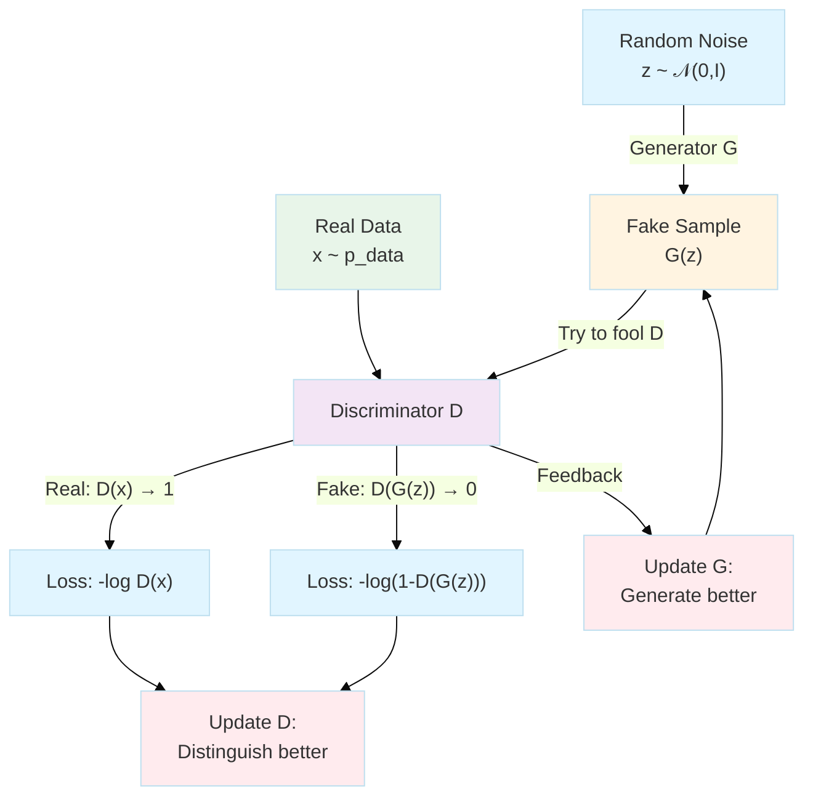
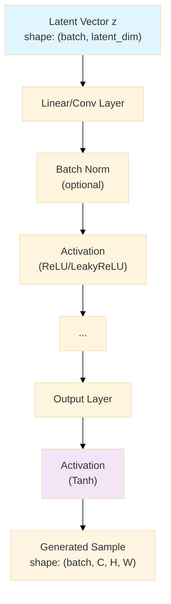
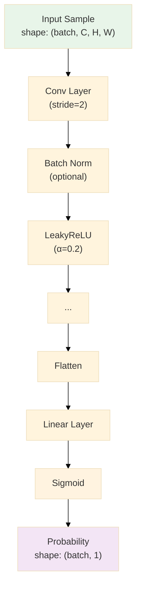
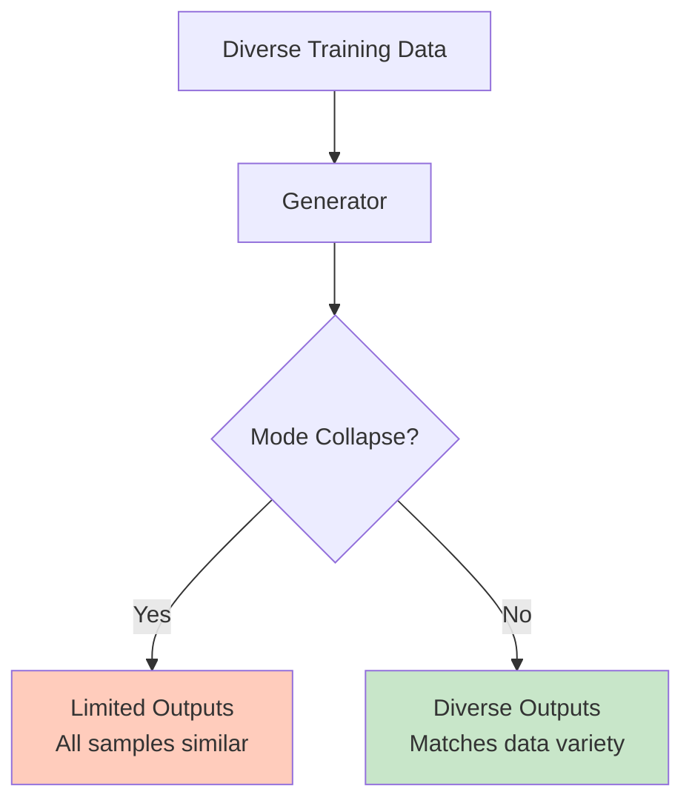
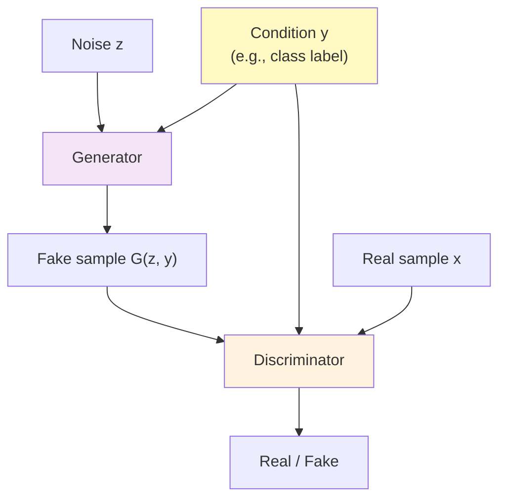
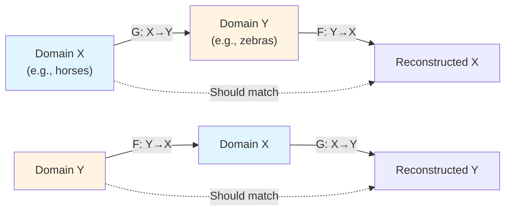
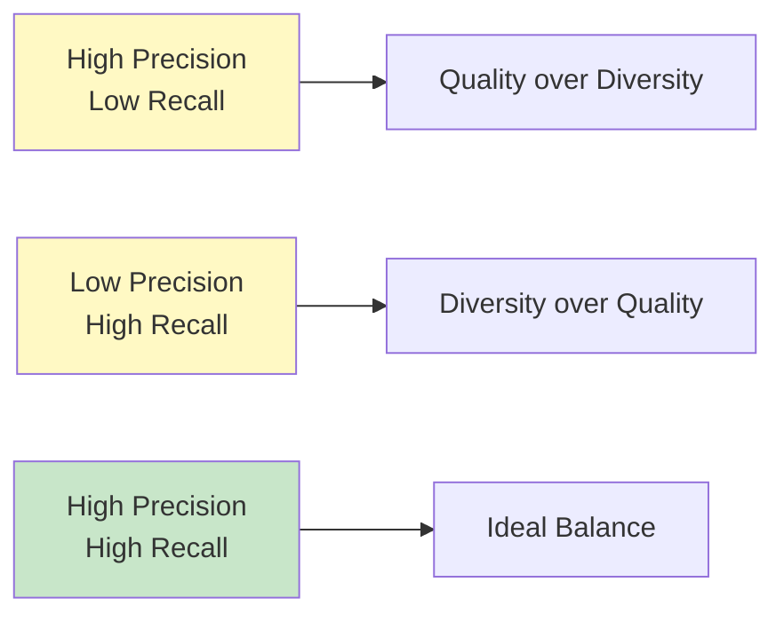
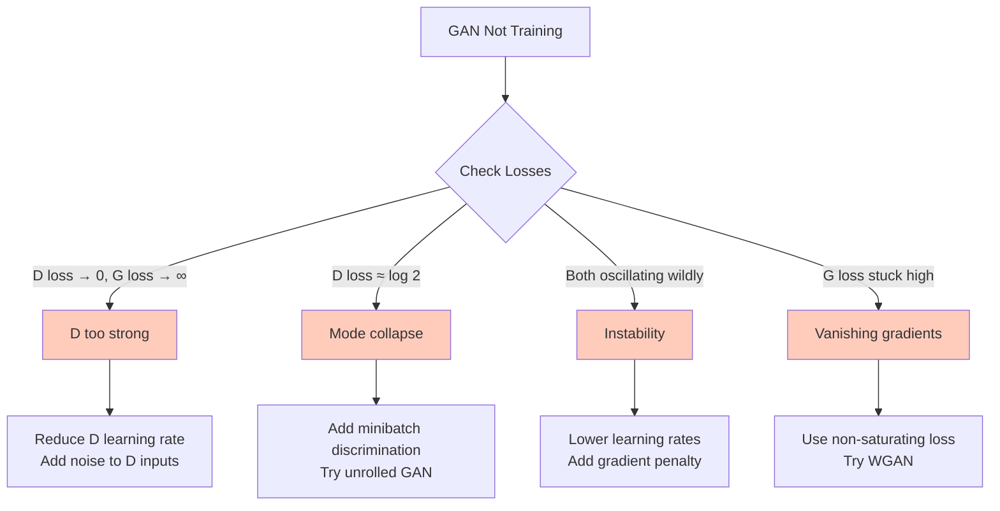
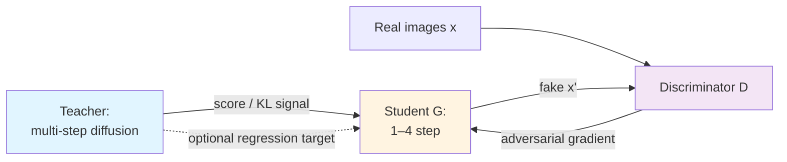

# Understanding Generative Adversarial Networks (GANs)

Generative Adversarial Networks (GANs), introduced by [Goodfellow et al. (2014)](https://arxiv.org/abs/1406.2661), are a class of generative models that learn to produce realistic samples through an adversarial training process. Two neural networks — a *generator* and a *discriminator* — compete in a game-theoretic framework where the generator learns to create increasingly realistic samples while the discriminator learns to distinguish real from fake data.

GANs reshaped machine learning by achieving photorealistic image generation (StyleGAN2 FID 2.84 on 1024×1024 FFHQ faces, [Karras et al., 2020](https://arxiv.org/abs/1912.04958)) and unlocking interpretable, editable latent spaces. Diffusion models now dominate offline image and video generation, but the GAN *objective* has had a striking second life: starting in late 2023, **adversarial losses became one of the major tools for distilling multi-step diffusion models down to 1–4-step samplers** ([Sauer et al., 2023 — ADD/SDXL Turbo](https://arxiv.org/abs/2311.17042); [Yin et al., 2024 — DMD2](https://arxiv.org/abs/2405.14867)). Pure GANs retain a real wall-clock advantage (1 forward pass vs. ≥20 for a competitive distilled diffusion model) and still own the latent-editing and real-time-control niche. The modern picture is *adversarial training as a tool that lives inside both pure GANs and the post-training stage of diffusion models*, rather than two opposing camps.

---

!!! tip "New here?"
    For a one-page map of how GANs fit next to VAEs, Diffusion, Flows, EBMs, and Autoregressive models, start with [**Generative Models — A Unified View**](generative-models-unified.md). This page is the deep-dive on GANs specifically.

## Overview

<div class="grid cards" markdown>

- :material-sword-cross:{ .lg .middle } **Adversarial Training**

    ---

    Two networks compete: generator creates samples, discriminator evaluates them

- :material-brain:{ .lg .middle } **Implicit Density**

    ---

    No explicit density model required—learns through game dynamics

- :material-image-multiple:{ .lg .middle } **High-Quality Samples**

    ---

    Produces sharp, realistic images without blur common in other models

- :material-chart-line:{ .lg .middle } **Flexible Architecture**

    ---

    Works with various architectures (MLP, CNN, ResNet) and data types

</div>

---

## Mathematical Foundation

### The Adversarial Game

GANs operate through a minimax game between a generator $G$ that creates synthetic data and a discriminator $D$ that distinguishes real from fake samples. The generator learns to transform random noise $z$ into realistic outputs $G(z)$, while the discriminator estimates the probability that samples originated from real data.

The mathematical foundation rests on the minimax objective:

$$
\min_G \max_D V(D, G) = \mathbb{E}_{x \sim p_{data}}[\log D(x)] + \mathbb{E}_{z \sim p_z}[\log(1 - D(G(z)))]
$$

Where:

- $G$ is the **generator** that maps latent vectors $z$ to data space
- $D$ is the **discriminator** that outputs probability of input being real
- $p_{data}$ is the true data distribution
- $p_z$ is the prior distribution over latent variables (typically Gaussian)
- $V(D,G)$ measures how well the discriminator distinguishes real from fake

The discriminator maximizes this objective by correctly classifying samples, while the generator minimizes it by producing convincing fakes that fool the discriminator.


```mermaid
%%{init: {'theme':'base', 'themeVariables': { 'primaryColor':'#e1f5ff'}}}%%
graph TD
    A["Random Noise<br/>z ~ 𝒩(0,I)"] -->|Generator G| B["Fake Sample<br/>G(z)"]
    C["Real Data<br/>x ~ p_data"] --> D["Discriminator D"]
    B -->|Try to fool D| D
    D -->|"Real: D(x) → 1"| E["Loss: -log D(x)"]
    D -->|"Fake: D(G(z)) → 0"| F["Loss: -log(1-D(G(z)))"]
    E --> G["Update D:<br/>Distinguish better"]
    F --> G
    D -->|Feedback| H["Update G:<br/>Generate better"]
    H --> B

    style A fill:#e1f5ff
    style B fill:#fff4e1
    style C fill:#e8f5e9
    style D fill:#f3e5f5
    style G fill:#ffebee
    style H fill:#ffebee
```

### Theoretical Analysis

**Optimal Discriminator:**

For a fixed generator $G$, the optimal discriminator takes the form:

$$
D^*_G(x) = \frac{p_{data}(x)}{p_{data}(x) + p_g(x)}
$$

where $p_g$ represents the generator's distribution. This result emerges from maximizing $V(D,G)$ with respect to $D$: the function $y \rightarrow a \cdot \log(y) + b \cdot \log(1-y)$ achieves its maximum at $y = \frac{a}{a+b}$, yielding the optimal discriminator formula when $a = p_{data}(x)$ and $b = p_g(x)$.

!!! note "Interpretation"
    The optimal discriminator performs binary classification using maximum likelihood for the conditional probability that $x$ originated from real data.

**Global Optimum:**

The global minimum occurs uniquely when the generator perfectly matches the data distribution ($p_g = p_{data}$), where the objective reaches:

$$
C(G) = -\log(4)
$$

By substituting the optimal discriminator into the objective:

$$
C(G) = -\log(4) + 2 \cdot \text{JSD}(p_{data} \| p_g)
$$

where $\text{JSD}$ denotes Jensen-Shannon divergence. Since $\text{JSD} \geq 0$ with equality only when distributions match, minimizing the GAN objective equivalently minimizes the JS divergence between real and generated distributions.

### Training Dynamics

The training alternates between two steps:

**1. Discriminator Update (maximize $V$)**

Train $D$ to maximize the probability of correctly classifying real and fake samples:

$$
\max_D \mathbb{E}_{x \sim p_{data}}[\log D(x)] + \mathbb{E}_{z \sim p_z}[\log(1 - D(G(z)))]
$$

**2. Generator Update (minimize $V$)**

Train $G$ to maximize the probability of discriminator being wrong:

$$
\min_G \mathbb{E}_{z \sim p_z}[\log(1 - D(G(z)))]
$$

In practice, we often use the **non-saturating** generator loss for better gradients ([Goodfellow et al., 2014](https://arxiv.org/abs/1406.2661), §3):

$$
\max_G \mathbb{E}_{z \sim p_z}[\log D(G(z))]
$$

!!! tip "Why Non-Saturating Loss?"
    When the discriminator becomes too confident, the standard generator loss $\log(1 - D(G(z)))$ provides vanishing gradients. The non-saturating alternative $\log D(G(z))$ maintains strong gradients even when the discriminator is confident. Note that this changes the optimisation target — the non-saturating loss does **not** correspond to JS-divergence minimisation, and [Arjovsky & Bottou (2017)](https://arxiv.org/abs/1701.04862) argue that this asymmetry is a key driver of GAN instability.

### Nash Equilibrium

At convergence, GANs reach a **Nash equilibrium** where:

1. The generator produces samples indistinguishable from real data: $p_g = p_{data}$
2. The discriminator outputs $\frac{1}{2}$ everywhere (cannot tell real from fake)
3. Neither network can improve by changing its strategy alone

!!! warning "Equilibrium vs. Reality"
    While theoretically elegant, reaching true Nash equilibrium is rare in practice. Most GANs oscillate around an approximate equilibrium or get stuck in local equilibria.

---

## Architecture Design

### Generator Network

The generator transforms random noise into realistic samples:


```mermaid
%%{init: {'theme':'base'}}%%
graph TD
    A["Latent Vector z<br/>shape: (batch, latent_dim)"] --> B["Linear/Conv Layer"]
    B --> C["Batch Norm<br/>(optional)"]
    C --> D["Activation<br/>(ReLU/LeakyReLU)"]
    D --> E["..."]
    E --> F["Output Layer"]
    F --> G["Activation<br/>(Tanh)"]
    G --> H["Generated Sample<br/>shape: (batch, C, H, W)"]

    style A fill:#e1f5ff
    style H fill:#fff4e1
    style G fill:#f3e5f5
```

**Key Design Choices:**

- **Input**: Random latent vector $z \sim \mathcal{N}(0, I)$ with dimension 64-512
- **Architecture Options**:
  - MLP for simple data (MNIST, toy datasets)
  - Transposed convolutions (DCGAN) for images
  - ResNet blocks for complex images
- **Normalization**: Batch normalization helps stabilize training
- **Activation**: ReLU in hidden layers, **Tanh** at output (maps to $[-1, 1]$)
- **Output**: Same shape as target data

!!! tip "DCGAN Guidelines"
    - Replace pooling with strided convolutions
    - Use batch normalization in both networks (except output/input layers)
    - Remove fully connected hidden layers for deeper architectures
    - Use ReLU in generator (except output), LeakyReLU in discriminator
    - Use Tanh activation in generator output

### Discriminator Network

The discriminator classifies inputs as real or fake:


```mermaid
%%{init: {'theme':'base'}}%%
graph TD
    A["Input Sample<br/>shape: (batch, C, H, W)"] --> B["Conv Layer<br/>(stride=2)"]
    B --> C["Batch Norm<br/>(optional)"]
    C --> D["LeakyReLU<br/>(α=0.2)"]
    D --> E["..."]
    E --> F["Flatten"]
    F --> G["Linear Layer"]
    G --> H["Sigmoid"]
    H --> I["Probability<br/>shape: (batch, 1)"]

    style A fill:#e8f5e9
    style I fill:#f3e5f5
    style H fill:#fff3e0
```

**Key Design Choices:**

- **Input**: Real or generated samples
- **Architecture**: Convolutional layers with stride 2 (instead of pooling)
- **Normalization**: Batch normalization (except first layer)
- **Activation**: LeakyReLU ($\alpha = 0.2$) throughout
- **Output**: Single probability via sigmoid activation

!!! warning "Common Pitfalls"
    - **Don't** use pooling layers—use strided convolutions instead
    - **Don't** place batch norm in discriminator's first layer or generator's last layer
    - **Don't** use sigmoid in generator output when data is in $[-1, 1]$
    - **Don't** make discriminator too powerful—it will provide poor gradients

---

## Building Intuition

### The Counterfeiter Analogy

Think of GANs as a counterfeiter (generator) learning to produce fake currency by competing against a detective (discriminator) trying to identify fakes. Initially, the counterfeiter produces obvious forgeries that the detective easily catches. As the detective explains what gives away the fakes, the counterfeiter improves. Eventually, the counterfeiter becomes so skilled that the detective can only guess randomly—they've reached an equilibrium where fake currency is indistinguishable from real currency.

This adversarial dynamic, formalized through game theory and implemented with neural networks, drives the remarkable quality of modern GANs.

### Key Insights

**The generator never sees real data directly**—it only receives gradient signals from the discriminator indicating how to improve. This indirect learning through an adversarial critic differs fundamentally from other generative models:

- **VAEs**: Directly minimize reconstruction loss comparing generated to real samples
- **Autoregressive models**: Directly maximize likelihood of training data
- **GANs**: Implicitly minimize distribution divergence through adversarial dynamics

This enables sharp, realistic outputs without the blurring common in explicit reconstruction-based approaches.

### Common Misconceptions

!!! warning "Training Myths"
    - **Myth**: Losses should decrease monotonically
        - **Reality**: Losses oscillate during healthy training
    - **Myth**: Generator "wins" when discriminator accuracy approaches 50%
        - **Reality**: This indicates equilibrium, not generator victory
    - **Myth**: Lower loss always means better samples
        - **Reality**: Losses are often non-indicative of sample quality
    - **Myth**: Training should be stable like supervised learning
        - **Reality**: GANs are inherently unstable, requiring careful balancing
    - **Myth**: Mode collapse indicates insufficient training
        - **Reality**: It often occurs despite long training without proper techniques

### The Discriminator's Role

The discriminator's role extends beyond simply classifying real versus fake:

- **Provides training signal** to the generator
- **Implicitly defines the loss function** through its architecture and training
- **Learns useful feature representations** exploitable for downstream tasks
- **Acts as a learned perceptual metric** assessing sample quality

In WGAN ([Arjovsky et al., 2017](https://arxiv.org/abs/1701.07875)), the critic estimates Wasserstein distance rather than performing classification, fundamentally changing the training dynamics.

---

## Training Challenges

### Mode Collapse

**Mode collapse** occurs when the generator produces limited variety despite a large, diverse data distribution.


```mermaid
graph TD
    A[Diverse Training Data] --> B[Generator]
    B --> C{Mode Collapse?}
    C -->|Yes| D[Limited Outputs<br/>All samples similar]
    C -->|No| E[Diverse Outputs<br/>Matches data variety]

    style D fill:#ffccbc
    style E fill:#c8e6c9
```

**Symptoms:**

- All outputs look nearly identical
- Generator only produces a few distinct samples
- Missing modes in the data distribution

**Solutions:**

- **Minibatch discrimination** ([Salimans et al., 2016](https://arxiv.org/abs/1606.03498)): let the discriminator see *batch-wise* feature similarities, so it can directly punish "everything looks the same".
- **Unrolled GANs** ([Metz et al., 2017](https://arxiv.org/abs/1611.02163)): unroll $k$ discriminator update steps when computing the generator gradient, so $G$ optimises against a "forward-looking" $D$ rather than the current step.
- **Experience replay** / past-sample buffers ([Shrivastava et al., 2017](https://arxiv.org/abs/1612.07828)): mix in older fakes so $D$ doesn't forget previously-defeated modes.
- **PacGAN** ([Lin et al., 2018](https://arxiv.org/abs/1712.04086)): give $D$ packed batches of $m$ samples instead of singletons; provably reduces mode collapse.
- **Top-k generator updates** ([Sinha et al., 2020](https://arxiv.org/abs/2002.06224)): in each generator step, only back-propagate through the top-k most-realistic generated samples in the batch.
- **Multiple GANs** / ensembles: train an ensemble and pick the best-coverage member.

### Vanishing Gradients

When the discriminator becomes too confident, it provides vanishing gradients to the generator.

**Problem**: If $D(G(z)) \approx 0$, then $\nabla_G \log(1 - D(G(z))) \approx 0$

**Solutions:**

1. **Non-saturating loss** ([Goodfellow et al., 2014](https://arxiv.org/abs/1406.2661)): use $\max_G \mathbb{E}[\log D(G(z))]$ instead.
2. **Wasserstein GAN** ([Arjovsky et al., 2017](https://arxiv.org/abs/1701.07875)): use Wasserstein distance with a Lipschitz constraint, so the critic's gradients stay bounded even when it's "winning".
3. **Least Squares GAN** ([Mao et al., 2017](https://arxiv.org/abs/1611.04076)): replace the cross-entropy classifier with the squared-error objective $\mathbb{E}[(D(G(z)) - 1)^2]$.
4. **Relativistic GAN** ([Jolicoeur-Martineau, 2018](https://arxiv.org/abs/1807.00734)): make the discriminator estimate the *relative* realism of real-vs-fake pairs, $D(x) - D(G(z))$, which provably gives non-vanishing gradients near the optimum and underlies the modern R3GAN baseline.

### Training Instability

Training GANs differs fundamentally from standard supervised learning:

- **No ground truth** for generator's output—quality is implicitly defined by discriminator
- **Loss landscape continuously shifts** as both networks update
- **Local equilibria** are common; global equilibrium may not exist
- **Small hyperparameter changes** can cause dramatic differences in convergence
- **Two competing objectives** must be balanced rather than minimizing a single loss

!!! tip "Stability Techniques"
    **Architectural:**

    - Batch normalization ([Ioffe & Szegedy, 2015](https://arxiv.org/abs/1502.03167)) — except discriminator input / generator output, per the DCGAN guidelines.
    - **Spectral normalization** ([Miyato et al., 2018](https://arxiv.org/abs/1802.05957)) — divide every weight matrix by its largest singular value, enforcing a 1-Lipschitz $D$ without a gradient penalty.
    - **Self-attention** for long-range dependencies (SAGAN, [Zhang et al., 2019](https://arxiv.org/abs/1805.08318)).

    **Algorithmic:**

    - **Two-Time-scale Update Rule (TTUR)** ([Heusel et al., 2017](https://arxiv.org/abs/1706.08500)): use a higher LR for $D$ than $G$; provably converges to a local Nash equilibrium.
    - Gradient penalties — WGAN-GP ([Gulrajani et al., 2017](https://arxiv.org/abs/1704.00028)), R1/R2 zero-centred GP ([Mescheder et al., 2018](https://arxiv.org/abs/1801.04406)). Note that 1-centered GPs (WGAN-GP) do **not** generally guarantee local convergence — only zero-centred R1/R2 do.
    - Label smoothing ([Salimans et al., 2016](https://arxiv.org/abs/1606.03498)) — one-sided on real labels only.

    **Hyperparameter:**

    - Lower learning rates (1e-4 to 1e-5).
    - Adam ([Kingma & Ba, 2015](https://arxiv.org/abs/1412.6980)) with $\beta_1 = 0.5, \beta_2 = 0.999$ (the DCGAN setting).
    - Multiple $D$ updates per $G$ update (typically 5:1 for WGAN-GP, 1:1 for spectral-norm GANs).

---

## GAN Variants

### DCGAN: Deep Convolutional GAN

**DCGAN** ([Radford, Metz & Chintala, 2016](https://arxiv.org/abs/1511.06434)) established the foundation for stable GAN training using convolutional architectures.

**Architecture Guidelines:**

1. Replace pooling layers with strided convolutions
2. Use batch normalization in both G and D
3. Remove fully connected hidden layers
4. Use ReLU in G (except output), LeakyReLU in D
5. Use Tanh in G output

**Impact**: Made GAN training significantly more stable and enabled high-quality image generation.

### WGAN: Wasserstein GAN

**WGAN** ([Arjovsky, Chintala & Bottou, 2017](https://arxiv.org/abs/1701.07875)) replaces JS divergence with Wasserstein-1 distance for improved training stability.

**Wasserstein Distance:**

$$
W(p_r, p_g) = \inf_{\gamma \in \Pi(p_r, p_g)} \mathbb{E}_{(x,y) \sim \gamma}[\|x - y\|]
$$

**Practical Objective (with weight clipping):**

$$
\min_G \max_{D \in \mathcal{D}} \mathbb{E}_{x \sim p_r}[D(x)] - \mathbb{E}_{z \sim p_z}[D(G(z))]
$$

where $\mathcal{D}$ is the set of 1-Lipschitz functions (enforced via weight clipping).

**Advantages:**

- More meaningful loss metric correlating with sample quality
- Improved training stability
- No mode collapse
- Works with diverse architectures

!!! note "WGAN Terminology"
    The discriminator in WGAN is called a **critic** since it doesn't output probabilities—it estimates the Wasserstein distance.

### WGAN-GP: Gradient Penalty

**WGAN-GP** ([Gulrajani et al., 2017](https://arxiv.org/abs/1704.00028)) improves upon WGAN by replacing weight clipping with a gradient-norm penalty.

**Key Insight**: The optimal 1-Lipschitz function maximizing the WGAN objective has gradient norm equal to 1 almost everywhere under $p_r$ and $p_g$.

**Gradient Penalty:**

$$
\lambda \cdot \mathbb{E}_{\hat{x} \sim p_{\hat{x}}}[(\|\nabla_{\hat{x}} D(\hat{x})\|_2 - 1)^2]
$$

where $\hat{x} = \epsilon x + (1-\epsilon)\tilde{x}$ with $\epsilon \sim \text{Uniform}[0,1]$, sampling along straight lines between real and generated data.

**Implementation Details:**

- Set $\lambda = 10$ as standard (may require tuning)
- Remove batch normalization from critic (interferes with gradient penalty)
- Train critic for 5 iterations per generator update

**Results**: On CIFAR-10, Inception Score improved from WGAN's ~3.8 to WGAN-GP's ~7.86. Works across diverse architectures including 101-layer ResNets.

### Conditional GAN (cGAN)

**Conditional GANs** ([Mirza & Osindero, 2014](https://arxiv.org/abs/1411.1784)) extend the adversarial framework to enable controlled generation by conditioning both networks on additional information $y$ (class labels, text, or images).

**Objective:**

$$
\mathcal{L}_{cGAN}(G, D) = \mathbb{E}_{x,y \sim p_{\text{data}}}[\log D(x, y)] + \mathbb{E}_{z \sim p_z, y}[\log(1 - D(G(z, y), y))]
$$


```mermaid
graph TD
    Z["Noise z"] --> G["Generator"]
    Y["Condition y<br/>(e.g., class label)"] --> G
    G --> F["Fake sample G(z, y)"]
    F --> D["Discriminator"]
    Y --> D
    R["Real sample x"] --> D
    D --> P["Real / Fake"]

    style Y fill:#fff9c4
    style G fill:#f3e5f5
    style D fill:#fff3e0
```

**Applications:**

- **Class-conditional generation**: Generate specific digit classes in MNIST
- **Attribute manipulation**: Change hair color, age, expression in face images
- **Text-to-image**: Generate images matching text descriptions

### Pix2Pix: Image-to-Image Translation

**Pix2Pix** ([Isola, Zhu, Zhou & Efros, 2017](https://arxiv.org/abs/1611.07004)) learns paired image translation with both adversarial and reconstruction losses.

**Complete Objective:**

$$
G^* = \arg\min_G \max_D \mathcal{L}_{cGAN}(G, D) + \lambda \mathcal{L}_{L1}(G)
$$

where:

$$
\mathcal{L}_{L1}(G) = \mathbb{E}_{x,y,z}[\|y - G(x, z)\|_1]
$$

and $\lambda = 100$ balances the terms.

**Architecture:**

- **Generator**: U-Net with skip connections (prevents information loss)
- **Discriminator**: PatchGAN (classifies $N \times N$ patches as real/fake)

**Applications**: Edges→photos, labels→scenes, day→night, black-and-white→color

### CycleGAN: Unpaired Translation

**CycleGAN** ([Zhu, Park, Isola & Efros, 2017](https://arxiv.org/abs/1703.10593)) enables translation between unpaired image domains using cycle consistency.

**Cycle Consistency Loss:**

$$
\mathcal{L}_{cyc}(G, F) = \mathbb{E}_{x \sim p_X}[\|F(G(x)) - x\|_1] + \mathbb{E}_{y \sim p_Y}[\|G(F(y)) - y\|_1]
$$

**Total Objective:**

$$
\mathcal{L}(G, F, D_X, D_Y) = \mathcal{L}_{GAN}(G, D_Y, X, Y) + \mathcal{L}_{GAN}(F, D_X, Y, X) + \lambda \mathcal{L}_{cyc}(G, F)
$$


```mermaid
graph LR
    A["Domain X<br/>(e.g., horses)"] -->|G: X→Y| B["Domain Y<br/>(e.g., zebras)"]
    B -->|F: Y→X| C["Reconstructed X"]
    A -.->|"Should match"| C

    D["Domain Y"] -->|F: Y→X| E["Domain X"]
    E -->|G: X→Y| F["Reconstructed Y"]
    D -.->|"Should match"| F

    style A fill:#e1f5ff
    style B fill:#fff4e1
    style D fill:#fff4e1
    style E fill:#e1f5ff
```

**Applications**: Horse↔zebra, photo↔painting, summer↔winter, without paired training data

### StyleGAN: Style-Based Generator

**StyleGAN** ([Karras, Laine & Aila, 2019](https://arxiv.org/abs/1812.04948)) introduces style-based architecture with unprecedented control over generated images.

**Key Innovations:**

1. **Mapping Network**: Maps $z \in \mathcal{Z}$ to an intermediate latent space $w \in \mathcal{W}$.
2. **Adaptive Instance Normalization (AdaIN)** ([Huang & Belongie, 2017](https://arxiv.org/abs/1703.06868)): injects style at each resolution.
3. **Stochastic Variation**: per-pixel noise injection for fine-grained details.
4. **Progressive Growing** ([Karras et al., 2018 — PGGAN](https://arxiv.org/abs/1710.10196)): starts with low resolution, gradually increases.

**W-Space Benefits:**

StyleGAN's $\mathcal{W}$ space demonstrates superior disentanglement to the input $\mathcal{Z}$ space:

- **Perceptual Path Length (PPL)** is meaningfully lower in $\mathcal{W}$ than in $\mathcal{Z}$ (Karras et al. 2019, Table 4) — i.e., walks in $\mathcal{W}$ traverse the manifold more smoothly.
- Better linear separability of attributes.
- More reliable manipulation transfer across samples.

The mapping network deliberately "unwarps" $\mathcal{Z}$ — which is forced to be Gaussian — to produce a $\mathcal{W}$ that follows the data's own (non-Gaussian) factor density.

**The StyleGAN family:**

- **StyleGAN2** ([Karras et al., 2020](https://arxiv.org/abs/1912.04958)) — fixes characteristic blob artefacts and the AdaIN-induced "droplet" pathology by replacing AdaIN with weight demodulation; introduces path-length regularisation. **FID 2.84 on FFHQ 1024² faces** — still a competitive number five years later.
- **StyleGAN3** ([Karras et al., 2021](https://arxiv.org/abs/2106.12423)) — *alias-free* generator that eliminates "texture sticking" by treating intermediate signals as continuous bandlimited functions; the resulting network is fully equivariant to translation and rotation, producing far smoother animations.
- **StyleGAN-XL** ([Sauer, Schwarz & Geiger, 2022](https://arxiv.org/abs/2202.00273)) — scales StyleGAN3 to ImageNet 1024² with projected discriminators, classifier guidance, and class-conditioning; the first GAN to match diffusion-class quality on ImageNet.

---

## Latent Space Properties

### Interpolation and Continuity

In well-trained GANs, the latent space exhibits desirable properties:

- **Nearby points** decode to similar outputs
- **Linear interpolation** produces smooth semantic transitions
- **Sampling** generates coherent new samples

```python
# Interpolation between two points
z1 = sample_latent()
z2 = sample_latent()
alphas = np.linspace(0, 1, 10)
z_interp = [(1-α)*z1 + α*z2 for α in alphas]
images = [generator(z) for z in z_interp]
```

### Semantic Vector Arithmetic

Well-structured latent spaces support semantic manipulation through vector arithmetic:

$$
z_{smiling\_woman} \approx z_{woman} + (z_{smiling\_man} - z_{man})
$$

**Examples:**

- Face with glasses = face + glasses vector
- Older face = face + aging vector
- Different expression = face + expression vector

### Latent Space Structure

The latent space structure determines controllability:

- **Specific directions** correspond to interpretable attributes (age, gender, lighting)
- **Smooth manifolds** enable continuous attribute manipulation
- **Disentangled dimensions** allow independent control of features

!!! tip "Discovering Interpretable Directions"
    Methods for finding semantic directions:

    - **Linear probes** ([Shen et al., 2020 — InterFaceGAN](https://arxiv.org/abs/2005.09635)): train binary classifiers on $w$ for each attribute; the classifier normal is the attribute direction.
    - **GANSpace** ([Härkönen et al., 2020](https://arxiv.org/abs/2004.02546)): unsupervised PCA of intermediate feature activations; the top components recover interpretable axes.
    - **SeFa** ([Shen & Zhou, 2021](https://arxiv.org/abs/2007.06600)): closed-form factorisation of the generator's first weight matrix recovers semantic directions without training.
    - **Supervised methods**: Use attribute labels to find control vectors via paired-sample regression (StyleGAN-NADA, StyleCLIP).

---

## Evaluation Metrics

### Inception Score (IS)

**Inception Score** ([Salimans et al., 2016](https://arxiv.org/abs/1606.03498)) measures quality and diversity using a pre-trained classifier.

$$
\text{IS} = \exp\left(\mathbb{E}_{x \sim p_g}[D_{KL}(p(y|x) \| p(y))]\right)
$$

- **High IS**: Generated images are clear (low entropy $p(y|x)$) and diverse (high entropy $p(y)$)
- **Limitations**: Doesn't compare to real data; can be gamed

### Fréchet Inception Distance (FID)

**FID** ([Heusel et al., 2017](https://arxiv.org/abs/1706.08500)) measures similarity between real and generated distributions in InceptionV3 feature space.

$$
\text{FID} = \|m_r - m_g\|^2 + \text{Tr}(C_r + C_g - 2\sqrt{C_r C_g})
$$

where $m_r, m_g$ are feature means and $C_r, C_g$ are covariance matrices.

- **Lower is better**: FID of 0 indicates identical distributions
- **More reliable than IS**: Compares against real data distribution
- **Industry standard**: Most widely used metric for GAN evaluation

### Precision and Recall

[Sajjadi et al. (2018)](https://arxiv.org/abs/1806.00035) and [Kynkäänniemi et al. (2019)](https://arxiv.org/abs/1904.06991) extend FID into separate quality vs. coverage metrics:

**Precision**: Fraction of generated samples that fall in the support of the real distribution (looks realistic).

**Recall**: Fraction of real data modes that lie in the support of the generated distribution (covered by the generator).


```mermaid
graph LR
    A[High Precision<br/>Low Recall] --> B[Quality over Diversity]
    C[Low Precision<br/>High Recall] --> D[Diversity over Quality]
    E[High Precision<br/>High Recall] --> F[Ideal Balance]

    style A fill:#fff9c4
    style C fill:#fff9c4
    style E fill:#c8e6c9
```

**Trade-off**: GANs often optimize precision at the expense of recall (mode collapse).

### Human Evaluation

Despite quantitative metrics, **human evaluation** remains the gold standard:

- **Perceptual quality**: Do samples look realistic?
- **Diversity**: Is there sufficient variety?
- **Artifacts**: Are there visible distortions or patterns?

!!! warning "Metric Limitations"
    - **FID**: Measures overall distribution quality but doesn't separate precision from recall.
    - **IS**: Assesses the generated distribution *without* comparing to real data.
    - **PR curves**: Separate quality from diversity but require more computation.
    - **KID** ([Bińkowski et al., 2018](https://arxiv.org/abs/1801.01401)): unbiased kernel-based alternative to FID, more reliable on small sample sets.
    - **CMMD** ([Jayasumana et al., 2024](https://arxiv.org/abs/2401.09603)): replaces InceptionV3 features with CLIP features and the Fréchet distance with MMD; better correlated with human perception of modern generators.

    Use multiple complementary measures plus visual inspection.

---

## Training Best Practices

### Development Workflow

Modern GAN development follows an established workflow:

1. **Start simple**: DCGAN on MNIST to verify implementation
2. **Scale up**: Move to CIFAR-10, CelebA for complexity
3. **Add stability**: Implement WGAN-GP, spectral normalization, R1 GP as needed
4. **Monitor carefully**: Track both metrics (FID, IS) and visual quality
5. **Save checkpoints**: Training is unstable—save frequently
6. **Iterate**: Experiment with architectural variations once baseline works
7. **Transfer learning**: Use pretrained models when possible

### Hyperparameter Guidelines

**Learning Rates:**

- Generator: $1 \times 10^{-4}$ to $5 \times 10^{-5}$
- Discriminator: $4 \times 10^{-4}$ to $1 \times 10^{-4}$ (often 4× generator)

**Optimizer:**

- Adam with $\beta_1 = 0.5$ (or 0.0), $\beta_2 = 0.999$
- RMSprop for WGAN

**Training Ratios:**

- 1 generator update : 5 discriminator updates (WGAN-GP)
- 1:1 for well-tuned standard GANs

**Batch Size:**

- Larger is better (32-128 typical, up to 256-512 if memory allows)
- Affects batch normalization statistics

### Debugging Strategies


```mermaid
graph TD
    A[GAN Not Training] --> B{Check Losses}
    B -->|D loss → 0, G loss → ∞| C[D too strong]
    B -->|D loss ≈ log 2| D[Mode collapse]
    B -->|Both oscillating wildly| E[Instability]
    B -->|G loss stuck high| F[Vanishing gradients]

    C --> C1[Reduce D learning rate<br/>Add noise to D inputs]
    D --> D1[Add minibatch discrimination<br/>Try unrolled GAN]
    E --> E1[Lower learning rates<br/>Add gradient penalty]
    F --> F1[Use non-saturating loss<br/>Try WGAN]

    style C fill:#ffccbc
    style D fill:#ffccbc
    style E fill:#ffccbc
    style F fill:#ffccbc
```

**Common Issues:**

| Symptom | Likely Cause | Solution |
|---------|-------------|----------|
| D loss → 0 | Discriminator too strong | Reduce D LR, add label noise |
| G loss stuck | Vanishing gradients | Non-saturating loss, WGAN |
| All same output | Mode collapse | Minibatch discrimination |
| NaN losses | Numerical instability | Lower LR, gradient clipping |
| Blurry samples | Architecture issues | Check activations, add capacity |

### Stability Techniques

**R1 Gradient Penalty** ([Mescheder, Geiger & Nowozin, 2018](https://arxiv.org/abs/1801.04406)):

$$
R_1 = \frac{\gamma}{2} \mathbb{E}_{x \sim p_r}[\|\nabla_x D(x)\|^2]
$$

- Applied only to *real* samples (R2 is the same penalty applied only to fakes; using either is sufficient for local convergence).
- $\gamma = 10$ is the typical baseline; for high-resolution StyleGAN runs the optimum is much smaller.
- **Lazy regularisation** ([Karras et al., 2020 — StyleGAN2](https://arxiv.org/abs/1912.04958)): apply R1 every 16 iterations to halve the cost.
- Crucially, R1/R2 are *zero-centred* gradient penalties — Mescheder et al. proved that the *one-centred* WGAN-GP penalty does **not** generally guarantee local convergence, while R1 / R2 do.

**Spectral Normalization** ([Miyato et al., 2018](https://arxiv.org/abs/1802.05957)):

Normalise weight matrices by their spectral norm (largest singular value):

$$
W_{SN} = \frac{W}{\sigma(W)}
$$

- Enforces a 1-Lipschitz constraint on $D$ without a gradient penalty.
- One power-iteration step per forward pass; cheaper than WGAN-GP.
- Works well with the standard non-saturating GAN loss; the basis of SAGAN and BigGAN.

**Label Smoothing** ([Salimans et al., 2016](https://arxiv.org/abs/1606.03498)):

Replace binary labels with smoothed versions:

- Real labels: $0.9$ instead of $1.0$.
- Fake labels: $0.0$ (no smoothing).

One-sided smoothing prevents discriminator overconfidence; smoothing fakes too has been shown to *encourage* the generator to produce blurrier outputs.

---

## Comparison with Other Generative Models

### GANs vs. VAEs

| Aspect | GANs | VAEs |
|--------|------|------|
| **Sample Quality** | Sharp, realistic | Blurry, smooth |
| **Training Stability** | Unstable, requires tuning | Stable, straightforward |
| **Likelihood** | Implicit (no direct likelihood) | Explicit lower bound (ELBO) |
| **Mode Coverage** | Often mode collapse | Better mode coverage |
| **Latent Space** | Less structured by default | Structured, continuous |
| **Speed** | Fast inference | Fast inference |

### GANs vs. Diffusion Models

| Aspect | GANs | Diffusion (un-distilled) | Diffusion (distilled / ADD-style) |
|--------|------|------|------|
| **Sample Quality** | High (FID ~2–5) | Highest (FID ~1–3) | Near-teacher (FID 1.3–8 across benchmarks) |
| **Inference Speed** | 1 NFE | 20–1000 NFEs | 1–4 NFEs |
| **Training Stability** | Unstable, needs care | Very stable | Stable (post-training only) |
| **Mode Coverage** | Prone to collapse | Excellent | Inherited from teacher |
| **Controllability** | Excellent (latent editing) | Strong (classifier/CFG guidance) | Strong, slightly degraded vs. teacher |
| **Text Conditioning** | Hard ([Kang et al., 2023](https://arxiv.org/abs/2303.05511) showed it can work at scale) | Excellent (CLIP/text encoder + cross-attention) | Excellent |

**2025–2026 Landscape:**

- **Diffusion models** with full 20–50-step samplers excel at high-quality offline generation, creative applications, and complex text-to-image.
- **Pure GANs** still dominate real-time applications, interactive systems, and latent-space editing.
- **Adversarially-distilled diffusion models** (SDXL Turbo / ADD, DMD2, APT) — single-step samplers trained with a GAN-style discriminator on top of a pretrained diffusion teacher — now occupy the middle ground: diffusion-class quality at near-GAN inference cost. The clean GAN-vs-diffusion dichotomy has effectively dissolved.

**Complementary Use Cases:**

- **Use GANs when**: speed matters, controllability is critical (latent editing, attribute arithmetic), resource constraints rule out diffusion-class compute, 3D-aware generation.
- **Use Diffusion when**: highest sample quality is required, complex text prompts, maximum mode coverage, stable-training is a priority.
- **Use adversarial *distillation*** when you have a pretrained diffusion model and need it to run in 1–4 steps for production.

!!! note "On the speed advantage"
    A pure-GAN forward pass remains 1 NFE (network function evaluation), versus 20–50 NFEs for a competitive distilled diffusion sampler — so single-image latency is still meaningfully shorter for GANs in practice (often 5–20×, not the folkloric 100× number repeated in older comparisons). The gap is widest at small batch sizes and on memory-constrained hardware.

---

## Advanced Topics

### Progressive Growing

[Karras et al. (2018) — PGGAN](https://arxiv.org/abs/1710.10196) train GANs by gradually increasing resolution:

1. Start at 4×4
2. Stabilize training
3. Add layers for 8×8
4. Fade in new layers smoothly
5. Repeat to target resolution

**Benefits**: more stable training at high resolutions, faster convergence, better quality. (Note: the alias-free StyleGAN3 line replaces progressive growing with end-to-end training.)

### Self-Attention

**SAGAN** ([Zhang et al., 2019](https://arxiv.org/abs/1805.08318)) adds self-attention to capture long-range dependencies:

$$
\text{Attention}(Q, K, V) = \text{softmax}\left(\frac{QK^T}{\sqrt{d_k}}\right)V
$$

It improves modelling of geometric patterns and multi-object scenes, and is the architectural ancestor of BigGAN.

### BigGAN

**BigGAN** ([Brock, Donahue & Simonyan, 2019](https://arxiv.org/abs/1809.11096)) scales GANs to ImageNet with:

- Larger batch sizes (2048)
- Larger architectures (more channels)
- Truncated-normal latent sampling at inference (the **truncation trick** — trade diversity for fidelity)
- Orthogonal regularisation on weights
- Class-conditional batch normalisation

**Results**: IS ≈ 166 on ImageNet 128×128 (and 233 on 256×256 in BigGAN-deep), unprecedented scale and quality at the time.

### 3D-Aware Generation

**EG3D** ([Chan et al., 2022](https://arxiv.org/abs/2112.07945)) generates 3D-consistent faces from 2D images:

- **Tri-plane** hybrid 3D representation for efficient volumetric rendering.
- Differentiable neural rendering from multi-view.
- Adversarial training on 2D image collections only.
- Learns 3D geometry without any 3D supervision.

Successors include **GET3D** ([Gao et al., 2022](https://arxiv.org/abs/2209.11163)) and **GeNVS** ([Chan et al., 2023](https://arxiv.org/abs/2304.02602)).

**Applications**: 3D face synthesis, novel-view synthesis, relighting.

---

## Adversarial Training in 2023–2026: Modern GANs and Diffusion Distillation

The two most active threads in adversarial generative modelling between 2023 and 2026 are (a) *modernising* the pure-GAN recipe with current architectures and convergence theory, and (b) using a discriminator on top of a pretrained diffusion model to **distill** it into a 1–4-step sampler.

### Modernised Pure GANs (2023–2024)

| Model | Year | Contribution |
| --- | --- | --- |
| **StyleGAN-XL** ([Sauer et al., 2022](https://arxiv.org/abs/2202.00273)) | 2022 | First GAN to match diffusion quality on ImageNet 1024² via projected discriminators and classifier guidance. |
| **GigaGAN** ([Kang et al., 2023](https://arxiv.org/abs/2303.05511)) | 2023 | Scales GANs to large-scale text-to-image synthesis: 1B-parameter generator, 0.13 s for a 512² image, 16-megapixel synthesis in ~3.7 s. |
| **StyleGAN-T** ([Sauer et al., 2023](https://arxiv.org/abs/2301.09515)) | 2023 | A StyleGAN3 backbone tuned for text-to-image; faster than distilled diffusion at the time and competitive in sample quality. |
| **R3GAN** ([Huang et al., 2024 — NeurIPS](https://arxiv.org/abs/2501.05441)) | 2024 | "The GAN is dead; long live the GAN!" — derives a *regularised relativistic* loss with provable local convergence, then strips StyleGAN2 of every ad-hoc trick (style code, path-length reg, equalised LR, etc.) and modernises the backbone (ResNet, bilinear resampling, Leaky ReLU, no BN). Surpasses StyleGAN2 on FFHQ / ImageNet / CIFAR / Stacked-MNIST with a far simpler recipe. The current "modern baseline" the field rallies around. |

### GAN-Style Distillation of Diffusion Models (2023–2026)

A major practical use of adversarial losses in 2026 is *not* end-to-end GAN training but **diffusion-distillation**: use a pretrained diffusion model as both a teacher and a real-data oracle, and train a fast student against a discriminator.


```mermaid
graph LR
    A[Teacher:<br/>multi-step diffusion] -->|score / KL signal| C[Student G:<br/>1–4 step]
    B[Real images x] --> D[Discriminator D]
    C -->|fake x'| D
    D -->|adversarial gradient| C
    A -.->|optional regression target| C

    style A fill:#e1f5ff
    style C fill:#fff4e1
    style D fill:#f3e5f5
```

| Method | Year | Core idea |
| --- | --- | --- |
| **Diffusion-GAN** ([Wang et al., 2022](https://arxiv.org/abs/2206.02262)) | 2022 | Inject the *forward diffusion chain* as instance noise; the discriminator is conditioned on the diffusion timestep, removing the discriminator-overfitting failure mode. |
| **DDGAN** ([Xiao, Kreis & Vahdat, 2022](https://arxiv.org/abs/2112.07804)) | 2022 | "Tackling the generative learning trilemma": parameterise each reverse-diffusion step with a multi-modal conditional GAN, achieving sharp samples in only a handful of steps. |
| **ADD / SDXL Turbo** ([Sauer et al., 2023](https://arxiv.org/abs/2311.17042)) | 2023 | Adversarial Diffusion Distillation: a frozen DINOv2 discriminator trains an SDXL student to produce 1-step images at SDXL-class quality. The recipe behind SDXL Turbo. |
| **Diffusion2GAN** ([Kang et al., 2024](https://arxiv.org/abs/2405.05967)) | 2024 | Distil a diffusion teacher into a *conditional GAN* (E-LatentLPIPS + GAN loss) that runs in 1 step at megapixel scale. |
| **DMD2** ([Yin et al., 2024 — NeurIPS Oral](https://arxiv.org/abs/2405.14867)) | 2024 | Distribution-Matching Distillation 2: drops the regression loss and adds a GAN loss against *real* images, sidestepping the imperfect-teacher-score problem. FID 1.28 on ImageNet 64² and 8.35 on zero-shot COCO 2014; SOTA for one-step image generation. |
| **APT — Adversarial Post-Training** ([Lin et al., 2025](https://arxiv.org/abs/2501.08316)) | 2025 | Extends adversarial distillation to **one-step video generation** with an approximated R1, enabling Sora-class video models to run interactively. |
| **APEX / SiDA / DMDX** ([2024–2026](https://arxiv.org/abs/2604.12322)) | 2025–26 | Newer-generation single-step distillers that combine adversarial gradients with score-identity / condition-shifting signals; FID ≈ 1.1 on ImageNet 64². |

### Diffusion–GAN Hybrids (Architecturally)

Beyond distillation, several architectures interleave diffusion and GANs:

- **DDGAN** ([Xiao et al., 2022](https://arxiv.org/abs/2112.07804)) parameterises each reverse step with a GAN.
- **Wavelet Diffusion-GAN** ([Phung et al., 2024](https://arxiv.org/abs/2402.19481)) operates in the wavelet domain for cheaper high-resolution training.
- **Flow2GAN** ([2025](https://arxiv.org/abs/2512.23278)) hybridises flow matching with adversarial training for few-step audio generation.

The throughline of this generation: *the GAN survived as an objective, not as an architecture.* Many modern fast image / video generators use a discriminator somewhere — either as the whole training signal (R3GAN, GigaGAN) or as a post-training step on top of a diffusion teacher — while consistency and latent-consistency families show that discriminators are not mandatory for few-step generation.

---

## Production Considerations

### Deployment Challenges

**Model Size:**

- StyleGAN2: ~200MB for 1024×1024 generator
- Optimization: Pruning, quantization, knowledge distillation

**Inference Speed:**

- Real-time requirements: <50ms per image
- Optimization: TensorRT, ONNX Runtime, model compression

**Hardware Requirements:**

- Training: Multi-GPU (4-8 GPUs for large-scale)
- Inference: Single GPU or CPU with optimization

### Monitoring and Maintenance

**Quality Drift:**

Monitor generated samples over time for:

- Artifacts or distortions
- Mode collapse
- Distribution shift

**A/B Testing:**

Compare model versions using:

- FID scores on held-out data
- Human evaluation studies
- Production metrics (click-through, engagement)

### Ethical Considerations

!!! warning "Responsible Use"
    **Deepfakes and Misinformation:**

    - GANs can generate realistic fake images/videos
    - Require watermarking and detection systems
    - Need clear disclosure when using synthetic media

    **Bias and Fairness:**

    - GANs inherit biases from training data
    - May amplify stereotypes or lack diversity
    - Require diverse, representative datasets

    **Privacy:**

    - Memorization of training data possible
    - Differential privacy techniques recommended
    - Careful handling of sensitive data

---

## Future Directions (2026 and Beyond)

### Open Research Problems

- **Scaling pure GANs**: GigaGAN and R3GAN have shown that *modernised* GANs can match diffusion at the 1B-parameter scale on standard benchmarks; the open question is whether the same recipes scale to the 10B-parameter, large-prompt-distribution regime where modern diffusion models live.
- **One-step video**: Adversarial post-training (APT, [Lin et al., 2025](https://arxiv.org/abs/2501.08316)) is starting to deliver one-step Sora-class video; temporal coherence at long durations remains the bottleneck.
- **Convergence theory beyond local**: R3GAN gives provable local convergence, but global convergence under realistic data + architectures is still open.
- **Foundation-model discriminators**: ADD, DMD2, and the SiDA family use *frozen* DINOv2 / VFM features as their discriminator backbone. Why this works so reliably is not yet well understood.
- **Automatic stability**: Replacing the bag-of-hyperparameters culture with adaptive schedules / learned regularisers.

### Emerging Trends

**Adversarial distillation as the default fast-sampler**:

- ADD / DMD2 / Diffusion2GAN have made the discriminator a standard ingredient of any production diffusion deployment.
- Expect this to extend to flow matching, rectified flow, and consistency models.

**Retrieval-Augmented and Multimodal GANs**:

- Combine generators with retrieval systems for few-shot adaptation.
- Cross-modal (text-image-audio-video) generation with shared latent spaces.

**Efficient Fine-Tuning**:

- LoRA and adapter methods on top of pretrained GANs ([StyleGAN-NADA](https://arxiv.org/abs/2108.00946) and successors).
- Few-shot domain adaptation from foundation models.

**Quality-Aware Training**:

- DINOv2 / SigLIP / CLIP features as discriminator backbones (ADD).
- Wavelet-driven discriminators (Wavelet Diffusion-GAN).
- Learned perceptual losses tuned to specific generators.

### Hybrid Approaches

The future is firmly **hybrid**:

- **GAN + Diffusion** — already the default for fast inference (ADD, DMD2, APT).
- **GAN + VAE** — VAE-GAN style perceptual codecs (the SD-VAE training recipe).
- **GAN + Transformers / DiTs** — adversarial post-training on top of diffusion-transformer backbones is the current frontier for production-grade real-time generation.

---

## Summary and Key Takeaways

GANs revolutionized generative modeling through adversarial training, achieving remarkable image quality and enabling unprecedented control. Despite challenges with training stability, they remain essential for real-time applications and latent space manipulation.

**Core Principles:**

- **Minimax game** between generator and discriminator drives learning
- **Nash equilibrium** reached when generator matches data distribution
- **Implicit density** modeling avoids explicit likelihood computation
- **Sharp samples** without reconstruction-based blurring

**Key Variants:**

- **DCGAN**: stable convolutional architecture (the foundational recipe).
- **WGAN / WGAN-GP**: Wasserstein distance for stability — superseded by spectral norm + R1 in modern usage.
- **Pix2Pix / CycleGAN**: image translation with / without paired data.
- **StyleGAN → StyleGAN2 → StyleGAN3 → StyleGAN-XL**: style-based architecture with unprecedented control, alias-free at modern resolutions, scaled to ImageNet.
- **R3GAN** (NeurIPS 2024): the current "modern baseline" — relativistic loss + zero-centred GP + ResNet backbone, no ad-hoc tricks.
- **GigaGAN, StyleGAN-T**: large-scale text-to-image GANs.
- **Diffusion-GAN, DDGAN, ADD, DMD2, APT**: the adversarial-distillation family — the dominant production use of GAN losses today.

**Training Challenges:**

- Mode collapse, vanishing gradients, training instability
- Require careful hyperparameter tuning and monitoring
- Multiple techniques needed for stable convergence

**Best Practices:**

- Start with DCGAN architecture on simple data
- Use WGAN-GP or spectral normalization for stability
- Monitor both quantitative metrics and visual quality
- Employ two-timescale updates (different learning rates)
- Save checkpoints frequently

**When to Use GANs:**

- Real-time generation requirements
- Controllable latent space editing
- Resource-constrained environments
- 3D-aware synthesis

**Current Landscape (2025–2026):**

- Diffusion models lead in raw quality and diversity for offline generation.
- Pure GANs (R3GAN, GigaGAN, StyleGAN-XL) match diffusion-class quality on standard benchmarks at much lower inference cost.
- **Adversarial distillation** (ADD, DMD2, APT) has erased the clean GAN-vs-diffusion divide — discriminators are a major component of several fast diffusion samplers, alongside non-adversarial distillation families.
- Many production systems are *hybrid* (codec + diffusion / flow prior + optional adversarial post-training).

---

## Next Steps

<div class="grid cards" markdown>

- :material-book-open-variant:{ .lg .middle } **[GAN User Guide](../models/gan-guide.md)**

    ---

    Practical usage guide with implementation examples and training workflows

- :material-code-braces:{ .lg .middle } **[GAN API Reference](../../api/models/gan.md)**

    ---

    Complete API documentation for DCGAN, WGAN, StyleGAN, and variants

- :material-school:{ .lg .middle } **[MNIST Tutorial](../../examples/basic/simple-gan.md)**

    ---

    Step-by-step hands-on tutorial: train a GAN on MNIST from scratch

- :material-flask:{ .lg .middle } **[Advanced Examples](../../examples/index.md)**

    ---

    Explore StyleGAN, CycleGAN, and state-of-the-art architectures

</div>

---

## Further Reading

### Seminal Papers (Must Read)

:material-file-document: **Goodfellow, I., et al. (2014).** "Generative Adversarial Networks"<br>
&nbsp;&nbsp;&nbsp;&nbsp;:material-link: [arXiv:1406.2661](https://arxiv.org/abs/1406.2661)<br>
&nbsp;&nbsp;&nbsp;&nbsp;:material-lightbulb-outline: The original GAN paper introducing the adversarial framework

:material-file-document: **Radford, A., et al. (2015).** "Unsupervised Representation Learning with Deep Convolutional Generative Adversarial Networks"<br>
&nbsp;&nbsp;&nbsp;&nbsp;:material-link: [arXiv:1511.06434](https://arxiv.org/abs/1511.06434)<br>
&nbsp;&nbsp;&nbsp;&nbsp;:material-lightbulb-outline: DCGAN: Established stable convolutional GAN training

:material-file-document: **Arjovsky, M., et al. (2017).** "Wasserstein GAN"<br>
&nbsp;&nbsp;&nbsp;&nbsp;:material-link: [arXiv:1701.07875](https://arxiv.org/abs/1701.07875)<br>
&nbsp;&nbsp;&nbsp;&nbsp;:material-lightbulb-outline: WGAN: Improved stability through Wasserstein distance

:material-file-document: **Gulrajani, I., et al. (2017).** "Improved Training of Wasserstein GANs"<br>
&nbsp;&nbsp;&nbsp;&nbsp;:material-link: [arXiv:1704.00028](https://arxiv.org/abs/1704.00028)<br>
&nbsp;&nbsp;&nbsp;&nbsp;:material-lightbulb-outline: WGAN-GP: Gradient penalty for better convergence

:material-file-document: **Karras, T., et al. (2019).** "A Style-Based Generator Architecture for Generative Adversarial Networks"<br>
&nbsp;&nbsp;&nbsp;&nbsp;:material-link: [arXiv:1812.04948](https://arxiv.org/abs/1812.04948)<br>
&nbsp;&nbsp;&nbsp;&nbsp;:material-lightbulb-outline: StyleGAN: State-of-the-art quality and control

### Application Papers

:material-file-document: **Isola, P., et al. (2017).** "Image-to-Image Translation with Conditional Adversarial Networks"<br>
&nbsp;&nbsp;&nbsp;&nbsp;:material-link: [arXiv:1611.07004](https://arxiv.org/abs/1611.07004)<br>
&nbsp;&nbsp;&nbsp;&nbsp;:material-lightbulb-outline: Pix2Pix: Paired image translation

:material-file-document: **Zhu, J.-Y., et al. (2017).** "Unpaired Image-to-Image Translation using Cycle-Consistent Adversarial Networks"<br>
&nbsp;&nbsp;&nbsp;&nbsp;:material-link: [arXiv:1703.10593](https://arxiv.org/abs/1703.10593)<br>
&nbsp;&nbsp;&nbsp;&nbsp;:material-lightbulb-outline: CycleGAN: Unpaired domain translation

:material-file-document: **Brock, A., et al. (2019).** "Large Scale GAN Training for High Fidelity Natural Image Synthesis"<br>
&nbsp;&nbsp;&nbsp;&nbsp;:material-link: [arXiv:1809.11096](https://arxiv.org/abs/1809.11096)<br>
&nbsp;&nbsp;&nbsp;&nbsp;:material-lightbulb-outline: BigGAN: Scaling to ImageNet

### Theoretical Analysis

:material-file-document: **Arora, S., et al. (2017).** "Generalization and Equilibrium in Generative Adversarial Nets"<br>
&nbsp;&nbsp;&nbsp;&nbsp;:material-link: [arXiv:1703.00573](https://arxiv.org/abs/1703.00573)<br>
&nbsp;&nbsp;&nbsp;&nbsp;:material-lightbulb-outline: Theoretical understanding of GAN training

:material-file-document: **Kodali, N., et al. (2017).** "On Convergence and Stability of GANs"<br>
&nbsp;&nbsp;&nbsp;&nbsp;:material-link: [arXiv:1705.07215](https://arxiv.org/abs/1705.07215)<br>
&nbsp;&nbsp;&nbsp;&nbsp;:material-lightbulb-outline: Analysis of convergence properties

:material-file-document: **Mescheder, L., Geiger, A., & Nowozin, S. (2018).** "Which Training Methods for GANs do actually Converge?" (ICML)<br>
&nbsp;&nbsp;&nbsp;&nbsp;:material-link: [arXiv:1801.04406](https://arxiv.org/abs/1801.04406)<br>
&nbsp;&nbsp;&nbsp;&nbsp;:material-lightbulb-outline: R1/R2 zero-centred gradient penalties — proves WGAN-GP's 1-centred penalty does **not** guarantee local convergence; R1/R2 do.

:material-file-document: **Arjovsky, M., & Bottou, L. (2017).** "Towards Principled Methods for Training Generative Adversarial Networks" (ICLR)<br>
&nbsp;&nbsp;&nbsp;&nbsp;:material-link: [arXiv:1701.04862](https://arxiv.org/abs/1701.04862)<br>
&nbsp;&nbsp;&nbsp;&nbsp;:material-lightbulb-outline: Identifies the JSD-divergence pathology that motivated WGAN.

:material-file-document: **Heusel, M., et al. (2017).** "GANs Trained by a Two Time-Scale Update Rule Converge to a Local Nash Equilibrium" (NeurIPS)<br>
&nbsp;&nbsp;&nbsp;&nbsp;:material-link: [arXiv:1706.08500](https://arxiv.org/abs/1706.08500)<br>
&nbsp;&nbsp;&nbsp;&nbsp;:material-lightbulb-outline: TTUR; the paper that also introduced the Fréchet Inception Distance.

### Stability and Architecture (the canon)

:material-file-document: **Salimans, T., et al. (2016).** "Improved Techniques for Training GANs"<br>
&nbsp;&nbsp;&nbsp;&nbsp;:material-link: [arXiv:1606.03498](https://arxiv.org/abs/1606.03498)<br>
&nbsp;&nbsp;&nbsp;&nbsp;:material-lightbulb-outline: Inception Score, minibatch discrimination, label smoothing, virtual batch normalisation — the toolbox most modern recipes still draw from.

:material-file-document: **Miyato, T., et al. (2018).** "Spectral Normalization for Generative Adversarial Networks" (ICLR)<br>
&nbsp;&nbsp;&nbsp;&nbsp;:material-link: [arXiv:1802.05957](https://arxiv.org/abs/1802.05957)<br>
&nbsp;&nbsp;&nbsp;&nbsp;:material-lightbulb-outline: Per-layer spectral-norm Lipschitz constraint; cheaper and more stable than WGAN-GP.

:material-file-document: **Zhang, H., et al. (2019).** "Self-Attention Generative Adversarial Networks" (SAGAN, ICML)<br>
&nbsp;&nbsp;&nbsp;&nbsp;:material-link: [arXiv:1805.08318](https://arxiv.org/abs/1805.08318)<br>
&nbsp;&nbsp;&nbsp;&nbsp;:material-lightbulb-outline: Self-attention layers in $G$ and $D$ for long-range structure.

:material-file-document: **Karras, T., et al. (2018).** "Progressive Growing of GANs for Improved Quality, Stability, and Variation" (PGGAN, ICLR)<br>
&nbsp;&nbsp;&nbsp;&nbsp;:material-link: [arXiv:1710.10196](https://arxiv.org/abs/1710.10196)<br>
&nbsp;&nbsp;&nbsp;&nbsp;:material-lightbulb-outline: Resolution-by-resolution training that scaled GANs to 1024².

:material-file-document: **Karras, T., et al. (2020).** "Analyzing and Improving the Image Quality of StyleGAN" (StyleGAN2, CVPR)<br>
&nbsp;&nbsp;&nbsp;&nbsp;:material-link: [arXiv:1912.04958](https://arxiv.org/abs/1912.04958)<br>
&nbsp;&nbsp;&nbsp;&nbsp;:material-lightbulb-outline: Weight demodulation, path-length regularisation, lazy R1, FID 2.84 on FFHQ.

:material-file-document: **Karras, T., et al. (2021).** "Alias-Free Generative Adversarial Networks" (StyleGAN3, NeurIPS)<br>
&nbsp;&nbsp;&nbsp;&nbsp;:material-link: [arXiv:2106.12423](https://arxiv.org/abs/2106.12423)<br>
&nbsp;&nbsp;&nbsp;&nbsp;:material-lightbulb-outline: Bandlimited continuous-signal generators — fully translation/rotation equivariant, fixes "texture sticking".

:material-file-document: **Sauer, A., Schwarz, K., & Geiger, A. (2022).** "StyleGAN-XL: Scaling StyleGAN to Large Diverse Datasets" (SIGGRAPH)<br>
&nbsp;&nbsp;&nbsp;&nbsp;:material-link: [arXiv:2202.00273](https://arxiv.org/abs/2202.00273)<br>
&nbsp;&nbsp;&nbsp;&nbsp;:material-lightbulb-outline: First GAN to match diffusion quality on ImageNet 1024².

:material-file-document: **Jolicoeur-Martineau, A. (2018).** "The Relativistic Discriminator: a Key Element Missing from Standard GAN" (ICLR)<br>
&nbsp;&nbsp;&nbsp;&nbsp;:material-link: [arXiv:1807.00734](https://arxiv.org/abs/1807.00734)<br>
&nbsp;&nbsp;&nbsp;&nbsp;:material-lightbulb-outline: Relativistic GAN losses; the conceptual ancestor of R3GAN.

:material-file-document: **Mao, X., et al. (2017).** "Least Squares Generative Adversarial Networks" (LSGAN, ICCV)<br>
&nbsp;&nbsp;&nbsp;&nbsp;:material-link: [arXiv:1611.04076](https://arxiv.org/abs/1611.04076)<br>
&nbsp;&nbsp;&nbsp;&nbsp;:material-lightbulb-outline: Squared-error discriminator objective.

### Recent Advances and Distillation (2022–2026)

:material-file-document: **Wang, Z., et al. (2022).** "Diffusion-GAN: Training GANs with Diffusion"<br>
&nbsp;&nbsp;&nbsp;&nbsp;:material-link: [arXiv:2206.02262](https://arxiv.org/abs/2206.02262)<br>
&nbsp;&nbsp;&nbsp;&nbsp;:material-lightbulb-outline: Forward-diffusion noise as instance noise; timestep-conditioned discriminator.

:material-file-document: **Xiao, Z., Kreis, K., & Vahdat, A. (2022).** "Tackling the Generative Learning Trilemma with Denoising Diffusion GANs" (DDGAN, ICLR)<br>
&nbsp;&nbsp;&nbsp;&nbsp;:material-link: [arXiv:2112.07804](https://arxiv.org/abs/2112.07804)<br>
&nbsp;&nbsp;&nbsp;&nbsp;:material-lightbulb-outline: Few-step diffusion via per-step conditional GANs.

:material-file-document: **Kang, M., et al. (2023).** "Scaling up GANs for Text-to-Image Synthesis" (GigaGAN, CVPR)<br>
&nbsp;&nbsp;&nbsp;&nbsp;:material-link: [arXiv:2303.05511](https://arxiv.org/abs/2303.05511)<br>
&nbsp;&nbsp;&nbsp;&nbsp;:material-lightbulb-outline: 1B-parameter T2I GAN; 0.13 s/512² and 16-megapixel synthesis in seconds.

:material-file-document: **Sauer, A., et al. (2023).** "StyleGAN-T: Unlocking the Power of GANs for Fast Large-Scale Text-to-Image Synthesis" (ICML)<br>
&nbsp;&nbsp;&nbsp;&nbsp;:material-link: [arXiv:2301.09515](https://arxiv.org/abs/2301.09515)<br>
&nbsp;&nbsp;&nbsp;&nbsp;:material-lightbulb-outline: StyleGAN3-based text-to-image with strong text alignment.

:material-file-document: **Sauer, A., et al. (2023).** "Adversarial Diffusion Distillation" (ADD / SDXL Turbo)<br>
&nbsp;&nbsp;&nbsp;&nbsp;:material-link: [arXiv:2311.17042](https://arxiv.org/abs/2311.17042)<br>
&nbsp;&nbsp;&nbsp;&nbsp;:material-lightbulb-outline: 1–4-step distillation of SDXL using a frozen DINOv2 discriminator; the recipe behind SDXL Turbo.

:material-file-document: **Yin, T., et al. (2024).** "Improved Distribution Matching Distillation for Fast Image Synthesis" (DMD2, NeurIPS Oral)<br>
&nbsp;&nbsp;&nbsp;&nbsp;:material-link: [arXiv:2405.14867](https://arxiv.org/abs/2405.14867)<br>
&nbsp;&nbsp;&nbsp;&nbsp;:material-lightbulb-outline: One-step image generation; FID 1.28 on ImageNet 64², 8.35 on COCO 2014.

:material-file-document: **Kang, M., et al. (2024).** "Distilling Diffusion Models into Conditional GANs" (Diffusion2GAN)<br>
&nbsp;&nbsp;&nbsp;&nbsp;:material-link: [arXiv:2405.05967](https://arxiv.org/abs/2405.05967)<br>
&nbsp;&nbsp;&nbsp;&nbsp;:material-lightbulb-outline: 1-step megapixel synthesis via E-LatentLPIPS + GAN distillation.

:material-file-document: **Huang, Y., et al. (2024).** "The GAN is dead; long live the GAN! A Modern Baseline GAN" (R3GAN, NeurIPS)<br>
&nbsp;&nbsp;&nbsp;&nbsp;:material-link: [arXiv:2501.05441](https://arxiv.org/abs/2501.05441)<br>
&nbsp;&nbsp;&nbsp;&nbsp;:material-lightbulb-outline: Provably-convergent regularised relativistic loss; strips StyleGAN2 of every ad-hoc trick and modernises the backbone.

:material-file-document: **Lin, S., et al. (2025).** "Diffusion Adversarial Post-Training for One-Step Video Generation" (APT)<br>
&nbsp;&nbsp;&nbsp;&nbsp;:material-link: [arXiv:2501.08316](https://arxiv.org/abs/2501.08316)<br>
&nbsp;&nbsp;&nbsp;&nbsp;:material-lightbulb-outline: One-step adversarial distillation for *video* diffusion; approximated R1 regularisation at scale.

:material-file-document: **Chan, E. R., et al. (2022).** "Efficient Geometry-aware 3D Generative Adversarial Networks" (EG3D, CVPR)<br>
&nbsp;&nbsp;&nbsp;&nbsp;:material-link: [arXiv:2112.07945](https://arxiv.org/abs/2112.07945)<br>
&nbsp;&nbsp;&nbsp;&nbsp;:material-lightbulb-outline: Tri-plane 3D-aware GAN trained from 2D images only.

:material-file-document: **Brock, A., Donahue, J., & Simonyan, K. (2019).** "Large Scale GAN Training for High Fidelity Natural Image Synthesis" (BigGAN, ICLR)<br>
&nbsp;&nbsp;&nbsp;&nbsp;:material-link: [arXiv:1809.11096](https://arxiv.org/abs/1809.11096)<br>
&nbsp;&nbsp;&nbsp;&nbsp;:material-lightbulb-outline: Class-conditional ImageNet generation; the truncation trick.

### Surveys

:material-file-document: **Gui, J., et al. (2021).** "A Review on Generative Adversarial Networks: Algorithms, Theory, and Applications" (TKDE)<br>
&nbsp;&nbsp;&nbsp;&nbsp;:material-link: [arXiv:2001.06937](https://arxiv.org/abs/2001.06937)<br>
&nbsp;&nbsp;&nbsp;&nbsp;:material-lightbulb-outline: Comprehensive earlier survey covering algorithms and theory.

:material-file-document: **Saxena, D., & Cao, J. (2021).** "Generative Adversarial Networks (GANs): Challenges, Solutions, and Future Directions" (ACM CSUR)<br>
&nbsp;&nbsp;&nbsp;&nbsp;:material-link: [doi:10.1145/3463475](https://dl.acm.org/doi/10.1145/3463475)<br>
&nbsp;&nbsp;&nbsp;&nbsp;:material-lightbulb-outline: ACM Computing Surveys: variants, applications, and training challenges.

:material-file-document: **(2024).** "Ten Years of Generative Adversarial Nets (GANs): A Survey of the State-of-the-Art"<br>
&nbsp;&nbsp;&nbsp;&nbsp;:material-link: [doi:10.1088/2632-2153/ad1f77](https://iopscience.iop.org/article/10.1088/2632-2153/ad1f77)<br>
&nbsp;&nbsp;&nbsp;&nbsp;:material-lightbulb-outline: Decade-retrospective covering algorithms, evaluation, and applications.

:material-file-document: **(2025).** "Advancements and Challenges in the Development of GANs for Deep Learning"<br>
&nbsp;&nbsp;&nbsp;&nbsp;:material-link: [doi:10.1007/s44354-025-00007-w](https://link.springer.com/article/10.1007/s44354-025-00007-w)<br>
&nbsp;&nbsp;&nbsp;&nbsp;:material-lightbulb-outline: 2025 survey unifying loss / divergence / architecture into a three-layer taxonomy and benchmarking NAS-GANs.
