# Understanding Generative Adversarial Networks (GANs)

Generative Adversarial Networks (GANs) are a class of generative models that learn to produce realistic samples through an adversarial training process. Two neural networks—a generator and a discriminator—compete in a game-theoretic framework where the generator learns to create increasingly realistic samples while the discriminator learns to distinguish real from fake data.

GANs revolutionized machine learning by achieving photorealistic image generation (StyleGAN2 FID: 2.84 on 1024×1024 faces) and enabling unprecedented control through disentangled latent spaces. Despite diffusion models dominating recent headlines, GANs maintain critical advantages in inference speed (100× faster) and controllability.

---

## Overview

<div class="grid cards" markdown>

- :material-sword-cross:{ .lg .middle } **Adversarial Training**

    ---

    Two networks compete: generator creates samples, discriminator evaluates them

- :material-brain:{ .lg .middle } **Implicit Density**

    ---

    No explicit density model required—learns through game dynamics

- :material-image-multiple:{ .lg .middle } **High-Quality Samples**

    ---

    Produces sharp, realistic images without blur common in other models

- :material-chart-line:{ .lg .middle } **Flexible Architecture**

    ---

    Works with various architectures (MLP, CNN, ResNet) and data types

</div>

---

## Mathematical Foundation

### The Adversarial Game

GANs operate through a minimax game between a generator $G$ that creates synthetic data and a discriminator $D$ that distinguishes real from fake samples. The generator learns to transform random noise $z$ into realistic outputs $G(z)$, while the discriminator estimates the probability that samples originated from real data.

The mathematical foundation rests on the minimax objective:

$$
\min_G \max_D V(D, G) = \mathbb{E}_{x \sim p_{data}}[\log D(x)] + \mathbb{E}_{z \sim p_z}[\log(1 - D(G(z)))]
$$

Where:

- $G$ is the **generator** that maps latent vectors $z$ to data space
- $D$ is the **discriminator** that outputs probability of input being real
- $p_{data}$ is the true data distribution
- $p_z$ is the prior distribution over latent variables (typically Gaussian)
- $V(D,G)$ measures how well the discriminator distinguishes real from fake

The discriminator maximizes this objective by correctly classifying samples, while the generator minimizes it by producing convincing fakes that fool the discriminator.


### Theoretical Analysis

**Optimal Discriminator:**

For a fixed generator $G$, the optimal discriminator takes the form:

$$
D^*_G(x) = \frac{p_{data}(x)}{p_{data}(x) + p_g(x)}
$$

where $p_g$ represents the generator's distribution. This result emerges from maximizing $V(D,G)$ with respect to $D$: the function $y \rightarrow a \cdot \log(y) + b \cdot \log(1-y)$ achieves its maximum at $y = \frac{a}{a+b}$, yielding the optimal discriminator formula when $a = p_{data}(x)$ and $b = p_g(x)$.

!!! note "Interpretation"
    The optimal discriminator performs binary classification using maximum likelihood for the conditional probability that $x$ originated from real data.

**Global Optimum:**

The global minimum occurs uniquely when the generator perfectly matches the data distribution ($p_g = p_{data}$), where the objective reaches:

$$
C(G) = -\log(4)
$$

By substituting the optimal discriminator into the objective:

$$
C(G) = -\log(4) + 2 \cdot \text{JSD}(p_{data} \| p_g)
$$

where $\text{JSD}$ denotes Jensen-Shannon divergence. Since $\text{JSD} \geq 0$ with equality only when distributions match, minimizing the GAN objective equivalently minimizes the JS divergence between real and generated distributions.

### Training Dynamics

The training alternates between two steps:

**1. Discriminator Update (maximize $V$)**

Train $D$ to maximize the probability of correctly classifying real and fake samples:

$$
\max_D \mathbb{E}_{x \sim p_{data}}[\log D(x)] + \mathbb{E}_{z \sim p_z}[\log(1 - D(G(z)))]
$$

**2. Generator Update (minimize $V$)**

Train $G$ to maximize the probability of discriminator being wrong:

$$
\min_G \mathbb{E}_{z \sim p_z}[\log(1 - D(G(z)))]
$$

In practice, we often use the **non-saturating** generator loss for better gradients:

$$
\max_G \mathbb{E}_{z \sim p_z}[\log D(G(z))]
$$

!!! tip "Why Non-Saturating Loss?"
    When the discriminator becomes too confident, the standard generator loss $\log(1 - D(G(z)))$ provides vanishing gradients. The non-saturating alternative $\log D(G(z))$ maintains strong gradients even when the discriminator is confident.

### Nash Equilibrium

At convergence, GANs reach a **Nash equilibrium** where:

1. The generator produces samples indistinguishable from real data: $p_g = p_{data}$
2. The discriminator outputs $\frac{1}{2}$ everywhere (cannot tell real from fake)
3. Neither network can improve by changing its strategy alone

!!! warning "Equilibrium vs. Reality"
    While theoretically elegant, reaching true Nash equilibrium is rare in practice. Most GANs oscillate around an approximate equilibrium or get stuck in local equilibria.

---

## Architecture Design

### Generator Network

The generator transforms random noise into realistic samples:


**Key Design Choices:**

- **Input**: Random latent vector $z \sim \mathcal{N}(0, I)$ with dimension 64-512
- **Architecture Options**:
  - MLP for simple data (MNIST, toy datasets)
  - Transposed convolutions (DCGAN) for images
  - ResNet blocks for complex images
- **Normalization**: Batch normalization helps stabilize training
- **Activation**: ReLU in hidden layers, **Tanh** at output (maps to $[-1, 1]$)
- **Output**: Same shape as target data

!!! tip "DCGAN Guidelines"
    - Replace pooling with strided convolutions
    - Use batch normalization in both networks (except output/input layers)
    - Remove fully connected hidden layers for deeper architectures
    - Use ReLU in generator (except output), LeakyReLU in discriminator
    - Use Tanh activation in generator output

### Discriminator Network

The discriminator classifies inputs as real or fake:


**Key Design Choices:**

- **Input**: Real or generated samples
- **Architecture**: Convolutional layers with stride 2 (instead of pooling)
- **Normalization**: Batch normalization (except first layer)
- **Activation**: LeakyReLU ($\alpha = 0.2$) throughout
- **Output**: Single probability via sigmoid activation

!!! warning "Common Pitfalls"
    - **Don't** use pooling layers—use strided convolutions instead
    - **Don't** place batch norm in discriminator's first layer or generator's last layer
    - **Don't** use sigmoid in generator output when data is in $[-1, 1]$
    - **Don't** make discriminator too powerful—it will provide poor gradients

---

## Building Intuition

### The Counterfeiter Analogy

Think of GANs as a counterfeiter (generator) learning to produce fake currency by competing against a detective (discriminator) trying to identify fakes. Initially, the counterfeiter produces obvious forgeries that the detective easily catches. As the detective explains what gives away the fakes, the counterfeiter improves. Eventually, the counterfeiter becomes so skilled that the detective can only guess randomly—they've reached an equilibrium where fake currency is indistinguishable from real currency.

This adversarial dynamic, formalized through game theory and implemented with neural networks, drives the remarkable quality of modern GANs.

### Key Insights

**The generator never sees real data directly**—it only receives gradient signals from the discriminator indicating how to improve. This indirect learning through an adversarial critic differs fundamentally from other generative models:

- **VAEs**: Directly minimize reconstruction loss comparing generated to real samples
- **Autoregressive models**: Directly maximize likelihood of training data
- **GANs**: Implicitly minimize distribution divergence through adversarial dynamics

This enables sharp, realistic outputs without the blurring common in explicit reconstruction-based approaches.

### Common Misconceptions

!!! warning "Training Myths"
    - **Myth**: Losses should decrease monotonically
        - **Reality**: Losses oscillate during healthy training
    - **Myth**: Generator "wins" when discriminator accuracy approaches 50%
        - **Reality**: This indicates equilibrium, not generator victory
    - **Myth**: Lower loss always means better samples
        - **Reality**: Losses are often non-indicative of sample quality
    - **Myth**: Training should be stable like supervised learning
        - **Reality**: GANs are inherently unstable, requiring careful balancing
    - **Myth**: Mode collapse indicates insufficient training
        - **Reality**: It often occurs despite long training without proper techniques

### The Discriminator's Role

The discriminator's role extends beyond simply classifying real versus fake:

- **Provides training signal** to the generator
- **Implicitly defines the loss function** through its architecture and training
- **Learns useful feature representations** exploitable for downstream tasks
- **Acts as a learned perceptual metric** assessing sample quality

In WGAN, the critic estimates Wasserstein distance rather than performing classification, fundamentally changing the training dynamics.

---

## Training Challenges

### Mode Collapse

**Mode collapse** occurs when the generator produces limited variety despite a large, diverse data distribution.


**Symptoms:**

- All outputs look nearly identical
- Generator only produces a few distinct samples
- Missing modes in the data distribution

**Solutions:**

- **Minibatch discrimination**: Let discriminator see multiple samples at once
- **Unrolled GANs**: Look ahead several discriminator steps during generator updates
- **Experience replay**: Keep buffer of past generated samples
- **Multiple GANs**: Train ensemble and select best mode coverage

### Vanishing Gradients

When the discriminator becomes too confident, it provides vanishing gradients to the generator.

**Problem**: If $D(G(z)) \approx 0$, then $\nabla_G \log(1 - D(G(z))) \approx 0$

**Solutions:**

1. **Non-saturating loss**: Use $\max_G \mathbb{E}[\log D(G(z))]$ instead
2. **Wasserstein GAN**: Use Wasserstein distance with Lipschitz constraint
3. **Least squares GAN**: Use $\mathbb{E}[(D(G(z)) - 1)^2]$ objective
4. **Relativistic GAN**: Make discriminator estimate relative realism

### Training Instability

Training GANs differs fundamentally from standard supervised learning:

- **No ground truth** for generator's output—quality is implicitly defined by discriminator
- **Loss landscape continuously shifts** as both networks update
- **Local equilibria** are common; global equilibrium may not exist
- **Small hyperparameter changes** can cause dramatic differences in convergence
- **Two competing objectives** must be balanced rather than minimizing a single loss

!!! tip "Stability Techniques"
    **Architectural:**

    - Batch normalization (except discriminator input/generator output)
    - Spectral normalization for Lipschitz constraint
    - Self-attention for capturing long-range dependencies

    **Algorithmic:**

    - Two-timescale update rule (TTUR): different learning rates for G and D
    - Gradient penalty (WGAN-GP, R1/R2 regularization)
    - Label smoothing (one-sided for real labels)

    **Hyperparameter:**

    - Lower learning rates (1e-4 to 1e-5)
    - Adam optimizer with $\beta_1 = 0.5, \beta_2 = 0.999$
    - Multiple discriminator updates per generator update (typically 5:1)

---

## GAN Variants

### DCGAN: Deep Convolutional GAN

**DCGAN** established the foundation for stable GAN training using convolutional architectures.

**Architecture Guidelines:**

1. Replace pooling layers with strided convolutions
2. Use batch normalization in both G and D
3. Remove fully connected hidden layers
4. Use ReLU in G (except output), LeakyReLU in D
5. Use Tanh in G output

**Impact**: Made GAN training significantly more stable and enabled high-quality image generation.

### WGAN: Wasserstein GAN

**WGAN** replaces JS divergence with Wasserstein distance for improved training stability.

**Wasserstein Distance:**

$$
W(p_r, p_g) = \inf_{\gamma \in \Pi(p_r, p_g)} \mathbb{E}_{(x,y) \sim \gamma}[\|x - y\|]
$$

**Practical Objective (with weight clipping):**

$$
\min_G \max_{D \in \mathcal{D}} \mathbb{E}_{x \sim p_r}[D(x)] - \mathbb{E}_{z \sim p_z}[D(G(z))]
$$

where $\mathcal{D}$ is the set of 1-Lipschitz functions (enforced via weight clipping).

**Advantages:**

- More meaningful loss metric correlating with sample quality
- Improved training stability
- No mode collapse
- Works with diverse architectures

!!! note "WGAN Terminology"
    The discriminator in WGAN is called a **critic** since it doesn't output probabilities—it estimates the Wasserstein distance.

### WGAN-GP: Gradient Penalty

**WGAN-GP** improves upon WGAN by replacing weight clipping with gradient penalty.

**Key Insight**: The optimal 1-Lipschitz function maximizing the WGAN objective has gradient norm equal to 1 almost everywhere under $p_r$ and $p_g$.

**Gradient Penalty:**

$$
\lambda \cdot \mathbb{E}_{\hat{x} \sim p_{\hat{x}}}[(\|\nabla_{\hat{x}} D(\hat{x})\|_2 - 1)^2]
$$

where $\hat{x} = \epsilon x + (1-\epsilon)\tilde{x}$ with $\epsilon \sim \text{Uniform}[0,1]$, sampling along straight lines between real and generated data.

**Implementation Details:**

- Set $\lambda = 10$ as standard (may require tuning)
- Remove batch normalization from critic (interferes with gradient penalty)
- Train critic for 5 iterations per generator update

**Results**: On CIFAR-10, Inception Score improved from WGAN's ~3.8 to WGAN-GP's ~7.86. Works across diverse architectures including 101-layer ResNets.

### Conditional GAN (cGAN)

**Conditional GANs** extend the adversarial framework to enable controlled generation by conditioning both networks on additional information $y$ (class labels, text, or images).

**Objective:**

$$
\mathcal{L}_{cGAN}(G, D) = \mathbb{E}_{x,y \sim p_{\text{data}}}[\log D(x, y)] + \mathbb{E}_{z \sim p_z, y}[\log(1 - D(G(z, y), y))]
$$


**Applications:**

- **Class-conditional generation**: Generate specific digit classes in MNIST
- **Attribute manipulation**: Change hair color, age, expression in face images
- **Text-to-image**: Generate images matching text descriptions

### Pix2Pix: Image-to-Image Translation

**Pix2Pix** learns paired image translation with both adversarial and reconstruction losses.

**Complete Objective:**

$$
G^* = \arg\min_G \max_D \mathcal{L}_{cGAN}(G, D) + \lambda \mathcal{L}_{L1}(G)
$$

where:

$$
\mathcal{L}_{L1}(G) = \mathbb{E}_{x,y,z}[\|y - G(x, z)\|_1]
$$

and $\lambda = 100$ balances the terms.

**Architecture:**

- **Generator**: U-Net with skip connections (prevents information loss)
- **Discriminator**: PatchGAN (classifies $N \times N$ patches as real/fake)

**Applications**: Edges→photos, labels→scenes, day→night, black-and-white→color

### CycleGAN: Unpaired Translation

**CycleGAN** enables translation between unpaired image domains using cycle consistency.

**Cycle Consistency Loss:**

$$
\mathcal{L}_{cyc}(G, F) = \mathbb{E}_{x \sim p_X}[\|F(G(x)) - x\|_1] + \mathbb{E}_{y \sim p_Y}[\|G(F(y)) - y\|_1]
$$

**Total Objective:**

$$
\mathcal{L}(G, F, D_X, D_Y) = \mathcal{L}_{GAN}(G, D_Y, X, Y) + \mathcal{L}_{GAN}(F, D_X, Y, X) + \lambda \mathcal{L}_{cyc}(G, F)
$$



```mermaid
graph LR
    A["Domain X<br/>(e.g., horses)"] -->|G: X→Y| B["Domain Y<br/>(e.g., zebras)"]
    B -->|F: Y→X| C["Reconstructed X"]
    A -.->|"Should match"| C

    D["Domain Y"] -->|F: Y→X| E["Domain X"]
    E -->|G: X→Y| F["Reconstructed Y"]
    D -.->|"Should match"| F

    style A fill:#e1f5ff
    style B fill:#fff4e1
    style D fill:#fff4e1
    style E fill:#e1f5ff
```

**Applications**: Horse↔zebra, photo↔painting, summer↔winter, without paired training data

### StyleGAN: Style-Based Generator

**StyleGAN** introduces style-based architecture with unprecedented control over generated images.

**Key Innovations:**

1. **Mapping Network**: Maps $z \in \mathcal{Z}$ to intermediate latent space $w \in \mathcal{W}$
2. **Adaptive Instance Normalization (AdaIN)**: Injects style at each resolution
3. **Stochastic Variation**: Adds per-pixel noise for fine-grained details
4. **Progressive Growing**: Starts with low resolution, gradually increases

**W-Space Benefits:**

StyleGAN's $\mathcal{W}$ space demonstrates superior disentanglement to the input $\mathcal{Z}$ space:

- **Perceptual Path Length (PPL)**: 145 in $\mathcal{W}$ vs. 415 in $\mathcal{Z}$
- Better linear separability of attributes
- More reliable manipulation transfer across samples

The mapping network purposefully "unwarps" $\mathcal{Z}$ to create this better space.

**Results**: StyleGAN2 achieves FID of 2.84 on FFHQ (1024×1024 faces), setting new standards for image quality.

---

## Latent Space Properties

### Interpolation and Continuity

In well-trained GANs, the latent space exhibits desirable properties:

- **Nearby points** decode to similar outputs
- **Linear interpolation** produces smooth semantic transitions
- **Sampling** generates coherent new samples

```python
# Interpolation between two points
z1 = sample_latent()
z2 = sample_latent()
alphas = np.linspace(0, 1, 10)
z_interp = [(1-α)*z1 + α*z2 for α in alphas]
images = [generator(z) for z in z_interp]
```

### Semantic Vector Arithmetic

Well-structured latent spaces support semantic manipulation through vector arithmetic:

$$
z_{smiling\_woman} \approx z_{woman} + (z_{smiling\_man} - z_{man})
$$

**Examples:**

- Face with glasses = face + glasses vector
- Older face = face + aging vector
- Different expression = face + expression vector

### Latent Space Structure

The latent space structure determines controllability:

- **Specific directions** correspond to interpretable attributes (age, gender, lighting)
- **Smooth manifolds** enable continuous attribute manipulation
- **Disentangled dimensions** allow independent control of features

!!! tip "Discovering Interpretable Directions"
    Methods for finding semantic directions:

    - **Linear probes**: Train classifiers on latent codes
    - **PCA**: Find principal components of latent representations
    - **GANSpace**: Identify directions in intermediate feature spaces
    - **Supervised methods**: Use attribute labels to find control vectors

---

## Evaluation Metrics

### Inception Score (IS)

**Inception Score** measures quality and diversity using a pre-trained classifier.

$$
\text{IS} = \exp\left(\mathbb{E}_{x \sim p_g}[D_{KL}(p(y|x) \| p(y))]\right)
$$

- **High IS**: Generated images are clear (low entropy $p(y|x)$) and diverse (high entropy $p(y)$)
- **Limitations**: Doesn't compare to real data; can be gamed

### Fréchet Inception Distance (FID)

**FID** measures similarity between real and generated distributions in feature space.

$$
\text{FID} = \|m_r - m_g\|^2 + \text{Tr}(C_r + C_g - 2\sqrt{C_r C_g})
$$

where $m_r, m_g$ are feature means and $C_r, C_g$ are covariance matrices.

- **Lower is better**: FID of 0 indicates identical distributions
- **More reliable than IS**: Compares against real data distribution
- **Industry standard**: Most widely used metric for GAN evaluation

### Precision and Recall

**Precision**: Fraction of generated samples that look realistic

**Recall**: Fraction of real data modes covered by generator


**Trade-off**: GANs often optimize precision at the expense of recall (mode collapse).

### Human Evaluation

Despite quantitative metrics, **human evaluation** remains the gold standard:

- **Perceptual quality**: Do samples look realistic?
- **Diversity**: Is there sufficient variety?
- **Artifacts**: Are there visible distortions or patterns?

!!! warning "Metric Limitations"
    - **FID**: Measures overall distribution quality but doesn't separate precision from recall
    - **IS**: Assesses generated distribution without comparing to real data
    - **PR curves**: Separate quality from diversity but require more computation

    Use multiple complementary measures plus visual inspection.

---

## Training Best Practices

### Development Workflow

Modern GAN development follows an established workflow:

1. **Start simple**: DCGAN on MNIST to verify implementation
2. **Scale up**: Move to CIFAR-10, CelebA for complexity
3. **Add stability**: Implement WGAN-GP, spectral normalization, R1 GP as needed
4. **Monitor carefully**: Track both metrics (FID, IS) and visual quality
5. **Save checkpoints**: Training is unstable—save frequently
6. **Iterate**: Experiment with architectural variations once baseline works
7. **Transfer learning**: Use pretrained models when possible

### Hyperparameter Guidelines

**Learning Rates:**

- Generator: $1 \times 10^{-4}$ to $5 \times 10^{-5}$
- Discriminator: $4 \times 10^{-4}$ to $1 \times 10^{-4}$ (often 4× generator)

**Optimizer:**

- Adam with $\beta_1 = 0.5$ (or 0.0), $\beta_2 = 0.999$
- RMSprop for WGAN

**Training Ratios:**

- 1 generator update : 5 discriminator updates (WGAN-GP)
- 1:1 for well-tuned standard GANs

**Batch Size:**

- Larger is better (32-128 typical, up to 256-512 if memory allows)
- Affects batch normalization statistics

### Debugging Strategies

```mermaid
graph TD
    A[GAN Not Training] --> B{Check Losses}
    B -->|D loss → 0, G loss → ∞| C[D too strong]
    B -->|D loss ≈ log 2| D[Mode collapse]
    B -->|Both oscillating wildly| E[Instability]
    B -->|G loss stuck high| F[Vanishing gradients]

    C --> C1[Reduce D learning rate<br/>Add noise to D inputs]
    D --> D1[Add minibatch discrimination<br/>Try unrolled GAN]
    E --> E1[Lower learning rates<br/>Add gradient penalty]
    F --> F1[Use non-saturating loss<br/>Try WGAN]

    style C fill:#ffccbc
    style D fill:#ffccbc
    style E fill:#ffccbc
    style F fill:#ffccbc
```



**Common Issues:**

| Symptom | Likely Cause | Solution |
|---------|-------------|----------|
| D loss → 0 | Discriminator too strong | Reduce D LR, add label noise |
| G loss stuck | Vanishing gradients | Non-saturating loss, WGAN |
| All same output | Mode collapse | Minibatch discrimination |
| NaN losses | Numerical instability | Lower LR, gradient clipping |
| Blurry samples | Architecture issues | Check activations, add capacity |

### Stability Techniques

**R1 Gradient Penalty:**

$$
R1 = \frac{\gamma}{2} \mathbb{E}_{x \sim p_r}[\|\nabla D(x)\|^2]
$$

- Apply only to real samples
- $\gamma = 10$ typical
- Lazy regularization: apply every 16 iterations

**Spectral Normalization:**

Normalize weight matrices by their spectral norm (largest singular value):

$$
W_{SN} = \frac{W}{\sigma(W)}
$$

- Enforces Lipschitz constraint without gradient penalty
- More computationally efficient than WGAN-GP
- Works well with standard GAN loss

**Label Smoothing:**

Replace binary labels with smoothed versions:

- Real labels: $0.9$ instead of $1.0$
- Fake labels: $0.0$ (no smoothing)

One-sided smoothing prevents discriminator overconfidence.

---

## Comparison with Other Generative Models

### GANs vs. VAEs

| Aspect | GANs | VAEs |
|--------|------|------|
| **Sample Quality** | Sharp, realistic | Blurry, smooth |
| **Training Stability** | Unstable, requires tuning | Stable, straightforward |
| **Likelihood** | Implicit (no direct likelihood) | Explicit lower bound (ELBO) |
| **Mode Coverage** | Often mode collapse | Better mode coverage |
| **Latent Space** | Less structured by default | Structured, continuous |
| **Speed** | Fast inference | Fast inference |

### GANs vs. Diffusion Models

| Aspect | GANs | Diffusion Models |
|--------|------|------------------|
| **Sample Quality** | High quality (FID ~2-5) | Highest quality (FID ~1-3) |
| **Inference Speed** | Fast (1 forward pass) | Slow (100-1000 steps) |
| **Training Stability** | Unstable | Very stable |
| **Mode Coverage** | Prone to collapse | Excellent coverage |
| **Controllability** | Excellent (latent editing) | Improving (guidance) |
| **Text Conditioning** | Challenging | Excellent (CLIP guidance) |

**2025 Landscape:**

- **Diffusion models**: Excel at high-quality offline generation, creative applications, text-to-image
- **GANs**: Dominate real-time applications, interactive systems, latent space editing

**Complementary Use Cases:**

- **Use GANs when**: Speed matters, controllability critical, resource constraints, 3D-aware generation
- **Use Diffusion when**: Highest quality required, complex text prompts, maximum diversity, stable training priority

!!! note "Speed Advantage"
    GANs maintain a 100× speed advantage over diffusion models, ensuring continued relevance for real-time applications despite diffusion quality leadership.

---

## Advanced Topics

### Progressive Growing

Train GANs by gradually increasing resolution:

1. Start at 4×4
2. Stabilize training
3. Add layers for 8×8
4. Fade in new layers
5. Repeat to target resolution

**Benefits**: More stable training, faster convergence, better quality

### Self-Attention

Add self-attention layers to capture long-range dependencies:

$$
\text{Attention}(Q, K, V) = \text{softmax}\left(\frac{QK^T}{\sqrt{d_k}}\right)V
$$

**SAGAN** (Self-Attention GAN) improves modeling of geometric patterns and multi-object scenes.

### BigGAN

**BigGAN** scales GANs to ImageNet with:

- Larger batch sizes (2048)
- Larger architectures (more channels)
- Truncated normal sampling
- Orthogonal regularization
- Class-conditional batch normalization

**Results**: IS of 166.5 on ImageNet, unprecedented scale and quality

### 3D-Aware Generation

**EG3D** generates 3D-consistent faces from 2D images:

- Tri-plane representation for efficient 3D
- Neural rendering from multi-view
- Adversarial training on 2D images
- Learns 3D structure without 3D supervision

**Applications**: 3D face synthesis, novel view synthesis, relighting

---

## Production Considerations

### Deployment Challenges

**Model Size:**

- StyleGAN2: ~200MB for 1024×1024 generator
- Optimization: Pruning, quantization, knowledge distillation

**Inference Speed:**

- Real-time requirements: <50ms per image
- Optimization: TensorRT, ONNX Runtime, model compression

**Hardware Requirements:**

- Training: Multi-GPU (4-8 GPUs for large-scale)
- Inference: Single GPU or CPU with optimization

### Monitoring and Maintenance

**Quality Drift:**

Monitor generated samples over time for:

- Artifacts or distortions
- Mode collapse
- Distribution shift

**A/B Testing:**

Compare model versions using:

- FID scores on held-out data
- Human evaluation studies
- Production metrics (click-through, engagement)

### Ethical Considerations

!!! warning "Responsible Use"
    **Deepfakes and Misinformation:**

    - GANs can generate realistic fake images/videos
    - Require watermarking and detection systems
    - Need clear disclosure when using synthetic media

    **Bias and Fairness:**

    - GANs inherit biases from training data
    - May amplify stereotypes or lack diversity
    - Require diverse, representative datasets

    **Privacy:**

    - Memorization of training data possible
    - Differential privacy techniques recommended
    - Careful handling of sensitive data

---

## Future Directions (2025 and Beyond)

### Open Research Problems

- **Scaling**: Compete with large-scale diffusion models (challenges beyond 1B parameters)
- **3D Quality**: Higher quality geometries with fine details and animation
- **Video Generation**: Temporal coherence while competing with Sora and Movie Gen
- **Training Stability**: Automatic hyperparameter selection
- **Foundation Models**: Integration with CLIP, DINO, and other pretrained features

### Emerging Trends

**Retrieval-Augmented Generation:**

- Combine GANs with retrieval systems
- Improve quality through example retrieval
- Better few-shot adaptation

**Multimodal GANs:**

- Integrate text-image-audio-video
- Cross-modal generation and translation
- Unified latent spaces

**Efficient Fine-Tuning:**

- LoRA and adapter methods
- Few-shot adaptation with minimal data
- Transfer learning from foundation models

**Quality-Aware Training:**

- Discriminators assessing perceptual quality
- Wavelet-driven approaches
- Learned perceptual losses

### Hybrid Approaches

The future likely involves **hybrid systems** leveraging strengths of multiple paradigms:

- GAN + Diffusion: Fast inference with high quality
- GAN + VAE: Structured latent spaces with sharp samples
- GAN + Transformers: Scalability and flexibility

---

## Summary and Key Takeaways

GANs revolutionized generative modeling through adversarial training, achieving remarkable image quality and enabling unprecedented control. Despite challenges with training stability, they remain essential for real-time applications and latent space manipulation.

**Core Principles:**

- **Minimax game** between generator and discriminator drives learning
- **Nash equilibrium** reached when generator matches data distribution
- **Implicit density** modeling avoids explicit likelihood computation
- **Sharp samples** without reconstruction-based blurring

**Key Variants:**

- **DCGAN**: Stable convolutional architecture
- **WGAN/WGAN-GP**: Wasserstein distance for training stability
- **Pix2Pix/CycleGAN**: Image translation with/without paired data
- **StyleGAN**: Style-based architecture with unprecedented control

**Training Challenges:**

- Mode collapse, vanishing gradients, training instability
- Require careful hyperparameter tuning and monitoring
- Multiple techniques needed for stable convergence

**Best Practices:**

- Start with DCGAN architecture on simple data
- Use WGAN-GP or spectral normalization for stability
- Monitor both quantitative metrics and visual quality
- Employ two-timescale updates (different learning rates)
- Save checkpoints frequently

**When to Use GANs:**

- Real-time generation requirements
- Controllable latent space editing
- Resource-constrained environments
- 3D-aware synthesis

**Current Landscape (2025):**

- Diffusion models lead in quality and diversity
- GANs maintain 100× speed advantage
- Complementary rather than competitive use cases
- Future involves hybrid approaches

---

## Next Steps

<div class="grid cards" markdown>

- :material-book-open-variant:{ .lg .middle } **[GAN User Guide](../models/gan-guide.md)**

    ---

    Practical usage guide with implementation examples and training workflows

- :material-code-braces:{ .lg .middle } **[GAN API Reference](../../api/models/gan.md)**

    ---

    Complete API documentation for DCGAN, WGAN, StyleGAN, and variants

- :material-school:{ .lg .middle } **[MNIST Tutorial](../../examples/basic/simple-gan.md)**

    ---

    Step-by-step hands-on tutorial: train a GAN on MNIST from scratch

- :material-flask:{ .lg .middle } **[Advanced Examples](../../examples/index.md)**

    ---

    Explore StyleGAN, CycleGAN, and state-of-the-art architectures

</div>

---

## Further Reading

### Seminal Papers (Must Read)

:material-file-document: **Goodfellow, I., et al. (2014).** "Generative Adversarial Networks"<br>
&nbsp;&nbsp;&nbsp;&nbsp;:material-link: [arXiv:1406.2661](https://arxiv.org/abs/1406.2661)<br>
&nbsp;&nbsp;&nbsp;&nbsp;:material-lightbulb-outline: The original GAN paper introducing the adversarial framework

:material-file-document: **Radford, A., et al. (2015).** "Unsupervised Representation Learning with Deep Convolutional Generative Adversarial Networks"<br>
&nbsp;&nbsp;&nbsp;&nbsp;:material-link: [arXiv:1511.06434](https://arxiv.org/abs/1511.06434)<br>
&nbsp;&nbsp;&nbsp;&nbsp;:material-lightbulb-outline: DCGAN: Established stable convolutional GAN training

:material-file-document: **Arjovsky, M., et al. (2017).** "Wasserstein GAN"<br>
&nbsp;&nbsp;&nbsp;&nbsp;:material-link: [arXiv:1701.07875](https://arxiv.org/abs/1701.07875)<br>
&nbsp;&nbsp;&nbsp;&nbsp;:material-lightbulb-outline: WGAN: Improved stability through Wasserstein distance

:material-file-document: **Gulrajani, I., et al. (2017).** "Improved Training of Wasserstein GANs"<br>
&nbsp;&nbsp;&nbsp;&nbsp;:material-link: [arXiv:1704.00028](https://arxiv.org/abs/1704.00028)<br>
&nbsp;&nbsp;&nbsp;&nbsp;:material-lightbulb-outline: WGAN-GP: Gradient penalty for better convergence

:material-file-document: **Karras, T., et al. (2019).** "A Style-Based Generator Architecture for Generative Adversarial Networks"<br>
&nbsp;&nbsp;&nbsp;&nbsp;:material-link: [arXiv:1812.04948](https://arxiv.org/abs/1812.04948)<br>
&nbsp;&nbsp;&nbsp;&nbsp;:material-lightbulb-outline: StyleGAN: State-of-the-art quality and control

### Application Papers

:material-file-document: **Isola, P., et al. (2017).** "Image-to-Image Translation with Conditional Adversarial Networks"<br>
&nbsp;&nbsp;&nbsp;&nbsp;:material-link: [arXiv:1611.07004](https://arxiv.org/abs/1611.07004)<br>
&nbsp;&nbsp;&nbsp;&nbsp;:material-lightbulb-outline: Pix2Pix: Paired image translation

:material-file-document: **Zhu, J.-Y., et al. (2017).** "Unpaired Image-to-Image Translation using Cycle-Consistent Adversarial Networks"<br>
&nbsp;&nbsp;&nbsp;&nbsp;:material-link: [arXiv:1703.10593](https://arxiv.org/abs/1703.10593)<br>
&nbsp;&nbsp;&nbsp;&nbsp;:material-lightbulb-outline: CycleGAN: Unpaired domain translation

:material-file-document: **Brock, A., et al. (2019).** "Large Scale GAN Training for High Fidelity Natural Image Synthesis"<br>
&nbsp;&nbsp;&nbsp;&nbsp;:material-link: [arXiv:1809.11096](https://arxiv.org/abs/1809.11096)<br>
&nbsp;&nbsp;&nbsp;&nbsp;:material-lightbulb-outline: BigGAN: Scaling to ImageNet

### Theoretical Analysis

:material-file-document: **Arora, S., et al. (2017).** "Generalization and Equilibrium in Generative Adversarial Nets"<br>
&nbsp;&nbsp;&nbsp;&nbsp;:material-link: [arXiv:1703.00573](https://arxiv.org/abs/1703.00573)<br>
&nbsp;&nbsp;&nbsp;&nbsp;:material-lightbulb-outline: Theoretical understanding of GAN training

:material-file-document: **Kodali, N., et al. (2017).** "On Convergence and Stability of GANs"<br>
&nbsp;&nbsp;&nbsp;&nbsp;:material-link: [arXiv:1705.07215](https://arxiv.org/abs/1705.07215)<br>
&nbsp;&nbsp;&nbsp;&nbsp;:material-lightbulb-outline: Analysis of convergence properties
