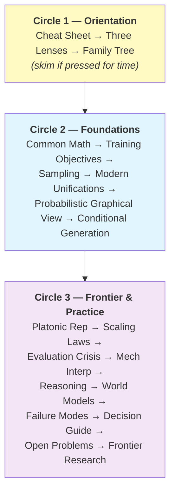
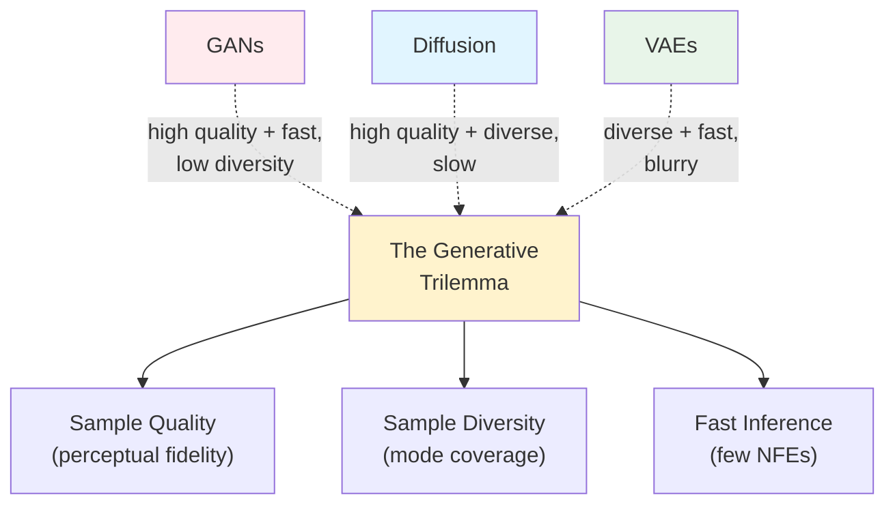
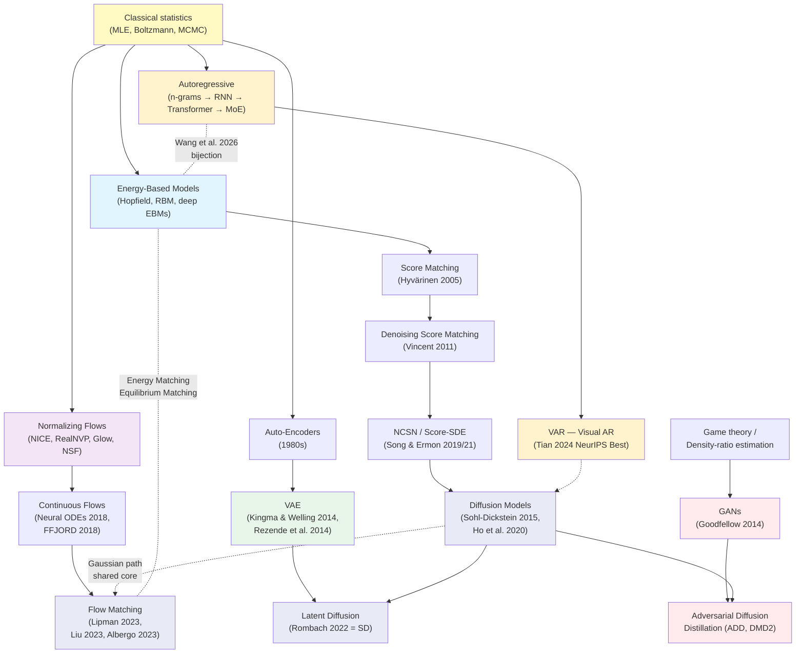
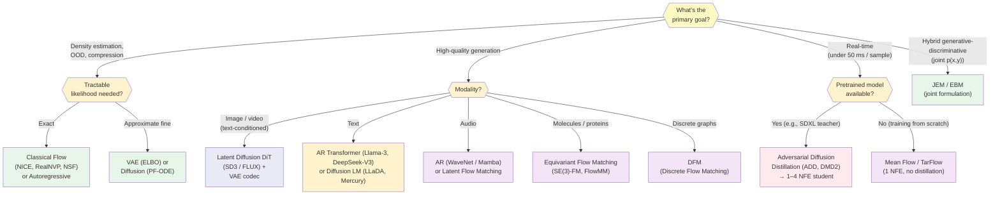
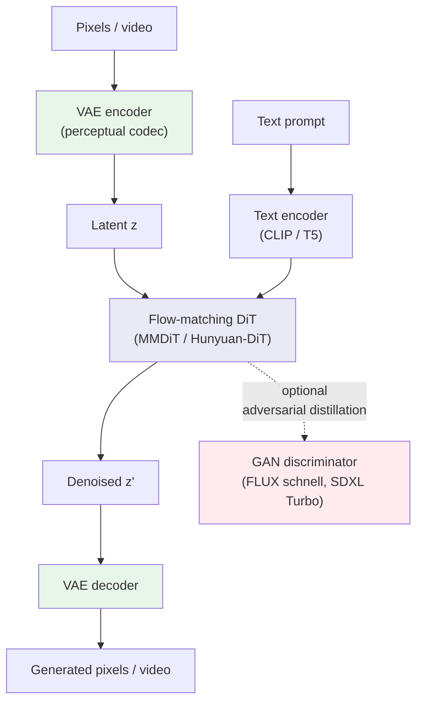
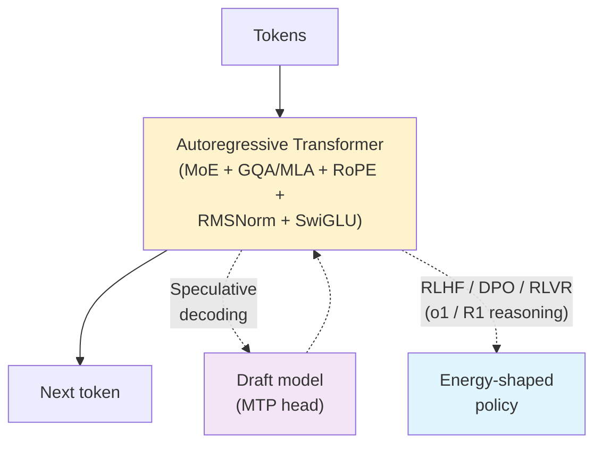
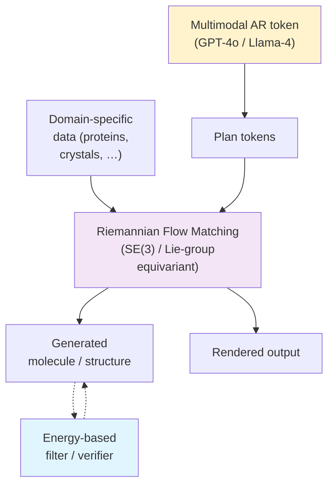

# Generative Models: A Unified View

- :material-map:{ .lg .middle } **One Map for Six Families**

    ---

    A single navigable view of VAEs, GANs, Diffusion, Flows, EBMs, and Autoregressive models — how they relate, where they overlap, and how to choose between them

- :material-graph-outline:{ .lg .middle } **Modern Unifications**

    ---

    Score-based diffusion as time-indexed EBMs, Gaussian-path diffusion and flow matching as shared probability-path algorithms, ARMs ↔ EBMs, Latent Diffusion = codec + generative prior, and more — with the assumptions and caveats that make each equivalence useful

- :material-school:{ .lg .middle } **A Thinker's Guide**

    ---

    Beyond a cheat sheet: conceptual lenses, scaling laws, metric failures, mechanistic interpretability, the Platonic Representation Hypothesis and its counterpoints, and a curated list of open theoretical problems

- :material-lightbulb-on-outline:{ .lg .middle } **Frontier Research Directions**

    ---

    Concrete novel-research seeds that fall out of the cross-family view — where a graduate student or research engineer could plausibly contribute in 2026

---

## Why This Document Exists

The six "Explained" pages in this directory each go deep on one family of generative models:

- [VAE](vae-explained.md) — encode-decode with a probabilistic bottleneck
- [GAN](gan-explained.md) — generator vs discriminator
- [Diffusion](diffusion-explained.md) — learn to denoise
- [Flow](flow-explained.md) — invertible transformations + flow matching
- [EBM](ebm-explained.md) — learn an energy landscape
- [Autoregressive](autoregressive-explained.md) — chain-rule factorisation

Each is excellent on its own, but a *new* practitioner — and an *experienced* one wanting to spot novel research directions — needs more than six independent deep-dives. They need a single map showing **how the families relate, what they share, what they don't, and how the 2024–2026 wave of unifications has redrawn the territory**. They also need a tour of the *intellectual frontier* where these unifications are forcing fundamental rethinks of evaluation, interpretability, and the very meaning of "generative".

That is the job of this document. It is the recommended *first* page to read in this directory; after this overview, the six deep-dives can be visited in any order. Treat the later sections (the [Platonic Hypothesis](#the-platonic-representation-hypothesis), [Scaling Laws Across Families](#scaling-laws-across-families), [the Evaluation Crisis](#the-evaluation-crisis), [Open Theoretical Problems](#open-theoretical-problems), and [Frontier Research Directions](#frontier-research-directions-where-to-contribute)) as a thinker's reading list rather than a reference; they are designed to seed new ideas.

### How to Read This Document

This page is structured as **three concentric circles** of detail. Pick the circle that matches your current goal:

**Recommended order through the directory** (after this page):

1. **[Autoregressive Models](autoregressive-explained.md)** — the simplest factorisation; cleanest example of "tractable likelihood by construction".
2. **[VAEs](vae-explained.md)** — your first taste of latent variables and the ELBO. You'll need the ELBO again for diffusion.
3. **[GANs](gan-explained.md)** — the canonical *implicit* density-ratio estimator. Once you understand GANs, adversarial distillation in modern diffusion makes sense.
4. **[Energy-Based Models](ebm-explained.md)** — the mathematical bedrock. Once you understand energy / score / log-density, diffusion and flow matching become "just an EBM with extra structure".
5. **[Diffusion Models](diffusion-explained.md)** — the largest deep-dive; central to image / video / audio generation. Builds on score matching (EBM) and the ELBO (VAE).
6. **[Normalizing Flows](flow-explained.md)** — from classical change-of-variables to modern flow matching; Gaussian-path flow matching and diffusion share a practical algorithmic core.

If you only have time for *two* deep-dives, read **Diffusion** and **Autoregressive**. The other pages are not obsolete or reducible footnotes, but many modern production stacks can be understood as hybrids around those two endpoints: iterative denoising / transport on one side, and chain-rule token generation on the other.

**Prerequisites**: working comfort with probability, calculus, and at least one of (PyTorch / JAX / TensorFlow). You don't need to know any specific generative-model family before starting — but the family-specific deep-dives assume you've at least skimmed Circle 1 of this page.

---

## The Six Families: A One-Page Cheat Sheet

| Family | Core idea | Trains via | Generates by | Likelihood | Primary modern role (2026) |
| --- | --- | --- | --- | --- | --- |
| **VAE** | Encode to a probabilistic bottleneck, decode back | ELBO (reconstruction + KL) | Sample latent → decoder forward pass | Lower bound (ELBO) | **Codec** for latent diffusion / flow and video patch latents |
| **GAN** | Two-network minimax: generator vs discriminator | Adversarial (saddle-point) | Generator forward pass | None (implicit) | Real-time generation; **adversarial-distillation post-training** of diffusion models |
| **Diffusion** | Learn to reverse a fixed noising process | MSE on noise / score / velocity | 20–1000 ODE / SDE steps (or 1–4 distilled) | ELBO / ODE likelihood estimates | Image, video, 3-D generation; latent diffusion remains a dominant visual stack |
| **Flow** | Transform a base distribution via tractable bijections (classical) or a vector field (flow matching) | Maximum likelihood + Jacobian (classical) or vector-field regression (FM) | One forward pass (classical) or 1–50 ODE steps (FM) | Exact for classical flows; ODE divergence integral for CNF / FM | Rectified-flow / flow-matching transformers power SD3, FLUX.1, HunyuanVideo |
| **EBM** | Score every point with a scalar energy; low energy = high probability | Contrastive divergence, score matching, or **Energy Matching** | MCMC / Langevin / **gradient descent** on the landscape | Unnormalised; $Z$ usually intractable | Density estimation, OOD detection; **Equilibrium Matching** (FID 1.90 on ImageNet 256² in 2025) |
| **Autoregressive** | Chain-rule factorisation: predict each element given its predecessors | Cross-entropy on next-token prediction | Sequential decoding (or speculative / multi-token) | Exact via the chain rule | LLMs (GPT-4, Llama-3, DeepSeek-V3); **VAR** for images |

A first reading suggests these are six unrelated approaches. The 2022–2026 literature has shown that **they are not** — see [Modern Unifications](#modern-unifications-20222026) below.

---

## Three Lenses for Looking at Generative Models

A useful exercise before going deeper: every generative model can be classified along *three* orthogonal axes. Once you learn to think in these axes, the historical "VAE vs GAN vs diffusion" debates lose most of their force.

### Lens 1 — What Divergence Are We Minimising?

Every generative model is *implicitly* trying to minimise a divergence between $p_\theta$ and $p_{\mathrm{data}}$. The choice of divergence is the deepest design decision and it predicts most of a family's empirical behaviour:

| Family | Divergence minimised (formal or implicit) | Behavioural consequence |
| --- | --- | --- |
| **AR (MLE)** | Forward KL: $D_{\mathrm{KL}}(p_{\mathrm{data}}\,\|\,p_\theta)$ | Mode covering — assigns non-zero mass everywhere $p_{\mathrm{data}}$ has mass |
| **VAE (tight ELBO)** | Forward KL on data + a regularising encoder term | Mode covering, but encoder posterior collapse can leak diversity |
| **GAN (vanilla — saturating)** | Jensen-Shannon | Symmetric; vanishing-gradient pathology when supports separate |
| **GAN (non-saturating)** | Same optimal discriminator fixed point as vanilla GAN, but a generator loss chosen to avoid saturation | Better gradients early in training; mode collapse still comes from adversarial dynamics, capacity limits, support mismatch, and critic overfitting |
| **WGAN / WGAN-GP** | Wasserstein-1 (earth mover) | Smooth gradients even when supports don't overlap |
| **Diffusion (DDPM, DSM)** | Fisher divergence between scores (across all noise levels) | Smooth, mode-covering; the "regression-not-classification" feel |
| **Flow Matching** | Conditional vector-field MSE | Shares an algorithmic core with Gaussian-path diffusion; broader paths / couplings are not identical to DDPM |
| **EBM (CD)** | Forward KL minimised by SGD; CD's MCMC truncation introduces gradient bias | Mode covering when MCMC mixes; pseudo-mode collapse when it doesn't |
| **EBM (Energy Matching)** | OT cost + entropic regulariser | Both straight-path transport *and* equilibrium structure |
| **f-GAN** | Any f-divergence (KL, reverse-KL, Pearson, …) | Custom-tunable mode behaviour |

**Why this matters**: if you ever wonder why GANs mode-collapse and diffusion usually does not, the answer starts in this column but does not end there. The original minimax GAN has a JS-divergence support-mismatch problem; the non-saturating loss fixes much of the vanishing-gradient issue without changing the ideal fixed point; and practical mode collapse also depends on discriminator capacity, update balance, regularisation, and finite-batch dynamics. WGAN, R1 / R2 regularisation, relativistic losses, and modern adversarial-distillation methods all improve the gradient geometry rather than magically changing GANs into likelihood models.

**The forward-vs-reverse-KL story** is one of the deepest symmetries in the field. Forward KL ($p_d \| p_\theta$) is *zero-avoiding* — assigning low probability to a mode that exists in $p_d$ is heavily penalised, so MLE-style models (AR, VAE, classical flows) cover all modes but may also assign mass to regions that aren't in $p_d$ (sometimes called "spreading"). Reverse KL ($p_\theta \| p_d$) is *zero-forcing* — assigning probability to a region without data is heavily penalised, so reverse-KL-like objectives and reward-shaped policies are sharper but may collapse to a subset of modes.

### Lens 2 — What Forward Corruption Process Are We Inverting?

Almost every generative model can be written as "*invert a forward corruption*". The choice of corruption *is* the family:

| Family | Forward corruption $q(z\mid x)$ or $q(x_t\mid x_0)$ | What gets inverted |
| --- | --- | --- |
| **VAE** | Encoder $q_\phi(z \mid x)$ — learned Gaussian | Decoder generates $x$ from $z$ |
| **Diffusion** | Fixed Gaussian noising chain $x_t = \sqrt{\bar\alpha_t}\,x_0 + \sqrt{1-\bar\alpha_t}\,\epsilon$ | Reverse diffusion |
| **Flow Matching** | Fixed path $\psi_t = (1-t)\,x_0 + t\,x_1$ (rectified) or any other interpolant | The vector field $u_t$ |
| **EBM (DRL)** | Same fixed chain as DDPM, applied to a *sequence* of EBMs | Per-scale recovery |
| **AR (masked-diffusion LM)** | Mask tokens at rate $t$ | Predict masked positions |
| **AR (next-token)** | "Erase tokens to the right of position $i$" | Predict the next token |
| **VAR** | Down-sample tokens to a coarser scale | Predict the next-finer scale |
| **GAN** | *None* — there is no forward corruption | Direct distributional matching |

This lens explains a recent surprise: **AR is just diffusion with a degenerate corruption process** (reveal one position, reveal two, reveal three…). Once you accept that framing, [Wang et al., 2026 — *ARMs are Secretly EBMs*](https://arxiv.org/abs/2512.15605) and the LLaDA / Mercury / Dream diffusion-LM line are not surprising — they are the natural continuum between two corruption processes that happen to live at opposite ends of a spectrum (one position at a time vs all positions independently noised).

### Lens 3 — Where Is the Computational Bottleneck?

Each family has *exactly one* computational quantity that is hard to compute, and the rest of the family's design is about avoiding it:

| Family | Bottleneck | How avoided |
| --- | --- | --- |
| **AR** | Sequential decode (length $N$) | Speculative decoding, MTP, parallel decoding |
| **VAE** | Posterior $q(z\mid x)$ for general decoders | Amortised inference net + ELBO |
| **GAN** | Density of $p_g$ (implicit, not even queryable) | Avoid it entirely; train against a critic |
| **Diffusion** | Score / data distribution at *every* noise level | Score matching gives an unbiased gradient |
| **Flow (classical)** | $\det J$ (general $O(D^3)$) | Triangular / structured Jacobians |
| **Flow Matching** | The unknown probability path | Conditional flow matching: pick a tractable conditional and marginalise |
| **EBM** | Partition function $Z = \int e^{-E}$ | CD / NCE / score matching / ratio estimation |

Read together with Lens 2, this gives you a mental decision tree: *which corruption is most natural for my data?* → *which bottleneck am I willing to live with?* → *family choice falls out*.

---

## A Common Mathematical Framework

Every generative model fits the same pattern: it learns an approximation $p_\theta(x)$ to a data distribution $p_{\mathrm{data}}(x)$. The families differ in **how** they parameterise $p_\theta$ and **how** they avoid the otherwise-intractable normalising integral $\int p_\theta(x)\, dx$.

### The Fundamental Trilemma

Generative modelling has been called a *trilemma* among three desiderata, and you historically pick at most two ([Xiao et al., 2022](https://nvlabs.github.io/denoising-diffusion-gan/)):

The 2024–2026 wave has **weakened the old trilemma** rather than erased it. Distilled diffusion reaches 1–4 NFEs at near-teacher quality, Mean Flows report 1-NFE FID 3.43 on ImageNet 256², R3GAN revisits pure-GAN stability and mode coverage, Equilibrium Matching reports EBM FID 1.90 in optimisation-style sampling, and VAR reports AR images at FID 1.73 with much faster inference than its diffusion baselines. Each result breaks a historical stereotype; none removes the need to check data regime, compute budget, metric choice, and failure modes.

### Five Strategies to Avoid the Normaliser

The technical heart of every family is how it deals with $Z = \int p_\theta(x)\, dx$:

| Strategy | Families | Mechanism |
| --- | --- | --- |
| **Factorise** $p_\theta$ so $Z$ is trivially 1 | Autoregressive, Classical Flows | Chain rule (AR) / change-of-variables with structured Jacobian (flows) |
| **Skip $p_\theta$, learn its gradient instead** | Diffusion, Flow Matching, Score-based | Learn $\nabla_x \log p_t(x)$ or a vector field; sample by ODE/SDE integration |
| **Skip $p_\theta$, learn a 0/1 classifier** | GAN, NCE | Train a discriminator / two-sample classifier; *implicit* density |
| **Keep $Z$ but estimate its gradient** | EBM (contrastive divergence, NCE) | $\nabla \log Z$ is an expectation under $p_\theta$, estimated by MCMC or noise contrast |
| **Optimise a lower bound** | VAE | ELBO replaces $\log p_\theta(x)$ with a tractable lower bound |

This taxonomy is more useful than the historical "generative vs discriminative" cut: it tells you immediately what the *practical bottleneck* of each family is.

### Why the Manifold Hypothesis Forces a Family Choice

Real-world data lives on a low-dimensional manifold embedded in a much higher-dimensional ambient space — natural images use $D \approx 200{,}000$ pixels but appear to lie on a manifold of intrinsic dimension a few hundred ([Pope et al., 2021](https://arxiv.org/abs/2104.08894)). This single fact explains *most* of the empirical asymmetries between families:

- **Classical flows** struggle on images because they cannot dimensionally compress: the bijection forces $D_{\mathrm{model}} = D_{\mathrm{data}}$, wasting capacity on the orthogonal-to-manifold directions.
- **Latent diffusion / latent flow matching** dominate production because the VAE codec compresses to the manifold's intrinsic dimension *first*, then generates on the compressed representation.
- **GANs** trained on natural images implicitly learn the manifold but the JS divergence has no gradient between two distributions whose supports don't overlap — exactly the pathological case for low-dimensional manifolds in high-dimensional ambient spaces.
- **Diffusion** sidesteps the support-mismatch problem because the noised distributions $q(x_t)$ are full-support Gaussians at every $t > 0$.
- **EBMs** (classical) have no built-in mechanism to express low-dimensional support; **Equilibrium Matching** is explicitly designed so the learned gradient field has equilibria on the data manifold and grows away from it, giving a more manifold-aware energy landscape.

This is why in 2026 a dominant visual-generation recipe is *codec + diffusion / flow matching*: compress first, then learn the generative dynamics in a lower-dimensional latent where the geometry is better conditioned. It is a powerful recipe, not a theorem that all modalities should use a VAE codec.

### The Probabilistic Graphical Model View

Each family corresponds to a *graphical-model structure* — a way of factoring the joint distribution over data and latents. This is the oldest unifying lens in machine learning and remains the cleanest:

| Family | Graphical structure | Joint factorisation |
| --- | --- | --- |
| **AR** | DAG (directed chain) | $p(x_1) \prod_i p(x_i \mid x_{<i})$ |
| **VAE** | Directed latent-variable model | $p(z) \, p_\theta(x \mid z)$ with amortised inference $q_\phi(z \mid x)$ |
| **Flow (classical)** | Deterministic invertible chain | $p(z) \cdot \prod_k \lvert\det J_{f_k}\rvert^{-1}$ |
| **Diffusion** | Markov chain (length $T$) | $p(x_T) \prod_t p_\theta(x_{t-1} \mid x_t)$ |
| **EBM** | Undirected (Markov random field) | $\frac{1}{Z}\exp(-E_\theta(x))$ — no factorisation, just a global potential |
| **GAN** | None — *implicit* | No tractable joint; only a sampling procedure |
| **JEM** | Undirected joint over $(x, y)$ | $\frac{1}{Z}\exp(-E_\theta(x, y))$ |

**Key insight from the graphical view**: directed models (AR, VAE, classical flows) get tractable likelihood almost for free, but constrain the conditional independence structure they can express. Undirected models (EBMs) can express *any* joint over $x$ but pay for it with the partition function. Diffusion is the rare case of a *directed* model with an MRF-like global structure: the chain $p(x_T) \prod_t p_\theta(x_{t-1} \mid x_t)$ is directed, but at every $t$ a true score field can be written as the gradient of a log-density, equivalently a time-indexed energy $E(x, t) = -\log p_t(x) + \mathrm{const}$. This is the precise sense in which score-based diffusion sits near EBMs in the [Modern Unifications](#modern-unifications-20222026).

This view also explains a counter-intuitive fact: **adding more latent variables makes likelihood *harder* to compute, not easier**, because each latent introduces a marginalisation. VAEs side-step this with the ELBO; diffusion side-steps it by making the latents structured and tractable; classical flows side-step it by making the chain *deterministic* so there are no latents to marginalise over.

---

## The Family Tree

Generative-model families share more ancestry than the names suggest. The diagram below traces the lineage from classical statistical modelling to the 2024–2026 unified frameworks.

The dotted lines are 2022–2026 *unifications* — pairs of families that share an objective, probability path, dual representation, or training trick under specific assumptions. The caveats matter: Gaussian-path diffusion is close to flow matching; arbitrary flow matching is broader. Score diffusion can be read as an EBM when the learned field is a score; an unconstrained vector field need not be conservative. ARMs and EBMs are linked in function space, but their sampling algorithms and engineering bottlenecks remain different.

---

## Training Objectives Compared

The single most informative comparison across families is what each one *minimises*:

| Family | Objective | One-line summary |
| --- | --- | --- |
| **AR** | $-\sum_i \log p_\theta(x_i \mid x_{<i})$ | Cross-entropy on next-token prediction |
| **VAE** | $-\mathbb{E}_q[\log p(x\mid z)] + D_{\mathrm{KL}}(q(z\mid x)\,\|\,p(z))$ | Reconstruction + KL (the **ELBO**) |
| **GAN (orig)** | $\min_G \max_D \mathbb{E}_{p_d}[\log D] + \mathbb{E}_{p_g}[\log(1-D)]$ | Saddle-point on the **JS divergence** |
| **GAN (WGAN)** | $\min_G \max_{D \in \mathrm{Lip}_1} \mathbb{E}_{p_d}[D] - \mathbb{E}_{p_g}[D]$ | Saddle-point on the **Wasserstein-1** distance |
| **Diffusion (DDPM)** | $\mathbb{E}_{t, x_0, \epsilon}\,\|\epsilon - \epsilon_\theta(x_t, t)\|^2$ | MSE between **predicted and actual noise** |
| **Score-Based** | $\mathbb{E}_{p(x_t)}\,\|\nabla \log p_t - s_\theta(x_t, t)\|^2$ | Match the **score** of the noisy distribution |
| **Flow Matching** | $\mathbb{E}_{t, x_0, x_1}\,\|u_t(x_t) - v_\theta(x_t, t)\|^2$ | Regress against a target **vector field** |
| **Classical Flow** | $-\log p_z(f^{-1}(x)) - \log\,\lvert\det J_{f^{-1}}\rvert$ | Maximum likelihood + Jacobian determinant |
| **EBM (CD)** | $\nabla E_\theta(x^+) - \nabla E_\theta(x^-)$ | Push energy down on data, up on **MCMC samples** |
| **EBM (SM)** | $\mathbb{E}_{p_d}\bigl[-\mathrm{tr}(\nabla^2 E_\theta) + \tfrac{1}{2}\|\nabla E_\theta\|^2\bigr]$ | Match the score implicitly (Hyvärinen 2005) |
| **EBM (NCE)** | $-\mathbb{E}_{p_d}[\log h_\theta] - \mathbb{E}_{p_n}[\log(1-h_\theta)]$ | **Binary classify** data vs noise |
| **Energy Matching** | OT vector-field loss far from data + entropic energy near data | Single scalar potential bridges flows and EBMs |

Three patterns jump out:

1. **MSE-against-something is the modern default.** Diffusion, score-based, flow matching, and Energy Matching all reduce training to L2 regression on a target derived from a fixed corruption process — explaining why these methods are so much more stable than classical EBMs or GANs.
2. **Adversarial / contrastive losses are still useful, but as a *post-training* tool**, not as the main objective. ADD, DMD2, and EBM contrastive divergence all use a *learned* discriminator-like critic on top of an already-good base model.
3. **Maximum likelihood is back at the top of the stack** for any family that can manage it — autoregressive LLMs, flows, and (via the ELBO) VAEs all train this way and benefit from the regularising effects.

---

## Inference / Sampling Compared

| Family | How a single sample is drawn | NFEs (typical) | Determinism |
| --- | --- | --- | --- |
| **VAE** | $z \sim p(z)$, then $x = \mathrm{Decoder}(z)$ | 1 | Stochastic (in $z$) |
| **GAN** | $z \sim p(z)$, then $x = G(z)$ | 1 | Stochastic |
| **Classical Flow** | $z \sim p_z$, then $x = f(z)$ | 1 | Stochastic |
| **Flow Matching** | Solve $\dot x = v_\theta(x, t)$ from $t=0$ to $t=1$ | 10–50 (or 1 distilled / Mean Flow) | Deterministic ODE |
| **Diffusion (SDE)** | Reverse SDE / Langevin chain from $x_T \sim \mathcal{N}(0, I)$ | 20–1000 | Stochastic |
| **Diffusion (PF-ODE)** | Probability-flow ODE | 10–50 (or 1–4 distilled) | Deterministic |
| **EBM (classical)** | Langevin / SGLD from random init | 50–1000 | Stochastic |
| **EBM (Equilibrium Matching)** | Adam-style gradient descent on the energy | 5–50 | Mostly deterministic |
| **AR (greedy)** | $\mathrm{argmax}_{x_t} p(x_t\mid x_{<t})$, repeat $N$ times | $N$ tokens | Deterministic |
| **AR (sampled)** | Top-k / top-p / temperature, repeat $N$ times | $N$ tokens | Stochastic |
| **AR (MTP / speculative)** | Multi-token / draft-and-verify | $\approx N/3$–$N/6$ | Same outputs, faster |

This table makes the modern reality precise: **many modern generators trade one huge pass for iterative refinement in some space** — diffusion refines $x_t$ via a score / denoiser, EBMs move $x$ via an energy gradient, flow matching integrates a velocity field, and autoregression refines a prefix one or more positions at a time. The similarity is useful for thinking about test-time compute; it does not make the algorithms interchangeable.

---

## Modern Unifications (2022–2026)

The single most important development of the last four years is not that the families literally disappeared. It is that many boundaries became *change-of-variable boundaries*: the same probability path, score, energy, or latent representation can often be written in another family's language. Eight key results:

### 1. Score-based diffusion as time-indexed EBMs

When the learned field is a score, $s_\theta(x, t) \approx \nabla_x \log p_t(x)$, it can be written as $s_\theta(x, t) = -\nabla_x E_\theta(x, t)$ for a time-indexed energy up to an additive constant. The probability-flow ODE perspective ([Song et al., 2021](https://arxiv.org/abs/2011.13456)) makes the density / score connection explicit. Caveat: an arbitrary neural vector field is not automatically conservative; the EBM reading is cleanest for true scores or architectures / objectives that enforce integrability. **→ See [diffusion-explained.md](diffusion-explained.md#score-based-perspective) and [ebm-explained.md](ebm-explained.md#ebms-vs-diffusion-models-principled-energy-vs-iterative-denoising).**

### 2. Diffusion and Gaussian-path Flow Matching share an algorithmic core

[Diffusion Meets Flow Matching](https://diffusionflow.github.io/), [Flow Matching for Generative Modeling](https://arxiv.org/abs/2210.02747), and later theory show that common DDPM / score-SDE objectives and Gaussian-path flow matching can be written as closely related probability-path algorithms. They differ in schedule, target parameterisation, stochastic vs ODE sampling, and whether the chosen path is Gaussian / OT / rectified / discrete. This is why SD3 and FLUX.1 use rectified-flow training while still being called "diffusion" colloquially. **→ See [flow-explained.md](flow-explained.md#flow-matching-simulation-free-training) and [diffusion-explained.md](diffusion-explained.md#flow-matching-and-rectified-flow-at-scale).**

### 3. Latent Diffusion = VAE codec + diffusion prior

Stable Diffusion's recipe ([Rombach et al., 2022](https://arxiv.org/abs/2112.10752)) is "compress with an autoencoder, run diffusion in the latent". This remains a dominant production recipe for image generation and many video systems; Sora's public technical report describes compressed spacetime patch latents but not enough implementation detail to identify its exact codec. Modern image and video tokenizers are therefore a central part of the generative stack, not a preprocessing afterthought ([VAE explainer's tokenizer-VAE section](vae-explained.md#vaes-inside-modern-generative-pipelines)).

### 4. Adversarial Distillation = GAN + Diffusion

ADD / SDXL Turbo ([Sauer et al., 2023](https://arxiv.org/abs/2311.17042)) and DMD2 ([Yin et al., 2024 NeurIPS Oral](https://arxiv.org/abs/2405.14867)) put a GAN-style discriminator on top of a pretrained diffusion teacher to compress 50-step samplers down to 1–4 steps. The discriminator is a major component of several fast diffusion pipelines, alongside non-adversarial distillation families such as LCM and consistency models. **→ See [gan-explained.md](gan-explained.md#adversarial-training-in-20232026-modern-gans-and-diffusion-distillation).**

### 5. Energy Matching = Flow Matching + EBM

[Energy Matching (Balcerak et al., NeurIPS 2025)](https://arxiv.org/abs/2504.10612) parameterises a *single scalar potential* whose gradient is an OT vector field far from data and a Boltzmann equilibrium near data — unifying flow matching and EBMs in one objective. **Equilibrium Matching** ([Wang et al., 2025](https://arxiv.org/abs/2510.02300)) takes this further: time-invariant energy gradient, Adam-style sampling, FID 1.90 on ImageNet 256². **→ See [ebm-explained.md](ebm-explained.md#energy-matching-unifying-flows-and-ebms).**

### 6. Autoregressive ↔ Energy-Based bijection (2026)

[Wang et al., 2026 — *ARMs are Secretly EBMs*](https://arxiv.org/abs/2512.15605) establishes an explicit bijection between autoregressive LMs and EBMs in function space, corresponding to a special case of the soft Bellman equation in maximum-entropy reinforcement learning. The practical consequence: RLHF and DPO are best understood as *energy shaping*. **→ See [ebm-explained.md](ebm-explained.md#arms-are-secretly-ebms-2026) and [autoregressive-explained.md](autoregressive-explained.md#autoregressive-energy-based-models).**

### 7. Diffusion = Hierarchical VAE

DDPM is mathematically a hierarchical VAE with $T$ latent levels and a fixed Gaussian forward process ([Luo, 2022 — *Understanding Diffusion Models*](https://arxiv.org/abs/2208.11970)). The "ELBO derivation" of the DDPM loss in the [diffusion explainer](diffusion-explained.md#the-elbo-derivation) makes this exact.

### 8. AR ↔ Diffusion (text and images)

Discrete diffusion language models — **LLaDA** ([Nie et al., 2025](https://arxiv.org/abs/2502.09992)), **Mercury** ([Inception, 2025](https://arxiv.org/abs/2506.17298)) — are competitive in selected 8B-scale language and coding settings while decoding many tokens in parallel, but the broad AR-vs-diffusion language comparison is still early. Conversely, **VAR** ([Tian et al., 2024 — NeurIPS Best Paper](https://arxiv.org/abs/2404.02905)) brings GPT-style next-scale autoregression to image generation, beating its DiT baselines on ImageNet 256². [Generator Matching (Holderrieth et al., 2024)](https://arxiv.org/abs/2410.20587) gives a *single objective* subsuming flow / score / discrete-flow training.

The 2026 picture is best summarised as:

> **A useful 2026 mental model: choose a representation, choose a corruption / transport path, choose the target your network predicts, then choose a sampler and post-training procedure. The historical family name is often shorthand for those choices, not a completely separate universe.**

---

## Conditional Generation: How Each Family Handles Control

A pure generative model samples from $p_\theta(x)$. Almost every *useful* deployed system samples from $p_\theta(x \mid c)$ — conditioned on text, class, image, audio, or arbitrary control signals. The mechanisms differ across families and reveal a deeper unification:

| Family | Native conditioning | Test-time control trick |
| --- | --- | --- |
| **AR** | Prepend $c$ to the input sequence; train on $p_\theta(x_t \mid c, x_{<t})$ | Prompting; **classifier-free guidance** ([Sanchez et al., 2024](https://arxiv.org/abs/2306.17806)); CCA ([Toward Guidance-Free AR Visual Generation](https://arxiv.org/html/2410.09347)) |
| **VAE** | Conditional VAE ([Sohn et al., 2015](https://papers.nips.cc/paper/2015/hash/8d55a249e6baa5c06772297520da2051-Abstract.html)): $p(x \mid z, c)$ and $q(z \mid x, c)$ | Latent-space attribute editing; FiLM modulation |
| **Diffusion** | Train $\epsilon_\theta(x_t, t, c)$ with cross-attention to $c$ | **Classifier-free guidance** ([Ho & Salimans, 2022](https://arxiv.org/abs/2207.12598)); **CFG-Zero*** ([Fan et al., 2025](https://arxiv.org/abs/2503.18886)); ControlNet, IP-Adapter |
| **Flow Matching** | Train $v_\theta(x_t, t, c)$ in the same way as conditional diffusion | CFG, CFG-Zero* (transferred from diffusion) |
| **EBM** | $E_\theta(x, c)$ as a single energy network | Energy + reward shaping (cf. RLHF); JEM joint formulation |
| **GAN** | Concatenate $c$ at input or condition the discriminator (cGAN, Pix2Pix) | Truncation, latent arithmetic |
| **Classical Flow** | Concatenate $c$ to coupling networks; auxiliary classifier head | Limited; this is a known weakness of classical flows |

### Three Universal Ideas

Three conditioning mechanisms have spread across all families:

1. **Classifier guidance** ([Dhariwal & Nichol, 2021](https://arxiv.org/abs/2105.05233)) — push samples toward higher $p_\phi(c\mid x)$ via the gradient of an auxiliary classifier. Originally for diffusion; now also used for AR and EBMs (where it's essentially negative-energy reward shaping).
2. **Classifier-free guidance (CFG)** ([Ho & Salimans, 2022](https://arxiv.org/abs/2207.12598)) — interpolate between conditional and unconditional model outputs. Originally for diffusion; **now also for AR visual generation** ([Sanchez et al., 2024](https://arxiv.org/abs/2306.17806)) and flow matching, with **CFG-Zero*** ([Fan et al., 2025](https://arxiv.org/abs/2503.18886)) as the modern variant. The fact that CFG works equally well in AR and diffusion is a strong argument for the [Modern Unifications](#modern-unifications-20222026): once you write both as denoising-of-a-corruption, CFG becomes a single technique with a single derivation.
3. **Adapter-based conditioning** — ControlNet ([Zhang et al., 2023](https://arxiv.org/abs/2302.05543)) for diffusion, LoRA ([Hu et al., 2021](https://arxiv.org/abs/2106.09685)) for AR, IP-Adapter / T2I-Adapter for diffusion. The pattern: keep the base model frozen and inject conditioning through small trainable side-modules. This is now the *dominant* deployment recipe for any conditioning that wasn't in the pre-training distribution.

### CFG: A Cross-Family Technique

CFG started as a diffusion-specific trick but turned out to be remarkably general. The unified statement is:

$$
\hat o(x, c) = (1 + w)\, o_\theta(x, c) - w\, o_\theta(x, \emptyset),
$$

where $o$ is *whatever the network outputs* — noise (diffusion), velocity (flow matching), logits (AR), or score. This is the same algebra in every family. Recent results ([Sanchez et al., 2024](https://arxiv.org/abs/2306.17806); [EditAR — CVPR 2025](https://arxiv.org/abs/2501.04699)) extend CFG to AR visual generation and image editing under a unified framework.

The **open theoretical question** (cf. [Open Problems → Why does CFG work?](#open-theoretical-problems)): CFG samples from a distribution that's *neither* $p_\theta(x \mid c)$ nor $p_{\mathrm{data}}(x \mid c)$ — it's an *interpolation* whose target divergence isn't formally characterised. The fact that it improves perceptual quality (and CLIP score) while *increasing* divergence from the true conditional is one of the deepest unresolved puzzles in the field.

---

## Failure Modes Across Families

Each family has characteristic failure modes that practitioners spend most of their debugging time on. The cross-family view reveals deep parallels:

| Failure | Family | Symptom | Mechanism | Fix |
| --- | --- | --- | --- | --- |
| **Mode collapse** | GAN | Generator outputs few distinct samples | Reverse-KL pulls mass *away* from low-density regions | WGAN; mini-batch discrimination; PacGAN; spectral norm; modern recipes (R3GAN) almost eliminate it |
| **Posterior collapse** | VAE | Decoder ignores $z$; KL = 0 | Strong decoder makes $z$ uninformative | KL annealing; cyclical β-schedule; free-bits; VQ-VAE (discrete latents) |
| **Exposure bias** | AR | Test-time errors compound | Trained on ground-truth context, sampled from own context | Scheduled sampling; sufficient-scale-and-data is the practical fix |
| **Partition-function bias** | EBM (CD) | Short-chain MCMC under-estimates $\nabla \log Z$ | Negative samples not from $p_\theta$ | Persistent CD; replay buffers; switch to NCE / score matching / Energy Matching |
| **Energy explosion** | EBM | Energies grow unbounded; NaNs | No regulariser on $E$ | Add $\alpha \mathbb{E}[E^2]$; gradient clipping; spectral norm |
| **Likelihood ≠ quality** | Flow / EBM / VAE | High likelihood, ugly samples (or vice versa) | Likelihood is not a perceptual metric | Combine with perceptual losses; use a tokenizer + downstream prior |
| **Higher likelihood on OOD** | Flow / VAE | Pathological assignment of high $p_\theta$ to non-data | Subtle training-set bias; not an algorithmic bug | Likelihood-ratio scoring; second-model normalisation ([Nalisnick et al. 2019](https://arxiv.org/abs/1810.09136)) |
| **Schedule mismatch** | Diffusion | Last-step blur or first-step incoherence | Sub-optimal noise schedule for the data distribution | Cosine / shifted / EDM schedules; per-resolution tuning |
| **CFG over-saturation** | Diffusion | High-CFG samples are over-saturated, oversmooth | CFG pushes off-manifold | CFG-Zero*; capping the guidance scale; dynamic thresholding |
| **Bias amplification** | All | Outputs amplify biases in training data | Generative models are statistical mirrors | Data curation; debiasing fine-tunes; reward-model post-training |
| **Recursive model collapse** | AR / Diffusion (any) | Quality declines when trained on prior model's outputs | Iterated narrowing of the support of generated data | Mix in real data ([Shumailov et al., 2024 — *Nature*](https://www.nature.com/articles/s41586-024-07566-y)); synthetic-data verification ([2025](https://arxiv.org/abs/2510.16657)) |
| **Hallucination** | AR LLMs | Confident wrong outputs | No mechanism distinguishing memorised facts from interpolations | RAG; verifier-based RLVR; calibration training |
| **Privacy leakage** | All | Model regurgitates training examples | High capacity + low data diversity | Differential privacy; deduplication; data unlearning |

The deeper observation: **almost every failure mode in column 2 has a structural analogue in another family**. Mode collapse (GAN) is driven by adversarial support mismatch, critic pressure, and update dynamics; posterior collapse (VAE) is KL-pressure-driven; recursive model collapse (any family) is a feedback-loop pathology — but they all reduce to *insufficient pressure on $p_\theta$ to keep its support equal to $p_{\mathrm{data}}$'s*. A frontier research thread: **a single regularisation that addresses all of them simultaneously**.

---

## The Platonic Representation Hypothesis

A startling 2024–2025 empirical observation: **representations across different model families often become more aligned as scale and task diversity increase**. Models trained with different objectives — CLIP-style contrastive vision-language encoders, autoregressive LLMs, diffusion / VAE visual codecs, and DINOv2-style self-supervised encoders — can end up measuring neighbourhoods between datapoints in surprisingly similar ways.

This is the **Platonic Representation Hypothesis** ([Huh, Cheung, Wang & Isola, 2024](https://arxiv.org/abs/2405.07987)): sufficiently capable models may converge toward a shared statistical model of the underlying reality. Three driving forces are proposed:

1. **Task generality** — models trained on more diverse tasks are *forced* into representations that capture more of the underlying structure.
2. **Model capacity** — larger models are more likely to find these globally-optimal representations.
3. **Simplicity bias** — neural networks naturally prefer simpler solutions that generalise.

### Why This Matters for Generative Modelling

If the hypothesis holds even approximately, the choice of *family* matters less than the field's history suggests:

- A diffusion DiT and an AR transformer trained on the same data end up with *qualitatively similar* internal feature manifolds.
- **REPA** ([Yu et al., 2024 — ICLR'25 Oral](https://arxiv.org/abs/2410.06940)) exploits this directly — aligning DiT activations with frozen DINOv2 features yields **17.5× faster training** with no quality loss. The "right" representation already exists; you just have to inherit it.
- **VFM-tokenizers** ([2025](https://arxiv.org/abs/2510.18457)) take this to its logical conclusion: replace the trained VAE encoder with a *frozen* DINOv2 / SigLIP, train only a lightweight decoder. The codec inherits the Platonic representation.
- 2025 follow-ups extend the hypothesis to **molecular ML** ([blopig 2026](https://www.blopig.com/blog/2026/01/what-molecular-ml-can-learn-from-the-vision-communitys-representation-revolution/)), **astronomy** ([*The Platonic Universe*, 2025](https://arxiv.org/abs/2509.19453)), and **neural decoding** ([*Brain–LM Alignment*, NeurIPS 2025 UniReps](https://arxiv.org/html/2510.17833)) — evidence that representation alignment is not confined to language and vision.
- A 2026 critique, [*Revisiting the Platonic Representation Hypothesis: An Aristotelian View*](https://arxiv.org/abs/2602.14486), shows that some global similarity metrics are confounded by model scale. After calibration, the surviving signal is more local: models agree on neighbourhood structure more reliably than on a single universal global geometry.

The implication for novel research: **representational structure is a powerful prior, but it is not magic**. A research direction that reuses strong representations across generative-model families (AR planner with diffusion-tokenized world; flow-matching decoder hung on a frozen VFM / LLM encoder) is likely under-explored, but it still needs calibrated evidence that the transferred representation preserves the task-relevant neighbourhoods.

---

## Scaling Laws Across Families

Each family has its own scaling law for how **loss** decreases with **compute, parameters, and data**. Comparing them reveals where each family has head-room left.

### Autoregressive: Chinchilla and Beyond

[Hoffmann et al., 2022 — Chinchilla](https://arxiv.org/abs/2203.15556) showed that **for compute-optimal training, model size and training tokens should scale equally** — for every doubling of model size, double the training tokens. This corrected Kaplan-style "scale parameters first" recipes that had over-trained Gopher-class models.

**2024–2026 refinements**:

- [Beyond Chinchilla-Optimal](https://arxiv.org/abs/2401.00448) (2024) — when you expect ≥1B inference requests, train *longer* than Chinchilla and *smaller*, paying compute upfront for inference savings.
- [LFM2.5 (Liquid AI, 2026)](https://www.liquid.ai/) sets a **80,000:1 token-to-parameter** record (350M parameters trained on 28T tokens), demonstrating that the diminishing-returns curve has not yet saturated.
- **Test-time compute scaling** ([Snell et al., 2024](https://arxiv.org/abs/2408.03314); [OpenAI o1, 2024](https://openai.com/index/learning-to-reason-with-llms/)) introduces an entirely new axis: throwing inference compute at hard problems is often *more cost-effective* than scaling parameters. This is sometimes called the "missing piece of the Bitter Lesson" — Rich Sutton's [2019 essay](http://incompleteideas.net/IncIdeas/BitterLesson.html) argued that *general methods that leverage compute* are the only ones that scale; until 2024 we had this only for *training* compute. Test-time compute completes the picture.

### Diffusion: EDM and EDM2

[Karras et al., 2022 — EDM](https://arxiv.org/abs/2206.00364) and [Karras et al., 2024 — EDM2](https://arxiv.org/abs/2312.02696) gave the diffusion field its first clean compute-optimal scaling laws. Notably **post-hoc EMA** allows reading off many EMA-decay parameters without re-training, and EDM2's magnitude-preserving design hits **FID 1.81 on ImageNet 512²** — a record that held for over a year.

[REPA-style representation alignment (Yu et al., 2024)](https://arxiv.org/abs/2410.06940) shifts the scaling curve outright: 17.5× faster SiT-XL training to matching FID. This is the diffusion analogue of "switching from Kaplan to Chinchilla scaling": the new compute-optimal curve passes through *much* lower compute budgets if you align with foundation-encoder representations.

### Sparse / Mixture-of-Experts

MoE breaks the dense-scaling curve by letting parameters and compute scale separately. **DeepSeek-V3** (671B total / 37B active) and **Mixtral 8×7B** demonstrate that on standard benchmarks, an MoE with $N_{\mathrm{active}} \approx N_{\mathrm{dense}}/4$ matches dense quality at near-equivalent inference cost. The 2026 default flagship is "sparse-activated MoE Transformer" — see [autoregressive-explained.md → MoE](autoregressive-explained.md#mixture-of-experts-at-production-scale).

### A Unified Scaling Picture

| Family | Compute axis | Data axis | Test-time axis |
| --- | --- | --- | --- |
| **AR** | Chinchilla-optimal $N \times T$ | 28T+ tokens (LFM2.5) | **CoT length, sample-and-verify (o1, R1, o3)** |
| **Diffusion** | EDM2 / REPA accelerate the curve | ImageNet → LAION 5B → web-scale video | **Distillation steps (1–4)** |
| **Flow matching** | Mean Flow / TarFlow shift the curve to 1 NFE | Same as diffusion | **Reflow iterations** |
| **EBM** | Energy Matching / EqM finally got a stable curve | Smaller-scale (CIFAR / ImageNet) than AR | **Adaptive sampling steps** |
| **GAN** | R3GAN simplifies; GigaGAN scales to 1B params | LAION-class | **N/A (one NFE)** |

**The deeper observation**: in 2026 *every* family has discovered a **test-time compute axis**. Diffusion has its sampler step count, AR has chain-of-thought, EBMs have adaptive-optimiser sampling, flows have reflow iterations. The training-compute axis is no longer the only knob — and across families this *new* axis often has steeper slopes than the old one.

---

## The Evaluation Crisis

A quietly serious problem: **the metrics we use to evaluate generative models are broken**, and increasingly so as the models improve.

### FID Doesn't Match Human Perception

[Stein et al., 2023 — *Exposing Flaws of Generative Model Evaluation Metrics*](https://arxiv.org/abs/2306.04675) ran the largest-ever psychophysics experiment on generative-model outputs and found that **no existing automatic metric (FID, IS, CLIP-FID, MSE, …) strongly correlates with human judgement** of perceptual realism. The state-of-the-art perceptual realism that diffusion models reach is *not reflected* in FID rankings. Worse, FID systematically *under-rates* diffusion vs. older GAN baselines — partly because of over-reliance on InceptionV3 features that diffusion models don't optimise for.

### Replacement Metrics in 2024–2026

- **CMMD** ([Jayasumana et al., 2024](https://arxiv.org/abs/2401.09603)) — CLIP-feature MMD; better human correlation, sample-efficient.
- **DINOv2-FID** ([Stein et al., 2023](https://arxiv.org/abs/2306.04675); [REPA, 2024](https://arxiv.org/abs/2410.06940)) — replace InceptionV3 with DINOv2 features.
- **Human-preference-aligned metrics** — OneReward and the new generation of preference-trained reward models (analogous to RLHF reward models for LLMs).
- **Open benchmarks** — [Awesome-Evaluation-of-Visual-Generation](https://github.com/ziqihuangg/Awesome-Evaluation-of-Visual-Generation) tracks the proliferation.

### The Same Crisis in Language

For autoregressive LLMs, **perplexity has decoupled from capability**. A 70B Llama-3 with similar perplexity to GPT-4-class models can be wildly worse on MMLU-Pro, GPQA Diamond, FrontierMath, or LiveCodeBench. The 2024–2026 evaluation stack has therefore fragmented into specialised benchmarks (see [autoregressive-explained.md → Evaluation Metrics](autoregressive-explained.md#language-model-benchmarks)) and **LMSYS Chatbot Arena**'s pairwise human preferences.

### What This Implies for Research

If our metrics are broken, **most reported "X beats Y" results need to be recalibrated**. Concrete consequences:

1. **The 2024 VAR paper's "AR beats diffusion" claim** is FID-based. With CMMD or human evaluation the comparison shifts.
2. **Post-training results** are now reported in terms of human-preference arena ratings *instead of* loss — this is a fundamental shift in how empirical claims are validated.
3. **Density-estimation comparisons** (BPD, NLL) are still trustworthy and remain the *only* honest way to compare classical flows, EBMs, and AR models on tabular / scientific data.

A frontier research direction: **principled, model-class-agnostic evaluation**. Anything that gets us closer to a metric that (a) correlates with human judgement, (b) doesn't favour models that share the metric's feature extractor, and (c) is sample-efficient is high-impact.

---

## Mechanistic Interpretability of Generative Models

A 2024–2026 thread that may end up reshaping the entire field: **figuring out what generative models actually compute internally**. Once foreign to the diffusion / flow / GAN literature, mechanistic interpretability has rapidly matured.

### Key Findings

- **Universality of circuits** ([Olsson et al., 2022 — induction heads](https://transformer-circuits.pub/2022/in-context-learning-and-induction-heads/index.html); [Bridging the Black Box, ACM CSUR 2025](https://dl.acm.org/doi/10.1145/3787104)) — the same algorithmic motifs (induction heads, copy heads, summary heads) appear across LLMs of different sizes and seeds. **Same architecture → same circuits.**
- **Diffusion semantic layout emerges early** ([Park et al., 2024 — *Emergence and Evolution of Interpretable Concepts in Diffusion Models*](https://arxiv.org/html/2504.15473)) — the global layout of a generated image is determined within the **first reverse-diffusion step**, even though the visual content is still pure noise. This is consistent with the [Platonic Representation Hypothesis](#the-platonic-representation-hypothesis): the model commits to a *semantic* representation early and refines it perceptually.
- **Multi-hop reasoning has visible internal scratchpads** — Anthropic's 2024 work on Claude shows the model forming *intermediate latent representations* (e.g. "Dallas → Texas" before answering "what's the capital of Texas?") that match the structure of an explicit chain-of-thought. This connects directly to the [test-time compute scaling](#scaling-laws-across-families) story.
- **Open Problems in Mechanistic Interpretability (Jan 2025)** — a 29-author consensus paper enumerated the field's current open problems: rigorous definitions of "feature", computational complexity barriers, practical methods that *underperform simple baselines* on safety-relevant tasks.

### Why It Matters for Generative Modelling

Mechanistic interpretability gives us the first principled way to answer questions that have driven the field for a decade:

- *Why* do GANs mode-collapse? (Discriminator over-trains on recently-generated examples; circuit-level analysis would make this concrete.)
- *Why* does CFG work? Are guidance scales injecting attention or shifting energies?
- *Why* does test-time compute help reasoning models? Is the chain-of-thought *constructing* circuits at inference time or *invoking* pre-trained ones?
- *What* exactly is the Platonic representation and why does scale converge to it?

These are the questions where the next decade of generative-model theory will probably live.

---

## Reasoning as Generation

A 2024–2026 reframing with deep implications: **reasoning is generation**, and the boundary between them is dissolving.

OpenAI's o1, DeepSeek-R1, and successors ([Snell et al., 2024](https://arxiv.org/abs/2408.03314)) have shown that **scaling test-time compute** — letting an autoregressive model produce arbitrarily long chains of thought — produces capabilities that no amount of train-time scaling reaches. AIME 2024 went from GPT-4o's **12 %** to o1's **74 % at single-sample, 93 % at re-ranked-1000-samples**.

Three takeaways from the cross-family lens:

1. **Reasoning is a generative process under verification.** o1's RL with Verifiable Rewards (RLVR) is mathematically a *reward-shaped policy gradient* — equivalent to training an EBM whose energy is the *negative reward* under the [ARM ↔ EBM bijection (Wang et al. 2026)](https://arxiv.org/abs/2512.15605).
2. **Diffusion-style trajectories generalise to reasoning.** A 50-step DDPM denoising trajectory and an o1 chain-of-thought are *both* iterative refinement processes that trade compute for quality. A research direction: can a diffusion model "reason" in latent space the way an LLM reasons in token space?
3. **World models = visual reasoning.** The 2026 [Visual Generation in the New Era](https://arxiv.org/abs/2604.28185) survey identifies the migration from *atomic* generation to *agentic* world modelling as the dominant trend. Video diffusion models that can be queried for "what happens if this object moves left?" are doing visual chain-of-thought. See the next section.

---

## World Models: Generation as the Substrate of Cognition

The 2026 frontier is **world modelling** — generative models that don't just produce data but maintain an internal simulation of the world that can be queried, updated, and acted upon.

### The Three-Level Taxonomy

[*Agentic World Modeling* (2026)](https://arxiv.org/abs/2604.22748) defines:

- **L1 Predictor** — one-step local transitions (most current diffusion video models)
- **L2 Simulator** — multi-step action-conditioned rollouts (Sora, Genie, Cosmos)
- **L3 Evolver** — autonomous model revision and self-improvement (the frontier, mostly aspirational)

### Sequential Decoupling vs Unified Coupling

[*Visual Generation in the New Era* (2026)](https://arxiv.org/abs/2604.28185) distinguishes two architectural philosophies:

- **Sequential Decoupling** — an LMM "planner" emits plan tokens (text), and a video diffusion model "renders" them into pixels. Combines AR's instruction-following with diffusion's per-pixel fidelity.
- **Unified Coupling** — causal reasoning and generative power are optimised *jointly* in a single network. PAN ([Physical, Agentic, Nested, 2026](https://arxiv.org/abs/2604.28185)) is a representative early example, mixing continuous and discrete representations under a hierarchical generative model.

### Why This Closes the Loop

World models put the six families into their final unified context: a **generative model is a world model when its samples are the substrate of an agent's planning loop**. That requires:

- A *fast* generative core (diffusion-distilled / mean-flow / flow-matching DiT — the speed-of-thought axis)
- A *causal* prior over actions and outcomes (AR — the planning axis)
- A *learned scoring function* over outcomes (EBM — the evaluation axis)
- A *codec* compressing the world into a tractable representation (VAE — the perception axis)
- An *adversarial post-training step* aligning to human preferences (GAN — the alignment axis)
- An *invertible* representation supporting counterfactuals (Flow — the editing axis)

In other words: **a competent world model is likely to reuse ideas from all six families**. The deep-dive pages in this directory are therefore not six mutually exclusive choices; they are six design vocabularies that often become components of a single frontier system.

---

## Choosing a Family in 2026: Decision Guide

---

## Hybrid Pipelines in 2026

Almost every state-of-the-art generative system shipped between 2024 and 2026 is a **hybrid** combining at least three of the six families. Three production patterns dominate:

### Pattern 1: Image / Video Generation (SD3, FLUX, Sora, HunyuanVideo, Wan)

This single diagram involves **VAE / autoencoder** (codec), **Flow Matching** (training objective), **Diffusion** (inference is a denoising / transport trajectory), **AR or encoder-only text models** (prompt representation), and optionally **GAN** (adversarial distillation).

### Pattern 2: Text Generation (GPT-4, Llama-3, DeepSeek-V3, R1)

The post-training step is now formally understood as **EBM-style energy shaping** ([Wang et al., 2026](https://arxiv.org/abs/2512.15605)).

### Pattern 3: Scientific / Multimodal (Protein Design, Materials, Multimodal World Models)

This is the **Pattern 1 + EBM filter + AR planner** combination that the 2025–2026 Visual-Generation surveys ([Visual Generation in the New Era, 2026](https://arxiv.org/abs/2604.28185)) identify as the agentic / world-modelling frontier.

---

## Open Theoretical Problems

Eight problems where the cross-family view exposes deep gaps the field has not yet closed. These are *not* engineering wishlists; they are conceptual open questions where progress would shift the field.

### 1. A principled choice of corruption process

Diffusion uses Gaussian noising; discrete-flow uses CTMC; AR uses left-to-right erasure; VAR uses scale-coarsening. We have no theory predicting *which corruption is optimal* for a given data manifold. A theoretical answer would unify the families on a single axis: "given $p_{\mathrm{data}}$, the best corruption is …".

### 2. The exact rate of "diffusion = flow matching"

We have strong equivalence and near-equivalence results for diffusion and Gaussian-path flow matching, but [theoretical KL bounds (NeurIPS 2024)](https://neurips.cc/virtual/2024/poster/93996) only tighten asymptotically. The exact non-asymptotic gap as a function of timestep schedule, target parameterisation, network capacity, and data dimension is open.

### 3. The partition function for high-dimensional images

Despite Energy Matching and EqM bypassing it, *no one* has yet produced a tight estimate of $\log Z$ for an EBM trained on natural images. AIS scales poorly past CIFAR. This is the single biggest empirical gap holding EBMs back from being directly comparable on likelihood.

### 4. Why does CFG work?

Classifier-free guidance is the most-used technique in production diffusion, but the formal explanation is unsatisfying — it doesn't sample from any tractable distribution and the "effective temperature" of the resulting distribution is not characterised. [Karras et al., 2024](https://arxiv.org/abs/2404.07724) made progress; the *exact* divergence minimised remains open.

### 5. The relationship between scaling laws and emergence

We have Chinchilla curves for pre-training loss and we have (separate) test-time compute curves for reasoning. **There is no theory connecting the two** — no current framework predicts which capabilities emerge from train-time scaling vs which require test-time compute. This is arguably the single most important open question in 2026 LLM research.

### 6. Sample efficiency on the data manifold

Why does flow matching need orders of magnitude *fewer* gradient steps than denoising-score-matching diffusion at matching quality? The [Mean Flows (Geng et al., 2025)](https://arxiv.org/abs/2505.13447) result reaches FID 3.43 in 1 NFE without distillation — a fact the field does not yet have a clean theoretical explanation for.

### 7. The Platonic Representation Hypothesis: why does it converge?

[Huh et al., 2024](https://arxiv.org/abs/2405.07987) gives empirical evidence and informal arguments. A *formal* theory predicting which representations different families converge to (and which don't) would be transformative — and would tell us where novel research is genuinely necessary vs where it's redundant with Platonic-converged structure.

### 8. Generation–reasoning unification

[Wang et al., 2026](https://arxiv.org/abs/2512.15605) connects ARMs to EBMs via maximum-entropy RL, but the connection between *iterative refinement* (diffusion sampling, MCMC, gradient descent on energy) and *iterative reasoning* (chain-of-thought, search, planning) is still informal. A unified theory would explain why o1 / R1 / o3 work and predict where they will fail.

---

## Frontier Research Directions: Where to Contribute

Concrete novel-research seeds that fall directly out of the cross-family view. Each is plausibly tractable for a strong PhD project or a focused industry team in 2026.

### A. Under-Explored Hybrids

- **AR-encoder + diffusion-decoder for molecules/proteins**. The protein-design literature has largely ignored AR planners; a model that emits a *sequence of molecular tokens* (residues, fragments) and *renders* them with an SE(3)-equivariant flow-matching decoder could combine the strengths of ProtGPT2 with RFdiffusion.
- **Energy-as-reward for distillation**. ADD and DMD2 use a discriminator. *EqM-style energy gradients* could replace the discriminator with a stationary energy landscape — providing a single time-invariant target for fast inference.
- **Flow matching in token space**. Discrete flow matching ([Gat et al., 2024](https://arxiv.org/abs/2407.15595)) has matured but remains under-applied to *general* sequence problems. A flow-matching alternative to RLHF / DPO is plausible.

### B. Theoretical Gaps to Fill

- **Optimal corruption for a given manifold**. Empirical or theoretical work tying intrinsic-dimension estimates of $p_{\mathrm{data}}$ to optimal noise schedules.
- **A no-free-lunch theorem for generative trilemmas**. We've broken every corner of the trilemma individually; can we *prove* you cannot break all three at once at a given parameter budget?
- **Scaling-to-emergence connector**. A predictive theory of which capabilities emerge from train-time vs test-time compute.

### C. Evaluation

- **Family-class-agnostic metrics**. Metrics that don't rely on InceptionV3 / DINOv2 / CLIP features (so they don't favour models that share the feature extractor) and that correlate with human judgement. The current state of the art is *bad* — see [The Evaluation Crisis](#the-evaluation-crisis).
- **Likelihood-free density estimation for OOD detection** that doesn't fall victim to the higher-likelihood-on-OOD pathology ([Nalisnick et al., 2019](https://arxiv.org/abs/1810.09136)). This is unexpectedly hard despite a decade of attention.

### D. World Models

- **L3 Evolvers** — autonomous self-improving world models. L1 (predictor) and L2 (simulator) are essentially solved by 2026; L3 is the open frontier.
- **Hybrid AR-planner / diffusion-renderer with shared representation**. Right now the planner and renderer have *separate* internal representations, communicating via tokens. A shared-representation architecture (cf. Platonic Representation Hypothesis) would be much more sample-efficient.

### E. Applications Where No Family Yet Dominates

- **Long-horizon video** (10+ seconds with object permanence and physical consistency).
- **Multi-agent generative simulations** (multiple actors with private goals).
- **Generative scientific verification** — proposing novel experiments that an automated lab can run, with credit-assignment back through the generative model.
- **Generative *embodied* models** that take continuous actuator commands as part of the conditioning.
- **Privacy-preserving generative models** at scale — current DP-trained generative models trade off sharply with quality, leaving open whether *any* family can train on copyrighted / private data with rigorous guarantees.

### F. Mechanistic Interpretability of Diffusion / Flow

The mechanistic-interpretability literature is overwhelmingly LLM-focused. **Diffusion / flow models are equally susceptible** to the same circuit-discovery and feature-extraction techniques, and almost no work has been done. This is a green-field area: probing what an SD3 MMDiT actually *does* internally during a denoising trajectory is a tractable PhD-scale project as of 2026.

---

## Common Confusions and Cross-Family Pitfalls

Pedagogical traps that catch most practitioners when they first move between families. Each is a known *mistake-pattern* worth flagging up-front.

### "Likelihood is the right metric for sample quality"

**Reality**: likelihood and perceptual quality can move in *opposite* directions. A flow model can have lower BPD than diffusion on a benchmark and still produce noticeably worse samples. Use the right metric for the right job — see [The Evaluation Crisis](#the-evaluation-crisis).

### "Diffusion is fundamentally slow because of MCMC"

**Reality**: diffusion sampling is *not* MCMC. Score-based diffusion uses the probability-flow ODE or reverse-time SDE; the iterations are *deterministic* (PF-ODE) or *non-Markovian* (DDIM) and have nothing to do with detailed balance. The "MCMC" association comes from EBMs and is misapplied to diffusion in many tutorials.

### "GAN inputs are sampled from the same prior as VAE latents"

**Reality**: superficially yes — both sample $z \sim \mathcal{N}(0, I)$ — but a *VAE encoder* gives you a meaningful posterior $q(z \mid x)$ that lets you encode real data, whereas a *GAN has no encoder*. ALI / BiGAN add one but at significant cost, and they don't recover VAE-class representation quality.

### "Flows have exact likelihood; that makes them better"

**Reality**: classical flows have exact likelihood under the *chosen* parameterisation, but the constraint that $D_{\mathrm{model}} = D_{\mathrm{data}}$ wastes capacity on natural images (cf. [the manifold lens](#why-the-manifold-hypothesis-forces-a-family-choice)). On natural images, the *flow-matching* family — which gives up exact likelihood — is empirically dominant. "Exact likelihood" is a feature only when likelihood is what you actually need (anomaly detection, scientific density estimation).

### "Score matching = denoising"

**Reality**: at *one* particular noise level $\sigma$, denoising score matching is equivalent to optimal denoising. But score matching across *all* $\sigma$ does *not* reduce to a single denoising task; that's why DDPM trains a noise-conditional network rather than a single denoiser. Several pre-2020 papers conflated the two and arrived at suboptimal training schedules.

### "Flow matching is a different thing from diffusion"

**Reality**: as of 2024, [Diffusion Meets Flow Matching](https://diffusionflow.github.io/) shows that *Gaussian-path* flow matching and DDPM-style diffusion can be written as closely related probability-path algorithms under different parameterisations. They differ in noise schedule, prediction target, stochastic-vs-ODE sampling, and whether the path is Gaussian, OT, rectified, or discrete. SD3 and FLUX.1 are flow-matching / rectified-flow at training time but use diffusion-style ODE solvers at inference.

### "GAN's discriminator is just a classifier"

**Reality**: the discriminator is a *learned divergence estimator*. A vanilla GAN's discriminator approximates the JS divergence; a WGAN critic approximates the Wasserstein distance; an f-GAN's critic approximates an f-divergence. Treating it as "just a binary classifier" misses the deepest insight in the GAN literature.

### "AR models can't be trained in parallel"

**Reality**: AR models *training* is fully parallel via teacher forcing — the entire sequence is processed in one forward pass with causal masking. *Sampling* is sequential, but [multi-token prediction](autoregressive-explained.md#multi-token-prediction-mtp) and [speculative decoding](autoregressive-explained.md#speculative-decoding) close most of this gap in 2024–2026.

### "EBMs are obsolete"

**Reality**: pre-2024 this was a reasonable practical view, but the [Modern Unifications → score-based diffusion as time-indexed EBMs](#1-score-based-diffusion-as-time-indexed-ebms) arrow shows that score-based diffusion can be read as a time-indexed energy model when the learned field is a true score. [Energy Matching, Equilibrium Matching, ARMs-as-EBMs](#5-energy-matching-flow-matching-ebm) restored EBMs to the centre of generative-model research between 2024 and 2026.

### "FID is the standard metric for image generation"

**Reality**: FID is *historically* the standard but has been shown not to correlate strongly with human judgement, especially for diffusion-class models (cf. [Stein et al., 2023](https://arxiv.org/abs/2306.04675)). Use CMMD, DINOv2-FID, or human-preference scores for 2026 evaluations.

---

## Glossary of Common Notation

| Symbol | Used in | Meaning |
| --- | --- | --- |
| $x \sim p_{\mathrm{data}}$ | all | A sample from the true (unknown) data distribution |
| $p_\theta(x)$ | all | Model distribution with parameters $\theta$ |
| $z$ | VAE, GAN, flows | Latent variable; usually $z \sim \mathcal{N}(0, I)$ |
| $x_t$ | diffusion, flow | Noisy / interpolated sample at time $t \in [0, T]$ or $[0, 1]$ |
| $\epsilon$ | diffusion | Standard-normal noise added to $x_0$ to obtain $x_t$ |
| $E_\theta(x)$ | EBM, JEM | Scalar energy function; $p_\theta(x) \propto e^{-E_\theta(x)}$ |
| $Z$ or $Z_\theta$ | EBM | Partition function $\int e^{-E_\theta(x)} dx$ |
| $\nabla_x \log p_t(x)$ | diffusion, EBM | Score function (gradient of log-density in $x$) |
| $v_\theta(x, t)$ | flow matching | Vector field along the interpolant |
| $\alpha_t, \bar\alpha_t, \beta_t$ | diffusion | Variance-schedule coefficients (DDPM convention) |
| $\sigma_t$ | EDM diffusion | Continuous-time noise scale (variance-exploding convention) |
| $D(\cdot), G(\cdot)$ | GAN | Discriminator / Generator networks |
| $f_\theta, f^{-1}_\theta$ | flows | Forward / inverse invertible transformation |
| $\mathrm{NFE}$ | diffusion, flow | Number of network forward evaluations per sample |
| $T$ | AR, diffusion | Sequence length (AR) or number of diffusion steps |
| $\mathrm{ELBO}$ | VAE, diffusion | Evidence Lower Bound — tractable lower bound on $\log p(x)$ |
| $\mathrm{NLL}$ | all | Negative log-likelihood |
| $\mathrm{FID}$ | all (eval) | Fréchet Inception Distance — sample-quality metric |
| $\mathrm{BPD}$ | flows, AR | Bits per dimension — likelihood normalised by data dimension |
| $\mathrm{NFE}$ | inference | Number of network function evaluations |

---

## Where the Field Is Going (2026)

Five trends are reshaping the practical and theoretical landscape:

1. **Test-time compute as a first-class scaling axis** — o1, R1, o3, and DeepSeek-R1 have shown that throwing inference compute at hard problems is often more cost-effective than scaling parameters. This applies *across* families: distilled diffusion's 1–4 NFEs is the *minimum* compute axis; reasoning LLMs' chain-of-thought is the *maximum*. Expect more systems to expose a tunable quality / latency / reasoning knob. **→ See [autoregressive-explained.md](autoregressive-explained.md#test-time-compute-and-reasoning-models).**
2. **Hybrid architectures everywhere** — pure-Transformer LLMs are increasingly paired with Mamba/attention hybrids, MoE routing, retrieval, verification, and tool-use systems; visual generators are paired with codecs, flow / diffusion objectives, and sometimes adversarial distillation; text models gain diffusion-style parallel decoding (LLaDA, Mercury). The 2026 default model is a *stack*, not a single family.
3. **Mathematical unification continues** — Energy Matching, Equilibrium Matching, ARMs-as-EBMs, and Generator Matching ([Holderrieth et al., 2024](https://arxiv.org/abs/2410.20587)) are all 2024–2026 results showing that the historical "six families" share more structure than their names imply. Expect more unifying objectives, but treat "master objective" claims cautiously until they preserve likelihoods, samples, conditioning, and finite-compute behaviour at the same time.
4. **Multi-component foundation systems** — the 2026 production AI system is no longer a monolithic LLM but a *system* of generation + verification + safety + memory + retrieval components. The boundaries between "generative model" and "agentic system" are blurring. **→ See [Hybrid Pipelines](#hybrid-pipelines-in-2026).**
5. **Representations are converging** — the [Platonic Representation Hypothesis](#the-platonic-representation-hypothesis) suggests that scale is driving disparate models toward a *shared* internal representation. Whether this is true universally is the single most consequential empirical question of the next 5 years; if it is, the optimal research strategy is to *inherit* foundation representations and only train what's differentiated.

---

## Further Reading: Cross-Family Surveys and Frontier Work

| Resource | Year | Scope |
| --- | --- | --- |
| [*Understanding Diffusion Models: A Unified Perspective*](https://arxiv.org/abs/2208.11970) (Calvin Luo) | 2022 | Connects ELBO, score matching, and SDEs in a single derivation |
| [*Hitchhiker's Guide on the Relation of EBMs with Other Generative Models*](https://arxiv.org/abs/2406.13661) | 2024–2025 | EBMs as the bedrock; comprehensive cross-family review |
| [*Deep Generative Modelling: A Comparative Review*](https://arxiv.org/abs/2103.04922) (Bond-Taylor et al.) | 2021 | Foundational comparative survey of VAEs, GANs, flows, EBMs, AR |
| [Diffusion Meets Flow Matching](https://diffusionflow.github.io/) | 2024 | Online resource showing diffusion ≡ Gaussian flow matching |
| [Generator Matching](https://arxiv.org/abs/2410.20587) (Holderrieth et al.) | 2024 | Single objective subsuming flow / score / discrete-flow training |
| [*The Platonic Representation Hypothesis*](https://arxiv.org/abs/2405.07987) (Huh et al.) | 2024 | Why model representations are converging |
| [*Visual Generation in the New Era*](https://arxiv.org/abs/2604.28185) | 2026 | Atomic mapping → conditional → in-context → agentic → world modelling |
| [*Agentic World Modeling: Foundations, Capabilities, Laws*](https://arxiv.org/abs/2604.22748) | 2026 | L1 / L2 / L3 taxonomy of world models |
| [*State of LLMs 2025*](https://magazine.sebastianraschka.com/p/state-of-llms-2025) (Raschka) | 2025 | Year-end retrospective with 2026 predictions |
| [*Generative AI in 2026: 7 Research Breakthroughs*](https://medium.com/@kankit570/generative-ai-in-2026-the-7-research-breakthroughs-that-will-redefine-everything-we-know-05ca984277a8) | 2026 | Forward-looking predictions |
| [*Survey on the Role of Mechanistic Interpretability in Generative AI*](https://www.mdpi.com/2504-2289/9/8/193) | 2025 | Cross-family interpretability |
| [*Bridging the Black Box: A Survey on Mechanistic Interpretability*](https://dl.acm.org/doi/10.1145/3787104) | 2025 ACM CSUR | Universality of circuits, scaling laws of interpretability |
| [Open Problems in Mechanistic Interpretability (Jan 2025)](https://gist.github.com/bigsnarfdude/629f19f635981999c51a8bd44c6e2a54) | 2025 | 29-author consensus on open problems |

For *family-specific* surveys, see the **Surveys** subsection at the end of each deep-dive.

---

## Next Steps

- :material-school:{ .lg .middle } **Start with [Autoregressive Models](autoregressive-explained.md)**

    ---

    The simplest factorisation; cleanest example of tractable likelihood

- :material-image:{ .lg .middle } **Or jump to [Diffusion Models](diffusion-explained.md)**

    ---

    The largest deep-dive; SOTA on images, video, audio, and 3-D

- :material-flask:{ .lg .middle } **Practical model guides**

    ---

    Hands-on guides for [VAE](../models/vae-guide.md), [GAN](../models/gan-guide.md), [Diffusion](../models/diffusion-guide.md), [Flow](../models/flow-guide.md), [EBM](../models/ebm-guide.md), and [Autoregressive](../models/autoregressive-guide.md) in Artifex

- :material-lightbulb:{ .lg .middle } **Frontier research seeds**

    ---

    See the [Open Theoretical Problems](#open-theoretical-problems) and [Frontier Research Directions](#frontier-research-directions-where-to-contribute) sections above for concrete novel-research opportunities

