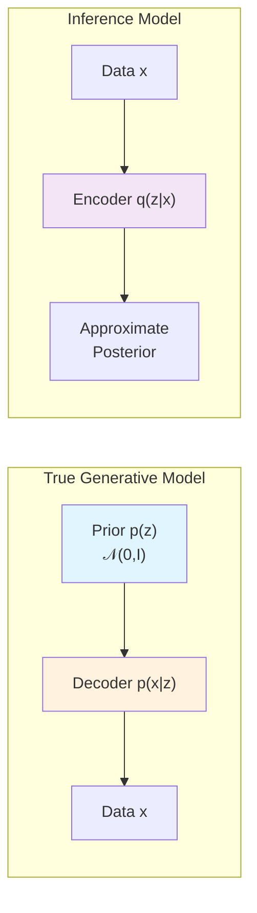
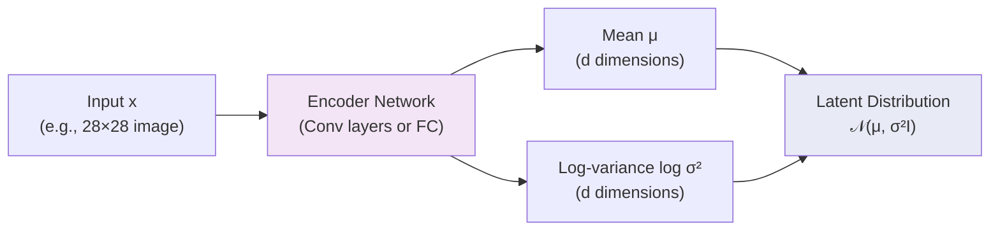
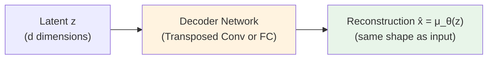
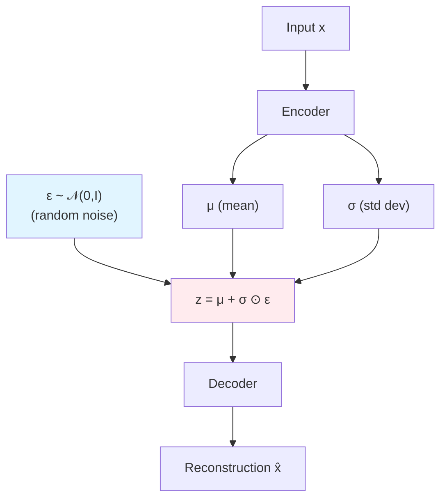
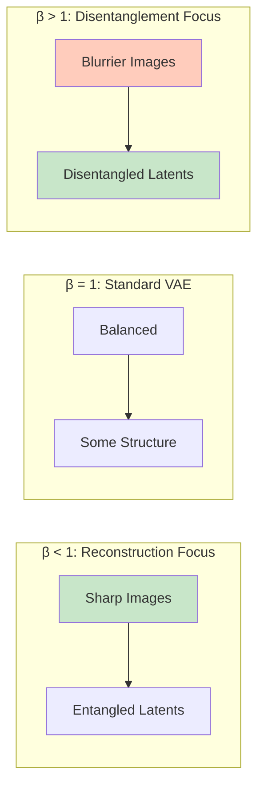
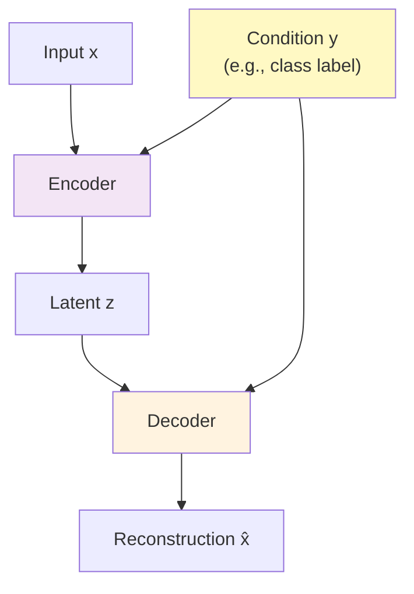
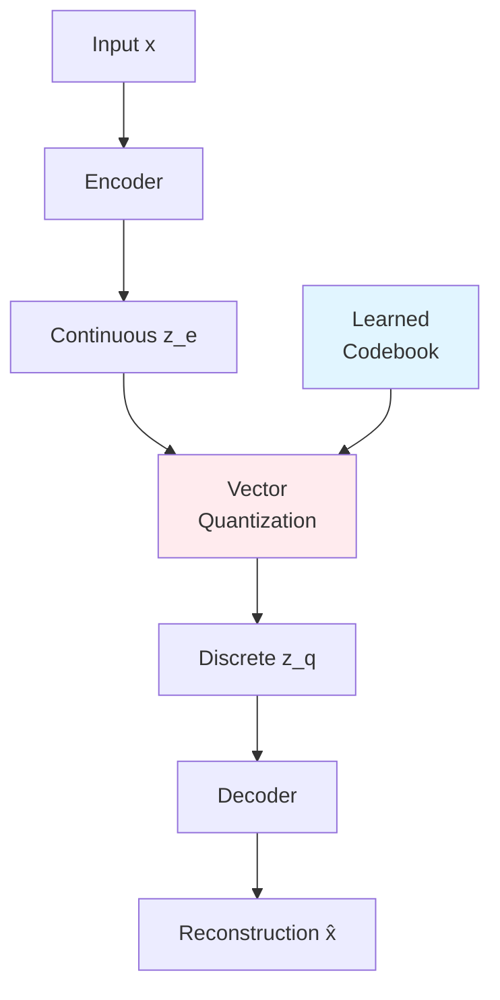
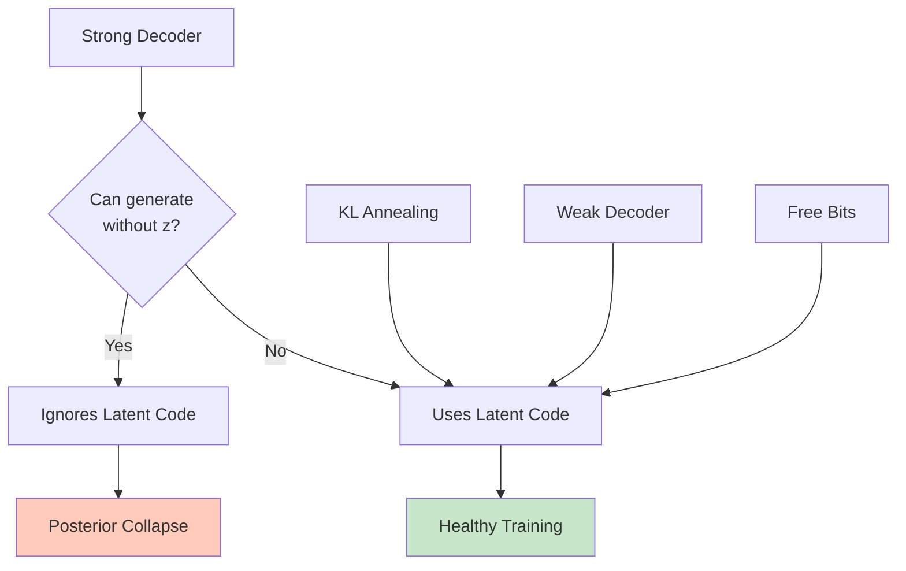
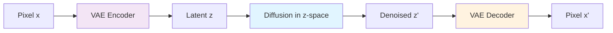
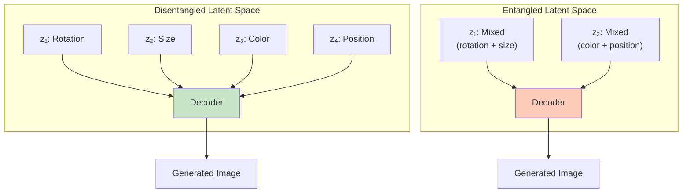

# Variational Autoencoders (VAEs) Explained

<div class="grid cards" markdown>

- :material-brain:{ .lg .middle } **Probabilistic Framework**

    ---

    Learn distributions over latent codes rather than deterministic encodings

- :material-vector-line:{ .lg .middle } **Structured Latent Space**

    ---

    Continuous, smooth latent space enabling interpolation and controlled generation

- :material-chart-bell-curve:{ .lg .middle } **Principled Generation**

    ---

    Sample from learned prior distribution to generate new, realistic data

- :material-function-variant:{ .lg .middle } **Differentiable Training**

    ---

    End-to-end optimization using the reparameterization trick

</div>

---

!!! tip "New here?"
    For a one-page map of how VAEs fit next to GANs, Diffusion, Flows, EBMs, and Autoregressive models, start with [**Generative Models — A Unified View**](generative-models-unified.md). This page is the deep-dive on VAEs specifically.

## Overview

Variational Autoencoders (VAEs), introduced concurrently by [Kingma & Welling (2014)](https://arxiv.org/abs/1312.6114) and [Rezende, Mohamed & Wierstra (2014)](https://arxiv.org/abs/1401.4082), are a class of **deep generative models** that combine neural networks with variational inference to learn probabilistic representations of data. Unlike standard autoencoders that learn deterministic mappings, VAEs learn **probability distributions** over latent representations, enabling principled data generation and interpretable latent spaces. For a modern, authoritative tutorial see [Kingma & Welling (2019)](https://arxiv.org/abs/1906.02691).

**What makes VAEs special?**

VAEs solve a fundamental challenge in generative modeling: how to learn a structured, continuous latent space that can be sampled to generate new, realistic data. By imposing a probabilistic structure through variational inference, VAEs create smooth latent spaces where:

- **Interpolation works naturally** - moving between two points in latent space produces meaningful intermediate outputs
- **Random sampling generates valid data** - sampling from the prior produces realistic new samples
- **The representation is interpretable** - the latent space has structure that can be understood and controlled

### The Intuition: Compression and Blueprints

Think of VAEs like an architect creating blueprints:

1. **The Encoder** compresses a complex house (your data) into essential instructions (latent vector), capturing key features—number of rooms, architectural style, materials—while discarding minor details like exact nail positions.

2. **The Latent Space** is a structured blueprint repository where similar designs cluster together: ranch houses near each other, Victorian mansions in another region, modern apartments elsewhere.

3. **The Decoder** rebuilds houses from blueprints, reconstructing recognizable structures though minor details differ from the original.

The critical distinction: VAEs encode to **probability distributions**, not single points. Each house maps to a probability cloud of similar blueprints, ensuring the latent space remains smooth and continuous. This enables generation—sample a random blueprint from the structured space, and the decoder builds a valid house, even one never seen before.

---

## Mathematical Foundation

### The Generative Story

VAEs model the data generation process as a two-step procedure:

1. **Sample latent code**: $z \sim p(z)$ from a simple prior distribution (typically standard normal)
2. **Generate data**: $x \sim p_\theta(x|z)$ using a decoder network parameterized by $\theta$

The goal is to learn parameters $\theta$ (decoder) and $\phi$ (encoder) that maximize the likelihood of observed data $p_\theta(x)$.


```mermaid
graph LR
    subgraph "True Generative Model"
        A["Prior p(z)<br/>𝒩(0,I)"] --> B["Decoder p(x|z)"]
        B --> C["Data x"]
    end

    subgraph "Inference Model"
        C2["Data x"] --> D["Encoder q(z|x)"]
        D --> E["Approximate<br/>Posterior"]
    end

    style A fill:#e1f5ff
    style B fill:#fff3e0
    style D fill:#f3e5f5
```

### Variational Inference: Why We Need Approximation

Variational inference ([Jordan et al., 1999](https://link.springer.com/article/10.1023/A:1007665907178); see [Blei et al., 2017](https://arxiv.org/abs/1601.00670) for a modern review) replaces an intractable inference problem with a tractable optimisation problem.

The true posterior $p_\theta(z|x)$ tells us what latent code likely generated our data. However, computing it requires:

$$
p_\theta(z|x) = \frac{p_\theta(x|z)p(z)}{p_\theta(x)} = \frac{p_\theta(x|z)p(z)}{\int p_\theta(x|z')p(z') dz'}
$$

The integral in the denominator (the evidence $p_\theta(x)$) is **intractable** for high-dimensional $z$—we'd need to integrate over all possible latent codes. VAEs sidestep this by learning an approximate posterior $q_\phi(z|x)$ (the encoder) that's easy to compute.

---

## The ELBO: Evidence Lower BOund

The key insight of VAEs is to maximize a tractable lower bound on the log-likelihood called the **Evidence Lower BOund** (ELBO):

$$
\log p_\theta(x) \geq \mathbb{E}_{q_\phi(z|x)}[\log p_\theta(x|z)] - D_{\text{KL}}(q_\phi(z|x) \| p(z))
$$

This inequality states that the log-likelihood is always at least as large as the ELBO. The gap between them equals exactly $D_{\text{KL}}(q_\phi(z|x) \| p_\theta(z|x))$—when our approximate posterior perfectly matches the true posterior, there's no gap and we achieve the true likelihood.

### Derivation from First Principles

Starting with the log-likelihood and introducing our approximate posterior:

$$
\begin{align}
\log p_\theta(x) &= \log \int p_\theta(x, z) dz \\
&= \log \int p_\theta(x, z) \frac{q_\phi(z|x)}{q_\phi(z|x)} dz \\
&= \log \mathbb{E}_{q_\phi(z|x)} \left[\frac{p_\theta(x, z)}{q_\phi(z|x)}\right]
\end{align}
$$

Applying Jensen's inequality (since log is concave):

$$
\log \mathbb{E}[f(z)] \geq \mathbb{E}[\log f(z)]
$$

We get:

$$
\log p_\theta(x) \geq \mathbb{E}_{q_\phi(z|x)} \left[\log \frac{p_\theta(x, z)}{q_\phi(z|x)}\right]
$$

Expanding $p_\theta(x, z) = p_\theta(x|z)p(z)$:

$$
\begin{align}
\text{ELBO} &= \mathbb{E}_{q_\phi(z|x)}[\log p_\theta(x|z)] + \mathbb{E}_{q_\phi(z|x)}\left[\log \frac{p(z)}{q_\phi(z|x)}\right] \\
&= \mathbb{E}_{q_\phi(z|x)}[\log p_\theta(x|z)] - D_{\text{KL}}(q_\phi(z|x) \| p(z))
\end{align}
$$

### Two Interpretable Terms

The ELBO naturally decomposes into two competing objectives:

1. **Reconstruction Term**: $\mathbb{E}_{q_\phi(z|x)}[\log p_\theta(x|z)]$
   - Measures how well we can reconstruct the input from sampled latent codes
   - Encourages the model to preserve information
   - Higher is better (less negative)

2. **KL Divergence**: $D_{\text{KL}}(q_\phi(z|x) \| p(z))$
   - Measures how close our learned encoding is to the prior
   - Regularizes the latent space to be smooth and structured
   - Prevents "cheating" by spreading encodings arbitrarily far apart
   - Lower is better (closer to prior)

**The fundamental trade-off**:
The reconstruction term wants to encode all information to perfectly reconstruct. The KL term wants to compress encodings to match the simple prior. Training finds the optimal balance, creating a structured latent space that retains essential information while remaining smooth for generation.

---

## Architecture Components

### Encoder: Variational Posterior $q_\phi(z|x)$

The encoder is a neural network that maps inputs to **parameters of a probability distribution** over latent codes:

$$
q_\phi(z|x) = \mathcal{N}(z; \mu_\phi(x), \sigma^2_\phi(x) \mathbf{I})
$$

For a diagonal Gaussian (most common choice), the encoder outputs:

- **Mean** $\mu_\phi(x) \in \mathbb{R}^d$ - the center of the latent distribution
- **Log-variance** $\log \sigma^2_\phi(x) \in \mathbb{R}^d$ - the spread/uncertainty


```mermaid
graph LR
    A["Input x<br/>(e.g., 28×28 image)"] --> B["Encoder Network<br/>(Conv layers or FC)"]
    B --> C["Mean μ<br/>(d dimensions)"]
    B --> D["Log-variance log σ²<br/>(d dimensions)"]
    C --> E["Latent Distribution<br/>𝒩(μ, σ²I)"]
    D --> E

    style B fill:#f3e5f5
    style E fill:#e8eaf6
```

**Why output log-variance?** Numerical stability. Variance must be positive, and learning $\log \sigma^2$ allows the network to output any real number while ensuring $\sigma^2 = \exp(\log \sigma^2) > 0$.

**Why diagonal covariance?** Full covariance matrices require $O(d^2)$ parameters and are harder to optimize. Diagonal covariance assumes independence between dimensions, requiring only $O(d)$ parameters while working well in practice.

### Decoder: Likelihood $p_\theta(x|z)$

The decoder is a neural network that maps latent codes back to data space:

$$
p_\theta(x|z) = \mathcal{N}(x; \mu_\theta(z), \sigma^2 \mathbf{I}) \quad \text{or} \quad \text{Bernoulli}(x; f_\theta(z))
$$

The choice of output distribution depends on your data:

- **Gaussian (continuous)**: For real-valued images (often simplified to MSE loss with fixed variance)
- **Bernoulli (binary)**: For binary images or features (use sigmoid + BCE loss)
- **Categorical**: For discrete data (use softmax + cross-entropy)


```mermaid
graph LR
    A["Latent z<br/>(d dimensions)"] --> B["Decoder Network<br/>(Transposed Conv or FC)"]
    B --> C["Reconstruction x̂ = μ_θ(z)<br/>(same shape as input)"]

    style B fill:#fff3e0
    style C fill:#e8f5e9
```

---

## The Reparameterization Trick

### The Problem: Backpropagation Through Sampling

We need to compute gradients of $\mathbb{E}_{q_\phi(z|x)}[f(z)]$ with respect to $\phi$. Naively sampling $z \sim q_\phi(z|x)$ and computing $\nabla_\phi f(z)$ doesn't work because **the sampling operation itself depends on $\phi$ but isn't differentiable**.

### The Solution: Separate Randomness from Parameters

Instead of sampling $z$ directly from $q_\phi(z|x) = \mathcal{N}(\mu_\phi(x), \sigma^2_\phi(x))$, reparameterize as:

$$
z = \mu_\phi(x) + \sigma_\phi(x) \odot \epsilon, \quad \epsilon \sim \mathcal{N}(0, \mathbf{I})
$$

where $\odot$ denotes element-wise multiplication.


```mermaid
graph TD
    A["Input x"] --> B["Encoder"]
    B --> C["μ (mean)"]
    B --> D["σ (std dev)"]
    E["ε ~ 𝒩(0,I)<br/>(random noise)"] --> F["z = μ + σ ⊙ ε"]
    C --> F
    D --> F
    F --> G["Decoder"]
    G --> H["Reconstruction x̂"]

    style F fill:#ffebee
    style E fill:#e1f5ff
```

**Why this works:**

1. The randomness ($\epsilon$) is now **independent** of our parameters $\phi$
2. Gradients flow through the deterministic operations $\mu_\phi$ and $\sigma_\phi$
3. The expectation becomes $\mathbb{E}_{p(\epsilon)}[f(g_\phi(\epsilon, x))]$ where $g_\phi$ is deterministic
4. We can approximate this expectation with Monte Carlo sampling: sample $\epsilon$, compute gradients, average

This idea — proposed simultaneously by [Kingma & Welling, 2014](https://arxiv.org/abs/1312.6114) and [Rezende et al., 2014](https://arxiv.org/abs/1401.4082) — enabled practical VAE training and has since become fundamental to probabilistic deep learning.

---

## Loss Function and Training

The VAE loss is derived directly from the negative ELBO:

$$
\mathcal{L}(\theta, \phi; x) = -\mathbb{E}_{q_\phi(z|x)}[\log p_\theta(x|z)] + D_{\text{KL}}(q_\phi(z|x) \| p(z))
$$

### Practical Implementation

For Gaussian encoder $q_\phi(z|x) = \mathcal{N}(\mu, \sigma^2\mathbf{I})$ and standard normal prior $p(z) = \mathcal{N}(0, \mathbf{I})$:

**Reconstruction Loss** (assuming Gaussian decoder with fixed variance):

$$
\mathcal{L}_{\text{recon}} = \frac{1}{N}\sum_{i=1}^{N} \|x_i - \hat{x}_i\|^2 = \text{MSE}(x, \hat{x})
$$

**KL Divergence** (closed-form for Gaussians; see [Kingma & Welling, 2014](https://arxiv.org/abs/1312.6114), Appendix B):

$$
\mathcal{L}_{\text{KL}} = -\frac{1}{2} \sum_{j=1}^{d} (1 + \log \sigma_j^2 - \mu_j^2 - \sigma_j^2)
$$

**Total Loss**:

$$
\mathcal{L}_{\text{total}} = \mathcal{L}_{\text{recon}} + \mathcal{L}_{\text{KL}}
$$

### Training Algorithm

```python
import jax
import jax.numpy as jnp
from flax import nnx
import optax

# Create optimizer (wrt=nnx.Param required in NNX 0.11.0+)
optimizer = nnx.Optimizer(vae, optax.adam(1e-3), wrt=nnx.Param)

for epoch in epochs:
    for batch in dataloader:
        def loss_fn(vae):
            # Forward pass
            mu, log_var = vae.encoder(batch)

            # Reparameterization trick
            epsilon = jax.random.normal(rng_key, mu.shape)
            z = mu + jnp.exp(0.5 * log_var) * epsilon

            # Decode
            x_recon = vae.decoder(z)

            # ELBO terms — use a *consistent reduction*: sum over non-batch
            # axes (pixels for recon, latent dims for KL), then mean over the
            # batch axis. Mixing jnp.mean for recon with jnp.sum for KL is the
            # single most common bug in VAE code: it leaves the two terms on
            # wildly different scales and the KL silently dominates.
            recon_loss = jnp.mean(
                jnp.sum((x_recon - batch) ** 2, axis=tuple(range(1, batch.ndim)))
            )
            kl_per_sample = -0.5 * jnp.sum(
                1 + log_var - mu ** 2 - jnp.exp(log_var), axis=-1
            )
            kl_loss = jnp.mean(kl_per_sample)

            return recon_loss + kl_loss

        # Gradient update (NNX 0.11.0+ API)
        loss, grads = nnx.value_and_grad(loss_fn)(vae)
        optimizer.update(vae, grads)
```

### Key Training Metrics to Monitor

1. **Reconstruction loss**: Should decrease steadily (lower = better reconstruction)
2. **KL divergence**: Should stabilize at a positive value (5-20 is typical for well-trained models)
3. **ELBO**: Combination of both, the primary metric
4. **Per-dimension KL**: Helps detect posterior collapse (all values near 0 indicates problem)

---

## VAE Variants

### β-VAE: Disentangled Representations

β-VAE ([Higgins et al., 2017](https://openreview.net/forum?id=Sy2fzU9gl)) modifies the objective to encourage **disentanglement**, where individual latent dimensions capture independent factors of variation:

$$
\mathcal{L}_{\beta} = \mathbb{E}_{q_\phi(z|x)}[\log p_\theta(x|z)] - \beta \cdot D_{\text{KL}}(q_\phi(z|x) \| p(z))
$$

**Effect of β:**

- **β = 1**: Standard VAE (no additional emphasis on disentanglement)
- **β > 1**: Stronger regularization → encourages independent latent dimensions, improves disentanglement, but reduces reconstruction quality
- **β < 1**: Weaker regularization → better reconstruction, less structured latent space


```mermaid
graph LR
    subgraph "β < 1: Reconstruction Focus"
        A1[Sharp Images] --> B1[Entangled Latents]
    end

    subgraph "β = 1: Standard VAE"
        A2[Balanced] --> B2[Some Structure]
    end

    subgraph "β > 1: Disentanglement Focus"
        A3[Blurrier Images] --> B3[Disentangled Latents]
    end

    style A1 fill:#c8e6c9
    style A3 fill:#ffccbc
    style B3 fill:#c8e6c9
```

**Practical β values**: Start with β=1, try β=4-10 for image disentanglement tasks (dSprites, CelebA), use β=0.1-0.5 for text (to avoid posterior collapse). [Burgess et al. (2018)](https://arxiv.org/abs/1804.03599) further analyse β-VAE through an information-theoretic capacity-control lens and propose **annealing the KL capacity** $C$ rather than $β$ itself.

**Applications:**

- **Interpretable representations** for analysis and visualization
- **Fair AI** by removing sensitive attributes from representations
- **Controllable generation** by manipulating specific latent factors

### β-TCVAE and FactorVAE: Targeting Total Correlation

β-VAE penalises the *full* KL term, which conflates two effects: pushing each posterior toward the prior, and pushing the *aggregated* posterior $q_\phi(z)=\mathbb{E}_{p_d(x)}q_\phi(z\mid x)$ toward a factorized distribution. Only the second effect actually drives disentanglement. Two variants isolate it:

- **FactorVAE** ([Kim & Mnih, 2018](https://arxiv.org/abs/1802.05983)) trains a discriminator to estimate the total correlation $\mathrm{TC}(z) = D_{\mathrm{KL}}(q_\phi(z)\,\|\,\prod_j q_\phi(z_j))$ and adds a $\gamma\cdot\mathrm{TC}$ penalty on top of the standard ELBO.
- **β-TCVAE** ([Chen et al., 2018](https://arxiv.org/abs/1802.04942)) decomposes the KL term in closed form into mutual information, total correlation, and dimension-wise KL, and re-weights only the TC component:

$$
D_{\mathrm{KL}}(q_\phi(z\mid x)\|p(z)) = \underbrace{I_q(x;z)}_{\text{MI}} + \underbrace{D_{\mathrm{KL}}(q_\phi(z)\|\textstyle\prod_j q_\phi(z_j))}_{\text{TC}} + \underbrace{\sum_j D_{\mathrm{KL}}(q_\phi(z_j)\|p(z_j))}_{\text{dim-wise KL}}
$$

β-TCVAE matches β-VAE's disentanglement gains without sacrificing reconstruction, and the same paper introduces the **Mutual Information Gap (MIG)** disentanglement metric.

### Conditional VAE (CVAE)

Conditional VAEs ([Sohn et al., 2015](https://papers.nips.cc/paper/2015/hash/8d55a249e6baa5c06772297520da2051-Abstract.html)) incorporate additional information $y$ (class labels, attributes, text descriptions) to enable controlled generation:

$$
\begin{align}
q_\phi(z|x, y) &= \mathcal{N}(z; \mu_\phi(x, y), \sigma^2_\phi(x, y) \mathbf{I}) \\
p_\theta(x|z, y) &= \mathcal{N}(x; \mu_\theta(z, y), \sigma^2 \mathbf{I})
\end{align}
$$


```mermaid
graph TD
    A["Input x"] --> E["Encoder"]
    B["Condition y<br/>(e.g., class label)"] --> E
    E --> C["Latent z"]
    C --> D["Decoder"]
    B --> D
    D --> F["Reconstruction x̂"]

    style B fill:#fff9c4
    style E fill:#f3e5f5
    style D fill:#fff3e0
```

**How conditioning works:**

- **Concatenation**: Append $y$ to the input before encoding and to $z$ before decoding — simple but less expressive than feature-wise modulation.
- **Conditional Batch Normalization** ([De Vries et al., 2017](https://arxiv.org/abs/1707.00683); [Dumoulin et al., 2017](https://arxiv.org/abs/1610.07629)): Replace BN's affine parameters with $y$-dependent values.
- **FiLM (Feature-wise Linear Modulation)** ([Perez et al., 2018](https://arxiv.org/abs/1709.07871)): Scale and shift each feature channel by $y$-dependent $(\gamma, \beta)$. Used pervasively in modern conditional generators.
- **Cross-attention**: For sequence/text conditions, attend from feature maps onto an encoded $y$ — the technique that powers Stable Diffusion's text-to-image conditioning.

**Applications:**

- **Class-conditional generation**: Generate specific digit classes in MNIST or specific ImageNet classes ([Mirza & Osindero, 2014](https://arxiv.org/abs/1411.1784)).
- **Attribute manipulation**: Change hair color, age, expression in face images.
- **Text-to-image**: Generate images matching text descriptions, as in **DALL·E 1** ([Ramesh et al., 2021](https://arxiv.org/abs/2102.12092)) and the broader latent-diffusion family.

### Vector Quantized VAE (VQ-VAE)

VQ-VAE ([van den Oord et al., 2017](https://arxiv.org/abs/1711.00937)) replaces continuous latent representations with **discrete codes** from a learned codebook:

$$
z_q = \arg\min_{e_k \in \mathcal{C}} \|z_e - e_k\|^2
$$

where $\mathcal{C} = \{e_1, ..., e_K\}$ is a learned codebook of $K$ embedding vectors.


```mermaid
graph TD
    A["Input x"] --> B["Encoder"]
    B --> C["Continuous z_e"]
    C --> D["Vector<br/>Quantization"]
    E["Learned<br/>Codebook"] --> D
    D --> F["Discrete z_q"]
    F --> G["Decoder"]
    G --> H["Reconstruction x̂"]

    style D fill:#ffebee
    style E fill:#e1f5ff
```

**VQ-VAE Loss Function:**

$$
\mathcal{L} = \|x - \hat{x}\|^2 + \|sg[z_e] - z_q\|^2 + \beta \|z_e - sg[z_q]\|^2
$$

where $sg[\cdot]$ is the stop-gradient operator. The three terms are:

1. **Reconstruction loss** — standard pixel-wise error.
2. **Codebook loss** — pulls each codebook entry $e_k$ toward the encoder outputs that selected it (gradient flows only into the codebook). The original paper uses this gradient-based update; many follow-ups — VQ-VAE-2 ([Razavi et al., 2019](https://arxiv.org/abs/1906.00446)), VQGAN ([Esser et al., 2021](https://arxiv.org/abs/2012.09841)) — replace it with an **exponential-moving-average** update for better stability.
3. **Commitment loss** — pulls the encoder output toward its assigned codebook entry, with weight $\beta$ (typically 0.25); without it the encoder output can drift arbitrarily.

**Key advantages:**

- ✅ **No continuous posterior collapse** — discrete codes cannot collapse to a degenerate Gaussian, but they have their own failure mode (*codebook collapse*: only a few entries get used). Tricks like EMA updates, codebook reset of dead entries, $\ell_2$-normalised codes ([Yu et al., 2022 — ViT-VQGAN](https://arxiv.org/abs/2110.04627)), and finite scalar quantisation ([Mentzer et al., 2024 — FSQ](https://arxiv.org/abs/2309.15505)) materially reduce it.
- ✅ **Sharp reconstructions** — the discreteness side-steps the Gaussian-decoder blur.
- ✅ **Foundation for two-stage generation** — pair the VQ-VAE with a powerful autoregressive or diffusion prior over the discrete codes (DALL·E 1, Parti, MaskGIT, MAGVIT-v2).

**Applications:**

- **DALL·E 1** ([Ramesh et al., 2021](https://arxiv.org/abs/2102.12092)) — text-to-image with a transformer over VQ-VAE codes. (DALL·E 2 / 3 use diffusion instead, not VQ-VAE.)
- **Jukebox** ([Dhariwal et al., 2020](https://arxiv.org/abs/2005.00341)) — hierarchical VQ-VAE for raw-audio music generation.
- **VQ-GAN** ([Esser et al., 2021](https://arxiv.org/abs/2012.09841)) — adds adversarial + perceptual losses to VQ-VAE; the autoencoder template that became Stable Diffusion's tokenizer.
- **Speech / audio tokenizers** — SoundStream, EnCodec, and the residual VQ family use the same recipe for neural codecs.

---

## Training Dynamics and Common Challenges

### Posterior Collapse

**What is it?**

The encoder learns to ignore the input, producing latent codes that are essentially identical to the prior $q_\phi(z|x) \approx p(z)$. The decoder learns to generate data without using latent information, defeating the purpose of the model.

**How to detect:**

- KL divergence ≈ 0 across all dimensions
- Random samples from prior produce diverse outputs, but encoding-decoding produces generic/blurry results
- Reconstructions don't match inputs well despite low reconstruction loss

**Why does it happen?**

Powerful autoregressive decoders (especially in text VAEs) can model $p(x)$ without needing latent information. The KL term drives encodings toward the prior, and if the decoder doesn't need $z$, the KL term wins.


```mermaid
graph TD
    A[Strong Decoder] --> B{Can generate<br/>without z?}
    B -->|Yes| C[Ignores Latent Code]
    B -->|No| D[Uses Latent Code]
    C --> E[Posterior Collapse]
    D --> F[Healthy Training]

    G[KL Annealing] --> D
    H[Weak Decoder] --> D
    I[Free Bits] --> D

    style E fill:#ffccbc
    style F fill:#c8e6c9
```

**Solutions ranked by effectiveness:**

1. **KL Annealing** (CRITICAL for text): Start with β=0 and ramp up so the encoder produces useful codes before the KL penalty starts pushing them toward the prior.
   - **Linear** ([Bowman et al., 2015](https://arxiv.org/abs/1511.06349)): `β = min(1.0, step / warmup_steps)`. The original VAE-text recipe; warmup of 10–40 % of training is typical.
   - **Cyclical** ([Fu et al., 2019](https://arxiv.org/abs/1903.10145)): repeat the 0→1 ramp $M$ times. Each cycle warm-restarts from the previous solution and consistently improves NLP benchmarks vs. a single linear schedule.
   - **Sigmoid / monotonic** schedules are also common; the choice matters less than ensuring β stays below 1 long enough to learn informative codes.

2. **Free Bits** ([Kingma et al., 2016](https://arxiv.org/abs/1606.04934)): only penalise KL above a per-group threshold $\lambda$ (typically 0.5–2.0 nats). This guarantees each latent dimension carries at least λ nats of information about $x$:

    $$\widetilde{\mathcal{L}}_{\mathrm{KL}} = \sum_g \max\!\big(\lambda,\ D_{\mathrm{KL}}(q_\phi(z_g\mid x)\|p(z_g))\big)$$

3. **δ-VAE** ([Razavi et al., 2019](https://arxiv.org/abs/1901.03416)): replace the standard normal prior with a constrained family (e.g., AR-1 latent dynamics) that has a strict lower bound on KL, eliminating the collapsed solution from the optimisation landscape entirely.

4. **β-VAE with β < 1**: Reduce KL penalty (β=0.1-0.5 for text). Simple but blurs the structured-latent guarantees of β=1.

5. **Word Dropout** (for text): Randomly replace 25-50% of input words with `<UNK>` so the decoder cannot rely on autoregressive shortcuts.

6. **Weakening the Decoder**: Use a less expressive decoder (smaller LSTM, dilated CNN over autoregressive transformer) so it cannot ignore $z$.

### Blurry Reconstructions

**Why it happens:**

MSE loss encourages the decoder to output $\mathbb{E}[x|z]$, the average of all plausible outputs. Averaging sharp images produces blur—this is a fundamental consequence of the Gaussian likelihood assumption, not a bug.

**Solutions:**

1. **Perceptual Loss** ([LPIPS — Zhang et al., 2018](https://arxiv.org/abs/1801.03924)): Replace pixel-wise MSE with VGG/AlexNet feature matching.
   - Significantly improves sharpness while maintaining structure.
   - Used in **DFC-VAE** ([Hou et al., 2017](https://arxiv.org/abs/1610.00291)) and inside the SD-VAE training recipe.

2. **Adversarial Training**: Add a discriminator to penalise unrealistic outputs.
   - **VAE-GAN** ([Larsen et al., 2016](https://arxiv.org/abs/1512.09300)) is the canonical recipe.
   - The Stable Diffusion VAE adds a **PatchGAN** ([Isola et al., 2017](https://arxiv.org/abs/1611.07004)) discriminator on top of LPIPS + L1.
   - Combines reconstruction, KL, and adversarial losses.

3. **Multi-scale SSIM** ([Wang et al., 2003](https://www.cns.nyu.edu/pub/eero/wang03b.pdf)): Structural-similarity loss across multiple resolutions, better correlated with perceptual quality than MSE.

4. **VQ-VAE / VQGAN** ([van den Oord et al., 2017](https://arxiv.org/abs/1711.00937); [Esser et al., 2021](https://arxiv.org/abs/2012.09841)): Discrete latents and adversarial training together produce sharper outputs.

5. **Learned Variance**: Let the decoder predict per-pixel variance $\sigma^2_\theta(z)$ instead of using a fixed σ² — recovers a proper Gaussian likelihood and lets the model express its own uncertainty.

### Optimization Challenges

**NaN losses:**

- Check activation functions: ensure Sigmoid on decoder output for [0,1] images
- Add gradient clipping: `grads = jax.tree.map(lambda g: jnp.clip(g, -1.0, 1.0), grads)`
- Use Softplus for log_var: `log_var = nnx.softplus(log_var_raw) + 1e-6`
- Reduce learning rate if gradients explode

**Loss not decreasing:**

- Verify loss signs: minimize negative ELBO
- Check data normalization: should be [0,1] or [-1,1]
- Ensure encoder-decoder dimension matching
- Monitor gradient norms: should be in range [0.1, 10]

**Imbalanced loss terms:**

- Reconstruction loss sums over many pixels; KL sums over few latent dimensions
- Solution: normalize by dimension count or manually weight with β

---

## Advanced Topics

### Hierarchical VAEs

Stack multiple layers of latent variables for richer, more structured representations:

$$
p(x, z_1, \dots, z_L) = p(z_L) \prod_{\ell=1}^{L-1} p(z_\ell \mid z_{\ell+1}) \cdot p(x \mid z_{1:L})
$$

The encoder is typically *bidirectional* — top-down conditional priors are combined with bottom-up posterior corrections, as in **Ladder VAE** ([Sønderby et al., 2016](https://arxiv.org/abs/1602.02282)) and **IAF-VAE** ([Kingma et al., 2016](https://arxiv.org/abs/1606.04934)).

**Benefits:**

- Coarse features (object class) at top levels
- Fine details (texture, color) at lower levels
- Better for complex, high-resolution data

**State-of-the-art deep hierarchies:**

- **NVAE** ([Vahdat & Kautz, 2020](https://arxiv.org/abs/2007.03898)) — 36 hierarchical groups, depthwise-separable convolutions, spectral regularisation; the first VAE to model 256×256 natural images.
- **Very Deep VAE / VDVAE** ([Child, 2021](https://arxiv.org/abs/2011.10650)) — pushes hierarchical depth to 70+ stochastic layers, beats PixelCNN log-likelihoods on CIFAR-10, ImageNet-32/64 and FFHQ-256 with far fewer parameters and orders-of-magnitude faster sampling.
- **HQ-VAE** ([Takida et al., 2024](https://openreview.net/forum?id=xqAVkqrLjx)) — generalises hierarchical discrete latent codebooks (the VQ side of the family) under a single variational Bayes objective, mitigating the codebook-collapse failure mode of stacked VQ-VAE.

### Importance Weighted VAE (IWAE)

[Burda et al. (2016)](https://arxiv.org/abs/1509.00519) use multiple samples to get **tighter bounds** on the log-likelihood:

$$
\mathcal{L}_{\text{IWAE}} = \mathbb{E}_{z_{1:K} \sim q} \left[ \log \frac{1}{K} \sum_{k=1}^K \frac{p(x, z_k)}{q(z_k|x)} \right]
$$

With $K$ samples, IWAE provides a strictly tighter bound than standard VAE (K=1). Typical values: K=5-50.

### Normalizing Flow VAE

[Rezende & Mohamed (2015)](https://arxiv.org/abs/1505.05770) replace the Gaussian posterior with flexible distributions via invertible transformations:

$$
q_\phi(z|x) = q_0(z_0|x) \left|\det \frac{\partial f}{\partial z_0}\right|^{-1}
$$

where $f$ is an invertible function. Common flow families: **Real NVP** ([Dinh et al., 2017](https://arxiv.org/abs/1605.08803)), **MAF** ([Papamakarios et al., 2017](https://arxiv.org/abs/1705.07057)), **IAF** ([Kingma et al., 2016](https://arxiv.org/abs/1606.04934)) — well-suited as a *posterior* because sampling is fast — and **Glow** ([Kingma & Dhariwal, 2018](https://arxiv.org/abs/1807.03039)).

**Benefits:**

- Arbitrarily complex posterior distributions
- Better approximation of true posterior, tightening the ELBO
- Improved generation quality

**Trade-off:** Increased compute during training; some flows (MAF) are slow to sample, others (IAF) are slow to evaluate density.

### VampPrior and Learned Priors

The standard $\mathcal{N}(0, I)$ prior is mismatched with the aggregated posterior — most regions of the prior have low decoder mass, hurting unconditional samples. **VampPrior** ([Tomczak & Welling, 2017](https://arxiv.org/abs/1705.07120)) replaces $p(z)$ with a mixture
$p_\lambda(z) = \tfrac{1}{K}\sum_{k} q_\phi(z\mid u_k)$
parameterised by $K$ learned *pseudo-inputs* $u_k$, sharply tightening the ELBO and improving sample quality at modest cost. Diffusion priors ([Wehenkel & Louppe, 2021](https://arxiv.org/abs/2106.15671); [Vahdat et al., 2021 — LSGM](https://arxiv.org/abs/2106.05931)) generalise this further by training a diffusion model in the latent space.

---

## VAEs Inside Modern Generative Pipelines

In 2026, the most economically important use of VAEs is no longer end-to-end generation — it is **perceptual compression for diffusion, flow, and autoregressive generators**. Stable Diffusion ([Rombach et al., 2022](https://arxiv.org/abs/2112.10752)), SDXL ([Podell et al., 2024](https://arxiv.org/abs/2307.01952)), SD3, FLUX.1, Wan, Cosmos ([NVIDIA, 2025](https://arxiv.org/abs/2501.03575)), and many open video stacks share the same broad recipe: an autoencoder / VAE-like codec compresses pixels into a low-dimensional latent, and a diffusion, flow-matching, or autoregressive prior is trained *in that latent space*. Sora's public report confirms compressed spacetime patch latents but does not specify a public VAE architecture.

### Latent Diffusion Models (LDMs)


```mermaid
graph LR
    A[Pixel x] --> B[VAE Encoder]
    B --> C[Latent z]
    C --> D[Diffusion in z-space]
    D --> E[Denoised z']
    E --> F[VAE Decoder]
    F --> G[Pixel x']

    style B fill:#f3e5f5
    style F fill:#fff3e0
    style D fill:#e1f5ff
```

The VAE here is typically a **KL-regularised autoencoder** (the "KL-f8" SD-VAE: 8× spatial downsampling, 4 channels, mild KL term) trained with the recipe introduced by [Rombach et al. (2022)](https://arxiv.org/abs/2112.10752): an L1 reconstruction term, an LPIPS perceptual loss, and a PatchGAN adversarial loss — the loss design is inherited from VQGAN ([Esser et al., 2021](https://arxiv.org/abs/2012.09841)) but the discrete codebook is replaced by a continuous Gaussian latent with a small KL penalty (≈10⁻⁶). The KL term keeps the latent close to a unit-Gaussian *prior shape*; what changes versus a classical VAE is that the *generative* prior is now learned — a diffusion / flow model in $z$ — rather than fixed standard-normal. Newer image codecs often use wider latent channel counts than the original SD-VAE, and open video systems extend the idea to 3-D causal-convolutional video autoencoders.

### Recent Tokenizer-VAE Advances (2024–2026)

| Model | Year | Contribution |
|---|---|---|
| **LiteVAE** ([Sadat et al., 2024](https://arxiv.org/abs/2405.14477)) | 2024 | 2-D discrete wavelet transform inside the encoder; ~6× fewer parameters than SD-VAE at matching rFID. |
| **CV-VAE** ([Zhao et al., 2024](https://arxiv.org/abs/2405.20279)) | 2024 | Video VAE whose latent is *latent-compatible* with a frozen image VAE — train video diffusion on top of an image-pretrained UNet without re-tuning. |
| **WF-VAE** ([Li et al., 2024](https://arxiv.org/abs/2411.17459)) | 2024 | Multi-level wavelet flow that routes low-frequency energy directly into the latent; 2× throughput, 4× lower memory than prior video VAEs. |
| **IV-VAE** ([Wu et al., 2024](https://arxiv.org/abs/2411.06449)) | 2024 | Keyframe temporal compression + group-causal 3-D convolutions for higher-compression video latents. |
| **EQ-VAE** ([Kouzelis et al., 2025](https://arxiv.org/abs/2502.09509)) | 2025 | Equivariance regularisation on the latent under semantic-preserving transforms (scale, rotation); 7× faster DiT-XL training when used as a fine-tune of SD-VAE. |
| **MAETok** ([Chen et al., 2025](https://arxiv.org/abs/2502.03444)) | 2025 | Drops the variational constraint entirely and trains the tokenizer as a Masked Autoencoder; argues that *latent structure*, not the KL term, is what diffusion priors actually need. |
| **DiTo** ([Chen et al., 2025](https://yinboc.github.io/dito/)) | 2025 | Diffusion *autoencoders* (encoder → quantised latent → diffusion decoder) that scale as image tokenizers. |
| **VTP** ([arXiv:2512.13687, 2025](https://arxiv.org/abs/2512.13687)) | 2025 | Decoupled pre-training of visual tokenizers from the diffusion prior; 1.11 gFID on ImageNet 256². |
| **PH-VAE** ([arXiv:2603.01800, 2026](https://arxiv.org/abs/2603.01800)) | 2026 | Phase-Type decoders (continuous-time Markov absorption times) model heavy-tailed data substantially better than Gaussian / Student-t / GEV decoders. |
| **VFM-as-Tokenizer** ([arXiv:2510.18457, 2025](https://arxiv.org/abs/2510.18457)) | 2025 | Use a frozen Vision Foundation Model (DINOv2, SigLIP) directly as the encoder — the discriminative latent geometry transfers cleanly to diffusion priors. |
| **Latent Diffusion *without* a VAE** ([arXiv:2510.15301, 2025/26](https://arxiv.org/abs/2510.15301)) | 2025/26 | Argues that VAE-induced latents are bottlenecks for diffusion training; explores VAE-free LDMs operating on patch tokens or VFM features. |

The throughline of this generation: **the VAE used to be the generator; now it's the codec.** Reconstruction fidelity (rFID, PSNR, LPIPS) and the *geometry* of the latent (smoothness, equivariance, semantic separability) matter much more than the absolute ELBO.

### Diffusion–VAE Hybrids

Beyond the LDM "VAE-then-diffusion" pipeline, several hybrids tie the two more tightly:

- **DiffuseVAE** ([Pandey et al., 2022](https://arxiv.org/abs/2201.00308)) uses a VAE to produce a coarse reconstruction, then diffuses the *residual* between that reconstruction and the data — fast like a VAE but sharp like a diffusion model.
- **LSGM** ([Vahdat et al., 2021](https://arxiv.org/abs/2106.05931)) trains a diffusion model as the prior of an NVAE, jointly maximising a single ELBO.
- **DVAE / Diffusion Decoders** ([Preechakul et al., 2022 — DiffAE](https://arxiv.org/abs/2111.15640)) replace the Gaussian decoder with a conditional diffusion model, recovering near-GAN sample fidelity while keeping a usable encoder.
- **Generalisation theory** ([Wang et al., 2025](https://arxiv.org/abs/2506.00849)) gives a unified information-theoretic analysis of when VAE encoders + diffusion generators generalise, formalising what the empirical LDM literature has been observing.

### Foundation-Model Tokenizers

A complementary 2025–2026 direction abandons the *trained* encoder altogether and uses a **frozen Vision Foundation Model** (DINOv2, SigLIP, MAE) as the encoder, training only a lightweight decoder ([arXiv:2510.18457, 2025](https://arxiv.org/abs/2510.18457); [arXiv:2509.25162, 2025](https://arxiv.org/abs/2509.25162)). This trades end-to-end optimality for a far better-conditioned latent geometry, and converges with the LiteVAE / EQ-VAE story: *the latent's structure, not the KL term, is what downstream priors actually consume.*

---

## Latent Space Properties and Interpretation

### Continuity and Interpolation

A well-trained VAE has a **continuous latent space** where:

- **Nearby points** decode to similar outputs
- **Linear interpolation** produces smooth transitions
- **The space is "covered"** - no holes where sampling produces garbage

**Testing interpolation:**

```python
# Encode two images
z1 = encoder(x1)[0]  # Take mean, ignore variance
z2 = encoder(x2)[0]

# Interpolate
alphas = jnp.linspace(0, 1, num=10)
z_interp = [(1-α)*z1 + α*z2 for α in alphas]

# Decode interpolated points
x_interp = [decoder(z) for z in z_interp]
```

### Disentanglement: Independent Factors of Variation

In a **disentangled representation**, each latent dimension captures a single, interpretable factor:

- $z_1$: Object class (digit identity)
- $z_2$: Rotation angle
- $z_3$: Stroke width
- $z_4$: Position
- ...


```mermaid
graph TD
    subgraph "Disentangled Latent Space"
        A["z₁: Rotation"] --> E["Decoder"]
        B["z₂: Size"] --> E
        C["z₃: Color"] --> E
        D["z₄: Position"] --> E
    end

    E --> F["Generated Image"]

    subgraph "Entangled Latent Space"
        G["z₁: Mixed<br/>(rotation + size)"] --> H["Decoder"]
        I["z₂: Mixed<br/>(color + position)"] --> H
    end

    H --> J["Generated Image"]

    style E fill:#c8e6c9
    style H fill:#ffccbc
```

**Achieving disentanglement:**

- Train with β-VAE (β > 1) for a quick lever; expect a recon-vs-disentanglement trade-off.
- Use [β-TCVAE or FactorVAE](#-tcvae-and-factorvae-targeting-total-correlation) when you want to reweight only the total-correlation component of the KL.
- Use structured datasets (dSprites, 3D Shapes, MPI3D) — disentanglement is essentially impossible to evaluate on natural images.
- Add supervision or weak supervision (paired examples, attribute labels): [Locatello et al., 2019](https://arxiv.org/abs/1811.12359) proves that *purely unsupervised* disentanglement is fundamentally identifiable only up to inductive biases.

**Measuring disentanglement:**

- **MIG (Mutual Information Gap)** — gap between the top-2 latents most informative about each ground-truth factor; introduced with [β-TCVAE](https://arxiv.org/abs/1802.04942).
- **SAP (Separated Attribute Predictability)** ([Kumar et al., 2018](https://arxiv.org/abs/1711.00848)) — gap between the top-2 latents that best predict each factor.
- **DCI (Disentanglement, Completeness, Informativeness)** ([Eastwood & Williams, 2018](https://openreview.net/forum?id=By-7dz-AZ)) — three-metric framework based on a probe regressor's importance matrix.
- **FactorVAE score** ([Kim & Mnih, 2018](https://arxiv.org/abs/1802.05983)) — accuracy of a majority-vote classifier predicting which factor is held fixed in a batch.

---

## Comparing VAEs with Other Generative Models

<div class="comparison-table" markdown>

| Aspect | VAE | GAN | Diffusion | Normalizing Flow |
|--------|-----|-----|-----------|------------------|
| **Likelihood** | Lower bound (ELBO) | Implicit | Tractable | Exact |
| **Training Stability** | Stable | Unstable | Stable | Stable |
| **Sample Quality** | Good (blurry) | Excellent (sharp) | Excellent | Good |
| **Sampling Speed** | Fast | Fast | Slow (50-1000 steps) | Fast |
| **Latent Space** | Structured, smooth | None (no encoder) | Gradual diffusion | Exact bijection |
| **Mode Coverage** | Excellent | Poor (mode collapse) | Excellent | Excellent |
| **Architecture Constraints** | Flexible | Flexible | Flexible | Invertible only |

</div>

### When to Use VAEs

**VAEs Excel When:**

- You need **structured latent representations** for downstream tasks
- **Training stability** is more important than peak image quality
- You want both **generation and reconstruction** capabilities
- **Interpretability** matters (anomaly detection, representation learning)
- You're working with **non-image data** (text, graphs, molecules)

**Example Applications:**

- Medical image anomaly detection via reconstruction error ([Zimmerer et al., 2019](https://arxiv.org/abs/1812.05941))
- Molecular design with controllable chemical properties ([Gómez-Bombarelli et al., 2018](https://pubs.acs.org/doi/10.1021/acscentsci.7b00572))
- Semi-supervised learning with limited labels ([Kingma et al., 2014 — M2 model](https://arxiv.org/abs/1406.5298))
- Data compression and denoising ([Ballé et al., 2018](https://arxiv.org/abs/1802.01436))
- Recommendation systems ([Liang et al., 2018 — Mult-VAE](https://arxiv.org/abs/1802.05814))

### When to Use GANs

**GANs Excel When:**

- **Image quality is paramount** (super-resolution, photorealistic faces)
- You don't need an encoder (generation-only tasks)
- You're willing to handle training instability
- Mode coverage isn't critical

**Limitations:**

- No structured latent space for interpolation/arithmetic
- Training instability (mode collapse, oscillation)
- No reconstruction capability

### When to Use Diffusion Models

**Diffusion Models Excel When:**

- You want **state-of-the-art quality** — e.g. DALL·E 2 ([Ramesh et al., 2022](https://arxiv.org/abs/2204.06125)), Imagen ([Saharia et al., 2022](https://arxiv.org/abs/2205.11487)), Stable Diffusion ([Rombach et al., 2022](https://arxiv.org/abs/2112.10752)).
- Computational cost is acceptable.
- You need excellent **mode coverage and diversity** ([Ho et al., 2020 — DDPM](https://arxiv.org/abs/2006.11239); [Song et al., 2021 — score-based](https://arxiv.org/abs/2011.13456)).

**Limitations:**

- Slow sampling (typically 20–1000 iterative steps).
- Higher inference cost than VAEs/GANs.
- Almost always paired with a VAE in practice — **Latent Diffusion Models** are the dominant deployment pattern, and the role of the VAE is exactly what was discussed in the [VAEs Inside Modern Generative Pipelines](#vaes-inside-modern-generative-pipelines) section.

---

## Practical Implementation Guide

### Architecture Recommendations

**For Images (MNIST, CIFAR-10, CelebA):**

```python
# Encoder (using Flax NNX)
nnx.Conv(3, 32, kernel_size=(4, 4), strides=2) → nnx.BatchNorm → nnx.relu
nnx.Conv(32, 64, kernel_size=(4, 4), strides=2) → nnx.BatchNorm → nnx.relu
nnx.Conv(64, 128, kernel_size=(4, 4), strides=2) → nnx.BatchNorm → nnx.relu
Flatten → nnx.Linear(latent_dim × 2) → Split into μ and log(σ²)

# Decoder (mirror)
nnx.Linear(latent_dim, 128×4×4) → Reshape
nnx.ConvTranspose(128, 64, kernel_size=(4, 4), strides=2) → nnx.BatchNorm → nnx.relu
nnx.ConvTranspose(64, 32, kernel_size=(4, 4), strides=2) → nnx.BatchNorm → nnx.relu
nnx.ConvTranspose(32, 3, kernel_size=(4, 4), strides=2) → nnx.sigmoid
```

**For Text/Sequential Data:**

```python
# Encoder (using Flax NNX)
nnx.Embed(vocab_size, embed_dim) → Bidirectional nnx.LSTM/nnx.GRU (2-3 layers)
→ Take final hidden state → nnx.Linear(latent_dim × 2)

# Decoder
Repeat latent vector for each timestep
→ nnx.LSTM/nnx.GRU → nnx.Linear(vocab_size) → nnx.softmax
```

### Hyperparameter Recommendations

**Latent Dimensions:**

- MNIST (28×28): 2-20 dimensions
- CIFAR-10 (32×32): 128-256 dimensions
- CelebA (64×64): 256-512 dimensions
- Text (sentences): 32-128 dimensions

**Learning Rates:**

- Simple datasets (MNIST): 1e-3 to 5e-3
- Complex images: 1e-4 to 1e-3
- Text: 5e-4 to 1e-3
- Always use Adam or AdamW optimizer

**Batch Sizes:**

- 64-128 works well across domains
- Larger batches improve gradient estimates but require more memory

**Training Epochs:**

- MNIST: 50-100 epochs
- CIFAR-10/CelebA: 100-300 epochs
- Text: 50-200 epochs

### Essential Training Techniques

1. **KL Annealing** (CRITICAL for text, helpful for images):

   ```python
   # Linear annealing
   beta = min(1.0, epoch / 40)
   loss = recon_loss + beta * kl_loss

   # Cyclical annealing (BEST for NLP)
   cycle_length = 10
   t = epoch % cycle_length
   if t <= 0.5 * cycle_length:
       beta = t / (0.5 * cycle_length)
   else:
       beta = 1.0
   ```

2. **Numerical Stability:**

   ```python
   # Clip the raw log-variance to a safe range. log_var ∈ [-7, 7] keeps
   # σ²  ∈ [9e-4, 1.1e3] — wide enough for any realistic posterior, narrow
   # enough that exp(log_var) cannot overflow during training.
   log_var = jnp.clip(log_var_raw, -7.0, 7.0)
   sigma = jnp.exp(0.5 * log_var)

   # (Alternative) parameterise σ directly with softplus and recover log_var.
   # Don't apply softplus to log_var itself — that forces σ² ≥ 1.
   #   sigma = nnx.softplus(sigma_raw) + 1e-6
   #   log_var = 2.0 * jnp.log(sigma)

   # Global gradient-norm clip is more stable than element-wise clip.
   grads = optax.clip_by_global_norm(1.0).update(grads, optax.EmptyState())[0]
   ```

3. **Loss Balancing — match reductions across terms:**

   ```python
   # Reduce both terms the same way: sum over non-batch axes, mean over batch.
   recon_per_sample = jnp.sum((x_recon - x) ** 2, axis=tuple(range(1, x.ndim)))
   kl_per_sample = jnp.sum(kl_per_dim, axis=-1)
   loss = jnp.mean(recon_per_sample) + beta * jnp.mean(kl_per_sample)
   ```

---

## Evaluation Metrics

VAEs are evaluated on three loosely-orthogonal axes: **density-estimation quality**, **sample / reconstruction fidelity**, and **representation quality** (since the encoder is half the model).

### Density-Estimation Metrics

- **Negative ELBO** — the training objective; reported as **bits per dimension** ($\mathrm{BPD} = -\log_2 p_\theta(x) / D$) on image data, **perplexity** on text.
- **IWAE bound** ([Burda et al., 2016](https://arxiv.org/abs/1509.00519)) — tighter likelihood lower bound via $K$ importance samples; standard for honest density-estimation comparisons.
- **Active units** — number of latent dimensions with $D_\mathrm{KL}(q(z_j|x)\,\|\,p(z_j)) > 10^{-2}$ on average; diagnoses [posterior collapse](#posterior-collapse).

### Sample / Reconstruction Quality

- **Reconstruction error** — pixel MSE on a held-out set; the simplest sanity check.
- **rFID — reconstruction FID** — Fréchet Inception Distance ([Heusel et al., 2017](https://arxiv.org/abs/1706.08500)) computed between *real* images and their *reconstructions*. The dominant 2024–2026 metric for evaluating tokenizer-VAEs (SD-VAE, LiteVAE, EQ-VAE).
- **LPIPS** ([Zhang et al., 2018](https://arxiv.org/abs/1801.03924)) — perceptual distance via VGG features; complements pixel MSE.
- **gFID — generative FID** — FID computed on *unconditional samples* $x = \mathrm{Decoder}(z)$ with $z \sim \mathcal{N}(0, I)$. Distinguishes a good *codec* from a good *generator*; a VAE can have low rFID but high gFID if the aggregated posterior is far from the prior.
- **CMMD** ([Jayasumana et al., 2024](https://arxiv.org/abs/2401.09603)) — CLIP-feature MMD; better correlated with human perception than FID for modern generators.

### Representation / Latent-Space Quality

- **Linear probing** — train a linear classifier on $\mu(x)$ for ImageNet / CIFAR-10 labels; tests whether the latent is *semantically* useful.
- **MIG / DCI / SAP / FactorVAE score** — disentanglement metrics for $\beta$-VAE / $\beta$-TCVAE / FactorVAE evaluations on dSprites / 3D-Shapes (see the [Disentanglement section](#disentanglement-independent-factors-of-variation)).

### What to Report When

| Use case | Primary metric | Secondary |
| --- | --- | --- |
| Latent-diffusion tokenizer (SD-VAE class) | **rFID** + LPIPS | PSNR, SSIM |
| Density estimation / scientific likelihood | **BPD or IWAE NLL** | Active units |
| Disentangled representation learning | **MIG** + DCI | Linear-probe accuracy |
| Standalone generative model | **gFID** + CMMD | rFID for codec quality |

---

## Production Considerations

### Inference Cost (the codec view)

In the dominant 2024–2026 deployment pattern, the VAE runs *twice* in a latent-diffusion pipeline: encoder once to start, decoder once at the end. With SD-style 8× spatial compression, a 1024² image becomes a 128² latent — the encoder/decoder typically account for **5–15 %** of total inference time, the rest going to the diffusion prior.

| Model | Parameters | 1024² VAE-decode latency (single H100) |
| --- | --- | --- |
| SD 1.5 VAE (KL-f8) | ~85 M | ~30 ms |
| SDXL VAE (KL-f8, fp16) | ~85 M | ~25 ms (FP16) |
| LiteVAE ([Sadat et al., 2024](https://arxiv.org/abs/2405.14477)) | ~14 M | ~10 ms |

### Quantisation, Distillation, and Edge Deployment

- **FP16 / BF16** — universally safe; halves memory with no measurable quality loss.
- **INT8 PTQ** — typically usable for the encoder; the decoder is more sensitive (artefacts on highlights and skin tones). Stable Cascade and FLUX schnell ship INT8 decoders for fast inference.
- **TAESD ([Berman, 2023](https://github.com/madebyollin/taesd))** — a *tiny* distilled SD-VAE decoder (~2 M params) used for live previews in web UIs; runs in <5 ms on consumer GPUs.
- **Mobile / edge** — TFLite / Core ML conversions of TAESD-style distilled decoders enable on-device latent-diffusion pipelines (Apple Image Playground, Stable Diffusion Mobile).

### Ethical and Safety Notes

VAE codecs *encode* training-data information into their reconstruction quality; this can leak details from the training set on close-to-distribution inputs. Best practice: train VAEs on the same legally-cleared data as the diffusion prior they will pair with, and pair *every* deployed VAE-decoder with the same NSFW / safety classifiers as the surrounding diffusion stack.

For the broader unified picture and how VAE codecs fit alongside diffusion / flow / GAN / EBM / AR systems, see [Generative Models — A Unified View](generative-models-unified.md).

---

## Summary and Key Takeaways

VAEs are powerful generative models that combine deep learning with variational inference to learn structured, interpretable latent representations. Understanding VAEs provides essential foundations for modern generative modeling, from Stable Diffusion's continuous latent space to the discrete VQ-VAE codes that powered DALL·E 1, Parti, and the modern wave of video tokenizers (Sora, MAGVIT-v2, Open-Sora).

**Core Principles:**

- **ELBO objective** balances reconstruction quality with latent space structure
- **Reparameterization trick** enables efficient gradient-based optimization
- **Probabilistic framework** creates smooth, continuous latent spaces suitable for generation
- **Variational inference** provides principled approximations to intractable posteriors

**Key Variants:**

- **β-VAE / β-TCVAE / FactorVAE** trade reconstruction for disentangled, interpretable representations
- **VQ-VAE / VQGAN** use discrete latents for improved quality and as the discrete-token foundation of DALL-E and similar systems
- **Conditional VAE** enables controlled generation with auxiliary information
- **Hierarchical VAE (NVAE, VDVAE, HQ-VAE)** captures multi-scale structure in complex data
- **Latent-Diffusion VAEs (SD-VAE, LiteVAE, EQ-VAE, video VAEs)** serve as perceptual codecs for diffusion priors — this is by far the most economically deployed VAE today

**Best Practices:**

- Use KL annealing, especially for text
- Monitor both reconstruction and KL losses during training
- Consider perceptual or adversarial losses for sharper images
- Apply appropriate architecture choices for your data modality
- Start simple, add complexity as needed

---

## Next Steps

<div class="grid cards" markdown>

- :material-book-open-variant:{ .lg .middle } **[VAE User Guide](../models/vae-guide.md)**

    ---

    Practical usage guide with implementation examples and training workflows

- :material-code-braces:{ .lg .middle } **[VAE API Reference](../../api/models/vae.md)**

    ---

    Complete API documentation for VAE, β-VAE, CVAE, and VQ-VAE classes

- :material-school:{ .lg .middle } **[MNIST Tutorial](../../examples/basic/vae-mnist.md)**

    ---

    Step-by-step hands-on tutorial: train a VAE on MNIST from scratch

- :material-flask:{ .lg .middle } **[Advanced Examples](../../examples/index.md)**

    ---

    Explore hierarchical VAEs, VQ-VAE applications, and multi-modal learning

</div>

---

## Additional Readings

### Seminal Papers (Must Read)

:material-file-document: **Kingma, D. P., & Welling, M. (2013).** "Auto-Encoding Variational Bayes"<br>
&nbsp;&nbsp;&nbsp;&nbsp;:material-link: [arXiv:1312.6114](https://arxiv.org/abs/1312.6114)<br>
&nbsp;&nbsp;&nbsp;&nbsp;:material-lightbulb-outline: The original VAE paper introducing the framework and reparameterization trick

:material-file-document: **Rezende, D. J., Mohamed, S., & Wierstra, D. (2014).** "Stochastic Backpropagation and Approximate Inference in Deep Generative Models"<br>
&nbsp;&nbsp;&nbsp;&nbsp;:material-link: [arXiv:1401.4082](https://arxiv.org/abs/1401.4082)<br>
&nbsp;&nbsp;&nbsp;&nbsp;:material-lightbulb-outline: Independent development of similar ideas with deep latent Gaussian models

:material-file-document: **Higgins, I., et al. (2017).** "β-VAE: Learning Basic Visual Concepts with a Constrained Variational Framework"<br>
&nbsp;&nbsp;&nbsp;&nbsp;:material-link: [ICLR 2017](https://openreview.net/forum?id=Sy2fzU9gl)<br>
&nbsp;&nbsp;&nbsp;&nbsp;:material-lightbulb-outline: Introduces β-VAE for disentangled representations

:material-file-document: **Van den Oord, A., Vinyals, O., & Kavukcuoglu, K. (2017).** "Neural Discrete Representation Learning"<br>
&nbsp;&nbsp;&nbsp;&nbsp;:material-link: [arXiv:1711.00937](https://arxiv.org/abs/1711.00937)<br>
&nbsp;&nbsp;&nbsp;&nbsp;:material-lightbulb-outline: VQ-VAE for discrete latent representations

### Tutorial Papers and Books

:material-file-document: **Kingma, D. P., & Welling, M. (2019).** "An Introduction to Variational Autoencoders"<br>
&nbsp;&nbsp;&nbsp;&nbsp;:material-link: [arXiv:1906.02691](https://arxiv.org/abs/1906.02691)<br>
&nbsp;&nbsp;&nbsp;&nbsp;:material-lightbulb-outline: Authoritative modern tutorial by the original authors

:material-file-document: **Doersch, C. (2016).** "Tutorial on Variational Autoencoders"<br>
&nbsp;&nbsp;&nbsp;&nbsp;:material-link: [arXiv:1606.05908](https://arxiv.org/abs/1606.05908)<br>
&nbsp;&nbsp;&nbsp;&nbsp;:material-lightbulb-outline: Excellent intuitive introduction with minimal prerequisites

:material-file-document: **Ghojogh, B., et al. (2021).** "Factor Analysis, Probabilistic PCA, Variational Inference, and VAE: Tutorial and Survey"<br>
&nbsp;&nbsp;&nbsp;&nbsp;:material-link: [arXiv:2101.00734](https://arxiv.org/abs/2101.00734)<br>
&nbsp;&nbsp;&nbsp;&nbsp;:material-lightbulb-outline: Connects VAEs to classical dimensionality reduction methods

### Important VAE Variants

:material-file-document: **Burda, Y., Grosse, R., & Salakhutdinov, R. (2015).** "Importance Weighted Autoencoders"<br>
&nbsp;&nbsp;&nbsp;&nbsp;:material-link: [arXiv:1509.00519](https://arxiv.org/abs/1509.00519)<br>
&nbsp;&nbsp;&nbsp;&nbsp;:material-lightbulb-outline: Tighter likelihood bounds using importance sampling

:material-file-document: **Burgess, C. P., et al. (2018).** "Understanding Disentangling in β-VAE"<br>
&nbsp;&nbsp;&nbsp;&nbsp;:material-link: [arXiv:1804.03599](https://arxiv.org/abs/1804.03599)<br>
&nbsp;&nbsp;&nbsp;&nbsp;:material-lightbulb-outline: Theory and practice of disentanglement in β-VAE

:material-file-document: **Sønderby, C. K., et al. (2016).** "Ladder Variational Autoencoders"<br>
&nbsp;&nbsp;&nbsp;&nbsp;:material-link: [arXiv:1602.02282](https://arxiv.org/abs/1602.02282)<br>
&nbsp;&nbsp;&nbsp;&nbsp;:material-lightbulb-outline: Hierarchical VAEs with bidirectional inference

:material-file-document: **Vahdat, A., & Kautz, J. (2020).** "NVAE: A Deep Hierarchical Variational Autoencoder"<br>
&nbsp;&nbsp;&nbsp;&nbsp;:material-link: [arXiv:2007.03898](https://arxiv.org/abs/2007.03898)<br>
&nbsp;&nbsp;&nbsp;&nbsp;:material-lightbulb-outline: State-of-the-art deep hierarchical VAE for high-resolution images

:material-file-document: **Rezende, D., & Mohamed, S. (2015).** "Variational Inference with Normalizing Flows"<br>
&nbsp;&nbsp;&nbsp;&nbsp;:material-link: [arXiv:1505.05770](https://arxiv.org/abs/1505.05770)<br>
&nbsp;&nbsp;&nbsp;&nbsp;:material-lightbulb-outline: Flexible posterior distributions using invertible transformations

:material-file-document: **Kingma, D. P., et al. (2016).** "Improved Variational Inference with Inverse Autoregressive Flow"<br>
&nbsp;&nbsp;&nbsp;&nbsp;:material-link: [arXiv:1606.04934](https://arxiv.org/abs/1606.04934)<br>
&nbsp;&nbsp;&nbsp;&nbsp;:material-lightbulb-outline: Scalable flexible posteriors for complex distributions

:material-file-document: **Tomczak, J., & Welling, M. (2017).** "VAE with a VampPrior"<br>
&nbsp;&nbsp;&nbsp;&nbsp;:material-link: [arXiv:1705.07120](https://arxiv.org/abs/1705.07120)<br>
&nbsp;&nbsp;&nbsp;&nbsp;:material-lightbulb-outline: Learned mixture-of-posteriors prior for better modeling

:material-file-document: **Makhzani, A., et al. (2015).** "Adversarial Autoencoders"<br>
&nbsp;&nbsp;&nbsp;&nbsp;:material-link: [arXiv:1511.05644](https://arxiv.org/abs/1511.05644)<br>
&nbsp;&nbsp;&nbsp;&nbsp;:material-lightbulb-outline: Combining VAEs with adversarial training

### VAEs in Modern Generative Pipelines (2022–2026)

:material-file-document: **Rombach, R., et al. (2022).** "High-Resolution Image Synthesis with Latent Diffusion Models" (Stable Diffusion)<br>
&nbsp;&nbsp;&nbsp;&nbsp;:material-link: [arXiv:2112.10752](https://arxiv.org/abs/2112.10752)<br>
&nbsp;&nbsp;&nbsp;&nbsp;:material-lightbulb-outline: Established the KL-VAE-then-diffusion recipe that underpins SD/SDXL/Flux

:material-file-document: **Esser, P., Rombach, R., & Ommer, B. (2021).** "Taming Transformers for High-Resolution Image Synthesis" (VQGAN)<br>
&nbsp;&nbsp;&nbsp;&nbsp;:material-link: [arXiv:2012.09841](https://arxiv.org/abs/2012.09841)<br>
&nbsp;&nbsp;&nbsp;&nbsp;:material-lightbulb-outline: VQ-VAE + adversarial + perceptual loss — the autoencoder template behind SD-VAE

:material-file-document: **Pandey, K., et al. (2022).** "DiffuseVAE: Efficient, Controllable and High-Fidelity Generation from Low-Dimensional Latents"<br>
&nbsp;&nbsp;&nbsp;&nbsp;:material-link: [arXiv:2201.00308](https://arxiv.org/abs/2201.00308)<br>
&nbsp;&nbsp;&nbsp;&nbsp;:material-lightbulb-outline: Two-stage VAE→diffusion residual refinement

:material-file-document: **Vahdat, A., Kreis, K., & Kautz, J. (2021).** "Score-based Generative Modeling in Latent Space" (LSGM)<br>
&nbsp;&nbsp;&nbsp;&nbsp;:material-link: [arXiv:2106.05931](https://arxiv.org/abs/2106.05931)<br>
&nbsp;&nbsp;&nbsp;&nbsp;:material-lightbulb-outline: Diffusion as the prior of an NVAE, jointly optimised with one ELBO

:material-file-document: **Sadat, A., et al. (2024).** "LiteVAE: Lightweight and Efficient Variational Autoencoders for Latent Diffusion Models"<br>
&nbsp;&nbsp;&nbsp;&nbsp;:material-link: [arXiv:2405.14477](https://arxiv.org/abs/2405.14477)<br>
&nbsp;&nbsp;&nbsp;&nbsp;:material-lightbulb-outline: 2D wavelet transform inside the encoder, ~6× parameter reduction at matching rFID

:material-file-document: **Zhao, S., et al. (2024).** "CV-VAE: A Compatible Video VAE for Latent Generative Video Models"<br>
&nbsp;&nbsp;&nbsp;&nbsp;:material-link: [arXiv:2405.20279](https://arxiv.org/abs/2405.20279)<br>
&nbsp;&nbsp;&nbsp;&nbsp;:material-lightbulb-outline: Video VAE with image-VAE-compatible latent space

:material-file-document: **Wu, X., et al. (2024).** "Improved Video VAE for Latent Video Diffusion Model" (IV-VAE)<br>
&nbsp;&nbsp;&nbsp;&nbsp;:material-link: [arXiv:2411.06449](https://arxiv.org/abs/2411.06449)<br>
&nbsp;&nbsp;&nbsp;&nbsp;:material-lightbulb-outline: Keyframe temporal compression and group-causal 3D convolutions

:material-file-document: **Li, Y., et al. (2024).** "WF-VAE: Enhancing Video VAE by Wavelet-Driven Energy Flow"<br>
&nbsp;&nbsp;&nbsp;&nbsp;:material-link: [arXiv:2411.17459](https://arxiv.org/abs/2411.17459)<br>
&nbsp;&nbsp;&nbsp;&nbsp;:material-lightbulb-outline: 2× throughput, 4× lower memory than prior video VAEs via wavelet routing

:material-file-document: **Kouzelis, T., et al. (2025).** "EQ-VAE: Equivariance Regularized Latent Space for Improved Generative Image Modeling" (ICML 2025)<br>
&nbsp;&nbsp;&nbsp;&nbsp;:material-link: [arXiv:2502.09509](https://arxiv.org/abs/2502.09509)<br>
&nbsp;&nbsp;&nbsp;&nbsp;:material-lightbulb-outline: Equivariance regulariser → 7× faster DiT-XL training; compatible with continuous and discrete autoencoders

:material-file-document: **Chen, H., et al. (2025).** "Masked Autoencoders Are Effective Tokenizers for Diffusion Models" (MAETok)<br>
&nbsp;&nbsp;&nbsp;&nbsp;:material-link: [arXiv:2502.03444](https://arxiv.org/abs/2502.03444)<br>
&nbsp;&nbsp;&nbsp;&nbsp;:material-lightbulb-outline: Drops the variational constraint; argues latent *structure* is what matters

:material-file-document: **Yu, S., et al. (2025).** "Reconstruction vs. Generation: Taming Optimization Dilemma in Latent Diffusion Models"<br>
&nbsp;&nbsp;&nbsp;&nbsp;:material-link: [arXiv:2501.01423](https://arxiv.org/abs/2501.01423)<br>
&nbsp;&nbsp;&nbsp;&nbsp;:material-lightbulb-outline: Quantifies the rFID-vs-gFID trade-off in tokenizer VAE design

:material-file-document: **(2025).** "Vision Foundation Models Can Be Good Tokenizers for Latent Diffusion Models"<br>
&nbsp;&nbsp;&nbsp;&nbsp;:material-link: [arXiv:2510.18457](https://arxiv.org/abs/2510.18457)<br>
&nbsp;&nbsp;&nbsp;&nbsp;:material-lightbulb-outline: Frozen DINOv2/SigLIP encoder + lightweight decoder rivals trained tokenizers

:material-file-document: **(2025–2026).** "Latent Diffusion Model without Variational Autoencoder"<br>
&nbsp;&nbsp;&nbsp;&nbsp;:material-link: [arXiv:2510.15301](https://arxiv.org/abs/2510.15301)<br>
&nbsp;&nbsp;&nbsp;&nbsp;:material-lightbulb-outline: Critiques the VAE bottleneck in LDMs and explores VAE-free alternatives

:material-file-document: **Wang, R., et al. (2025).** "Generalization in VAE and Diffusion Models: A Unified Information-Theoretic Analysis"<br>
&nbsp;&nbsp;&nbsp;&nbsp;:material-link: [arXiv:2506.00849](https://arxiv.org/abs/2506.00849)<br>
&nbsp;&nbsp;&nbsp;&nbsp;:material-lightbulb-outline: Joint generalisation theory for encoders + diffusion priors

:material-file-document: **Takida, Y., et al. (2024).** "HQ-VAE: Hierarchical Discrete Representation Learning with Variational Bayes" (TMLR)<br>
&nbsp;&nbsp;&nbsp;&nbsp;:material-link: [openreview HQ-VAE](https://openreview.net/forum?id=xqAVkqrLjx)<br>
&nbsp;&nbsp;&nbsp;&nbsp;:material-lightbulb-outline: Unified variational treatment of stacked VQ-VAE codebooks

:material-file-document: **(2026).** "Phase-Type Variational Autoencoders for Heavy-Tailed Data"<br>
&nbsp;&nbsp;&nbsp;&nbsp;:material-link: [arXiv:2603.01800](https://arxiv.org/abs/2603.01800)<br>
&nbsp;&nbsp;&nbsp;&nbsp;:material-lightbulb-outline: Phase-Type decoders for tail-heavy distributions; outperforms Gaussian/Student-t/GEV

:material-file-document: **(2025).** "Towards Scalable Pre-training of Visual Tokenizers for Generation"<br>
&nbsp;&nbsp;&nbsp;&nbsp;:material-link: [arXiv:2512.13687](https://arxiv.org/abs/2512.13687)<br>
&nbsp;&nbsp;&nbsp;&nbsp;:material-lightbulb-outline: Decouples tokenizer pre-training from the diffusion prior; 1.11 gFID on ImageNet 256²

### Posterior Collapse, Annealing, and Identifiability

:material-file-document: **Fu, H., et al. (2019).** "Cyclical Annealing Schedule: A Simple Approach to Mitigating KL Vanishing" (NAACL)<br>
&nbsp;&nbsp;&nbsp;&nbsp;:material-link: [arXiv:1903.10145](https://arxiv.org/abs/1903.10145)<br>
&nbsp;&nbsp;&nbsp;&nbsp;:material-lightbulb-outline: The standard cyclical β schedule for text VAEs

:material-file-document: **Razavi, A., et al. (2019).** "Preventing Posterior Collapse with delta-VAEs"<br>
&nbsp;&nbsp;&nbsp;&nbsp;:material-link: [arXiv:1901.03416](https://arxiv.org/abs/1901.03416)<br>
&nbsp;&nbsp;&nbsp;&nbsp;:material-lightbulb-outline: Constrained-prior families with strict KL lower bound

:material-file-document: **Wang, Y., Blei, D., & Cunningham, J. (2021).** "Posterior Collapse and Latent Variable Non-identifiability" (NeurIPS 2021)<br>
&nbsp;&nbsp;&nbsp;&nbsp;:material-link: [arXiv:2301.00537](https://arxiv.org/abs/2301.00537)<br>
&nbsp;&nbsp;&nbsp;&nbsp;:material-lightbulb-outline: Identifies non-identifiability — not just KL pressure — as a root cause of collapse

:material-file-document: **Lucas, J., et al. (2019).** "Don't Blame the ELBO! A Linear VAE Perspective on Posterior Collapse"<br>
&nbsp;&nbsp;&nbsp;&nbsp;:material-link: [arXiv:1911.02469](https://arxiv.org/abs/1911.02469)<br>
&nbsp;&nbsp;&nbsp;&nbsp;:material-lightbulb-outline: Shows collapse can arise from optimisation, not the bound itself

:material-file-document: **Chen, R. T. Q., et al. (2018).** "Isolating Sources of Disentanglement in Variational Autoencoders" (β-TCVAE, NeurIPS)<br>
&nbsp;&nbsp;&nbsp;&nbsp;:material-link: [arXiv:1802.04942](https://arxiv.org/abs/1802.04942)<br>
&nbsp;&nbsp;&nbsp;&nbsp;:material-lightbulb-outline: KL decomposition into MI / TC / dim-wise KL; introduces the MIG metric

:material-file-document: **Kim, H., & Mnih, A. (2018).** "Disentangling by Factorising" (FactorVAE, ICML)<br>
&nbsp;&nbsp;&nbsp;&nbsp;:material-link: [arXiv:1802.05983](https://arxiv.org/abs/1802.05983)<br>
&nbsp;&nbsp;&nbsp;&nbsp;:material-lightbulb-outline: Adversarially-estimated total-correlation penalty for disentanglement

:material-file-document: **Child, R. (2021).** "Very Deep VAEs Generalize Autoregressive Models and Can Outperform Them on Images" (VDVAE, ICLR)<br>
&nbsp;&nbsp;&nbsp;&nbsp;:material-link: [arXiv:2011.10650](https://arxiv.org/abs/2011.10650)<br>
&nbsp;&nbsp;&nbsp;&nbsp;:material-lightbulb-outline: 70+ stochastic layers; beats PixelCNN on natural-image NLL

:material-file-document: **Locatello, F., et al. (2019).** "Challenging Common Assumptions in the Unsupervised Learning of Disentangled Representations" (ICML, best paper)<br>
&nbsp;&nbsp;&nbsp;&nbsp;:material-link: [arXiv:1811.12359](https://arxiv.org/abs/1811.12359)<br>
&nbsp;&nbsp;&nbsp;&nbsp;:material-lightbulb-outline: Impossibility result: unsupervised disentanglement requires inductive biases or weak supervision

### Application Papers

:material-file-document: **Bowman, S. R., et al. (2015).** "Generating Sentences from a Continuous Space"<br>
&nbsp;&nbsp;&nbsp;&nbsp;:material-link: [arXiv:1511.06349](https://arxiv.org/abs/1511.06349)<br>
&nbsp;&nbsp;&nbsp;&nbsp;:material-lightbulb-outline: VAEs for text generation (pioneering work)

:material-file-document: **Sohn, K., Lee, H., & Yan, X. (2015).** "Learning Structured Output Representation using Deep Conditional Generative Models"<br>
&nbsp;&nbsp;&nbsp;&nbsp;:material-link: [NeurIPS 2015](https://papers.nips.cc/paper/2015/hash/8d55a249e6baa5c06772297520da2051-Abstract.html)<br>
&nbsp;&nbsp;&nbsp;&nbsp;:material-lightbulb-outline: Conditional VAE framework

:material-file-document: **Gomez-Bombarelli, R., et al. (2018).** "Automatic Chemical Design Using a Data-Driven Continuous Representation of Molecules"<br>
&nbsp;&nbsp;&nbsp;&nbsp;:material-link: [ACS Central Science](https://pubs.acs.org/doi/10.1021/acscentsci.7b00572)<br>
&nbsp;&nbsp;&nbsp;&nbsp;:material-lightbulb-outline: VAEs for molecular design and drug discovery

### Online Resources and Code

:material-web: **Lil'Log: From Autoencoder to Beta-VAE**<br>
&nbsp;&nbsp;&nbsp;&nbsp;:material-link: [lilianweng.github.io/posts/2018-08-12-vae](https://lilianweng.github.io/posts/2018-08-12-vae/)<br>
&nbsp;&nbsp;&nbsp;&nbsp;:material-lightbulb-outline: Complete blog post with excellent visualizations

:material-web: **Jaan Altosaar's VAE Tutorial**<br>
&nbsp;&nbsp;&nbsp;&nbsp;:material-link: [jaan.io/what-is-variational-autoencoder-vae-tutorial](https://jaan.io/what-is-variational-autoencoder-vae-tutorial/)<br>
&nbsp;&nbsp;&nbsp;&nbsp;:material-lightbulb-outline: Clear mathematical derivations with intuitive explanations

:material-github: **Pythae: Unifying VAE Framework**<br>
&nbsp;&nbsp;&nbsp;&nbsp;:material-link: [github.com/clementchadebec/benchmark_VAE](https://github.com/clementchadebec/benchmark_VAE)<br>
&nbsp;&nbsp;&nbsp;&nbsp;:material-lightbulb-outline: Production-ready implementations with 15+ VAE variants

:material-github: **AntixK/PyTorch-VAE**<br>
&nbsp;&nbsp;&nbsp;&nbsp;:material-link: [github.com/AntixK/PyTorch-VAE](https://github.com/AntixK/PyTorch-VAE)<br>
&nbsp;&nbsp;&nbsp;&nbsp;:material-lightbulb-outline: 18+ VAE variants trained on CelebA for comparison

:material-github: **Awesome VAEs Collection**<br>
&nbsp;&nbsp;&nbsp;&nbsp;:material-link: [github.com/matthewvowels1/Awesome-VAEs](https://github.com/matthewvowels1/Awesome-VAEs)<br>
&nbsp;&nbsp;&nbsp;&nbsp;:material-lightbulb-outline: Curated list of ~900 papers on VAEs and disentanglement

### Books and Surveys

:material-book: **Murphy, K. P. (2022).** "Probabilistic Machine Learning: Advanced Topics"<br>
&nbsp;&nbsp;&nbsp;&nbsp;:material-link: Chapter on variational inference and deep generative models<br>
&nbsp;&nbsp;&nbsp;&nbsp;:material-lightbulb-outline: Complete treatment connecting theory and practice

:material-book: **Foster, D. (2019).** "Generative Deep Learning"<br>
&nbsp;&nbsp;&nbsp;&nbsp;:material-link: O'Reilly book with practical VAE implementations<br>
&nbsp;&nbsp;&nbsp;&nbsp;:material-lightbulb-outline: Covers VAE, GAN, and autoregressive models

:material-file-document: **Zhang, C., et al. (2021).** "An Overview of Variational Autoencoders for Source Separation, Finance, and Bio-Signal Applications"<br>
&nbsp;&nbsp;&nbsp;&nbsp;:material-link: [PMC8774760](https://pmc.ncbi.nlm.nih.gov/articles/PMC8774760/)<br>
&nbsp;&nbsp;&nbsp;&nbsp;:material-lightbulb-outline: Survey of VAE applications across domains

---

**Ready to implement VAEs?** Start with the [VAE User Guide](../models/vae-guide.md) for practical usage, check the [API Reference](../../api/models/vae.md) for complete documentation, or dive into the [MNIST Tutorial](../../examples/basic/vae-mnist.md) for hands-on experience!
