# Variational Autoencoders (VAEs) Explained

<div class="grid cards" markdown>

- :material-brain:{ .lg .middle } **Probabilistic Framework**

    ---

    Learn distributions over latent codes rather than deterministic encodings

- :material-vector-line:{ .lg .middle } **Structured Latent Space**

    ---

    Continuous, smooth latent space enabling interpolation and controlled generation

- :material-chart-bell-curve:{ .lg .middle } **Principled Generation**

    ---

    Sample from learned prior distribution to generate new, realistic data

- :material-function-variant:{ .lg .middle } **Differentiable Training**

    ---

    End-to-end optimization using the reparameterization trick

</div>

---

## Overview

Variational Autoencoders (VAEs) are a class of **deep generative models** that combine neural networks with variational inference to learn probabilistic representations of data. Unlike standard autoencoders that learn deterministic mappings, VAEs learn **probability distributions** over latent representations, enabling principled data generation and interpretable latent spaces.

**What makes VAEs special?**

VAEs solve a fundamental challenge in generative modeling: how to learn a structured, continuous latent space that can be sampled to generate new, realistic data. By imposing a probabilistic structure through variational inference, VAEs create smooth latent spaces where:

- **Interpolation works naturally** - moving between two points in latent space produces meaningful intermediate outputs
- **Random sampling generates valid data** - sampling from the prior produces realistic new samples
- **The representation is interpretable** - the latent space has structure that can be understood and controlled

### The Intuition: Compression and Blueprints

Think of VAEs like an architect creating blueprints:

1. **The Encoder** compresses a complex house (your data) into essential instructions (latent vector), capturing key features—number of rooms, architectural style, materials—while discarding minor details like exact nail positions.

2. **The Latent Space** is a structured blueprint repository where similar designs cluster together: ranch houses near each other, Victorian mansions in another region, modern apartments elsewhere.

3. **The Decoder** rebuilds houses from blueprints, reconstructing recognizable structures though minor details differ from the original.

The critical distinction: VAEs encode to **probability distributions**, not single points. Each house maps to a probability cloud of similar blueprints, ensuring the latent space remains smooth and continuous. This enables generation—sample a random blueprint from the structured space, and the decoder builds a valid house, even one never seen before.

---

## Mathematical Foundation

### The Generative Story

VAEs model the data generation process as a two-step procedure:

1. **Sample latent code**: $z \sim p(z)$ from a simple prior distribution (typically standard normal)
2. **Generate data**: $x \sim p_\theta(x|z)$ using a decoder network parameterized by $\theta$

The goal is to learn parameters $\theta$ (decoder) and $\phi$ (encoder) that maximize the likelihood of observed data $p_\theta(x)$.

```mermaid
graph LR
    subgraph "True Generative Model"
        A["Prior p(z)<br/>𝒩(0,I)"] --> B["Decoder p(x|z)"]
        B --> C["Data x"]
    end

    subgraph "Inference Model"
        C2["Data x"] --> D["Encoder q(z|x)"]
        D --> E["Approximate<br/>Posterior"]
    end

    style A fill:#e1f5ff
    style B fill:#fff3e0
    style D fill:#f3e5f5
```



### Variational Inference: Why We Need Approximation

The true posterior $p_\theta(z|x)$ tells us what latent code likely generated our data. However, computing it requires:

$$
p_\theta(z|x) = \frac{p_\theta(x|z)p(z)}{p_\theta(x)} = \frac{p_\theta(x|z)p(z)}{\int p_\theta(x|z')p(z') dz'}
$$

The integral in the denominator (the evidence $p_\theta(x)$) is **intractable** for high-dimensional $z$—we'd need to integrate over all possible latent codes. VAEs sidestep this by learning an approximate posterior $q_\phi(z|x)$ (the encoder) that's easy to compute.

---

## The ELBO: Evidence Lower BOund

The key insight of VAEs is to maximize a tractable lower bound on the log-likelihood called the **Evidence Lower BOund** (ELBO):

$$
\log p_\theta(x) \geq \mathbb{E}_{q_\phi(z|x)}[\log p_\theta(x|z)] - D_{\text{KL}}(q_\phi(z|x) \| p(z))
$$

This inequality states that the log-likelihood is always at least as large as the ELBO. The gap between them equals exactly $D_{\text{KL}}(q_\phi(z|x) \| p_\theta(z|x))$—when our approximate posterior perfectly matches the true posterior, there's no gap and we achieve the true likelihood.

### Derivation from First Principles

Starting with the log-likelihood and introducing our approximate posterior:

$$
\begin{align}
\log p_\theta(x) &= \log \int p_\theta(x, z) dz \\
&= \log \int p_\theta(x, z) \frac{q_\phi(z|x)}{q_\phi(z|x)} dz \\
&= \log \mathbb{E}_{q_\phi(z|x)} \left[\frac{p_\theta(x, z)}{q_\phi(z|x)}\right]
\end{align}
$$

Applying Jensen's inequality (since log is concave):

$$
\log \mathbb{E}[f(z)] \geq \mathbb{E}[\log f(z)]
$$

We get:

$$
\log p_\theta(x) \geq \mathbb{E}_{q_\phi(z|x)} \left[\log \frac{p_\theta(x, z)}{q_\phi(z|x)}\right]
$$

Expanding $p_\theta(x, z) = p_\theta(x|z)p(z)$:

$$
\begin{align}
\text{ELBO} &= \mathbb{E}_{q_\phi(z|x)}[\log p_\theta(x|z)] + \mathbb{E}_{q_\phi(z|x)}\left[\log \frac{p(z)}{q_\phi(z|x)}\right] \\
&= \mathbb{E}_{q_\phi(z|x)}[\log p_\theta(x|z)] - D_{\text{KL}}(q_\phi(z|x) \| p(z))
\end{align}
$$

### Two Interpretable Terms

The ELBO naturally decomposes into two competing objectives:

1. **Reconstruction Term**: $\mathbb{E}_{q_\phi(z|x)}[\log p_\theta(x|z)]$
   - Measures how well we can reconstruct the input from sampled latent codes
   - Encourages the model to preserve information
   - Higher is better (less negative)

2. **KL Divergence**: $D_{\text{KL}}(q_\phi(z|x) \| p(z))$
   - Measures how close our learned encoding is to the prior
   - Regularizes the latent space to be smooth and structured
   - Prevents "cheating" by spreading encodings arbitrarily far apart
   - Lower is better (closer to prior)

**The fundamental trade-off**:
The reconstruction term wants to encode all information to perfectly reconstruct. The KL term wants to compress encodings to match the simple prior. Training finds the optimal balance, creating a structured latent space that retains essential information while remaining smooth for generation.

---

## Architecture Components

### Encoder: Variational Posterior $q_\phi(z|x)$

The encoder is a neural network that maps inputs to **parameters of a probability distribution** over latent codes:

$$
q_\phi(z|x) = \mathcal{N}(z; \mu_\phi(x), \sigma^2_\phi(x) \mathbf{I})
$$

For a diagonal Gaussian (most common choice), the encoder outputs:

- **Mean** $\mu_\phi(x) \in \mathbb{R}^d$ - the center of the latent distribution
- **Log-variance** $\log \sigma^2_\phi(x) \in \mathbb{R}^d$ - the spread/uncertainty

```mermaid
graph LR
    A["Input x<br/>(e.g., 28×28 image)"] --> B["Encoder Network<br/>(Conv layers or FC)"]
    B --> C["Mean μ<br/>(d dimensions)"]
    B --> D["Log-variance log σ²<br/>(d dimensions)"]
    C --> E["Latent Distribution<br/>𝒩(μ, σ²I)"]
    D --> E

    style B fill:#f3e5f5
    style E fill:#e8eaf6
```



**Why output log-variance?** Numerical stability. Variance must be positive, and learning $\log \sigma^2$ allows the network to output any real number while ensuring $\sigma^2 = \exp(\log \sigma^2) > 0$.

**Why diagonal covariance?** Full covariance matrices require $O(d^2)$ parameters and are harder to optimize. Diagonal covariance assumes independence between dimensions, requiring only $O(d)$ parameters while working well in practice.

### Decoder: Likelihood $p_\theta(x|z)$

The decoder is a neural network that maps latent codes back to data space:

$$
p_\theta(x|z) = \mathcal{N}(x; \mu_\theta(z), \sigma^2 \mathbf{I}) \quad \text{or} \quad \text{Bernoulli}(x; f_\theta(z))
$$

The choice of output distribution depends on your data:

- **Gaussian (continuous)**: For real-valued images (often simplified to MSE loss with fixed variance)
- **Bernoulli (binary)**: For binary images or features (use sigmoid + BCE loss)
- **Categorical**: For discrete data (use softmax + cross-entropy)

```mermaid
graph LR
    A["Latent z<br/>(d dimensions)"] --> B["Decoder Network<br/>(Transposed Conv or FC)"]
    B --> C["Reconstruction μ(z)<br/>(same shape as input)"]

    style B fill:#fff3e0
    style C fill:#e8f5e9
```



---

## The Reparameterization Trick

### The Problem: Backpropagation Through Sampling

We need to compute gradients of $\mathbb{E}_{q_\phi(z|x)}[f(z)]$ with respect to $\phi$. Naively sampling $z \sim q_\phi(z|x)$ and computing $\nabla_\phi f(z)$ doesn't work because **the sampling operation itself depends on $\phi$ but isn't differentiable**.

### The Solution: Separate Randomness from Parameters

Instead of sampling $z$ directly from $q_\phi(z|x) = \mathcal{N}(\mu_\phi(x), \sigma^2_\phi(x))$, reparameterize as:

$$
z = \mu_\phi(x) + \sigma_\phi(x) \odot \epsilon, \quad \epsilon \sim \mathcal{N}(0, \mathbf{I})
$$

where $\odot$ denotes element-wise multiplication.

```mermaid
graph TD
    A["Input x"] --> B["Encoder"]
    B --> C["μ (mean)"]
    B --> D["σ (std dev)"]
    E["ε ~ 𝒩(0,I)<br/>(random noise)"] --> F["z = μ + σ ⊙ ε"]
    C --> F
    D --> F
    F --> G["Decoder"]
    G --> H["Reconstruction x̂"]

    style F fill:#ffebee
    style E fill:#e1f5ff
```



**Why this works:**

1. The randomness ($\epsilon$) is now **independent** of our parameters $\phi$
2. Gradients flow through the deterministic operations $\mu_\phi$ and $\sigma_\phi$
3. The expectation becomes $\mathbb{E}_{p(\epsilon)}[f(g_\phi(\epsilon, x))]$ where $g_\phi$ is deterministic
4. We can approximate this expectation with Monte Carlo sampling: sample $\epsilon$, compute gradients, average

This clever trick enabled practical VAE training and has since become fundamental to probabilistic deep learning.

---

## Loss Function and Training

The VAE loss is derived directly from the negative ELBO:

$$
\mathcal{L}(\theta, \phi; x) = -\mathbb{E}_{q_\phi(z|x)}[\log p_\theta(x|z)] + D_{\text{KL}}(q_\phi(z|x) \| p(z))
$$

### Practical Implementation

For Gaussian encoder $q_\phi(z|x) = \mathcal{N}(\mu, \sigma^2\mathbf{I})$ and standard normal prior $p(z) = \mathcal{N}(0, \mathbf{I})$:

**Reconstruction Loss** (assuming Gaussian decoder with fixed variance):

$$
\mathcal{L}_{\text{recon}} = \frac{1}{N}\sum_{i=1}^{N} \|x_i - \hat{x}_i\|^2 = \text{MSE}(x, \hat{x})
$$

**KL Divergence** (closed-form for Gaussians):

$$
\mathcal{L}_{\text{KL}} = -\frac{1}{2} \sum_{j=1}^{d} (1 + \log \sigma_j^2 - \mu_j^2 - \sigma_j^2)
$$

**Total Loss**:

$$
\mathcal{L}_{\text{total}} = \mathcal{L}_{\text{recon}} + \mathcal{L}_{\text{KL}}
$$

### Training Algorithm

```python
import jax
import jax.numpy as jnp
from flax import nnx
import optax

# Create optimizer (wrt=nnx.Param required in NNX 0.11.0+)
optimizer = nnx.Optimizer(vae, optax.adam(1e-3), wrt=nnx.Param)

for epoch in epochs:
    for batch in dataloader:
        def loss_fn(vae):
            # Forward pass
            mu, log_var = vae.encoder(batch)

            # Reparameterization trick
            epsilon = jax.random.normal(rng_key, mu.shape)
            z = mu + jnp.exp(0.5 * log_var) * epsilon

            # Decode
            x_recon = vae.decoder(z)

            # Compute losses
            recon_loss = jnp.mean((x_recon - batch) ** 2)
            kl_loss = -0.5 * jnp.sum(1 + log_var - mu ** 2 - jnp.exp(log_var))

            # Total loss
            return recon_loss + kl_loss

        # Gradient update (NNX 0.11.0+ API)
        loss, grads = nnx.value_and_grad(loss_fn)(vae)
        optimizer.update(vae, grads)
```

### Key Training Metrics to Monitor

1. **Reconstruction loss**: Should decrease steadily (lower = better reconstruction)
2. **KL divergence**: Should stabilize at a positive value (5-20 is typical for well-trained models)
3. **ELBO**: Combination of both, the primary metric
4. **Per-dimension KL**: Helps detect posterior collapse (all values near 0 indicates problem)

---

## VAE Variants

### β-VAE: Disentangled Representations

β-VAE modifies the objective to encourage **disentanglement**, where individual latent dimensions capture independent factors of variation:

$$
\mathcal{L}_{\beta} = \mathbb{E}_{q_\phi(z|x)}[\log p_\theta(x|z)] - \beta \cdot D_{\text{KL}}(q_\phi(z|x) \| p(z))
$$

**Effect of β:**

- **β = 1**: Standard VAE (no additional emphasis on disentanglement)
- **β > 1**: Stronger regularization → encourages independent latent dimensions, improves disentanglement, but reduces reconstruction quality
- **β < 1**: Weaker regularization → better reconstruction, less structured latent space

```mermaid
graph LR
    subgraph "β < 1: Reconstruction Focus"
        A1[Sharp Images] --> B1[Entangled Latents]
    end

    subgraph "β = 1: Standard VAE"
        A2[Balanced] --> B2[Some Structure]
    end

    subgraph "β > 1: Disentanglement Focus"
        A3[Blurrier Images] --> B3[Disentangled Latents]
    end

    style A1 fill:#c8e6c9
    style A3 fill:#ffccbc
    style B3 fill:#c8e6c9
```



**Practical β values**: Start with β=1, try β=4-10 for image disentanglement tasks (dSprites, CelebA), use β=0.1-0.5 for text (to avoid posterior collapse).

**Applications:**

- **Interpretable representations** for analysis and visualization
- **Fair AI** by removing sensitive attributes from representations
- **Controllable generation** by manipulating specific latent factors

### Conditional VAE (CVAE)

Conditional VAEs incorporate additional information $y$ (class labels, attributes, text descriptions) to enable controlled generation:

$$
\begin{align}
q_\phi(z|x, y) &= \mathcal{N}(z; \mu_\phi(x, y), \sigma^2_\phi(x, y) \mathbf{I}) \\
p_\theta(x|z, y) &= \mathcal{N}(x; \mu_\theta(z, y), \sigma^2 \mathbf{I})
\end{align}
$$


**How conditioning works:**

- **Concatenation**: Append $y$ to the input before encoding/after sampling before decoding
- **Conditional Batch Normalization**: Modulate batch norm parameters based on $y$
- **FiLM (Feature-wise Linear Modulation)**: Scale and shift features based on $y$

**Applications:**

- **Class-conditional generation**: Generate specific digit classes in MNIST
- **Attribute manipulation**: Change hair color, age, expression in face images
- **Text-to-image**: Generate images matching text descriptions

### Vector Quantized VAE (VQ-VAE)

VQ-VAE replaces continuous latent representations with **discrete codes** from a learned codebook:

$$
z_q = \arg\min_{e_k \in \mathcal{C}} \|z_e - e_k\|^2
$$

where $\mathcal{C} = \{e_1, ..., e_K\}$ is a learned codebook of $K$ embedding vectors.

```mermaid
graph TD
    A["Input x"] --> B["Encoder"]
    B --> C["Continuous z_e"]
    C --> D["Vector<br/>Quantization"]
    E["Learned<br/>Codebook"] --> D
    D --> F["Discrete z_q"]
    F --> G["Decoder"]
    G --> H["Reconstruction x̂"]

    style D fill:#ffebee
    style E fill:#e1f5ff
```



**VQ-VAE Loss Function:**

$$
\mathcal{L} = \|x - \hat{x}\|^2 + \|sg[z_e] - z_q\|^2 + \beta \|z_e - sg[z_q]\|^2
$$

where $sg[\cdot]$ is the stop-gradient operator. The three terms are:

1. **Reconstruction loss**: Standard pixel-wise error
2. **Codebook loss**: Updates codebook embeddings via exponential moving average
3. **Commitment loss**: Encourages encoder to commit to codebook entries

**Key advantages:**

- ✅ **No posterior collapse** - discrete latents can't collapse to uninformative distributions
- ✅ **Better codebook utilization** - all codebook entries get used
- ✅ **Powerful for hierarchical models** - DALL-E, DALL-E 2 use VQ-VAE as foundation
- ✅ **Near-GAN quality** - produces sharper images than standard VAEs

**Applications:**

- **DALL-E**: Text-to-image generation using discrete visual codes
- **Jukebox**: High-fidelity music generation
- **High-resolution image synthesis**: VQ-GAN combines VQ-VAE with adversarial training

---

## Training Dynamics and Common Challenges

### Posterior Collapse

**What is it?**

The encoder learns to ignore the input, producing latent codes that are essentially identical to the prior $q_\phi(z|x) \approx p(z)$. The decoder learns to generate data without using latent information, defeating the purpose of the model.

**How to detect:**

- KL divergence ≈ 0 across all dimensions
- Random samples from prior produce diverse outputs, but encoding-decoding produces generic/blurry results
- Reconstructions don't match inputs well despite low reconstruction loss

**Why does it happen?**

Powerful autoregressive decoders (especially in text VAEs) can model $p(x)$ without needing latent information. The KL term drives encodings toward the prior, and if the decoder doesn't need $z$, the KL term wins.


**Solutions ranked by effectiveness:**

1. **KL Annealing** (CRITICAL for text): Start with β=0, gradually increase to 1 over 20-40 epochs
   - Linear: `β = min(1.0, epoch / 40)`
   - Cyclical (BEST): Cycle β from 0→1 multiple times during training

2. **Free Bits**: Only penalize KL when it drops below a threshold per dimension
   - `KL_constrained = max(KL_per_dim, λ)` where λ=0.5 works well

3. **β-VAE with β < 1**: Reduce KL penalty (β=0.1-0.5 for text)

4. **Word Dropout** (for text): Randomly replace 25-50% of input words with `<UNK>`

5. **Weakening the Decoder**: Use simpler decoder architecture or add noise

### Blurry Reconstructions

**Why it happens:**

MSE loss encourages the decoder to output $\mathbb{E}[x|z]$, the average of all plausible outputs. Averaging sharp images produces blur—this is a fundamental consequence of the Gaussian likelihood assumption, not a bug.

**Solutions:**

1. **Perceptual Loss**: Replace pixel-wise MSE with VGG/AlexNet feature matching
   - Significantly improves sharpness while maintaining structure
   - Used in Deep Feature Consistent VAE (DFC-VAE)

2. **Adversarial Training**: Add discriminator to penalize unrealistic outputs (VAE-GAN)
   - Used in Stable Diffusion's VAE component
   - Combines reconstruction, KL, and adversarial losses

3. **Multi-scale SSIM**: Structural similarity loss instead of MSE
   - Better captures perceptual quality

4. **VQ-VAE**: Discrete latents naturally produce sharper outputs

5. **Learned Variance**: Let decoder predict per-pixel variance instead of fixed σ²

### Optimization Challenges

**NaN losses:**

- Check activation functions: ensure Sigmoid on decoder output for [0,1] images
- Add gradient clipping: `grads = jax.tree.map(lambda g: jnp.clip(g, -1.0, 1.0), grads)`
- Use Softplus for log_var: `log_var = nnx.softplus(log_var_raw) + 1e-6`
- Reduce learning rate if gradients explode

**Loss not decreasing:**

- Verify loss signs: minimize negative ELBO
- Check data normalization: should be [0,1] or [-1,1]
- Ensure encoder-decoder dimension matching
- Monitor gradient norms: should be in range [0.1, 10]

**Imbalanced loss terms:**

- Reconstruction loss sums over many pixels; KL sums over few latent dimensions
- Solution: normalize by dimension count or manually weight with β

---

## Advanced Topics

### Hierarchical VAEs

Stack multiple layers of latent variables for richer, more structured representations:

$$
p(x, z_1, z_2) = p(z_2) p(z_1|z_2) p(x|z_1, z_2)
$$

**Benefits:**

- Coarse features (object class) at top levels
- Fine details (texture, color) at lower levels
- Better for complex, high-resolution data

**State-of-the-art:** NVAE (Vahdat & Kautz, 2020) uses 36 hierarchical groups, first VAE to successfully model 256×256 natural images.

### Importance Weighted VAE (IWAE)

Use multiple samples to get **tighter bounds** on the log-likelihood:

$$
\mathcal{L}_{\text{IWAE}} = \mathbb{E}_{z_{1:K} \sim q} \left[ \log \frac{1}{K} \sum_{k=1}^K \frac{p(x, z_k)}{q(z_k|x)} \right]
$$

With $K$ samples, IWAE provides a strictly tighter bound than standard VAE (K=1). Typical values: K=5-50.

### Normalizing Flow VAE

Replace Gaussian posterior with flexible distributions via invertible transformations:

$$
q_\phi(z|x) = q_0(z_0|x) \left|\det \frac{\partial f}{\partial z_0}\right|^{-1}
$$

where $f$ is an invertible function (Real NVP, MAF, IAF, Glow, etc.)

**Benefits:**

- Arbitrarily complex posterior distributions
- Better approximation of true posterior
- Improved generation quality

**Trade-off:** Increased computational cost during training

---

## Latent Space Properties and Interpretation

### Continuity and Interpolation

A well-trained VAE has a **continuous latent space** where:

- **Nearby points** decode to similar outputs
- **Linear interpolation** produces smooth transitions
- **The space is "covered"** - no holes where sampling produces garbage

**Testing interpolation:**

```python
# Encode two images
z1 = encoder(x1)[0]  # Take mean, ignore variance
z2 = encoder(x2)[0]

# Interpolate
alphas = jnp.linspace(0, 1, num=10)
z_interp = [(1-α)*z1 + α*z2 for α in alphas]

# Decode interpolated points
x_interp = [decoder(z) for z in z_interp]
```

### Disentanglement: Independent Factors of Variation

In a **disentangled representation**, each latent dimension captures a single, interpretable factor:

- $z_1$: Object class (digit identity)
- $z_2$: Rotation angle
- $z_3$: Stroke width
- $z_4$: Position
- ...

```mermaid
graph TD
    subgraph "Disentangled Latent Space"
        A["z₁: Rotation"] --> E["Decoder"]
        B["z₂: Size"] --> E
        C["z₃: Color"] --> E
        D["z₄: Position"] --> E
    end

    E --> F["Generated Image"]

    subgraph "Entangled Latent Space"
        G["z₁: Mixed<br/>(rotation + size)"] --> H["Decoder"]
        I["z₂: Mixed<br/>(color + position)"] --> H
    end

    H --> J["Generated Image"]

    style E fill:#c8e6c9
    style H fill:#ffccbc
```



**Achieving disentanglement:**

- Train with β-VAE (β > 1)
- Use structured datasets (dSprites, 3D shapes)
- Apply supervision or weak supervision
- Consider Factor-VAE or TC-VAE variants

**Measuring disentanglement:**

- **MIG (Mutual Information Gap)**: Measures how informative each latent is about one specific factor
- **SAP (Separated Attribute Predictability)**: Measures how predictable factors are from individual latents
- **DCI (Disentanglement, Completeness, Informativeness)**: Three-metric framework

---

## Comparing VAEs with Other Generative Models

<div class="comparison-table" markdown>

| Aspect | VAE | GAN | Diffusion | Normalizing Flow |
|--------|-----|-----|-----------|------------------|
| **Likelihood** | Lower bound (ELBO) | Implicit | Tractable | Exact |
| **Training Stability** | Stable | Unstable | Stable | Stable |
| **Sample Quality** | Good (blurry) | Excellent (sharp) | Excellent | Good |
| **Sampling Speed** | Fast | Fast | Slow (50-1000 steps) | Fast |
| **Latent Space** | Structured, smooth | None (no encoder) | Gradual diffusion | Exact bijection |
| **Mode Coverage** | Excellent | Poor (mode collapse) | Excellent | Excellent |
| **Architecture Constraints** | Flexible | Flexible | Flexible | Invertible only |

</div>

### When to Use VAEs

**VAEs Excel When:**

- You need **structured latent representations** for downstream tasks
- **Training stability** is more important than peak image quality
- You want both **generation and reconstruction** capabilities
- **Interpretability** matters (anomaly detection, representation learning)
- You're working with **non-image data** (text, graphs, molecules)

**Example Applications:**

- Medical image anomaly detection via reconstruction error
- Molecular design with controllable chemical properties
- Semi-supervised learning with limited labels
- Data compression and denoising
- Recommendation systems

### When to Use GANs

**GANs Excel When:**

- **Image quality is paramount** (super-resolution, photorealistic faces)
- You don't need an encoder (generation-only tasks)
- You're willing to handle training instability
- Mode coverage isn't critical

**Limitations:**

- No structured latent space for interpolation/arithmetic
- Training instability (mode collapse, oscillation)
- No reconstruction capability

### When to Use Diffusion Models

**Diffusion Models Excel When:**

- You want **state-of-the-art quality** (DALL-E 2, Imagen, Stable Diffusion)
- Computational cost is acceptable
- You need excellent **mode coverage and diversity**

**Limitations:**

- Slow sampling (requires many iterative steps)
- Higher computational cost
- Often combined with VAEs (Latent Diffusion Models)

---

## Practical Implementation Guide

### Architecture Recommendations

**For Images (MNIST, CIFAR-10, CelebA):**

```python
# Encoder (using Flax NNX)
nnx.Conv(3, 32, kernel_size=(4, 4), strides=2) → nnx.BatchNorm → nnx.relu
nnx.Conv(32, 64, kernel_size=(4, 4), strides=2) → nnx.BatchNorm → nnx.relu
nnx.Conv(64, 128, kernel_size=(4, 4), strides=2) → nnx.BatchNorm → nnx.relu
Flatten → nnx.Linear(latent_dim × 2) → Split into μ and log(σ²)

# Decoder (mirror)
nnx.Linear(latent_dim, 128×4×4) → Reshape
nnx.ConvTranspose(128, 64, kernel_size=(4, 4), strides=2) → nnx.BatchNorm → nnx.relu
nnx.ConvTranspose(64, 32, kernel_size=(4, 4), strides=2) → nnx.BatchNorm → nnx.relu
nnx.ConvTranspose(32, 3, kernel_size=(4, 4), strides=2) → nnx.sigmoid
```

**For Text/Sequential Data:**

```python
# Encoder (using Flax NNX)
nnx.Embed(vocab_size, embed_dim) → Bidirectional nnx.LSTM/nnx.GRU (2-3 layers)
→ Take final hidden state → nnx.Linear(latent_dim × 2)

# Decoder
Repeat latent vector for each timestep
→ nnx.LSTM/nnx.GRU → nnx.Linear(vocab_size) → nnx.softmax
```

### Hyperparameter Recommendations

**Latent Dimensions:**

- MNIST (28×28): 2-20 dimensions
- CIFAR-10 (32×32): 128-256 dimensions
- CelebA (64×64): 256-512 dimensions
- Text (sentences): 32-128 dimensions

**Learning Rates:**

- Simple datasets (MNIST): 1e-3 to 5e-3
- Complex images: 1e-4 to 1e-3
- Text: 5e-4 to 1e-3
- Always use Adam or AdamW optimizer

**Batch Sizes:**

- 64-128 works well across domains
- Larger batches improve gradient estimates but require more memory

**Training Epochs:**

- MNIST: 50-100 epochs
- CIFAR-10/CelebA: 100-300 epochs
- Text: 50-200 epochs

### Essential Training Techniques

1. **KL Annealing** (CRITICAL for text, helpful for images):

   ```python
   # Linear annealing
   beta = min(1.0, epoch / 40)
   loss = recon_loss + beta * kl_loss

   # Cyclical annealing (BEST for NLP)
   cycle_length = 10
   t = epoch % cycle_length
   if t <= 0.5 * cycle_length:
       beta = t / (0.5 * cycle_length)
   else:
       beta = 1.0
   ```

2. **Numerical Stability:**

   ```python
   # Use Softplus + epsilon for variance
   log_var = nnx.softplus(log_var_raw) + 1e-6
   sigma = jnp.sqrt(jnp.exp(log_var))

   # Gradient clipping
   grads = jax.tree.map(lambda g: jnp.clip(g, -1.0, 1.0), grads)
   ```

3. **Loss Balancing:**

   ```python
   # Normalize by dimensions
   recon_loss = jnp.mean((x_recon - x) ** 2)  # averages over pixels
   kl_loss = kl_divergence.mean()  # average over batch and dimensions
   ```

---

## Summary and Key Takeaways

VAEs are powerful generative models that combine deep learning with variational inference to learn structured, interpretable latent representations. Understanding VAEs provides essential foundations for modern generative modeling, from Stable Diffusion's latent space to DALL-E's discrete representations.

**Core Principles:**

- **ELBO objective** balances reconstruction quality with latent space structure
- **Reparameterization trick** enables efficient gradient-based optimization
- **Probabilistic framework** creates smooth, continuous latent spaces suitable for generation
- **Variational inference** provides principled approximations to intractable posteriors

**Key Variants:**

- **β-VAE** trades reconstruction for disentangled, interpretable representations
- **VQ-VAE** uses discrete latents for improved quality and codebook learning
- **Conditional VAE** enables controlled generation with auxiliary information
- **Hierarchical VAE** captures multi-scale structure in complex data

**Best Practices:**

- Use KL annealing, especially for text
- Monitor both reconstruction and KL losses during training
- Consider perceptual or adversarial losses for sharper images
- Apply appropriate architecture choices for your data modality
- Start simple, add complexity as needed

---

## Next Steps

<div class="grid cards" markdown>

- :material-book-open-variant:{ .lg .middle } **[VAE User Guide](../models/vae-guide.md)**

    ---

    Practical usage guide with implementation examples and training workflows

- :material-code-braces:{ .lg .middle } **[VAE API Reference](../../api/models/vae.md)**

    ---

    Complete API documentation for VAE, β-VAE, CVAE, and VQ-VAE classes

- :material-school:{ .lg .middle } **[MNIST Tutorial](../../examples/basic/vae-mnist.md)**

    ---

    Step-by-step hands-on tutorial: train a VAE on MNIST from scratch

- :material-flask:{ .lg .middle } **[Advanced Examples](../../examples/index.md)**

    ---

    Explore hierarchical VAEs, VQ-VAE applications, and multi-modal learning

</div>

---

## Additional Readings

### Seminal Papers (Must Read)

:material-file-document: **Kingma, D. P., & Welling, M. (2013).** "Auto-Encoding Variational Bayes"<br>
&nbsp;&nbsp;&nbsp;&nbsp;:material-link: [arXiv:1312.6114](https://arxiv.org/abs/1312.6114)<br>
&nbsp;&nbsp;&nbsp;&nbsp;:material-lightbulb-outline: The original VAE paper introducing the framework and reparameterization trick

:material-file-document: **Rezende, D. J., Mohamed, S., & Wierstra, D. (2014).** "Stochastic Backpropagation and Approximate Inference in Deep Generative Models"<br>
&nbsp;&nbsp;&nbsp;&nbsp;:material-link: [arXiv:1401.4082](https://arxiv.org/abs/1401.4082)<br>
&nbsp;&nbsp;&nbsp;&nbsp;:material-lightbulb-outline: Independent development of similar ideas with deep latent Gaussian models

:material-file-document: **Higgins, I., et al. (2017).** "β-VAE: Learning Basic Visual Concepts with a Constrained Variational Framework"<br>
&nbsp;&nbsp;&nbsp;&nbsp;:material-link: [ICLR 2017](https://openreview.net/forum?id=Sy2fzU9gl)<br>
&nbsp;&nbsp;&nbsp;&nbsp;:material-lightbulb-outline: Introduces β-VAE for disentangled representations

:material-file-document: **Van den Oord, A., Vinyals, O., & Kavukcuoglu, K. (2017).** "Neural Discrete Representation Learning"<br>
&nbsp;&nbsp;&nbsp;&nbsp;:material-link: [arXiv:1711.00937](https://arxiv.org/abs/1711.00937)<br>
&nbsp;&nbsp;&nbsp;&nbsp;:material-lightbulb-outline: VQ-VAE for discrete latent representations

### Tutorial Papers and Books

:material-file-document: **Kingma, D. P., & Welling, M. (2019).** "An Introduction to Variational Autoencoders"<br>
&nbsp;&nbsp;&nbsp;&nbsp;:material-link: [arXiv:1906.02691](https://arxiv.org/abs/1906.02691)<br>
&nbsp;&nbsp;&nbsp;&nbsp;:material-lightbulb-outline: Authoritative modern tutorial by the original authors

:material-file-document: **Doersch, C. (2016).** "Tutorial on Variational Autoencoders"<br>
&nbsp;&nbsp;&nbsp;&nbsp;:material-link: [arXiv:1606.05908](https://arxiv.org/abs/1606.05908)<br>
&nbsp;&nbsp;&nbsp;&nbsp;:material-lightbulb-outline: Excellent intuitive introduction with minimal prerequisites

:material-file-document: **Ghojogh, B., et al. (2021).** "Factor Analysis, Probabilistic PCA, Variational Inference, and VAE: Tutorial and Survey"<br>
&nbsp;&nbsp;&nbsp;&nbsp;:material-link: [arXiv:2101.00734](https://arxiv.org/abs/2101.00734)<br>
&nbsp;&nbsp;&nbsp;&nbsp;:material-lightbulb-outline: Connects VAEs to classical dimensionality reduction methods

### Important VAE Variants

:material-file-document: **Burda, Y., Grosse, R., & Salakhutdinov, R. (2015).** "Importance Weighted Autoencoders"<br>
&nbsp;&nbsp;&nbsp;&nbsp;:material-link: [arXiv:1509.00519](https://arxiv.org/abs/1509.00519)<br>
&nbsp;&nbsp;&nbsp;&nbsp;:material-lightbulb-outline: Tighter likelihood bounds using importance sampling

:material-file-document: **Burgess, C. P., et al. (2018).** "Understanding Disentangling in β-VAE"<br>
&nbsp;&nbsp;&nbsp;&nbsp;:material-link: [arXiv:1804.03599](https://arxiv.org/abs/1804.03599)<br>
&nbsp;&nbsp;&nbsp;&nbsp;:material-lightbulb-outline: Theory and practice of disentanglement in β-VAE

:material-file-document: **Sønderby, C. K., et al. (2016).** "Ladder Variational Autoencoders"<br>
&nbsp;&nbsp;&nbsp;&nbsp;:material-link: [arXiv:1602.02282](https://arxiv.org/abs/1602.02282)<br>
&nbsp;&nbsp;&nbsp;&nbsp;:material-lightbulb-outline: Hierarchical VAEs with bidirectional inference

:material-file-document: **Vahdat, A., & Kautz, J. (2020).** "NVAE: A Deep Hierarchical Variational Autoencoder"<br>
&nbsp;&nbsp;&nbsp;&nbsp;:material-link: [arXiv:2007.03898](https://arxiv.org/abs/2007.03898)<br>
&nbsp;&nbsp;&nbsp;&nbsp;:material-lightbulb-outline: State-of-the-art deep hierarchical VAE for high-resolution images

:material-file-document: **Rezende, D., & Mohamed, S. (2015).** "Variational Inference with Normalizing Flows"<br>
&nbsp;&nbsp;&nbsp;&nbsp;:material-link: [arXiv:1505.05770](https://arxiv.org/abs/1505.05770)<br>
&nbsp;&nbsp;&nbsp;&nbsp;:material-lightbulb-outline: Flexible posterior distributions using invertible transformations

:material-file-document: **Kingma, D. P., et al. (2016).** "Improved Variational Inference with Inverse Autoregressive Flow"<br>
&nbsp;&nbsp;&nbsp;&nbsp;:material-link: [arXiv:1606.04934](https://arxiv.org/abs/1606.04934)<br>
&nbsp;&nbsp;&nbsp;&nbsp;:material-lightbulb-outline: Scalable flexible posteriors for complex distributions

:material-file-document: **Tomczak, J., & Welling, M. (2017).** "VAE with a VampPrior"<br>
&nbsp;&nbsp;&nbsp;&nbsp;:material-link: [arXiv:1705.07120](https://arxiv.org/abs/1705.07120)<br>
&nbsp;&nbsp;&nbsp;&nbsp;:material-lightbulb-outline: Learned mixture-of-posteriors prior for better modeling

:material-file-document: **Makhzani, A., et al. (2015).** "Adversarial Autoencoders"<br>
&nbsp;&nbsp;&nbsp;&nbsp;:material-link: [arXiv:1511.05644](https://arxiv.org/abs/1511.05644)<br>
&nbsp;&nbsp;&nbsp;&nbsp;:material-lightbulb-outline: Combining VAEs with adversarial training

### Recent Advances (2023-2025)

:material-file-document: **Sadat, A., et al. (2024).** "LiteVAE: Lightweight and Efficient Variational Autoencoders for Latent Diffusion Models"<br>
&nbsp;&nbsp;&nbsp;&nbsp;:material-link: [arXiv:2405.14477](https://arxiv.org/abs/2405.14477)<br>
&nbsp;&nbsp;&nbsp;&nbsp;:material-lightbulb-outline: 6× parameter reduction using wavelet transforms

:material-file-document: **Li, Y., et al. (2024).** "WF-VAE: Enhancing Video VAE via Wavelet-Driven Energy Flow for Latent Video Diffusion Model"<br>
&nbsp;&nbsp;&nbsp;&nbsp;:material-link: [arXiv:2411.17459](https://arxiv.org/abs/2411.17459)<br>
&nbsp;&nbsp;&nbsp;&nbsp;:material-lightbulb-outline: Efficient video VAE with wavelet flows

:material-file-document: **Kouzelis, T., et al. (2025).** "EQ-VAE: Equivariance VAE with Application to Image Generation"<br>
&nbsp;&nbsp;&nbsp;&nbsp;:material-link: [arXiv:2502.09509](https://arxiv.org/abs/2502.09509)<br>
&nbsp;&nbsp;&nbsp;&nbsp;:material-lightbulb-outline: Geometric equivariance for improved generation

:material-file-document: **Anonymous (2025).** "Posterior Collapse as a Phase Transition"<br>
&nbsp;&nbsp;&nbsp;&nbsp;:material-link: [arXiv:2510.01621](https://arxiv.org/abs/2510.01621)<br>
&nbsp;&nbsp;&nbsp;&nbsp;:material-lightbulb-outline: Statistical physics analysis of posterior collapse

### Application Papers

:material-file-document: **Bowman, S. R., et al. (2015).** "Generating Sentences from a Continuous Space"<br>
&nbsp;&nbsp;&nbsp;&nbsp;:material-link: [arXiv:1511.06349](https://arxiv.org/abs/1511.06349)<br>
&nbsp;&nbsp;&nbsp;&nbsp;:material-lightbulb-outline: VAEs for text generation (pioneering work)

:material-file-document: **Sohn, K., Lee, H., & Yan, X. (2015).** "Learning Structured Output Representation using Deep Conditional Generative Models"<br>
&nbsp;&nbsp;&nbsp;&nbsp;:material-link: [NeurIPS 2015](https://papers.nips.cc/paper/2015/hash/8d55a249e6baa5c06772297520da2051-Abstract.html)<br>
&nbsp;&nbsp;&nbsp;&nbsp;:material-lightbulb-outline: Conditional VAE framework

:material-file-document: **Gomez-Bombarelli, R., et al. (2018).** "Automatic Chemical Design Using a Data-Driven Continuous Representation of Molecules"<br>
&nbsp;&nbsp;&nbsp;&nbsp;:material-link: [ACS Central Science](https://pubs.acs.org/doi/10.1021/acscentsci.7b00572)<br>
&nbsp;&nbsp;&nbsp;&nbsp;:material-lightbulb-outline: VAEs for molecular design and drug discovery

### Online Resources and Code

:material-web: **Lil'Log: From Autoencoder to Beta-VAE**<br>
&nbsp;&nbsp;&nbsp;&nbsp;:material-link: [lilianweng.github.io/posts/2018-08-12-vae](https://lilianweng.github.io/posts/2018-08-12-vae/)<br>
&nbsp;&nbsp;&nbsp;&nbsp;:material-lightbulb-outline: Comprehensive blog post with excellent visualizations

:material-web: **Jaan Altosaar's VAE Tutorial**<br>
&nbsp;&nbsp;&nbsp;&nbsp;:material-link: [jaan.io/what-is-variational-autoencoder-vae-tutorial](https://jaan.io/what-is-variational-autoencoder-vae-tutorial/)<br>
&nbsp;&nbsp;&nbsp;&nbsp;:material-lightbulb-outline: Clear mathematical derivations with intuitive explanations

:material-github: **Pythae: Unifying VAE Framework**<br>
&nbsp;&nbsp;&nbsp;&nbsp;:material-link: [github.com/clementchadebec/benchmark_VAE](https://github.com/clementchadebec/benchmark_VAE)<br>
&nbsp;&nbsp;&nbsp;&nbsp;:material-lightbulb-outline: Production-ready implementations with 15+ VAE variants

:material-github: **AntixK/PyTorch-VAE**<br>
&nbsp;&nbsp;&nbsp;&nbsp;:material-link: [github.com/AntixK/PyTorch-VAE](https://github.com/AntixK/PyTorch-VAE)<br>
&nbsp;&nbsp;&nbsp;&nbsp;:material-lightbulb-outline: 18+ VAE variants trained on CelebA for comparison

:material-github: **Awesome VAEs Collection**<br>
&nbsp;&nbsp;&nbsp;&nbsp;:material-link: [github.com/matthewvowels1/Awesome-VAEs](https://github.com/matthewvowels1/Awesome-VAEs)<br>
&nbsp;&nbsp;&nbsp;&nbsp;:material-lightbulb-outline: Curated list of ~900 papers on VAEs and disentanglement

### Books and Surveys

:material-book: **Murphy, K. P. (2022).** "Probabilistic Machine Learning: Advanced Topics"<br>
&nbsp;&nbsp;&nbsp;&nbsp;:material-link: Chapter on variational inference and deep generative models<br>
&nbsp;&nbsp;&nbsp;&nbsp;:material-lightbulb-outline: Comprehensive treatment connecting theory and practice

:material-book: **Foster, D. (2019).** "Generative Deep Learning"<br>
&nbsp;&nbsp;&nbsp;&nbsp;:material-link: O'Reilly book with practical VAE implementations<br>
&nbsp;&nbsp;&nbsp;&nbsp;:material-lightbulb-outline: Covers VAE, GAN, and autoregressive models

:material-file-document: **Zhang, C., et al. (2021).** "An Overview of Variational Autoencoders for Source Separation, Finance, and Bio-Signal Applications"<br>
&nbsp;&nbsp;&nbsp;&nbsp;:material-link: [PMC8774760](https://pmc.ncbi.nlm.nih.gov/articles/PMC8774760/)<br>
&nbsp;&nbsp;&nbsp;&nbsp;:material-lightbulb-outline: Survey of VAE applications across domains

---

**Ready to implement VAEs?** Start with the [VAE User Guide](../models/vae-guide.md) for practical usage, check the [API Reference](../../api/models/vae.md) for complete documentation, or dive into the [MNIST Tutorial](../../examples/basic/vae-mnist.md) for hands-on experience!
