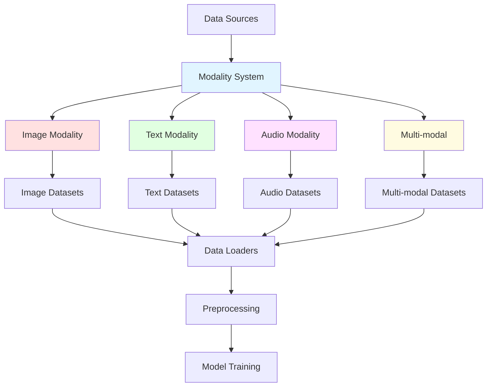
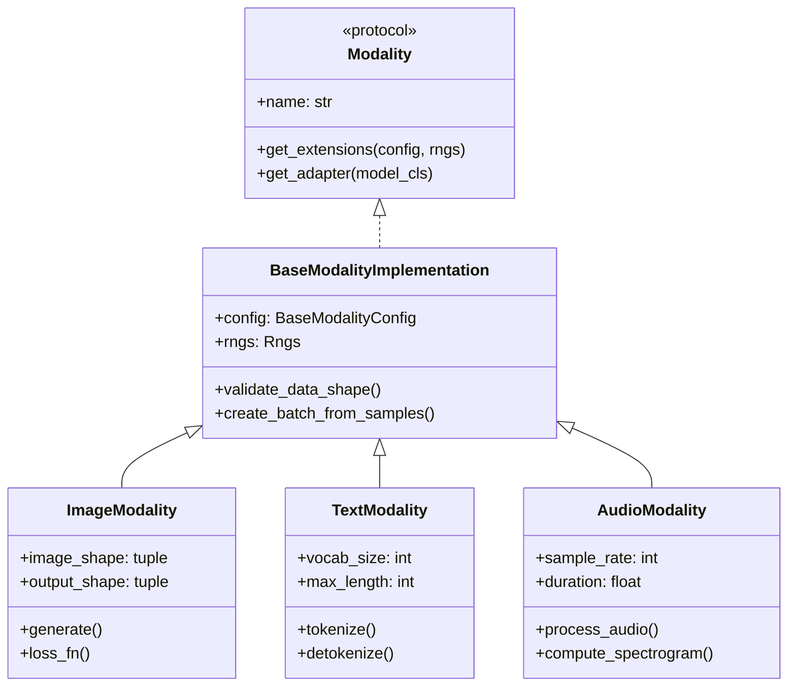
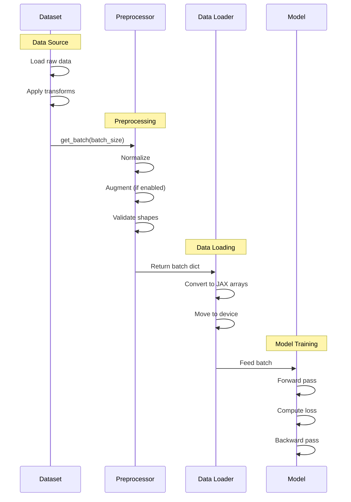

# Data Loading Overview

This guide provides an overview of Artifex's data loading system, including the modality framework, dataset classes, and data pipeline architecture.

## Key Features

<div class="grid cards" markdown>

- :material-layers-triple:{ .lg .middle } **Modality System**

    ---

    Unified interface for different data types (images, text, audio) with automatic preprocessing and validation

- :material-database:{ .lg .middle } **Dataset Classes**

    ---

    Protocol-based dataset interface compatible with JAX/Flax, supporting batching and iteration

- :material-speedometer:{ .lg .middle } **Efficient Pipeline**

    ---

    JAX-native data loading with JIT compilation support and GPU acceleration

- :material-puzzle:{ .lg .middle } **Multi-modal Support**

    ---

    Native support for multi-modal datasets with alignment and paired data handling

- :material-cog-sync:{ .lg .middle } **Preprocessing**

    ---

    Configurable preprocessing pipelines with normalization, augmentation, and transformation

- :material-toy-brick:{ .lg .middle } **Extensible Design**

    ---

    Easy to add custom datasets and modalities following protocol-based interfaces

</div>

## Architecture Overview

Artifex's data system is built around a modality-centric architecture that separates data type concerns from model implementations.

### System Components



### Core Abstractions

The data system uses protocol-based interfaces for maximum flexibility:

| Component | Purpose | Key Methods |
|-----------|---------|-------------|
| **Modality** | Defines data type interface | `get_extensions()`, `get_adapter()` |
| **BaseDataset** | Dataset abstraction | `__len__()`, `__iter__()`, `get_batch()` |
| **BaseProcessor** | Data preprocessing | `process()`, `preprocess()`, `postprocess()` |
| **BaseEvaluationSuite** | Modality evaluation | `evaluate_batch()`, `compute_quality_metrics()` |
| **ModelAdapter** | Model adaptation | `create()` |

## Modality System

The modality system provides a unified interface for working with different data types. Each modality encapsulates:

- Data representation and configuration
- Dataset implementations
- Preprocessing and augmentation
- Evaluation metrics
- Model adapters

### Modality Hierarchy



### Supported Modalities

#### Image Modality

```python
from artifex.generative_models.modalities import ImageModality, ImageModalityConfig, ImageRepresentation

# Configure image modality
config = ImageModalityConfig(
    representation=ImageRepresentation.RGB,
    height=64,
    width=64,
    channels=3,
    normalize=True,
    augmentation=False
)

# Create modality
modality = ImageModality(config=config, rngs=rngs)

# Access properties
print(f"Image shape: {modality.image_shape}")  # (64, 64, 3)
print(f"Output shape: {modality.output_shape}")  # (64, 64, 3)
```

**Supported representations:**

- `RGB`: 3-channel RGB images
- `RGBA`: 4-channel RGB with alpha
- `GRAYSCALE`: 1-channel grayscale

#### Text Modality

```python
from artifex.generative_models.modalities import TextModality
from artifex.generative_models.core.configuration import ModalityConfiguration

# Configure text modality
config = ModalityConfiguration(
    name="text",
    modality_type="text",
    metadata={
        "text_params": {
            "vocab_size": 10000,
            "max_length": 512,
            "pad_token_id": 0,
            "bos_token_id": 2,
            "eos_token_id": 3
        }
    }
)

# Create modality
modality = TextModality(config=config, rngs=rngs)

# Tokenize text
tokens = modality.tokenize("Hello world")
print(f"Tokens: {tokens.shape}")  # (512,) - padded to max_length
```

**Key features:**

- Vocabulary management
- Special token handling (PAD, BOS, EOS, UNK)
- Sequence length management
- Case-sensitive/insensitive options

#### Audio Modality

```python
from artifex.generative_models.modalities import AudioModality, AudioModalityConfig

# Configure audio modality
config = AudioModalityConfig(
    sample_rate=16000,
    duration=1.0,
    n_mels=80,
    hop_length=512,
    normalize=True
)

# Create modality
modality = AudioModality(config=config, rngs=rngs)

# Process audio
audio_data = jnp.array([...])  # Raw waveform
processed = modality.process(audio_data)
```

**Key features:**

- Waveform processing
- Spectrogram computation
- Sample rate conversion
- Duration management

#### Multi-modal

```python
from artifex.generative_models.modalities.multi_modal import (
    create_synthetic_multi_modal_dataset
)

# Create aligned multi-modal dataset
dataset = create_synthetic_multi_modal_dataset(
    modalities=["image", "text", "audio"],
    num_samples=1000,
    alignment_strength=0.8,  # How strongly aligned
    rngs=rngs
)

# Access multi-modal samples
sample = dataset[0]
print(sample.keys())  # dict_keys(['image', 'text', 'audio', 'alignment_score', 'latent'])
```

**Key features:**

- Cross-modal alignment
- Paired datasets
- Shared latent representations
- Alignment strength control

## Dataset Interface

All datasets in Artifex follow the `BaseDataset` protocol, providing a consistent interface regardless of modality.

### Base Dataset Protocol

```python
from artifex.generative_models.modalities.base import BaseDataset
from flax import nnx
import jax.numpy as jnp

class CustomDataset(BaseDataset):
    """Custom dataset implementation."""

    def __init__(
        self,
        config: BaseModalityConfig,
        split: str = "train",
        *,
        rngs: nnx.Rngs,
    ):
        super().__init__(config, split, rngs=rngs)
        # Initialize your dataset
        self.data = self._load_data()

    def __len__(self) -> int:
        """Return dataset size."""
        return len(self.data)

    def __iter__(self) -> Iterator[dict[str, jax.Array]]:
        """Iterate over dataset samples."""
        for sample in self.data:
            yield sample

    def get_batch(self, batch_size: int) -> dict[str, jax.Array]:
        """Get a batch of samples."""
        # Sample random indices
        key = self.rngs.sample() if "sample" in self.rngs else jax.random.key(0)
        indices = jax.random.randint(key, (batch_size,), 0, len(self))

        # Gather samples
        samples = [self.data[int(idx)] for idx in indices]

        # Stack into batch
        batch = {}
        for key in samples[0].keys():
            batch[key] = jnp.stack([s[key] for s in samples])

        return batch

    def _load_data(self):
        """Load dataset - implement your logic here."""
        pass
```

### Built-in Dataset Types

#### Image Datasets

**SyntheticImageDataset** - Generate synthetic image patterns:

```python
from artifex.generative_models.modalities.image.datasets import (
    SyntheticImageDataset
)

# Create synthetic dataset
dataset = SyntheticImageDataset(
    config=image_config,
    dataset_size=1000,
    pattern_type="gradient",  # or "random", "checkerboard", "circles"
    split="train",
    rngs=rngs
)

# Get batch
batch = dataset.get_batch(batch_size=32)
print(batch["images"].shape)  # (32, 64, 64, 3)
```

**Supported patterns:**

- `random`: Random noise patterns
- `gradient`: Linear gradients with varying directions
- `checkerboard`: Checkerboard patterns with random sizes
- `circles`: Circular patterns with random positions/radii

**MNISTLikeDataset** - Generate digit-like patterns:

```python
from artifex.generative_models.modalities.image.datasets import (
    MNISTLikeDataset
)

# Create MNIST-like dataset
dataset = MNISTLikeDataset(
    config=grayscale_config,  # Should be 28x28 grayscale
    dataset_size=60000,
    num_classes=10,
    split="train",
    rngs=rngs
)

# Get labeled batch
batch = dataset.get_batch(batch_size=128)
print(batch["images"].shape)  # (128, 28, 28, 1)
print(batch["labels"].shape)  # (128,)
```

#### Text Datasets

**SyntheticTextDataset** - Generate synthetic text:

```python
from artifex.generative_models.modalities.text.datasets import (
    SyntheticTextDataset
)

# Create synthetic text dataset
dataset = SyntheticTextDataset(
    config=text_config,
    dataset_size=1000,
    pattern_type="random_sentences",  # or "repeated_phrases", "sequences", "palindromes"
    split="train",
    rngs=rngs
)

# Get batch
batch = dataset.get_batch(batch_size=32)
print(batch["text_tokens"].shape)  # (32, 512)
print(batch["texts"])  # List of raw text strings
```

**SimpleTextDataset** - Load from text strings:

```python
from artifex.generative_models.modalities.text.datasets import (
    SimpleTextDataset
)

# Provide list of texts
texts = [
    "The quick brown fox jumps over the lazy dog",
    "Machine learning is a subset of artificial intelligence",
    "Deep learning uses neural networks"
]

# Create dataset
dataset = SimpleTextDataset(
    config=text_config,
    texts=texts,
    split="train",
    rngs=rngs
)

# Iterate over samples
for sample in dataset:
    print(sample["text"])
    print(sample["text_tokens"].shape)  # (512,)
```

#### Audio Datasets

**SyntheticAudioDataset** - Generate synthetic audio:

```python
from artifex.generative_models.modalities.audio.datasets import (
    SyntheticAudioDataset
)

# Create synthetic audio dataset
dataset = SyntheticAudioDataset(
    config=audio_config,
    n_samples=1000,
    audio_types=["sine", "noise", "chirp"],
    name="SyntheticAudio"
)

# Get sample
sample = dataset[0]
print(sample["audio"].shape)  # (16000,) - 1 second at 16kHz
print(sample["audio_type"])  # "sine" or "noise" or "chirp"
```

**Supported audio types:**

- `sine`: Sine waves with random frequencies (200-800 Hz)
- `noise`: White noise
- `chirp`: Linear frequency sweeps

## Data Pipeline Flow

The complete data flow from raw data to model training:



### Creating a Data Loader

Artifex provides utility functions for creating data loaders compatible with JAX training loops:

```python
import jax
import jax.numpy as jnp
from flax import nnx

def create_data_loader(
    dataset: BaseDataset,
    batch_size: int,
    shuffle: bool = True,
    drop_last: bool = False
):
    """Create a simple data loader for JAX.

    Args:
        dataset: Dataset to load from
        batch_size: Batch size
        shuffle: Whether to shuffle data
        drop_last: Whether to drop last incomplete batch

    Yields:
        Batches of data as dictionaries
    """
    num_samples = len(dataset)

    if shuffle:
        # Generate random indices
        key = jax.random.key(0)
        indices = jax.random.permutation(key, num_samples)
    else:
        indices = jnp.arange(num_samples)

    # Calculate number of batches
    num_batches = num_samples // batch_size
    if not drop_last and num_samples % batch_size != 0:
        num_batches += 1

    for i in range(num_batches):
        start_idx = i * batch_size
        end_idx = min(start_idx + batch_size, num_samples)
        batch_indices = indices[start_idx:end_idx]

        # Gather batch
        batch = dataset.get_batch(len(batch_indices))
        yield batch

# Usage
train_loader = create_data_loader(
    dataset=train_dataset,
    batch_size=128,
    shuffle=True,
    drop_last=True
)

for batch in train_loader:
    # Training step
    loss = train_step(model, batch)
```

## Preprocessing

Each modality provides preprocessing functionality through the `BaseProcessor` interface:

### Image Preprocessing

```python
from artifex.generative_models.modalities.image.base import ImageModality

# Create modality with preprocessing
config = ImageModalityConfig(
    representation=ImageRepresentation.RGB,
    height=64,
    width=64,
    normalize=True,  # Normalize to [0, 1]
    augmentation=True  # Enable augmentation
)

modality = ImageModality(config=config, rngs=rngs)

# Process raw image data
raw_images = jnp.array([...])  # Raw pixel values
processed = modality.process(raw_images)

# Processed images are:
# - Resized to (64, 64)
# - Normalized to [0, 1] (or [-1, 1] if normalize=False)
# - Augmented (if enabled)
```

### Text Preprocessing

```python
from artifex.generative_models.modalities.text.base import TextModality

# Text preprocessing handles:
# - Tokenization
# - Vocabulary mapping
# - Special token insertion (BOS/EOS)
# - Padding/truncation to max_length

text = "Hello world, this is a test sentence"
tokens = text_modality.tokenize(text)
print(tokens.shape)  # (512,) - padded to max_length

# Detokenization
recovered_text = text_modality.detokenize(tokens)
```

### Audio Preprocessing

```python
from artifex.generative_models.modalities.audio.base import AudioModality

# Audio preprocessing handles:
# - Resampling to target sample rate
# - Duration normalization
# - Amplitude normalization
# - Spectrogram computation

raw_audio = load_audio_file("audio.wav")
processed = audio_modality.process(raw_audio)

# Compute mel-spectrogram
mel_spec = audio_modality.compute_mel_spectrogram(processed)
print(mel_spec.shape)  # (n_mels, n_frames)
```

## Configuration

All modalities use configuration objects to manage their settings:

### Image Configuration

```python
from artifex.generative_models.modalities.image.base import (
    ImageModalityConfig,
    ImageRepresentation
)

config = ImageModalityConfig(
    representation=ImageRepresentation.RGB,
    height=256,
    width=256,
    channels=3,  # Auto-determined from representation if None
    normalize=True,  # Normalize to [0, 1]
    augmentation=False,  # Disable augmentation
    resize_method="bilinear"  # or "nearest"
)
```

### Text Configuration

```python
from artifex.generative_models.core.configuration import ModalityConfiguration

config = ModalityConfiguration(
    name="text",
    modality_type="text",
    metadata={
        "text_params": {
            "vocab_size": 50000,
            "max_length": 1024,
            "pad_token_id": 0,
            "unk_token_id": 1,
            "bos_token_id": 2,
            "eos_token_id": 3,
            "case_sensitive": False
        }
    }
)
```

### Audio Configuration

```python
from artifex.generative_models.modalities.audio.base import AudioModalityConfig

config = AudioModalityConfig(
    sample_rate=16000,
    duration=2.0,
    n_mels=80,
    n_fft=1024,
    hop_length=256,
    normalize=True,
    spectrogram_type="mel"  # or "stft"
)
```

## Complete Example

Here's a complete example showing how to set up a data pipeline for training:

```python
import jax
import jax.numpy as jnp
from flax import nnx
from artifex.generative_models.modalities import ImageModality, ImageModalityConfig, ImageRepresentation
from artifex.generative_models.modalities.image.datasets import SyntheticImageDataset

# Initialize RNG
rngs = nnx.Rngs(0)

# Configure image modality
image_config = ImageModalityConfig(
    representation=ImageRepresentation.RGB,
    height=64,
    width=64,
    channels=3,
    normalize=True,
    augmentation=False
)

# Create modality
modality = ImageModality(config=image_config, rngs=rngs)

# Create training dataset
train_dataset = SyntheticImageDataset(
    config=image_config,
    dataset_size=10000,
    pattern_type="gradient",
    split="train",
    rngs=rngs
)

# Create validation dataset
val_dataset = SyntheticImageDataset(
    config=image_config,
    dataset_size=1000,
    pattern_type="gradient",
    split="val",
    rngs=rngs
)

# Create data loader
def create_data_loader(dataset, batch_size, shuffle=True):
    """Simple data loader for JAX."""
    num_samples = len(dataset)

    for epoch in range(num_epochs):
        if shuffle:
            key = jax.random.key(epoch)
            indices = jax.random.permutation(key, num_samples)
        else:
            indices = jnp.arange(num_samples)

        num_batches = num_samples // batch_size
        for i in range(num_batches):
            batch_indices = indices[i * batch_size:(i + 1) * batch_size]
            batch = dataset.get_batch(batch_size)
            yield batch

# Training loop
batch_size = 128
num_epochs = 10

train_loader = create_data_loader(train_dataset, batch_size, shuffle=True)

for epoch in range(num_epochs):
    for batch in train_loader:
        # Get images from batch
        images = batch["images"]

        # Preprocess through modality
        processed = modality.process(images)

        # Training step
        # ... (use processed images for training)

    # Validation
    val_loader = create_data_loader(val_dataset, batch_size, shuffle=False)
    for val_batch in val_loader:
        images = val_batch["images"]
        # Validation step
        # ...
```

## Modality Registry

Artifex provides a global registry for modalities:

```python
from artifex.generative_models.modalities import (
    register_modality,
    get_modality,
    list_modalities
)

# Register custom modality
register_modality("custom_image", CustomImageModality)

# Get modality by name
modality_class = get_modality("image")

# List all registered modalities
available = list_modalities()
print(available)  # ['image', 'text', 'audio', 'protein', 'molecular', ...]
```

## Best Practices

### Dataset Design

!!! tip "DO"
    - Use protocol-based interfaces for extensibility
    - Implement `__len__()`, `__iter__()`, and `get_batch()`
    - Return dictionaries with descriptive keys
    - Use JAX arrays for all numeric data
    - Provide proper RNG handling
    - Validate data shapes and types
    - Cache preprocessed data when possible

!!! danger "DON'T"
    - Use PyTorch or TensorFlow tensors
    - Return raw Python lists of arrays
    - Perform heavy computation in `__iter__()`
    - Ignore RNG seeding for reproducibility
    - Mix different data types in same batch
    - Load entire dataset into memory (unless small)

### Preprocessing

!!! tip "DO"
    - Normalize data to expected range
    - Apply augmentation during training only
    - Use JIT-compiled preprocessing functions
    - Cache computed features (spectrograms, embeddings)
    - Validate preprocessed shapes
    - Document expected input/output formats

!!! danger "DON'T"
    - Apply random augmentation during validation
    - Use non-deterministic operations without RNG
    - Perform I/O operations in preprocessing
    - Ignore batch dimension handling
    - Mix preprocessing across modalities

### Configuration

!!! tip "DO"
    - Use dataclasses for configuration
    - Provide sensible defaults
    - Validate configuration values
    - Document all configuration options
    - Use enums for categorical choices
    - Make configuration serializable

!!! danger "DON'T"
    - Use raw dictionaries for configuration
    - Allow invalid configuration combinations
    - Hard-code magic numbers
    - Mix configuration across components
    - Forget to validate user inputs

## Summary

Artifex's data system provides:

- **Modality-centric architecture** - Unified interface for different data types
- **Protocol-based design** - Easy to extend with custom datasets and modalities
- **JAX-native** - Full JAX compatibility with JIT and GPU support
- **Preprocessing pipelines** - Configurable normalization and augmentation
- **Multi-modal support** - Native support for aligned multi-modal data
- **Type safety** - Full type hints and validation

## Next Steps

<div class="grid cards" markdown>

- :material-book-open-variant:{ .lg .middle } **[Data Loading Guide](data-guide.md)**

    ---

    Learn how to load custom datasets, implement preprocessing pipelines, and optimize data loading

- :material-image:{ .lg .middle } **[Image Modality Guide](../modalities/image.md)**

    ---

    Deep dive into image datasets, preprocessing, augmentation, and best practices

- :material-text:{ .lg .middle } **[Text Modality Guide](../modalities/text.md)**

    ---

    Learn about text tokenization, vocabulary management, and sequence handling

- :material-api:{ .lg .middle } **[Data API Reference](../../api/data/loaders.md)**

    ---

    Complete API documentation for datasets, loaders, and preprocessing functions

</div>
