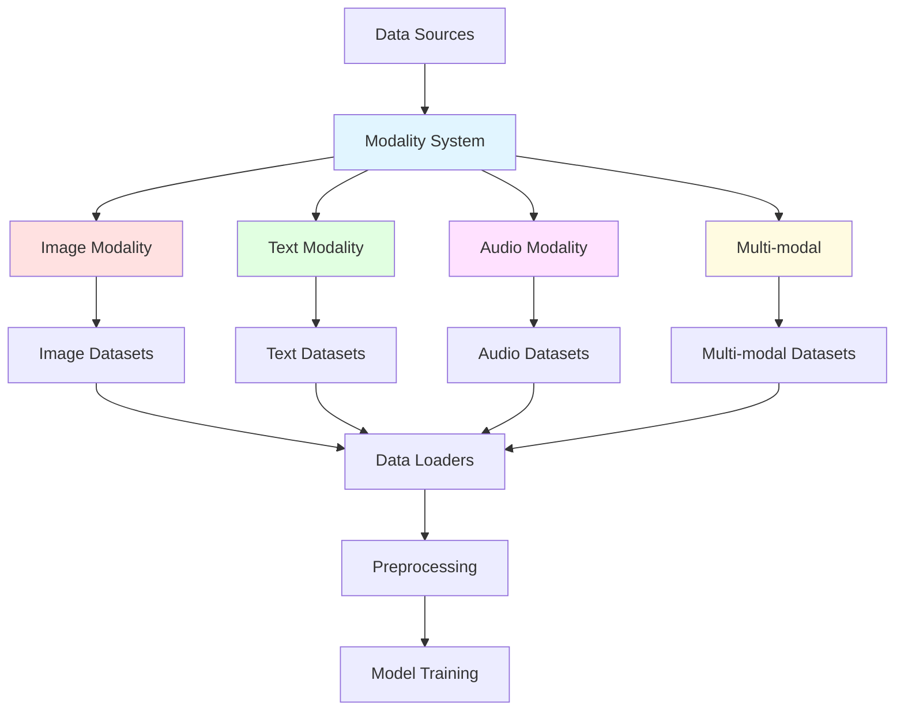
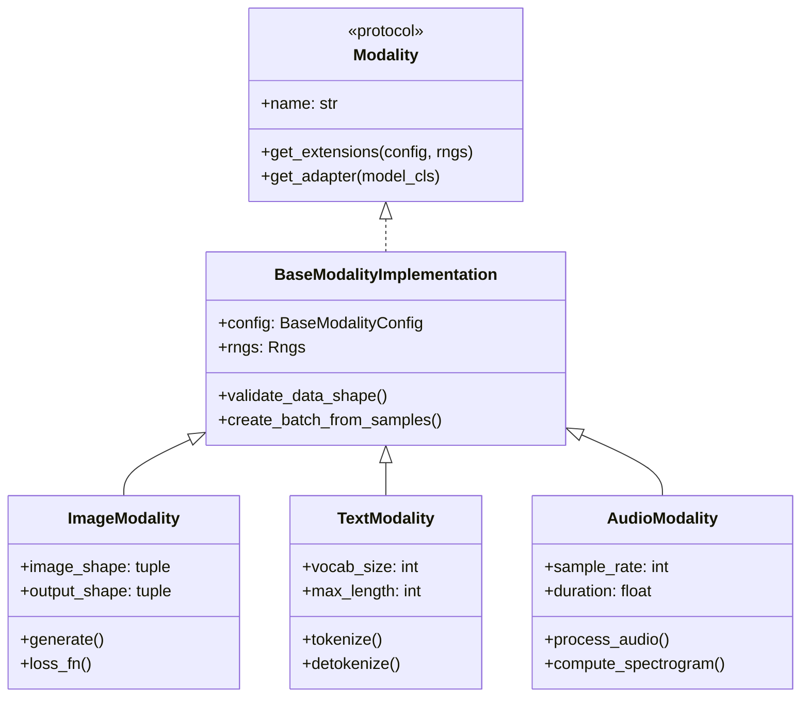
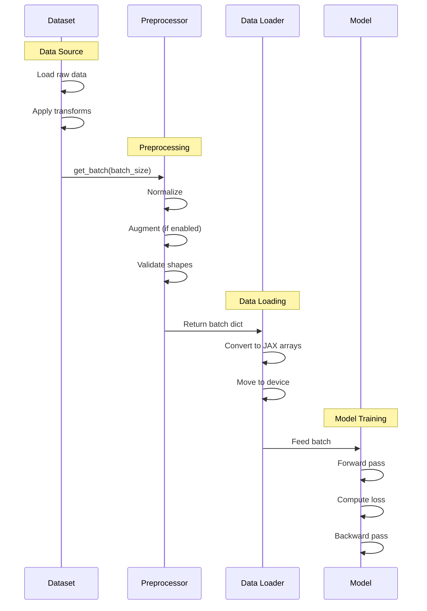

# Data Loading Overview

This guide provides an overview of Artifex's data loading system, including the modality framework, dataset classes, and data pipeline architecture.

## Key Features

<div class="grid cards" markdown>

- :material-layers-triple:{ .lg .middle } **Modality System**

    ---

    Unified interface for different data types (images, text, audio) with automatic preprocessing and validation

- :material-database:{ .lg .middle } **MemorySource Datasets**

    ---

    Factory-based dataset creation backed by datarax `MemorySource`, supporting indexing, batching, and iteration

- :material-speedometer:{ .lg .middle } **Efficient Pipeline**

    ---

    JAX-native data loading with JIT compilation support and GPU acceleration

- :material-puzzle:{ .lg .middle } **Multi-modal Support**

    ---

    Native support for multi-modal datasets with alignment and paired data handling

- :material-cog-sync:{ .lg .middle } **Preprocessing**

    ---

    Configurable preprocessing pipelines with normalization, augmentation, and transformation

- :material-toy-brick:{ .lg .middle } **Extensible Design**

    ---

    Easy to add custom datasets and modalities following protocol-based interfaces

</div>

## Architecture Overview

Artifex's data system is built around a modality-centric architecture that separates data type concerns from model implementations.

### System Components


```mermaid
graph TB
    A[Data Sources] --> B[Modality System]
    B --> C[Image Modality]
    B --> D[Text Modality]
    B --> E[Audio Modality]
    B --> F[Multi-modal]

    C --> G[Image Datasets]
    D --> H[Text Datasets]
    E --> I[Audio Datasets]
    F --> J[Multi-modal Datasets]

    G --> K[Data Loaders]
    H --> K
    I --> K
    J --> K

    K --> L[Preprocessing]
    L --> M[Model Training]

    style B fill:#e1f5ff
    style C fill:#ffe1e1
    style D fill:#e1ffe1
    style E fill:#ffe1ff
    style F fill:#fffbe1
```

### Core Abstractions

The data system uses protocol-based interfaces for maximum flexibility:

| Component | Purpose | Key Methods |
|-----------|---------|-------------|
| **Modality** | Defines data type interface | `get_extensions()`, `get_adapter()` |
| **MemorySource** | Dataset backed by in-memory data | `__len__()`, `__getitem__()`, `__iter__()`, `get_batch()` |
| **BaseProcessor** | Data preprocessing | `process()`, `preprocess()`, `postprocess()` |
| **BaseEvaluationSuite** | Modality evaluation | `evaluate_batch()`, `compute_quality_metrics()` |
| **ModelAdapter** | Model adaptation | `create()` |

## Modality System

The modality system provides a unified interface for working with different data types. Each modality encapsulates:

- Data representation and configuration
- Dataset implementations
- Preprocessing and augmentation
- Evaluation metrics
- Model adapters

### Modality Hierarchy


```mermaid
classDiagram
    class Modality {
        <<protocol>>
        +name: str
        +get_extensions(config, rngs)
        +get_adapter(model_cls)
    }

    class BaseModalityImplementation {
        +config: BaseModalityConfig
        +rngs: Rngs
        +validate_data_shape()
        +create_batch_from_samples()
    }

    class ImageModality {
        +image_shape: tuple
        +output_shape: tuple
        +generate()
        +loss_fn()
    }

    class TextModality {
        +vocab_size: int
        +max_length: int
        +tokenize()
        +detokenize()
    }

    class AudioModality {
        +sample_rate: int
        +duration: float
        +process_audio()
        +compute_spectrogram()
    }

    Modality <|.. BaseModalityImplementation
    BaseModalityImplementation <|-- ImageModality
    BaseModalityImplementation <|-- TextModality
    BaseModalityImplementation <|-- AudioModality
```

`BaseModalityConfig` is a frozen typed runtime config from the core configuration layer. Image, audio, timeseries, tabular, and multi-modal runtime configs follow the same immutable dataclass contract.

### Supported Modalities

#### Image Modality

```python
from artifex.generative_models.modalities import ImageModality, ImageModalityConfig, ImageRepresentation

# Configure image modality
config = ImageModalityConfig(
    representation=ImageRepresentation.RGB,
    height=64,
    width=64,
    channels=3,
    normalize=True,
    augmentation=False
)

# Create modality
modality = ImageModality(config=config, rngs=rngs)

# Access properties
print(f"Image shape: {modality.image_shape}")  # (64, 64, 3)
print(f"Output shape: {modality.output_shape}")  # (64, 64, 3)
```

**Supported representations:**

- `RGB`: 3-channel RGB images
- `RGBA`: 4-channel RGB with alpha
- `GRAYSCALE`: 1-channel grayscale

#### Text Modality

```python
from artifex.generative_models.modalities import TextModality
from artifex.configs import ModalityConfig

# Configure text modality
config = ModalityConfig(
    name="text",
    modality_name="text",
    metadata={
        "text_params": {
            "vocab_size": 10000,
            "max_length": 512,
            "pad_token_id": 0,
            "bos_token_id": 2,
            "eos_token_id": 3
        }
    }
)

# Create modality
modality = TextModality(config=config, rngs=rngs)

# Tokenize text
tokens = modality.tokenize("Hello world")
print(f"Tokens: {tokens.shape}")  # (512,) - padded to max_length
```

**Key features:**

- Vocabulary management
- Special token handling (PAD, BOS, EOS, UNK)
- Sequence length management
- Case-sensitive/insensitive options

#### Audio Modality

```python
from artifex.generative_models.modalities import AudioModality, AudioModalityConfig

# Configure audio modality
config = AudioModalityConfig(
    sample_rate=16000,
    duration=1.0,
    n_mels=80,
    hop_length=512,
    normalize=True
)

# Create modality
modality = AudioModality(config=config, rngs=rngs)

# Process audio
audio_data = jnp.array([...])  # Raw waveform
processed = modality.process(audio_data)
```

**Key features:**

- Waveform processing
- Spectrogram computation
- Sample rate conversion
- Duration management

#### Multi-modal

```python
from artifex.generative_models.modalities.multi_modal import (
    create_synthetic_multi_modal_dataset
)

# Create aligned multi-modal dataset
dataset = create_synthetic_multi_modal_dataset(
    modalities=["image", "text", "audio"],
    num_samples=1000,
    alignment_strength=0.8,  # How strongly aligned
    rngs=rngs
)

# Access multi-modal samples
sample = dataset[0]
print(sample.keys())  # dict_keys(['image', 'text', 'audio', 'alignment_score', 'latent'])
```

**Key features:**

- Cross-modal alignment
- Paired datasets
- Shared latent representations
- Alignment strength control

## Dataset Interface

All datasets in Artifex are backed by `MemorySource` from the `datarax` library. Factory functions generate data and wrap it in a `MemorySource`, which provides a uniform interface for indexing, iteration, batching, and pipeline integration.

### MemorySource Interface

`MemorySource` instances support:

- `len(source)` -- total number of samples
- `source[i]` -- retrieve a single sample by index (including negative indices)
- `iter(source)` -- iterate over all samples one by one
- `source.get_batch(batch_size)` -- retrieve a stacked batch of samples

```python
from flax import nnx
from artifex.generative_models.modalities.image.datasets import create_image_dataset

rngs = nnx.Rngs(0)

# Factory returns a MemorySource
source = create_image_dataset("synthetic", rngs=rngs, dataset_size=100, height=32, width=32)

# Length
print(len(source))  # 100

# Indexing
sample = source[0]
print(sample["images"].shape)  # (32, 32, 3)

# Iteration
for sample in source:
    print(sample["images"].shape)  # (32, 32, 3)

# Batching
batch = source.get_batch(16)
print(batch["images"].shape)  # (16, 32, 32, 3)
```

### Built-in Dataset Types

#### Image Datasets

**Synthetic images** -- use `create_image_dataset()` with `dataset_type="synthetic"`:

```python
from artifex.generative_models.modalities.image.datasets import create_image_dataset
from flax import nnx

rngs = nnx.Rngs(0)

# Create synthetic image dataset
source = create_image_dataset(
    "synthetic",
    rngs=rngs,
    dataset_size=1000,
    height=64,
    width=64,
    channels=3,
    pattern_type="gradient",  # or "random", "checkerboard", "circles"
)

# Get batch
batch = source.get_batch(32)
print(batch["images"].shape)  # (32, 64, 64, 3)
```

You can also pass an `ImageModalityConfig` instead of explicit dimensions:

```python
from artifex.generative_models.modalities.image.base import ImageModalityConfig

config = ImageModalityConfig(height=64, width=64, channels=3)
source = create_image_dataset("synthetic", config=config, rngs=rngs, dataset_size=1000)
```

**Supported patterns:**

- `random`: Random noise patterns
- `gradient`: Linear gradients with varying directions
- `checkerboard`: Checkerboard patterns with random sizes
- `circles`: Circular patterns with random positions/radii

**MNIST-like images** -- use `create_image_dataset()` with `dataset_type="mnist_like"`:

```python
from artifex.generative_models.modalities.image.datasets import create_image_dataset
from flax import nnx

rngs = nnx.Rngs(0)

# Create MNIST-like dataset with digit patterns
source = create_image_dataset(
    "mnist_like",
    rngs=rngs,
    dataset_size=60000,
    height=28,
    width=28,
    channels=1,
    num_classes=10,
)

# Get labeled batch
batch = source.get_batch(128)
print(batch["images"].shape)  # (128, 28, 28, 1)
print(batch["labels"].shape)  # (128,)
```

#### Text Datasets

**Synthetic text** -- use `create_text_dataset()` with `dataset_type="synthetic"`:

```python
from artifex.generative_models.modalities.text.datasets import create_text_dataset
from flax import nnx

rngs = nnx.Rngs(0)

# Create synthetic text dataset
source = create_text_dataset(
    "synthetic",
    rngs=rngs,
    dataset_size=1000,
    vocab_size=10000,
    max_length=512,
    pattern_type="random_sentences",  # or "repeated_phrases", "sequences", "palindromes"
)

# Get batch
batch = source.get_batch(32)
print(batch["text_tokens"].shape)  # (32, 512)
```

**Text from strings** -- use `create_text_dataset()` with `dataset_type="simple"`:

```python
from artifex.generative_models.modalities.text.datasets import create_text_dataset
from flax import nnx

rngs = nnx.Rngs(0)

# Provide list of texts
texts = [
    "The quick brown fox jumps over the lazy dog",
    "Machine learning is a subset of artificial intelligence",
    "Deep learning uses neural networks",
]

# Create dataset from raw strings
source = create_text_dataset(
    "simple",
    rngs=rngs,
    texts=texts,
    vocab_size=10000,
    max_length=512,
)

# Iterate over samples
for sample in source:
    print(sample["text_tokens"].shape)  # (512,)
```

#### Audio Datasets

**Synthetic audio** -- use `create_audio_dataset()` with `dataset_type="synthetic"`:

```python
from artifex.generative_models.modalities.audio.datasets import create_audio_dataset
from flax import nnx

rngs = nnx.Rngs(0)

# Create synthetic audio dataset
source = create_audio_dataset(
    "synthetic",
    rngs=rngs,
    n_samples=1000,
    sample_rate=16000,
    duration=1.0,
    audio_types=("sine", "noise", "chirp"),
)

# Get single sample
sample = source[0]
print(sample["audio"].shape)  # (16000,) - 1 second at 16 kHz

# Get batch
batch = source.get_batch(16)
print(batch["audio"].shape)  # (16, 16000)
```

You can also pass an `AudioModalityConfig` to extract `sample_rate`, `duration`, and `normalize` automatically:

```python
from artifex.generative_models.modalities.audio.base import AudioModalityConfig

config = AudioModalityConfig(sample_rate=16000, duration=2.0, normalize=True)
source = create_audio_dataset("synthetic", config=config, rngs=rngs, n_samples=500)
```

**Supported audio types:**

- `sine`: Sine waves with random frequencies (200-800 Hz)
- `noise`: White noise
- `chirp`: Linear frequency sweeps

## Data Pipeline Flow

The complete data flow from raw data to model training:


```mermaid
sequenceDiagram
    participant DS as Dataset
    participant PP as Preprocessor
    participant DL as Data Loader
    participant M as Model

    Note over DS: Data Source
    DS->>DS: Load raw data
    DS->>DS: Apply transforms

    Note over PP: Preprocessing
    DS->>PP: get_batch(batch_size)
    PP->>PP: Normalize
    PP->>PP: Augment (if enabled)
    PP->>PP: Validate shapes

    Note over DL: Data Loading
    PP->>DL: Return batch dict
    DL->>DL: Convert to JAX arrays
    DL->>DL: Move to device

    Note over M: Model Training
    DL->>M: Feed batch
    M->>M: Forward pass
    M->>M: Compute loss
    M->>M: Backward pass
```

### Creating a Data Pipeline

The recommended way to create batched pipelines is `from_source` from the `datarax` library. It wraps a `MemorySource` into a batched, iterable pipeline:

```python
from datarax import from_source
from flax import nnx
from artifex.generative_models.modalities.image.datasets import create_image_dataset

rngs = nnx.Rngs(0)

# Create a MemorySource
source = create_image_dataset(
    "synthetic", rngs=rngs, dataset_size=1000, height=64, width=64
)

# Wrap into a batched pipeline
pipeline = from_source(source, batch_size=32)

for batch in pipeline:
    images = batch["images"]
    print(images.shape)  # (32, 64, 64, 3)
    # Training step ...
```

You can also use `get_batch()` directly on the source for quick prototyping:

```python
batch = source.get_batch(64)
print(batch["images"].shape)  # (64, 64, 64, 3)
```

## Preprocessing

Each modality provides preprocessing functionality through the `BaseProcessor` interface:

### Image Preprocessing

```python
from artifex.generative_models.modalities.image.base import ImageModality

# Create modality with preprocessing
config = ImageModalityConfig(
    representation=ImageRepresentation.RGB,
    height=64,
    width=64,
    normalize=True,  # Normalize to [0, 1]
    augmentation=True  # Enable augmentation
)

modality = ImageModality(config=config, rngs=rngs)

# Process raw image data
raw_images = jnp.array([...])  # Raw pixel values
processed = modality.process(raw_images)

# Processed images are:
# - Resized to (64, 64)
# - Normalized to [0, 1] (or [-1, 1] if normalize=False)
# - Augmented (if enabled)
```

### Text Preprocessing

```python
from artifex.generative_models.modalities.text.base import TextModality

# Text preprocessing handles:
# - Tokenization
# - Vocabulary mapping
# - Special token insertion (BOS/EOS)
# - Padding/truncation to max_length

text = "Hello world, this is a test sentence"
tokens = text_modality.tokenize(text)
print(tokens.shape)  # (512,) - padded to max_length

# Detokenization
recovered_text = text_modality.detokenize(tokens)
```

### Audio Preprocessing

```python
from artifex.generative_models.modalities.audio.base import AudioModality

# Audio preprocessing handles:
# - Resampling to target sample rate
# - Duration normalization
# - Amplitude normalization
# - Spectrogram computation

raw_audio = load_audio_file("audio.wav")
processed = audio_modality.process(raw_audio)

# Compute mel-spectrogram
mel_spec = audio_modality.compute_mel_spectrogram(processed)
print(mel_spec.shape)  # (n_mels, n_frames)
```

## Configuration

All modalities use configuration objects to manage their settings:

### Image Configuration

```python
from artifex.generative_models.modalities.image.base import (
    ImageModalityConfig,
    ImageRepresentation
)

config = ImageModalityConfig(
    representation=ImageRepresentation.RGB,
    height=256,
    width=256,
    channels=3,  # Auto-determined from representation if None
    normalize=True,  # Normalize to [0, 1]
    augmentation=False,  # Disable augmentation
    resize_method="bilinear"  # or "nearest"
)
```

### Text Configuration

```python
from artifex.configs import ModalityConfig

config = ModalityConfig(
    name="text",
    modality_name="text",
    metadata={
        "text_params": {
            "vocab_size": 50000,
            "max_length": 1024,
            "pad_token_id": 0,
            "unk_token_id": 1,
            "bos_token_id": 2,
            "eos_token_id": 3,
            "case_sensitive": False
        }
    }
)
```

### Audio Configuration

```python
from artifex.generative_models.modalities.audio.base import AudioModalityConfig

config = AudioModalityConfig(
    sample_rate=16000,
    duration=2.0,
    n_mels=80,
    n_fft=1024,
    hop_length=256,
    normalize=True,
    spectrogram_type="mel"  # or "stft"
)
```

## Complete Example

Here is a complete example showing how to set up a data pipeline for training:

```python
from datarax import from_source
from flax import nnx
from artifex.generative_models.modalities import ImageModality, ImageModalityConfig, ImageRepresentation
from artifex.generative_models.modalities.image.datasets import create_image_dataset

# Initialize RNG
rngs = nnx.Rngs(0)

# Configure image modality
image_config = ImageModalityConfig(
    representation=ImageRepresentation.RGB,
    height=64,
    width=64,
    channels=3,
    normalize=True,
    augmentation=False,
)

# Create modality
modality = ImageModality(config=image_config, rngs=rngs)

# Create training dataset (MemorySource)
train_source = create_image_dataset(
    "synthetic",
    config=image_config,
    rngs=rngs,
    dataset_size=10000,
    pattern_type="gradient",
)

# Create validation dataset (MemorySource)
val_source = create_image_dataset(
    "synthetic",
    config=image_config,
    rngs=rngs,
    dataset_size=1000,
    pattern_type="gradient",
)

# Build batched pipelines
batch_size = 128
train_pipeline = from_source(train_source, batch_size=batch_size)
val_pipeline = from_source(val_source, batch_size=batch_size)

# Training loop
num_epochs = 10

for epoch in range(num_epochs):
    for batch in train_pipeline:
        # Get images from batch
        images = batch["images"]

        # Preprocess through modality
        processed = modality.process(images)

        # Training step
        # ... (use processed images for training)

    # Validation
    for val_batch in val_pipeline:
        images = val_batch["images"]
        # Validation step
        # ...
```

## Modality Registry

Artifex provides a global registry for modalities:

```python
from artifex.generative_models.modalities import (
    register_modality,
    get_modality,
    list_modalities
)

# Register custom modality
register_modality("custom_image", CustomImageModality)

# Get modality by name
modality_class = get_modality("image")

# List all registered modalities
available = list_modalities()
print(available)  # ['image', 'text', 'audio', 'protein', 'molecular', ...]
```

## Best Practices

### Dataset Design

!!! tip "DO"
    - Use factory functions (`create_image_dataset`, `create_text_dataset`, etc.) for built-in data
    - Wrap custom data dictionaries in `MemorySource` for pipeline compatibility
    - Return dictionaries with descriptive keys
    - Use JAX arrays for all numeric data
    - Provide `rngs: nnx.Rngs` for reproducible shuffling and batching
    - Validate data shapes and types
    - Use `from_source()` for batched iteration in training loops

!!! danger "DON'T"
    - Use PyTorch or TensorFlow tensors
    - Return raw Python lists of arrays
    - Perform heavy computation in `__iter__()`
    - Ignore RNG seeding for reproducibility
    - Mix different data types in same batch
    - Instantiate removed classes (`SyntheticImageDataset`, `MNISTLikeDataset`, etc.)

### Preprocessing

!!! tip "DO"
    - Normalize data to expected range
    - Apply augmentation during training only
    - Use JIT-compiled preprocessing functions
    - Cache computed features (spectrograms, embeddings)
    - Validate preprocessed shapes
    - Document expected input/output formats

!!! danger "DON'T"
    - Apply random augmentation during validation
    - Use non-deterministic operations without RNG
    - Perform I/O operations in preprocessing
    - Ignore batch dimension handling
    - Mix preprocessing across modalities

### Configuration

!!! tip "DO"
    - Use dataclasses for configuration
    - Provide sensible defaults
    - Validate configuration values
    - Document all configuration options
    - Use enums for categorical choices
    - Make configuration serializable

!!! danger "DON'T"
    - Use raw dictionaries for configuration
    - Allow invalid configuration combinations
    - Hard-code magic numbers
    - Mix configuration across components
    - Forget to validate user inputs

## Summary

Artifex's data system provides:

- **Modality-centric architecture** -- Unified interface for different data types
- **MemorySource-backed datasets** -- Factory functions return `MemorySource` instances with indexing, iteration, and batching
- **datarax pipeline integration** -- Use `from_source()` for batched, iterable training pipelines
- **JAX-native** -- Full JAX compatibility with JIT and GPU support
- **Preprocessing pipelines** -- Configurable normalization and augmentation
- **Multi-modal support** -- Native support for aligned multi-modal data
- **Type safety** -- Full type hints and validation

## Next Steps

<div class="grid cards" markdown>

- :material-book-open-variant:{ .lg .middle } **[Data Loading Guide](data-guide.md)**

    ---

    Learn how to load custom datasets, implement preprocessing pipelines, and optimize data loading

- :material-image:{ .lg .middle } **[Image Modality Guide](../modalities/image.md)**

    ---

    Deep dive into image datasets, preprocessing, augmentation, and best practices

- :material-text:{ .lg .middle } **[Text Modality Guide](../modalities/text.md)**

    ---

    Learn about text tokenization, vocabulary management, and sequence handling

- :material-api:{ .lg .middle } **[Data API Reference](../../api/data/loaders.md)**

    ---

    Complete API documentation for datasets, loaders, and preprocessing functions

</div>
