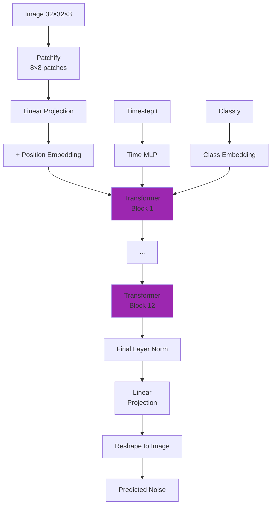

# Diffusion Models User Guide

This guide covers practical usage of diffusion models in Artifex, from basic DDPM to advanced techniques like latent diffusion and guidance.

## Quick Start

Here's a minimal example to get started with diffusion models:

```python
import jax.numpy as jnp
from flax import nnx

from artifex.generative_models.core.configuration.backbone_config import UNetBackboneConfig
from artifex.generative_models.core.configuration.diffusion_config import (
    DDPMConfig,
    NoiseScheduleConfig,
)
from artifex.generative_models.models.diffusion.ddpm import DDPMModel

# Initialize RNGs with required streams
rngs = nnx.Rngs(params=0, noise=1, sample=2, dropout=3)

# Configure the backbone network (UNet)
backbone_config = UNetBackboneConfig(
    name="unet_backbone",
    hidden_dims=(64, 128, 256),
    activation="gelu",
    in_channels=1,
    out_channels=1,
    time_embedding_dim=128,
    attention_resolutions=(16, 8),
    num_res_blocks=2,
    channel_mult=(1, 2, 4),
)

# Configure the noise schedule
noise_schedule_config = NoiseScheduleConfig(
    name="linear_schedule",
    schedule_type="linear",
    num_timesteps=1000,
    beta_start=1e-4,
    beta_end=2e-2,
)

# Configure the DDPM model
config = DDPMConfig(
    name="ddpm_mnist",
    backbone=backbone_config,
    noise_schedule=noise_schedule_config,
    input_shape=(28, 28, 1),
    loss_type="mse",
    clip_denoised=True,
)

# Create model
model = DDPMModel(config, rngs=rngs)

# Generate samples
model.eval()  # Set to evaluation mode
samples = model.generate(n_samples=16)
print(f"Generated samples shape: {samples.shape}")  # (16, 28, 28, 1)
```

## Creating Diffusion Models

### DDPM (Denoising Diffusion Probabilistic Models)

DDPM is the foundational diffusion model with stable training and excellent quality.

```python
from artifex.generative_models.core.configuration.backbone_config import UNetBackboneConfig
from artifex.generative_models.core.configuration.diffusion_config import (
    DDPMConfig,
    NoiseScheduleConfig,
)
from artifex.generative_models.models.diffusion.ddpm import DDPMModel

# Configure backbone
backbone_config = UNetBackboneConfig(
    name="unet_32x32",
    hidden_dims=(64, 128, 256),
    in_channels=3,
    out_channels=3,
    time_embedding_dim=128,
)

# Configure noise schedule
noise_config = NoiseScheduleConfig(
    name="linear",
    schedule_type="linear",       # or "cosine"
    num_timesteps=1000,           # Number of diffusion steps
    beta_start=1e-4,              # Starting noise level
    beta_end=0.02,                # Ending noise level
)

# Configure DDPM
config = DDPMConfig(
    name="ddpm_model",
    backbone=backbone_config,
    noise_schedule=noise_config,
    input_shape=(32, 32, 3),
    loss_type="mse",
    clip_denoised=True,
)

# Create model
model = DDPMModel(config, rngs=rngs)

# Forward diffusion (add noise)
x_clean = jnp.ones((4, 32, 32, 3))
t = jnp.array([100, 200, 300, 400])  # Different timesteps
x_noisy, noise = model.forward_diffusion(x_clean, t)

print(f"Clean shape: {x_clean.shape}")
print(f"Noisy shape: {x_noisy.shape}")
```

**Key Configuration Objects:**

| Config | Description |
|--------|-------------|
| `UNetBackboneConfig` | Neural network architecture for noise prediction |
| `NoiseScheduleConfig` | How noise is added across timesteps |
| `DDPMConfig` | Complete DDPM model configuration |

### DDIM (Faster Sampling)

DDIM enables much faster sampling with fewer steps while maintaining quality.

```python
from artifex.generative_models.core.configuration.diffusion_config import DDIMConfig

# Note: DDIMModel is not yet exported from the diffusion package __init__.py,
# so import directly from the submodule:
from artifex.generative_models.models.diffusion.ddim import DDIMModel

# Configure DDIM
config = DDIMConfig(
    name="ddim_model",
    backbone=backbone_config,
    noise_schedule=noise_config,
    input_shape=(32, 32, 3),
    num_inference_steps=50,       # Sampling steps (much fewer than 1000!)
    eta=0.0,                      # 0 = deterministic, 1 = stochastic
)

# Create DDIM model
model = DDIMModel(config, rngs=rngs)

# Fast sampling - steps configured via num_inference_steps in config
model.eval()
samples = model.generate(n_samples=16)

print(f"Generated {samples.shape[0]} samples in only 50 steps!")
```

**DDIM vs DDPM:**

| Aspect | DDPM | DDIM |
|--------|------|------|
| **Sampling Steps** | 1000 | 50-100 |
| **Speed** | Slow | 10-20x faster |
| **Stochasticity** | Stochastic | Deterministic (η=0) |
| **Quality** | Excellent | Very good |
| **Use Case** | Training, quality | Inference, speed |

### DDIM Inversion (Image Editing)

DDIM's deterministic nature enables image editing through inversion:

```python
# Encode a real image to noise
real_image = load_image("path/to/image.png")  # Shape: (1, 32, 32, 3)

# DDIM reverse (image → noise)
noise_code = model.ddim_reverse(
    real_image,
    ddim_steps=50,
)

# Now you can edit the noise and decode back
edited_noise = noise_code + 0.1 * modification_vector

# DDIM forward (noise → image)
edited_image = model.ddim_sample(
    n_samples=1,
    steps=50,
)
```

### Score-Based Diffusion Models

Score-based models predict the score function (gradient of log-likelihood) using continuous-time SDEs.

```python
from artifex.generative_models.core.configuration.diffusion_config import (
    ScoreDiffusionConfig,
    NoiseScheduleConfig,
)
from artifex.generative_models.core.configuration.backbone_config import UNetBackboneConfig
from artifex.generative_models.models.diffusion import ScoreDiffusionModel

# Score-based configuration uses ScoreDiffusionConfig with nested configs
config = ScoreDiffusionConfig(
    name="score_model",
    backbone=UNetBackboneConfig(
        name="unet_score",
        hidden_dims=(64, 128, 256),
        in_channels=3,
        out_channels=3,
    ),
    noise_schedule=NoiseScheduleConfig(
        name="linear",
        schedule_type="linear",
        num_timesteps=1000,
    ),
    input_shape=(32, 32, 3),
    sigma_min=0.01,              # Minimum noise level
    sigma_max=50.0,              # Maximum noise level
    score_scaling=1.0,           # Score scaling factor
)

# Create model
model = ScoreDiffusionModel(config=config, rngs=rngs)

# Generate samples using reverse SDE
samples = model.sample(
    num_samples=16,
    num_steps=1000,
    return_trajectory=False,
)
```

**Score-Based Features:**

- Continuous-time formulation
- Flexible noise schedules
- Connection to score matching theory
- Can use various SDE solvers

### Latent Diffusion Models (Efficient High-Res)

Latent diffusion applies diffusion in a compressed latent space for efficiency.

```python
from artifex.generative_models.core.configuration.diffusion_config import (
    LatentDiffusionConfig,
    NoiseScheduleConfig,
)
from artifex.generative_models.core.configuration.backbone_config import UNetBackboneConfig
from artifex.generative_models.core.configuration.network_configs import (
    EncoderConfig,
    DecoderConfig,
)
from artifex.generative_models.models.diffusion import LDMModel

# Latent diffusion uses LatentDiffusionConfig with nested encoder/decoder configs
config = LatentDiffusionConfig(
    name="ldm_model",
    backbone=UNetBackboneConfig(
        name="unet_latent",
        hidden_dims=(64, 128),
        in_channels=1,       # Must match latent spatial channels
        out_channels=1,
    ),
    noise_schedule=NoiseScheduleConfig(
        name="linear",
        schedule_type="linear",
        num_timesteps=1000,
    ),
    input_shape=(64, 64, 3),       # High resolution input
    encoder=EncoderConfig(
        name="encoder",
        input_shape=(64, 64, 3),
        latent_dim=16,
        hidden_dims=(64, 128),
    ),
    decoder=DecoderConfig(
        name="decoder",
        latent_dim=16,
        output_shape=(64, 64, 3),
        hidden_dims=(128, 64),
    ),
    latent_scale_factor=0.18215,   # Latent scaling
)

# Create latent diffusion model
model = LDMModel(config=config, rngs=rngs)

# The model automatically encodes to latent space
# Training happens in latent space (much faster!)
samples = model.sample(num_samples=16)
# Samples are automatically decoded to pixel space
print(f"High-res samples: {samples.shape}")  # (16, 64, 64, 3)
```

**LDM Advantages:**

- 8x faster training than pixel-space diffusion
- Lower memory requirements
- Enables high-resolution generation
- Foundation of Stable Diffusion

### Diffusion Transformers (DiT)

DiT uses a Vision Transformer backbone for better scalability.

```python
from artifex.generative_models.core.configuration.diffusion_config import (
    DiTConfig,
    NoiseScheduleConfig,
)
from artifex.generative_models.models.diffusion import DiTModel

# DiT uses DiTConfig with transformer-specific parameters
config = DiTConfig(
    name="dit_model",
    noise_schedule=NoiseScheduleConfig(
        name="linear",
        schedule_type="linear",
        num_timesteps=1000,
    ),
    input_shape=(3, 32, 32),         # (C, H, W) format for DiT
    patch_size=4,                     # Patch size (32/4 = 8 patches per side)
    hidden_size=512,                  # Transformer hidden dimension
    depth=12,                         # Number of transformer layers
    num_heads=8,                      # Number of attention heads
    mlp_ratio=4.0,                    # MLP expansion ratio
    num_classes=10,                   # For conditional generation
    learn_sigma=False,                # Learn variance
    cfg_scale=2.0,                    # Classifier-free guidance scale
)

# Create DiT model
model = DiTModel(config, rngs=rngs)

# Generate with class conditioning
class_labels = jnp.array([0, 1, 2, 3, 4, 5, 6, 7, 8, 9])  # One of each class

samples = model.generate(
    n_samples=10,
    rngs=rngs,            # rngs is required for DiT.generate()
    y=class_labels,
    cfg_scale=2.0,        # Classifier-free guidance
    num_steps=1000,
)
```

**DiT Architecture:**



## Training Diffusion Models

### Basic Training Loop with DiffusionTrainer

The recommended approach uses the JIT-compatible `DiffusionTrainer` which handles timestep sampling, noise generation, loss computation, and EMA updates:

```python
import jax
import jax.numpy as jnp
import optax
from datarax import from_source
from datarax.core.config import ElementOperatorConfig
from datarax.dag.nodes import OperatorNode
from datarax.operators import ElementOperator
from datarax.sources import TfdsDataSourceConfig, TFDSSource
from flax import nnx

from artifex.generative_models.models.diffusion import DDPMModel
from artifex.generative_models.core.configuration import (
    DDPMConfig, UNetBackboneConfig, NoiseScheduleConfig,
)
from artifex.generative_models.training.trainers import (
    DiffusionTrainer, DiffusionTrainingConfig,
)

# 1. Load Fashion-MNIST with datarax
def normalize(element, _key):
    """Normalize images to [-1, 1] for diffusion models."""
    image = element.data["image"].astype(jnp.float32) / 127.5 - 1.0
    return element.replace(data={**element.data, "image": image})

source = TFDSSource(
    TfdsDataSourceConfig(name="fashion_mnist", split="train", shuffle=True),
    rngs=nnx.Rngs(0),
)
normalize_op = ElementOperator(
    ElementOperatorConfig(stochastic=False), fn=normalize, rngs=nnx.Rngs(1)
)
pipeline = from_source(source, batch_size=64) >> OperatorNode(normalize_op)

# 2. Create DDPM model
config = DDPMConfig(
    name="fashion_ddpm",
    input_shape=(28, 28, 1),
    backbone=UNetBackboneConfig(
        name="unet", in_channels=1, out_channels=1,
        hidden_dims=(32, 64, 128), channel_mult=(1, 2, 4), activation="silu",
    ),
    noise_schedule=NoiseScheduleConfig(
        name="cosine", schedule_type="cosine", num_timesteps=1000,
    ),
)
model = DDPMModel(config, rngs=nnx.Rngs(42))
optimizer = nnx.Optimizer(model, optax.adamw(1e-4), wrt=nnx.Param)

# 3. Configure trainer with SOTA techniques
trainer = DiffusionTrainer(
    noise_schedule=model.noise_schedule,
    config=DiffusionTrainingConfig(
        prediction_type="epsilon",      # Predict noise (standard DDPM)
        timestep_sampling="uniform",    # Uniform timestep sampling
        loss_weighting="min_snr",       # Min-SNR weighting for faster convergence
        snr_gamma=5.0,
        ema_decay=0.9999,               # EMA for stable generation
        ema_update_every=10,
    ),
)

# JIT-compile for performance
jit_train_step = nnx.jit(trainer.train_step)

# 4. Training loop
rng = jax.random.PRNGKey(0)
num_epochs = 5
step = 0

for epoch in range(num_epochs):
    source.reset()  # Reset data source for new epoch

    for batch in pipeline:
        rng, step_rng = jax.random.split(rng)

        # JIT-compiled train_step handles:
        # - Timestep sampling (uniform/logit-normal/mode)
        # - Noise generation and forward diffusion
        # - Loss computation with weighting (uniform/SNR/min-SNR/EDM)
        # - Gradient computation and optimizer update
        _, metrics = jit_train_step(model, optimizer, {"image": batch["image"]}, step_rng)

        # EMA updates called separately (outside JIT boundary)
        trainer.update_ema(model)

        if step % 100 == 0:
            print(f"Epoch {epoch}, Step {step}, Loss: {metrics['loss']:.4f}")
        step += 1
```

**DiffusionTrainingConfig Options:**

| Parameter | Options | Description |
|-----------|---------|-------------|
| `prediction_type` | `"epsilon"`, `"v_prediction"`, `"sample"` | What the model predicts |
| `timestep_sampling` | `"uniform"`, `"logit_normal"`, `"mode"` | How timesteps are sampled |
| `loss_weighting` | `"uniform"`, `"snr"`, `"min_snr"`, `"edm"` | Loss weighting scheme |
| `snr_gamma` | float (default 5.0) | Gamma for min-SNR weighting |
| `ema_decay` | float (default 0.9999) | EMA decay rate |

### Training with EMA (Exponential Moving Average)

EMA improves sample quality by maintaining a moving average of parameters:

```python
# Note: EMA is not yet provided as a standalone class in Artifex.
# The recommended approach is to use DiffusionTrainer which includes
# built-in EMA support (see DiffusionTrainingConfig.ema_decay above).
#
# Alternatively, you can implement EMA manually with standard NNX patterns:
import jax

model = DDPMModel(config, rngs=rngs)

# Store a copy of initial parameters as EMA state
ema_params = jax.tree.map(lambda p: p.copy(), nnx.state(model, nnx.Param))
ema_decay = 0.9999

def update_ema(model, ema_params, decay=0.9999):
    """Update EMA parameters."""
    model_params = nnx.state(model, nnx.Param)
    new_ema = jax.tree.map(
        lambda ema, p: decay * ema + (1 - decay) * p,
        ema_params, model_params,
    )
    return new_ema

# After each training step:
# ema_params = update_ema(model, ema_params)

# To sample with EMA parameters, temporarily swap them in:
# original_params = nnx.state(model, nnx.Param)
# nnx.update(model, ema_params)
# samples = model.generate(n_samples=16)
# nnx.update(model, original_params)  # Restore original
```

### Mixed Precision Training

Use mixed precision to speed up training and reduce memory:

```python
# Mixed precision is handled at the JAX/computation level, not in model config.
# Create a standard DDPM model and use half-precision during computation.
model = DDPMModel(config, rngs=rngs)

# Use dynamic loss scaling
loss_scale = 2 ** 15

@nnx.jit
def train_step_fp16(model, optimizer, batch, rngs):
    def loss_fn(model):
        # ... compute loss ...
        return loss * loss_scale  # Scale loss

    loss, grads = nnx.value_and_grad(loss_fn)(model)

    # Unscale gradients
    grads = jax.tree_map(lambda g: g / loss_scale, grads)

    optimizer.update(model, grads)  # NNX 0.11.0+ API

    return {"loss": loss / loss_scale}
```

## Sampling Strategies

### DDPM Sampling (High Quality)

Standard DDPM sampling with all 1000 steps:

```python
# Generate with full DDPM sampling
# RNGs are stored internally from __init__, not passed to generate()
samples = model.generate(
    n_samples=16,
    shape=(32, 32, 3),
    clip_denoised=True,  # Clip to [-1, 1]
)

# This takes all 1000 steps - highest quality but slow
```

### DDIM Sampling (Fast)

Use DDIM for 10-20x faster sampling:

```python
# Generate with DDIM (50 steps instead of 1000)
# DDPMModel.sample() uses stored RNGs internally
samples = model.sample(
    n_samples_or_shape=16,
    scheduler="ddim",
    steps=50,  # Only 50 steps!
)

# Quality vs Speed tradeoff:
# - 20 steps: Fast but lower quality
# - 50 steps: Good balance
# - 100 steps: High quality, still 10x faster than DDPM
```

### Progressive Sampling (Visualize Process)

Visualize the denoising process:

```python
def progressive_sampling(model, n_samples, save_every=100):
    """Generate samples and save intermediate steps."""
    trajectory = []

    # Start from noise (model uses its stored RNGs internally)
    shape = model._get_sample_shape()
    x = jax.random.normal(model.rngs.sample(), (n_samples, *shape))

    # Denoise step by step
    for t in range(model.noise_steps - 1, -1, -1):
        t_batch = jnp.full((n_samples,), t, dtype=jnp.int32)

        # Model prediction (no rngs parameter needed)
        outputs = model(x, t_batch)
        predicted_noise = outputs["predicted_noise"]

        # Denoising step (no rngs parameter needed)
        x = model.p_sample(predicted_noise, x, t_batch)

        # Save intermediate results
        if t % save_every == 0 or t == 0:
            trajectory.append(x.copy())
            print(f"Step {1000-t}/{1000}")

    return jnp.stack(trajectory)

# Generate and visualize
trajectory = progressive_sampling(model, n_samples=4, save_every=100)
# trajectory shape: (11, 4, 32, 32, 3) - 11 snapshots of 4 images
```

### Conditional Sampling with Guidance

#### Classifier-Free Guidance

```python
from artifex.generative_models.models.diffusion.guidance import ClassifierFreeGuidance

# Create guidance
cfg = ClassifierFreeGuidance(
    guidance_scale=7.5,  # Higher = stronger conditioning
    unconditional_conditioning=None  # Null token
)

# Sample with guidance
def sample_with_cfg(model, class_labels, guidance_scale=7.5):
    """Generate samples with classifier-free guidance."""

    n_samples = len(class_labels)
    shape = model._get_sample_shape()

    # Start from noise (uses model's stored RNGs)
    x = jax.random.normal(model.rngs.sample(), (n_samples, *shape))

    # Denoise with guidance
    # Note: DiffusionModel.__call__ accepts conditioning as keyword arg
    for t in range(model.noise_steps - 1, -1, -1):
        t_batch = jnp.full((n_samples,), t)

        # Get conditional prediction (no rngs needed)
        cond_output = model(x, t_batch, conditioning=class_labels)
        cond_noise = cond_output["predicted_noise"]

        # Get unconditional prediction (no rngs needed)
        uncond_output = model(x, t_batch, conditioning=None)
        uncond_noise = uncond_output["predicted_noise"]

        # Apply guidance
        guided_noise = uncond_noise + guidance_scale * (cond_noise - uncond_noise)

        # Denoising step with guided noise (no rngs needed)
        x = model.p_sample(guided_noise, x, t_batch)

    return x

# Generate class-conditional samples
class_labels = jnp.array([0, 1, 2, 3])  # Classes to generate
samples = sample_with_cfg(model, class_labels, guidance_scale=7.5)
```

**Guidance Scale Effects:**

| Scale | Effect |
|-------|--------|
| `w = 1.0` | No guidance (unconditional) |
| `w = 2.0` | Mild conditioning |
| `w = 7.5` | Strong conditioning (common default) |
| `w = 15.0` | Very strong, may reduce diversity |

#### Classifier Guidance

```python
from artifex.generative_models.models.diffusion.guidance import ClassifierGuidance

# Assuming you have a trained classifier
classifier = load_pretrained_classifier()

# Create classifier guidance
cg = ClassifierGuidance(
    classifier=classifier,
    guidance_scale=1.0,
    class_label=5  # Generate class 5
)

# Sample with classifier guidance
guided_samples = cg(
    model=model,
    x=initial_noise,
    t=timesteps,
)
```

### Temperature Sampling

Control sample diversity with temperature:

```python
def sample_with_temperature(model, n_samples, temperature=1.0):
    """Sample with temperature control.

    Args:
        temperature: Higher = more diverse, Lower = more conservative
    """
    shape = model._get_sample_shape()
    x = jax.random.normal(model.rngs.sample(), (n_samples, *shape))

    for t in range(model.noise_steps - 1, -1, -1):
        t_batch = jnp.full((n_samples,), t)

        # Model prediction (no rngs needed)
        outputs = model(x, t_batch)
        predicted_noise = outputs["predicted_noise"]

        # Get mean and variance
        out = model.p_mean_variance(predicted_noise, x, t_batch)

        # Sample with temperature-scaled variance
        if t > 0:
            noise = jax.random.normal(model.rngs.noise(), x.shape)
            scaled_std = jnp.exp(0.5 * out["log_variance"]) * temperature
            x = out["mean"] + scaled_std * noise
        else:
            x = out["mean"]

    return x

# Different temperatures
conservative = sample_with_temperature(model, 16, temperature=0.8)
diverse = sample_with_temperature(model, 16, temperature=1.2)
```

## Common Patterns

### Pattern 1: Custom Noise Schedules

Implement a custom noise schedule:

```python
# Noise schedules are configured via NoiseScheduleConfig, not by overriding methods.
# The built-in schedule types are: "linear", "cosine", "quadratic", "sqrt".
from artifex.generative_models.core.configuration.diffusion_config import (
    DDPMConfig,
    NoiseScheduleConfig,
)

# Use the built-in cosine schedule:
cosine_schedule = NoiseScheduleConfig(
    name="cosine_schedule",
    schedule_type="cosine",   # Uses the Improved DDPM cosine schedule
    num_timesteps=1000,
    beta_start=1e-4,          # Not used by cosine, but required by validation
    beta_end=2e-2,            # Not used by cosine, but required by validation
)

config = DDPMConfig(
    name="ddpm_cosine",
    backbone=backbone_config,
    noise_schedule=cosine_schedule,
    input_shape=(32, 32, 3),
)
model = DDPMModel(config, rngs=rngs)

# Other available schedule types:
# "linear"    - Linear beta schedule (original DDPM)
# "cosine"    - Cosine schedule (Improved DDPM)
# "quadratic" - Quadratic beta schedule
# "sqrt"      - Square root beta schedule
```

### Pattern 2: Multi-Scale Diffusion

Apply diffusion at multiple resolutions:

```python
from artifex.generative_models.core.configuration.diffusion_config import (
    DDPMConfig,
    NoiseScheduleConfig,
)
from artifex.generative_models.core.configuration.backbone_config import UNetBackboneConfig

class MultiScaleDiffusion:
    """Diffusion at multiple resolutions for better quality."""

    def __init__(self, scales=[1.0, 0.5, 0.25], rngs=None):
        self.models = {}
        for scale in scales:
            size = int(32 * scale)
            config = DDPMConfig(
                name=f"ddpm_{size}x{size}",
                backbone=UNetBackboneConfig(
                    name=f"unet_{size}",
                    hidden_dims=(32, 64),
                    in_channels=3,
                    out_channels=3,
                ),
                noise_schedule=NoiseScheduleConfig(
                    name="linear",
                    schedule_type="linear",
                    num_timesteps=1000,
                ),
                input_shape=(size, size, 3),
            )
            self.models[scale] = DDPMModel(config, rngs=rngs)

    def generate(self, n_samples):
        """Generate using coarse-to-fine approach."""
        # Generate at coarsest scale
        x = self.models[0.25].generate(n_samples)

        # Upsample and refine at each scale
        for scale in [0.5, 1.0]:
            # Upsample
            x = jax.image.resize(x, (n_samples, int(32*scale), int(32*scale), 3), "bilinear")

            # Refine with diffusion at this scale
            # Add noise and denoise for refinement
            t = jnp.full((n_samples,), 200)  # Partial noise
            x_noisy = self.models[scale].q_sample(x, t)  # noise auto-generated internally

            # Denoise (no rngs needed - stored internally)
            for step in range(200, 0, -1):
                t = jnp.full((n_samples,), step)
                outputs = self.models[scale](x_noisy, t)
                x_noisy = self.models[scale].p_sample(
                    outputs["predicted_noise"], x_noisy, t
                )

            x = x_noisy

        return x
```

### Pattern 3: Inpainting

Use diffusion for image inpainting:

```python
def inpaint(model, image, mask):
    """Inpaint masked regions using diffusion.

    Args:
        image: Original image (1, H, W, C)
        mask: Binary mask (1, H, W, 1), 1 = inpaint, 0 = keep

    Returns:
        Inpainted image
    """
    # Start from noise (uses model's stored RNGs)
    x = jax.random.normal(model.rngs.sample(), image.shape)

    # Denoise with guidance from known pixels
    for t in range(model.noise_steps - 1, -1, -1):
        t_batch = jnp.full((1,), t)

        # Predict noise (no rngs needed)
        outputs = model(x, t_batch)
        predicted_noise = outputs["predicted_noise"]

        # Denoising step (no rngs needed)
        x = model.p_sample(predicted_noise, x, t_batch)

        # Replace known regions with noisy version of original
        # q_sample auto-generates noise internally when not provided
        x_noisy_orig = model.q_sample(image, t_batch)
        x = mask * x + (1 - mask) * x_noisy_orig

    return x

# Usage
image = load_image("photo.png")
mask = create_mask(image, region="center")  # Mask out center
inpainted = inpaint(model, image, mask)
```

### Pattern 4: Image Interpolation

Interpolate between images in latent space:

```python
def interpolate_images(model, img1, img2, steps=10):
    """Interpolate between two images using DDIM inversion.

    Args:
        img1, img2: Images to interpolate (1, H, W, C)
        steps: Number of interpolation steps

    Returns:
        Interpolated images (steps, H, W, C)
    """
    # Encode both images to noise using DDIM (no rngs needed)
    noise1 = model.ddim_reverse(img1, ddim_steps=50)
    noise2 = model.ddim_reverse(img2, ddim_steps=50)

    # Interpolate in noise space
    alphas = jnp.linspace(0, 1, steps)
    interpolated = []

    for alpha in alphas:
        # Spherical interpolation (better than linear)
        noise_interp = slerp(noise1, noise2, alpha)

        # Decode back to image (no rngs needed)
        img = model.ddim_sample(n_samples=1, steps=50)
        interpolated.append(img[0])

    return jnp.stack(interpolated)

def slerp(v1, v2, alpha):
    """Spherical linear interpolation."""
    v1_norm = v1 / jnp.linalg.norm(v1)
    v2_norm = v2 / jnp.linalg.norm(v2)

    dot = jnp.sum(v1_norm * v2_norm)
    theta = jnp.arccos(jnp.clip(dot, -1.0, 1.0))

    if theta < 1e-6:
        return (1 - alpha) * v1 + alpha * v2

    sin_theta = jnp.sin(theta)
    w1 = jnp.sin((1 - alpha) * theta) / sin_theta
    w2 = jnp.sin(alpha * theta) / sin_theta

    return w1 * v1 + w2 * v2
```

## Common Issues and Solutions

### Issue 1: Blurry Samples

**Symptoms:**

- Generated images lack detail
- Samples are smooth but not sharp

**Solutions:**

```python
# Configs are frozen dataclasses - create new configs with desired parameters.

# Solution 1: Increase model capacity (use larger hidden_dims in backbone)
backbone_config = UNetBackboneConfig(
    name="unet_large",
    hidden_dims=(128, 256, 512),  # Larger network
    in_channels=3,
    out_channels=3,
)

# Solution 2: Use cosine schedule
noise_config = NoiseScheduleConfig(
    name="cosine",
    schedule_type="cosine",       # Cosine schedule for better quality
    num_timesteps=1000,
)

# Solution 3: Train longer
num_epochs = 500  # More training

# Solution 4: Use more timesteps
noise_config = NoiseScheduleConfig(
    name="long_schedule",
    schedule_type="linear",
    num_timesteps=2000,           # More steps
)
```

### Issue 2: Training Instability

**Symptoms:**

- Loss spikes or diverges
- NaN values in gradients

**Solutions:**

```python
# Solution 1: Lower learning rate
optimizer = nnx.Optimizer(model, optax.adam(learning_rate=1e-5), wrt=nnx.Param)

# Solution 2: Gradient clipping (wrt=nnx.Param required in NNX 0.11.0+)
optimizer = nnx.Optimizer(
    model,
    optax.chain(
        optax.clip_by_global_norm(1.0),  # Clip gradients
        optax.adam(1e-4),
    ),
    wrt=nnx.Param
)

# Solution 3: Warmup learning rate
schedule = optax.warmup_cosine_decay_schedule(
    init_value=1e-6,
    peak_value=1e-4,
    warmup_steps=1000,
    decay_steps=100000,
)
optimizer = nnx.Optimizer(model, optax.adam(schedule), wrt=nnx.Param)

# Solution 4: Mixed precision with loss scaling
# (See mixed precision training section above)
```

### Issue 3: Slow Sampling

**Symptoms:**

- Generating samples takes too long
- Inference is impractical for real-time use

**Solutions:**

```python
# Solution 1: Use DDIM sampling (no rngs needed - stored internally)
samples = model.sample(16, scheduler="ddim", steps=50)  # 20x faster

# Solution 2: Use fewer sampling steps
samples = model.sample(16, scheduler="ddim", steps=20)  # Even faster

# Solution 3: Use Latent Diffusion
ldm = LDMModel(ldm_config, rngs=rngs)  # Operates in compressed space

# Solution 4: Distillation (train student model)
# Train a model to match DDPM in fewer steps
# (Advanced technique, requires separate training)
```

### Issue 4: Mode Collapse (Repetitive Samples)

**Symptoms:**

- Generated samples look too similar
- Lack of diversity

**Solutions:**

```python
# Solution 1: Increase temperature
samples = sample_with_temperature(model, 16, temperature=1.2)

# Solution 2: Decrease guidance scale (for DiT models)
samples = model.generate(16, rngs=rngs, cfg_scale=2.0)  # Lower than 7.5

# Solution 3: More training data
# Ensure diverse training set

# Solution 4: Data augmentation
# Apply augmentations during training
```

### Issue 5: Out of Memory

**Symptoms:**

- GPU/TPU runs out of memory during training or sampling

**Solutions:**

```python
# Solution 1: Reduce batch size
batch_size = 32  # Instead of 128

# Solution 2: Use gradient accumulation
for i in range(accumulation_steps):
    loss, grads = nnx.value_and_grad(loss_fn)(model)
    accumulated_grads = jax.tree.map(lambda a, b: a + b, accumulated_grads, grads)

accumulated_grads = jax.tree.map(lambda g: g / accumulation_steps, accumulated_grads)
optimizer.update(model, accumulated_grads)  # NNX 0.11.0+ API

# Solution 3: Use Latent Diffusion
# Operate in compressed latent space (8x less memory)

# Solution 4: Use half precision via JAX dtype control
# Pass dtype=jnp.float16 or jnp.bfloat16 when creating backbone config
```

## Best Practices

### Do's ✅

1. **Use EMA for sampling**: Exponential moving average improves quality
2. **Start with DDPM**: Master the basics before advanced techniques
3. **Try DDIM for speed**: 10-20x faster with minimal quality loss
4. **Use cosine schedule for high-res**: Better than linear for large images
5. **Implement proper data preprocessing**: Scale to [-1, 1] range
6. **Monitor sample quality**: Generate samples during training
7. **Use classifier-free guidance**: Better than classifier guidance usually
8. **Save checkpoints frequently**: Long training requires safety nets

### Don'ts ❌

1. **Don't skip EMA**: Samples will be lower quality
2. **Don't use too few steps**: DDIM needs at least 20-50 steps
3. **Don't forget to clip outputs**: Keeps samples in valid range
4. **Don't train without augmentation**: Especially for small datasets
5. **Don't use batch size 1**: Larger batches stabilize training
6. **Don't ignore timestep sampling**: Uniform works well
7. **Don't use same RNG for everything**: Separate RNGs for different operations
8. **Don't expect instant results**: Diffusion training takes time

### Hyperparameter Guidelines

| Parameter | Typical Range | Notes |
|-----------|---------------|-------|
| **Learning Rate** | 1e-5 to 1e-4 | Lower for large models |
| **Batch Size** | 64-512 | Larger is better (if memory allows) |
| **Noise Steps** | 1000-2000 | 1000 is standard |
| **DDIM Steps** | 20-100 | 50 is good balance |
| **EMA Decay** | 0.999-0.9999 | Higher for slower updates |
| **Guidance Scale** | 1.0-15.0 | 7.5 is common default |
| **Beta Start** | 1e-5 to 1e-4 | 1e-4 is standard |
| **Beta End** | 0.02-0.05 | 0.02 is standard |

## Summary

This guide covered practical usage of diffusion models:

**Key Takeaways:**

1. **DDPM**: Foundation model, excellent quality, slow sampling
2. **DDIM**: Fast sampling (50 steps), deterministic, enables editing
3. **Score-Based**: Continuous-time formulation, flexible schedules
4. **Latent Diffusion**: Efficient high-resolution generation
5. **DiT**: Transformer backbone, better scalability
6. **Guidance**: Classifier-free guidance for conditional generation
7. **Training**: Use EMA, proper preprocessing, and patience
8. **Sampling**: DDIM for speed, temperature for diversity

**Quick Reference:**

```python
# Standard training
model = DDPMModel(config, rngs=rngs)
optimizer = nnx.Optimizer(model, optax.adam(1e-4), wrt=nnx.Param)
# ... train ...

# Fast inference (RNGs stored internally)
samples = model.sample(16, scheduler="ddim", steps=50)

# Full DDPM generation
samples = model.generate(n_samples=16)
```

## Next Steps

<div class="grid cards" markdown>

- :material-file-document:{ .lg .middle } **[Concepts](../concepts/diffusion-explained.md)**

    ---

    Understand the theory behind diffusion models

- :material-api:{ .lg .middle } **[API Reference](../../api/models/diffusion.md)**

    ---

    Complete API documentation for all classes

- :material-school:{ .lg .middle } **[MNIST Tutorial](../../examples/basic/diffusion-mnist.md)**

    ---

    Hands-on tutorial with complete working example

- :material-chart-line:{ .lg .middle } **[Advanced Topics](#)**

    ---

    Explore distillation, super-resolution, and more

</div>
