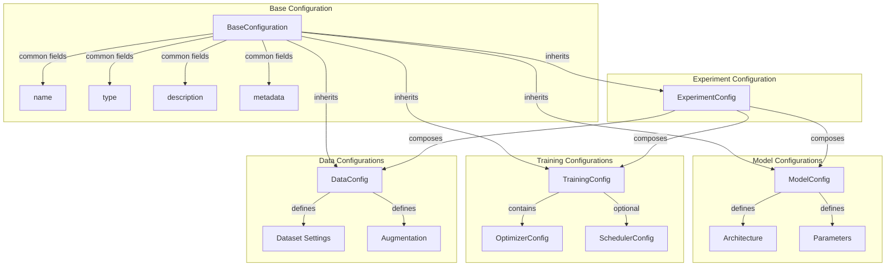

# Configuration System

Artifex uses a unified, type-safe configuration system built on Pydantic. This system provides validation, serialization, and a consistent interface across all components.

<div class="grid cards" markdown>

- :material-shield-check: **Type-Safe**

    ---

    Pydantic validation ensures correctness at creation time

- :material-file-code: **Serializable**

    ---

    Easy save/load to YAML or JSON formats

- :material-puzzle: **Composable**

    ---

    Hierarchical configs with inheritance and merging

- :material-book-open: **Self-Documenting**

    ---

    Field descriptions and constraints built-in

</div>

## Configuration Architecture

The configuration system is organized hierarchically:



## BaseConfiguration

All configurations inherit from `BaseConfiguration`:

```python
from artifex.generative_models.core.configuration import BaseConfiguration
from pydantic import Field

class BaseConfiguration:
    """Base class for all configurations."""

    # Core fields
    name: str = Field(..., description="Unique name")
    type: ConfigurationType = Field(..., description="Configuration type")
    description: str | None = Field(None, description="Human-readable description")
    version: str = Field("1.0.0", description="Configuration version")

    # Metadata
    tags: list[str] = Field(default_factory=list, description="Tags for categorization")
    metadata: dict[str, Any] = Field(
        default_factory=dict,
        description="Non-functional metadata for tracking"
    )
```

**Key Features:**

- **Required Fields**: `name` and `type` are required
- **Optional Metadata**: Non-functional information for tracking
- **Version Control**: Built-in versioning support
- **Tags**: For organizing and searching configurations

### YAML Serialization

Save and load configurations from YAML:

```python
from artifex.generative_models.core.configuration import ModelConfig
from pathlib import Path

# Create configuration
config = ModelConfig(
    name="vae_config",
    model_class="artifex.generative_models.models.vae.base.VAE",
    input_dim=(28, 28, 1),
    hidden_dims=[256, 128],
    output_dim=64,
    parameters={"beta": 1.0},
)

# Save to YAML
config.to_yaml("configs/vae_config.yaml")

# Load from YAML
loaded_config = ModelConfig.from_yaml("configs/vae_config.yaml")

assert config.name == loaded_config.name
```

Example YAML file:

```yaml
name: vae_config
type: model
model_class: artifex.generative_models.models.vae.base.VAE
input_dim: [28, 28, 1]
hidden_dims: [256, 128]
output_dim: 64
activation: gelu
dropout_rate: 0.1
use_batch_norm: true
parameters:
  beta: 1.0
rngs_seeds:
  params: 0
  dropout: 1
```

### Configuration Merging

Merge configurations for easy experimentation:

```python
# Base configuration
base_config = ModelConfig(
    name="base_vae",
    model_class="artifex.generative_models.models.vae.base.VAE",
    input_dim=(28, 28, 1),
    hidden_dims=[256, 128],
    output_dim=64,
)

# Override specific fields
overrides = {
    "hidden_dims": [512, 256, 128],
    "output_dim": 128,
    "parameters": {"beta": 2.0},
}

# Merge configurations
new_config = base_config.merge(overrides)

print(new_config.hidden_dims)  # [512, 256, 128]
print(new_config.parameters)   # {"beta": 2.0}
```

## ModelConfig

`ModelConfig` defines model architecture and parameters:

```python
from artifex.generative_models.core.configuration import ModelConfig

config = ModelConfig(
    name="my_vae",
    model_class="artifex.generative_models.models.vae.base.VAE",

    # Architecture
    input_dim=(28, 28, 1),
    hidden_dims=[512, 256, 128],
    output_dim=64,

    # Common parameters
    activation="gelu",
    dropout_rate=0.1,
    use_batch_norm=True,

    # RNG seeds for reproducibility
    rngs_seeds={"params": 42, "dropout": 1},

    # Model-specific parameters
    parameters={
        "beta": 1.0,  # VAE beta parameter
        "kl_weight": 0.5,
    },

    # Optional metadata
    metadata={
        "experiment_id": "exp_001",
        "notes": "Testing higher latent dim",
    },
)
```

### Field Reference

| Field | Type | Required | Description |
|-------|------|----------|-------------|
| `name` | `str` | ✅ | Unique configuration name |
| `model_class` | `str` | ✅ | Fully qualified model class |
| `input_dim` | `int \| tuple` | ✅ | Input dimensions |
| `hidden_dims` | `list[int]` | ❌ | Hidden layer dimensions |
| `output_dim` | `int \| tuple` | ❌ | Output dimensions |
| `activation` | `str` | ❌ | Activation function |
| `dropout_rate` | `float` | ❌ | Dropout rate |
| `use_batch_norm` | `bool` | ❌ | Use batch normalization |
| `rngs_seeds` | `dict[str, int]` | ❌ | RNG seeds |
| `parameters` | `dict[str, Any]` | ❌ | Model-specific params |

### Parameters vs Metadata

**Important Distinction:**

```python
# CORRECT: Use parameters for functional configuration
config = ModelConfig(
    name="vae",
    model_class="...",
    input_dim=(28, 28, 1),
    # Functional parameters that affect model behavior
    parameters={
        "beta": 1.0,
        "kl_weight": 0.5,
        "reconstruction_loss": "mse",
    },
    # Non-functional metadata for tracking
    metadata={
        "experiment_id": "exp_001",
        "dataset_version": "v2.1",
        "notes": "Testing lower KL weight",
    }
)

# WRONG: Don't nest model parameters in metadata
config = ModelConfig(
    name="vae",
    model_class="...",
    input_dim=(28, 28, 1),
    metadata={
        "vae_params": {"beta": 1.0}  # DON'T DO THIS
    }
)
```

**Guidelines:**

- `parameters`: Functional configuration affecting model behavior
- `metadata`: Non-functional information for experiment tracking

### Model-Specific Parameters

Different models require different parameters:

```python
# VAE configuration
vae_config = ModelConfig(
    name="vae",
    model_class="artifex.generative_models.models.vae.base.VAE",
    input_dim=(28, 28, 1),
    hidden_dims=[256, 128],
    output_dim=64,
    parameters={
        "beta": 1.0,              # KL weight
        "kl_weight": 0.5,         # Additional KL scaling
    },
)

# GAN configuration
gan_config = ModelConfig(
    name="gan",
    model_class="artifex.generative_models.models.gan.base.GAN",
    input_dim=(28, 28, 1),
    hidden_dims=[256, 128],
    output_dim=(28, 28, 1),
    parameters={
        "noise_dim": 100,         # Latent noise dimension
        "label_smoothing": 0.1,   # Label smoothing for discriminator
    },
)

# Diffusion configuration
diffusion_config = ModelConfig(
    name="diffusion",
    model_class="artifex.generative_models.models.diffusion.ddpm.DDPM",
    input_dim=(28, 28, 1),
    hidden_dims=[128, 256, 512],
    output_dim=(28, 28, 1),
    parameters={
        "noise_steps": 1000,      # Diffusion steps
        "beta_start": 0.0001,     # Noise schedule start
        "beta_end": 0.02,         # Noise schedule end
        "schedule_type": "linear", # Noise schedule type
    },
)

# Flow configuration
flow_config = ModelConfig(
    name="flow",
    model_class="artifex.generative_models.models.flow.realnvp.RealNVP",
    input_dim=(28, 28, 1),
    hidden_dims=[256, 256],
    output_dim=(28, 28, 1),
    parameters={
        "num_coupling_layers": 8,  # Number of coupling layers
        "mask_type": "checkerboard", # Coupling mask pattern
    },
)
```

## OptimizerConfig

Configure optimizers with full type safety:

```python
from artifex.generative_models.core.configuration import OptimizerConfig

# Adam optimizer (recommended)
adam_config = OptimizerConfig(
    name="adam_optimizer",
    optimizer_type="adam",
    learning_rate=1e-3,
    beta1=0.9,
    beta2=0.999,
    eps=1e-8,
)

# AdamW with weight decay
adamw_config = OptimizerConfig(
    name="adamw_optimizer",
    optimizer_type="adamw",
    learning_rate=3e-4,
    weight_decay=0.01,
    beta1=0.9,
    beta2=0.999,
)

# SGD with momentum
sgd_config = OptimizerConfig(
    name="sgd_optimizer",
    optimizer_type="sgd",
    learning_rate=0.1,
    momentum=0.9,
    nesterov=True,
)

# RMSProp
rmsprop_config = OptimizerConfig(
    name="rmsprop_optimizer",
    optimizer_type="rmsprop",
    learning_rate=1e-3,
    initial_accumulator_value=0.1,
)
```

### Gradient Clipping

Add gradient clipping to any optimizer:

```python
# Clip by global norm (recommended)
clipped_adam = OptimizerConfig(
    name="clipped_adam",
    optimizer_type="adam",
    learning_rate=1e-3,
    gradient_clip_norm=1.0,  # Clip to norm of 1.0
)

# Clip by value
value_clipped = OptimizerConfig(
    name="value_clipped",
    optimizer_type="adam",
    learning_rate=1e-3,
    gradient_clip_value=0.5,  # Clip values to [-0.5, 0.5]
)
```

### Optimizer Field Reference

| Field | Type | Required | Description |
|-------|------|----------|-------------|
| `optimizer_type` | `str` | ✅ | Optimizer type (adam, adamw, sgd, etc.) |
| `learning_rate` | `float` | ✅ | Learning rate (must be > 0) |
| `weight_decay` | `float` | ❌ | Weight decay (L2 penalty) |
| `beta1` | `float` | ❌ | Beta1 for Adam (default: 0.9) |
| `beta2` | `float` | ❌ | Beta2 for Adam (default: 0.999) |
| `eps` | `float` | ❌ | Epsilon for numerical stability |
| `momentum` | `float` | ❌ | Momentum for SGD |
| `nesterov` | `bool` | ❌ | Use Nesterov momentum |
| `gradient_clip_norm` | `float \| None` | ❌ | Gradient clipping by norm |
| `gradient_clip_value` | `float \| None` | ❌ | Gradient clipping by value |

## SchedulerConfig

Configure learning rate schedules:

```python
from artifex.generative_models.core.configuration import SchedulerConfig

# Cosine schedule with warmup (recommended)
cosine_schedule = SchedulerConfig(
    name="cosine_warmup",
    scheduler_type="cosine",
    warmup_steps=1000,
    cycle_length=50000,
    min_lr_ratio=0.1,
)

# Linear decay
linear_schedule = SchedulerConfig(
    name="linear_decay",
    scheduler_type="linear",
    warmup_steps=500,
    total_steps=10000,
    min_lr_ratio=0.0,
)

# Exponential decay
exponential_schedule = SchedulerConfig(
    name="exponential",
    scheduler_type="exponential",
    decay_rate=0.95,
    decay_steps=1000,
)

# Step decay
step_schedule = SchedulerConfig(
    name="step_decay",
    scheduler_type="step",
    step_size=5000,
    gamma=0.1,
)

# MultiStep decay
multistep_schedule = SchedulerConfig(
    name="multistep",
    scheduler_type="multistep",
    milestones=[10000, 20000, 30000],
    gamma=0.1,
)
```

### Scheduler Field Reference

| Field | Type | Required | Description |
|-------|------|----------|-------------|
| `scheduler_type` | `str` | ✅ | Schedule type (cosine, linear, etc.) |
| `warmup_steps` | `int` | ❌ | Number of warmup steps |
| `min_lr_ratio` | `float` | ❌ | Minimum LR as ratio of initial |
| `cycle_length` | `int \| None` | ❌ | Cycle length for cosine |
| `total_steps` | `int \| None` | ❌ | Total steps for linear |
| `decay_rate` | `float` | ❌ | Decay rate for exponential |
| `decay_steps` | `int` | ❌ | Decay steps for exponential |
| `step_size` | `int` | ❌ | Step size for step schedule |
| `gamma` | `float` | ❌ | Gamma for step/multistep |
| `milestones` | `list[int]` | ❌ | Milestones for multistep |

## TrainingConfig

Compose training configurations from optimizer and scheduler:

```python
from artifex.generative_models.core.configuration import (
    TrainingConfig,
    OptimizerConfig,
    SchedulerConfig,
)

# Create optimizer config
optimizer = OptimizerConfig(
    name="adamw",
    optimizer_type="adamw",
    learning_rate=3e-4,
    weight_decay=0.01,
    gradient_clip_norm=1.0,
)

# Create scheduler config
scheduler = SchedulerConfig(
    name="cosine_warmup",
    scheduler_type="cosine",
    warmup_steps=1000,
    cycle_length=50000,
    min_lr_ratio=0.1,
)

# Compose training configuration
training_config = TrainingConfig(
    name="vae_training",
    batch_size=128,
    num_epochs=100,
    optimizer=optimizer,        # Required
    scheduler=scheduler,        # Optional
    save_frequency=5000,
    log_frequency=100,
    checkpoint_dir="./checkpoints",
    max_checkpoints=5,
    use_wandb=False,
)
```

### Training Field Reference

| Field | Type | Required | Description |
|-------|------|----------|-------------|
| `batch_size` | `int` | ✅ | Batch size (must be ≥ 1) |
| `num_epochs` | `int` | ✅ | Number of epochs (must be ≥ 1) |
| `optimizer` | `OptimizerConfig` | ✅ | Optimizer configuration |
| `scheduler` | `SchedulerConfig \| None` | ❌ | LR scheduler configuration |
| `gradient_clip_norm` | `float \| None` | ❌ | Global gradient clipping norm |
| `checkpoint_dir` | `Path` | ❌ | Checkpoint directory |
| `save_frequency` | `int` | ❌ | Save checkpoint every N steps |
| `max_checkpoints` | `int` | ❌ | Maximum checkpoints to keep |
| `log_frequency` | `int` | ❌ | Log metrics every N steps |
| `use_wandb` | `bool` | ❌ | Use Weights & Biases |
| `wandb_project` | `str \| None` | ❌ | W&B project name |

## DataConfig

Configure data loading and preprocessing:

```python
from artifex.generative_models.core.configuration import DataConfig
from pathlib import Path

data_config = DataConfig(
    name="mnist_data",
    dataset_name="mnist",
    data_dir=Path("./data"),
    split="train",

    # Data loading
    num_workers=4,
    prefetch_factor=2,
    pin_memory=True,

    # Data splits
    validation_split=0.1,
    test_split=0.1,

    # Augmentation
    augmentation=True,
    augmentation_params={
        "random_flip": True,
        "random_rotation": 15,
        "random_crop": True,
    },
)
```

## ExperimentConfig

Compose complete experiments:

```python
from artifex.generative_models.core.configuration import (
    ExperimentConfig,
    ModelConfig,
    TrainingConfig,
    DataConfig,
)

# Create component configurations
model_config = ModelConfig(...)
training_config = TrainingConfig(...)
data_config = DataConfig(...)

# Compose experiment
experiment = ExperimentConfig(
    name="vae_experiment_001",
    model_cfg=model_config,
    training_cfg=training_config,
    data_cfg=data_config,

    # Experiment settings
    seed=42,
    deterministic=True,
    output_dir=Path("./experiments/vae_001"),

    # Tracking
    track_carbon=True,
    track_memory=True,

    # Metadata
    description="Baseline VAE experiment on MNIST",
    tags=["vae", "mnist", "baseline"],
)
```

## Configuration Registry

Manage configurations centrally:

```python
from artifex.generative_models.core.configuration import (
    ConfigurationRegistry,
    ConfigurationType,
)

# Create registry
registry = ConfigurationRegistry()

# Register configurations
registry.register(model_config)
registry.register(training_config)
registry.register(data_config)

# Retrieve configurations
retrieved_model = registry.get("vae_config", ConfigurationType.MODEL)
retrieved_training = registry.get("vae_training", ConfigurationType.TRAINING)

# List all configurations
all_configs = registry.list_configs()
print(all_configs)  # ['model/vae_config', 'training/vae_training', ...]

# List by type
model_configs = registry.list_configs(ConfigurationType.MODEL)
print(model_configs)  # ['vae_config', 'gan_config', ...]
```

### Loading from Directory

Load all configurations from a directory:

```python
# Directory structure:
# configs/
#   ├── model_vae.yaml
#   ├── model_gan.yaml
#   ├── training_default.yaml
#   ├── training_fast.yaml
#   └── data_mnist.yaml

registry = ConfigurationRegistry()
registry.load_from_directory("./configs")

# All configurations automatically registered
vae_config = registry.get("vae", ConfigurationType.MODEL)
default_training = registry.get("default", ConfigurationType.TRAINING)
```

## Configuration Templates

Create reusable configuration templates:

```python
# Register template
registry.register_template(
    name="standard_vae_template",
    template={
        "model_class": "artifex.generative_models.models.vae.base.VAE",
        "activation": "gelu",
        "dropout_rate": 0.1,
        "use_batch_norm": True,
        "parameters": {
            "beta": 1.0,
        },
    }
)

# Create configuration from template
vae_config = registry.create_from_template(
    template_name="standard_vae_template",
    config_class=ModelConfig,
    # Override specific fields
    name="my_vae",
    input_dim=(28, 28, 1),
    hidden_dims=[256, 128],
    output_dim=64,
)
```

## Custom Configurations

Create custom configuration classes:

```python
from artifex.generative_models.core.configuration import (
    BaseConfiguration,
    ConfigurationType,
)
from pydantic import Field

class ProteinModelConfig(BaseConfiguration):
    """Configuration for protein modeling."""

    type: ConfigurationType = Field(ConfigurationType.MODEL, frozen=True)

    # Protein-specific fields
    sequence_length: int = Field(..., description="Protein sequence length")
    num_residues: int = Field(20, description="Number of residue types")
    secondary_structure: bool = Field(True, description="Use secondary structure")

    # Structure prediction
    num_recycles: int = Field(3, description="Number of recycle iterations")
    use_templates: bool = Field(False, description="Use template structures")

    # Custom validation
    @field_validator("sequence_length")
    def validate_sequence_length(cls, v):
        if v <= 0 or v > 10000:
            raise ValueError("sequence_length must be in (0, 10000]")
        return v

# Use custom configuration
protein_config = ProteinModelConfig(
    name="alphafold_like",
    sequence_length=256,
    num_residues=20,
    secondary_structure=True,
    num_recycles=3,
)
```

## Configuration Validation

Pydantic automatically validates configurations:

```python
from pydantic import ValidationError

try:
    # Invalid optimizer type
    bad_config = OptimizerConfig(
        name="bad_optimizer",
        optimizer_type="invalid_type",  # Not a valid optimizer
        learning_rate=1e-3,
    )
except ValidationError as e:
    print(e)
    # ValidationError: optimizer_type must be one of {...}

try:
    # Invalid learning rate
    bad_config = OptimizerConfig(
        name="bad_lr",
        optimizer_type="adam",
        learning_rate=-1.0,  # Must be > 0
    )
except ValidationError as e:
    print(e)
    # ValidationError: learning_rate must be greater than 0

try:
    # Invalid batch size
    bad_config = TrainingConfig(
        name="bad_batch",
        batch_size=0,  # Must be >= 1
        num_epochs=10,
        optimizer=optimizer_config,
    )
except ValidationError as e:
    print(e)
    # ValidationError: batch_size must be greater than or equal to 1
```

### Custom Validators

Add custom validation logic:

```python
from pydantic import field_validator

class CustomModelConfig(ModelConfig):
    """Model configuration with custom validation."""

    @field_validator("hidden_dims")
    def validate_hidden_dims(cls, v):
        """Ensure hidden dims are decreasing."""
        if not all(v[i] >= v[i+1] for i in range(len(v)-1)):
            raise ValueError("hidden_dims must be non-increasing")
        return v

    @field_validator("dropout_rate")
    def validate_dropout(cls, v):
        """Ensure reasonable dropout rate."""
        if v < 0.0 or v > 0.5:
            raise ValueError("dropout_rate should be in [0.0, 0.5]")
        return v

# Valid configuration
config = CustomModelConfig(
    name="valid",
    model_class="...",
    input_dim=(28, 28, 1),
    hidden_dims=[512, 256, 128],  # Decreasing
    output_dim=64,
    dropout_rate=0.2,  # Reasonable
)

# Invalid configuration
try:
    config = CustomModelConfig(
        name="invalid",
        model_class="...",
        input_dim=(28, 28, 1),
        hidden_dims=[128, 256, 512],  # Increasing!
        output_dim=64,
    )
except ValidationError as e:
    print("Validation failed:", e)
```

## Best Practices

### Configuration Organization

Organize configurations by purpose:

```
configs/
├── models/
│   ├── vae_small.yaml
│   ├── vae_large.yaml
│   ├── gan_dcgan.yaml
│   └── diffusion_ddpm.yaml
├── training/
│   ├── fast_training.yaml
│   ├── default_training.yaml
│   └── long_training.yaml
├── data/
│   ├── mnist.yaml
│   ├── cifar10.yaml
│   └── imagenet.yaml
└── experiments/
    ├── exp_001.yaml
    ├── exp_002.yaml
    └── exp_003.yaml
```

### Naming Conventions

Use clear, descriptive names:

```python
# Good names
config = ModelConfig(name="vae_beta10_mnist")
config = TrainingConfig(name="fast_training_10epochs")
config = OptimizerConfig(name="adam_lr1e3_clip1")

# Bad names
config = ModelConfig(name="config1")
config = TrainingConfig(name="training")
config = OptimizerConfig(name="opt")
```

### Version Control

Track configuration versions:

```python
config = ModelConfig(
    name="vae_v2",
    model_class="...",
    input_dim=(28, 28, 1),
    version="2.0.0",  # Semantic versioning
    description="Second iteration with larger latent dimension",
    tags=["vae", "v2", "production"],
    metadata={
        "previous_version": "1.0.0",
        "changes": "Increased latent dimension from 32 to 64",
        "author": "research_team",
    },
)
```

### Environment-Specific Configs

Use different configs for different environments:

```python
# Development config (fast iteration)
dev_training = TrainingConfig(
    name="dev_training",
    batch_size=32,
    num_epochs=5,
    optimizer=OptimizerConfig(
        name="dev_adam",
        optimizer_type="adam",
        learning_rate=1e-3,
    ),
    save_frequency=100,  # Save frequently
    log_frequency=10,    # Log often
)

# Production config (full training)
prod_training = TrainingConfig(
    name="prod_training",
    batch_size=128,
    num_epochs=100,
    optimizer=OptimizerConfig(
        name="prod_adam",
        optimizer_type="adam",
        learning_rate=3e-4,
    ),
    save_frequency=5000,  # Save less often
    log_frequency=100,    # Log less often
)
```

### Configuration Inheritance

Create base configs and override:

```python
# Base VAE configuration
base_vae = ModelConfig(
    name="base_vae",
    model_class="artifex.generative_models.models.vae.base.VAE",
    activation="gelu",
    dropout_rate=0.1,
    use_batch_norm=True,
)

# Small VAE (for quick experiments)
small_vae = base_vae.merge({
    "name": "small_vae",
    "input_dim": (28, 28, 1),
    "hidden_dims": [128, 64],
    "output_dim": 16,
})

# Large VAE (for final training)
large_vae = base_vae.merge({
    "name": "large_vae",
    "input_dim": (28, 28, 1),
    "hidden_dims": [512, 256, 128],
    "output_dim": 128,
})
```

## Common Patterns

### Hyperparameter Sweeps

Configure hyperparameter searches:

```python
def create_config_sweep(base_config, param_ranges):
    """Create configurations for hyperparameter sweep."""
    configs = []

    import itertools

    # Get all parameter combinations
    keys = list(param_ranges.keys())
    values = list(param_ranges.values())

    for combination in itertools.product(*values):
        params = dict(zip(keys, combination))

        # Create config name
        name_parts = [f"{k}_{v}" for k, v in params.items()]
        config_name = f"{base_config.name}_{'_'.join(name_parts)}"

        # Merge with base config
        new_config = base_config.merge({
            "name": config_name,
            **params,
        })

        configs.append(new_config)

    return configs

# Define base configuration
base_config = TrainingConfig(
    name="base",
    batch_size=128,
    num_epochs=50,
    optimizer=OptimizerConfig(
        name="adam",
        optimizer_type="adam",
        learning_rate=1e-3,
    ),
)

# Define parameter ranges
param_ranges = {
    "batch_size": [32, 64, 128],
    "optimizer.learning_rate": [1e-4, 1e-3, 1e-2],
}

# Generate sweep configurations
sweep_configs = create_config_sweep(base_config, param_ranges)

# Train with each configuration
for config in sweep_configs:
    print(f"Training with config: {config.name}")
    trainer = Trainer(model=model, training_config=config)
    trainer.train_epoch()
```

### A/B Testing

Compare different configurations:

```python
# Configuration A (current)
config_a = TrainingConfig(
    name="config_a_current",
    batch_size=128,
    num_epochs=100,
    optimizer=OptimizerConfig(
        name="adam",
        optimizer_type="adam",
        learning_rate=1e-3,
    ),
)

# Configuration B (experimental)
config_b = TrainingConfig(
    name="config_b_experimental",
    batch_size=256,
    num_epochs=100,
    optimizer=OptimizerConfig(
        name="adamw",
        optimizer_type="adamw",
        learning_rate=3e-4,
        weight_decay=0.01,
    ),
    scheduler=SchedulerConfig(
        name="cosine",
        scheduler_type="cosine",
        warmup_steps=1000,
    ),
)

# Train and compare
results = {}
for config in [config_a, config_b]:
    trainer = Trainer(model=model, training_config=config)
    metrics = trainer.train_epoch()
    results[config.name] = metrics

# Compare results
print(f"Config A Loss: {results['config_a_current']['loss']:.4f}")
print(f"Config B Loss: {results['config_b_experimental']['loss']:.4f}")
```

## Summary

The Artifex configuration system provides:

- ✅ **Type Safety**: Pydantic validation catches errors early
- ✅ **Serialization**: Easy YAML/JSON save/load
- ✅ **Composability**: Hierarchical configs with inheritance
- ✅ **Validation**: Built-in and custom validators
- ✅ **Self-Documentation**: Field descriptions and constraints
- ✅ **Flexibility**: Easy to extend with custom configurations

## Next Steps

<div class="grid cards" markdown>

- :material-book-open-variant: **[Training Guide](training-guide.md)**

    ---

    Practical training examples and advanced patterns

- :material-rocket: **[Training Overview](overview.md)**

    ---

    Architecture and core concepts of training system

- :material-api: **[Trainer API](../../api/training/trainer.md)**

    ---

    Complete API reference for Trainer class

</div>

---

*Continue to the [Trainer API Reference](../../api/training/trainer.md) for complete API documentation.*
