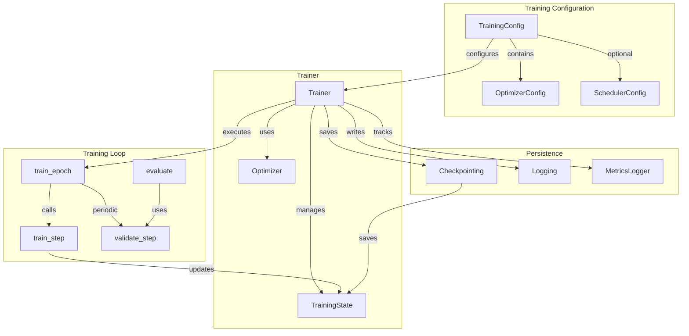
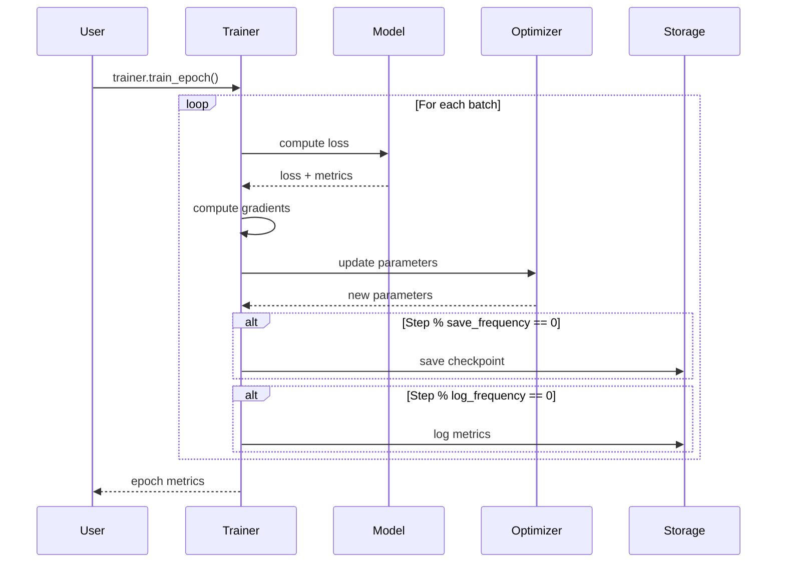

# Training System Overview

Artifex provides a robust training system built on JAX/Flax NNX, working towards production-ready status. The training infrastructure handles the complete training lifecycle, from model initialization to checkpointing and evaluation.

<div class="grid cards" markdown>

- :material-rocket-launch: **Easy to Use**

    ---

    Simple, intuitive API for training any generative model with sensible defaults

- :material-cog: **Highly Configurable**

    ---

    Type-safe configuration system with Pydantic validation and YAML support

- :material-scale-balance: **Flexible**

    ---

    Support for custom training loops, optimizers, and learning rate schedules

- :material-gauge: **Research-Focused**

    ---

    Checkpointing, resuming, logging, and metrics tracking built-in for experimentation

</div>

## Training Architecture

The Artifex training system follows a modular, composable architecture:



## Core Components

### 1. Trainer

The `Trainer` class is the central component for training generative models:

```python
from artifex.generative_models.training import Trainer
from artifex.generative_models.core.configuration import (
    TrainingConfig,
    OptimizerConfig,
)

# Create optimizer configuration
optimizer_config = OptimizerConfig(
    name="adam_optimizer",
    optimizer_type="adam",
    learning_rate=1e-3,
    gradient_clip_norm=1.0,
)

# Create training configuration
training_config = TrainingConfig(
    name="vae_training",
    batch_size=128,
    num_epochs=100,
    optimizer=optimizer_config,
    save_frequency=1000,
    log_frequency=100,
)

# Initialize trainer
trainer = Trainer(
    model=model,
    training_config=training_config,
    train_data_loader=train_loader,
    val_data_loader=val_loader,
    workdir="./experiments/vae",
)
```

**Key Features:**

- **Type-Safe Configuration**: Uses Pydantic-based configuration with validation
- **Automatic Setup**: Handles optimizer initialization, state management, and checkpointing
- **Flexible Training**: Supports custom loss functions and training loops
- **Built-in Logging**: Integrates with Artifex's logging system and external trackers
- **Checkpointing**: Automatic saving and loading of training state

### 2. TrainingState

The `TrainingState` is a PyTree that holds all training state:

```python
from artifex.generative_models.training.trainer import TrainingState

state = TrainingState.create(
    params=model_params,
    opt_state=optimizer.init(model_params),
    rng=jax.random.PRNGKey(42),
    step=0,
    best_loss=float("inf"),
)
```

**Components:**

- `params`: Model parameters
- `opt_state`: Optimizer state
- `rng`: JAX random number generator
- `step`: Current training step
- `best_loss`: Best validation loss (for early stopping)

**Benefits:**

- JAX-compatible PyTree structure
- Easy to save/load with checkpointing
- Immutable updates for functional programming
- Integrates with JAX transformations (jit, grad, etc.)

### 3. Configuration System

Artifex uses a unified, type-safe configuration system based on Pydantic:

```python
from artifex.generative_models.core.configuration import (
    TrainingConfig,
    OptimizerConfig,
    SchedulerConfig,
)

# Optimizer configuration
optimizer = OptimizerConfig(
    name="adamw_optimizer",
    optimizer_type="adamw",
    learning_rate=3e-4,
    weight_decay=0.01,
    beta1=0.9,
    beta2=0.999,
)

# Learning rate scheduler
scheduler = SchedulerConfig(
    name="cosine_scheduler",
    scheduler_type="cosine",
    warmup_steps=1000,
    cycle_length=10000,
    min_lr_ratio=0.1,
)

# Complete training configuration
training_config = TrainingConfig(
    name="diffusion_training",
    batch_size=64,
    num_epochs=200,
    optimizer=optimizer,
    scheduler=scheduler,
    gradient_clip_norm=1.0,
    save_frequency=5000,
)
```

**Advantages:**

- **Type Safety**: Pydantic validates all fields at creation
- **IDE Support**: Full autocompletion and type checking
- **Serialization**: Easy YAML/JSON save/load
- **Validation**: Built-in constraints and custom validators
- **Documentation**: Self-documenting with field descriptions

See [Configuration Guide](configuration.md) for complete details.

## Training Loop Mechanics

### Basic Training Flow



### Training Step

The core training step is JIT-compiled for performance:

```python
def _train_step(state, batch):
    """Single training step (JIT-compiled)."""
    rng, step_rng = jax.random.split(state["rng"])

    # Define loss function
    def loss_fn(params):
        loss, metrics = model.loss_fn(params, batch, step_rng)
        return loss, metrics

    # Compute gradients
    (loss, metrics), grads = jax.value_and_grad(
        loss_fn, has_aux=True
    )(state["params"])

    # Update parameters
    updates, opt_state = optimizer.update(
        grads, state["opt_state"], state["params"]
    )
    params = optax.apply_updates(state["params"], updates)

    # Create new state
    new_state = {
        "step": state["step"] + 1,
        "params": params,
        "opt_state": opt_state,
        "rng": rng,
    }

    return new_state, metrics
```

**Key Points:**

1. **Functional Style**: Pure function with immutable updates
2. **JIT Compilation**: Compiled once, runs fast
3. **RNG Splitting**: Proper random number handling
4. **Gradient Computation**: Uses `jax.value_and_grad` for efficiency
5. **State Updates**: Returns new state (immutable)

### Validation Step

Validation uses the same loss function without updates:

```python
def _validate_step(state, batch):
    """Single validation step."""
    _, val_rng = jax.random.split(state["rng"])

    # Compute validation loss (no gradients)
    loss, metrics = model.loss_fn(state["params"], batch, val_rng)
    metrics["loss"] = loss

    return metrics
```

### Epoch Training

An epoch iterates over the entire dataset:

```python
def train_epoch(trainer):
    """Train for one epoch."""
    data_iter = trainer.train_data_loader(trainer.training_config.batch_size)
    epoch_metrics = []

    for _ in range(trainer.steps_per_epoch):
        batch = next(data_iter)

        # Training step
        trainer.state, metrics = trainer.train_step_fn(trainer.state, batch)
        epoch_metrics.append(metrics)

        # Periodic checkpointing
        if trainer.state["step"] % trainer.training_config.save_frequency == 0:
            trainer.save_checkpoint()

    # Average metrics
    avg_metrics = {
        key: sum(m[key] for m in epoch_metrics) / len(epoch_metrics)
        for key in epoch_metrics[0].keys()
        if key != "step"
    }

    return avg_metrics
```

## Checkpointing

### Automatic Checkpointing

Checkpoints are automatically saved during training:

```python
# Configure checkpointing
training_config = TrainingConfig(
    name="my_training",
    batch_size=32,
    num_epochs=100,
    optimizer=optimizer_config,
    checkpoint_dir="./checkpoints",
    save_frequency=1000,  # Save every 1000 steps
    max_checkpoints=5,    # Keep last 5 checkpoints
)

trainer = Trainer(
    model=model,
    training_config=training_config,
)

# Training automatically saves checkpoints
trainer.train_epoch()
```

### Manual Checkpointing

Save and load checkpoints manually:

```python
# Save checkpoint
trainer.save_checkpoint("./checkpoints/my_checkpoint.pkl")

# Load checkpoint
trainer.load_checkpoint("./checkpoints/my_checkpoint.pkl")

# Resume training
trainer.train_epoch()  # Continues from loaded state
```

### Checkpoint Contents

Each checkpoint contains the complete training state:

```python
{
    "step": 5000,
    "params": {...},      # Model parameters
    "opt_state": {...},   # Optimizer state
    "rng": Array(...),    # RNG state
}
```

**Best Practices:**

- Save checkpoints to fast storage (SSD) for quick I/O
- Use `max_checkpoints` to limit disk usage
- Save best model separately based on validation metrics
- Include step number in checkpoint filenames
- Test checkpoint loading before long training runs

## Logging and Monitoring

### Built-in Logging

Artifex includes structured logging:

```python
from artifex.generative_models.utils.logging import Logger, MetricsLogger

# Create loggers
logger = Logger(log_dir="./logs")
metrics_logger = MetricsLogger(log_dir="./logs/metrics")

# Initialize trainer with loggers
trainer = Trainer(
    model=model,
    training_config=training_config,
    logger=logger,
    metrics_logger=metrics_logger,
)

# Logs are written automatically during training
trainer.train_epoch()
```

### Custom Logging Callbacks

Implement custom logging with callbacks:

```python
def custom_log_callback(step, metrics, prefix="train"):
    """Custom logging function."""
    print(f"[{prefix}] Step {step}: Loss = {metrics['loss']:.4f}")

    # Log to external system (e.g., wandb, tensorboard)
    if wandb_enabled:
        wandb.log({f"{prefix}/{k}": v for k, v in metrics.items()}, step=step)

trainer = Trainer(
    model=model,
    training_config=training_config,
    log_callback=custom_log_callback,
)
```

### Metrics Tracking

The trainer automatically tracks:

- **Training Loss**: Loss value for each batch
- **Validation Loss**: Periodic validation metrics
- **Learning Rate**: Current learning rate (with schedulers)
- **Gradient Norms**: L2 norm of gradients
- **Model-Specific Metrics**: KL divergence, reconstruction loss, etc.

Example metrics access:

```python
# Train for an epoch
metrics = trainer.train_epoch()

print(f"Epoch loss: {metrics['loss']:.4f}")

# Access training history
for step, metric in enumerate(trainer.train_metrics):
    print(f"Step {step}: {metric['loss']:.4f}")

# Validation metrics
val_metrics = trainer.evaluate(val_data, batch_size=64)
print(f"Validation loss: {val_metrics['loss']:.4f}")
```

## Optimizers

Artifex supports multiple optimizers through Optax:

### Available Optimizers

| Optimizer | Best For | Key Parameters |
|-----------|----------|----------------|
| **Adam** | General purpose, most models | `learning_rate`, `beta1`, `beta2` |
| **AdamW** | Transformers, weight decay needed | `learning_rate`, `weight_decay` |
| **SGD** | Large batch training, momentum | `learning_rate`, `momentum` |
| **RMSProp** | RNNs, non-stationary objectives | `learning_rate`, `decay` |
| **AdaGrad** | Sparse gradients, NLP | `learning_rate` |

### Optimizer Configuration

```python
# Adam optimizer
adam_config = OptimizerConfig(
    name="adam",
    optimizer_type="adam",
    learning_rate=1e-3,
    beta1=0.9,
    beta2=0.999,
    eps=1e-8,
)

# AdamW with weight decay
adamw_config = OptimizerConfig(
    name="adamw",
    optimizer_type="adamw",
    learning_rate=3e-4,
    weight_decay=0.01,
)

# SGD with momentum
sgd_config = OptimizerConfig(
    name="sgd",
    optimizer_type="sgd",
    learning_rate=0.1,
    momentum=0.9,
    nesterov=True,
)
```

### Gradient Clipping

Prevent gradient explosion with clipping:

```python
# Clip by global norm (recommended)
optimizer_config = OptimizerConfig(
    name="clipped_adam",
    optimizer_type="adam",
    learning_rate=1e-3,
    gradient_clip_norm=1.0,  # Clip to norm of 1.0
)

# Clip by value
optimizer_config = OptimizerConfig(
    name="value_clipped_adam",
    optimizer_type="adam",
    learning_rate=1e-3,
    gradient_clip_value=0.5,  # Clip values to [-0.5, 0.5]
)
```

## Learning Rate Schedules

### Available Schedules

| Schedule | Description | Use Case |
|----------|-------------|----------|
| **Constant** | Fixed learning rate | Simple training, debugging |
| **Linear** | Linear decay | Short training runs |
| **Cosine** | Cosine annealing | Most deep learning (recommended) |
| **Exponential** | Exponential decay | Traditional ML |
| **Step** | Step-wise decay | Milestone-based training |
| **MultiStep** | Multiple milestones | Fine-grained control |

### Schedule Configuration

```python
# Cosine schedule with warmup (recommended)
cosine_schedule = SchedulerConfig(
    name="cosine_warmup",
    scheduler_type="cosine",
    warmup_steps=1000,
    cycle_length=50000,
    min_lr_ratio=0.1,  # End at 10% of initial LR
)

# Linear schedule
linear_schedule = SchedulerConfig(
    name="linear_decay",
    scheduler_type="linear",
    warmup_steps=500,
    total_steps=10000,
    min_lr_ratio=0.0,  # Decay to 0
)

# Step schedule
step_schedule = SchedulerConfig(
    name="step_decay",
    scheduler_type="step",
    step_size=5000,  # Decay every 5000 steps
    gamma=0.1,       # Multiply LR by 0.1
)

# MultiStep schedule
multistep_schedule = SchedulerConfig(
    name="multistep",
    scheduler_type="multistep",
    milestones=[10000, 20000, 30000],
    gamma=0.1,
)
```

### Schedule Visualization

```python
import matplotlib.pyplot as plt
import numpy as np

def visualize_schedule(scheduler_config, base_lr=1e-3, total_steps=10000):
    """Visualize learning rate schedule."""
    schedule = create_schedule(scheduler_config, base_lr)
    steps = np.arange(total_steps)
    lrs = [schedule(step) for step in steps]

    plt.figure(figsize=(10, 4))
    plt.plot(steps, lrs)
    plt.xlabel("Step")
    plt.ylabel("Learning Rate")
    plt.title(f"{scheduler_config.scheduler_type} Schedule")
    plt.grid(True)
    plt.show()

# Visualize cosine schedule
visualize_schedule(cosine_schedule)
```

## Evaluation

Evaluate your trained model with validation data and modality-specific metrics:

```python
# Basic validation during training
val_metrics = trainer.evaluate(val_data, batch_size=128)
print(f"Validation loss: {val_metrics['loss']:.4f}")

# Model-specific metrics
if hasattr(model, 'reconstruction_loss'):
    print(f"Reconstruction loss: {val_metrics['reconstruction_loss']:.4f}")
    print(f"KL divergence: {val_metrics['kl_loss']:.4f}")
```

For comprehensive evaluation with FID, Inception Score, and other metrics, see the [Benchmarks documentation](../../benchmarks/index.md).

## Complete Training Example

Here's a complete training workflow:

```python
from artifex.generative_models.core.configuration import (
    ModelConfig,
    TrainingConfig,
    OptimizerConfig,
    SchedulerConfig,
)
from artifex.generative_models.factory import create_model
from artifex.generative_models.training import Trainer
from flax import nnx

# 1. Create model configuration
model_config = ModelConfig(
    name="vae_mnist",
    model_class="artifex.generative_models.models.vae.base.VAE",
    input_dim=(28, 28, 1),
    hidden_dims=[512, 256],
    output_dim=64,
    parameters={"beta": 1.0},
)

# 2. Initialize model
rngs = nnx.Rngs(42)
model = create_model(config=model_config, rngs=rngs)

# 3. Configure optimizer
optimizer_config = OptimizerConfig(
    name="adamw",
    optimizer_type="adamw",
    learning_rate=3e-4,
    weight_decay=0.01,
    gradient_clip_norm=1.0,
)

# 4. Configure learning rate schedule
scheduler_config = SchedulerConfig(
    name="cosine_warmup",
    scheduler_type="cosine",
    warmup_steps=1000,
    cycle_length=50000,
    min_lr_ratio=0.1,
)

# 5. Create training configuration
training_config = TrainingConfig(
    name="vae_training",
    batch_size=128,
    num_epochs=100,
    optimizer=optimizer_config,
    scheduler=scheduler_config,
    save_frequency=5000,
    log_frequency=100,
    checkpoint_dir="./checkpoints/vae",
)

# 6. Initialize trainer
trainer = Trainer(
    model=model,
    training_config=training_config,
    train_data_loader=train_loader,
    val_data_loader=val_loader,
    workdir="./experiments/vae",
)

# 7. Train
for epoch in range(training_config.num_epochs):
    # Train epoch
    train_metrics = trainer.train_epoch()
    print(f"Epoch {epoch + 1}: Train Loss = {train_metrics['loss']:.4f}")

    # Validate
    val_metrics = trainer.evaluate(val_data, batch_size=128)
    print(f"Epoch {epoch + 1}: Val Loss = {val_metrics['loss']:.4f}")

    # Save best model
    if val_metrics['loss'] < trainer.state.get('best_loss', float('inf')):
        trainer.save_checkpoint(f"./checkpoints/vae/best_model.pkl")

# 8. Generate samples
samples = trainer.generate_samples(num_samples=16)
```

## Key Design Principles

### 1. Functional Programming

The training system uses functional programming principles:

- **Immutable Updates**: States are never modified in-place
- **Pure Functions**: Training steps are deterministic
- **JAX Transformations**: Compatible with jit, grad, vmap, pmap

```python
# Immutable state updates
new_state = {**old_state, "step": old_state["step"] + 1}

# Pure function (same inputs → same outputs)
@jax.jit
def train_step(state, batch):
    # No side effects
    return new_state, metrics
```

### 2. Type Safety

All configurations use Pydantic for type safety:

```python
# Type-safe configuration
config = TrainingConfig(
    name="my_training",
    batch_size=32,        # int: validated
    num_epochs=100,       # int: validated
    optimizer=opt_config, # OptimizerConfig: validated
)

# Invalid configuration raises error at creation
try:
    bad_config = TrainingConfig(
        name="bad",
        batch_size="invalid",  # TypeError: not an int
    )
except ValidationError as e:
    print(e)
```

### 3. Composability

Components are designed to be composable:

```python
# Compose optimizer with gradient clipping
optimizer = optax.chain(
    optax.clip_by_global_norm(1.0),
    optax.adam(learning_rate=1e-3),
)

# Compose learning rate schedules
schedule = optax.join_schedules(
    schedules=[warmup_schedule, cosine_schedule],
    boundaries=[warmup_steps],
)

# Compose training callbacks
def composed_callback(step, metrics, prefix="train"):
    log_to_file(step, metrics, prefix)
    log_to_wandb(step, metrics, prefix)
    update_progress_bar(step, metrics)
```

### 4. JAX-First Design

Leverages JAX for performance and scalability:

- **JIT Compilation**: Training steps are JIT-compiled
- **Automatic Differentiation**: Gradients computed with `jax.grad`
- **Device Agnostic**: Runs on CPU, GPU, or TPU
- **Parallelization**: Ready for data and model parallelism

## Summary

The Artifex training system provides:

- ✅ **Type-Safe Configuration**: Pydantic-based with validation
- ✅ **Flexible Training**: Custom loops, optimizers, and schedules
- ✅ **Research-Ready Features**: Checkpointing, logging, monitoring
- ✅ **High Performance**: JIT compilation and JAX optimizations
- ✅ **Easy to Use**: Simple API with sensible defaults
- ✅ **Well-Tested**: Comprehensive test coverage

## Next Steps

<div class="grid cards" markdown>

- :material-book-open-variant: **[Training Guide](training-guide.md)**

    ---

    Practical guide with examples for common training scenarios

- :material-cog-outline: **[Configuration Guide](configuration.md)**

    ---

    Deep dive into the configuration system and best practices

- :material-api: **[Trainer API](../../api/training/trainer.md)**

    ---

    Complete API reference for the Trainer class

</div>

---

*Continue to the [Training Guide](training-guide.md) for practical examples and advanced patterns.*
